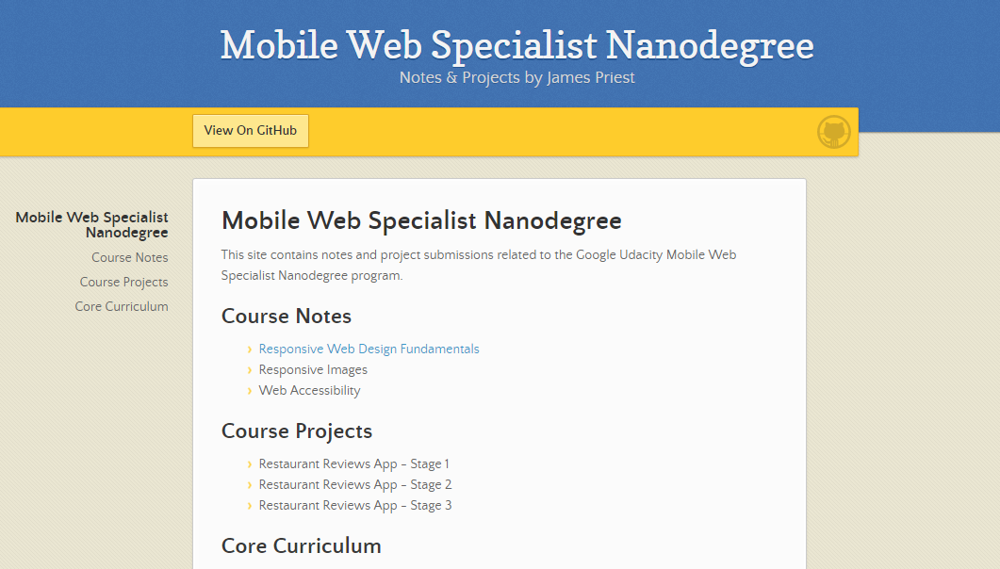

<!-- markdownlint-disable MD022 MD032 -->
# Mobile Web Specialist Nanodegree
This site contains my notes and project submissions related to the Google Udacity Mobile Web Specialist Nanodegree program.

Website: [https://james-priest.github.io/udacity-nanodegree-mws/](https://james-priest.github.io/udacity-nanodegree-mws/)

## Study Notes
### Stage 1
- [Responsive Web Design Fundamentals](docs/course-notes/responsive-web-design-fundamentals.md) (Lessons 1-5)
- [Responsive Images](docs/course-notes/responsive-images.md) (Lessons 6-9)
- [Web Accessibility](docs/course-notes/web-accessibility.md) (Lessons 16 & 17)
- [Offline Web Applications](https://github.com/james-priest/100-days-of-code-log-r2/blob/master/Introducing-the-Service-Worker.md) (Lesson 9-15)

### Stage 2
- [Asynchronous JavaScript Requests](docs/course-notes/asynchronous-javascript-requests.md)
- ES6 JavaScript Improved (Lessons 4-7)
- Offline Web Applications (Lesson 8)
- Web Tooling and Automation (Lessons 9-15)

### Stage 3
- Client Server Communication (Lessons 1-5)
- Requests, Responses, & Real World HTTP (Lessons 6-8)
- Browser Rendering Optimization (Lessons 9-14)

## Projects
- [Restaurant Reviews App - Stage 1](https://github.com/james-priest/mws-restaurant-stage-1)
  - [Code Log & Project Notes](https://james-priest.github.io/mws-restaurant-stage-1/)
- Restaurant Reviews App - Stage 2
- Restaurant Reviews App - Stage 3