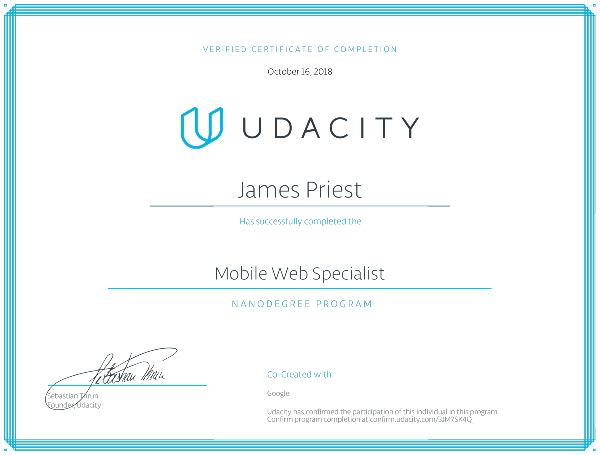
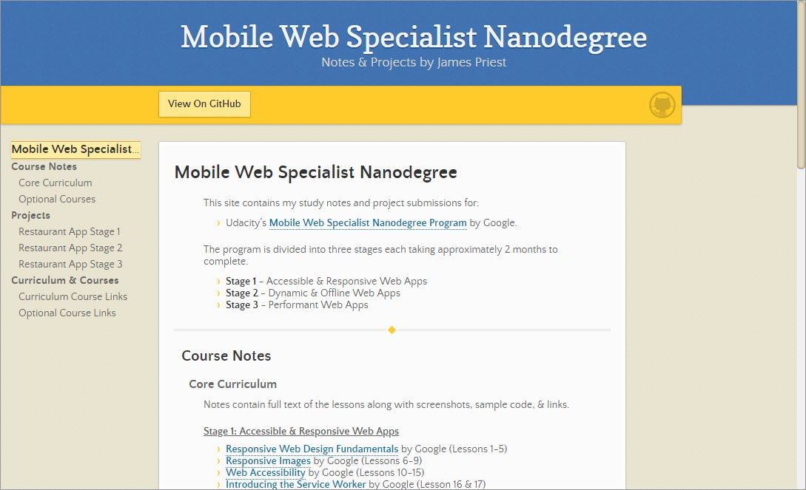

<!-- markdownlint-disable MD022 MD032 -->
# Mobile Web Specialist Nanodegree
This site contains my code notes and project submissions for the 6-month Udacity [Mobile Web Specialist Nanodegree](https://www.udacity.com/course/mobile-web-specialist-nanodegree--nd024) by Google.

## Course Notes
These notes contain lesson transcripts along with screenshots, sample code, & links.

### Stage 1
- [Responsive Web Design Fundamentals](docs/course-notes/responsive-web-design-fundamentals.md) by Google (Lessons 1-5)
- [Responsive Images](docs/course-notes/responsive-images.md) by Google (Lessons 6-9)
- [Web Accessibility](docs/course-notes/web-accessibility.md) by Google (Lessons 9 -15)
- [Introducing the Service Worker](https://github.com/james-priest/100-days-of-code-log-r2/blob/master/MWS-TOC.md) by Google (Lesson 16 & 17)

### Stage 2
- [Asynchronous JavaScript Requests](docs/course-notes/asynchronous-javascript-requests.md) by Google, AT&T, & GitHub (Lessons 1-3)
- [ES6 JavaScript Improved](https://github.com/james-priest/100-days-of-code-log-r2/blob/master/MWS-TOC.md) by Google, AT&T, & GitHub (Lessons 4-7)
- [IndexedDB and Caching](https://github.com/james-priest/100-days-of-code-log-r2/blob/master/MWS-TOC.md) by Google (Lesson 8)
- [Web Tooling and Automation](docs/course-notes/web-tooling-and-automation.md) by Google (Lessons 9-15)

### Stage 3
- [Client Server Communication](docs/course-notes/client-server-communication.md) by Google (Lessons 1-5)
- [HTTP & Web Servers](docs/course-notes/http-web-servers.md) by Google (Lessons 6-8)
- Browser Rendering Optimization by Google (Lessons 9-14)

### Optional Courses
- [JavaScript Promises](docs/course-notes/javascript-promises.md) by Google (Lessons 1 & 2)

## Projects
### Restaurant App Stage 1
- GitHub Repo: [Restaurant Reviews App - Stage 1](https://github.com/james-priest/mws-restaurant-stage-1/tree/stage-1)
- Documentation: [Code Notes & Walkthrough - Stage 1](https://james-priest.github.io/mws-restaurant-stage-1/stage1.html)

### Restaurant App Stage 2
- GitHub Repo: [Restaurant Reviews App - Stage 2](https://github.com/james-priest/mws-restaurant-stage-1/tree/stage-2)
- Documentation: [Code Notes & Walkthrough - Stage 2](https://james-priest.github.io/mws-restaurant-stage-1/stage2.html)

### Restaurant App Stage 3
- GitHub Repo: [Restaurant Reviews App - Stage 3](https://github.com/james-priest/mws-restaurant-stage-1/tree/stage-3)
- Documentation: [Code Notes & Walkthrough - Stage 3](https://james-priest.github.io/mws-restaurant-stage-1/stage3.html)

## My Project Website

Website: [https://james-priest.github.io/udacity-nanodegree-mws/](https://james-priest.github.io/udacity-nanodegree-mws/)