<!-- markdownlint-disable MD022 MD024 MD032 -->
<!-- # Mobile Web Specialist Nanodegree -->
# Asynchronous JavaScript Requests

[<-- back to Mobile Web Specialist Nanodegree homepage](../index.html)

---

### Supporting Links
#### APIs
- [Google's APIs](https://developers.google.com/apis-explorer/) - All the Google services you can imagine.
- [Programmable Web's API directory](http://www.programmableweb.com/apis/directory) - A giant database of APIs
- [Udacity API](https://www.udacity.com/public-api/v1/catalog) - API to access and share the catalog of courses.


## Lesson 1. Ajax with XHR
### 1.1 Course Intro
Welcome to this course on Ajax.

The main concept of Ajax is simple. You make a request for some data and then without pausing everything to wait for the requests to return, you just move on and do something else.

[](../assets/images/ajax1-1.jpg)

Then once the request finally does get returned, you deal with it. Really that's Ajax in a nutshell.

Now Ajax used to be an acronym for asynchronous JavaScript and XML and you'll still kind of see it that way but it's a bit of a misnomer now. Instead, Ajax is the concept of asynchronously requesting data whether that's an XML file a JavaScript file or JSON from a REST API.

It really doesn't matter what the data is. You just request the data asynchronously and then deal with it when it comes back.

In this course you'll learn to make Ajax requests using JavaScript. First, we'll look at doing this with the tried and true xhr object. Then we'll look at how jQuery makes Ajax requests in lesson two. Finally in lesson three we'll check out the new and massively improved way of making async
requests using the fetch API.

You're gonna love it.

So my mom's birthday is coming up soon and I need to make a cake for her. So, while I go to the store to get the ingredients, some of my friends are going to help demo how Ajax communication works when interacting with a server.

### 1.2 Client Server Demo
Let's start with what a request is. It's actually pretty useful to imagine the internet as a bunch of people who are just simply sending messages back and forth.

[](../assets/images/ajax1-2.jpg)

For this example,

1. I'll be the client, which means that I'm actually a browser like Chrome or Firefox.
2. Jessica represents the internet. She is the middleman and will be passing information back and forth.
3. Ben here is the server, which means that he's computer dedicated to providing content to browsers like me.

If I want something from Ben, I'll send a GET Request to him. A **GET Request** is a message that tells him who I am and what I want.

So, got my message, Jessica takes it and passes it to Ben. Ben, the server, looks at my message and then sends back what I requested. This is called a **Response**. I can open the response and then do something with it.

In order for a website to open, it performs many requests for data, like Ben and I are doing right now. Most of the time, the response is critical for the page to load. For instance, I must have Ben's HTML to load the page and the CSS to lay it out.

When your browser makes a request synchronously, or without AJAX, it has to wait for responses before proceeding with the load.

**AJAX is special because it allows these types of requests asynchronously, which means that they can happen in the background without blocking the rest of the page load.**

Let's take this analogy just a little bit further. Let's imagine I send off a get request to Ben, but I've got some plans in mind for what I want to do with it when the response gets back.

So, when I send off the request, I will take the instructions and set them aside for myself. And they'll patiently wait right here. And now, I'm free to go off and work on other tasks.

When Ben's response eventually gets back, I'll open up the response, take a look at my instructions, and then do something with them.

These instructions that I set aside are called a **callback**, in that I call them when I get a response back.

#### Vocabulary
- **GET Request:** An internet request for data. Sent from a client to a server.
- **Response:** A server's response to a request. Sent from a server to a client. A response to a GET request will usually include data that the client needs to load the page's content.

### 1.3 Ajax Definitions & Examples
[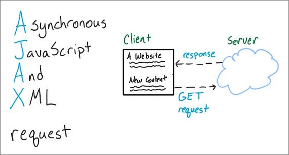](../assets/images/ajax1-3.jpg)

Ajax requests allow for content retrieval and display without reloading the webpage.

Asynchronous in  Ajax refers to the fact that the request doesn't block other events from happening. Instead the page keeps on doing its thing and then only acts on the data when it gets for his turn by the server.

Ajax requests occur in a number of different ways and with varying levels of difficulty. Some require an API key, others use OAuth, and some don't use any authentication at all.

And the data returned by different Ajax requests differs too.

[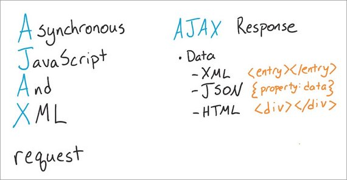](../assets/images/ajax1-4.jpg)

The X and Ajax stands for XML which used to be the dominant hierarchical data format but today JSON is much more popular. In fact, most Ajax requests nowadays are actually AJAJ requests - standing for asynchronous JavaScript and JSON requests, but it doesn't sound as nice so we still just call them Ajax.

Embedded within Ajax responses it's pretty common to see HTML which websites can use to fill in part of the page.

#### History lesson
JavaScript frameworks and Single Page Apps are the way to build today, but let's review where we've come from.

In the traditional server-rendered web application, the client computer makes a request for a web page. The server creates and returns a page to the client. Finally, the client loads the new page and displays the information. If they interact with the page, say to add or remove something by submitting a form, they start the cycle all over again. The client will make another request, the server returns a totally new page, the client loads and presents it to the user again.

Up until the mid 2000s, this was basically the only way internet communication occurred. Information would reside on the server, and a client would request that data and refresh the page and display it. This cycle would repeat for each and every new page request.

In the late 90s, the Microsoft Outlook team added the XMLHTTP component to Internet Explorer and built a web version of the Outlook mail client. This code was later picked up by other browsers as XMLHttpRequest. This allowed browsers to make HTTP requests from Javascript and update the current page in place without fetching an entire page from the server. Instead of the synchronous model of waiting for a whole page, the user interface could update asynchronously as the user kept working. Most of the data being exchanged used the XML format.

AJAX
In 2005, Jesse James Garrett coined the term AJAX to mean “Asynchronous Javascript and XML”. This is essentially the technique of using XMLHTTPRequest to fetch data and then modify the current page.

AJAX took the web world by storm, spreading far beyond Microsoft Outlook. State-of-the-art web applications like Flickr, GMail, and Google Maps rapidly adopted it. Instead of having to wait for data and have the entire page refresh, these new, near instantaneous applications were incredible.

Browser Inconsistencies
Hold up, though. Ajax wasn't all ponies and rainbows. There were several different, incompatible browser implementations and developers were forced to code for one browser or write complex code for them all. Eventually, JavaScript libraries like jQuery and YUI emerged to reconcile the differences.

AJAX apps were great, but difficult for individual developers to write; as browsers kept changing, and people demanded apps on more devices, the code then became more and more complex and confusing. This challenge led to the rise of standard Javascript frameworks and libraries. JavaScript libraries arose to hide the complex browser differences, JavaScript frameworks made developing complex, powerful applications manageable.

### 1.4. APIs
#### Getting Data
We've looked at the concepts of Ajax and that it's the technology we'll use to add data to our project asynchronously. But where is this data coming from? And how do we get access to it? How will our app know how to retrieve that data.

We'll be using an **API** to interact with various data sources.

#### What's an API?
The acronym "API" stands for:

- **A**pplication **P**rogramming **I**nterface

There's data out there that's just waiting to be used. Most of the data-rich applications you use get their data from 3rd party websites. They actually fetch this data using APIs. In the video below, Cameron will demo how Reddit uses APIs for added interactivity on its site.

#### Available APIs
There are tons of API's available on the web that readily serve up interesting information and they're usually free to use so long as you aren't making thousands of requests per hour.

For instance Google offers a ton of API's including Google Analytics, Google Maps, & Google Fonts. 

[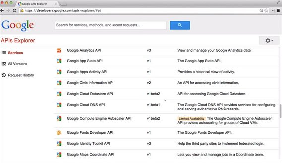](../assets/images/ajax1-5.jpg)

Looking around the web it isn't hard to find examples of websites that use external API's to create interesting interactions for users.

Reddit and the Reddit Enhancement Suite Chrome Plugin interact with a few different APIs to make reddit feel more dynamic.

When a user clicks on a link that resolves to a YouTube video, reddit opens up an embedded YouTube player which interacts with the YouTube API.

[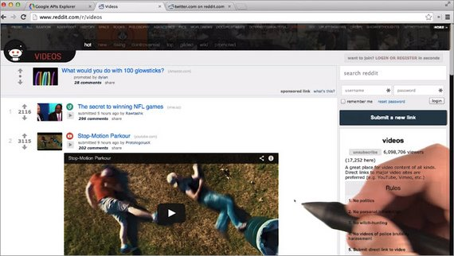](../assets/images/ajax1-6.jpg)

When a user opens up a link to a Twitter feed, the reddit enhancement sweet chrome plug-in fires off an ajax request for twitter data.

It then uses the Twitter API to open up the tweet right here inside the page.

[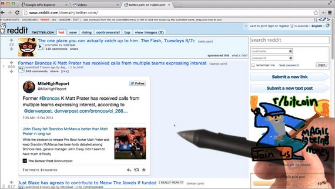](../assets/images/ajax1-7.jpg)

#### Resources
- [Google's APIs](https://developers.google.com/apis-explorer/) - All the Google services you can imagine.
- [Programmable Web's giant database of APIs](http://www.programmableweb.com/apis/directory) - This is definitely worth skimming for some inspiration.
- [Udacity API](https://www.udacity.com/public-api/v1/catalog) - It's available for anyone to use. We want to make it easy for developers to access and share our catalog of courses.

### 1.5 XHR Async Request
It's cake baking time! Now before you can make a cake you need all of the ingredients to build it. So, we have the cake mix, we have eggs, milk, and butter.

[](../assets/images/ajax1-8.jpg)

So we have everything we need so I'll turn on the oven and then we can start making it.

> [Music plays while the cake batter is prepared.]
> 1. Cake mix is put into a bowl
> 2. Eggs added, milk added, butter added
> 3. Ingredients are mixed into a batter
> 4. Batter is poured into a pyrex container
> 5. Pyrex container is put into the oven

Done! Okay, so work with me here a bit...

I need the cake to be baked before i can add frosting. And I've requested the oven to take the cake batter and turn it into a cake. When it's done, the timer will beep letting me know that I can get the cake back.

But I don't need to sit here and wait around for the cake to bake. I could go do something else. I could even make the frosting right now.

An XHR object is provided by the JavaScript environment and is used to make ajax requests. It's like this initial prep stage of making the cake batter.

You have to manually do a lot of the steps to get the request set up and finally sent off. But then your code can continue on and do other things.

When the response does come back it's been prepped to handle the return data.

With this analogy in mind let's look at the XHR object in detail.

### 1.6 The XHR Object
Just like how the `document` boject is provided by the JavaScript engine, the JavaScript engine also provides a way for us to make asynchronous HTTP requests. We do that with an `XMLHttpRequest` object. We can create these objects with the provided `XMLHttpRequest` constructor function.

One of the best ways to learn is to get your hands dirty and try things out! So go to [Unsplash](https://unsplash.com/), open up the developer tools, and run the following on the console:

```js
const asyncRequestObject = new XMLHttpRequest();
```

Confusingly, the constructor function has "XML" in it, but it's not limited to only XML documents. 

Remember that the "AJAX" acronym used to stand for "Asynchronous JavaScript and XML". Since the main file format that was originally used for asynchronous data exchange were XML files, it's easy to see why the function is called `XMLHttpRequest`.

XMLHttpRequests (commonly abbreviated as XHR or xhr) can be used to request any file type (e.g. plain text files, HTML files, JSON files, image files, etc.) or data from an API.

**Note:** We'll be digging into the XMLHttpRequest object. We'll look at how to create it, what methods and properties need to be used, and how to actually send asynchronous requests. For even more info on using the XHR object to make async requests, check out these links:

- [MDN's XMLHttpRequest doc](https://developer.mozilla.org/en-US/docs/Web/API/XMLHttpRequest/open)
- [WHATWG XHR Spec](https://xhr.spec.whatwg.org/)
- [W3C XMLHttpRequest Spec](https://www.w3.org/TR/XMLHttpRequest/)

### 1.7 XHR .open() method
So we've constructed an XHR object named asyncRequestObject. There are a number of methods that are available to us. One of the most important is the open method.

```js
asyncRequestObject.open();
```

`.open()` takes a number of parameters, but the most important are its first two: the HTTP method URL to send the request

If we want to asynchronously request the homepage from the popular high-res image site, Unsplash, we'd use a `GET` request and provide the URL:

```js
asyncRequestObject.open('GET', 'https://unsplash.com');
```

#### HTTP methods
The main two that you'll be using are:

- `GET` - to retrieve data
- `POST` - to send data

For more info, check out the Udacity course [HTTP & Web Servers](https://classroom.udacity.com/courses/ud303).

> **Warning:** For security reasons, you can only make requests for assets and data on the same domain as the site that will end up loading the data. For example, to asynchronously request data from google.com your browser needs to be on google.com. This is known as the [same-origin policy](https://developer.mozilla.org/en-US/docs/Web/Security/Same-origin_policy). This might seem extremely limiting, and it is!
>
>The reason for this is because JavaScript has control over so much information on the page. It has access to all cookies and can determine passwords since it can track what keys are pressed. However, the web wouldn't be what it is today if all information was bordered off in its own silos. The way to circumvent the same-origin policy is with [CORS](https://developer.mozilla.org/en-US/docs/Web/HTTP/Access_control_CORS) (Cross-Origin Resource Sharing). CORS is a technology that is implemented on the server. Services that provide APIs use CORS to allow developers to circumvent the same-origin policy and access their information.

#### Question 1 of 2
Go to Google, open up the developer tools, and run the following on the console:

```js
const req = new XMLHttpRequest();
req.open('GET', 'https://www.google.com/');
```

What happens?

- [ ] The Google homepage open in the browser
- [ ] An async request sent to [https://www.google.com](https://www.google.com)
- [x] Nothing happens
- [ ] An error occurs

##### Why
The XHR's `.open()` method **does not actually send the request**! It sets the stage and gives the object the info it will need when the request is actually sent.

A bit anti-climactic… So let's actually send the request!

#### Question 2 of 2
An XHR object's `.open()` method can take a number of arguments. Use [the MDN XMLHttpRequest.open() documentation](https://developer.mozilla.org/en-US/docs/Web/API/XMLHttpRequest/open) to explain what the following code does:

```js
const myAsyncRequest = new XMLHttpRequest();
myAsyncRequest.open('GET', 'https://udacity.com/', false);
```

- [ ] Nothing special, this is the standard way `.open()` works.
- [ ] The request is sent immediately
- [x] The JavaScript freezes and waits until the request is returned.

##### Why
Passing `false` as the third option makes the XHR request become a synchronous one.

This will cause the JavaScript engine to pause and wait until the request is returned before continuing - this "pause and wait" is also called "blocking".

This is a terrible idea and completely defeats the purpose for having an asynchronous behavior. Make sure you never set your XHR objects this way!

Instead, either pass true as the 3rd argument or leave it blank (which makes it default to true).'

### 1.8 XHR's .send() method
To actually send the request, we need to use the [send method](https://developer.mozilla.org/en-US/docs/Web/API/XMLHttpRequest/send):

```js
asyncRequestObject.send();
```

Let's check out what happens:

[](../assets/images/ajax1-9.jpg)

We just saw that running this code doesn't do anything. Well, that's not actually true because something does happen.

A request is actually sent. We can see this if we check out the network pane. We want to record network traffic so make sure dev tools is recording. The record button is red so I know it's recording.

[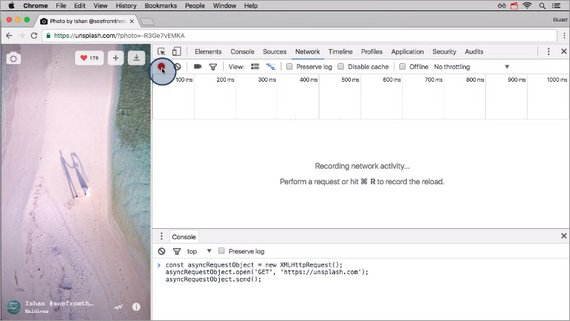](../assets/images/ajax1-10.jpg)

If it's not red then just click on it to turn the recording feature on.

Now if I come down here and run the request it actually sends. The request is shown below.

[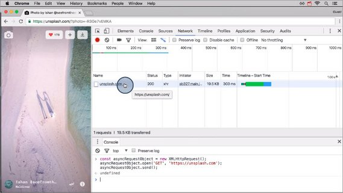](../assets/images/ajax1-11.jpg)

Let's stop recording for now.

If I select the request we can see its headers. 

[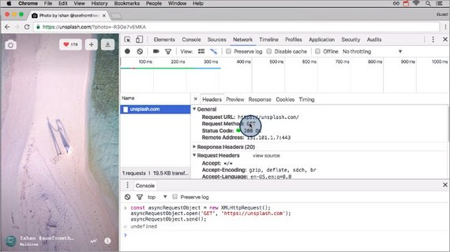](../assets/images/ajax1-12.jpg)

Here's the URL that we requested and the request method. We can also see a preview of the request and then the response pane contains the actual HTML of the response.

So even though nothing happens to the page or in the code, the request is actually sent.

Now, it's a little pointless to make a request for something but then do absolutely nothing with it! Why would you order some cake and then not go to pick it up or not eat it?

#### Handling Success
To handle the successful response of an XHR request, we set the [XMLHttpRequest onload property](https://developer.mozilla.org/en-US/docs/Web/API/XMLHttpRequestEventTarget/onload) on the object to a function that will handle it:

```js
function handleSuccess () {
  // the `this` value is the XHR object
  // this.responseText holds the response from the server
  console.log( this.responseText ); // the HTML of https://unsplash.com/
}

asyncRequestObject.onload = handleSuccess;
```

As we just saw, if `onload` isn't set, the request *does* return... but nothing happens with it.

#### Handling Errors
You might've picked up that **onload** is called when the response is *successful*. If something happens with the request and it can't be fulfilled, then we need to use the **onerror property**:

```js
function handleError () {
  // the `this` value is the XHR object
  console.log( 'An error occurred 😞' );
}

asyncRequestObject.onerror = handleError;
```

As with `onload`, if `onerror` isn't set and an error occurs, that error will just fail silently and your code (and your user!) won't have any idea what's wrong or any way to recover.

### 1.9 A Full Request
Here's what we've built so far.

```js
function handleSuccess () {
  console.log( this.responseText ); // the HTML of https://unsplash.com/
function handleError () {
  console.log( 'An error occurred.😞' );
}

const asyncRequestObject = new XMLHttpRequest();
asyncRequestObject.open('GET', 'https://unsplash.com');
asyncRequestObject.onload = handleSuccess;
asyncRequestObject.onerror = handleError;
asyncRequestObject.send();
```

- Const to assign the newly created the XHR object to
- Open method to tell it what info to request
- Assignment of handlers for a success or error
- Call send method on XHR object to send the request

#### APIs and JSON
Getting the HTML of a website is ok, but it's probably not very useful. The data it returns is in a format that is extremely difficult to parse and consume.

It's a lot easier if we get just the data we want in an easily formatted data structure. The format for this is JSON.

Instead of requesting the base URL for Unsplash, let's create an app that pulls an image from Unsplash's API and relevant articles from the New York Times.

When making a request from an API that returns JSON, all we need to do is convert that JSON response into a JavaScript object.

We can do that with `JSON.parse();`. Let's tweak the onload function to handle a JSON response:

```js
function handleSuccess () {
  // convert data from JSON to a JavaScript object
  const data = JSON.parse( this.responseText );
  console.log( data );
}

asyncRequestObject.onload = handleSuccess;
```

### 1.10 Project Walkthrough
This is the project that we'll be building. 

[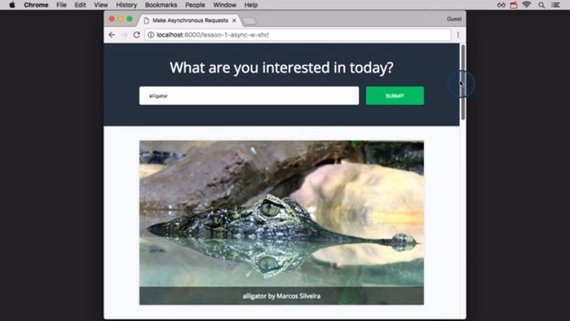](../assets/images/ajax1-13.jpg)

There's a form that lets you search for something you're interested in. It displays an image and some articles about it.

[](../assets/images/ajax1-14.jpg)

This is how it will work when it's finished.

Now let me revert to the start of the project. This is what the project looks like right now.

[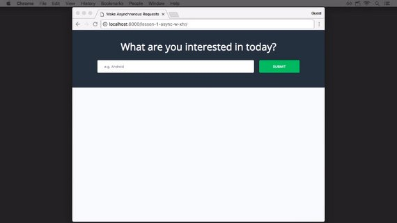](../assets/images/ajax1-15.jpg)

Currently it's just a form.

Here's the code for the HTML form and this is the part of the page that will get populated with the data from the response.

[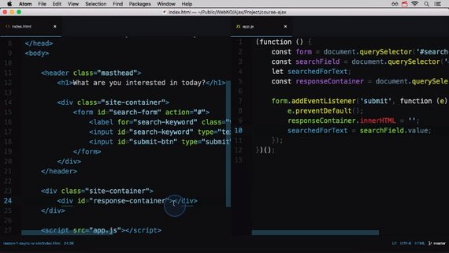](../assets/images/ajax1-16.jpg)

Here in the JavaScript file we're storing all of the necessary DOM elements and we have an event listener for the form.

[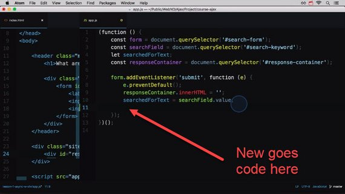](../assets/images/ajax1-17.jpg)

In here is where we'll kick off the async requests. So let's get going.

#### Download the Starter Code
The starter project is on GitHub: [https://github.com/udacity/course-ajax](https://github.com/udacity/course-ajax). You can clone the project by running the following Git command in your terminal:

```bash
git clone https://github.com/udacity/course-ajax.git
```

Once you've cloned the project, you'll notice that it has three separate folders:

1. lesson-1-async-w-xhr
2. lesson-2-async-w-jQuery
3. lesson-3-async-w-fetch

Make sure to work on the files for the correct lesson. Since this is the *first* lesson, we'll be working in the `lesson-1-async-w-xhr` directory.

#### Create Your Accounts
To complete these final steps, you'll need accounts with Unsplash and The New York Times.

##### Unsplash
- Create a developer account here - [https://unsplash.com/developers](https://unsplash.com/developers)
- Next, create an application here - [https://unsplash.com/oauth/applications](https://unsplash.com/oauth/applications)
  - this will give you an "Application ID" that you'll need to make requests

##### The New York Times
- Create a developer account here - [https://developer.nytimes.com/](https://developer.nytimes.com/)
- They'll email you your api-key (you'll need this to make requests)

#### Unsplash Request
In our app, the variable `searchedForText` contains the text we're interested in, and we'll set the `onload` property to a function called `addImage` (which is a do-nothing function that we'll flesh out in a moment). If we temporarily set `searchedForText` to "hippos", the code for the XHR call to Unsplash is:

```js
function addImage(){}
const searchedForText = 'hippos';
const imgRequest = new XMLHttpRequest();

imgRequest.open('GET', 
  `https://api.unsplash.com/search/photos?page=1&query=${searchedForText}`);
imgRequest.onload = addImage;
imgRequest.send()
```

...but if you try running this code, you'll get an error.

#### Quiz Question
The request for Unsplash doesn't work because it needs an HTTP header to be sent along. What is the XHR method to add a header to the request? Check out the [XMLHttpRequest documentation on MDN](https://developer.mozilla.org/en-US/docs/Web/API/XMLHttpRequest) for help!

- [ ] .includeRequestHeader()
- [ ] .addHeader()
- [x] .setRequestHeader()
- [ ] .sendHeader()

### 1.11 Set Request Header
#### Unsplash.com Images
The XHR method to include a header with the request is [setRequestHeader](https://developer.mozilla.org/en-US/docs/Web/API/XMLHttpRequest/setRequestHeader). So the full code needs to be:

```js
const searchedForText = 'hippos';
const imgRequest = new XMLHttpRequest();

imgRequest.open('GET',
  `https://api.unsplash.com/search/photos?page=1&query=${searchedForText}`);
imgRequest.onload = addImage;
imgRequest.setRequestHeader('Authorization', 'Client-ID <client-id>');
imgRequest.send();

function addImage(){
  debugger; // break debugger at this point...
}
```

After the request returned successfully let's pause inside the function to check out what's been returned.

To do that let's add a debugger inside the `addImage()` function.

[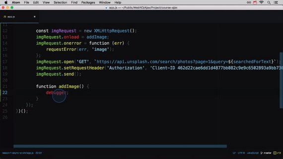](../assets/images/ajax1-18.jpg)

Now if I refresh the page and search for flamingo's it'll pause. The `this` value is the xhr object itself and the response is stored in `responseText`.

[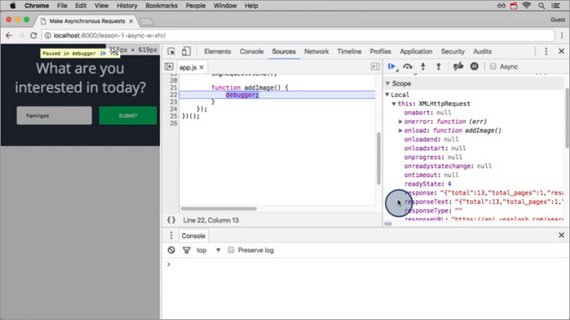](../assets/images/ajax1-19.jpg)

This is a JSON response and shows all of the text. We can see this information a lot more easily in the network pane. This request returned 13 responses.

[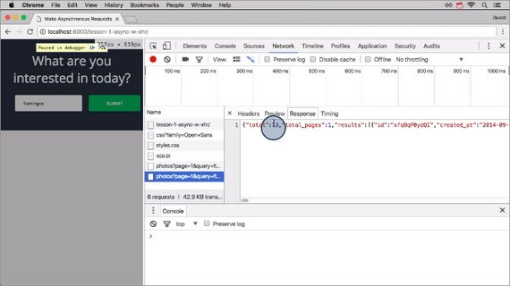](../assets/images/ajax1-20.jpg)

So we need to:

1. convert the response from JSON into a JavaScript object
2. get the first image
3. format the data
4. add it to the page.

<!-- [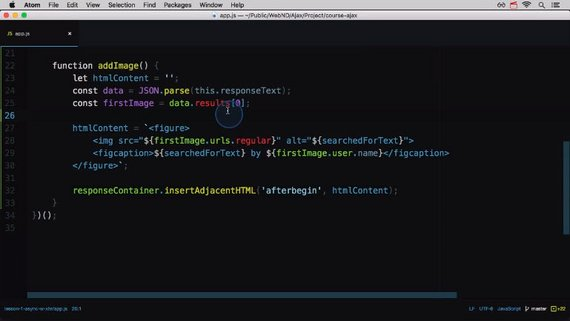](../assets/images/ajax1-21.jpg) -->

```js
function addImage() {
  let htmlContent = '';
  const data = JSON.parse(this.responseText);
  const firstImage = data.results[0];

  htmlContent = `<figure>
    
    <figcaption>${searchedForText} by ${firstImage.user.name}</figcaption>
  </figure>`;

  responseContainer.insertAdjacentHTML('afterbegin', htmlContent);
}
```

This code will add a `<figure>` element with an image pointing to the image from unsplash and a caption of the person that took the photo.

It will add this inside the response container as the first element.

Now we also want to make sure that we handle the case if no images are returned. We add in a check to
make sure there are some image results returned.

<!-- [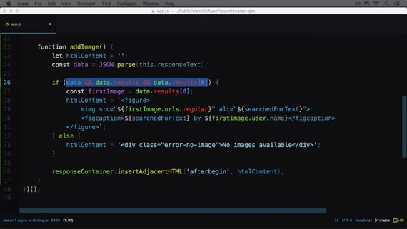](../assets/images/ajax1-22.jpg) -->

```js
function addImage() {
  let htmlContent = '';
  const data = JSON.parse(this.responseText);
  
  if (data && data.results && data.results[0]) {
    const firstImage = data.results[0];
    htmlContent = `<figure>
      
      <figcaption>${searchedForText} by ${firstImage.user.name}</figcaption>
    </figure>`;
  } else {
    htmlContent = '<div class="error-no-image">No images available</div>';
  }
  
  responseContainer.insertAdjacentHTML('afterbegin', htmlContent);
}
```

If there aren't any, then we'll just display a message that there are no images.

### 1.11b NY Times Request
#### NY Times Articles
Since the New York Times doesn't require a specific header, we don't need to do anything special with adding a header.

We'll set the `onload` property to the function `addArticles` that we'll flesh out in a minute:

```js
function addArticles () {}
const articleRequest = new XMLHttpRequest();
articleRequest.onload = addArticles;
articleRequest.open('GET',
  `http://api.nytimes.com/svc/search/v2/articlesearch.json?
    q=${searchedForText}&api-key=<your-API-key-goes-here>`);
articleRequest.send();
```

Make sure to fill in the URL above with the API key you received in an email from the New York Times after signing up as a developer.

##### Solution
I've added a debugger and searched for Lion. 

If I go to the Network tab in DevTools I can click on the Ajax request. This will allow me to click on the Preview tab to the right and view the hierarchical data returned.

We can see that the response has a nested `response` object and inside that the `docs` property holds all of the articles.

[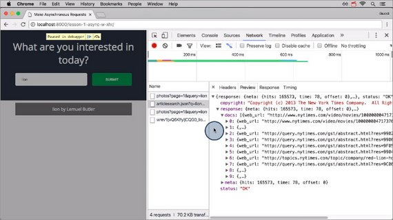](../assets/images/ajax1-23.jpg)

So we need to convert the response from JSON into a JavaScript object.

```js
function addArticles() {
  let htmlContent = '';
  const data = JSON.parse(this.responseText);

  if (data && data.response.docs && data.response.docs[0]) {
    htmlContent = '<ul>' + data.response.docs.map(article =>
      `<li class="article">
        <h2><a href="${article.web_url}">${article.headline.main}</a></h2>
        <p>${article.snippet}</p>
      </li>`
    ).join('') + '</ul>';
  } else {
    htmlContent = '<div class="error-no-articles">No article available</div>';
  }
  
  responseContainer.insertAdjacentHTML('beforeend', htmlContent);
}
```

If some articles have been returned, we map over each article and then return a list item that contains the article's headline and a snippet of the article.

Finally we combine all article list items together inside an unordered list tag. This gets added to the bottom of the page inside the response container.

[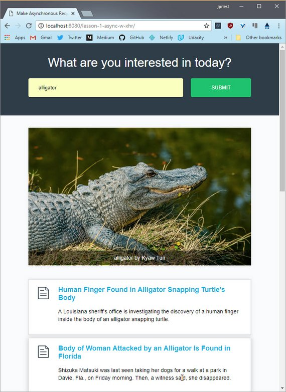](../assets/images/ajax1-24.jpg)

If there are no articles then it just displays the text no articles available.

### 1.12 Final Walkthough
let's see our app in action.

Looking at the code one last time, we set up a listener for when the form is submitted. This listener contains the code below.

Our async requests are kicked off. One to unsplash.com and one to the New York Times.

When the unsplash request returns, it calls the `addImage()` function.
When the New York Times request returns, it calls the `addArticles()` function.

Both of these functions convert the response from JSON, extract the data, and then add it
to the page.

There are a number of moving parts to handle asynchronous requests but it's pretty straight forward.

```js
const imgRequest = new XMLHttpRequest();
imgRequest.open('GET', 
  `https://api.unsplash.com/search/photos?page=1&query=${searchedForText}`);
imgRequest.onload = addImage;
imgRequest.onerror = handleError;
imgRequest.setRequestHeader('Authorization', 'Client-ID <clinet-id-key>');
imgRequest.send();

function handleError(error) {
  console.log('An error occurred.😞');
  console.log('error:', error);
}

function addImage() {
  let htmlContent = '';
  const data = JSON.parse(this.responseText);
  
  if (data && data.results && data.results[0]) {
    const firstImage = data.results[0];
    htmlContent = `<figure>
      
      <figcaption>${searchedForText} by ${firstImage.user.name}</figcaption>
    </figure>`;
  } else {
    htmlContent = '<div class="error-no-image">No images available</div>';
  }
  
  responseContainer.insertAdjacentHTML('afterbegin', htmlContent);
}

const articleRequest = new XMLHttpRequest();
articleRequest.onload = addArticles;
articleRequest.open('GET', 
  `http://api.nytimes.com/svc/search/v2/articlesearch.json?
  q=${searchedForText}&api-key=<api-key>`);
articleRequest.send();

function addArticles() {
  let htmlContent = '';
  const data = JSON.parse(this.responseText);
  if (data && data.response.docs && data.response.docs[0]) {
    htmlContent = '<ul>' + data.response.docs.map(article =>
      `<li class="article">
        <h2><a href="${article.web_url}">${article.headline.main}</a></h2>
        <p>${article.snippet}</p>
      </li>`
    ).join('') + '</ul>';
  } else {
    htmlContent = '<div class="error-no-articles">No article available</div>';
  }

  responseContainer.insertAdjacentHTML('beforeend', htmlContent);
}
```

### 1.13 XHR Review
There are a number of steps you need to take to send an HTTP request asynchronously with JavaScript.

#### To Send An Async Request
- create an XHR object with the `XMLHttpRequest` constructor function
- use the `.open()` method - set the HTTP method and the URL of the resource to be fetched
- set the `.onload` property - set this to a function that will run upon a successful fetch
- set the `.onerror` property - set this to a function that will run when an error occurs
- use the `.send()` method - send the request

#### To Use The Response
- use the `.responseText` property - holds the text of the async request's response

> **Note:** The original XHR specification was created in 2006. This was version 1 of the specification. A number of years with minimal changes to the spec.
>
> In 2012, work was started on a version 2 of the XHR specification. In 2014, the XHR2 spec was merged into the XHR1 spec so that there wouldn't be diverging standards. There are still references to XHR2, but the XHR specification now fully incorporates XHR2.
>
> Check out this HTML5Rocks article for info on the[ new tricks in XHR2](http://www.html5rocks.com/en/tutorials/file/xhr2/) that are now in the XHR spec.

### 1.14 XHR Wrap-up
We just looked at using the XHR object to create and send asynchronous requests.

As you saw, there are a number of steps to create an XHR object, handle a successful request, and deal with errors.

It was a lot of code, but do we really need to write all of that code every single time we want to send an asynchronous request?

When using the XHR object the answer is yeah. But you don't always have to use the XHR object to make async requests. You could use some third-party library like jquery to make the request for you.

Check out the next lesson to see how jquery makes async requests.

## Lesson 2: Ajax with jQuery
### 2.1 JQuery & Ajax
Welcome back. So it turns out that the cake I made wasn't the prettiest thing in the world. It should taste great, but it looks kind of awful.

[](../assets/images/ajax1-1.jpg)

Totally not something I can show up with and be proud of having at a birthday party. So instead of me baking the cake and frosting it, let's just have a professional do it.

With the original cake, I had to get all the ingredients, combine them myself, watch it while it's in the oven, make the frosting, and then actually frost it. I had to do everything myself. It was just too much.

Now, I just requested the bakery to make it for me. They're working on it now and will let me know when it's ready to come back and pick it up.

So, I'm not doing all the work this time, but that doesn't mean it's not being done. Someone there is doing all of the same steps that I did in the previous lesson.

So when you use a JavaScript library like jQuery to make async requests, you just request the data and then jQuery does all of the hands-on work under the hood. Let's check it out.

#### jQuery
jQuery is an incredibly popular JavaScript library that provides a lot of functionality right out of the box. It was created a number of years ago back when browsers hadn't joined together to standardize on functionality. jQuery made life easier for developers that were building websites that had to function in all of the major browsers by providing a unified interface. The developer would use jQuery-specific functions and then jQuery would figure out what code to run depending on the browser that was being used.

jQuery is just JavaScript, so you'd[ download a current version](https://code.jquery.com/) and link to it with a regular `<script>` tag. Once it's been included it on the page, you've got this powerhouse of functionality right at your fingertips.

Now that browsers have pretty much aligned, jQuery's usage is not as necessary as it was several years ago. However, one powerful tool that it provides is it's `ajax()` method. As its name suggests, jQuery's `ajax()` method is used to handle all asynchronous requests.

Let's see it in action.

> ##### Wanna Learn jQuery
> jQuery is incredibly popular and used by hundreds of thousands of sites. If you want dig deeper into this cool JavaScript library, check out Udacity's [Intro to jQuery](https://www.udacity.com/course/intro-to-jquery--ud245) course.

### 2.2 jQuery ajax() Method
The [`.ajax()` method](http://api.jquery.com/jquery.ajax/) is at the heart of all asynchronous requests for the entire jQuery library. There are a couple of ways you can call the `.ajax()` method:

```js
$.ajax(<url-to-fetch>, <a-configuration-object>);

// or 

$.ajax(<just a configuration object>);
```

The most common way to use the `.ajax()` method is with just the configuration object, since everything can be set inside the configuration object.

#### What's a "configuration object"
A configuration object is just a plain ol' JavaScript object that's used to configure something. For example:

```js
var settings = {
   frosting: 'buttercream',
   colors: ['orange', 'blue'],
   layers: 2,
   isRound: true
};
```

...the settings configuration object can be used in the imaginary MakeCake constructor function:

```js
const myDeliciousCake = MakeCake( settings );
```

Alternatively, the settings object could be passed in directly:

```js
const myDeliciousCake = MakeCake({
   frosting: 'buttercream',
   colors: ['orange', 'blue'],
   layers: 2,
   isRound: true
});
```

#### Making an Ajax call
jQuery's .ajax() method has to be incredibly versatile and powerful if it's what powers all of jQuery's asynchronous requests. A simple Ajax request would look like this:

```js
$.ajax({
    url: 'https://swapi.co/api/people/1/'
});
```

Let's test it out!

1. go to the jQuery website
2. open up your browser's developer tools
3. make sure the network traffic is being recorded
    - in Chrome, switch to the network pane
4. add the request above to the console
5. ...and run it!

[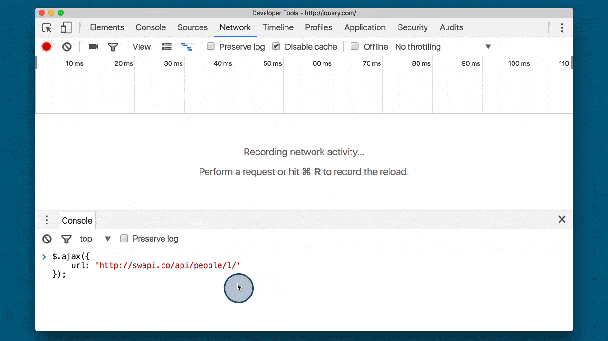](../assets/images/fixed/ud109-l2-swapi-request.gif)
**Running an asynchronous request in the console. The request is for a resource on SWAPI. The request is displayed in the network pane.**

So we can make a request with `.ajax()`, but we haven't handled the response yet.

### 2.3 Handling Returned Data
If you recall from setting up an XHR object, the response was handled by a function. It's the same thing with the `.ajax()` method.

We can chain onto `.ajax()` with a `.done()` method. We pass the `.done()` method a function that will run when the Ajax call is done!

```js
function handleResponse(data) {
    console.log('the ajax request has finished!');
    console.log(data);
}

$.ajax({
    url: 'https://swapi.co/api/people/1/'
}).done(handleResponse);
```

[](../assets/images/fixed/ud109-l2-swapi-request-with-done.gif)
**Asynchronous call set up with a `done` method to handle the response. The request is made, and then the response is logged to the console.**

Let's convert the existing, plain XHR call with jQuery's `.ajax()`. This is what the app currently has:

```js
const imgRequest = new XMLHttpRequest();
imgRequest.onload = addImage;
imgRequest.open('GET',
  `https://api.unsplash.com/search/photos?page=1&query=${searchedForText}`);
imgRequest.setRequestHeader('Authorization', 'Client-ID <client-id-here>');
imgRequest.send();
```

A lot of this information is handled behind the scene by jQuery, so here's the first step in the conversion:

```js
$.ajax({
  url: `https://api.unsplash.com/search/photos?page=1&query=${searchedForText}`
}).done(addImage);
```

With the jQuery code:

- we do not need to create an XHR object
- instead of specifying that the request is a `GET` request, it defaults to that and we just provide the URL of the resource we're requesting
- instead of setting `onload`, we use the `.done()` method

#### Quiz Question
The only change that needs to be made is including the Client ID header along with the request so that Unsplash will verify the request.

Why don't you check out the [API for the .ajax() method](http://api.jquery.com/jQuery.ajax/) and select the code below that correctly adds an "Authorization" header to the request.

- [ ] option 1
  ```js
  $.ajax({
    url: `https://api.unsplash.com/search/photos?
      page=1&query=${searchedForText}`
  }).addHeader('Authorization', 'Client-ID <client-id-here>')
  .done(addImage);
  ```
- [ ] option 2
  ```js
  $.ajax({
    url: `https://api.unsplash.com/search/photos?
      page=1&query=${searchedForText}`,
    setHeader:[['Authorization', 'Client-ID <client-id-here>']]
  }).done(addImage);
  ```
- [ ] option 3
  ```js
  $.ajax({
    url: `https://api.unsplash.com/search/photos?
      page=1&query=${searchedForText}`,
    authorization: 'Client-ID <client-id-here>'
  }).done(addImage);
  ```
- [x] option 4
  ```js
  $.ajax({
    url: `https://api.unsplash.com/search/photos?
      page=1&query=${searchedForText}`,
    headers: {
      Authorization: 'Client-ID <client-id-here>'
    }
  }).done(addImage);
  ```

  The correct answer is option 4.

  A header is added to the request by passing a `headers` object as a property. Each key in the `headers` object is the name of the header, and the value is what will be used as the value for the header.

The request should send perfectly now. Fantastic work! But there seem to be issues with the response and how it's handled.

### 2.4 Success Callback Cleanup
Right now, content isn't getting added to the page. We need to clean-up the `addImage()` function. which gets called on success which is now the `.done()` method.

jQuery detects the response and if it's JSON, it will automatically convert it to JavaScript for us. How awesome is that!

So we only need to make a few tweaks to the existing code.

- First we condense the code by building the string literal inside the `insertAdjacentHTML()` method

Here's what it currently is:

```js
function addImage() {
  const data = JSON.parse(this.responseText);
  const firstImage = data.results[0];

  responseContainer.insertAdjacentHTML('afterbegin', `<figure>
      
      <figcaption>${searchedForText} by ${firstImage.user.name}</figcaption>
    </figure>`
  );
}
```

Now we need to change the first three lines from above to become this:

```js
function addImage(images) {
  const firstImage = images.results[0];

  responseContainer.insertAdjacentHTML('afterbegin', `<figure>
      
      <figcaption>${searchedForText} by ${firstImage.user.name}</figcaption>
    </figure>`
  );
}
```

#### What changed

- the function now has one parameter images
- this parameter has already been converted from JSON to a JavaScript object, so * the line that had JSON.parse() is no longer needed.
- the firstImage variable is set to the images.results first item

The code that adds the HTML to the response container hasn't changed at all!

### 2.4b NY Times Request
#### Replace NY Times XHR With $.Ajax()
Now that we've walked through converting one request from using XHR to jQuery's `.ajax()` method, why don't you give it a shot on your own and convert the second request!

Make sure to use the existing code as an example. If you get stuck, check out the documentation page.

When you're successfully converted the code to use jQuery's `.ajax()` method and fixed the callback function so it adds the data to the page, check the checkbox to continue.

### 2.5 Code Walkthrough
Here's the completed project that uses jQuery's Ajax method to asynchronously fetch the data.

Setting up the XHR object has been replaced with calls to `$.ajax()`, and the data is passed in directly as an object.

When the response is returned it's handled by the `.done()` method.

If there are any errors, then the `.fail()` method will display an error message letting the user know that content couldn't be loaded.

```js
$.ajax({
  url: `https://api.unsplash.com/search/photos?page=1&query=${searchedForText}`,
  headers: {
    Authorization: 'Client-ID <client-id-here>'
  }
}).done(
  addImage
).fail(function (err) {
  requestError(err, 'image');
});

function addImage(data) {
  let htmlContent = '';

  if (data && data.results && data.results.length > 1) {
    const firstImage = data.results[0];

    responseContainer.insertAdjacentHTML('afterbegin', `<figure>
        
        <figcaption>${searchedForText} by ${firstImage.user.name}</figcaption>
      </figure>`
    );
  } else {
    htmlContent = '<div class="error-no-image">No images available</div>';
  }

  responseContainer.insertAdjacentHTML('afterbegin', htmlContent);
}

$.ajax({
  url: `http://api.nytimes.com/svc/search/v2/articlesearch.json?
    q=${searchedForText}&api-key=<api-key-here>`
}).done(
  addArticles
).fail(function (err) {
  requestError(err, 'articles');
});

function addArticles(data) {
  let htmlContent = ''

  if (data.response && data.response.docs && data.response.docs.length > 1) {
    htmlContent = '<ul>' + data.response.docs.map(article =>
      `<li class="article">
        <h2><a href="${article.web_url}">${article.headline.main}</a></h2>
        <p>${article.snippet}</p>
      </li>`
    ).join('') + '</ul>';
  } else {
    htmlContent = '<div class="error-no-articles">No articles available</div>';
  }

  responseContainer.insertAdjacentHTML('beforeend', htmlContent);
}

function requestError(e, part) {
  console.log('An error occurred.😞');
  console.log('error:', e);
  responseContainer.insertAdjacentHTML('beforeend',
    `<p class="network-warning error-no-${part}">Missing ${part}</p>`);
}
```

Since unsplash returns a JSON object, the response will automatically get converted to JSON by jQuery.

Similarly, the New York Times request returns JSON data that will get converted to a regular JavaScript object.

Pretty cool how jQuery handles most of the set up for us, isn't it?

Using jQuery's .ajax() method, there's less setup code that you need to manage. That's good, but to use jQuery we also have to include the entire library and force our users to download the entire thing every time.

It's true that they might have it cached, but do we really need jQuery? Is it doing something special?

### 2.6 Peek inside $.ajax()
On the left is the cake from the previous lesson and on the right is the one that I just got back from the store.

With this one, I did all of the work myself. I added all the data, I set all the properties, and I hooked everything together.

With the store bought cake, I didn't do any of that work, but someone else did. They had to go through all of the same steps that I did.

So even though I'm calling it jQuery's.ajax method, somewhere in that code jQuery is creating an XHR object, setting the right properties and methods, and then sending off the request.

#### Examine jQuery
We're about to dig into jQuery's source for a second. To do that, you need to:

1. open up the project in a browser
2. open up DevTools
3. switch to the "Sources" pane
4. open up the jquery.js file
    - in Chrome, you can open a specific file by searching for it with ctrl/command + P
5. set a breakpoint on line 9036

[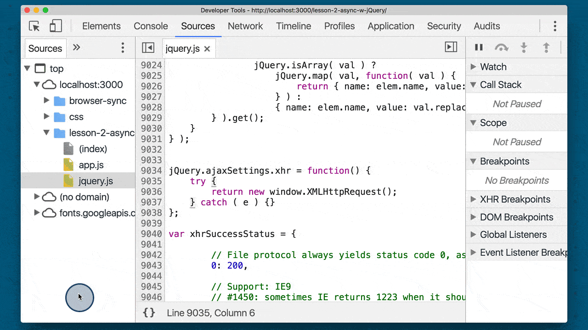](../assets/images/fixed/ud109-l2-jquery-xhr-set-breakpoint.gif)
**A breakpoint set in the jQuery source file right where new XMLHttpRequest is created**

#### Search For A Topic
Now that we've added the breakpoint, if we do a search, the JavaScript code will run (which will use jQuery's `.ajax()` method!) and DevTools will pause when it hits the line with the breakpoint.

So go ahead and do a search to cause the code to break at the breakpoint. Why not search for something exciting like "Volcanoes"!

[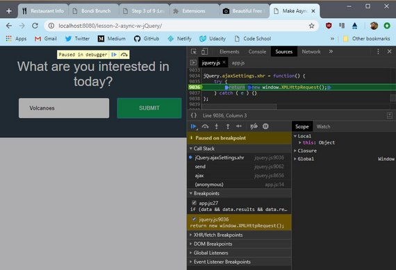](../assets/images/ajax1-27.jpg)
**DevTools paused at breakpoint**

> #### Debugging in Chrome
> TIP: If you've never done it before, debugging is a JavaScript application can seem like a complicated process. We'll be looking at the important parts of DevTools in this course, but if you're looking for a deeper dive, check out the following resources on Google's Developer site:
>
> - [Pause Your Code With Breakpoints](https://developers.google.com/web/tools/chrome-devtools/javascript/breakpoints) - Chrome DevTools (developers.google.com)
> - [JavaScript Debugging Reference](https://developers.google.com/web/tools/chrome-devtools/javascript/reference) - Chrome DevTools (developers.google.com)

### 2.7 Review Call Stack
The DevTools has a ton of helpful information! If you're not familiar with them, you really should spend some learning about all of its features. It'll make developing and debugging websites a lot easier!

One helpful piece of info that DevTools provides is the JavaScript Call Stack. This displays the order of function calls that are in progress.

The function at the bottom of the stack is the first one to run. It calls the second one on the stack...the second calls the third, the third… you get the idea. A function stays on the stack until the one above it returns.

We can click on the bottom function in the stack (the `anonymous function`) to see that what kicked all this code off was the `$.ajax()` call for the Unsplash images. That `$.ajax()` call in turn calls `transport.send()`, which calls `options.xhr()`, which creates a new `XMLHttpRequest()` object!

So the order is:

1. our code in an anonymous function calls `.ajax()`
2. `.ajax()` calls a `.send()` method
3. `.send()` calls `options.xhr()`
4. `options.xhr()` calls `jQuery.ajaxSettings.xhr` which creates a new XHR object

[](../assets/images/fixed/ud109-l2-jquery-xhr-call-stack.gif)
**Clicking through the call stack to see the order of function calls**

#### Question 1 of 2
When `$.ajax()` is called, does the jQuery code create a new XHR object each time or does it create an initial one and reuses it for each subsequent call to `.ajax()`?

Look at jQuery's code and especially the jQuery.ajaxSettings.xhr function.

```js
jQuery.ajaxSettings.xhr = function() {
  try {
    return new window.XMLHttpRequest();
  } catch ( e ) {}
};
```

We can see that the code is return new window.XMLHttpRequest();. So this code will return a new XHR object every time it's called (which happens every time $.ajax() is run!).

- [x] It creates a new one each time
- [ ] It reuses the existing XHR object each time

#### Question 2 of 2
Try working through the `.send()` function (the third item from the bottom of the call stack) on your own to see how it sets up the newly created XHR object. After reviewing the code, how does it set all of the headers?

```js
for ( i in headers ) {
  xhr.setRequestHeader( i, headers[ i ] );
}
```

- [ ] it uses a `for` loop
- [ ] it uses a `while` loop
- [x] it uses a `for..in` loop
- [ ] it uses a `do while` loop

jQuery uses a for…in loop to iterate over the data in the headers object. This can be seen on lines 9094-9096.

### 2.8 .ajaxTransport Walkthrough
Here's the send function which is the third item in the call stack.

[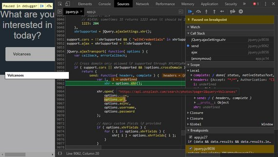](../assets/images/ajax1-28.jpg)

This call creates a new xhr object and stores it in an appropriately named xhr variable.

It then immediately calls the `xhr.open` method, passes in the data that we've provided in the configuration object.

It then makes its way down to the headers and then loops over each one calling the `setRequestHeader` method.

[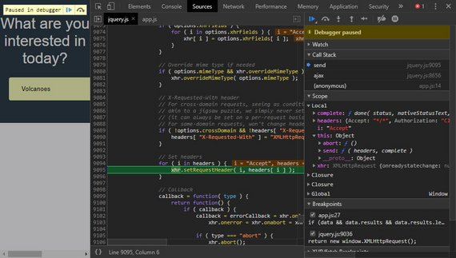](../assets/images/ajax1-29.jpg)

This code here sets up the callback function.

[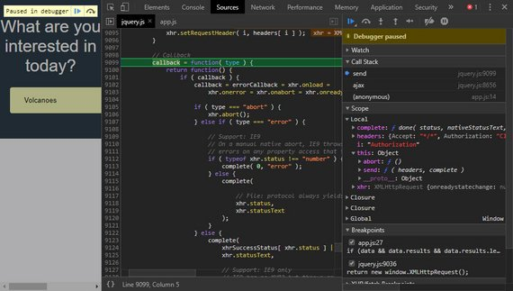](../assets/images/ajax1-30.jpg)

After the callbacks for `onload`, `onerror`, & `onabort` are set up the `xhr.send()` method is finally run to send the request.

### 2.9 Other Async Methods
jQuery has a number of other methods that can be used to make asynchronous calls. These methods are:

- [.get()](http://api.jquery.com/jQuery.get/)
- [.getJSON()](http://api.jquery.com/jQuery.getJSON/)
- [.getScript()](http://api.jquery.com/jQuery.getScript/)
- [.post()](http://api.jquery.com/jQuery.post/)
- [.load()](http://api.jquery.com/load/)

Each one of these functions in turn calls jQuery's main `.ajax()` method.

These are called "convenience methods" because they provide a convenient interface and do some default configuration of the request before calling `.ajax()`.

Let's look at the `.get()` and `.post()` methods to see how they just call `.ajax()` under the hood.

#### Add a Breakpoint
With the project open in a browser:

1. load up DevTools
2. open the Sources pane
3. open the jQuery file
4. add a breakpoint to line 8797
5. reload the page (this will pause the code at the breakpoint you just made!)

[](../assets/images/fixed/ud109-l2-jquery-xhr-set-breakpoint.gif)
**A breakpoint is added to jQuery source file in DevTools. Be sure to set this breakpoint at 8797 rather than 9036 shown here.**

The first time through the loop, the method variable will be get. This makes

```js
jQuery[ method ] = function( ... ) { ... }
```

become

```js
jQuery[ 'get' ] = function( ... ) { ... }
```

which gives us the `$.get()` method!

On line 8807 you can see that this new `jQuery[ 'get' ]` function returns a call made to `jQuery.ajax( ... )`.

Notice that before the `.ajax()` call is run, the type property is set to the `method` variable (which is still 'get'). So calling `$.get()` calls `$.ajax()` with some preset properties.

This exact same code runs right after this for 'post'. The code creates a `jQuery[ 'post' ]` function that will call `jQuery.ajax( ... )` and set the type property to 'post'.

Isn't it pretty cool how jQuery provides these convenience methods that just end up calling the main `.ajax()` method!?

[](../assets/images/fixed/ud109-l2-jquery-get-post-methods.gif)
**Walking through the jQuery source to see how the `$.get()` and `$.post()` methods are created. This sets some default properties, and then runs `$.ajax()`**

> ##### Which Method Should You Use?
> [From the jQuery website](https://learn.jquery.com/ajax/jquery-ajax-methods/):
>
> It's often considered good practice to use the $.ajax() method over the jQuery provided convenience methods.

### 2.10 jQuery Async Wrapup
In this lesson, we used the jQuery library to make asynchronous requests and we use jQuery's `.ajax()` method to do it.

We also dove into the `.ajax()` method and saw that deep in the underbelly of the code, it just did the following.

1. It created an XHR object
2. Set all the properties and callbacks
3. Then sent off the request for us.

So we've seen how to make async requests with XHR, and now we just looked at using a middleman to handle the groundwork for us.

In the next lesson, we'll look at the shiny new way to make async requests.

It'll be gluten-free, carb-free and even sugar-free, will it even be a cake at this point?
Who even knows?