<!-- markdownlint-disable MD022 MD032 -->
<!-- # Mobile Web Specialist Nanodegree -->
# Browser Rendering Optimization

[<-- back to Mobile Web Specialist Nanodegree homepage](../index.html)

---

## 9. The Critical Rendering Path
### 9.1 Course Introduction
Hi I'm Paul Lewis and I'm a Developer Advocate at Google. And I'm Cameron Pittman. I make front end web development courses here at Udacity.

[](../assets/images/bro1-1.jpg)

We're here to help you develop apps that run at a silky smooth 60 frames per second. And you may think it's just JavaScript that you need to worry about but there's actually a lot more to it than that. This course is about changing the way that you approach performance issues. We're going to help you look at the bigger picture.

Okay let's play a game.This was made by my colleague Jake Archibald and it's designed to show off problems with frame rates and performance on the web.

[](../assets/images/bro1-2.jpg)

See these ships at the top? They move smoothly. The ones at the bottom judder. The game is super simple; shoot the juddering ships as quickly as you can by clicking on them. You're going to have to spot them amongst the smooth ones.

### 9.2 Jank Invaders
[](../assets/images/bro1-3.jpg)

Link to [Jank Invaders Game](http://jakearchibald.github.io/jank-invaders/)

### 9.3 Lesson Intro
Throughout this course you'll be working on a bunch of samples with performance issues. But by the end of the course, you'll be applying what you've learned to make silky, smooth experiences.

But first, in order to develop an app that runs at 60 frames per second, you need to understand what goes into creating each frame.

In this lesson, you'll be getting the background knowledge that you need about the browser's rendering pipeline.If you've taken web performance optimization with Ilya Gregorich and me, this will seem pretty familiar.

The point of this lesson is to help you experience what potential bottlenecks may slow down rendering.

In the next lessons, you'll be diagnosing and solving common performance issues, as well as getting a sense for how to approach performance at different stages in your app's life cycle.

### 9.4 Juddering
Avoiding jutter is extremely important to users. You just saw what a difference it made in Jank Invaders just now. But, it's not just games. It can affect all sites and web apps.

Let's put that in the context of native apps a second. Think about what you do when you're choosing between two native apps that do the same kinds of things. How do you decide between two?

Well, I'll look at reviews and see what people say about the app's features and, you know, I'm also interested in performance. A quick look around poorly rated apps tells you that users notice and they care when an app judders or stops for,like, one to two seconds whenever I click on this thing.

When that happens they, and you, would choose an app that performs better and it's no different with the web.

Bad performance kills good sites. Equally, users love experiences that are smooth, that stick to their finger and react quickly. Another colleague of mine Paul Kinlan ran a survey about the features that people want from a news app. And the most requested feature was smooth navigation. Smooth, as in, no jank. In fact, 77% of people wanted it.

This course will explain how you can think about your project's performance and what tools you have at your disposal, and what you're looking for and how to fix common issues. You're going to hunt down causes of sticky scrolling, flickering updates, and juttering animations.

But first, you'll start your 60 frames per second journey by exploring what goes into a single frame.

### 9.5 Frames
If there's any kind of visual change on screen, from scrolling to animations, the device is going to put up a new picture, or frame, onto the screen for the user to see.

Most devices today refresh their screen 60 times a second, which we measure in hertz. And so to match that we need to have 60 frames to put up.

[](../assets/images/bro1-4.jpg)

Most of the time we'll refer to this as 60 frames a second or fps.

People are especially good at noticing when we miss one of these frames. And they don't like it. Think of how easy it was to spot in Jank Invaders. If the browser is taking too long to make a frame, it will get missed out. The frame rate will drop and users will see stuttering. If it's really bad, then the whole screen can lock up, which is the worst.

### 9.6 Quiz: ms Per Frame
[](../assets/images/bro1-5.jpg)

#### 9.6 Solution
I'll take 1000 milliseconds and divide it by 60 frames per 1000 milliseconds and I'll get about 16 milliseconds per frame.

[](../assets/images/bro1-6.jpg)

This means that in order to achieve a silky smooth 60 frames per second, you need to keep all of the work in making the frame under 16 milliseconds.

But actually, the browser also has some housekeeping work to do in every frame. So realistically, you have **somewhere in the region of 10 to 12 milliseconds** to get everything done and make sure the frame arrives on time.

### 9.7 What's in One Frame
You can't optimize your app's frame rate if you don't understand how the browser actually renders a frame. So you need to learn how a page is actually put together when it's first loaded.

Okay, so let's take a look at what goes into making a frame.

Initially the browser makes a GET request to a server. The server responds by sending some HTML.

[](../assets/images/bro1-7.jpg)

At this point, the browser does some pretty clever stuff with lookahead parsing. But what we care about is that it parses the document and gives us these notes.

[](../assets/images/bro1-8.jpg)

In Chrome DevTools, you'll see it as Parse HTML.

Okay, so this is what the DOM looks like as a tree. But let's just make it a bit easier for ourselves, and call it the DOM.

[](../assets/images/bro1-9.jpg)

As well as the DOM, we also have CSS. And this comes from the user agent, it comes from your style sheets or any inline styles you have, and perhaps third party styles.

The next part of the process is to combine the DOM and CSS.

[](../assets/images/bro1-10.jpg)

In the tools you're going to see this as Recalculate Styles.

When combined, we get a new tree called the Render Tree.

[](../assets/images/bro1-11.jpg)

The Render Tree looks pretty similar to the DOM, except that some things are missing.

[](../assets/images/bro1-12.jpg)

For example, we don't have the head anymore, we don't have any scripts. In fact, if we had some CSS that set the section paragraph to `display: none`, then it would be removed from the render tree.

[](../assets/images/bro1-13.jpg)

Equally if we had some CSS that added a pseudo element like after or before, this would get added to the render tree even though it doesn't live in the DOM.

[](../assets/images/bro1-14.jpg)

It's important to note that only elements that will actually be displayed on the page will make it into the render tree.

So this is essentially a simplified view of where the critical rendering path optimization gets you.

### 9.8 Quiz: Render Tree
[](../assets/images/bro1-15.jpg)

#### 9.8 Solution
[](../assets/images/bro1-16.jpg)

And the correct answer is any element with a class of style none.

If an element is set to display none that means that the element is not going to be rendered whatsoever. For the other three options, though they may not take up any space on the page that you're seeing they're still a part of the page. Which means that the browser will still put style three, style four, and style two before on the render tree.

In order for `.style2` to end up in the render tree, it needs to have some content, like '' assigned to it.

### 9.9 DOM & Render Tree
Okay, back to the rendering process of a single frame.

Once the browser knows which rules apply to an element, it can begin calculate layout. Or it, in other words, how much space elements take up and where they are on the screen.

So, here's all the CSS that we want to apply. And layout turns this tree

[](../assets/images/bro1-17.jpg)

into a collection of boxes like this.

[](../assets/images/bro1-18.jpg)

In the tooling, you'll see this as layout.

The web's layout model means that one element can affect others. So, for example, the width of body typically affects the children's widths and so on, all the way down the tree. So the process can be quite involved for the browser. Sometimes, you may hear layout called reflow. It's the same thing.

The next step in the process is to talk about vector to raster. For example, the boxes we had before were vectors like this, just shapes.

[](../assets/images/bro1-19.jpg)

But now what we need to do is fill in individual pixels, like this. And that's what a rasterizer is for.

[](../assets/images/bro1-20.jpg)

So, this is the layout we had before, and these are the draw calls that the rasterizer will make to fill it in.

[](../assets/images/bro1-21.jpg)

When done, it will look like this.

[](../assets/images/bro1-22.jpg)

But that's a little too quick, so let's step through and see it build up the picture bit by bit.

So you can see, these rectangles start to appear, then some text.

[](../assets/images/bro1-23.jpg)

And we get a shadow, a white line, a picture, and finally it tightens up.

[](../assets/images/bro1-24.jpg)

The tooling is going to show you this as paint.

You may have noticed in that previous list that one of the calls was called `drawBitmap`. What we normally do is we send things like JPEGs, orPNGs or GIFs down the wire to our page. But what the browser has to do is decode these into memory, like this.

[](../assets/images/bro1-25.jpg)

In the tooling, you'll see it as Image Decode. Potentially, we're doing something like responsive web design. And so the image may also need resizing.

Painting, as you may have noticed just now, was done into a single surface. However, sometimes browsers make multiple surfaces called layers or compositor layers and it can paint into those individually.

[](../assets/images/bro1-26.jpg)

So here I have a site and this masthead has its own layer. That means we can paint the content behind. And we can paint the masthead itself.

[](../assets/images/bro1-27.jpg)

The process of handling these layers is shown in the tooling as composite layers.

This masthead is a layer, but because we have buttons for next and previous on top of it they are also turned into layers as well.

[](../assets/images/bro1-28.jpg)

In this course, we're going to talk about layer management to make sure that you don't create extra layers by accident.

Now, we can put all these layers back together. And so now we've finished painting all the layers for our page. To be honest, painting actually happens into a grid of tiles like this.

[](../assets/images/bro1-29.jpg)

I mentioned it for completeness, but it's not something we get to control as developers. All of this happened on the CPU. The layers themselves and their tiles will be uploaded to the GPU.

[](../assets/images/bro1-30.jpg)

Again, this will be included in composite layers. And lastly, the GPU will be instructed to put the pictures up on the screen.

[](../assets/images/bro1-31.jpg)

And that, in brief, is how we get from a single request all the way through to pixels on screen.

### 9.10 Quiz Layout
For this quiz, I'm giving you a sample DOM, there's a body with a div container underneath it. And then a child div underneath the container.

[](../assets/images/bro1-33.jpg)

If you make changes to the geometry of any of these elements, the browser will have to run layout. So, my question for you is, which of these elements, will when changed, include more of their parent elements in the scope of the resulting layout.

In other words, will changing the geometry of any of these elements trigger layout against most or all of the page? If so, which one triggers more? You can use [the sample site to find out](http://udacity.github.io/60fps/lesson1/layoutPaint/index.html).

Clicking once makes a change to the body, clicking again makes a change the top level div, and the last click changes the child div.

If you're already familiar with DevTools, you can record a timeline trace to see what layout happened after each click on this page. If not that's no big deal,you'll be learning how to use the timeline next lesson, and i'll be demonstrating how to find information about layout in the solution video.

You can also check out the link in the instructor notes fora little bit more information. So, do some analysis if you can, but otherwise make a prediction. Will changing the width of the body trigger layout with a larger scope than changing the width of this div, or will they have the same scope? Pick one of these answers.

[](../assets/images/bro1-32.jpg)

#### Links

- [Sample Site](http://udacity.github.io/60fps/lesson1/layoutPaint/index.html)
- [How to Use the Timeline Tool](https://developer.chrome.com/devtools/docs/timeline#rendering-event-properties)  - The Timeline tool is now deprecated'. See Performance Tool below.
- [Get Started With Analyzing Runtime Performance](https://developers.google.com/web/tools/chrome-devtools/evaluate-performance/) - Replaces Timeline Tool

#### 9.10 Solution
Which change creates more work for the browser during layout?

- [ ] Changing the width of the body
- [ ] Changing the width of the div
- [x] They create the same work

Right! No matter what, layout needs to be run against the whole page.

Believe it or not the correct answer is that they have the same scope. In both cases the browser has to assume the worst. Meaning that the change invalidated the entire DOM.

The browser then has to keep the entire DOM in scope while it's running layout. This is the Performance panel in dev tools which you'll be spending quite a bit of time with later in this course.

[](../assets/images/bro1-34.jpg)

To see what happens when I click around on the page, I will go ahead and click this button which starts recording and then I will click once, twice, three times and then stop recording.

[](../assets/images/bro1-35.jpg)

Like I said, you'll be spending quite a bit of time with this tool later in the course, so I’m going to quickly zoom in and show you what you need to see.

This is the first click event which affected the geometry of the body.

[](../assets/images/bro1-36.jpg)

You can see that the click lead to other pieces of work.

Next I click on the Layout segment which gives me further detail.

I can see that "Nodes That Need Layout" is **3 of 5**. Which means that three of the five DOM nodes are affected by this.

[](../assets/images/bro1-37.jpg)

Okay now I wonder what it looks like for the other two elements.

Here's the second click event, which affected the top level div. And this is the resulting layout.

[](../assets/images/bro1-38.jpg)

Notice that, in this case, that four of the five nodes were affected by this.

Now I'll look at the last one. Here's the last click event on the child div. So this div is the farthest down on the DOM. And here's the resulting layout.

[](../assets/images/bro1-39.jpg)

Here it looks like all five nodes are affected by this.

You may have noticed as I was going through the clicks that the different layout events affected different numbers of nodes. But the whole time the entire DOM was in scope.

In case you're wondering, it's possible but very difficult to limit layout scope. You can use something called a layout boundary but Paul and I won't be getting into that in this class.

So if there is one take away from this question, it's that the layout process is complicated and it's probably best to assume that the entire DOM is always in scope.

### 9.11 Layout and Paint
So this is what a typical frame looks like for as developers when things are more than just a static page.

[](../assets/images/bro1-40.jpg)

It looks like the pipeline I talked about just before except I've now chucked JavaScript at the front.

Normally, you're going to use JavaScript to handle work that will result in visual changes. Whether it's jQuery's animate function, sorting a data set, or adding DOM elements to the page. But you don't have to use JavaScript for your visual changes. In fact, for many applications developers use CSS animations, transitions, or even the new Web Animations API to make visual changes to their page.

[](../assets/images/bro1-41.jpg)

Now with that out of the way, we can talk about the pipeline a bit more.

The changes we make here won't necessarily trigger every part of the pipeline either. In fact, there are three ways the pipeline normally plays out fora given frame. So let's talk about those for a second.

#### One
So number one, you make a visual change either with CSS Or JavaScript.

[](../assets/images/bro1-42.jpg)

The browser must recalculate the styles of the elements that were affected. Now if you changed a layout property, so that's one that changed an element's geometry like its `width`, `height`, or position with relation to another element like `left` or `top`, then the browser will have to check all the other elements and re-flow the page. Any affected areas will need to be repainted. And the final painted elements will need to be composited back together.

#### Two
The second way the pipeline gets used is when you change a paint only property, like `background-image`, text `color`, or shadows.

[](../assets/images/bro1-43.jpg)

This time, we make the change, the styles are calculated, we don't do layout because we didn't change the geometry of any elements. We do paint and we do composite.

#### Three
And the last way involves changing something that requires neither layout, nor paint, just compositing.

[](../assets/images/bro1-44.jpg)

Compositing is where the browser puts the individual layers of the page together. And that requires layer management to ensure we have the right layers, and in the correct order. So we make our change. We do style calculations, but we only do composite.

You probably noticed that style was always included for each of those variations. Different styles affect which parts of the pipeline we touch; And therefore the performance characteristics of our apps.

### 9.12 Quiz: Render
Here's a scenario for you to consider. Flexbox is a very useful tool for responsive design. It's a CSS display property that resizes elements, and reflows them on the page. For instance, imagine you've got these three elements on a page and then the user resizes the screen to become larger. As a result, the elements themselves become larger.

[](../assets/images/bro1-45.jpg)

In this scenario, which of the following processes does the browser perform to render the new page? Does the browser perform style, layout, paint, or composite? Check all that apply.

#### 9.12 Solution
I'll start with style. There are no style calculations here, because the element styles are already known. So, on the screen resize event, the styles are actually applied through layout. And as you just learned, if the browser runs layout, it also has to paint the elements in their new positions on the page, and then composite them together.

[](../assets/images/bro1-46.jpg)

There are actually exceptions to the lack of style here, however. If there was a resize handler that changed the style, or if a media query break point was hit, then the browser would actually have to recalculate styles. But that's not happening here, so don't check that box.

### 9.13 Quiz: CSS Research
For this quiz, I want you to head over to [csstriggers.com](https://csstriggers.com/) and do some research.

I want you to find a CSS property that triggers layout, paint, and composite, and type it into the first box. Then find a CSS property that only triggers paint and composite and type it into the second box. Lastly, find a CSS property that only triggers composite and type it into the third box.

[](../assets/images/bro1-47.jpg)

The reason you're checking out csstriggers.com is because it's a super useful resource for determining the amount of work your CSS will trigger.

It's really important to become familiar with it if you want to write performant websites.

#### 9.13 Solution
This quiz, I picked `margin-left` for layout, paint, and composite, `color` for paint and composite, and then `transform` for just composite.

[](../assets/images/bro1-48.jpg)

Not all CSS is created equal. Some CSS properties have much wider-reaching consequences than others.

Your CSS should trigger the least amount of work possible, and that's going to mean avoiding paint and layout whenever possible.\

Transforms and opacity are far and away the best properties to change, because they can be handled just by the compositor if the element has its own layer. You'll learn more about how to create and manage layers later in the course.

### 9.14 Final Project
Right now you are looking at the app that you'll be debugging at the end of this course.

[](../assets/images/bro1-49.jpg)

It uses the Hacker News API to show the most recent stories and their scores.

Right now its performance is pretty awful, especially on mobile, but there's really no reason it shouldn't be hitting 60 frames per second.

By the end of this course, you'll have the skills, techniques, and above all, you'll have the mindset needed to turn this janky experience into an amazing 60 frames per second experience.

### 9.15 Lesson Outro
Okay, you're well on your way to getting some good performance. You know

- why we care about hitting 60 frames a second
- what goes into making a frame
- that the properties we change affect the performance in different ways

In the next lesson, you'll begin your first real performance battle. Jank is more problematic at some points in an app's life cycle than at others .And you'll need to spend your time and effort on the areas that matter most to your users.

## 10. App Lifecycles
### 10.1 Lesson Intro
In the first lesson, you learned how the browser renders pixels from HTML, CSS,and JavaScript. Understanding this process is key to optimizing an app's performance.

[](../assets/images/bro1-1.jpg)

In this lesson, you'll take a step back to think at a high level about your app's life cycle as a whole. The goal is to help you make intelligent choices about when your app can and should do the heavy work to create a buttery smooth experience for your users. 

Now, before we start, I have a question for you. Should your goal be to make your app run at 60 frames per second all of the time? The answer is no, actually, not quite.

It's important that you pick your battles a bit, and focus on the things that matter to your end users. When you think about it, there are actually four major areas of any web app's life cycle, and performance fits into them in very different ways.

### 10.2 RAIL
I call the four major areas of a web up's life cycle RAIL. RAIL stands for

- Response
- Animations
- Idle
- Load

Wait. That's not chronological order. Shouldn't it be LIAR?

- Load
- Idle
- Animation
- Response

It turns out LIAR is a less popular acronym than RAIL? It's just a good way to remember it, and yeah, even though, you do loads at the start, most apps do multiple loads with XHRs and web sockets and HTML imports.

Anyway, orders of letters, not withstanding, it's really a useful way to conceptualize and group your apps workload. 

Let's do them in chronological order though.

### 10.3 Load and Idle
So the first we're going to look at is Load. Whatever it is, users want it to load quickly, and it's super important that we optimize for the critical rendering path.

[](../assets/images/bro2-1.jpg)

Earlier I took you through a quick tour of the rendering process in the first lesson,but essentially you want your initial load to be done in one second.

Okay, I'm going to switch across to Chrome, and I'm going to load Google Play Music, and I suspect it'll load in about one second.

[](../assets/images/bro2-2.jpg)

Now after an app's loaded, it's normally idle, it's waiting for a user to interact. And this is our opportunity to deal with things that we deferred to meet that one second load time.

[](../assets/images/bro2-3.jpg)

**Normally, these idle blocks are around 50 milliseconds long, although you may several of them in one go.**

These idle blocks are fantastic times to get some heavy lifting done so that when the user interacts things are nice and snappy. I'll stop for a second and let you think through the best way to approach an app's idle time.

### 10.4 Quiz: Idle Time
In this quiz, you'll be thinking about this hypothetical news app.

[](../assets/images/bro2-4.jpg)

Inside the app, users will be reading articles about how California's in a drought. They'll be looking at images like this in London, where they actually do get rain. And they'll be watching videos like this, where a Golden Retriever is writing some JavaScript because that's definitely something that could happen.

You've booched up the app to render content above the fold pretty quickly. You also know from your analytics that most people look at a page for a couple of seconds, before they start interacting.

[](../assets/images/bro2-5.jpg)

So, with that in mind, what kind of tasks should you handle during this post-load idle state?

[](../assets/images/bro2-6.jpg)

Should you load the text for news stories? Should you load image assets? Should you load videos like the web deb Golden Retriever? Should you load the app's basic critical functionality? Or should you load the comments section?

#### 10.4 Solution
The correct answer is everything except for the news text and the basic critical functionality.

[](../assets/images/bro2-7.jpg)

In order for the app to even work, you've got to deliver the basic critical functionality. So this shouldn't be coming after the load.

Also, people would be visiting a site like this specifically to read the news text, so they should be there as soon as the first pixels are being painted.

Everything else though, like images, videos and the comments section can come later. In fact, this is probably a pattern you've seen before on other apps.

Keep in mind, however, that user actions could actually still happen during the post load idle state. And in a moment you'll learn that **you only have one hundred milliseconds to respond to those actions**.

This makes it all the more important to **keep the post load task that you're performing to fifty millisecond chunks**.

### 10.5 RAIL Response
You've handled Load and considered what you might do during periods of idle time.But what next?

[](../assets/images/bro2-8.jpg)

Well, the user's going to interact with the app, and you need to be responsive to that. This isn't responsive in the sense that it responds to screens of different sizes. This is responsive in the sense that it reacts to the user input without delay.

Well how responsive does it need to be then? Well, studies show that there is a limit of 100 milliseconds. So a tenth of a second after someone presses something on screen before they notice any lag.

[](../assets/images/bro2-9.jpg)

So if you can respond to all user input in that time, you're good to go.

That's great if the thing they did was to say, toggle a check box or tap a button. And you show a single change, like a selected state. But there's another version of this which is more challenging, which is that the user does something that requires animation.

The most challenging performance issues always come out of the need to hit 60 frames a second. Which is either interactions that stick to the user's finger or transitions and animations.

For those we have a limit of 16 milliseconds. Which is one second or a thousand milliseconds divided by 60.

[](../assets/images/bro2-10.jpg)

In reality, we actually have less than 16 milliseconds, because the browser has overhead. So really we get around 10 to 12 milliseconds. That's not a lot of time.

### 10.6 RAIL Animations 1
So some user interactions need 60 frames a second, but so do transitions and animations, like card expansions or menu sliding in. Those need to be at 60 frames a second, too, which isn't always simple.

[](../assets/images/bro2-10.jpg)

It's so easy to accidentally trigger performance issues, unless you're very careful about which properties you animate and when.

There are many ways to tackle animations, and it completely depends on your project. I'll give you an example of one approach I've used. It feels like I'm kind of getting into "weird trick" territory here, but seriously this one actually works.

For the 2014 Chrome Dev Summit web sites, I wanted to animate these cards.

[](../assets/images/bro2-11.jpg)

I couldn't expand the cards fast enough to maintain 60 frames a second, so I had to try something a bit different. I tried working backwards.

I call my strategy FLIP. First, Last, Invert, Play.

[](../assets/images/bro2-12.jpg)

I took advantage of the fact that once the browser had done the initial hard work to run the animation once, I could run it backwards at very little cost. It's like pre-calculating the expensive work.

My code took the start point of a card,and then it took the end point when the card was expanded.

So let's say the card was about here when it started, and the icon was like this.

[](../assets/images/bro2-13.jpg)

Using getBound and ClientRect, I measured all the elements' positions before and after.

[](../assets/images/bro2-14.jpg)

That then meant I knew how far everything needed to move on the page, and if it's opacity changed, I also knew that as well.

So back here again. First - is where the card starts. Last - is where the card finished. Now we need to talk about inverting.

[](../assets/images/bro2-12.jpg)

I use the information from first and last to apply transform and opacity changes to reverse the animation.

With a little bit of extra work with clipping, it was like the card had never moved.

[](../assets/images/bro2-15.jpg)

So, now we've inverted the animation. We can just simply play it and it runs smoothly.

### 10.7 RAIL Animations 2
And this is what it looks like in code.

[](../assets/images/bro2-16.jpg)

- Firstly, we collect the properties of the card in a collapsed position.
- We expand the card and collect the properties again.
- Next, we figure out the differences and then we transform the card back.
- Because we made this style change we have to wait a frame for those style changes to take effect. Otherwise, if we change them again the browser would ignore these and we'd see no animation.
- Now we've waited a frame.We can switch on animations and remove the invert, transforms, and our past two changes.

All that property collection, probably sounds quite expensive and you may be wondering how you can afford to do it. It sounds like a lot, and it is. I mean, you're doing all these calculations on demand whenever a user clicks or taps on a card.

Well it turns out, I was making use of the 100 millisecond response window to do all those experts of calculations up front.

[](../assets/images/bro2-17.jpg)

On a Nexus 5 it took around 70 milliseconds to get everything done, which is well inside that 100 millisecond boundary.

### 10.8 Quiz: Rendering Animations
Paul just explained how he used FLIP to create a pretty snazzy animation. He performed all the hard calculations up front, so that he would touch as little of the pipeline as possible during the actual animation.

This is how he kept it going at a silky smooth 60 frames per second. When he applied opacity and transform changes to reverse the animation, what steps in the rendering pipeline did Paul trigger?

[](../assets/images/bro2-18.jpg)

Did the HTML need to get converted to the DOM? Did the CSS need to get converted to the CSSOM? Did the DOM and CSSOM need to be combined into the Render Tree? Did the browser have to run Layout again, Composite again, or Paint again? Check all that apply.

#### 10.8 Solution
Great job! Notice how `opacity` and `transform` only trigger composite? Keep that in mind as you build your performant apps.

[](../assets/images/bro2-19.jpg)

As you just discovered, changes to `opacity` and `transform` only trigger composite when the elements are on their own layers. But remember, Paul also had to use clip to reverse the animation. And that, unfortunately, requires paint.

It's important to always understand the implications of any property you choose to animate, because some are definitely cheaper than others.

### 10.9 Quiz: Interactions & Animations
During the response section of rails. You saw that you have about 100 milliseconds to respond to user input. But, some user interactions also require animations which then need to run at 60 frames per second.

What kind of interactions do you think require 60 frames per second animations?

[](../assets/images/bro2-20.jpg)

Should spinners always be running at 60 frames per second ?What about scrolling? Dragging and dropping, Pinching, Pulling to refresh, Menus sliding out from the side, Comment section opening from below, Changing the state of items and forms, Or last but not least, changing the themes of an app? Check all that apply.

#### 10.9 Solution
As it turns out, anything that involves movement or finger on screen interactions will need to run at 60 frames per second.

[](../assets/images/bro2-21.jpg)

The only two items that don't fall into those categories are toggling form controls and app theme changes. For these two, you still have 100 milliseconds to respond, but afterwards, the app must continue running at 60 frames per second if it's going to keep feeling responsive.

### 10.10 RAIL Review
LIAR stands for 

- Load
- Idle
- Animations
- Responsiveness.

#### Load
During the Load stage you have about one second or a thousand milliseconds to render the page before the app no longer feels responsive, and the user's attention level falls.

**Download and render your critical resources here.**

#### Idle
After loading, the app is Idle, and this is a great time to do non-essential work to ensure that whatever interactions occur after this period will feel instantaneous.

**Your app's idle time should be broken down into 50 millisecond chunks so that you can stop when the user starts interacting.**

#### Animation
During the Animation stage, such as when users are scrolling or animations are occurring, **you only have 16 milliseconds to render a frame**.

**This is when 60 frames per second is absolutely critical.**

#### Response
Lastly, there's the Response period. The human mind has about 100 milliseconds' grace period before an interaction with the site feels laggy and janky.

**That means your app needs to respond to user input in some way within a 100 milliseconds.**

Using this time wisely is absolutely critical for setting up difficult animations that run at 60 frames a second.

In the next few quizzes, you'll be asked to apply what you've learned about RAIL in some real-world scenarios.

### 10.11 Quiz: RAIL 1
For this quiz I want you to pretend that you're developing an app that displays a loading gif like this one while video resources are being buffered.

Do you think it's a good idea to request this gif just during the animation phase? It's also worth noting that if you're requesting the gif during the animation phase you also have to insert it into the page during the animation phase.

[](../assets/images/bro2-22.jpg)

#### 10.11 Solution
The correct answer is either one of these.

[](../assets/images/bro2-23.jpg)

Realistically, there is no way that GIF is going to show up in less than 16 milliseconds and the request adds extra overhead, too, in the animation phase, which is not the time to handle it.

Have the GIF prepared well in advance before the users actually click on video. It's small, so why not make it a part of the initial app load? Either way, don't request it now.

### 10.12 Quiz: RAIL 2
I want you to think through the Idle stage. This user has just loaded an app with baseball scores on it. Right now they're in the 50 millisecond idle period before they start to interact with the app.

[](../assets/images/bro2-24.jpg)

Which of the following tasks can you accomplish in this 50 millisecond period? Check all that apply.

#### 10.13 Solution
[](../assets/images/bro2-25.jpg)

The correct answer here is that you can pretty much do whatever you want so long as it's not for above-the-fold content, which in all reality, the user should already have downloaded.

### 10.13 Lesson Outro
So at this point, you know what you can afford to do and when you can do it, which is pretty handy.

Now one thing to bear in mind is just because you can, say, paint or do layouts or even run JavaScript doesn't mean you have an unlimited budget. Layouts and style calculation times for example, both depend on the number of elements that are affected.

As you'll see soon, one of the ways you can keep that time down is to reduce the number of elements on which they have to work.

This table shows time allowances for different tasks. It'll help you set a budget for each of those tasks.

So that you and any other developers you're working with are all on the same page. It's time to drill into the specifics of resolving performance issues

[](../assets/images/bro2-26.jpg)

In the next lesson you'll be taking a look at the tools that you have at your disposal for identifying jank in your apps.

The first step in reducing jank is identifying its cause which is exactly what you'll do.

## 11. Debug Tools
### 11.1 Intro
At this point, you know that performance is important, and you know what the parts of the pipeline are. So, now it's time to learn how to use the tools at your disposal to identify and destroy jank

The main tool you're going to use is Chrome's DevTools, and in particular, the Performance panel. In this lesson you'll dive into DevTools' Performance view to start to identify exactly where jank is happening.

### 11.2 DevTools
You can open up the developer tools by hitting Cmd+Alt+J on a Mac or Ctrl+Alt+J on PC. 

[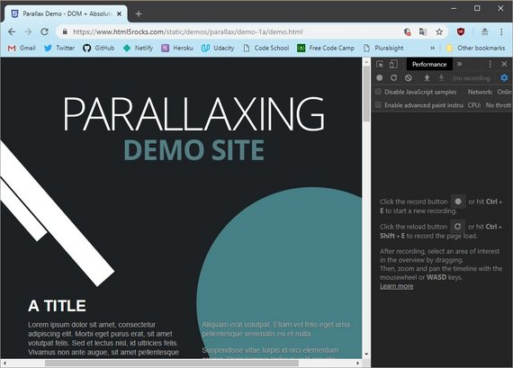](../assets/images/bro3-1.jpg)

Now that we're in DevTools, we need to go to the Performance panel. Performance is here to allow you to track frames per second (fps) for your project. You can record a timeline and it will tell you what fps you were getting and for each frame, what work was involved. That work will tie back into the pipeline you learned in the last lesson.

Now I'm going to hit record and then I'm going to scroll around the site. Now I can stop the recording and I get a load of records back. At first glance I think the user interface can be a little bit overwhelming, so let's just look at it bit by bit.

[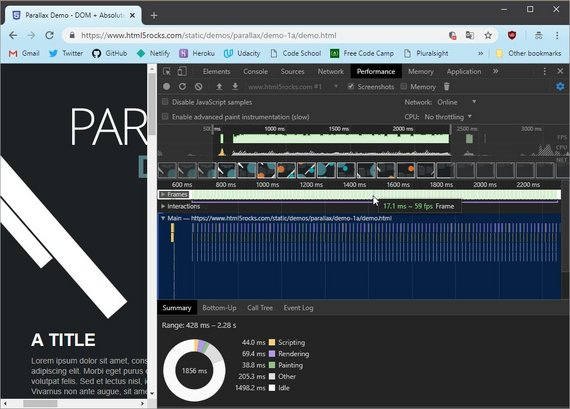](../assets/images/bro3-2.jpg)

The green bars at the top indicate the frames per second. If we're trying to hit 60 frames a second, all these bars should be tall. The lower the bar the less frames per second. If we hover over any of the bars in the **Frames** row we will actually get the fps for that moment in time

Underneath, in the row labeled **Main** there's a load of information about how we spent our time in each of the frames. Right now it's quite zoomed out so we need to actually dive in a little bit deeper.

To do that we simply click drag in the frames area at the top, and now you see it's zoomed in a little bit more. You can also use the W, A, S, and D keys on your keyboard if you prefer.

[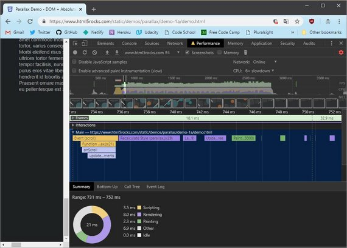](../assets/images/bro3-3.jpg)

Here in the details you can see the parts of the pipeline we discussed earlier. There's **JavaScript**, there's **Style Calculations**, **Layout**, **Layer Management**, **Paint**, and **Composite**.

If you've never taken a timeline recording before take a moment to go and take your first recording. Go to any website, it doesn't matter which, and hit record in the timeline. Then explore the timeline and see what you can find out.

Okay, cool. You're able to take timeline recordings, and you can quickly see where your hitting jank. But now you need to start digging into the details of those frames, and figure out why frames are running long.

#### 11.2 Links Resources
- [Parallax Demo Site](http://www.html5rocks.com/static/demos/parallax/demo-1a/demo.html)
- [Performance Panel REference](https://developers.google.com/web/tools/chrome-devtools/evaluate-performance/reference)

### 11.3 Performance in Depth
So I have the DevTools Performance panel open here and I had it record what happened during the load of this page. Let's take a look at the records in a little more detail.

[](../assets/images/bro3-4.jpg)

The first thing to notice is that they're color coded. Blue records are HTML being parsed. Now, normally this is really fast and I haven't personally seen a performance issue where this was the bottleneck, certainly not past the initial page load anyway.

Moving along a little bit, and zooming in with the W key, just drag that along a little bit, you can see that we actually have two purple records. One is Recalculate Style, and then there's Layout as well. You can also see I've got a green one here which is Paint, and a green one which is Composite.

[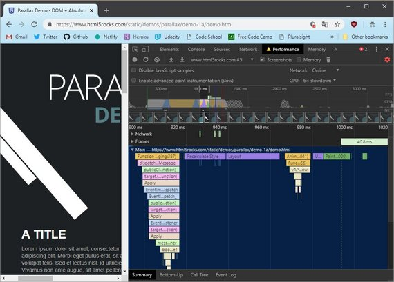](../assets/images/bro3-5.jpg)

This is called the flame chart and it represents the main thread activities. The x-axis represents the recording over time. The y-axis represents the call stack. The events on top cause the events below it.

Below that is a series of tabs.  The Summary tab and three additional tabular views for analyzing activities. Each view gives you a different perspective on the activities:

- Summary
- Bottom Up
- Call Tree
- Event Log

#### Summary
The **Summary** tab can show two things.

First, it shows a pie chart of the relative time spent on each activity for the selected time period.

[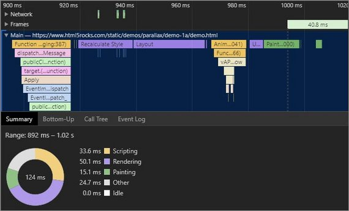](../assets/images/bro3-6.jpg)

Secondly, when you click an item on the flame chart it will display details about that item.

[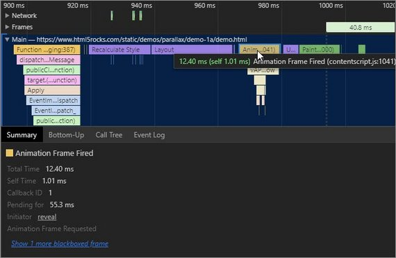](../assets/images/bro3-7.jpg)

#### Bottom Up
- **Bottom Up** - When you want to view the activities where the most time was directly spent, use the Bottom-Up tab.

[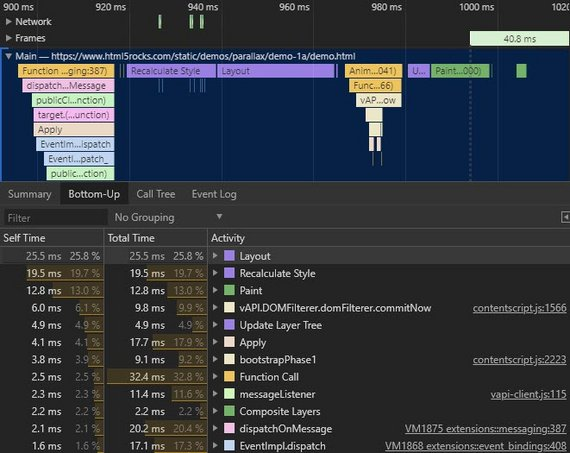](../assets/images/bro3-8.jpg)

#### Call Tree
- **Call Tree** - When you want to view the root activities that cause the most work, use the Call Tree tab.
  
[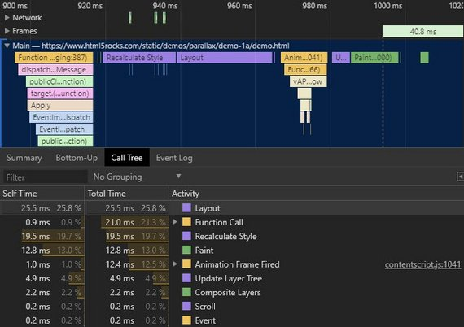](../assets/images/bro3-9.jpg)

#### Event Log
- **Event Log** - When you want to view the activities in the order in which they occurred during the recording, use the Event Log tab.

[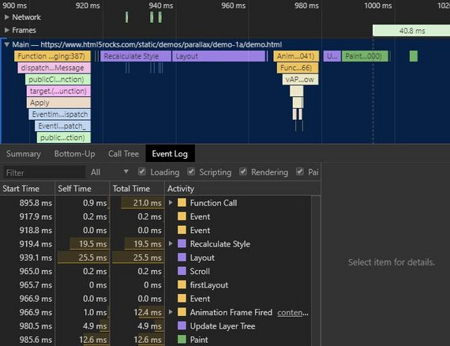](../assets/images/bro3-10.jpg)

### 11.4 Quiz: Reading Timeline
For this quiz, I want you to load a timeline. You can do it pretty easily. Simply right-click in the timeline and go to Save As to save one, or Load to load a timeline.

Loading a timeline is a super easy way to share and compare timelines. You can [download a timeline here for the exercise](https://www.udacity.com/api/nodes/4158208827/supplemental_media/timeline-l3-reading-timeline/download).

Once you've loaded the timeline, see if you can figure out which function caused `initWebGLObjects()` to run. Type it into this box. And finally, if this JavaScript was called during an animation,would it still be possible for the animation to reach 60 frames per second? Yes or no.

[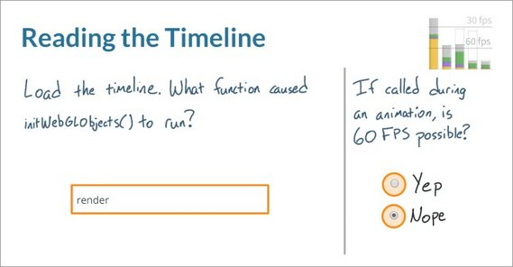](../assets/images/bro3-11.jpg)

#### 11.4 Solution
I've got the Flame view open, and it's pretty apparent that some kind of work is being repeated over and over. I'll just go ahead and zoom into one of these chunks.

[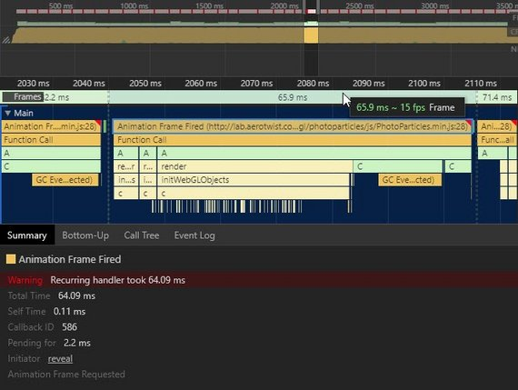](../assets/images/bro3-12.jpg)

With this closer inspection, it becomes pretty obvious that render is causing InitWebGLObjects to be called.

At the top, you can see that the code ran for about 66 milliseconds, which is well over the 16 millisecond budget per frame. This unfortunately means that there is no way this app is going to run at 60 frames per second.

Looking at the frame viewer at the top, you can see that these frames are made up almost entirely of JavaScript, hence all the yellow bars. This means that this code is definitely going to need some refactoring if it's going to run at 60 frames per second.

So the correct answers are, render as the function and, no ,it is not going to run at 60 frames per second.

### 11.5 Identify Jank
Okay, I want to walk you through another example. This is a weight truck app I built a while ago. And I notice that when I open the menu on the left hand side, that it sticks and Janks.

[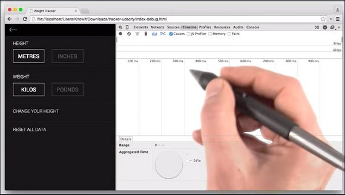](../assets/images/bro3-13.jpg)

So now with the timeline open, I'm going to see if I can find out what the cause is. The first thing I do is refresh the page, just so that I know I've got a fresh start. Next I hit record, bring out the menu, and stop recording.

Immediately, I see that there are three big spikes of yellow here. So, I'm going to select one of those and I realize that I am spending a lot of time in JavaScript. Once you zoomed in, you can also get details of what's going on in those frames.

[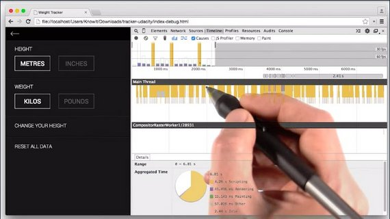](../assets/images/bro3-14.jpg)

Let me start by dragging this up a little bit more, so we can see it. You can see what it is, how long it's been working, when it started and a little bit more about how it's broken down. The time itself and any child records. Lastly, you find out where the task was triggered In your code.

[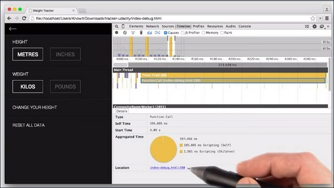](../assets/images/bro3-15.jpg)

The details will differ depending on the kind of record you're looking at. For example, Recalculate Style, tells you the number of elements that were affected, as does Layout.

With Layout, we see the tree size, the scope, where it started and in this case, we also see an additional warning. Which we'll talk about in a little bit. Lastly, we see where in the code we triggered layout.

[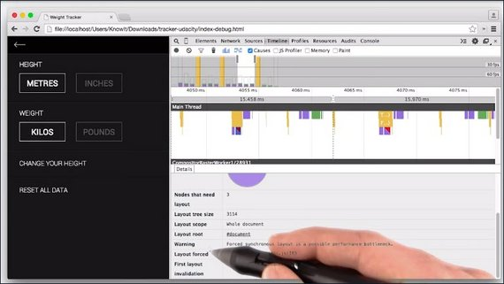](../assets/images/bro3-16.jpg)

In this case though, I would be most concerned about these large yellow blocks. They seem to be what's causing me to stop hitting 60 frames a second.

[](../assets/images/bro3-14.jpg)

### 11.6 Test all Devices
One of the mistakes that people often make is to only test their site's performance on the desktop.

[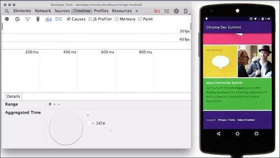](../assets/images/bro3-17.jpg)

Because desktops are significantly more powerful than mobiles, it means you can miss performance issues that only show up when on device's CPU, memory or connectivity constrained.

What you want to do is where you can, test on real devices. If you have an Android device, you can use the same Chrome DevTools you know and love from your desktop. So I can start it, interact, stop,and you can see I got a timeline that I can work with.

[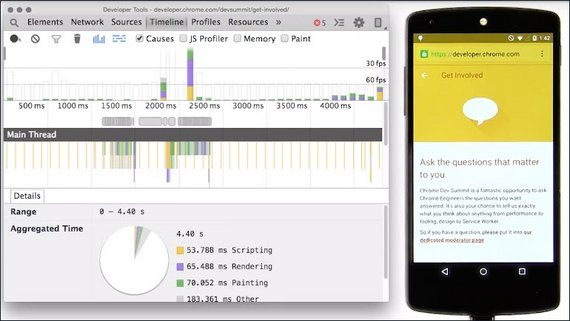](../assets/images/bro3-18.jpg)

If you don't have an Android device available, you can check out the instructor notes below for how to use the emulation settings in Chrome DevTools. Remember though, that the performance characteristics of simulators and emulators are wildly different to a device itself.

So while it's good for getting used to the workflow, you'll need to test on the device itself to make sure that you don't have any performance issues there.

In the next video, Peter Lovis is going to show you how you can useChrome DevTools with your Android device. If you already know, just skip ahead.

### 11.7 Setup for Mobile
The set up is simple. All you need is an Android device, a USB cable, and your development machine. Let's take a look.

Before you get started you need to turn on the Developer Mode in your Android device. This may be different on any given device and you can check your device's manual on how to do this. In many cases though, you need to go to your device's settings, click on About Device and then click on Build Number seven times. Seriously.

Next you'll want to turn on USB debugging. Again, this varies slightly on your given device, but this is usually located in the developer options. We also need to make sure we have the right tools installed. On my laptop, I have Chrome Canary and on my mobile device, I have Chrome Beta installed.

#### What is Chrome Canary and why should I use it
Chrome Canary is the developer version of Chrome. It looks and acts like the regular Chrome browser, but it includes new and experimental features that haven't been released yet. We recommend analyzing websites with Canary to take advantage of the latest tech. However, be warned that Canary isn't guaranteed to be stable, so expect crashes and occasional bugs.

#### Do I have to test on mobile
For the purposes of this course, no. But testing your websites on mobile is a best practice, and if you have the means to do so we highly recommend it.

### 11.8 DevTools on Mobile
Now that we have everything set up the way we need, open Chrome on your development machine and go to Chrome inspect. Make sure the site you want to debug is open on your mobile device and then connect your laptop to your mobile device via USB.Then confirm that you want to allow USB debugging.

Back in our development machine, we can see a list of the attached devices and the Chrome tabs that are open on the devices. You can even open other tabs.

[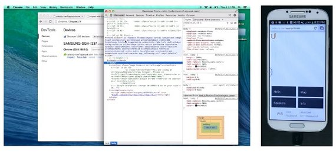](../assets/images/bro3-19.jpg)

We can also focus on specific tabs, you can reload them and you can even close a tab. The best part of course is that you can inspect the pages that are running on your mobile device, from your development machine.

[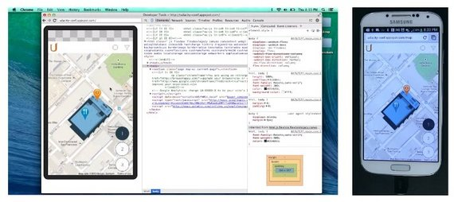](../assets/images/bro3-20.jpg)

One of my favorite new features is the new screen cast mode. This allows you to drive the experience on your mobile device from your development machine. You can click on links, and see them update simultaneously on the device. As well as on your desktop.

### 11.9 Mobile for iOS
Now, that was really easy and it's also possible to do this on mobile Safari with the web inspector using the iOS web kit debug proxy. Now, that's a little bit harder to set up, so check out the link below for more information.

[iOS WebKit Debug Proxy](https://github.com/google/ios-webkit-debug-proxy)

Please note that in the community, there is a discussion continuing about `ios-webkit-debug-proxy`. Depending on your version of canary, if you're using it, it might take a lot of time and some students suggest trying Safari Dev Tools and point to links like this:

https://www.smashingmagazine.com/2014/09/testing-mobile-emulators-simulators-remote-debugging/

Remember you can run in simulator mode in Chrome Dev Tools.

### 11.10 Quiz: More Timeline
Before this quiz starts, I want to talk testing strategy.

[](../assets/images/bro3-21.jpg)

First off, you want to make sure that you're collecting clean data. So, you should first quit any other apps that you have running besides the browser. Along the same lines, extensions can skew your results. So, make sure you're running your tests in an incognito window.

You should also recognize that sometimes you may have several bottlenecks in your code, and they may be triggered in different ways from different parts of the pipeline. So, it's important that you focus on the causes of bottlenecks more than you focus on their symptoms.

And lastly, with any performance issue, make sure you always measure first, before you start to apply fixes. There's no point in fixing an issue you don't actually have. And you won't be able to know how well your fixes actually work unless you've measured first, so that you can compare the difference.

All right. Well, now it's time for you to practice your DevTools skills and take a timeline recording of [this website](http://jsbin.com/saxalu/2/quiet).

Start recording. Click on the Switch Layout button and then, see if you can figure out where the jank was caused inside the code.Type your answer into this box.

[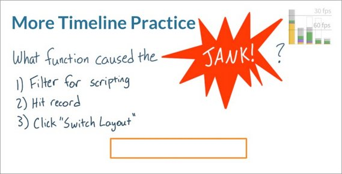](../assets/images/bro3-22.jpg)

#### 3.10 Solution
Okay, here's my timeline. But you know, sometimes you can have a pretty good idea of where the cause of jank might be found in the pipeline, but other times it could be kind of tricky to find.

[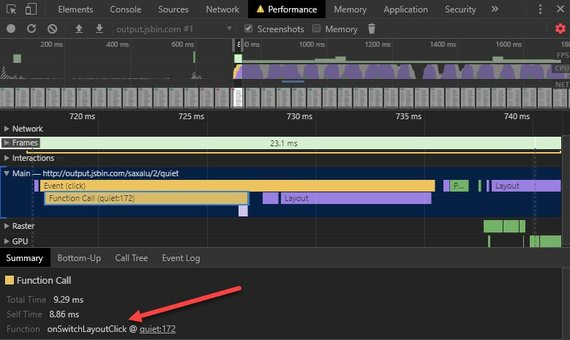](../assets/images/bro3-23.jpg)

Now, I see a bunch of frames here, and it looks like the last scripting thing to happen before all the layouts happened right here. So, I'll go ahead and zoom in. I clicked on this last scripting event. I zoomed in a little bit further to see that this event caused a function to run, I'll click on it in see that it's location is in this quiet file at line 172.Click on that to see what it's referring to in fact this functionOn switch layout click is definitely the culprit that i'm looking for here.

[](../assets/images/bro3-24.jpg)

Toggling wide on the body is causing all of those janky long layouts. So, the correct answer is the function `onSwitchLayoutClick`.

### 11.11 Quiz: Finding Jank
[Here's another link to a website](http://jsbin.com/nanana/2/quiet). Just like before, hit Record and hit Switch Layout.

Record a timeline trace, and see if you can figure out where the jank is coming from.
Once you think you've found the source of the Jank, type the name of the function into this box.

[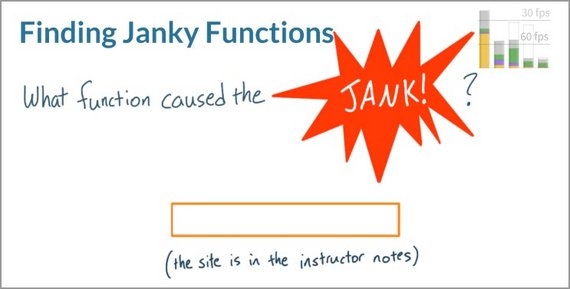](../assets/images/bro3-25.jpg)

#### 11.11 Solution
The trace for the site is looking actually pretty close to 60 frames per second, but it's not quite there. All the big purple bars are a pretty good indication that there's probably too much layout happening.

[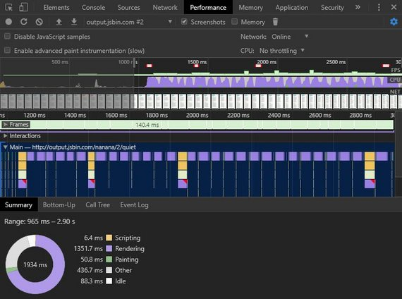](../assets/images/bro3-26.jpg)

Just like before, I want to find the cause of the jank, so I'll zoom into the beginning of the trace to see what started this mess. When I zoomed in it becomes pretty apparent that there's something wrong with these layouts. These red triangles definitely look like warning signs to me.

[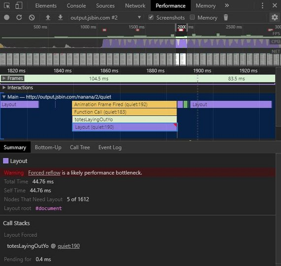](../assets/images/bro3-27.jpg)

I've clicked on one, and then inside the Details pane I see a warning. The warning says that, "Forced reflow is a likely performance bottleneck." Well, this seems like a pretty useful message, and where's it happening?

On a function called `totesLayingOutYo`. Well, it's coming in at the `quiet` script on line 190. I think this might be the culprit. Just to make sure, I've clicked on the function that led to this forced reflow layout, and it's pointing me to the quiet script, too.

[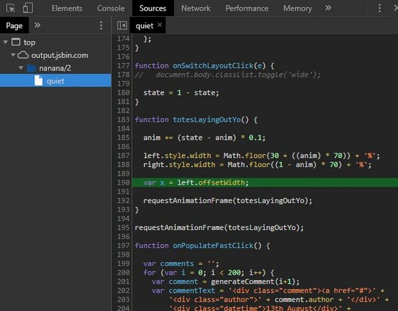](../assets/images/bro3-28.jpg)

And there it is `totesLayingOutYo` on line 190, he's setting offset width which is forcing layout. And there you have it, there's the source of the jank.

This time the jank wasn't caused by the function that started it. But, in fact, it's a function that's being called every time a new frame has to be run. So the jank isn't caused by a function running at the beginning of the script, it's a function that's being called every frame by `requestAnimationFrame`.

This means the correct answer is `totesLayingOutYo`.

By the way, Paul and I will come back to this example later on in the course. You'll learn just a little bit more about what you're seeing here and what this performance issue is.

### 11.12 Quiz: More Jank
In the instructor notes, you'll find a link to this kind of terrifying website.

[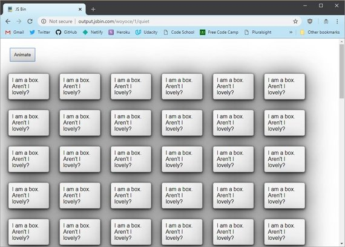](../assets/images/bro3-29.jpg)

It may not look like much now but click this animate button and see what happens.

[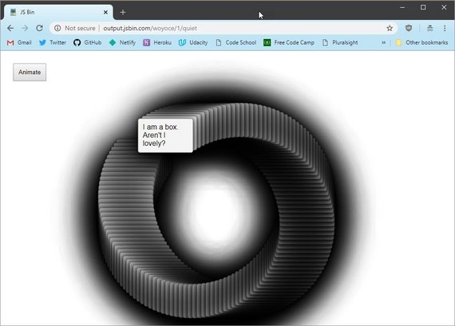](../assets/images/bro3-30.jpg)

So this is a really super janky animation. Even on a new MacBook Pro, this thing barely chugs along. What I want you to do is record a timeline trace of what happens when you click the Animate button.

When you've got the timeline play with it along with the tabs and see which works better for you as you're analyzing the website.

Just like before, I want you to find where the ridiculous Jank in the timeline is coming from. So what is causing it? Pick one of these answers.

[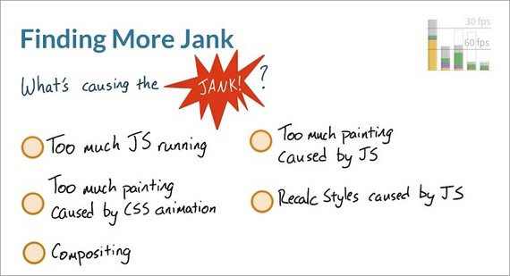](../assets/images/bro3-31.jpg)

#### 11.12 Solution
I'm seeing a lot of green in the timeline, which is a pretty good indication that there's a Paint problem.

[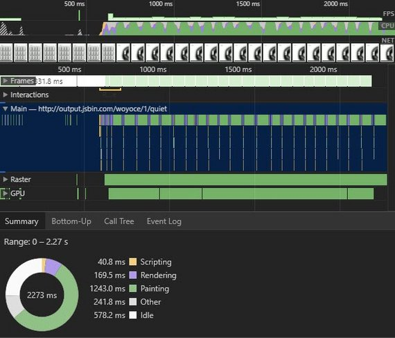](../assets/images/bro3-32.jpg)

I'll go ahead and zoom into one of these frames. It looks like each frame is starting with the script. There's an Animation Frame Fired followed immediately by style calculations and then a Paint.

[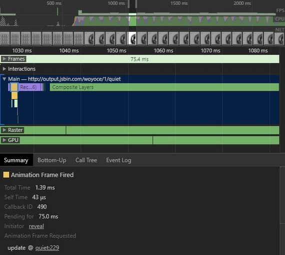](../assets/images/bro3-33.jpg)

This looks like a JavaScript problem because if the problem was coming from CSS, then chances are I wouldn't be seeing an animation frame being fired.

So in the end it's pretty clear that there is a paint problem and it's being caused by JavaScript.

### 11.13 Lesson Outro
So now you know how to spot jank using DevTools and you're getting into the details of where jank is coming from in the pipeline.

In the next lesson, you'll dive into the details just a little bit more as you look at the common causes of jank and how you can fix them.

## 12. JavaScript Debug
### 12.1 Lesson Intro
Let's take stock of where you are in your 60 frames a second journey, so to speak.

1. You know what goes into making a frame and how different styles affect the pipeline.
2. You know about how to prioritize your performance work based on RAIL. (LIAR)
3. You know about the application life cycle and Chrome DevTools timeline.

Now you are going to step into the common causes of jank that crop up time and time again. You'll use dev tools to find those problems, fix them, and test the results. 

You'll be starting at the beginning of the pipeline with JavaScript.

### 12.2 Just In Time
Okay, the first thing you need to know about JavaScript, is that the code you write, isn't actually the code that runs. Now that may sound a little strange if you never heard it before, but it comes about because of the fact that modern JavaScript engines recompile your code to something that can run more quickly. It's done thru a Just In Time compiler, or JIT.

[](../assets/images/bro4-1.jpg)

A JIT compiler will optimize the JavaScript bit by bit as it runs, and it's a brilliant but extremely complex engine. For us as developers, what that means is that there's no way to look at JavaScript and know exactly what code will run in the engine.

[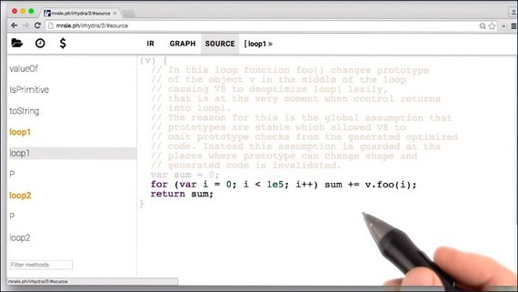](../assets/images/bro4-2.jpg)

Take a look at this JavaScript code here. It's a for loop, it's pretty simple. But if we use this tool called IRHydra to look at how Chrome's JavaScript engine V8 would look at representing it, it looks like this.

[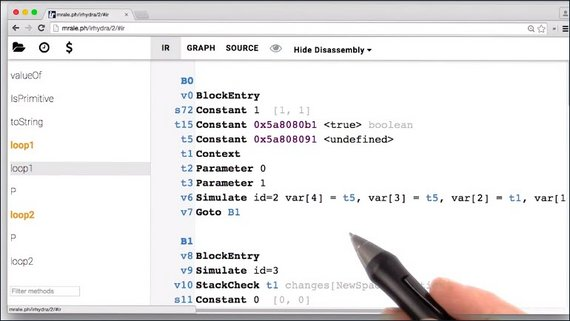](../assets/images/bro4-3.jpg)

Now you don't need to understand any of this. This is just how Chrome and its V8 JavaScript Engine understands the code that you wrote. But what I want you to take away here is that you should avoid what we call micro-optimizations.

Micro-optimizations come about when you try to write code that you would think would be a little bit faster for a browser to run. Like say, which is faster, this for loop or this while loop?

[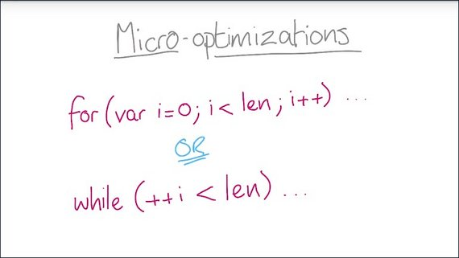](../assets/images/bro4-4.jpg)

But the thing is, we don't know how the JavaScript engine is going to treat these two pieces of code. So there's no point in guessing. Any micro-optimization you write should be a last resort once you've exhausted all your other options.

In short, what I'm saying is don't spend your time comparing similar pieces of JavaScript in this way. It won't help you. There are other things you can do to improve performance that don't involve micro-optimizations.

So you're done, right? I mean, you can't guess exactly how a JavaScript engine is going to handle your code. So obviously we can move on. Well, no, actually. It turns out there are plenty of things that you can do to make your code run better.So let's get started

### 12.3 Quiz: JS Optimize for Animation
While you shouldn't concern yourself with micro-optimizations like this one, there are obviously steps you can take to ease JavaScript's burden on the rendering pipeline. 

Think back to the different stages of RAIL. Each stage has a different window of time to execute JavaScript without incurring a user experience penalty. That is to say, you have a small amount of time to execute JavaScript, and if all of it happens before the window of time is over, the app will still feel snappy and smooth.

[](../assets/images/bro4-5.jpg)

Looking at this time frame for an animation, you realistically only have about ten milliseconds to do everything you need to do to prepare the frame, which includes running layout, compositing, and paint.

So, with that in mind, how do you make sure JavaScript is out of the way as much as possible to hit that ten-millisecond deadline? Pick one of these four answers.

[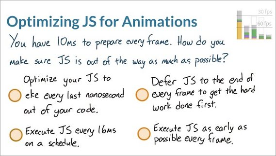](../assets/images/bro4-6.jpg)

#### 12.3 Solution
As JS can trigger every part of the rendering pipeline, it makes sense to run it as early as possible each frame.

[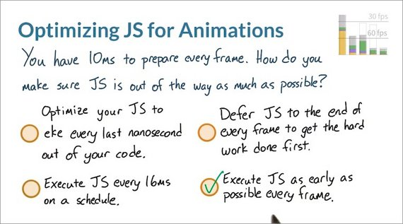](../assets/images/bro4-7.jpg)

- For the first one, no. Remember, micro-optimizations really aren't that helpful.
- For the second one, not quite. While it may seem like a good idea to execute JavaScript on a 16 millisecond schedule, this doesn't necessarily guarantee that JavaScript is always executing at the right time for each frame.
- The third one isn't right either. You need to make sure that JavaScript is done as early as possible, because it can lead to style calculations, layout, and paint. In fact, this answer doesn't even really make sense, because the frame is done when the pixels are painted.
- The last answer is correct. The beginning of every frame is definitely the best time to run JavaScript because remember, it can create style, layout, paint and compositing changes. And finishing JavaScript early means you have as much time as possible to take care of everything else.

In the next video, you will learn about request animation frame which is an API that will schedule your JavaScript to run at the right point of every frame.

### 12.4 requestAnimationFrame
RequestAnimationFrame should be your go to tool for creating animations.

Nobody likes to be interrupted in the middle of a task, and the browser is no different. Remember how little time the browser has to render the frame at 60 frames a second.

If one second is a thousand milliseconds and we have to fit 60 frames in, well we have 16 milliseconds.

[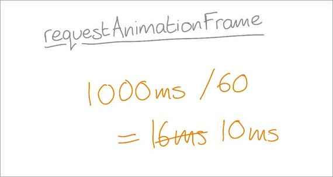](../assets/images/bro4-8.jpg)

Realistically though, there's some overhead to running a frame and the browser has housekeeping to do. So we should aim for about 10 milliseconds instead.

The JavaScript part of your frame should typically be kept around three to four milliseconds at most. Because there's going to be other work, like style calculations,layer management, and compositing that will come afterwords.

[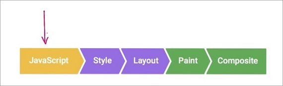](../assets/images/bro4-9.jpg)

I want you to imagine that the browser is in the middle of doing some style work. And then, in comes some JavaScript that needs attention. The browser now has to deal with the JavaScript that just came in before it can move on to other tasks. That new JavaScript may cause the work for the frame to be redone, and that could well mean missing the frame.

RequestAnimationFrame schedules your JavaScript to run at the earliest possible moment in each frame. That gives the browser as much time as possible to run your code, then style, then the layout, painting, and compositing.

A lot of older code around the web that is used for animation, uses `setTimeout` or `setInterval`, because back in the day that's all there was. In fact, jQuery still uses setTimeout for its animation today.

[](../assets/images/bro4-10.jpg)

The problem with both of these functions is that the JavaScript engine pays no attention to the rendering pipeline when scheduling these. They're good functions to use when you want to wait some time to elapse or do some repeated task every so often, but they're not a good fit for animations.

This is how you use `requestAnimationFrame` .You make a call to it and tell it which function you want it to call. That gets called where you do your animation. And at the end of it you schedule the next one. The browser takes care of when it should run and how.

[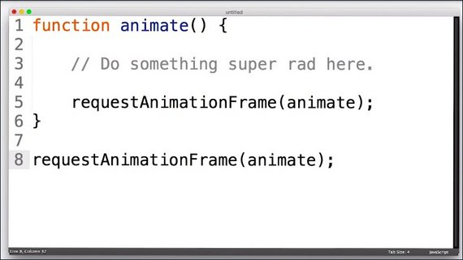](../assets/images/bro4-11.jpg)

Of the many browsers available to users today, the only one that doesn't support requestAnimationFrame is Internet Explorer 9. So, for that you'd need to use a polyfill, which would use setTimeout. It's not ideal as a fall back, but it will allow you at least to use `requestAnimationFrame` in your code and not worry about compatibility.

### 12.5 JavaScript Profile
Hopefully, all your JavaScript is running at the right time in the frame. And that's great. But now, you need to make sure that it's not taking too long to run.

Remember that to meet 60 frames a second you have to fit all the work inside 16 milliseconds. And that's not just JavaScript but everything for our frame.

[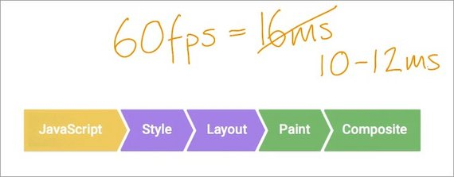](../assets/images/bro4-12.jpg)

In reality, we have to be inside of ten to twelve milliseconds to leave the browser some time for it's housekeeping. It's easy for JavaScript to take quite some time to run, especially if you are using frameworks and libraries because they will need some time to do their work. Whether that's organizing views in your app or handling callbacks or perhaps, even analyzing data.

In previous versions of Chrome DevTools we had to explicitly turn on the JavaScript Profiler when taking a recording in order to get detailed info on which functions were called, when, and for how long.

This is no longer the case. Now we can get this information from the Bottom Up, Call Tree, or Event Log panel.

[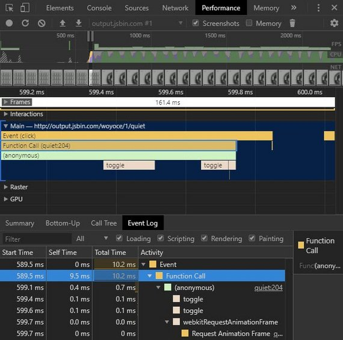](../assets/images/bro4-13.jpg)

The timeline also shows the call stack when we zoom in enough.

### 12.6 Quiz: Long Running JS
For this quiz, you're going to be comparing the time it takes two functions to run. One function will run when you hit Sort by name, and the other when you hit Sort by number.

[Here is the link to the site.](http://jsbin.com/feloni/3/quiet)

I want you to use DevTools to analyze what happens when you hit these two buttons. One of these buttons will take longer to sort this list than the other.

[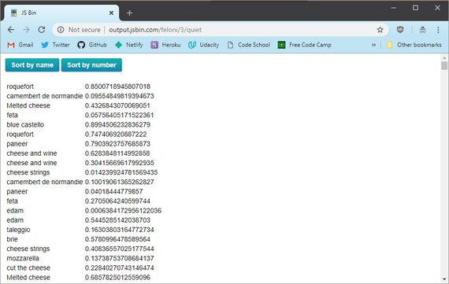](../assets/images/bro4-14.jpg)

I'll give you a hint that the slow function, one of these two, is going to be using a bubble sort which happens to be super, super slow.

The other of these two functions is going to be using JavaScript's built in sort function which is way faster. The point of this quiz question isn't necessarily about which sort function you should use, though in fact the built in one is normally great.

[](../assets/images/bro4-15.jpg)

This question is about being able to see, at a glance, how much work is going into a frame.

#### 12.6 Solution
I hit record and then I hit both buttons. On first look it's pretty obvious to see what's going on here. Here's the first click and here's the second one. As a child of the first click event `onSortOne` ran. And, as a child of the second click event `onSortTwo` ran.

And just looking here it's pretty obvious that `onSortOne` took longer to run.

[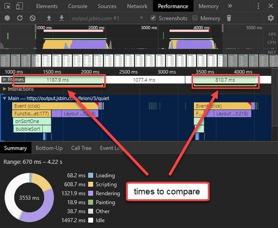](../assets/images/bro4-16.jpg)

Before I move on, I want to point out some interesting bits in this little sample. If you're in the flame view and you click on the top-level click record like this one here, you can pull up the details pane for some useful information.

This pie chart gives you an idea of how much time it took different events caused by this function to run. You can get the scripting time for this function itself, which tells you how long it took just this function to run. And if this function called any others, which this one did, then you can see how long it took it's children to run.

[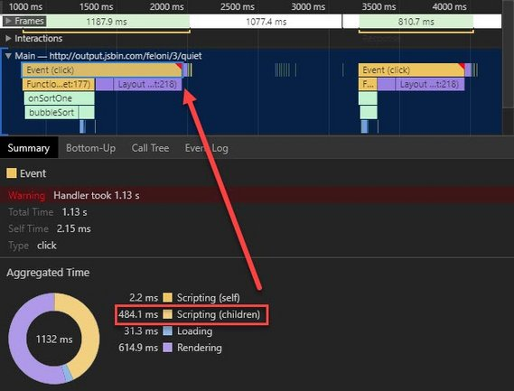](../assets/images/bro4-17.jpg)

In this case the function that ran on the click called other functions including the `bubbleSort` one, which is included in this children scripting time.

[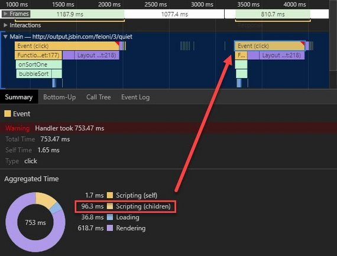](../assets/images/bro4-18.jpg)

I've changed over to the second click event for the second event and you can see that the scripting time for its children, is only 96 milliseconds, compared to 484 milliseconds.

I want you to notice one other thing. After the first click there is a recalculate style and then a layout event, and after the second click there is another recalculate style and another layout event.

[](../assets/images/bro4-19.jpg)

These two pairs of recalculate style and layout are essentially the same length. This is a clear indication that no matter how you sort the data in this example, you still have to write out the whole table of results, which is going to require recalculating styles, relaying out the page, and repainting everything.

So with all that in mind, answer one took longer to run.

### 12.7 Quiz: Web Workers
Web Workers are really super useful, so you're going to be creating one for this next quiz.

Web workers provide an interface for spawning scripts to run in the background. Normally, websites run in a single thread running on the operating system. Web workers allow you to run JavaScript in a totally different scope than the main window and on a totally separate operating system thread.

[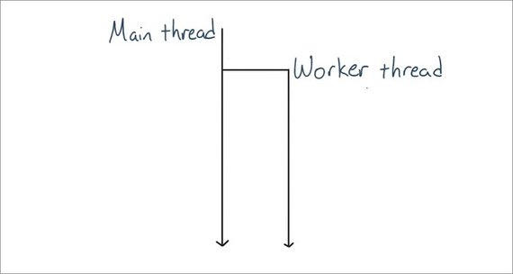](../assets/images/bro4-20.jpg)

Whatever work is happening in the main thread, in the main window, won't affect or be affected by the worker thread. And of course the opposite is true. Whatever work is happening in the worker thread won't affect or be affected by the main window, but the two can send messages back and forth.

This means that you can isolate long running JavaScript inside a worker thread and allow the main thread to run free unimpeded.

[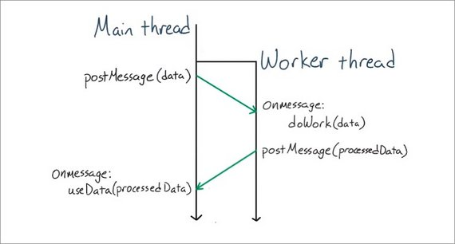](../assets/images/bro4-21.jpg)

What's really cool though is that the web worker and the main thread can communicate with each other. Altogether, web workers are an incredibly valuable strategy for running long running code that does not create any jank on the main thread.

Essentially you'll need to create a separate JavaScript file which your main app will spawn into a new web worker.

```js
var w = new Worker('worker.js);
```

For this quiz I want you to download and dejankify [this small app](https://github.com/udacity/web-workers-demo).

[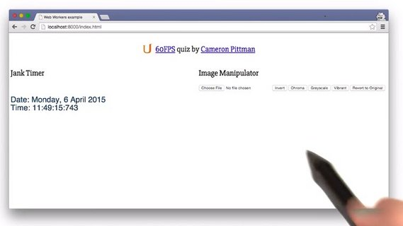](../assets/images/bro4-22.jpg)

I want to point out the two main features of this app.

On the left side there is the Jank Timer which will tell you if any jank appears on the page. And on the right side there's the image manipulator, which will let you pick a file from your local machine and then do some type of image manipulation on it.

In this case I've just gone ahead and uploaded a Chrome logo. The image manipulator's janky and needs a little bit of work. Watch what happens when i click invert.

[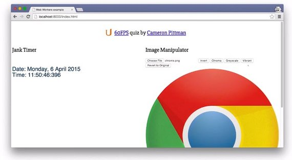](../assets/images/bro4-23.jpg)

The page froze for more than four seconds as this image was being inverted. That is definitely a lot of jank and that needs to be fixed.

[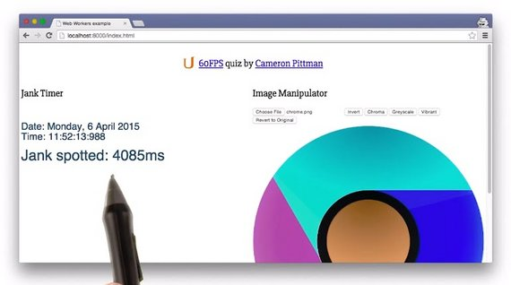](../assets/images/bro4-24.jpg)

Your job for this quiz is to offload the image manipulation work from the main thread into a web worker.

You know you've done it correctly when the page doesn't freeze for multiple seconds when you click one of these buttons.

As a second challenge, there's also a massive performance bug in the way the image manipulators run.

[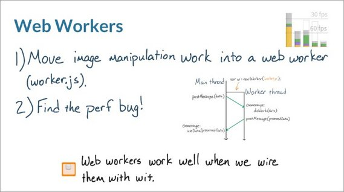](../assets/images/bro4-25.jpg)

<!-- 
I'm about to give you a big hint about where it is in the app. So if you want to really nice challenge right now just stop and click continue to quiz and skip this hint. Okay, are you still here? Here it comes.Inside image-app.js you can find this loop, which includes the logic for separating each pixel into the different channels, and then running some manipulation on them. This function, manipulate, is where you should start looking for the performance bug. To help you out with the web worker, I'm including a file called worker.js that currently handles most of the web worker. It's going to be your job to go into image-app.js and then install worker.js as a web worker. So, once you've moved the image manipulation work into a web worker and you've found the performance bug, check this box to let us know that you're done. -->

##### 12.7 Resource Links

- [Image manipulation repo](https://github.com/udacity/web-workers-demo) - App to download and de-jankify
- [Web Worker docs](https://developer.mozilla.org/en-US/docs/Web/API/Web_Workers_API/Using_web_workers) -  on MDN
- [Web Workers](http://www.html5rocks.com/en/tutorials/workers/basics/) - on HTML5 Rocks

#### 12.7 Solution
It makes sense to start by taking a look at worker.js. Notice that when it receives a message from the main thread, it's going to get two things, the image data and the type of manipulation.

#### worker.js

```js
importScripts('imageManips.js');

this.onmessage = function (e) {
  var imageData = e.data.imageData;
  var type = e.data.type;

  var a, b, g, i, j, length, pixel, r, ref;
  try {
    length = imageData.data.length / 4;
    var manipulatePixel = getManipFunc(type);
    for (i = j = 0, ref = length;
      0 <= ref ? j <= ref : j >= ref;
      i = 0 <= ref ? ++j : --j) {
      r = imageData.data[i * 4 + 0];
      g = imageData.data[i * 4 + 1];
      b = imageData.data[i * 4 + 2];
      a = imageData.data[i * 4 + 3];
      // pixel = manipulate(type, r, g, b, a);
      pixel = manipulatePixel(r, g, b, a);
      imageData.data[i * 4 + 0] = pixel[0];
      imageData.data[i * 4 + 1] = pixel[1];
      imageData.data[i * 4 + 2] = pixel[2];
      imageData.data[i * 4 + 3] = pixel[3];
    }
    self.postMessage(imageData);
  } catch (e) {
    throw new ManipulationException('Image manipulation error');
  }
};

function ManipulationException(message) {
  this.name = "ManipulationException";
  this.message = message;
}
```

`e` is the whole message from the main thread. And then the data is the user data that we're sending to the worker. So, when I post a message to the web worker, I'll make sure that both of these are included.

Back in the image app, notice that the loop is gone from `manipulateImage`. That's because the loop now lives in worker.js. At the top of the script, I created the web worker from worker.js andI just called it `imageWorker`.

#### image-app.js

```js
(function(){
  var original;
  var imageLoader = document.querySelector('#imageLoader');
  imageLoader.addEventListener('change', handleImage, false);
  var canvas = document.querySelector('#image');
  var ctx = canvas.getContext('2d');

  // Add web worker
  var imageWorker = new Worker('scripts/worker.js');
  imageWorker.onmessage = (e) => {
    toggleButtonsAbledness();
    return ctx.putImageData(e.data, 0, 0);
  };
  imageWorker.onerror = (e) => {
    function WorkerException(message) {
      this.name = 'WorkerException';
      this.message = message;
    }
    throw new WorkerException('Worker error.');
  };

  function manipulateImage(type) {
    var imageData;
    imageData = ctx.getImageData(0, 0, canvas.width, canvas.height);

    toggleButtonsAbledness();

    let data = { 'imageData': imageData, 'type': type };
    imageWorker.postMessage(data);
  }
})();
```

When I'm ready for the worker to start doing its work, I'll simply post a message to it by calling `postMessage` on the variable for the worker that I created above.

Next up there's the `onmessage` handler that's attached to the web worker. This function gets run once the web worker returns something back to the main thread.

As a good practice, I also included an `onerror` handler on the web worker. It also calls a function, which in this case throws a web worker exception.

#### Processing done in Main thread (non-web worker solution)
All right. Now let's see how all of this runs. I've opened the solution in the browser and I've loaded my own image.

[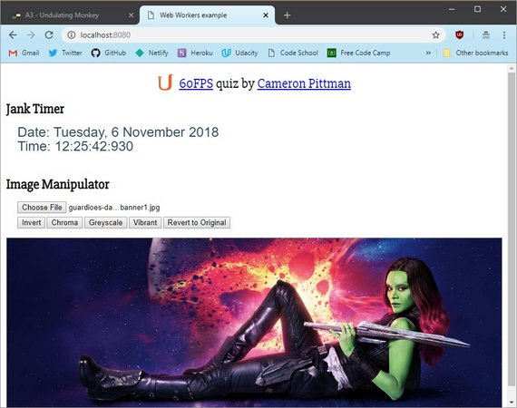](../assets/images/bro4-26.jpg)

This first run will be with the old code. When I hit Invert I get a jank reading of 243ms.

[](../assets/images/bro4-27.jpg)

Here's the detail reading

[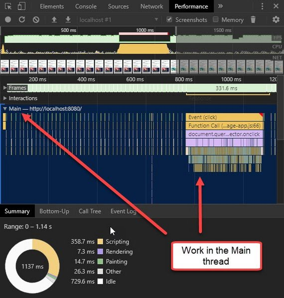](../assets/images/bro4-27a.jpg)

#### Processing done in Web Worker

Next I load up the web worker solution. I'll hit Invert and watch. No Jank, it doesn't freeze up, and then a few seconds later, the inverted image appears

[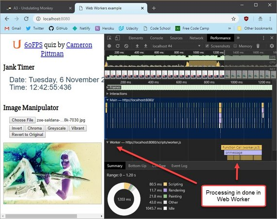](../assets/images/bro4-28.jpg)

Here is the detail view.

[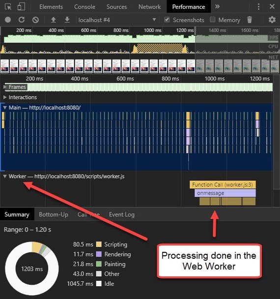](../assets/images/bro4-28a.jpg)

Notice that there was no huge stutter. There was no Jank appearing in the timer. That's a really good sign that the image manipulation work, is happening off the main thread.

Notice how the main thread stays at 60 frames per second the whole time. That's awesome. And also you can see the processing has been offloaded from the main thread into the Worker thread. Very cool.

### 12.8 JS Memory Management
Finally, I want to point out one other aspect of JavaScript. And that is memory management approach. JavaScript is garbage collected, which means for us developers, we don't need to worry about pointers, deleting objects, or how to handle local variables, any of that.

We can just declare things like this `var x = { ... }` and forget about them. The downside is that the JavaScript engine has to handle that itself, and when it decides to run the garbage collector, nothing else runs. This can trigger visible pauses in rendering the page.

Like I said earlier, the JavaScript you write isn't the JavaScript that runs, thanks to JIT. So it's not always easy to predict whether your code is going to be garbagey. It also depends heavily on the frameworks and libraries you use, and how you structure your code. That's why you need to measure first.

Well, the good news is that Chrome's DevTools will show you memory usage in your projects. Okay, take a look at [this undulating-monkey project](http://lab.aerotwist.com/webgl/undulating-monkey/). I made this a while ago. Don't ask me, it's pretty weird. I'm not sure what kind of mood I was in that day.

[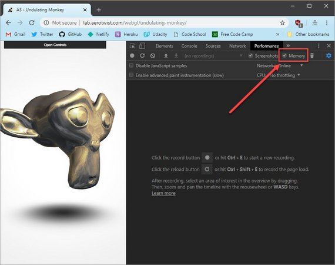](../assets/images/bro4-29.jpg)

What we can do is, we can see the memory usage of this demo in Chrome DevTools. You can see I've checked the Memory box before running the profiler.

[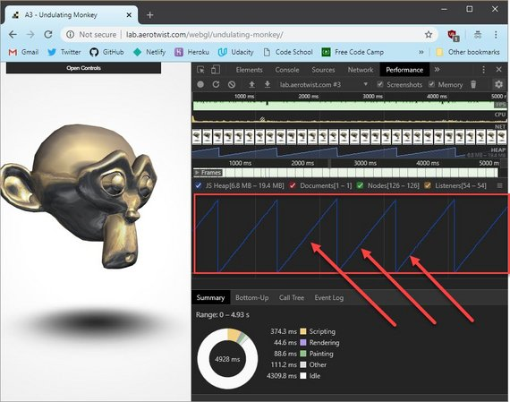](../assets/images/bro4-30.jpg)

What we see is this sawtooth pattern here and that's actually fine. We expect JavaScript to use some memory and eventually, when this drop-off happens, that's the garbage collector running.

There are two things we're looking for here.

- Firstly, are there a lot of fast climbs? That can indicate that we're assigning a lot of memory very quickly and very often.
- Secondly, when the garbage collector runs, does it take it back to zero? If not, we might have a memory leak.

If we're interested in a little more detail on the garbage collection, we can switch off the memory profiler and then go to the search down here.If that's not on your screen, you can hit Cmd+F or Ctrl+F.

[](../assets/images/bro4-31.jpg)

Enter GC into the field. And then hit Enter.In my case, I've got five results.

I can step through them with these arrows. And you can see, for example, I'm only spending a fraction of a millisecond here.

[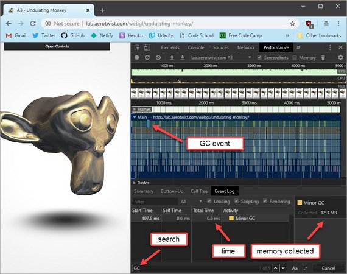](../assets/images/bro4-32.jpg)

If you find that you're missing frames because of garbage collection, then there are some fabulous resources you can use to learn more about patterns and practices that will help you avoid creating too much garbage.

Check out these links for more information.

#### Garbage Collection Resources

- [Undulating Monkey](http://lab.aerotwist.com/webgl/undulating-monkey/)
- [Writing Fast, Memory-Efficient JavaScript on Smashing Magazine](http://www.smashingmagazine.com/2012/11/writing-fast-memory-efficient-javascript/)
- [Memory Management on MDN](https://developer.mozilla.org/en-US/docs/Web/JavaScript/Memory_Management)
- [High-Performance, Garbage-Collector-Friendly Code on Build New Games](http://buildnewgames.com/garbage-collector-friendly-code/)

### 12.9 Quiz: QR Code App 1
This is a QR code app that Paul Kinlan put together.

[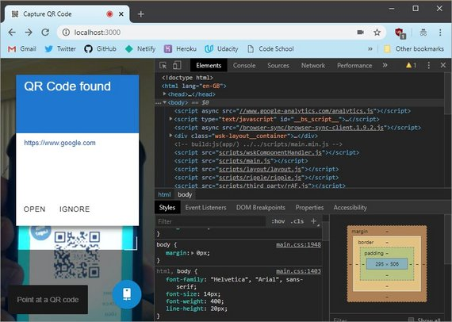](../assets/images/bro4-33.jpg)

You'll need a copy on your local machine, so follow these instructions.

[Here's a link to the QR Code App repo](https://github.com/udacity/qrcode)
Build instructions:

1. Clone the repo
2. Update the gulp-sass line (#18) in package.json to `"gulp-sass": "^3.1.0",`
3. [Install npm](https://github.com/npm/npm)
4. [Install Gulp](https://github.com/gulpjs/gulp/blob/master/docs/getting-started.md)
5. Run `npm install` in the QR Code App directory
6. Build and run with `gulp serve`

This is a really cool app, but right now it's a bit janky.

In this first quiz, you'll be replacing `setInterval` with `requestAnimationFrame`. And in the second quiz you'll be moving all the image decoding work off the main thread and into a web worker.

Before you start working on the app, you'll need to install gulp if you don't already have it. Once you install gulp, run npm install to get all the dependencies, and that will allow you to run `gulp serve` to build and then serve the web site.

`gulp serve` also watches all your files for changes. So if you save a change to any of the JavaScript files, it'll automatically rebuild and refresh the page.

So for this quiz navigate to `app/scripts/main.js` in your favorite text editor and start using `requestAnimationFrame`. Build and run the page with `gulp serve`.

You'll know you've done it properly when the app loads and you see "Animation Frame Fired" in the timeline. When you're done check this box to let us know that you're firing animation frames.

#### 12.9 Solution
Here's the Performance panel recording of the QR Code app prior to any changes.  it's using `setInterval` for its polling.

[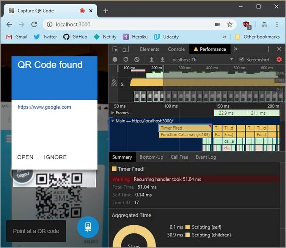](../assets/images/bro4-34.jpg)

It shows a warning on "Timer Fired" and show that the handler took 51ms to complete.

I'm `main.js` I went to find `setInterval` the easy way by using Cmd+F. It looks like `setInterval` is repeating on a four millisecond timer, which is actually a little ridiculous.

I go ahead and remove that and replace `setInterval` with `requestAnimationFrame`.

```js
  var isSetup = setupVariables(e);
  if(isSetup) {
    // setInterval(captureFrame.bind(self), 4);
    requestAnimationFrame(captureFrame.bind(self));
  }
  else {
    // This is just to get around the fact that the videoWidth is not
    // available in Firefox until sometime after the data has loaded.
    setTimeout(function() {
      setupVariables(e);

      // setInterval(captureFrame.bind(self), 4);
      requestAnimationFrame(captureFrame.bind(self));
    }, 100);
  }
```

Okay, now, that's simple enough but remember, the function itself also needs to call `requestAnimationFrame`. Here's the function `captureFrame` which is running the animation. And inside, I will make another call to `requestAnimationFrame` to the same function.

```js
var captureFrame = function() {
  // Work out which part of the video to capture and apply to canvas.
  canvas.drawImage(cameraVideo, sx /scaleFactor, sy/scaleFactor,
    sWidth/scaleFactor, sHeight/scaleFactor, dx, dy, dWidth, dHeight);

  drawOverlay(dWidth, dHeight, scaleFactor);

  // A frame has been captured.
  if(self.onframe) self.onframe();

  coordinatesHaveChanged = false;

  requestAnimationFrame(captureFrame);  //   <- add this
};
```

I'll save it, and let's see what it looks like. I record it and look at the timeline. It looks like "Animation Frame Fire"d is being called over and over.

[](../assets/images/bro4-35.jpg)

So it looks like the job here is done. All right, well, now it's on to the Web Worker.

### 12.10 Quiz: QR Code App 2
Right now, the QR code app is doing all of the image decoding on the main thread. It's hard work, and it sometimes introduces a bit of jank to the app. This is actually a perfect situation for Web Workers.

Image decoding can be handled in a separate thread by a worker while the main thread is simply concerned with delivering 60 frame per second video. The main thread can send off image data to the worker so it can do its analysis. And then when it's done, the worker will simply post the data back to the main thread.

[](../assets/images/bro4-21.jpg)

In this case, the processed data that the worker thread will be sending back to the main thread is simply a URL if the QR code was resolved, or undefined, if not.

Here are the steps to refactor this app:

1. Use this Web Worker: `app/scripts/qrworker.js`
2. Create Web Worker in: `QRCodeManager` in `app/scripts/main.js`
3. Send data to worker from: `detectQRCode`
4. Remove unnecessary scripts from: `index.html`

#### 12.10 Solution
The first thing I did was open `app/scripts/main.js` and add in the Web Worker code.

I commented out old call to the `decode` method and then created a `postMessage` to send `imageData` to the Worker. Next I added the `onmessage` listener to receive data back from the Worker.

```js
var QRCodeManager = function(element) {
  var root = document.getElementById(element);
  var canvas = document.getElementById("qr-canvas");
  var qrcodeData = root.querySelector(".QRCodeSuccessDialog-data");
  var qrcodeNavigate = root.querySelector(".QRCodeSuccessDialog-navigate");
  var qrcodeIgnore = root.querySelector(".QRCodeSuccessDialog-ignore");

  var client = new QRClient();
  var qrWorker = new Worker('scripts/jsqrcode/qrworker.js');  // <- here
  // ...

  this.detectQRCode = function(imageData, callback) {
    callback = callback || function() {};

    // client.decode(imageData, function(result) {
    //   if(result !== undefined) {
    //     self.currentUrl = result;
    //   }
    //   callback(result);
    // });

    qrWorker.postMessage(imageData);

    qrWorker.onmessage = function (e) {
      var result = e.data;
      if (result !== undefined) {
        self.currentUrl = result;
      }
      callback(result);
    };
    qrWorker.onerror = function (err) {
      function WorkerException(message) {
        this.name = "WorkerException";
        this.message = message;
      }
      throw new WorkerException('Decoder error');
    };
  };
  // ...
})();
```

Lastly, I commented out the scripts from `index.html` since they are now being imported into the Worker.

Here's the updated Performance recording with two timelines. One for the main thread and another for the worker. Each frame is running at 60 fps or above.

[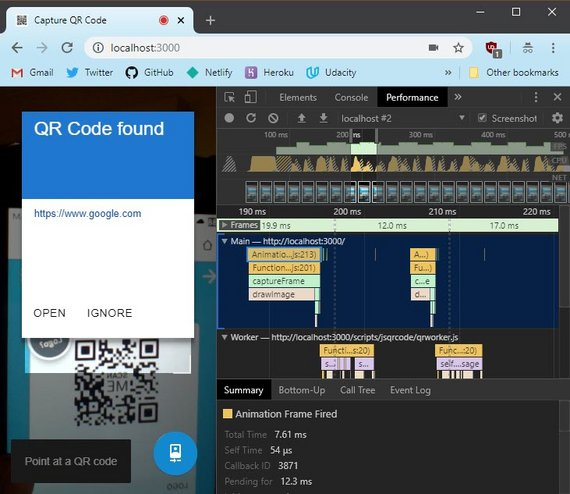](../assets/images/bro4-36.jpg)

### 12.11 Lesson Outro
JavaScript profiling takes some practice, but now you know the tools you need to succeed.

So, have a look at your own projects and see if you have some long-running JavaScript or some badly timed JavaScript. See where you can reschedule it, reduce its impact, or just remove it all together.

Now, a lot of people often think at this point, they're done with their performance work. And if the JavaScript runs well, well there's nothing else left to do. But that's not at all true. As you saw earlier, there's a whole pipeline after the JavaScript runs, and that also needs to fit into that ten to 12-millisecond window. As the developer, you're in control of that pipeline. You're the one who decides what the browser does and when.

So in next lesson, we'll be taking a look at the different kinds of work that JavaScript often triggers. It could trigger style calculations, layout, and paint.