<!-- markdownlint-disable MD022 MD032 -->
<!-- # Mobile Web Specialist Nanodegree -->
# Client-Server Communication

[<-- back to Mobile Web Specialist Nanodegree homepage](../index.html)

---

### Supporting Links

## 1. HTTP's Req/Resp Cycle
### 1.1 Course Intro

Welcome to Client Server Communications, a course about the web.

[](../assets/images/cs1-1.jpg)

Technically, the web is only a small part of the internet. However, it is the only part of the internet that people use without even realizing that what they're using is the web.

The web is the platform that you, the web developer, can use to publish your ideas to the world. It is the common language between your servers and your clients.

[](../assets/images/cs1-2.jpg)

Every time you open a browser, every time you download an app, every time you receive a message on WhatsApp or Facebook, you're using the web.

More generically, in that very moment, a client is communicating with a server, and vice versa.

But what does that actually mean? What's happening when you navigate to a web site? How did the phone know that somebody sent me a message? What capabilities does the web have, and more importantly, what are its limitations?

Hi ,I'm Surma. I'm an engineer at Google in London, and I work with the Chrome team.

[](../assets/images/cs1-3.jpg)

In this course, we are going to understand what the web actually is, how we can use it to your advantage,and how you can avoid mistakes that will make both your user experience and security suffer.

Some of this may seem like review, and it is, but we will also go into the lesser known parts of HTTP.

To think like an engineer, you need to understand both the semantics that HTTP uses, as well as the implementation inside the browser.

We'll use that knowledge to

- use browser APIs to the fullest potential
- secure HTTP against eavesdroppers
- deploy the web's newest protocol, HTTP2.

All this knowledge will help you make informed decisions for your app and persuade others when optimizing and securing their apps.

Hi.I'm Richard, a course developer at Udacity and an experienced web developer.

[](../assets/images/cs1-4.jpg)

While Surma teaches you about HTTP's request and response cycle, security, and the best practices of HTTP2, I'll be here to reinforce this knowledge with examples and quizzes.

Understanding both the capabilities and limitations of the medium we work in on a day to day basis will help you take the next important step towards mastery.

By the end of this course, you will understand literally every byte that is being sent from your browser to the server and back.

### 1.2 HTTP Requests
The internet has been around for longer than the web. While computers already had something to communicate with over the internet, like email or FTP, there was no common and publicly available way to publish and access documents.

This is where Tim Berners-Lee comes in. He wanted an open mechanism for researchers to publish, read, and comment on papers through the internet.

He wanted a mesh of linked documents that were called hypertext documents. Berners-Lee chose a subset of SGML and called it HTML, the Hypertext Markup Language.

[](../assets/images/cs1-5.jpg)

Then he designed HTTP, the Hypertext Transfer Protocol, to transfer these HTML documents.

Hypertext sounds all futuristic and complicated. But it simply means that the text in that document can have references to other documents. These references are called links.

By getting a document, the user can not only read that document but they can navigate to related documents through these links. Especially in a scientific context for which Berners-Lee designed it, this feature turned out to be incredibly useful.

Hypertext can refer to more than text, though. Files can link to images, code, styles, or anything else.

### 1.3 HTTP Requests 2
How does HTTP work?

In its original form, Berners-Lee came up with a template that you can fill into make a request for a document on a server.

The original protocol, later called HTTP 0.9, was incredibly limited. You fill in if you want to retrieve or store a document, where to store the document, including the name and any additional information you think is necessary.

This request is then handed to the server.

[](../assets/images/cs1-6.jpg)

Since the server speaks HTTP, it knows that this is an HTTP request and can, therefore, understand what the client wants.

[](../assets/images/cs1-7.jpg)

The protocol also has templates for the responses. These are a bit more versatile, since a single request can have a variety of outcomes, including:

- errors
- unreadablerequest forms,
- redirecting the client to a completely different server.

Luckily, Rich did a good job, and I know what he wants.

The only thing left for me to do is fill out this form so Richard knows which request I'm responding to. Bandwidth problems.

### 1.4 Fetching a single req
The tubes and forms are basically the underlying concept of HTTP, **requests**, and **responses**.

Well, we're not really going to be shoving paper through tubes, but rather data through network cables.

This is what an actual request looks like.

[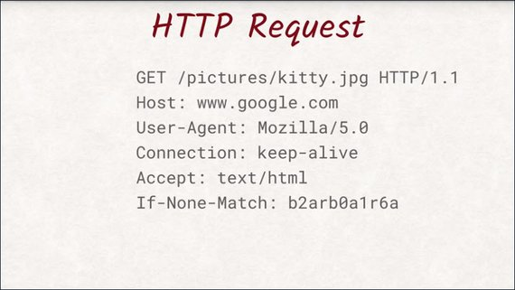](../assets/images/cs1-8.jpg)

This is the exact text the browser sends to the server to request an image called kitty.jpg. Let's dig into the first line a little bit.

In this case, we are trying to 'GET' a document from the server. The protocol is also able to add, delete, and update documents.

[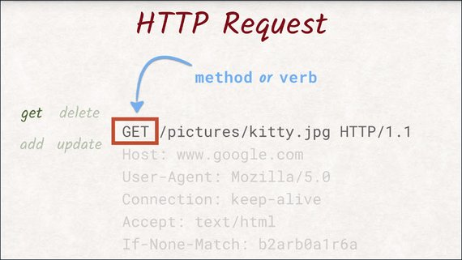](../assets/images/cs1-9.jpg)

To distinguish between these capabilities, the first line starts with an HTTP method or a verb. This request uses the GET method, which means we want the server to send data to us.

Another example of a method is POST, which instructs the server to save the data we are sending.

[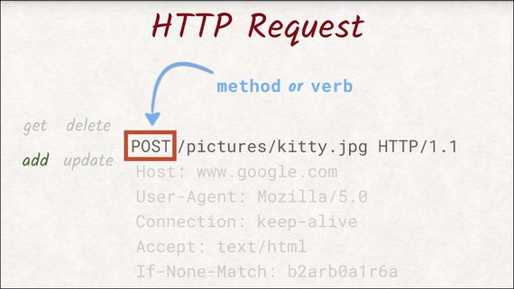](../assets/images/cs1-10.jpg)

There are more methods than these, but we'll worry about them later when we talked about REST APIs. Let's get back to the original request.

After the method, comes the path and name of the document we would like to get. Here, we want the server to send us a file called kitty.jpg located in the pictures directory.

[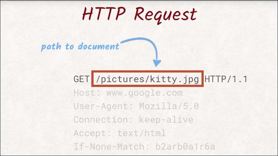](../assets/images/cs1-11.jpg)

The last thing in the first line is the version of the HTTP protocol we are using.

[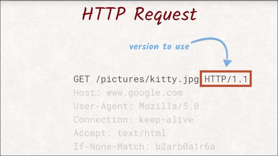](../assets/images/cs1-12.jpg)

As of today HTTP/1.1 is the most common and widely supported version, however HTTP/2 is slowly catching up and taking over as the de facto standard.

More on this later. Surma is now going to show you the different kinds of headers an HTTP request can have.

### 1.5 Fetching a single ref 2
This part of the request is called the header section, as it contains the headers.

[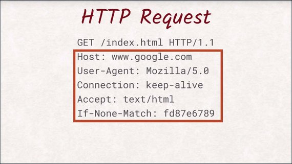](../assets/images/cs1-13.jpg)

Headers are additional data about the request itself.

A lot of these headers are standardized and contain information like:

- what type of browser is making the request
- what kind of format the browser supports
- what version of the document is already available in the browser's local cache.

All of these headers are optional except for the host header.

The smallest request that can be made would only consist of the first line and a host header.

At a first glance, a response looks very similar to a request. The biggest difference is probably the first line.

[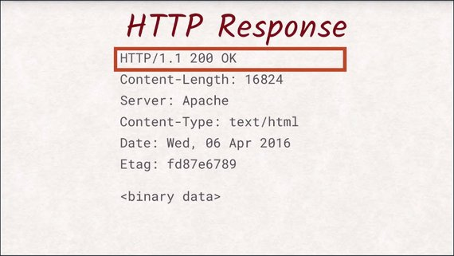](../assets/images/cs1-14.jpg)

Here you can find out the status code of the response that indicates if your request was fulfilled successfully, if the document was not found, or if the server wants to redirect you somewhere else.

Just like with the request, the next section is the header section. 

[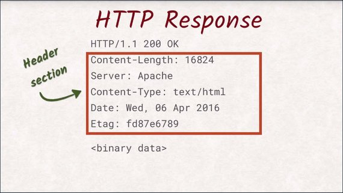](../assets/images/cs1-15.jpg)

It not only contains data about the document, but also about the server and the connection.

Again, most of these headers are optional. The only obligatory header is content-length to tell the client how many bytes of data it should expect.

After the headers and an additional empty line,the actual document is sent. This can be a JPEG image an HTML document or whatever you want to transfer to the user.

### 1.6 Multiple Requests
We just saw how to fetch a single document using an HTTP request. These documents can be any kind of data, really. But on the web, everything usually starts with an index document.

The index document is what the server will send back to you if no explicit file is to find in the request. By typing at URL in the address bar of the browser, the user is instructing the browser to open a new connection to the server identified by the hostname in the URL and getting the document specified in the path of the URL.

[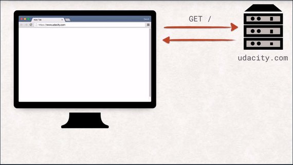](../assets/images/cs1-16.jpg)

In this case, the server will respond with the index.html, and the browser can start parsing it. This is a really interesting step, and the browser does a number of things to handle the received data.

Check out [Converting HTML to the DOM](https://classroom.udacity.com/courses/ud884/lessons/1464158642/concepts/15290985490923) lesson for an explanation on how this works.

After the browser has parsed the response, things start to get a little wild.

As the browser is reading the index.html, it will probably find references to other documents needed to properly display the website. These can be images, style sheets, JavaScript files, videos, you name it.

For each of these resources, another request is sent, and once a response is received by the browser, this entire process of parsing and potentially sending new requests is repeated.

[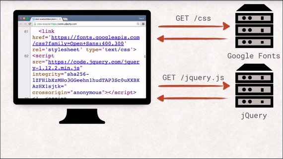](../assets/images/cs1-17.jpg)

That also means that each of these resources can, in turn, pull in additional resources. Each landing page will have its own set of dependencies, like images, CSS, and JavaScript files.

[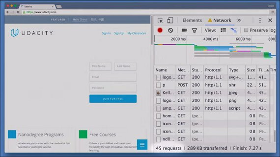](../assets/images/cs1-18.jpg)

That means that visiting a single URL can send off many more requests than you might be aware of.

### 1.7 Exercise Setup
#### Server Binaries
To get a feel for the way a client and server communicate, we've created a bunch of servers that you'll use to complete hands-on exercises. To prevent any issues, we've created binaries that you'll download and launch to run the server locally.

#### Launching the Server

1. Download the exercise binaries
2. Unzip the file
3. Locate the proper binary for your platform
4. Launch by double clicking

#### Supporting Materials

- [L1-DevTools](http://video.udacity-data.com.s3.amazonaws.com/topher/2016/June/57509461_l1-devtools/l1-devtools.zip)

### 1.8 Quiz: DevTools
In this exercise, you're going to count the number of requests and the total amount of data being transferred over the wire.

To help you accomplish this, you're going to use one of the most valuable tools of a web developer, DevTools.

All of the big browsers have their own form of developer tools with similar features. For simplicity's sake, we're going to use Chrome's DevTools.

To open up DevTools, go to the menu, down to More Tools, and choose Developer Tools.Or just press Command, Option-I on Mac or Control, Shift-I on Windows. Then switch to the network tab.

The binary for this server should be started. So launch it, go to the URL it provides,and you should see this same page.

[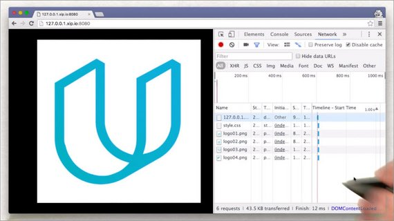](../assets/images/cs1-19.jpg)

As the page is loading, you can see all of the requests being fired off.

Take a look at the requests to see the different headers and the responses.

So count the number of requests and the total amount of data in kilobytes being transferred over the wire, and enter them here.

One quick note: to avoid incorrect results from plugins, extensions, and the browser caching the results, make sure to run this in an incognito window.And make sure disable cache is selected.

#### Solution
I've opened up DevTools, and am on the Network tab.

Here, we see an overview of the whole page as it's being loaded.

[](../assets/images/cs1-21.jpg)

Here is a table that lists out all of the requests, with information about each one. Down here at the bottom, DevTools displays the summary for loading the page.

This page had six requests, and it transferred 43.5 kilobytes of data. So these are the numbers that the quiz was looking for.

As you can see, DevTools is an invaluable resource for a web developer, and we'll be using it throughout the entire course.

#### Update
Chrome now automatically includes 'favicon.ico' in the list of requests... This will show as an additional request adding and additional 2k to the download.

[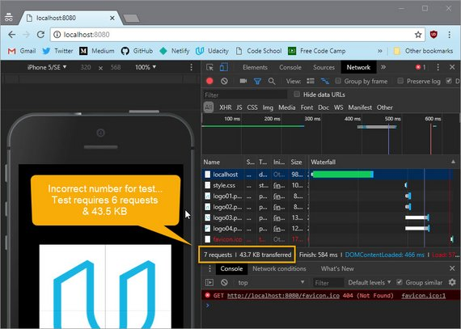](../assets/images/cs1-20.jpg)

### 1.9 Send Post Request
So far, we've only been requesting the server to send data to us using the GET method. However, sometimes you might want the user to type in some data or upload a picture and send that to the server.

This is where the POST method comes into play that we mentioned earlier.

[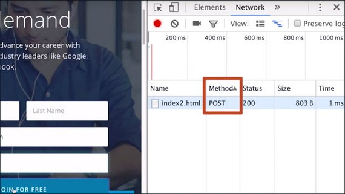](../assets/images/cs1-22.jpg)

With a POST request, the request itself can also have a payload, or body, something we have already seen in responses but not in requests.

What exactly happens to the data once it has been sent to the server is up to the back-end developer and is not in the scope of this course. It is, however, important to know that POST requests are potentially handled differently by proxies and the browser than GET requests.

Have you ever seen one of these? This is what happens when the page you're currently looking at was the result of a POST request.

[](../assets/images/cs1-23.jpg)

If you try to reload such a website, the browser will prompt you to confirm this reload action, as POST requests are allowed to be destructive operations, and repeating it might be more destructive than you originally intended.

That's why it is usually recommended for the back-end developer to not respond to a POST request with a web site but with a redirect, to avoid this rather jarring behavior.

For the user, this redirect is practically invisible but avoids the problems of a reload.

### 1.10 From XHR to Fetch
The browser does a lot of heavy-lifting for us. But as so often in life, we don't always know what we want right from the start.

Imagine a website that wants to show an image of the current weather. We don't know what the weather is going to be when the user visits the website in the future.

Of course, we could have loaded all the images you might possibly need from the very start, but that becomes impractical really quickly.

[](../assets/images/cs1-24.jpg)

So let's talk about Ajax.

Ajax is a group of web technologies that let you make requests programmatically with JavaScript instead of navigating and effectively reloading the entire website.

[](../assets/images/cs1-25.jpg)

XMLHttpRequest, or XHR for short, is the most common way of doing it right now. The API of XHR is arguably confusing and outdated compared to what JavaScript offers nowadays.

That is why we are going to skip talking about XHR and use its successor instead, Fetch.

Fetch does the exact same thing but with a cleaner API utilizing promises, and therefore, it integrates much better with the rest of the modern JavaScript APIs.

[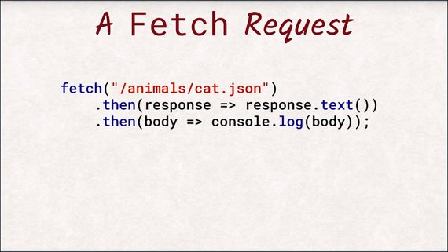](../assets/images/cs1-26.jpg)

If you want to know more about promises, take a look at our course, JavaScript Promises,linked in the instructor notes.

With Fetch, you can utilize all the HTTP methods the protocol specifies and have full control of which headers are being sent--well, almost all the headers.

[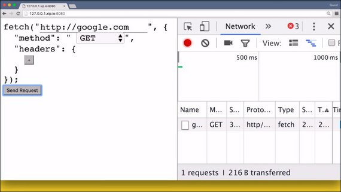](../assets/images/cs1-27.jpg)

Richard is going to show you a small tool to explore the Fetch API with.Open up the networking tab in your DevTools to see if the browser actually sent the request as you specified it.

### 1.11 Quiz: Fetch
Fetch is so much easier to set up and work with instead of battling against XHR and its unnecessary complexities, so we're giving you a chance to play with fetch.

To complete this exercise, you need to fetch a file from a server. This is the server that you need to set up and interact with. But don't worry; it's not complicated to get upand running.

[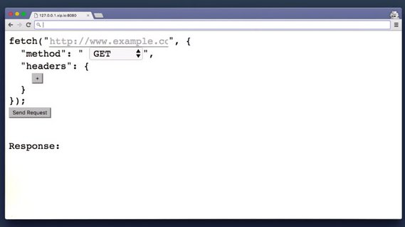](../assets/images/cs1-28.jpg)

[Here's the binary](http://video.udacity-data.com.s3.amazonaws.com/topher/2016/June/5755fd25_l1-fetch-binary/l1-fetch-binary.zip) for this server,so just download the project, launch it, go to the URLit provides, and you should see this same page.

You need to fetch the file password.txt. When you send the request, you have to send it as a PUT request and include the X-Udacity-Exercise header with some text.

If the fetch request is set up correctly,it will return the password. Enter that password here.

[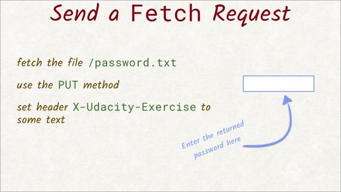](../assets/images/cs1-29.jpg)

If you want an extra challenge, try coding the fetch request from scratch instead of using the fetch builder form. Good luck.

#### Solution
Here's the solution using the form.

[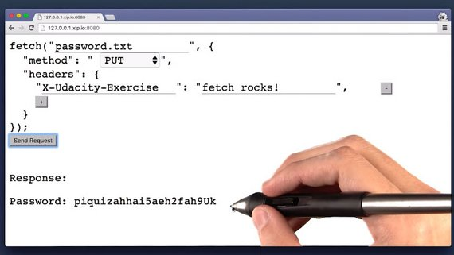](../assets/images/cs1-30.jpg)

This is the solution written out in console by hand.

```js
fetch('/password.txt', {
    'method': 'PUT',
    'headers': {
        'X-Udacity-Exercise': 'some text'
    }
}).then(response => response.text())
.then(text => console.log(text));
```

### 1.12 Outro
We have looked at the request and response cycle of HTTP, so now you have a solid understanding on how HTTP works and what a browser actually does when you visit a website.

You know how metadata is attached to both requests and responses, and you know how to request additional documents using JavaScript.

Next we'll take a closer look at the HTTP protocol and the actual bytes that are being sent back and forth between the server and the browser.

## 2. HTTP/1
### 2.1 HTTP Intro
As developers, both you and I use HTTP everyday.

We issue GET and POST requests when using Firebase's JavaScript SDK, or just when using the browser on our tablet's or mobile phones to look at web sites.

[](../assets/images/cs2-1.jpg)

To be a good front-end engineer creating web apps, merely using HTTP is not enough.

You will need a deeper understanding to see why certain techniques are being used and why others either don't work, or aren't recommended.

In this lesson, we'll start with a look at the first version of HTTP.

We'll examine the GET and the POST methods and a few other useful methods you might not be as familiar with.

We'll look at a variety of headers and how APIs are designed to work well with the web.

By the end of this lesson, you'll be able to debug HTTP request response pairs on the wire, and will understand what a RESTful API is.

### 2.2 The Netcat Command
#### Netcat
Throughout this lesson we'll be using the [Netcat](https://en.wikipedia.org/wiki/Netcat) command. Netcat is a utility that's used for sending and receiving messages over a network connection.

Netcat is known as the Swiss Army knife of networking tools, and we'll be using it to communicate directly with a server.

#### Netcat command
There are many variations of Netcat, and the one I'll be using is accessed with the `nc` command. 

Here I'm using Netcat to connect to Google on port 80 (the default port for HTTP connections).

[](../assets/images/cs2-2.jpg)

The prompt waits for us to enter the details of the HTTP request. To send a GET request, enter:

```bash
GET / HTTP/1.1
```

...then make sure you press the enter button twice (once to get to a new line, and one more to indicate that you're finished entering the request's headers).

And you'll get something similar to:

[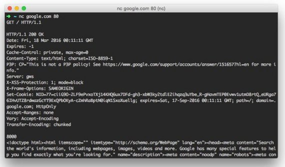](../assets/images/cs2-3.jpg)

### 2.3 HTTP Verbs
Take a look at these. This one is an image of a flamingo. This one is a request to get this image.

Do you notice anything different between them, though?

[](../assets/images/cs2-4.jpg)

HTTP has been around for such a long time that the protocol still does something that you will rarely find in any Modern protocol. It's regular text and can be read by a human.

The bytes being pushed back and forth on the network are plain, old regular text, and can be read by our human brains.

HTTP simplicity also means that we can directly interact with a protocol without a third party library doing any extra work for us.

Every HTTP request begins with a unique verb called a method and serves a specific purpose.

We already know GET and POST, and although these are the most common methods, there are other methods you will encounter regularly.

[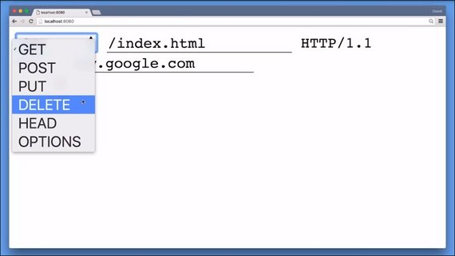](../assets/images/cs2-5.jpg)

The common set of methods consist of GET, POST, PUT,DELETE, HEAD, and OPTIONS. We will talk more about these methods when we talk about REST APIs.

### 2.4 HTTP Verbs 2
Remember that a request starts off with an HTTP method, the path, and the version of the HTTP protocol to use.

This request is using the HEAD method. 

[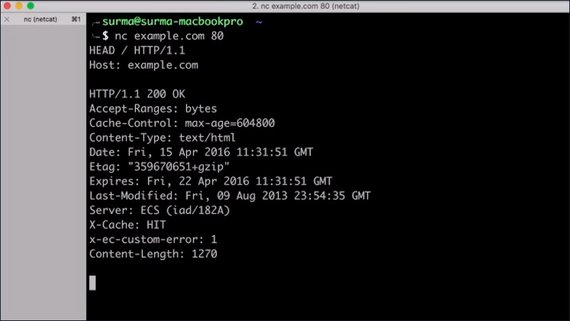](../assets/images/cs2-6.jpg)

HEAD is an interesting method as it allows you to get the headers of a file without having to receive the entire file itself.

This let's you check if there's enough space to store the response or if the cached version of that page is still up to date.

This way the browser can avoid re-downloading a file if it already has the most recent version in its cache.

Looking at the Network tab in DevTools, you probably won't see any HEAD requests when visiting websites.

The problem with using HEAD for cache validation is that you're doing twice the work--you send a HEAD request and then possibly a GET request right afterwards.

[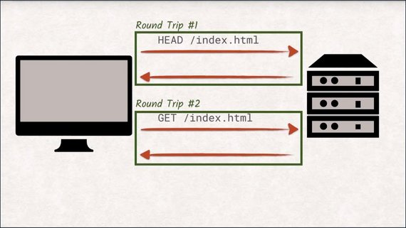](../assets/images/cs2-7.jpg)

Every request-response pair is called a round trip and they take a lot of time to complete.

With the sheer number of assets that web sites have nowadays, having to send a HEAD request before the potential GET request would slow down the loading of the website considerably.

There are ways to mitigate the cost of these round trips and we'll talk about them later, but for now it is just important to know that we want our sites to have as few round trips as possible and that means reducing the number of requests as best as we can.

The last of the common methods is OPTIONS.

OPTIONS is supposed to give you a list of methods that are accepted on the current URL, but not every server supports this.

[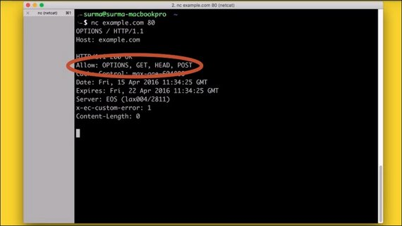](../assets/images/cs2-8.jpg)

The OPTIONS method might seem odd at first, but becomes very important when we start talking about CORS, which you will cover later.

### 2.5 Quiz: HTTP Verbs
The HTTP verb that's used in a request tells the server what the client wants done. For example, retrieving a resource with a GET requestor, retrieving the resource headers with a head request, and so on.

Here's a list of activities, and here's some HTTP verbs.

[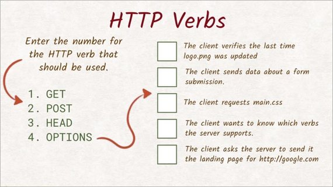](../assets/images/cs2-9.jpg)

Enter the number of the verb best suited for each task.

#### 2.5 Solution
OK, let's go through this case by case.

[](../assets/images/cs2-10.jpg)

- For this first one, the client wants to check when logo.png was last modified. We know that the last modified header has that information. Since the client is not interested in the actual content of the file, a head request is appropriate here.
- Forms only allow two methods--GET and POST. Since we are sending data, we need to use POST as the method here.
- Whenever you want to retrieve the contents of the file, you need to use GET. All of the verbs use the response body for something else or not at all.
- Finding out which verbs are supported on an endpoint is exactly what OPTIONS method is designed for. So that is the correct answer here.
- Again, we are retrieving content here. So the only method that makes sense is GET.

As you can see, there are many different ways to send a request. For the server to respond correctly,it's important that we're using the right verb for the job.

### 2.6 Common Response Headers
Both requests and responses have a section for headers. Remember that headers contain additional data about a request or a response.

[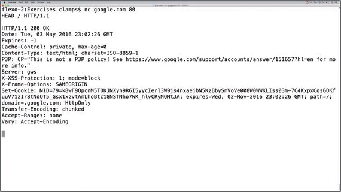](../assets/images/cs2-11.jpg)

We've already looked at some of the common request headers. Take a look below at the most important headers a response can have.

#### Response Headers
Headers contain additional data about requests or responses. These are some of the important ones:

`Content-Length` is a header that must be contained in every response and tells the browser the size of the body in the response. This way the browser knows how many bytes it can expect to receive after the header section and can show you a meaningful progress bar when downloading a file.

`Content-Type` is also a non-optional header and tells you what type the document has. This way the browser knows which parsing engine to spin up. If it's an image/jpeg, show the image. It’s text/html? Let’s parse it and fire off the necessary, additional HTTP requests. And so on.

`Last-Modified` is a header that contains the date when the document was last changed. It turned out that the Last-Modified date is not very reliable when trying to figure out if a document has been changed. Sometimes developers will uploaded all files to the server after fixing something, resetting the Last-Modified date on all files even though the contents only changed on a subset. To accommodate this, most servers also send out an ETag. ETag stands for entity tag, and is a unique identifier that changes solely depending on the content of the file. Most servers actually use a hash function like SHA256 to calculate the ETag.

`Cache-Control` is exactly what it sounds like. It allows the server to control how and for how long the client will cache the response it received. Cache-Control is a complex beast and has a lot of built-in features. 99% of the time, you only need the “cacheability“ and the “max-age”.

`If-Modified-Since` permits the server to skip sending the actual content of the document if it hasn’t been changed since the date provided in that header. Is there something similar for ETags? Yes there is! The header is called If-None-Match and does exactly that. If the ETag for the document is still matching the ETag sent in the If-None-Match header, the server won’t send the actual document. Both If-None-Match and If-Modified-Since can be present in the same request, but the ETag takes precedence over the If-Modified-Since, as it is considered more accurate.

There are a lot more headers and a lot to explore. If you want to know more, check out the following information on HTTP headers:

- [list of HTTP headers](https://www.google.com/url?q=https://en.wikipedia.org/wiki/List_of_HTTP_header_fields&sa=D&ust=1460140076629000&usg=AFQjCNHMTe05Wkomeyd8bB9GvVrUyuC1Dg)

### 2.7 Quiz: Request Headers
We've been learning about HTTP verbs and headers, and now it's your turn to send off an HTTP request to a server.

In this exercise, you need to handcraft an HTTP request using either Netcat or Telnet.

[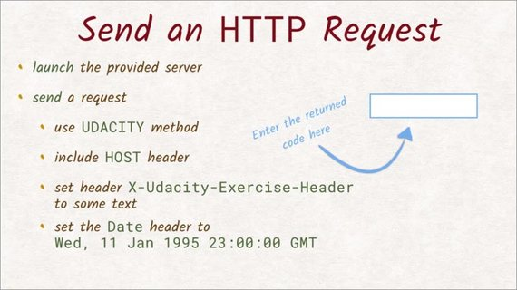](../assets/images/cs2-12.jpg)

So you need to launch the correct server for your platform, and then the terminal will display the URL and port you'll need to connect to.

In another terminal, use Netcat to connect to the server you just launched. Once connected, you'll need to send an HTTP request with the following information.

- You need to send a Udacity request--not a head, get, or post request. You can probably tell that this isn't a real HTTP verb, but since we created this server, we set it up to handle this special verb.
- In the request, make sure to include the host header, since this is required in HTTP1.
- Include the header `X-Udacity-Exercise-Header` with some non-empty value.
- finally, add the Date header, and make sure it uses the value shown exactly.

The Netcat command I'm using is `nc SERVER PORT`.

#### 2.7 Solution
[](../assets/images/cs2-13.jpg)

### 2.8 REST
When writing web apps, you'll encounter a lot of APIs you'll have to talk to. Some of them might be JavaScript APIs that don't involve much more than calling a function in JavaScript. Other APIs as are provided by third parties and require you to make HTTP requests yourself.

A RESTful API is one that follows a design called REST that works especially well with HTTP.

[](../assets/images/cs2-14.jpg)

REST stands for Representational State Transfer. But let's be honest, that isn't really a very descriptive name. Not all APIs follow the rest pattern, but many do. So let's take a look at the underlying concept.

The basic entities are collections and objects inside those collections. The general pattern to retrieve items from collections is using a GET request with both the collection name and the unique item name in that collection.

[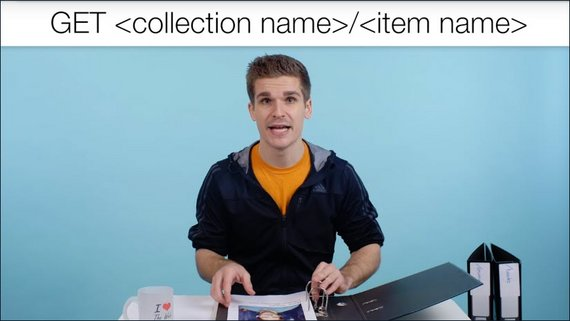](../assets/images/cs2-15.jpg)

For example, if I want to look up Richard, I'd send this request, and the server would get the record containing the data about Richard.

[](../assets/images/cs2-16.jpg)

If I wanted to update the data in that record, I'd use a PUT request and append the updated information to the request.

[](../assets/images/cs2-17.jpg)

Every subsequent GET request should now yield the updated record.

A POST request is used very similar to PUT. But instead of updating existing records, you use it to create new records.

[](../assets/images/cs2-18.jpg)

Notice that you usually do not provide the name under which the new record will be created but let the server make that choice for you.

The response to that POST request is usually a redirect to the newly created record.

And lastly, DELETE is just what you think it is. It removes items from the collection.

[](../assets/images/cs2-19.jpg)

### 2.9 Quiz: REST
The zoo is looking to add a new whale to the list of animals on its website.
Over here is a list of available headers and paths.

[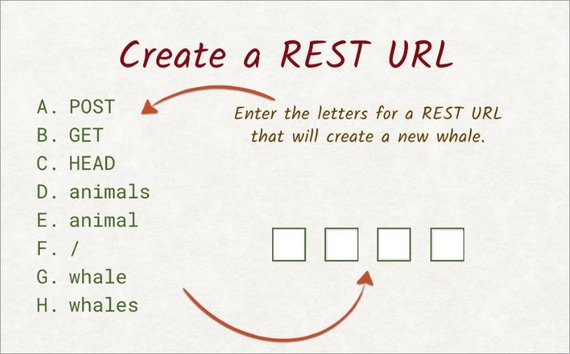](../assets/images/cs2-20.jpg)

Enter the letters to construct the correct REST request that will create a new whale.

#### 2.9 Solution
We want to create a new whale, meaning we want to add something to a collection.

This tells us we want to use the post method, so A goes into this first slot.

The website has a list of animals, which tells us that the collection we're working on is called animals, so D goes into the second slot.

Now, the new item in that collection is supposed to be a whale, so adding a slash and whale to the path does the trick. So the last two slots are filled with F and G.

[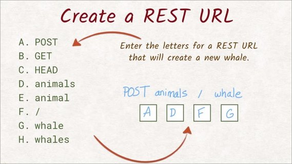](../assets/images/cs2-21.jpg)

### 2.10 Performance Basics
We have manually written our own request directly to the wire and received a response from the server just as the server send it. It feels raw, close to the bare metal ,doesn't it, like there's almost no software between us and the bytes being sent. And yet there's still so much happening that we can't directly see, and it actually has a big impact on how fast the entire request response process is.

If you are a little familiar with networking architecture, you might know that HTTP is not the entire story, that's merely the protocol. For a more complete picture, we are using HTTP on top of TCP on top of IP on top of ethernet--probably, mostly, maybe.

[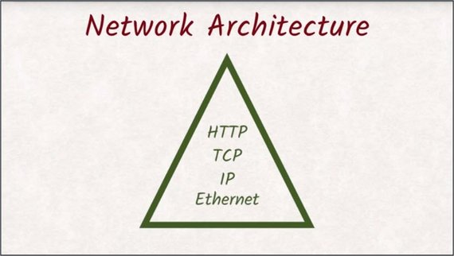](../assets/images/cs2-22.jpg)

The point is we don't need to understand each of these layers, but TCP in particular has a big impact on how we should structure our requests to have them perform well, and it warrants a close look.

The internet protocol allows us to talk to other machines on the internet, while TCP allows us to have multiple, independent streams of data between these two machines.

These streams are distinguished by port numbers.The TCP protocol also ensures that no packages get lost and that they arrive in the right order.

[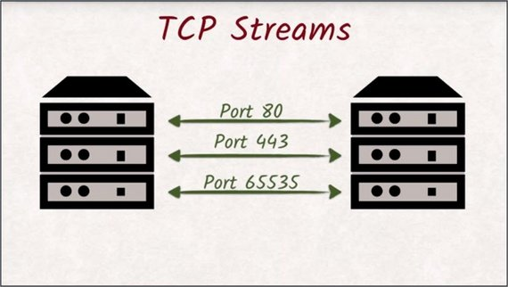](../assets/images/cs2-23.jpg)

All of this requires precautions that cost time and resources. Opening a new connection is especially costly, as the TCP handshake, which makes sure both machines are aware of the newly created communication channel, has to be executed that requires two round trips.

[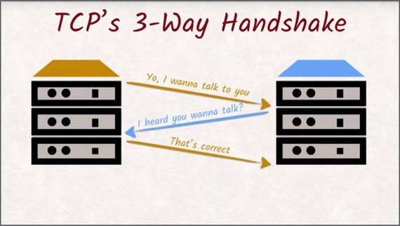](../assets/images/cs2-24.jpg)

If you're using HTTPS, the additional TLS handshake has to be executed as well. If HTTPS and TLS are new to you, stick around, and we'll talk about them in the next lesson.

Once all that is done, the actual HTTP protocol can finally take over. Head-of-line blocking is a huge bottleneck to website performance. Browsers being able to open up six parallel connections helps, but it's not great. Later we'll see how HTTP2 fixes issues with head-of-line blocking.

### 2.11 Performance Details
But even then, we have to fight the sheer nature of the web and network architecture.

In this example, over 50% of the time from pressing Enter in the address bar to the page being displayed is spent waiting for the answer. This waiting period is called Time To First Byte, or TTFB.

[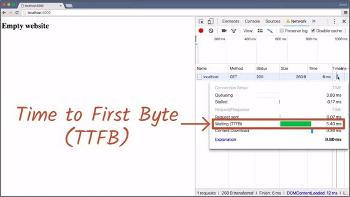](../assets/images/cs2-25.jpg)

If this website needed to grab additional resources, we would have to wait for the response of our first request before we could send out a second request.

[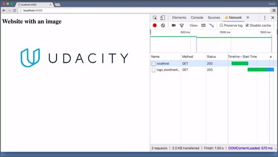](../assets/images/cs2-26.jpg)

That in turn means that we have another period of time waiting that is not being used effectively.
This problem is called head-of-line blocking.

Let's see an example of what head-of-line blocking is and how it is bad for the user experience.

With HTTP, a connection is like a queue. While the first request is being handled, all other requests have to wait until it is their turn. A lot of time is being wasted here.

[](../assets/images/cs2-27.jpg)

While Richard's drink is being prepared, the other customers are left waiting even though their request would be much faster to make.

The head-of-line is blocking the rest of the customers.

To counteract the limitation a little bit, browsers open up to six parallel connections--or in our coffee shop comparison, they hire another barista.

So while the first connection is waiting for its first byte,a second request can already be sent on the second connection and so on.

Of course, hiring a new barista takes a lot of time and training. In the browser, opening all these connections is also quite costly because of the TCP handshakes necessary.

[](../assets/images/cs2-28.jpg)

The six parallel connections browsers can make is still only a band-aid for the head-of-line blocking. If you have a lot of resources on your page, you will spend most of your time waiting--or staring at the cashier.

Head-of-line blocking is a huge bottleneck to website performance. Browsers being able to open up six parallel connections help, but it's not great.

Later we'll see how HTTP/2 fixes issues with head-of-line blocking.

### 2.12 Performance Details 2
Every time the browser connects to a server to make a request, it has to go through the TCP handshake process. This three-way handshake is very time consuming.

To counteract the cost of these handshakes, HTTP/1.1 introduced the concept of keep-alive.

[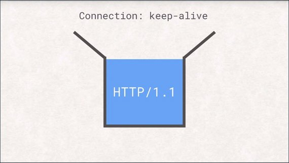](../assets/images/cs2-29.jpg)

If the client sets the connection keep-alive header, the server will not close the connection after successfully delivering the response, but allows the client to reuse the already established connection for additional requests.

[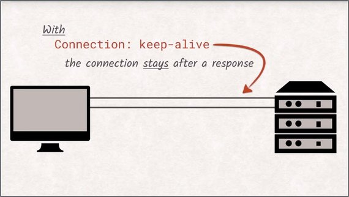](../assets/images/cs2-30.jpg)

Keep in mind though that you still can send requests before the response for the last request has been fully transferred. All in all, this forces web developers to keep the number of additional resources as low as possible, making the best possible use of their six connections.

This is why JavaScript and CSS files are commonly concatenated into bundles and why images are put together into sprites.

[](../assets/images/cs2-31.jpg)

The bundles can be obtained in just one request.

### 2.13 Outro
So how do you feel? HTTP is weird, isn't it? But it is the foundation of the web as we know it. And the knowledge you just gained is invaluable and will help you understand why things behave the way they do.

Before we dive into HTTP/2, though,we should talk about encryption in HTTPS. It is a highly misunderstood topic and has a reputation of being only for enterprise organizations and e-commerce sites.

That is definitely not correct. So grab a drink. It's much simpler than it sounds.