<!-- markdownlint-disable MD022 MD032 -->
<!-- # Mobile Web Specialist Nanodegree -->
# High Conversion Web Forms

[<-- back to Mobile Web Specialist Nanodegree homepage](../index.html)

### Links
#### Resources
- [Create Amazing Forms by Pete LePage](https://goo.gl/i0vY1M) - input types, datalist, labels, autocomplete attributes, autofill pitfalls, real-time validation
- [Web Forms the Right Way](https://www.slideshare.net/greenido/web-forms-the-right-way) - slide deck detailing HTML5 Forms best practices.
- [Input types on MDN](https://developer.mozilla.org/en-US/docs/Web/HTML/Element/input#Form_%3Cinput%3E_types) - List of all input types on MDN
- [HTMLRocks Geolocation Code](https://www.html5rocks.com/en/tutorials/geolocation/trip_meter/) - Write-up on how to use Geolocation
- [Styling HTML Forms](https://developer.mozilla.org/en-US/docs/Learn/HTML/Forms/Styling_HTML_forms) - MDN article
- [Advanced CSS Form Styling](https://jonathan-harrell.com/advanced-css-form-styling/) - Article from 2017
- [Help users checkout faster with Autofill](https://developers.google.com/web/updates/2015/06/checkout-faster-with-autofill?hl=en) - Google Developer website article
- [Autocomplete attributes on MDN](https://developer.mozilla.org/en-US/docs/Web/HTML/Element/input#attr-autocomplete) - list of all autocomplete attributes
- [The pattern Attribute](https://www.wufoo.com/html5/pattern-attribute/) - RegEx input validation
- [Constraint Validation on MDN](https://developer.mozilla.org/en-US/docs/Web/Guide/HTML/HTML5/Constraint_validation) - required, min, max, step, pattern, etc.
- [Add Touch to Your Site](https://developers.google.com/web/fundamentals/design-and-ux/input/touch/) - Google Developer article
- [Touch Events on MDN](https://developer.mozilla.org/en-US/docs/Web/API/Touch_events) - Docs on Touch events 
- [Using Touch Events on MDN](https://developer.mozilla.org/en-US/docs/Web/API/Touch_events/Using_Touch_Events) - Walkthrough for implementing touch events
- [Supporting both TouchEvent and MouseEvent on MDN](https://developer.mozilla.org/en-US/docs/Web/API/Touch_events/Supporting_both_TouchEvent_and_MouseEvent) - Event order

#### Samples
- [Bad Event Form](http://udacity.github.io/course-web-forms/project/start/create.html) - Allows you to schedule an event. This form needs works
- [Tabbed Autocomplete](http://greenido.github.io/Product-Site-101/form-cc-example-m3.html) with Bootstrap - Has Contact, Address, & Payment fields.
- [CodePen Responsive Mobile Ready Form](https://codepen.io/james-priest/pen/PxbKdy) - Contact, Address, & Pmt fields
- [Date & Time controls](../exercises/wf1-9/datetime.html) - Simple example of date and time input types
- [Calendar control](../exercises/wf2-10/index.html) Simple example of input type `datatime-local`
- [Datalist control](../exercises/wf1-10/datalist.html) - Simple example of self-filtering list allow custom entry
- [CodePen Geolocation Example](http://codepen.io/greenido/pen/qOEbGp) - Detects lat lon coordinates.
- [CodePen Date/Time Attributes Demo](https://codepen.io/james-priest/pen/mQOdJV?editors=1000) - all date & time controls
- [Gradebook - numeric](../exercises/wf2-18/index.html) - number input types with min, max, step, & pattern  
- [Puppy validator](http://udacity.github.io/course-web-forms/lesson2/setCustomValidity) - uses `setCustomValidity` on text control
- [Password validation](../exercises/wf2-20/index.html) - uses `setCustomValidity` with custom `IssueTracker` class
- [Contact form](../exercises/wf/contact.html) - styled, constraint validation, autocomplete, & responsive
- [Shipping form](../exercises/wf/shipping.html) - styled, constraint validation, autocomplete, & responsive
- [Cam's Checkout page](../exercises/wf3-13/solution/index.html) - Streamlined checkout form
- [James' Checkout page](../exercises/wf3-13/end/index.html) - Responsive & streamlined checkout form
- [Touch samples](https://github.com/googlesamples/web-fundamentals/tree/gh-pages/fundamentals/design-and-ux/input/touch) - Source code for touch demos on Google Developer site
- [Touch drag sample](../exercises/wf4-7/working/index.html) - Uses touch event handlers
- [Slider sample](../exercises/wf4-9/index.html) - Uses both mouse and touch events

---

## 1. Efficient Inputs Pt 1
### 1.1 Course Intro
Hi, I'm Ido Green. I'm a Developer Advocate at Google. And I'm Cameron Pittman. I make front-end courses here at Udacity.

[](../assets/images/wf1-1.jpg)

Cameron and I want to help you a bit with the forms, because almost any meaningful experience on the webs come with boxes that need to be filled.

It might be a registration form, a shopping cart or a sign in form. All of these need simple forms. And why? Well, it's because the simpler the form is, the more conversions you're going to see.

In fact, according to Chrome usage data, you can make forms 30% faster by just making them ready to autofill. We will dive into it in the second lesson. For now, just remember that with faster forms comes happier users and more conversion.

This course is all about best practices for designing and developing forms. We want you to build forms that work great for all your users, no matter their platform, mobile or desktop. However, mobile platforms are a bit more of a challenge due to the smaller screen size. So we are going to focus on that more in this course.

Also for this course, we expect that you're a web developer who understands the fundamentals of HTML, CSS, and JavaScript. We expect that you've been building sites with forms, and you're always trying to stay up to date with best practices

In the first two lessons, you'll be learning about inputs that make up forms. All the little button and toggles that clutter your user screens.

And in the third lesson, you'll take on forms as a whole and examine what you can do to convert more users. This is especially important for e-commerce sites, but it certainly applies to any kind of long form.

In the last lesson, you'll make forms reactive and touchable for mobile users.

### 1.2 Quiz: Fix this Form
If you want to get better at building forms, you need to start critiquing forms. Many forms that look pretty reasonable are, in reality, not that great.

With that in mind, I want you to try critiquing this form. You can find [a link to it here](http://udacity.github.io/course-web-forms/project/start/create.html).

[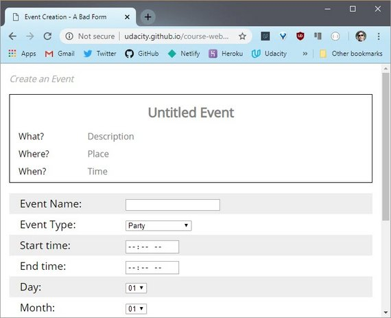](../assets/images/wf1-2.jpg)<br>
**Live demo:** [Event Form](http://udacity.github.io/course-web-forms/project/start/create.html)

This form is actually part of the final project for this course which is an event planner app.

You'll eventually have a chance to apply everything you've learned in this course, to turn this clunky app into a high conversion machine. And by the way, the version that you'll see in a few moments might look slightly different than this one. And that's simply because we might tweak it a bit between now and when you're actually taking the course.

Overall though, it should look pretty much the same. Anyway, play with his form for a moment and when you're done, I have a question for you.

How would you improve this form? Would you change the title? Would you consolidate inputs? And this means simply taking multiple inputs and turning them into one. Would you write better validation messages? Or would you add more questions? Check all that apply.

#### 1.2 Solution
I'll start at the top.

[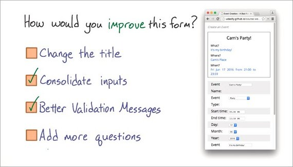](../assets/images/wf1-3.jpg)

Change the title? Mm, no, I wouldn't do that. Right now the title is "Create an Event", and that seems pretty straightforward, so I'll leave it alone.

Next up, consolidate inputs, definitely. Look, right now you have to select the time, the day, the month, and the year separately. And These are all really part of the same question so, I think it make sense that they're the same input. Seems like an improvement to me.

Now, what about better validation messages, definitely. Right now you have to scroll down to the bottom to see a list of errors.

[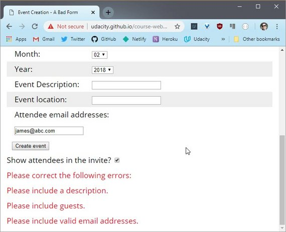](../assets/images/wf1-4.jpg)<br>
**Live demo:** [Event Form](http://udacity.github.io/course-web-forms/project/start/create.html)

This could be a lot more helpful in a lot of different ways so that should definitely be improved.

Lastly, what about adding more questions? Well, you really want to minimize the number of questions you ask if you want to keep the form simple. So no, I don't think that adding more is going to improve this form.

Okay, not too bad.In the next video you'll see an interview with Luke Wroblewski who is a product director at Google. Luke is an expert on forms. You're going to here him talk about how he approaches forms as a whole. Let's watch.

### 1.3 Luke Interview Pt 1
Hi, I'm Luke Wroblewski. I'm a product director at Google, and the experience I have that's probably most relevant here is I wrote a book called Web Form Design, and in there I looked at all the little details and nuances that make forms work online.

[](../assets/images/wf1-5.jpg)

I think what you just said about thinking purposefully about forms is the key.

Don't just treat these things as one offs that you have to do. Don't just copy a pattern and assume that it works. Actually take the time to think what are you asking people and how are you asking them that? And if you put in a little bit of effort, you'll have a lot of impact and that's kind of the whole essence of form design.

### 1.4 Good Form Design
A picture is worth a thousand words, right? So I want to show you a few examples that will help you develop the right mindset for creating better forms.

[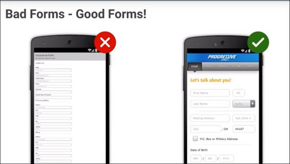](../assets/images/wf1-6.jpg)

On the right is an example that is good.

Notice how it is quick to finish. Notice the placeholders. The fonts are visible and big enough. Notice the progress bar.

On the left is an example that is not so good. Notice how it is hard to finish. Notice that you don't see any progress. The font is too small.

I hope you noticed the patterns that well-designed forms share. In the next video, Cam and I will summarize the principles of a well-designed forms.

### 1.5 Useful Form Principles
When building forms, you've got one main objective, getting more conversions. That's when a new visitor to your site sign up or make a purchase and nothing is more effective than making forms quick and easy to finish.

The less users have to type, the less that's in the way between them and converting. It's pretty simple. You know, in my mind the best example of a super fast form is Amazon's One Click Ordering. It's great because you're just done in milliseconds.

True, that's a fast form but it only works for some products and only if the users are already signed in. For all other situations, it pays to help out your users. Guide them with useful labels, prompts, validation, and progress indicators.

Build up their confidence and watch your conversions go up.

### 1.6 Form Fixing Strategies
While you are working to decrease the time it takes to complete the form, you've got a few options at your disposal to help out.

[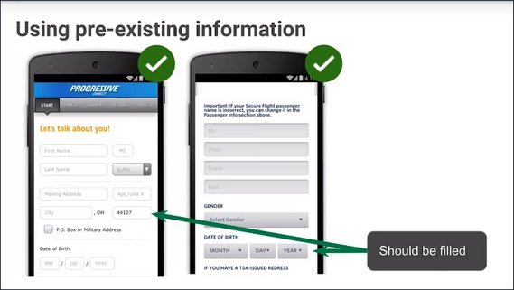](../assets/images/wf1-7.jpg)

First off, you could use your user's existing data. For example, if the user is logged into your site, and you already know their postal code because they submitted it in a earlier form, it will be nice of you to pre-fill the postal code field with a known one like you could see here.

Another option is to access the geolocation in order to determine the postal code. This works even if the user isn't logged in.

This is great because with almost no effort ,you saved your users time and you're one field closer to completion. In the date example, here it's three fields closer.

Another easy option is to enable users to automatically fill fields by enabling autofill. You will dive deep into autofill attribute by enabling Auto Complete in the next lesson.

[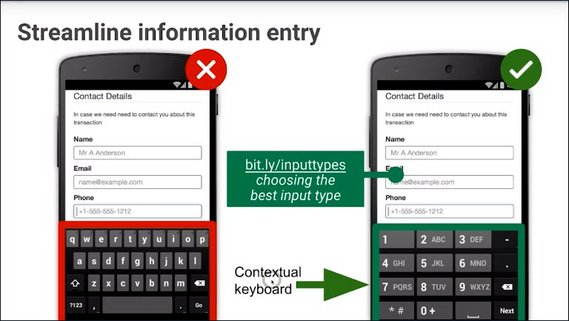](../assets/images/wf1-8.jpg)

But before thinking about our attributes on your inputs, I want you to think about the input elements themselves. Just look how powerful autofill can be.

I'm just start typing here and when I'm choosing, it's automatically fill the form.

[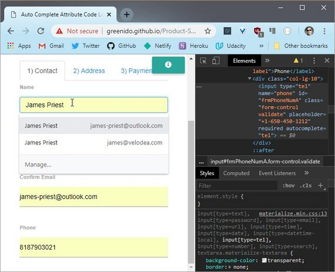](../assets/images/wf1-9.jpg)<br>
**Live demo:** [Tabbed Autocomplete](http://greenido.github.io/Product-Site-101/form-cc-example-m3.html) using Bootstrap

### 1.7 Death to Dropdowns
You know, I'm one of those people that likes to finish something as soon as I think of it. If I think about something like let's say picking out a flight. I'll just take out my phone and start picking dates. And I found that I pretty often encounter dropdown menus, usually for things like dates. This seems reasonable, right?

Okay, I want you to watch this counter that just popped up on your screen. It's going to count the number of taps it takes for me to search for a flight. Are you ready? Watch.

[](../assets/images/wf1-10.jpg)

Did you catch that?

Three taps to select a month. Not a great start. Here, let me finish.

[](../assets/images/wf1-11.jpg)

Did you see how many taps that took? It's ridiculous. Clearly, there must be a better input than a dropdown.

### 1.8 HTML5 Inputs
There are much better options than dropdowns.

[](../assets/images/wf1-12.jpg)

Check out the following resources

- [Create Amazing Forms by Pete LePage](https://goo.gl/i0vY1M) - input types, datalist, labels, autocomplete attributes, autofill pitfalls, real-time validation
- [Web Forms the Right Way](https://www.slideshare.net/greenido/web-forms-the-right-way) - a deck slides detailing HTML5 Forms best practices.

After watching Cam having terrible time with dropdowns, you should be asking yourself, how do I pick the right ones? How do I decide what input to pick? These are great questions.

Luckily the HTML5 standard includes a number of input types tailored for every situation.

Consider these the tools or building blocks for your forms. This should look pretty familiar. Here is on the left is the Phone input and on the right is the Email and in the middle you could see the URL. 

[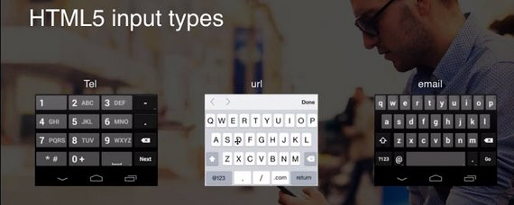](../assets/images/wf1-13.jpg)

And of course we have many more. Notice how each specialized input contains the buttons that the user needs. Nothing more, nothing less.

This is great because we don't have too much real estate on a mobile device and we want to enable our users the most convenient way to type the information they need.

In the next quizzes, Cam will challenge you to research on your own and pick the best input types for your forms.

### 1.9 Quiz: Pick an Input
This flight picker app was annoying. I was tapping way too much to pick flight dates. 

[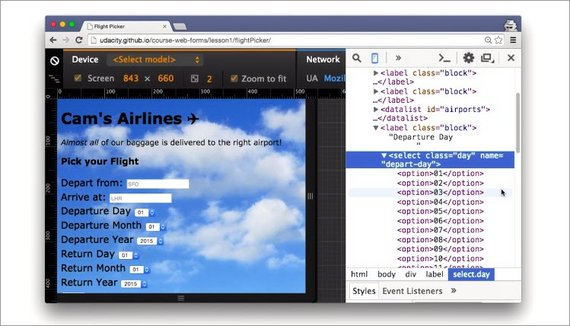](../assets/images/wf1-14.jpg)**Live demo:** [Bad Flight Picker](http://udacity.github.io/course-web-forms/lesson1/flightPicker/) using select controls

This site is obviously using the wrong kinds of inputs. There's gotta be a better way. So for this quiz, I want you to think about the types of inputs you're inflicting upon your users. So you don't make the same mistakes that I did when I built this.

Here are two HTML inputs.The first input is for date and the second one is for time.

[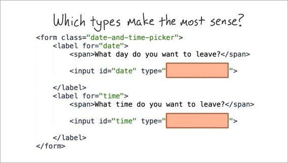](../assets/images/wf1-15.jpg)

What types of inputs make the most sense for these two inputs? Check out the link below to see a list of inputs on the Mozilla Developer Network.

- [Input types on MDN](https://developer.mozilla.org/en-US/docs/Web/HTML/Element/input#Form_%3Cinput%3E_types) - list of all input type controls

Do some research, and when you're done, type your answers into these boxes.

#### 1.9 Solution
On the Mozilla developer network and I have a list of inputs.

[](../assets/images/wf1-16.jpg)

I see a few relevant inputs like `date` and `datetime-local`. `datetime-local` is really useful but includes times.

Given that there's a separate input for time in this quiz, I want to go with `date`.

So I'll scroll down, and there is time. Well, that's pretty straightforward. This is what the form looks like before you enter date and time.

[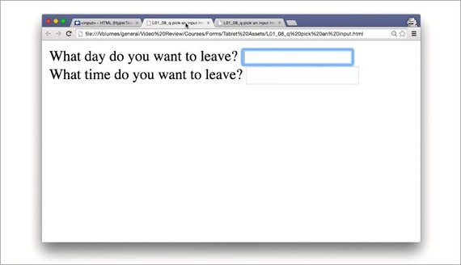](../assets/images/wf1-17.jpg)<br>
**Live demo:** [Text controls](../exercises/wf1-9/text.html) - Bad UX

You'll notice that these two are just defaulted to text inputs.

And then after you enter date and time for the types, you will see that now you have a nice date selector for dates, and a nice time selector for time.

[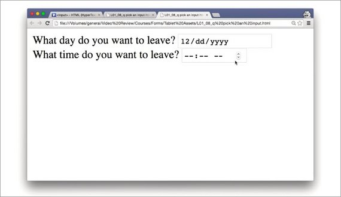](../assets/images/wf1-18.jpg)<br>
**Live demo:** [Date & Time controls](../exercises/wf1-9/datetime.html) - Good Usability

That looks pretty good.

### 1.10 Quiz: Datalist
Okay, so not everything about drop downs is all bad. For instance, the ability to give users a predefined list of options actually can come in handy. It's just that forcing users to scroll through massive lists of options can be tiring. And it's not very flexible because they have to pick one of the options.

[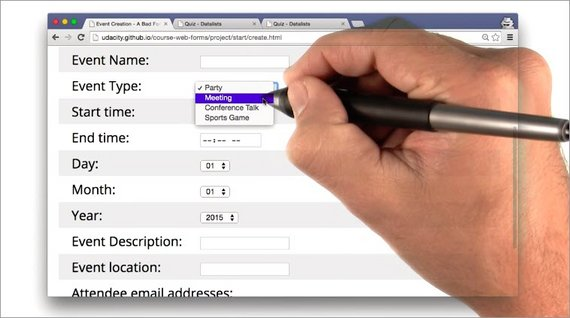](../assets/images/wf1-19.jpg)

Incidentally, there is one kind of input that combines the helpfulness of a pre-defined list with the flexibility of a text input, and it's called the datalist.

Here's an example. 

[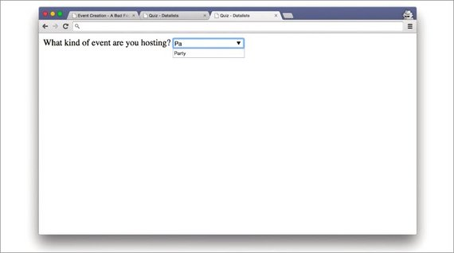](../assets/images/wf1-20.jpg)

With the data list, you still get a pre-defined list of options, but users also have the ability to type. And as users type, they will see options from the list get suggested. But this doesn't mean that users have to use one of the options. They can actually type in a different value.

This makes data lists a nice, flexible solution. The syntax is pretty simple. Rather than putting options in a select tag, put them in a data list tag.

Each option should have a value set to whatever value you want it to take, and you'll need to give the data list an `id`. The input should have a `list` attribute, and the `list` attribute should match the datalist `id`.

[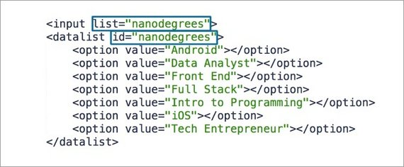](../assets/images/wf1-21.jpg)

You can find out more about the data list on MDN

- [Datalists on MDN](https://developer.mozilla.org/en-US/docs/Web/HTML/Element/datalist)

For this quiz you're going to be building the data list you just saw. I'll be giving you a version of the demo with a dropdown, and you'll be turning it into this.

[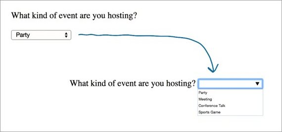](../assets/images/wf1-22.jpg)

#### 1.10 Solution
Turn this dropdown into a datalist!

##### Old code using Select
Here's where the code starts. There's a select tag indicating that this is a drop down and there are a few options inside.

```html
<!DOCTYPE html>
<html lang="en">
<head>
    <meta charset="UTF-8">
    <title>Quiz - Datalists</title>
</head>
<body>
    <p>What kind of event are you hosting?</p>
    <select>
        <option>Party</option>
        <option>Meeting</option>
        <option>Conference Talk</option>
        <option>Sports Game</option>
    </select>
</body>
</html>
```

[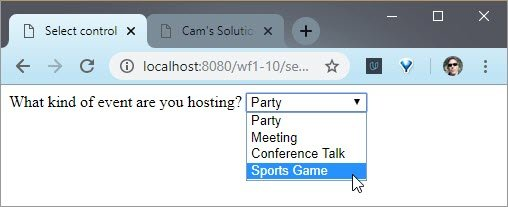](../assets/images/wf1-23.jpg)<br>
**Live demo:** [Select control](../exercises/wf1-10/select.html) - Bad UX: inflexible & requires multiple clicks

##### New code using Datalist
And this is what it looks like as a datalist.

```html
<!DOCTYPE html>
<html lang="en">
<head>
    <meta charset="UTF-8">
    <title>Quiz - Datalists</title>
</head>
<body>
    <label for="event">What kind of event are you hosting?</label>
    <input id="event" name="event" list="event-items">
    <datalist id="event-items">
        <option value="Party">
        <option value="Meeting">
        <option value="Conference Talk">
        <option value="Sports Game">
    </datalist>
</body>
</html>
```

[](../assets/images/wf1-24.jpg)<br>
**Live demo:** [Datalist control](../exercises/wf1-10/datalist.html) - Good Usability: self-filtering list allow custom entry

The differences are pretty minimal. The `select` tag turned into a `datalist` tag. I added a `list` attribute to the `input` with the same `id` as the `datalist`. And I changed all the option values from inert HTML text to values.

Next up, you're going to watch the next part of the interview with Luke. This time, he'll be talking about what makes a perfect form.

### 1.11 Luke Interview Pt 2
[](../assets/images/wf1-5.jpg)

The perfect form is no form, right? Nobody wants to fill in forms. And I mentioned before, I wrote a book about web forms. The first two words in the book are "forms suck". Which is very true.

Nobody wants to go through that process of filling in a form. They want what's on the other side. They want that ride from Uber. They want the book from Amazon. They don't want to sit there retyping their name for the bizillonth time. And ultimately it's almost an insult to the person.

Technology is supposed to change the world, but the damn computer doesn't even remember what my name is? How many times must I type my name into the same freaking computer before it knows who I am?

Like I said, it's almost insulting to people to treat them that way. So my ultimate example of the best form is no form. And that's why I like these things that get you down to a single tap or something where you can just instinctively say, I want that and get what you want.

We are a long ways away from that, in any case, but there are a couple examples, which was very promising. And, usually, that's how things start. Or you'll see one or two examples that people say, oh, that's not achievable, but gradually more and more people get to that point and it becomes the new norm.

### 1.12 Lesson Outro
You know, there are other ways to predict what your users will want to type. For instance, if you already have your users relevant data, why not just prefill the form for them? It's easy enough.

Even if your users aren't logged in, you can still help them out. For example, you could guess their location using location services. See links below.

- [Ido's CodePen Geolocation Example](http://codepen.io/greenido/pen/qOEbGp)
- [HTMLRocks Geolocation Code](https://www.html5rocks.com/en/tutorials/geolocation/trip_meter/)

In the end, this is all in the pursuit of the most important principles to takeout from this lesson. Speed equals conversions.

This lesson got you thinking about fast, efficient inputs, but you are just getting started. In the next lesson, you'll dive into other time-saving tricks, like creating inputs that support autofill and validation.

## 2. Efficient Inputs Pt 2
### 2.1 Lesson Intro
In the last lesson, you starting building efficient form by picking input types. It's a good start, but you can do more to make inputs even simpler.

[](../assets/images/wf1-1.jpg)

In this lesson, you'll be helping your users fill out inputs faster and with more confidence. This means adding useful labels and prompts, enabling auto-fill and validating their inputs

Let's get to it but first things first, labels.

### 2.2 Question
Pop quiz. What was the last website you visited? Maybe Twitter? Maybe you can't remember. You know, there's a pretty good chance that you are like me, and you didn't immediately recall. And that's okay, because everybody forgets things.

It's not a big deal, but as a developer you should do what you can to help people remember what they're doing while they're on your site. The good news is that we have the label element to indicate what this is.

### 2.3 The Label Element
Labels should be prominent and visible when a user is filling out their associated inputs. When writing HTML, use the `label` element as a container for your inputs. Associated inputs get nested inside labels.

You could also use the `for` attributes to link inputs and labels. Either way works fine, but I like to nest because it simplify my HTML and makes it more semantic.

[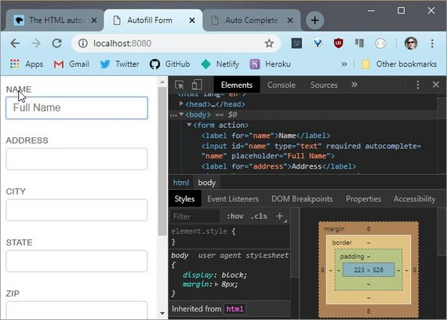](../assets/images/wf2-1.jpg)<br>
**Live demo:** [Basic form](../exercises/wf2-3/index.html)

As an important bonus, applying labels to our form elements helps to improve the touch target size. The user can touch either the label or the input in order to place the focus on the input element. 

You could see here that we're using the `for` attributes. Okay, enough of me talking. I want you to try one out in the next quiz.

### 2.4 Quiz: Make a Label
Labels aren't too tricky. And you may have noticed that in previous quizzes I was actually using labels. So, now it's your turn. In this quiz, you're going to be working with this page.

[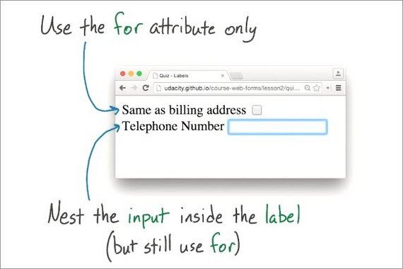](../assets/images/wf2-2.jpg)

There are two inputs that need some labels. The first label will be for this check box which is asking users if they want to use their shipping address, for their billing address.

And then the second one is for this telephone number. For the billing address check box just use the `for` attribute, but don't nest the input inside the label.

And then for the telephone number input, nest the input inside the label but still use the `for` attribute.

Using it make sure that the screen readers connect the label with its associated input. One last thing.Eto and I, highly recommend that you test this input on an actual mobile device too.

#### 2.4 Solution

##### Before

```html
<!DOCTYPE html>
<html lang="en">
<head>
    <meta charset="UTF-8">
    <meta name="viewport" content="width=device-width, initial-scale=1">
    <title>Quiz - Labels</title>
</head>
<body>
    <form>
        <span>Same as billing address</span>
        <input type="checkbox">
        <br>
        <span>Telephone Number</span>
        <input type="tel">
    </form>
</body>
</html>
```

##### After

For the billing address input I just set the `for` attribute on the label to the same `id` that the input has. Easy enough, and then for the telephone number I nested the `input` inside the `label`.

I actually like doing it this way a little bit more, because nesting it makes it more obvious that the `input` belongs to the `label`.

I still used a `for` attribute though, so that my form would play nice with screen readers.

```html
<!DOCTYPE html>
<html lang="en">
<head>
    <meta charset="UTF-8">
    <meta name="viewport" content="width=device-width, initial-scale=1">
    <title>Quiz - Labels</title>
</head>
<body>
    <form>
        <label for="use-billing">Same as billing address</label>
        <input id="use-billing" type="checkbox">
        <br>
        <label for="tel-number">Telephone Number
        <input id="tel-number" type="tel">
        </label>
    </form>
</body>
</html>
```

It doesn't look too different right now but you'll notice that when you click on the labels, that their associated inputs get put into focus. Very nice.

[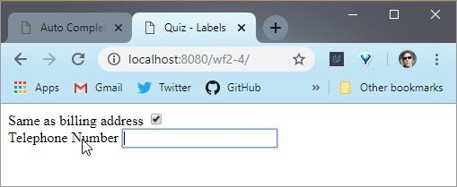](../assets/images/wf2-21.jpg)<br>
**Live demo:** [Label form](../exercises/wf2-4/index.html)

Next stop, we'll be continuing our interview with Luke Wroblewski. Watch him as he describes how he likes to design inputs.

### 2.5 Luke Interview Pt 3
Customer wants to buy something, company wants to sell something, what's sitting in between them? A form.

[](../assets/images/wf1-5.jpg)

If you think about registration, a company wants to grow their user base, someone wants to be part of that community, or product they have. And again what's between them is a form.

So in all these places where this connection happens between the organizations that make things on the internet, and the people that use those things, there's generally a form.

And those forms as you say consist of input fields. The biggest mistake that I think people make is treating those things from what I would call almost a back end perspective.

That is inside of a database, to simplify things, you have these name value pairs, right, name and then a field for what the name is. And you've got a whole bunch of these things and they constitute something like the record of a user, or a purchase.

And when it comes time to collect that information to fully fill in that database, what you do is you just spit out those name value pairs as input fields and labels. And ta-da, job done with a form.

So both of these things I learned almost the hard way, if you will, at eBay about how to think about them differently.

When I was at Ebay many years ago it was the 28th largest economy in the world. So lots and lots of people buying and selling things on there. And we found that when we made small changes to these forms we could really have a huge impact.

In fact when we redesigned the registration form process, we had to go back to Wall Street and restate earnings because that was how tremendous the impact was. And when you think about the ability for something like a form to impact something like the 28th largest economy in the entire planet, you really start to understand the importance of all the little details in the forms.

And that goes well beyond which name value pairs you include.

How you put the labels in, what kind of form control you use, what kind of feedback you give to people as they're filling in this information. How do you organize it? What do you do to message the before and after parts of the form?because it's a part of a broader flow.

And so the biggest mistake is really not considering that full envelope of form design, and really just regurgitating a database's fields onto a screen and putting a submit button on the bottom.

### 2.6 Label Size & Position
When you were playing with the label element, did you notice how the label appeared next to the input? This is not an accident. It makes it easier to see the label.

[](../assets/images/wf2-6.jpg)<br>
**Live demo:** [Contact form](../exercises/wf/contact.html)

Please remember, portrait and landscape view have different form factors.

In landscape view ports, like this one, labels should be next to the input elements.

[](../assets/images/wf2-4.jpg)

In portrait view ports, like this one, labels should be above the input elements.

[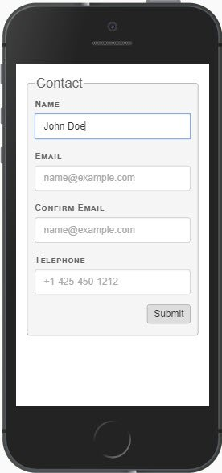](../assets/images/wf2-5.jpg)

Few things to keep in mind. If you are not careful, custom scroll handlers may scroll input elements to the top of the page hiding the label.

You should especially avoid placing labels below the input elements because you run the risk that they may be covered by the virtual keyboard, not good. 

For example, all the labels in the portrait view on mobile appear above the inputs because, as you can see, the virtual keyboard is coming up.

[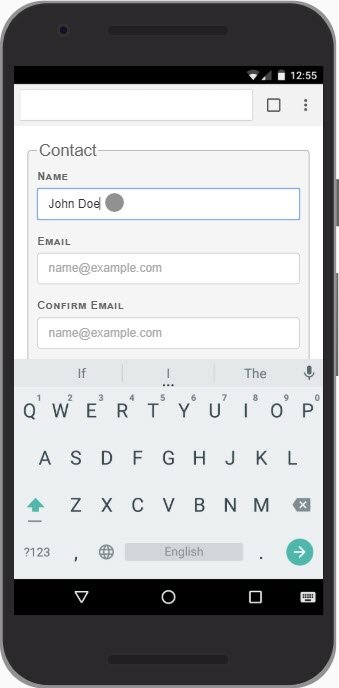](../assets/images/wf2-7.jpg)

### 2.7 Placeholders
Along with labels, placeholders like this one are super useful for text or numeric inputs.

[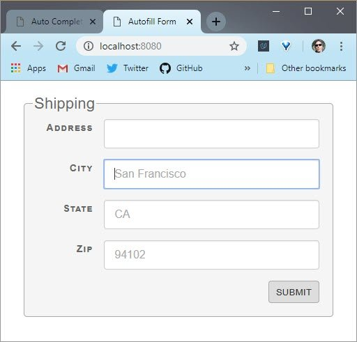](../assets/images/wf2-8.jpg)<br>
**Live demo:** [Shipping form](../exercises/wf/shipping.html)

Use placeholders to give users a concrete idea of exactly what they should type. For example, an input on a city field show what is the expected value telling users they should use a full name of the city, like here.

But remember that placeholders disappear as soon as the user start typing in the element, which means they are not a replacement for labels. They should be used as an aid to help guide users.

### 2.8 Quiz: Placeholder
At Udacity we've used the slogan, "Learn. Think. Do". And there's no better way to learn than by doing, so for this next quiz you are going to do some placeholders.

You'll be given a little input that prompts users to type in the name of an event. And I want you to give it the placeholder event name. Make sure you test on your mobile devices.

```html
<!DOCTYPE html>
<!--
Add the placeholder attribute with the text "Event Name".
-->
<html lang="en">
<head>
    <meta charset="UTF-8">
    <meta name="viewport" content="width=device-width, initial-scale=1">
    <title>Quiz - Placeholder</title>
</head>
<body>
    <form action="#">
        <label for="event-name">
            <span>Enter the name of your event:</span>
            <input type="text" id="event-name">
        </label>
    </form>
</body>
</html>
```

#### 2.8 Solution
This one is pretty simple. All you have to do is add the placeholder attribute to the input and set it to some text, which in this case is "Event Name"

```html
<!DOCTYPE html>
<!--
Add the placeholder attribute with the text "Event Name".
-->
<html lang="en">
<head>
    <meta charset="UTF-8">
    <meta name="viewport" content="width=device-width, initial-scale=1">
    <title>Quiz - Placeholder</title>
</head>
<body>
    <form action="#">
        <label for="event-name">
            <span>Enter the name of your event:</span>
            <input type="text" id="event-name" placeholder="Event Name">
        </label>
    </form>
</body>
</html>
```

Notice that you can see "Event Name" within the input when there's no text. But when you start typing, it disappears.

[](../assets/images/wf2-11.jpg)<br>
**Live demo:** [Placeholder](../exercises/wf2-8/index.html) text

### 2.9 Calendars
Let's talk about calendars.

Many forms need the concept of a date. It shows up everywhere - ordering plane tickets, movie tickets, setting a doctor appointment, and probably a million other examples.

You could turn dates into a three or four parts process with time, day of month, months, and a year. Or you could use a calendar widget.

I like calendar widgets because they are much simpler, and more straightforward.

[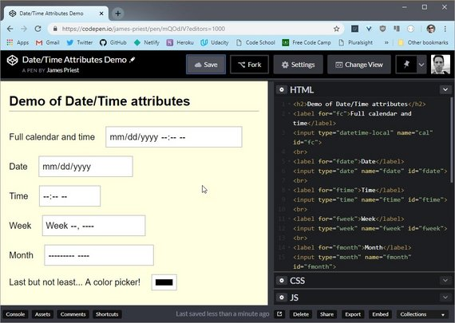](../assets/images/wf2-9.jpg)<br>
**Live demo:** [Date/Time Attributes Demo](https://codepen.io/james-priest/pen/mQOdJV?editors=1000) on CodePen

You've got a few options for displaying calendars. You could use the browser's implementation by setting the attribute `type="datetime-local"` on an input element. But, you might find that it doesn't match the visual theme of your app, that's fine.

You could always edit it's styles or simply roll on your own CSS, using web components or a JavaScript widget. See the Resources section below for some more info about styling or building calendars.

Other way, the most important thing, is to show your users a full calendar when they need to set a date .If not, users will never get away from your form to look up dates which only increase the odds that they will abandon the form all together.

Here is another example. When I wish to book a flight, I can see clearly what are the dates that this flight is going to take off and land.

[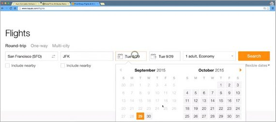](../assets/images/wf2-10.jpg)

Dates are common. Show your users calendars when they need them.

#### 2.9 Resources
Links to styling of form elements.

- [Styling HTML Forms](https://developer.mozilla.org/en-US/docs/Learn/HTML/Forms/Styling_HTML_forms) - MDN article
- [Advanced CSS Form Styling](https://jonathan-harrell.com/advanced-css-form-styling/) - Article from 2017
- [List of Pseudo-Elements to Sytle Form Controls](https://www.tjvantoll.com/2013/04/15/list-of-pseudo-elements-to-style-form-controls/) - Article from 2013

### 2.10 Quiz: Calendars
Here's another opportunity for you to practice. This calendar is really doing things the hard way.Each part of the date is being typed in individually, as is the time.

[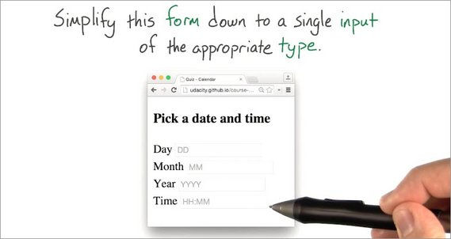](../assets/images/wf2-12.jpg)

So for this quiz, I want you to simplify this calendar. Consolidate all of these inputs into a single input that still let's users input all the same information.

#### 2.10 Solution
I started by going [straight to the Mozilla Developer Network](https://developer.mozilla.org/en-US/docs/Web/HTML/Element/input#Form_%3Cinput%3E_types). I wanted to check out the list of different input types.

As you might recall, there's an input that consolidate date and time called `datetime-local`.

Here's how it looks. You can click on this drop down arrow to get a nice visual calendar to pick out dates, and you've got a place to input times.

[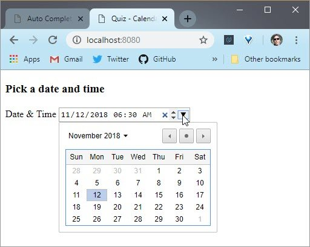](../assets/images/wf2-13.jpg)
**Live demo:** [Calendar control](../exercises/wf2-10/index.html) with input type `datatime-local`.

### 2.11 Typos from Typing
Ugh, come on! These buttons are too small. So you know what, I'm not going to buy these shoes,I just can't deal with typing my address in one more time on this small screen.

It's hard to type on a small screen. So if it's hard to type the form doesn't get submitted and you lose the user.

This is particularly sad, if you're an online retailer and you just missed a sale.

This is where you could leverage to autocomplete attribute. It tells the browsers to automatically fill the user's saved information into a form.

### 2.12 Autocomplete
In modern browsers, there is a cool feature that you could use called autofill. Users appreciate when a website saves them time by automatically filling common fields like name, email, and more.

[](../assets/images/wf2-14.jpg)<br>
**Live demo:** [Contact form](../exercises/wf/contact.html)

Plus autofill helps to reduce potential input errors like what we experienced before. Browsers use many heuristics to determine which field they could auto-populate based on a previously specified data by the user.

You, the developer, can give hints to the browser by providing both the `name` attribute and the `autocomplete` attribute on each input element.

For example, to give the browser a hint that it should auto complete the form with a user's name, email, and phone number. You should use these `autocomplete` attributes.

Let's have a look at the code.

```html
<label for="name">Name</label>
<input type="text" name="name" id="name" required autocomplete="name"
  placeholder="Full Name">

<label for="email">Email</label>
<input type="email" name="email" id="email" required autocomplete="email" 
  placeholder="name@example.com">

<label for="confirm-email">Confirm Email</label>
<input type="email" name="confirm-email" id="confirm-email" required 
  autocomplete="email" placeholder="name@example.com">

<label for="tel">Telephone</label>
<input type="tel" name="phone" id="phone" required autocomplete="tel"
  placeholder="+1-425-450-1212">
```

The name input has an autocomplete attribute value of `name`. The email input hav the autocomplete value of `email`. And the phone input element has the `tel`.

Let's see it in action. When I start typing the address, you could see that the browser is already remember what was typed here before.

[](../assets/images/wf2-15.jpg)<br>
**Live demo:** [Contact form](../exercises/wf/contact.html)

And now when I click select the appropriate email the rest of the form gets filled in.

[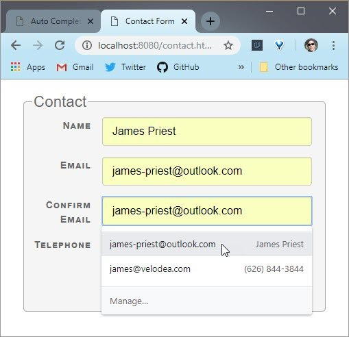](../assets/images/wf2-16.jpg)<br>
**Live demo:** [Contact form](../exercises/wf/contact.html)

Awesome. Take a look and see how you could automate life for your users and put a big smile on their faces.

#### 2.12 Resources
Here are some resources

- [Help users checkout faster with Autofill](https://developers.google.com/web/updates/2015/06/checkout-faster-with-autofill?hl=en) - Google Developer website

### 2.13 Quiz: Autocomplete
It's time to practice. Here is a very simple input for an email address.

[](../assets/images/wf2-17.jpg)

Right now, this box that you'll be checking out in a moment is just a text input. So the browser has no way of knowing what kind of information is about to be typed in and if it doesn't know what's going to be typed in, it can't help you type it in.

So for this quiz, I want you to make this input auto fillable by adding an autocomplete attribute. When you do it right, you should start seeing some email addresses pop up here as you type.

- [Autocomplete attributes on MDN](https://developer.mozilla.org/en-US/docs/Web/HTML/Element/input#attr-autocomplete)

```html
<!DOCTYPE html>

<!--
Make this email input auto-fillable by adding an `autocomplete` attribute.
-->

<html lang="en">
<head>
  <meta charset="UTF-8">
  <meta name="viewport" content="width=device-width, initial-scale=1">
  <title>Quiz - Autocomplete</title>
</head>
<body>
  <form action="#">
    <label for="email">
      <span>Email:</span>
      <input type="email" id="email" placeholder="example@udacity.com">
    </label>
  </form>
</body>
</html>
```

#### 2.13 Solution
I started by heading over to the Mozilla Developer Network, and then looking at the autocomplete attribute.

I chose the one called "email". Back inside my HTML, I went to the input element and added the `autocomplete` attribute. I set its value to "email".

```html
<!DOCTYPE html>

<!--
Make this email input auto-fillable by adding an `autocomplete` attribute.
-->

<html lang="en">
<head>
  <meta charset="UTF-8">
  <meta name="viewport" content="width=device-width, initial-scale=1">
  <title>Quiz - Autocomplete</title>
</head>
<body>
  <form action="#">
    <label for="email">
      <span>Email:</span>
      <input type="email" id="email" placeholder="example@udacity.com"
        autocomplete="email">
    </label>
  </form>
</body>
</html>
```

So this is how it looks. Now, when I type into this input, I can see suggestions from past email addresses I've used.Perfect.

[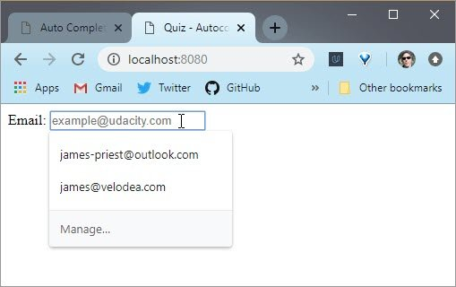](../assets/images/wf2-18.jpg)<br>
**Live demo:** [Email autocomplete](../exercises/wf2-13/index.html)

### 2.14 Autofocus
Speaking of automation, it's worth mentioning the `autofocus` attribute.

Autofocus automatically puts the cursor on an input when the input is rendered,making it easy for users to quickly begin using the form.

[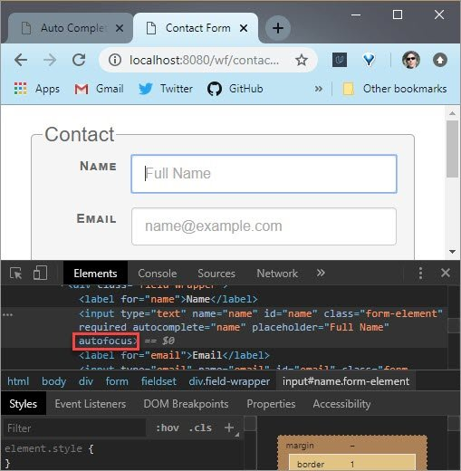](../assets/images/wf2-19.jpg)<br>
**Live Demo:** [Contact form autofocus](../exercises/wf2-14/contact.html)

Desktop browsers immediately move the focus to the input field. However, mobile browsers ignore the autofocus attribute, so that the keyboard doesn't randomly appear.

The Google home page, for example, as you could see here, uses the autofocus attribute on the search bar, because the vast majority of users just want to start typing the queries as soon as the page loads.

[](../assets/images/wf2-20.jpg)

Use autofocus when you want to save your user's time. But be careful because it will steal keyboard focus and potentially prevent the backspace character from being used for navigation.

Also, it's recommended that you only autofocus inputs that are above the fold. Otherwise, the page will scroll down immediately upon rendering, which can be jarring.

### 2.15 Past Data to Fill Inputs
In many cases, we ask users to type out the same information, even when the website has their information.

For example, think about name, address, telephone number, email, credit card, etc. Wouldn't it be cool to offer a shortcut that saves time, typing, and money?

As you know, retailers often use past orders to suggest future inputs. Because once they've already collected and saved your address why ask for it again?

It makes life less frustrating for your users. It also a good idea to ask permission. For example Amazon asks which saved address to use.

But be careful. If your application fills in too much, users might get the wrong information. For example, shipping your package to the wrong address. 

Remember, reusing information will make your forms faster.

### 2.16 Validation
So far, we focused on helping users fill out forms faster by, well, not really filling out anything.

But now, I want you to think about your user's confidence, with good validation features. With validation, you can ensure that users know that they are filling forms with the right information.

More importantly, validation can ensure that users fill out the form correctly the first time. They won't waste time by accidentally leaving an input field empty or submitting a form only to find out a few seconds later that they forgot a digit in their zip code.

[](../assets/images/wf2-22.jpg)<br>
**Live Demo:** [Contact form validation](../exercises/wf2-16/contact.html)

With validation, you are giving your users a real time feedback and minimizing errors.

you can make your inputs required with the `required` attribute. Add `required` to any HTML5 input to let users know that the input must be filled out in order to finish the form.

I want to choose a new password, and like in any good website, I have a few rules that I need to enforce.

[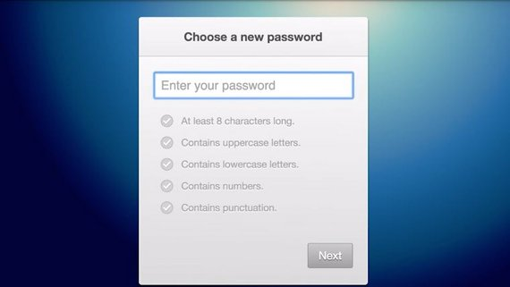](../assets/images/wf2-23.jpg)

Here, while I type, I see I need lowercase and uppercase characters. I also need a few numbers, and minimum length of eight characters. Lastly, I need some punctuation, and only then, does the "Next" button get enabled.

[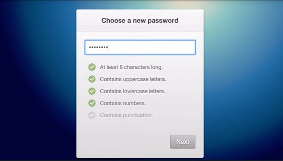](../assets/images/wf2-24.jpg)

It's worth adding that HTML file validation or any front end validation, for that matter, is not a replacement for a server-side validation.

Your websites are obviously not safe, unless you validate on your back end too. The approach discussed here is more about improving the user experience, and make the experience less painful to users.

In the next video, I'll show you how to use HTML5 attributes for validation.

### 2.17 Numeric Validation
#### Numeric Inputs
Numbers are even easier to validate than text. For number input types, the HTML5 spec gives you [attributes](https://www.wufoo.com/html5/number-type/) like `min`, `max`, and `step`. Each of these do pretty much what you would expect.

`min` and `max` set the minimum and maximum values that the arrows in the input will allow. `step` sets the increments for between possible values. There’s also `value`, which sets the starting value of the input.

Of course, you’ll probably notice that users can still type whatever number they want into numeric inputs. If you want to really limit possible values, consider a [range](https://www.wufoo.com/html5/range-type/) instead.

#### Range Inputs
The range input type creates a slider on the page. It also has min, max, step and value attributes. If you want to display the current value of the range when it changes, you’ll need to use some JavaScript to pull the value from the range. Here's an example:

```js
// grab <input id="range-example" type="range" min="0" max="5" step="1">
// from the page
var rangeInput = document.querySelector('input#range-example');

// grab <p id="output"></p> to display the output
var output = document.querySelector('p#output');

// update the display when the range changes
rangeInput.onchange = function() {
    output.innerHTML = this.value;
};
```

In the next quiz you'll be validating some inputs yourself.

### 2.18 Quiz: Validate Inputs
Ready to validate numeric inputs? Here's a gradebook that calculates grades.

[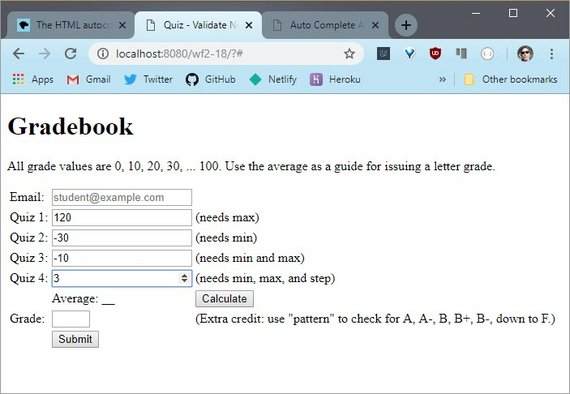](../assets/images/wf2-25.jpg)<br>
**Live Demo:** [Gradebook - numeric](../exercises/wf2-18/index.html)

The way this gradebook works is that you enter four grades and hit Calculate. It then displays the average.

Each of these grades should be a multiple of 10, which means they should be either 0, 10, 20, 30, and so on all the way up to a maximum of 100.

There are a few issues with these inputs that I want you to fix. As it is right now, these inputs only take numbers, but the controls here on the side are less than useful.

For instance, you can click and hold the first one and it will go up well above 100. It needs to stop at 100. The second goes into the negative numbers. The third needs min and max set and the fourth only increments by 1.

Now just so you know with HTML attributes alone, you won't be able to prevent people from typing crazy numbers but you can make these controls more useful.

So for this quiz, it's your job to apply the numeric validation attributes that you just learned about.

For bonus points take a look at this text input for a letter grade. Try using the pattern attribute with regular expressions to validate possible letter grades.

I'm thinking you could use American letter grades which go from A, B, C,D and then skips E and then goes to F, with subgrades of plus and minus.

Lastly, it's worth noting that these numeric inputs look and behave slightly differently in different browsers. So test in different browsers to see the differences.

#### Helpful Links
- [Input element on MDN](https://developer.mozilla.org/en-US/docs/Web/HTML/Element/input)
- [The number Type](https://www.wufoo.com/html5/number-type/)
- [The pattern Attribute](https://www.wufoo.com/html5/pattern-attribute/)

#### Solution
I made sure that each input had the following:

- `type="number"`
- `min="0"`
- `max="100"`
- `step="10"`
- `required`

The html looked lik this.

```html
<tr>
  <td><label for="quiz1">Quiz 1:</label></td>
  <td><input type="number" id="quiz1" min="0" max="100" step="10" value="0" required></td>
  <td>(needs max)</td>
</tr>
<tr>
  <td><label for="quiz2">Quiz 2:</label></td>
  <td><input type="number" id="quiz2" min="0" max="100" step="10" value="0" required></td>
  <td>(needs min)</td>
</tr>
<tr>
  <td><label for="quiz3">Quiz 3:</label></td>
  <td><input type="number" id="quiz3" min="0" max="100" step="10" value="0" required></td>
  <td>(needs min and max)</td>
</tr>
<tr>
  <td><label for="quiz4">Quiz 4:</label></td>
  <td><input type="number" id="quiz4" min="0" max="100" step="10" value="0" required></td>
  <td>(needs min, max, and step)</td>
</tr>
```

Lastly, I added a value for the `pattern` attribute. I used  [https://regexr.com/](https://regexr.com/) to help build the RegEx. I then added a value for the `title` attribute which serves as the error message if there is no match.

```html
<tr>
  <td><label for="grade">Grade:</label></td>
  <td><input type="text" id="grade" size="2" minlength="1" maxlength="2"
  pattern="[Aa]-?|[B-Db-d][+-]?|[Ff]" title="A, A-, B, B+, B-, down to F"
  required></td>
  <td>(Extra cred: use "pattern" to check for A, A-, B, B+, B-, down to F.)</td>
</tr>
```

Now that the code is in place I can run the form to test it.

[](../assets/images/wf2-26.jpg)<br>
**Live Demo:** [Gradebook - numeric](../exercises/wf2-18/index.html)

I really hope you're starting to see just how useful these validation attributes are. They provide a fantastic first pass at making sure the data that's going into your forms is accurate.

### 2.19 Constraints Validation API
For more complex validation, you've got the constraint validation API which allows you to harness the power of JavaScript to validate inputs on the fly.

[](../assets/images/wf2-27.jpg)<br>
**Live Demo:** [Puppy validator](http://udacity.github.io/course-web-forms/lesson2/setCustomValidity)

```js
var puppyInput = document.querySelector('#puppy-input');
var submit = document.querySelector('#submit');

submit.onclick = function () {
  if (puppyInput.value !== "puppy") {
    puppyInput.setCustomValidity("The input should say 'puppy'. You typed: '" +
      puppyInput.value + "'");
  } else {
    puppyInput.setCustomValidity("");
  }
};
```

Here's how it works. The core of the constraint validation API is the function: `setCustomValidity`. As you could see, it's getting a string.

`setCustomValidity` makes the assumption that if you pass a none empty string to it, the input is invalid. So it displays an error message.

That means that the opposite is true. If you pass an empty string to it, then the input is valid.

In practice, simply set a callback on an input's, "on input" event like we did here. And at the end of the callback, call `setCustomValidity` on the input.

If we type in something like that, we will get the error message. And if we are typing correctly, we're passing the test.

[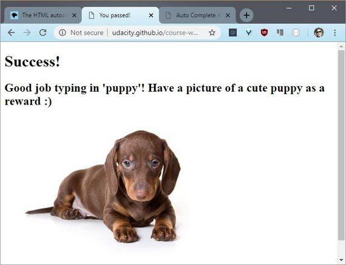](../assets/images/wf2-28.jpg)

- [setCustomeValidity](https://developer.mozilla.org/en-US/docs/Web/API/HTMLSelectElement/setCustomValidity) on MDN
- [Constraint Validation](https://developer.mozilla.org/en-US/docs/Web/Guide/HTML/HTML5/Constraint_validation) on MDN

### 2.20 Quiz: Validate Data
All right.Are you ready for a challenge? This quiz is going to be a bit more difficult than the last few.

For this one, I want you to validate this new password entry using the constraints validation API.

[](../assets/images/wf2-29.jpg)<br>
**Live Demo:** [Password validation](../exercises/wf2-20/index.html)


Notice how there are two inputs for passwords? This is pretty common and it prevents users from making typos when their letters are typed out as little black dots.

You'll be using JavaScript and `setCustomValidity` to check that both passwords are the same and that the passwords meet all of the requirements listed here.

The validation messages that you pass to set custom validity are really important. They need to help the user out. Don't just tell them that something's wrong. If the password is too short, tell them how many characters it should be. If it's missing a number, tell them that it's missing a number, and so on.

Give this quiz a good, honest try, because it's a great opportunity for you to think through the nuances of more complex validation. The idea of checking for these requirements may seem really straightforward, but the implementation details might surprise you.

As part of this quiz, you'll need to think about string parsing, which can be a little annoying. To help you out a bit, I'm giving you some regex's in the code that you might find useful. Good luck.

#### 2.20 Solution
This quiz is slightly challenging because, though the logic is simple, it's easy to accidentally get lost in a nasty series of nested if statements if you're not careful.

The first thing that you'll come across is the `IssueTracker` object. We're using it to collect and format the validation messages we wish to show.

```js
class IssueTracker {
  constructor() {
    this.issue = [];
  }

  add(issue) {
    this.issues.push(issue);
  }
  retrieve() {
    let message = "";
    switch (this.issues.length) {
      case 0:
        break; // do nothing bc message is already ""
      case 1:
        message = "Please correct this issue:\n" + this.issues[0];
        break;
      default:
        message = "Please correct these issues:\n" + this.issues.join('\n');
        break;
    }
    return message;
  }
}
```

The idea is that we'll eventually call `retrieve`, which returns a string. And this string is the validation message that I want to pass to `setCustomValidity`.

And remember that if there are no issues with the validation, then `setCustomValidity` expects an empty string. Which is what this case 0 is doing.

Next up, there is the `onclick` handler for submit.

```js
submit.onclick = function () {
  // grab input's values
  var firstPassword = firstPasswordInput.value;
  var secondPassword = secondPasswordInput.value;

  // issue tracker for ea input bc some validation msgs
  // should end up on the first, some on the second
  var firstInputIssuesTracker = new IssueTracker();
  var secondInputIssuesTracker = new IssueTracker();
  // ...
```

I start by grabbing the values on both of the inputs and then creating two different IssueTrackers. One for the first input and one for the second input. The reason is that sometimes I might want a message to show upon the first input, and then sometimes on the second.

After that there is the `checkRequirements` method, and it's a pretty legible series of if statements.

```js
  function checkRequirements() {
    if (firstPassword.length < 16) {
      firstInputIssuesTracker.add('16 characters');
    } else if (firstPassword.length > 100) {
      firstInputIssuesTracker.add('100 characters');
    }
    if (!firstPassword.match(/[\!\@\#\$\%\^\&\*]/g)) {
      firstInputIssuesTracker.add('symbol');
    }
    if (!firstPassword.match(/[0-9]/g)) {
      firstInputIssuesTracker.add('number');
    }
    if (!firstPassword.match(/[a-z]/g)) {
      firstInputIssuesTracker.add('lowercase');
    }
    if (!firstPassword.match(/[A-Z]/g)) {
      firstInputIssuesTracker.add('uppercase');
    }
    var illegalCharacterGroup = firstPassword.match(/[^A-z0-9\!\@\#\$\%\^\&\*]/g);
    if (illegalCharacterGroup) {
      firstInputIssuesTracker.add('illegal');
    }
  }
```

There's no nesting with these if statements so, I'm pretty happy. And this is where all of the regular expressions are coming into play.

Next is where `checkRequirements` actually gets called.

```js
  if (firstPassword !== secondPassword) {
    secondInputIssuesTracker.add('match');
  } else {
    checkRequirements();
  }
```

It only happens after I know that the first password and the second password match.

After that, it's just a matter of retrieving the two messages and then setting them on each input with `setCustomValidity`. 

```js
  const firstInputIssues = firstInputIssuesTracker.retrieve();
  const secondInputIssues = secondInputIssuesTracker.retrieve();

  firstPasswordInput.setCustomValidity(firstInputIssues);
  secondPasswordInput.setCustomValidity(secondInputIssues);
```

All right, not too bad, let's see this in action. Once I enable the Udacity Validity Tests I see that the code is passing all tests

[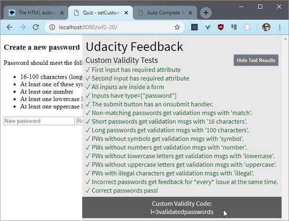](../assets/images/wf2-30.jpg)<br>
**Live Demo:** [Password validation](../exercises/wf2-20/index.html)

Okay, I switched from password to text, so now you can see what I'm typing. I type 'abc' into both text boxes and submit.

[](../assets/images/wf2-31.jpg)<br>
**Live Demo:** [Password validation](../exercises/wf2-20/index.html)

All right, I hope you had as much fun validating these inputs as I did. In the next lesson you'll start designing forms with all of the inputs you've practiced with so far.

With designing comes testing. So in the next video watch Luke describe how he likes to test forms.

### 2.21 Luke Interview Pt 4
[](../assets/images/wf1-5.jpg)

So we use a combination of things. Over my career I've used lots of different things, all the way from eye tracking to usability to quantitative analysis. But I think the most important thing is to be iterative and to be in a process of learning.

The worst case scenario you can get to is what I call the sort of "culture of delivery". Which is, your whole processes are aligned to one ship date; "we redesigned checkout". "Okay, what's the next project?" And we shipped that, that's done. All right, that's a culture of delivery.

A culture of learning is, hey, we're going to try this. Oh, let's see what we can learn before we actually build it. Oh, we started to build it. Let's prototype it, and make it better and better. Hey, we launched it. What happened?Let's measure. We should tweak that. Let's keep measuring. Let's keep learning.

When you do that then you find all of these opportunities for optimization, and for insights, that you wouldn't have. If all you're doing is getting to that launch and then moving on to the next launch after that.

So internally here I have a number of different teams that look at both sides of the equation. We do rapid iterative prototyping up front. So we'll build a little prototype, we'll put users through it, and we'll learn, do they understand our intent. Can they actually act on what we're trying to allow them to do?

And then after launch, we'll go and track the metrics and sometimes with the metrics you'll see, oh that's weird. Why is that going on?

And then the next natural step is to actually go talk to people.

There's a case study that Expedia published a long time ago which was fascinating to me because they had a check out flow, standard thing, right.

You have booked the trip and you're going through and they had this optional field called company, right above billing information. And for whatever reason, people would enter their company, and then start putting in the address of their company below company, which kind of makes sense. But what happened is, they would get these billing errors. Because they put in a billing address that is not the billing address of the credit card, instead it's the company that they work for, this was an optional field. So Expedia removed it, and instantly they got 12 million more in profit a year overnight just from dropping this one optional field.

And until you actually see somebody go through a flow, how would you ever guess why there's so many errors? You have to talk to a couple people and go, oh they think it's their company's address that's why we're getting all these billing errors.

It's not like bad credit cards or what have you. So that combination of the quantitative data, hm, lots of errors in billing addresses, and qualitative, why let's talk to them, really let's you fix the product and make it work.

### 2.22 Lesson Outro
At this point, you've done a lot with individual inputs. 

1. You've tried out different input types and you know how to pick the right one for the right situation.
2. You've attached useful labels to your inputs ensuring that users always know what they are typing while they are typing.
3. You've used the autocomplete attribute to help the browser autofill common input fields.
4. You've used different validation attributes to validate users' input, even before they submit your forms.
5. And you've played with the constraints validation API, for those times when you need to validate more complex inputs.

In the next lesson, Ken and I will help you to take a step back from looking at single inputs to looking at the forms as a whole.

## 3. Fast Forms
### 3.1 Lesson Intro
In the last lesson you practiced building better inputs. You practiced picking the right input types. You enabled autofill. You added clickable labels and you validated inputs

[](../assets/images/wf1-1.jpg)

Now it's time to take a step back from perfecting individual input and start thinking about designing better forms made of many inputs. This lesson is particularly important for e-commerce, where better forms means more sales.

This is really, really important. And take a look at PayPal's ridiculous rise in mobile payments. I think it makes sense that this lesson also focuses on creating great mobile experiences.

Luckily, there are a few basic principles everyone can follow to build better forms on every platform. And they also apply well outside of e-commerce. Your ultimate goal is to minimize the amount of time your user spends filling out forms.

In this lesson, you'll practice techniques to make forms mentally easier for your users to handle. And at the end of the lesson, you'll be given two ugly, nasty forms with low conversion rates. It'll be your job to apply best practices to improve the forms and boost conversion rates.

### 3.2 Form Principles
Following a few principles will make forms a breeze for your users which ultimately means more conversions for you.

[](../assets/images/wf3-1.jpg)

1. Make forms as short and sweet as possible. Avoid making any redundant information and auto-fill as much as possible.
2. Provide helpful prompts. In the last lesson you did it with the label elements
3. Provide immediate feedback. Feedback comes in many different shapes.In the last lesson, you get feedback on an input with an instant validation.

In this lesson, you'll use a progress bar to provide feedback on the user's progress through the entire form.

You can learn about these principles through this deck: [Web Forms the Right Way](https://www.slideshare.net/greenido/web-forms-the-right-way).

Now that these principles are fresh in your mind, Ken is going to help you do some brainstorming.

### 3.3 Quiz: Empathy
I know that you have quit filling out a massive form like this one before. I know you've groaned when you've come across some huge form with a million pages and tons of little radio buttons, because nobody likes to click these for hours on end.

[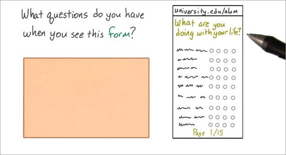](../assets/images/wf3-2.jpg)

So, with that in mind, I want you to brainstorm some questions that people ask when they come across big forms like this one. The reason why is that one of the most important skills for any developer is empathy.

Empathy is the ability to see the world through somebody else's perspective. Any one who creates any thing for any other people needs a strong sense of empathy. And that includes web developers.

Remember, you're building a website for your users, not for yourself. So this questions is going to be a free response question.

See this long form? Ask yourself, what are you thinking when you see it? What do you want to know before you start? What kind of knowledge would help you finish it?

#### 3.3 Solution
So I actually got this survey a few months ago from my university's alumni association. It was awful. There were hundreds of radio buttons and every question seemed basically the same.

I had no idea when it would end. I know it was probably important for them, but I just kind of gave up halfway through. I just didn't want to spend 20 minutes clicking little radio buttons.

That's one question. How much more is there?

So I wondered if I could save my progress and come back later. Would it even be safe to close my laptop? I wasn't sure, so that's my second question.Can I finish this form later?

This is especially important for e-commerce, where people may start shopping now, but actually purchase later. I take the train home almost every day. My laptop doesn't have Internet on the train, but my phone does. I'm always looking for work I can do to keep myself occupied on the hour of my journey home. So that leads to my next question. Can I finish this form on a different device?

Giving your users the option to easily finish later only makes it more likely that they'll actually finish. These all seem like really reasonable questions to me.

In the next video you'll watch the next part of the interview with Luke. He'll describe the ways he empathizes with users when testing new forms.

### 3.4 Luke Interview Pt 5
Yeah, so my process for sort of putting myself, the methodology I like to think of here is this sort of outside in view. This is, you look at what your product looks like to people outside of your organization.

[](../assets/images/wf1-5.jpg)

Most companies think about it from inside out perspective. That is, oh we have these legal requirements, oh, the tech team can only build this. The design teams, and you add up all of these different ideas and thought processes, which make a lot of sense within the bounds of your company, but don't make a lot of sense when somebody's looking at it externally.

This is why you find simple forms, like a Contact Us form, including 20 fields,because this one came from legal, that one comes from marketing. You have five things like this because the database is structured this way.

One very common technique, not common but very useful technique that you can have to force yourself to think outside in, is to actually have somebody role play the role the role of a form. And what do I mean by that? If you give someone a form, and you act like a human, and they only are able to respond with what the form says. So as an example you can say,

- "Hi, I'm Luke. I'm trying to decide whether or not I want to get a loan with you." 
- "First name."
- "Okay, Luke."
- "Last name."
- "Wroblewski."
- "Gender."
- "Male."

You can really start to see how it doesn't make any sense as a conversation. If instead you were to make that a real world conversation, you'd say something like, 

- "Hi, I'm looking to maybe get a loan."
- "Oh, well what are you trying to buy?"
- "Oh, well I'm trying to buy a home."
- "Is this your first home?"

And, very naturally, you can weave that process through. And to go back to the original answer, this name-value pair in the database, it is not a human interaction. It is a process of telling a machine the requires fields it needs to process a document, which generally is not how we think about the world.

So that role playing can go a really long way to helping people see almost the silliness, if you will, for a lot of the interactions we have online.

### 3.5 Show Progress
It is super important that you provide your users feedback because it's all about showing your users their progress throughout the process.

### 3.6 Asking too much
I'm shopping for some shoes and found this site. It looks pretty good, but it's asking me to register before viewing. So, I bounced out of there. This kind of thing happens all the time.

Registration gates really only push users away. It makes it more difficult to view products and buy them, and that just is bad.

### 3.7 Quiz: Frustrate Users
You just watched us discuss the downside of gated shopping experiences. I want you to draw a conclusion from our discussion.

[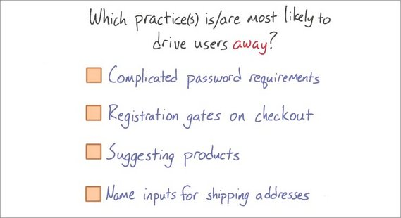](../assets/images/wf3-3.jpg)

Imagine that you're building an e-commerce site. Of the practices listed here,which are most likely to drive users away and decrease conversions?

Check all the options that you think will drive users away.

### 3.7 Solution
I'll start at the top.

[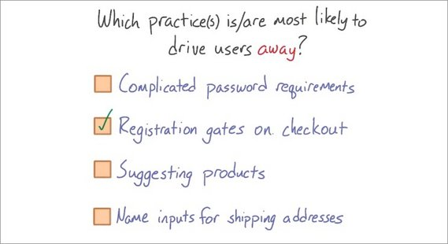](../assets/images/wf3-4.jpg)

1. Complicated password requirements are not likely to drive users away unless there's something totally insane like 1,000 characters. But in that case, you should still just use a password manager and then not worry about it, so no.
2. Registration gates will though. More on this one in a moment.
3. Suggesting products is fine, no harm in subtlety helping people find products that they might like. Just don't overdo it.
4. Shipping address should have a name, so this one also isn't a problem.

Okay, so it looks like the only problem from this list is registration gates on checkout. Remember how you should avoid putting your products behind a registration wall?

[](../assets/images/wf3-5.jpg)

The same applies to purchases. When someone wants to buy something, they just want to buy it. Don't slow them down, and that's all registration gates really do.

If you minimize the time to conversion, you'll watch your conversions increase.

### 3.8 On Another Device
This is a multi-device world. Everyone uses their phone on the go and they probably sit down with their laptops when they get home.

People probably visit the same sites on both, but that doesn't mean that they've got the same intention.

While you may peruse your favorite online retailer while you're on the go, you may not feel comfortable taking out your wallet and typing in your payment information in public. Or maybe you just don't feel like dealing with tiny little buttons and you're in a big rush.

So you wait until you get home to actually make the purchase. It's perfectly reasonable. And developers who take advantage of this pattern stand to convert even more users.

There are a few ways you could help users start a form on one device and then finish on another. For instance, you could offer them a way to share an item through social channels or email. Or there's an even simpler tactic, save to a shopping cart. This let's users leave for now without worrying. Because they know when they come back later, their items will be waiting for them.

### 3.9 Quiz: Fast Forms
Here's a website that you'll be improving at the end of this lesson. And like before, there's a slight chance that what you'll see may look slightly different than this, and that's only because we might tweak it between now and when you take the class.

[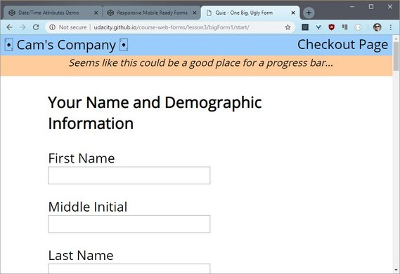](../assets/images/wf3-6.jpg)<br>
**Live Demo:** [Starting Checkout page](../exercises/wf3-13/start/index.html)

What I really want you to do though is play around with it. Start clicking through, start giving it a shot, and start thinking about what you would want to do to improve it.

[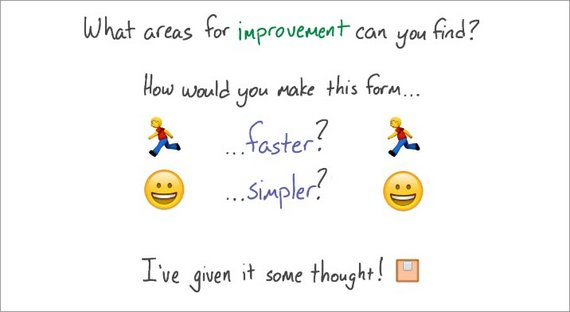](../assets/images/wf3-7.jpg)

This is another quiz where you'll just be brainstorming. I want you to think about what areas for improvement that you can find in this form. How would you make it faster?How would you make it simpler? And once you've thought about it, check this box to continue.

#### 3.9 Solution
First things first. There are too many fields and a lot of them are completely irrelevant. Why is this form asking for a middle initial? First off, not everyone has one. And secondly, it's just not necessary for a checkout.

Same thing with age and gender. This is a checkout form not a census. And still, why is age a drop down? Isn't that a number? Anyway, there's Confirm Email Address which just annoys me, like I don't know how to type it the first time?Don't put these on your forms.

I could keep going. There are a lot of examples of totally irrelevant information here. And the layout isn't that great either.The form doesn't try to help you out. There's no indication of progress, and nothing is being validated whatsoever.

So, it looks like you'll have your work cut out for you at the end of this lesson when you fix this.

### 3.10 Luke Interview Pt 6
Yeah, so how can we make forms that are fast, easy and accurate to fill in? Which is essentially all of form design.

[](../assets/images/wf1-5.jpg)

So, I'll try a distill an entire book slash year's worth of materials into a couple of minute answer. But at the very highest level, when we have a series of questions we need answered.

The process we should start with is this thing that Caroline Gerrit calls,

- Keep
- Cut
- Postpone
- Explain

Keep is information that's critical, required, we've got to have it in the form somewhere.

Cut means we actually don't need it. It's surprising how many times you can go and look at forms and see things that are included there and nobody's even actually using.

Postpone are things that you can ask later. So there's a lot of information that we force you to give us upfront, which isn't applicable, and actually has a better time and place further down in the flow.

So postponing questions until they're appropriate is a really good strategy as well.

The last one is Explain. Explain just basically boils down to telling people why you're asking for something, or how they can answer that question.

There's a case study at the beginning of my web form design book where a major e-tailer, a huge e-commerce site, had two options at checkout, one was log-in and one was register.

It turned out you could actually register without creating an account. You could actually buy something without making an account, but it was totally unclear from that language, "Login or Register". So what they did is they changed the label of the button that said "Register" to "Continue" and they put a little bit of text that said you do not need an account to continue. And conversions went up something like 30%. They made 300 million more a year overnight, just from explaining what they were actually talking about.

So that Keep, Cut, Postpone, and Explain methodology is great at the very highest level.

Then when you go deeper, you get much more into interaction design and visual design considerations. What's the right input control for this type of question How do I minimize typing mistakes? How do I bound people so that they don't go into an error state? And you can do that with things like custom keyboards, input types, inline validation.

There's a whole school of methodology for the nuances of forms. But it all starts at that bigger picture methodology of really thinking through what should be there, where and what you need to tell people about the questions you're asking them, if that makes sense.

### 3.11 Efficiency
We should always pay attention to ways in which to speed up the process of filling out a form. Another way we can speed things along is by using a device's location.

### 3.12 Location
Many forms ask for addresses, e-commerce in particular. Incidentally addresses are often incredibly annoying parts of the form because they require so many input fields.

There are street address, postal codes, territories, countries, region, etc. But luckily, addresses can be pretty easily generated from a mobile device.

Essentially all mobile devices have location services through gps or wi-fi. By accessing geo location, you can often auto fill addresses to within a fairly close range. Users might need to adjust a bit but manipulating one input is obviously better than eight.

[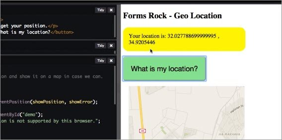](../assets/images/wf3-8.jpg)

In this example, you could see how we got the location of the users with this simple JavaScript code. Another way to do it will be to allow users the auto fill option.

[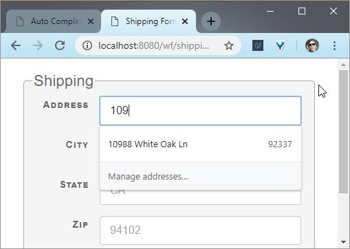](../assets/images/wf3-9.jpg)<br>
**Live Demo:** [Shipping form](../exercises/wf/shipping.html)

Here you could see that with only few clicks I have been able to retrieve a location that was previously saved.

When you search for a car, the app uses your location to guess your address .And when you sign up they ask for permission to use your location.

[](../assets/images/wf3-10.jpg)

To learn more about accessing location services on the web, Android, and iOS, check out [The Geolocation API on MDN](https://developer.mozilla.org/en-US/docs/Web/API/Geolocation/Using_geolocation).

### 3.13 Build a Checkout
You've got quite a few new tools in your forms tool belt at this point. You've spent a lot of time thinking about forms as a whole, so I want you to put your skills to the test with this check out.

[](../assets/images/wf3-6.jpg)<br>
**Live Demo:** [Starting Checkout page](../exercises/wf3-13/start/index.html)

I'm going to give it to you in its current state, which is a bit ugly. This skeleton of a nice form is here but that's about it.

You can tell that there are definitely way too many inputs. Clicking on the labels isn't working and the color scheme isn't really looking that great.

What I’d like you to do is turn this into a simple, beautiful form using everything that you've learned so far. This is an open ended exercise in that there's really no correct answer. I want you to apply what you've learned about inputs, labels, simplification, auto completion, validation and form design.

You may find that you can make some small tweaks to improve this checkout, or you may want to just blow it up and start from scratch. It's up to you.

In the next video, you'll see me discuss two different versions of my check-out. One will use native HTML elements, while the other will take advantage of Polymer.

Polymer includes a set of elements called gold elements that I found to be really helpful with e-commerce. As this is totally up to you to create, feel free to take advantage of whatever framework or library you like.

Doesn't matter if that's Polymer, Angular, React, or something else entirely. It's up to you. The point of this quiz is to give you a chance to think through a checkout flow from start to finish.

I want you to make decisions and build something that you're proud to show off. I also want you to think mobile first while you're designing. You'll learn more about this in a bit. But for now i just want you to do your best to think about what it's like for your mobile users first. It'll be a big help.

Prioritizing for mobile devices will only help simplify and expedite your checkout flow.

#### 3.13 Solution
To start off with here's the native version of my check out form. I did do as much as I could to get rid of as many inputs as possible. I also made the language a little bit friendlier.And I did my best to make sure that the form was pared down to just the bare minimum.

[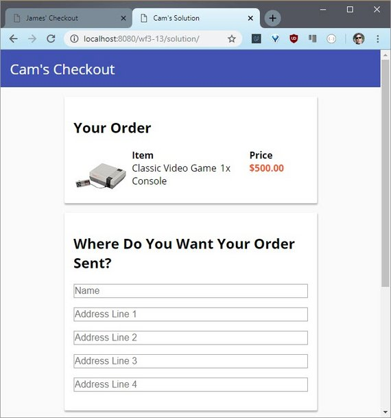](../assets/images/wf3-11.jpg)<br>
**Live Demo:** [Cam's Checkout page](../exercises/wf3-13/solution/index.html)

I also make the assumption that somebody wants to use the same billing address as they used for shipping. That allows me to add this check box which I like. 

If somebody wants to use a different billing address they simply click it and then enter it. You can see that I'm using placeholders in lieu of labels. But if you look in the source code, you can see that the labels are actually still there.

[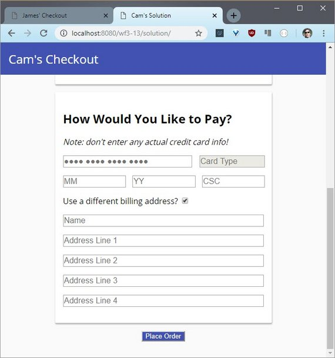](../assets/images/wf3-12.jpg)<br>
**Live Demo:** [Cam's Checkout page](../exercises/wf3-13/solution/index.html)

Screen readers need labels so I wound up just simply hiding them using a special CSS class. This keeps them in the DOM, but they don't show up. There's also a bit of validation happening.

Among other things, credit card numbers are being parsed to find the type of credit card. That's pretty helpful. Of course, this version doesn't quite follow all of the best practices that you've learned. I wound up ditching the progress bar at the top and I'm doing nothing to help out with location.

Here's my form.

[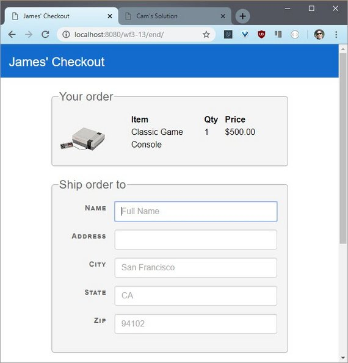](../assets/images/wf3-13.jpg)

[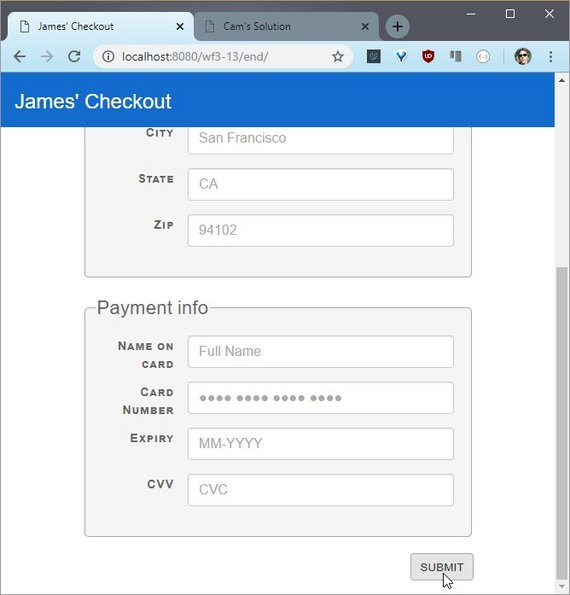](../assets/images/wf3-14.jpg)<br>
**Live Demo:** [James' Checkout page](../exercises/wf3-13/end/index.html)

### 3.14 Luke Interview Pt 7
So for a long time, I've advocated this approach of Mobile First. And the reason why I've pushed for that is threefold.

[](../assets/images/wf1-5.jpg)

First, mobile's a huge opportunity. If you look at the scope of it, it's much, much bigger than what we've had before with personal computers. 

Two, mobile has new capabilities. For example, with a desktop or laptop, we knew with 99% certainty you were in the U.S. Yay. With mobile we can get you down to like 50 meters, which is a huge, huge difference. And there's a lot of other capabilities like multi-touch and all the sensors and devices that we didn't have before.

But the third one, which I thought was actually the most impactful was if you go from a typical 1024 by 768 screen down to a 320 by 480, kind of early smartphone screen, you've lost 80% of your screen space .Which means you need to think really, really hard about what can fit on that screen, because you can't fit everything from before.

So you have to do this really hard thing called prioritization. And in order to prioritize, you have to understand what you're doing for people, why and how. And when you think about all these different devices, mobile is a great forcing function for getting you down to the core essence, to what really matters. How fast and easy can we make this?

Maybe the watch is another forcing function because you should be able to, I saw people ordering pizzas with their voice on their watch. But the less capabilities you have, the more creative you have to get with how people can get stuff done. So it's a great way to essentially force yourself to simplify.

For instance, we have this 40 input field check out form, can we get it down to five, what would that take? Would that even work? And when you do it on the desktop, you don't have that concern. It's like oh yeah, there's plenty of room. I'll just add field number 45 on page 3.

People can type. So on a multi-device we're all right. I think it helps to have that filter first, to get down to the core essence and then you can bring that core essence everywhere. Because why should someone with a 20 inch monitor suffer through 40 form fields, where someone with a 4 inch monitor gets away with only five, right? They should equally get the same treatment.

### 3.15 Lesson Outro
Great job! You applied the clicks to make forms faster and better.

You applied the principles of short forms. You didn't ask for redundant information. You simplified. You gave feedback. And you tried out location services to help with addresses.

Now it is on to the next lesson where you'll focus on touch. Remember your mobile users are incredibly important so we want to create touch interaction that users will love.

## 4. Touch Support
### 4.1 Intro
Welcome back, in the first two lessons you learned how to build great inputs. In the last lesson you practiced building great forms.

[](../assets/images/wf1-1.jpg)

Along the way you probably noticed that building great experiences for your mobile users has been a major theme of this course.

That's because it can be a lot more difficult to build a really fantastic experience for them. When users choose to interact with you app, it should respond to that touch in intuitive and beautiful ways.And that's what you'll learn in this lesson.

You'll fix a few sites that badly need your help with some better touch events. And at the end of it you'll be given this courses project. If you feel like you need more practice designing websites for mobile, I highly recommend checking out the course called Responsive Web Design Fundamentals.

### 4.2 Touch vs. Click
So why worry about touch?  Aren't touch events just click events on a touch screen?

No, they aren't. They have different pseudo classes and different event cycles and you need to account for both.

Let me show you what can happen if you don't account for touch events at all. This is an example site that uses touch.

[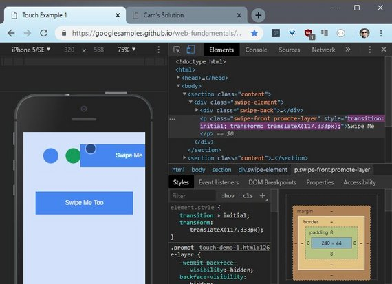](../assets/images/wf4-1.jpg)<br>
**Live Demo:** [Swipe Demo](https://googlesamples.github.io/web-fundamentals/fundamentals/design-and-ux/input/touch/touch-demo-1.html)

Pay attention as I'm dragging this element, to what's going on both in dev tools and on the element itself.

Another good example is this drawing app.

[](../assets/images/wf4-2.jpg)<br>
**Live Demo:** [Touch & Pointer Events Demo](https://codepen.io/greenido/pen/RWBjKz)

This example uses touch, mouse, and pointer events. 

Notice how the UI didn't quite react to your touch. First thing first though. You need to account for the touch pseudo states.

### 4.3 Touch Pseudo States
The fastest way to support touch is to change the UI in response to a DOM elements change in state.
DOM elements can be in one of the following states

- default
- hover
- focus
- active

To change our UI for each of these states, we need to apply styles to the following pseudo classes `:active`, `:focus` and `:hover`

[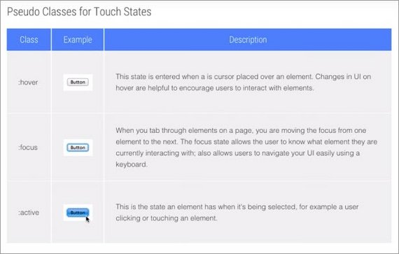](../assets/images/wf4-3.jpg)

On most mobile browsers `:hover` and `:focus` states will apply to an element after it's being tapped.

So, consider carefully what size you set, and how they will look to the user after they finish their touch. Bear in mind that anchor tags and buttons may have different behaviors in different browsers. So assume in some cases the `:hover` will remain, and in others `:focus` will remain.

Here you could see it in action, when we're clicking on each of the buttons, and it's left with a different style.

[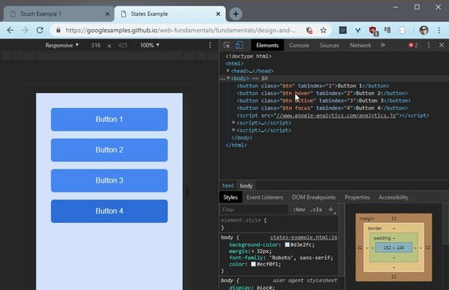](../assets/images/wf4-4.jpg)<br>
**Live Demo:** [Touch States Sample](https://googlesamples.github.io/web-fundamentals/fundamentals/design-and-ux/input/touch/states-example.html)

You could open dev tools and see what are the pseudo states that we gave foreach of the buttons.

- [Add Touch to Your Site](https://developers.google.com/web/fundamentals/design-and-ux/input/touch/) - Google Developer article

### 4.4 Suppress Text Select
Quick note: some mobile browsers will select text if the user long presses on the screen. This is super useful for copying and pasting, but can be frustrating if a user didn’t intend to select any text.

You can prevent this from happening using the user-select CSS property seen here:

```css
-moz-user-select: none;
-webkit-user-select: none;
-ms-user-select: none;
user-select: none;
```

### 4.5 Build a Better UI
For this quiz, I'm giving you this site with these three buttons. I want you to load it on your touch capable devices, like my phone here, and I want you to do some research.

[](../assets/images/wf4-5.jpg)<br>
**Live Demo:** [3 button Sample](http://udacity.github.io/course-web-forms/lesson4/quizSimpleTouch/solution/)

We just covered how you can use pseudo-classes to make your your UI feel more reactive.

These three buttons have `:active`, `:focus` and `:hover` pseudo-classes applied to them with the following colors.

```css
:active { background: Aqua; }
:focus { background: FireBrick; }
:hover { background: HotPink; }
```

See how the first letters match? Anyway, take a look at this site on your touchscreen devices and answer this question.

Which pseudo-class does not get applied on mobile devices? That means, never gets applied on mobile devices. Does active never show up, does focus never show up or does hover never show up?

[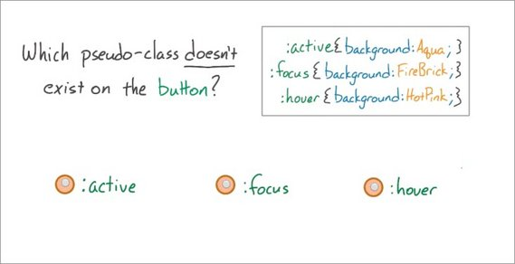](../assets/images/wf4-6.jpg)

Take a minute, play around with the site and then select one of these three answers.

#### 4.5 Solution
So I've got the site open on my mobile device, and I will start tapping. Okay, so did you see that? It goes aqua then pink.

So Aqua is `:active`, and pink is actually HotPink, and that means `:hover`. Notice that no matter what you do, you don't see FireBrick showing up. But that was on an iOS device.

[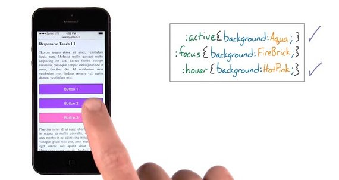](../assets/images/wf4-7.jpg)

I wonder if it's any different on an Android device? Let's see. Okay, so it goes Aqua, then FireBrick, interesting. Last time on the iOS device, I didn't see FireBrick.

[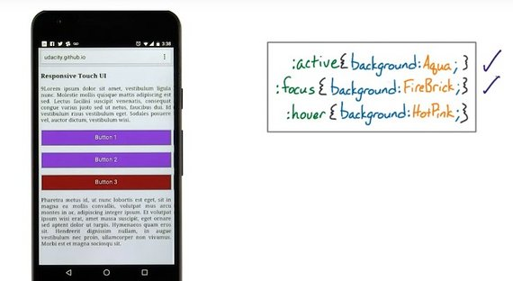](../assets/images/wf4-9.jpg)

I wonder if HotPink is there?If I press down on a button and then slide my finger off, the HotPink shows up. Which means that hover is actually there too.

[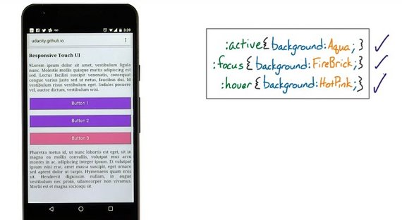](../assets/images/wf4-8.jpg)

So on Android you have all three. So the correct answer is, actually, none of them because different mobile devices behave slightly differently.

It's worth keeping this in mind as you develop your sites to look good on any device. You're starting to think about forms with touch, which is a distinctly human interaction.

In the next video,watch Luke describe how the human body becomes a factor with mobile devices.

### 4.6 Luke Interview Pt 8
[](../assets/images/wf1-5.jpg)

So one of the big differences that comes from direct manipulation screens, that is things you touch to provide input versus what we have in the desktop and laptop world, is that the human body all the sudden really starts to matter.

Before when we're building software for desk tops and laptops the size of our hands, the size of our finger what's a comfortable reach, that burden is taken on by the keyboards and the mice.

Right so long as the mouse is comfortable and the keyboards comfortable the software designer doesn't have to worry about it. They don't have to think about these are going to considerations.

As soon as software is something that people can touch and feel, the screen has to be considered in the context of your hand. How far can you reach that thumb?How big is that thumb? These things impact where you put controls, how large you make controls and how easily those controls are to manipulate.

Anyone who's struggled with a desktop form on a mobile device knows these teeny little tick boxes and radio buttons can be super frustrating especially if you're trying to pick a specific one.

So at the very least we need to consider how to size controls, how to space them. And that's sort of the bare minimum. If you want to do one better then you start thinking about well. Is it possible to create this flow or to complete this flow using what I call one thumb one eyeball.

And one thumb one eyeball actually illustrate this here since I have a phone like all of you too. In your pocket, kind of hold it like this, and you look at it like this. TV may be on, you may be outside, or something like this. How can I get something done, just with these sorts of actions?

And that goes much broader than just size, right? It's where you place the controls, it's what the flow looks like, it's the kind of controls you use as well. And we have a lot of controls that require the precision of a mouse cursor to use well little like spinner wheels that you find on the desktop dropdown menus that you find desktop. All those controls need to be rethought for touch screens so that they can actually be used by our hands.

### 4.7 Quiz: Event Listeners
It's worth doing a quick refresher on creating event listeners. For this quiz, I want you to add an event listener to this sample site. See this red box here? You can click and drag or touch and drag it around the page.

[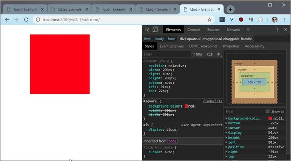](../assets/images/wf4-10.jpg)<br>
**Live Demo:** [Touch drag sample](../exercises/wf4-7/working/index.html)

There's also a `<p>` tag that I want you to change its inner HTML to "touch end" only when the `touchend` event occurs.

Here let me show you. In device emulation mode when I let up, you can see touch and pop up and when i'm not in device emulation mode, nothing happens.

[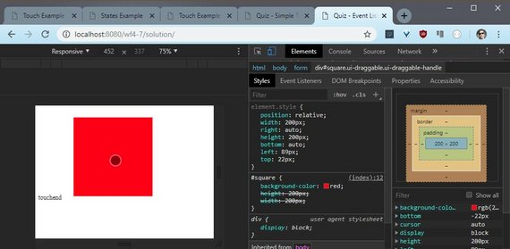](../assets/images/wf4-11.jpg)<br>
**Live Demo:** [Touch drag sample](../exercises/wf4-7/working/index.html)

That's because me letting up here is a `click` event, not a `touchend` event.

Here's the general structure of an event listener in plain old vanillaJavaScript.

[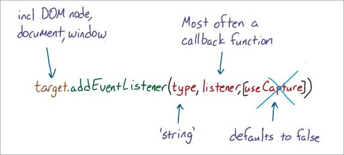](../assets/images/wf4-12.jpg)

The target is the specific node you want to actually listen to the event. And this could be a DOM node, it could be `document` or `window`.

The type is simply a string of whatever type of event you want to listen to, in this case, it'll be `touchend`.

The listener is a callback function that will get passed the event object as the only argument and this gives you access to the event itself and whatever information it contains from within this listener callback.

There's also this use capture boolean which comes at the end of the method. It determines whether you should catch the event before or after other elements have had the opportunity to catch and interpret it. If you're not sure what that means, don't worry about it. You actually don't need to use it for this quiz.

Also, when you take a look at the code, you may notice that you have the option to do this quiz with vanilla JavaScript or jQuery. Both vanilla JavaScript and jQuery are perfectly valid solutions. But I want you to give it a shot with vanilla JavaScript first.

#### 4.7 Solution
Here's the code

```html
<form>
  <div id="square"></div>
  <p id="output1"></p>
  <p id="output2"></p>
</form>
```

```js
(function() {
  var square = document.querySelector('#square');
  var output1 = document.querySelector('#output1');
  var output2 = document.querySelector('#output2');

  square.addEventListener('touchend', handleTouchEnd);
  square.addEventListener('click', handleClick);
  
  function handleTouchEnd(e) {
    // e.preventDefault(); // looks like this is no longer necessary
    output.innerHTML = 'touchend';
    clear();
  }
  function handleClick(e) {
    output3.innerHTML = 'click';
    clear();
  }

  function clear() {
    setTimeout(function() {
      output1.innerHTML = '';
      output2.innerHTML = '';
    }, 2000)
  }
})();
```

I set an event listener on the square target listening to `touchend` and I also added the callback `handleTouchEnd`, which will get called whenever `touchend` occurs on the square.

It's pretty straightforward, but I did add some logic to it to make it disappear after a moment.

So basically it will work in device emulation mode but not when the mouse click event happens.

### 4.8 Touch Events
When users touch the screen of a website, touch events are fired. Let me show you what information you receive with touch events.

#### Touch Events
Use the `event` object to tailor actions to events. Each touch event includes three lists of touches.

- `touches` - a list of all fingers currently on the screen.
- `targetTouches` - a list of fingers on the current DOM element.
- `changedTouches` - a list of fingers involved in the current event. For example, in a touchend event, this will be the finger that was removed.

These lists consist of objects that contain touch information:

- `identifier` - a number that uniquely identifies the current finger in the touch session.
- `target` - the DOM element that was the target of the action.
- `client`/`page`/`screen` coordinates - where on the screen the action happened.
- `radius` coordinates and `rotationAngle` - describe the ellipse that approximates finger shape.

In the next quiz, you'll be challenged to create an element that responds to touches naturally!

### 4.9 Quiz: Single Element
For this quiz you'll be making this slider slide back and forth.

[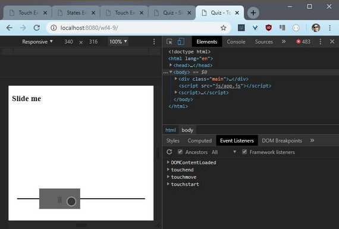](../assets/images/wf4-13.jpg)<br>
**Live Demo:** [Slider sample](../exercises/wf4-9/index.html)

Let me show you what the code looks like. You can [look through the entire app.js file](https://github.com/james-priest/udacity-nanodegree-mws/tree/master/docs/exercises/wf4-9/js) to see how the slider works.

It's pretty straightforward. The crux of it being two methods, `ToggleTracker.addMovement` and `slide`.

```js
  ToggleTracker.prototype = {
    _touches: [],
    /**
     * Call this to register a movement.
     * @param {Number} posX - The current x-position of the finger/mouse.
     */
    addMovement: function (posX) {
      this._touches[0] = this._touches[1] || posX;
      this._touches[1] = posX;
    },
    // more code...
  };
  /*
  Call with requestAnimationFrame for silky smooth 60fps performance.
  */
  function slide() {
    var translateX = toggleTracker.getTranslateX();
    toggle.style.webkitTransform = "translateX(" + translateX + "px)";
    toggle.style.transform = "translateX(" + translateX + "px)";
  }
```

You'll want to call `slide` whenever you want to animate a new position of the toggle. I also recommend using `requestAnimationFrame` with it because that'll give you nice performance.

You can see that `slide` uses transform translateX to move the toggle some x position away from its original origin, and `slide` determines that distance by using `toggleTracker.getTtranslateX`.

On `toggleTracker.addMovement`, it expects an x position to get passed to it. This x-position represents the current x-position of either the finger, as in a touch event, or a mouse on the screen.

You'll want to call `addMovement` whenever a new `touchstart` or `touchmove` event occurs. And likewise, you'll want to call it for a `mousedown` or `mousemove`.

It's going to be your job to use the event listener to find the x-position that gets passed to `addMovement`. In the end, all you'll need to do is set the correct event handlers on the toggle in the window so that both touch dragging and mouse striking work.

Your code should go inside the `attachEventListeners` function.

You'll know you've done it right when the toggle is sliding back and forth. Make sure you test on mobile. And if you're having a hard time, make sure you read the comments in the code because I left you a lot of hints.

#### 4.9 Resources

- [Event Listeners on MDN](https://developer.mozilla.org/en-US/docs/Web/API/EventTarget/addEventListener)
- [Touch Events on MDN](https://developer.mozilla.org/en-US/docs/Web/API/Touch_events)

#### 4.9 Solution
To solve this problem, I started where `attachEventListeners` gets called. It occurs inside an event listener for `DOMContentLoaded`.

```js
document.addEventListener("DOMContentLoaded", function(event) {
  attachEventListeners();
});
```

Inside `attachEventListeners` there is a flag that's set for sliding and that indicates whether or not the toggle's actually sliding.

I'm going to take advantage of this flag to figure out when I should use events on the window to move the toggle.

```js
  var sliding = false;

  toggle.addEventListener('touchstart', function (event) {
    event.preventDefault();
    sliding = true;
    toggleTracker.addMovement(event.touches[0].pageX);
  });

  window.addEventListener('touchmove', function (event) {
    // event.preventDefault();	// no longer needed
    if (sliding) {
      toggleTracker.addMovement(event.touches[0].pageX);
      this.requestAnimationFrame(slide);
    }
  });

  window.addEventListener('touchend', function (event) {
    event.preventDefault();
    sliding = false;
  });
```

I set the `touchstart` event listener on the `toggle` itself. This is because I wanted to make sure that sliding starts when somebody is actually touching the toggle, not some random place on the screen.

Inside the event listener I set `sliding` to `true` because at this point the toggle should be able to slide. And I added the first movement to the toggle tracker.

Remember `addMovement` is expecting the x-position of either a mouse or a finger on the screen, so in order to get that I'm using the `event` object.

The `event` object contains a touches array and there's only one touch. And it has a property `pageX` which is exactly what I'm looking for.

Next up, here comes the move. So on `touchmove`, I look for if the `toggle` is sliding already. I need to look for `sliding` because I attached `touchmove` to the whole window. And that's because somebody's finger can pretty easily slip off the toggle.

So if the toggle should actually be sliding, I add the movement the same way I did before and then i request an animation frame using the `slide` callback.

This is what actually makes the toggle move.

Lastly, I want to watch out for any `touchend` events, whether or not they occur on the toggle itself. So, in that case, I add `touchend` to the window. It doesn't matter where the finger gets let up on the screen.

In that case, sliding is done. I then d0 basically the same thing for `mousedown`, `mousemove` and `mouseup`. The only difference is now I don't have a touches object on the event objects and I can simply go straight to `pageX` (or `clientX).

```js
  toggle.addEventListener('mousedown', function (event) {
    sliding = true;
    toggleTracker.addMovement(event.clientX);
  });

  window.addEventListener('mousemove', function (event) {
    if (sliding) {
      toggleTracker.addMovement(event.clientX);
      this.requestAnimationFrame(slide);
    }
  });

  window.addEventListener('mouseup', function (event) {
    sliding = false;
  });
```

Cool, okay, that's enough code. Let me show you what this looks like. 

[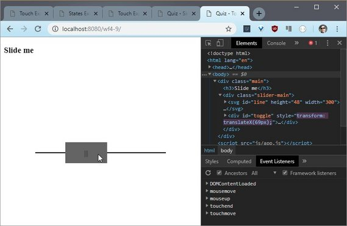](../assets/images/wf4-14.jpg)<br>
**Live Demo:** [Slider sample](../exercises/wf4-9/index.html)

Just like before, touch events seem to be working and mouse events work as well. I can slide off and keeps going but as soon as I let up, no more sliding.

### 4.10 Final Project
#### Meet-Up Event Planner
Prepare for this project with [Building High Conversation Web Forms](https://www.udacity.com/course/building-high-conversion-web-forms--ud890) and [Web Tooling and Automation](https://www.udacity.com/course/web-tooling-automation--ud892).

##### Requirements
*You do not need to create a functioning back-end or save user information. Only the form components themselves and their performance will be evaluated.*

1. You do not need to create a real back-end or save user information, but the app must provide a form for users to create an account. Account creation should include, but is not limited to:
- Name
- Email address
- Secure password (with character and length requirements)
- Optional public biographical information (such as employer, job title, birthday, etc)

1. The app should allow users to create a new event. Each event should, at a minimum, allow a user to set:
- Name of the event
- Type of the event (birthday party, conference talk, wedding, etc.)
- Event host (could be an individual’s name or an organization)
- Event start date and time
- Event end date and time
- Guest list
- Location
- Optional message to the guests with additional information about the event

1. The app should display events that have been created.

##### Tips, Tricks, and Advice
- You may find that you want to save user information in some way, as opposed to just hard-coding in a few events to meet the “display events” requirement. You could accomplish this by using [localStorage](https://developer.mozilla.org/en-US/docs/Web/API/Storage) or by using a “back-end as a service” platform like [Firebase](https://www.firebase.com/).
- You can use any framework you’d like - or don’t! It’s up to you.
- Need some help testing your site with a screen reader? Check out [this video from our Responsive Images course](https://classroom.udacity.com/courses/ud882/lessons/3574748851/concepts/37757186550923) for some tips.
- [Use this checklist as a reference](http://labs.udacity.com/images/web-forms-checklist.pdf) to help you throughout this project.

##### Evaluation
Your project will be evaluated by a Udacity reviewer according to the rubric below. Be sure to review it thoroughly before you submit. All criteria must "meet specifications" in order to pass.

### 4.11 Course Outro
Congratulations. You are well on your way to building fantastic forms. You've been building forms that take less time and help users along the way.

[](../assets/images/wf1-1.jpg)

Now you know how to build better inputs, faster forms, and reactive touch interfaces. You've got all the tools you need to make your forms a breeze and increase conversions.

Most importantly, you've been developing the right mindset for tackling forms in the future. So get out there and build some forms to convert more users.