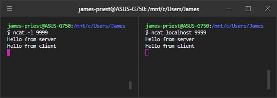
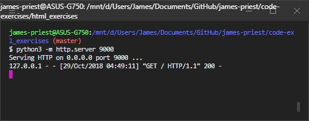
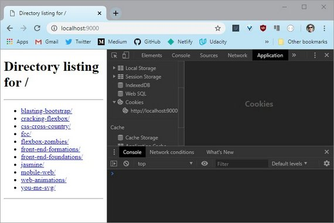
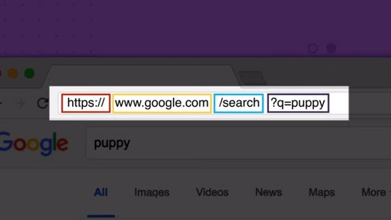
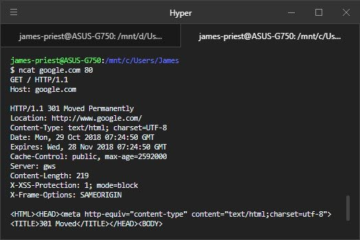
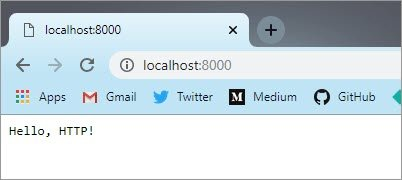
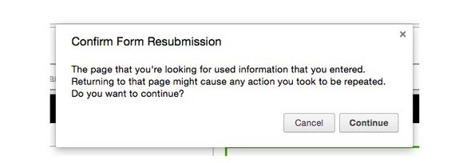
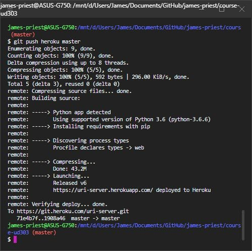

<!-- markdownlint-disable MD022 MD032 -->
<!-- # Mobile Web Specialist Nanodegree -->
# HTTP & Web Servers

[<-- back to Mobile Web Specialist Nanodegree homepage](../index.html)

---

### Resource Links
#### Python Docs
- [The Python Tutorial](https://docs.python.org/3/tutorial/index.html)
- [BaseHTTPRequestHandler](https://docs.python.org/3/library/http.server.html#http.server.BaseHTTPRequestHandler)
- [Executing modules as scripts](https://docs.python.org/3/tutorial/modules.html#executing-modules-as-scripts)
- [urllib.parse](https://docs.python.org/3/library/urllib.parse.html)
- [url-quoting](https://docs.python.org/3/library/urllib.parse.html#url-quoting)
- [Requrests Quickstart](http://docs.python-requests.org/en/master/user/quickstart/)

### Setup
Welcome to our course on HTTP and Web Servers! In this course, you'll learn how web servers work. You'll write web services in Python, and you'll also write code that accesses services out on the web.

This course isn't about installing Apache on a Linux server, or uploading HTML files to the cloud. It's about how the protocol itself works. The examples you'll build in this course are meant to illustrate the low-level behaviors that higher-level web frameworks and services are built out of.

#### Getting Started
You'll be using the command line a lot in this course. A lot of the instructions in this course will ask you to run commands on the terminal on your computer. You can use any common terminal program —

- On Windows 10, you can use the **bash** shell in [Windows Subsystem for Linux](https://msdn.microsoft.com/en-us/commandline/wsl/install_guide).
- On earlier versions of Windows, you can use the **Git Bash** terminal program from Git.
- On Mac OS, you can use the built-in **Terminal** program, or another such as **iTerm**.
- On Linux, you can use any common terminal program such as **gnome-terminal** or **xterm**.

#### Python 3
This course will not use a VM (virtual machine). Instead, you will be running code directly on your computer. This means you will need to have **Python** installed on your computer. The code in this course is built for Python 3, and will not all work in Python 2.

- **Windows and Mac:** Install it from python.org: [https://www.python.org/downloads/](https://www.python.org/downloads/)
- **Mac (with Homebrew):** In the terminal, run `brew install python3`
- **Debian/Ubuntu/Mint:** In the terminal, run `sudo apt-get install python3`

Open a terminal and check whether you have Python installed:

```bash
$ python --version
Python 2.7.12

$ python3 --version
Python 3.5.2
```

> Depending on your system, the Python 3 command may be called `python` or `python3`. Take a moment to check! Due to changes in the language, the examples in this course will not work in Python 2.
>
> In the screenshot above, the `python` command runs Python 2.7.12, while the python3 command runs Python 3.5.2. In that situation, we'd want to use `python3` for this course.

#### Interactive Python
You should be familiar with the Python interactive interpreter. When you see code examples with the `>>>` prompt in this course, those are things you can try out in Python on your own computer. For instance:

```py
>>> from urllib.parse import urlparse
>>> urlparse("https://classroom.udacity.com/courses/ud303").path
'/courses/ud303'
```

#### Git
You will need to have the `git` version control software installed. If you don't have it already, you can download it from [https://git-scm.com/downloads](https://git-scm.com/downloads).

```bash
$ git --version
git version 2.18.0
```

You'll be using Git to download course materials from the Github repository [https://github.com/udacity/course-ud303](https://github.com/udacity/course-ud303). (You don't need to do this yet.) You'll also use it as part of an exercise on deploying a server to a hosting provider.

#### Nmap
You'll also need to install `ncat`, which is part of the **Nmap** network testing toolkit. We'll be using `ncat` to investigate how web servers and browsers talk to each other.

- **Windows:** Download and run https://nmap.org/dist/nmap-7.30-setup.exe
- **Mac (with Homebrew):** In the terminal, run brew install nmap
- **Mac (without Homebrew):** Download and install https://nmap.org/dist/nmap-7.30.dmg
- **Debian/Ubuntu/Mint:** In the terminal, run sudo apt-get install nmap

To check whether `ncat` is installed and working, open up two terminals. In one of them, run `ncat -l 9999` then in the other, `ncat localhost 9999`.

Then type something into each terminal and press Enter. You should see the message on the opposite terminal:

[](../assets/images/hws1-2.jpg)

> I've got two terminals open on my computer. I run `ncat` as a server in the terminal on the left. Ncat dash little L 9999. Now it's listening on port 9999.
>
> On the right, I run `ncat` as a client, and tell it to connect to localhost port 9999. They're connected now, but they're not saying anything yet. Let's change that.
>
> On the server side, I type in a message. "Hello from server", and you see it shows up on the client side.
>
> Now I send a message from the client to the server. And sure enough, it shows up over on the server side.
>
> This shows that each end of the connections can send data to the other.
>
> Now, none of this is happening over HTTP. This is at the network layer below HTTP, called TCP. But we can use this to experiment with HTTP servers, which we'll do later in this lesson.
>
> For now, I'll have the server say goodbye, and then I'll shut the client down by typing control-c. You should try this out yourself to make sure `ncat` is installed and working right on your computer.

What's going on here? Well, one of the `ncat` programs is acting as a very simple network server, and the other is acting as a client.

> **Note:** If you get an error such as "Address already in use", this means that another program on your computer is using port 9999. You can pick another port number and use it. Make sure to use the same port number on the server and client sides.

To exit the `ncat` program, type Control-C in the terminal. If you exit the server side first, the client should automatically exit. This happens because the server ends the connection when it shuts down.

You'll be learning much more about the interaction between clients and servers throughout this course.

---

## 6. Requests & Responses
### 6.1 Introduction
This is a course about HTTP and web servers.

[](../assets/images/hws1-1.jpg)

HTTP, the Hypertext Transfer Protocol, is the language that web browsers and web servers speak to each other. Every time you open a web page, or download a file,or watch a video like this one, it's HTTP that makes it possible.

In this course, you'll take a look at how all that takes place.

- In lesson one, you'll explore the building blocks of HTTP.
- In lesson two, you'll write web server and client programs from the ground up and handle user input from HTML forms.
- In lesson three, you'll learn about web server hosting, cookies, and many other more practical aspects of building web services.

This course is a bridge. It's going to connect your knowledge of basic web technologies, like HTML, with your experience writing code in Python.

With that foundation, you can go on to learn and build many more awesome things.

### 6.2 First Web Server
An HTTP transaction always involves a client and a server. You're using an HTTP client right now, your web browser.

Your browser sends HTTP requests to web servers, and servers send responses back to your browser.

[](../assets/images/hws1-3.jpg)

Displaying a simple web page can involve dozens of requests — for the HTML page itself, for images or other media, and for additional data that the page needs.

HTTP was originally created to serve hypertext documents, but today is used for much more. As a user of the web, you're using HTTP all the time.

A lot of smartphone apps use HTTP under the hood to send requests and receive data. Web browsers are just the most common — and complicated — user interface for web technology. But browsers are not the only web client around. HTTP is powerful and widely supported in software, so it's a common choice for programs that need to talk to each other across the network, even if they don't look anything like a web browser.

#### Exercise: Running your first web server
So what about the other end, the web server? Well, it turns out that a web server can actually be a lot simpler than a browser. Browsers have all this user interface and animation and graphics stuff going on. A server just needs to do one thing: handle incoming requests.

The Python `http.server` module can run a built-in web server on your computer. It's not a web app you'd publish to the world; it's a demonstration of Python's HTTP abilities. We'll be referring to this as **the demo server** in this lesson.

So, let's get started with the demo web server.

Open up a terminal; `cd` to a directory that has some files in it — maybe a directory containing some text files, HTML files, or images — then run `python3 -m http.server 9000` in your terminal.

[](../assets/images/hws1-4.jpg)

When you start up the demo server, it will print a message telling you that it's serving HTTP. Leave it running, and leave the terminal open. Now try accessing [http://localhost:9000/](http://localhost:9000/) from your browser. You should see something like this, although the file names you see will be different from mine:

[](../assets/images/hws1-5.jpg)

And that's the Python demo web server, running on your own computer. It serves up files on your local disk so you can look at them in your browser.

This may not seem like much of a big deal — after all, if you just wanted to access files on your local computer in your browser, you could use `file://` URIs. But the demo server is actually a web server. If you have another computer on the same local network, you could use it to access files served up by this server.

When you put `localhost:9000` in your browser, your browser sends an HTTP request to the Python program you're running. That program responds with a piece of data, which your browser presents to you. In this case, it's showing you a directory listing as a piece of HTML. Use your browser's developer tools to look at the HTML that it sends.

> **Note:** If you have a file called index.html in that directory, you'll see the contents of that file in your browser instead of the directory listing. Move that file somewhere else and reload the page, and you will see the directory listing like the one above.

#### 6.2 Question 1
What happens if you make up a web address that doesn't correspond to a file you actually have, like [http://localhost:9000/NotExistyFile](http://localhost:9000/NotExistyFile)?

#### 6.2 Answer 1
The browser gives an error response with a 404 error code, and the server keeps running.

**404** is the HTTP status code for "Not Found". On Highway 101, not far from the Udacity office in Mountain View, there's a sign that tells the distance to Los Angeles. As it happens, it's 404 miles from Mountain View to Los Angeles, so the sign says **Los Angeles 404**. And so, every web programmer in Silicon Valley has probably heard the "Los Angeles Not Found" joke at least once.

#### What's a server anyway
A server is just a program that accepts connections from other programs on the network.

When you start a server program, it waits for clients to connect to it — like the demo server waiting for your web browser to ask it for a page. Then when a connection comes in, the server runs a piece of code — like calling a function — to handle each incoming connection. A connection in this sense is like a phone call: it's a channel through which the client and server can talk to each other. Web clients send requests over these connections, and servers send responses back.

Take a look in the terminal where you ran the demo server. You'll see a server log with an entry for each request your browser sent:

[](../assets/images/hws1-6.jpg)

Hey wow, what is all this stuff? There are some dates and times in there, but what's `GET / HTTP/1.1`, or for that matter `127.0.0.1`? And what's that `200` doing over there?

How do these things relate to the web address you put into your browser? Let's take a look at that next.

### 6.3 Parts of a URI
A web address is also called a **URI** for *Uniform Resource Identifier*. You've seen plenty of these before. From a web user's view, a URI is a piece of text that you put into your web browser that tells it what page to go to. From a web developer's view, it's a little bit more complicated.

> You've probably also seen the term **URL** or *Uniform Resource Locator*. These are pretty close to the same thing; specifically, a URL is a URI for a resource on the network. Since URI is slightly more precise, we'll use that term in this course. But don't worry too much about the distinction.

A URI is a name for a *resource* — such as this lesson page, or a Wikipedia article, or a data source like the Google Maps API. URIs are made out of several different parts, each of which has its own syntax. Many of these parts are optional, which is why URIs for different services look so different from one another.

[](../assets/images/hws1-7.jpg)

Here is an example of a URI: `https://en.wikipedia.org/wiki/Fish`

This URI has three visible parts, separated by a little bit of punctuation:

- `https` is the **scheme**;
- `en.wikipedia.org` is the **hostname**;
- and `/wiki/Fish` is the **path**.

Different URIs can have different parts; we'll see more below.

#### Scheme
The first part of a URI is the **scheme**, which tells the client how to go about accessing the resource. Some URI schemes you've seen before include **http**, **https**, and **file**. File URIs tell the client to access a file on the local filesystem. HTTP and HTTPS URIs point to resources served by a web server.

HTTP and HTTPS URIs look almost the same. The difference is that when a client goes to access a resource with an HTTPS URI, it will use an encrypted connection to do it. Encrypted Web connections were originally used to protect passwords and credit-card transactions, but today many sites use them to help protect users' privacy. We'll look more into HTTPS near the end of this course.

There are many other URI schemes out there, though. You can take a look at [the official list](http://www.iana.org/assignments/uri-schemes/uri-schemes.xhtml!

#### 6.3 Question 1
Which of these are real URI schemes actually used on the Web?

- [x] mailto
- [x] data
- [x] magnet
- [ ] postal

#### Hostname
In an HTTP URI, the next thing that appears after the scheme is a **hostname** — something like `www.udacity.com` or `localhost`. This tells the client which server to connect to.

You'll often see web addresses written as just a hostname in print. But in the HTML code of a web page, you can't write `<a href="www.google.com">this</a>` and get a working link to Google. A hostname can only appear after a URI scheme that supports it, such as `http` or `https`. In these URIs, there will always be a `://` between the scheme and hostname.

We'll see more about hostnames later on in the lesson. By the way, not every URI has a hostname. For instance, a `mailto` URI just has an email address: `mailto:spam@example.net` is a well-formed `mailto` URI. This also reveals a bit more about the punctuation in URIs: the `:` goes after the scheme, but the `//` goes before the hostname. Mailto links don't have a hostname part, so they don't have a `//`.

#### Path
In an HTTP URI (and many others), the next thing that appears is the **path**, which identifies a particular resource on a server. A server can have many resources on it — such as different web pages, videos, or APIs. The path tells the server which resource the client is looking for.

On the demo server, the paths you see will correspond to files on your filesystem. But that's just the demo server. In the real world, URI paths don't *necessarily* equate to specific filenames. For instance, if you do a Google search, you'll see a URI path such as `/search?q=ponies`. This doesn't mean that there's literally a file on a server at Google with a filename of `search?q=ponies`. The server interprets the path to figure out what resource to send. In the case of a search query, it sends back a search result page that maybe never existed before.

When you write a URI *without* a path, such as `http://udacity.com`, the browser fills in the default path, which is written with a single slash. That's why `http://udacity.com` is the same as `http://udacity.com/` (with a slash on the end).

The path written with just a single slash is also called the **root**. When you look at the root URI of the demo server — `http://localhost:8000/` — you're not looking at the root of your computer's whole filesystem. It's just the root of the resources served by the web server. The demo server won't let a web browser access files outside the directory that it's running in.

#### 6.3 Question 2
Here is a URI: `http://example.net/google.com/ponies`

What is the hostname in this URI?

- [ ] www.example.net
- [x] example.net
- [ ] google.com
- [ ] /google.com/ponies

#### Relative URI references
Take a look at the HTML source for the demo server's root page. Find one of the `<a>` tags that links to a file. In mine, I have a file called `cliffsofinsanity.png`, so there's an `<a>` tag that looks like this:

```html
<a href="cliffsofinsanity.png">cliffsofinsanity.png</a>
```

URIs like this one don't have a scheme, or a hostname — just a path. This is a **relative URI reference**. It's "relative" to the context in which it appears — specifically, the page it's on. This URI doesn't include the hostname or port of the server it's on, but the browser can figure that out from context. If you click on one of those links, the browser knows from context that it needs to fetch it from the same server that it got the original page from.

#### Other URI parts
There are many other parts that can occur in a URI. Consider the difference between these two Wikipedia URIs:

- [https://en.wikipedia.org/wiki/Oxygen](https://en.wikipedia.org/wiki/Oxygen)
- [https://en.wikipedia.org/wiki/Oxygen#Discovery](https://en.wikipedia.org/wiki/Oxygen#Discovery)

If you follow these links in your browser, it will fetch the *same* page from Wikipedia's web server. But the second one displays the page scrolled to the section about the discovery of oxygen. The part of the URI after the `#` sign is called a **fragment**. The browser doesn't even send it to the web server. It lets a link point to a specific named part of a resource; in HTML pages it links to an element by `id`.

In contrast, consider this Google Search URI:

- [https://www.google.com/search?q=fish](https://www.google.com/search?q=fish)

The `?q=fish` is a **query** part of the URI. This does get sent to the server.

There are a few other possible parts of a URI. For way more detail than you need for this course, take a look at this Wikipedia article:

- [https://en.wikipedia.org/wiki/Uniform_Resource_Identifier#Generic_syntax](https://en.wikipedia.org/wiki/Uniform_Resource_Identifier#Generic_syntax)

(Hey, look, it's another fragment ID!)

### 6.4 Hostnames and Ports

[](../assets/images/hws1-8.jpg)

#### Hostnames
A full HTTP or HTTPS URI includes the hostname of the web server, like `www.udacity.com` or `www.un.int` or `www.cheeseboardcollective.coop` (my favorite pizza place in the world, in Berkeley CA). A hostname in a URI can also be an IP address: for instance, if you put [http://216.58.194.174/](http://216.58.194.174/) in your browser, you'll end up at Google.

> Why is it called a **host**name? In network terminology, a host is a computer on the network; one that could **host** services.

The Internet tells computers apart by their **IP addresses**; every piece of network traffic on the Internet is labeled with the IP addresses of the sending and receiving computers. In order to connect to a web server such as `www.udacity.com`, a client needs to translate the hostname into an IP address. Your operating system's network configuration uses the Domain Name Service (DNS) — a set of servers maintained by Internet Service Providers (ISPs) and other network users — to look up hostnames and get back IP addresses.

In the terminal, you can use the **host** program to look up hostnames in DNS:

[](../assets/images/hws1-9.jpg)

Some systems don't have the `host` command, but do have a similar command called `nslookup`. This command also displays the IP address for the hostname you give it; but it also shows the IP address of the DNS server that's giving it the answer:

[](../assets/images/hws1-10.jpg)

#### 6.4 Question 1
Use the `host` or `nslookup` command to find the IPv4 address for the name `localhost`. What is it?

- [ ] 1.2.3.4
- [x] 127.0.0.1
- [ ] 0.0.0.0
- [ ] ::1

IP addresses come in two different varieties: the older **IPv4** and the newer **IPv6**. When you see an address like `127.0.0.1` or `216.58.194.164`, those are IPv4 addresses. IPv6 addresses are much longer, such as `2607:f8b0:4005:804::2004`, although they can also be abbreviated.

#### Localhost
The IPv4 address `127.0.0.1` and the IPv6 address `::1` are special addresses that mean "this computer itself" — for when a client (like your browser) is accessing a server on your own computer. The hostname `localhost` refers to these special addresses.

When you run the demo server, it prints a message saying that it's listening on `0.0.0.0`. This is not a regular IP address. Instead, it's a special code for "every IPv4 address on this computer". That includes the `localhost` address, but it also includes your computer's regular IP address.

#### 6.4 Question 2
Use `host` or `nslookup` command to find the IPv4 addresses of `en.wikipedia.org` and `ja.wikipedia.org` - the servers the Wikipedia in English and Japanese.

Are these sites on the same IP address?

- [x] Yes, they are on the same IP address
- [ ] No, they are on different IP addresses.

As of October 2016, these sites were on the same IP address, but the Wikimedia Foundation can move their servers around sometimes — so you might have gotten a different answer.

A single web server can have lots of different web sites running on it, each with their own hostname. When a client asks the server for a resource, it has to specify what hostname it intends to be talking to. We'll see more about this later, in the section on HTTP headers.

#### Ports
When you told your browser to connect to the demo server, you gave it the URI `http://localhost:9000/`. This URI has a port number of `9000`. But most of the web addresses you see in the wild don't have a port number on them. This is because the client usually figures out the port number from the URI scheme.

For instance, HTTP URIs imply a port number of `80`, whereas HTTPS URIs imply a port number of `443`. Your Python demo web server is running on port 9000. Since this isn't the default port, you have to write the port number in URIs for it.

**What's a port number, anyway?** To get into that, we need to talk about how the Internet works. All of the network traffic that computers send and receive — everything from web requests, to login sessions, to file sharing — is split up into messages called **packets**. Each packet has the IP addresses of the computer that sent it, and the computer that receives it. And (with the exception of some low-level packets, such as ping) it also has the **port number** for the sender and recipient. IP addresses distinguish computers; port numbers distinguish *programs* on those computers.

We say that a server "listens on" a port, such as 80 or 8000. "Listening" means that when the server starts up, it tells its operating system that it wants to receive connections from clients on a particular port number. When a client (such as a web browser) "connects to" that port and sends a request, the operating system knows to forward that request to the server that's listening on that port.

Why do we use port 9000 instead of 80 for the demo server? For historical reasons, operating systems only allow the administrator (or root) account to listen on ports below 1024. This is fine for production web servers, but it's not convenient for learning.

#### 6.4 Question 3
Which of the URIs below refers to the same resource as `https://en.wikipedia.org/wiki/Fish`?

- [ ] `http://en.wikipedia.org/wiki/Fish`
- [x] `https://en.wikipedia.org:443/wiki/Fish`
- [ ] `http://en.wikipedia.org:80/wiki/Fish`
- [ ] `http://en.wikipedia.org:8000/wiki/Fish`

### 6.5 HTTP GET Requests
[](../assets/images/hws1-11.jpg)

#### HTTP GET requests
Take a look back at the server logs on your terminal, where the demo server is running. When you request a page from the demo server, an entry appears in the logs with a message like this:

```bash
127.0.0.1 - - [29/Oct/2018 06:23:35] "GET /images/bg1.jpg HTTP/1.1" 200 -
```

Take a look at the part right after the date and time. Here, it says `"GET /images/bg1.jpg HTTP/1.1"`. This is the text of the **request line** that the browser sent to the server. This log entry is the server telling you that it received a request that said, literally, `GET /images/bg1.jpg HTTP/1.1`.

This request has three parts.

The word `GET` is the **method** or **HTTP verb** being used; this says what kind of request is being made. `GET` is the verb that clients use when they want a server to send a resource, such as a web page or image. Later, we'll see other verbs that are used when a client wants to do other things, such as submit a form or make changes to a resource.

`/bg1.jpg` is the path of the resource being requested. Notice that the client does not send the whole URI of the resource here. It doesn't say `https://localhost:9000/images/bg1.jpg`. It just sends the path.

Finally, `HTTP/1.1` is the **protocol** of the request. Over the years, there have been several changes to the way HTTP works. Clients have to tell servers which dialect of HTTP they're speaking. HTTP/1.1 is the most common version today.

#### Exercise: Send a request by hand
You can use `ncat` to connect to the demo server and send it an HTTP request by hand. (Make sure the demo server is still running!)

##### Terminal 1

```bash
$ python3 -m http.server 9000
Serving HTTP on 0.0.0.0 port 9000 ...
```

##### Terminal 2
Try it out:

Use `ncat 127.0.0.1 9000` to connect your terminal to the demo server.

```bash
ncat 127.0.0.1 9000
```

Then type these two lines:

```text
GET / HTTP/1.1
Host: localhost
```

After the second line, **press Enter twice**. As soon as you do, the response from the server will be displayed on your terminal. Depending on the size of your terminal, and the number of files the web server sees, you will probably need to **scroll up** to see the beginning of the response!

#### 6.5 Question
Which of these things do you see in the server's response?

- [x] A line end with `200 OK`
- [x] The date and time.
- [ ] A Python error message
- [x] A piece of HTML
- [ ] A message that says `Ncat: connection refused`

If your server works like mine, you'll see a status line that says `HTTP/1.0 200` OK, then several lines of **headers** including the date as well as some other information, and a piece of **HTML code**. These parts make up the **HTTP response** that the server sends.

[](../assets/images/hws1-12.jpg)

On the next page, we'll look at the parts of the HTTP response in detail.

### 6.6 HTTP Responses

[](../assets/images/hws1-13.jpg)

HTTP responses
Take another look at what you got back from the web server in the previous exercise.

[](../assets/images/hws1-12.jpg)

After you typed `Host: localhost` and pressed Enter twice, the server sent back a lot of text. This is an `HTTP response`. One of these exchanges — a request and response — is happening every time your browser asks a server for a page, an image, or anything else.

Here's another one to try. Use `ncat` to connect to `google.com` port 80, and send a request for the path `/` on the host `google.com`:

```text
GET / HTTP/1.1
Host: google.com
```

> Make sure to send `Host: google.com` exactly ... don't slip a `www` in there. These are actually different hostnames, and we want to take a look at the difference between them. And **press Enter twice!**

[](../assets/images/hws1-14.jpg)

The HTTP response is made up of three parts: the status line, some headers, and a response body.

The **status line** is the first line of text that the server sends back. The **headers** are the other lines up until the first blank line. The **response body** is the rest — in this case, it's a piece of HTML.

[](../assets/images/hws1-15.jpg)

#### Status line
In the response you got from your demo server, the status line said `HTTP/1.0 200 OK`. In the one from Google, it says `HTTP/1.1 301 Moved Permanently`. The status line tells the client whether the server understood the request, whether the server has the resource the client asked for, and how to proceed next. It also tells the client which dialect of HTTP the server is speaking.

The numbers 200 and 301 here are HTTP **status codes**. There are dozens of different status codes. The first digit of the status code indicates the general success of the request. As a shorthand, web developers describe all of the codes starting with **2** as **"2xx"** codes, for instance — the x's mean "any digit".

- **1xx — Informational.** The request is in progress or there's another step to take.
- **2xx — Success!** The request succeeded. The server is sending the data the client asked for.
- **3xx — Redirection.** The server is telling the client a different URI it should redirect to. The headers will usually contain a **Location** header with the updated URI. Different codes tell the client whether a redirect is permanent or temporary.
- **4xx — Client error.** The server didn't understand the client's request, or can't or won't fill it. Different codes tell the client whether it was a bad URI, a permissions problem, or another sort of error.
- **5xx — Server error.** Something went wrong on the server side.

You can find out much more about HTTP status codes in this [Wikipedia article](https://en.wikipedia.org/wiki/List_of_HTTP_status_codes) or in [the specification for HTTP](https://www.w3.org/Protocols/rfc2616/rfc2616-sec10.html).

#### 6.6 Question 1
Look back at the reponse Google sent, specifically the status line and the first header line:

```text
HTTP/1.1 301 Moved Permanently
Location: http://www.google.com/
```

What do you think Google's server wants the client to do?

- [x] Go to [http://www.google.com/](http://www.google.com/) instead of [http://google.com/](http://google.com/).
- [ ] Show the user an error message saying they got the wrong web address.
- [ ] Go away forever and never come back

The server sent a **301** status code, which is a kind of redirection. It's telling the client that if it wants to get the Google home page, the client needs to use the URI `http://www.google.com/`.

The server response here is an example of good user interface on the Web. Google wants browsers to use `www.google.com` instead of `google.com`. But instead of showing the user an error message, they send a redirect. Browsers will automatically follow the redirect and end up on the right site.

#### Headers
An HTTP response can include many **headers**. Each header is a line that starts with a keyword, such as `Location` or `Content-Type`, followed by a colon and a value. Headers are a sort of *metadata* for the response. They aren't displayed by browsers or other clients; instead, they tell the client various information *about* the response.

Many, many features of the Web are implemented using headers. For instance, **cookies** are a Web feature that lets servers store data on the browser, for instance to keep a user logged in. To set a cookie, the server sends the `Set-Cookie` header. The browser will then send the cookie data back in a `Cookie` header on subsequent requests. You'll see more about cookies later in this course.

For the next quiz, take a look at the `Content-Type` header sent by the Google server and the demo server. Both servers send the exact same value:

```text
Content-Type: text/html; charset=utf-8
```

What do you think this means?

#### 6.6 Question 2
What does the Content-Type header sent by the two servers mean? `Content-Type: text/html; charset=utf-8`

- [ ] The server did not understand the client's request. The server only understands text that is written in the languages HTML or UTF-8
- [ ] To get the right web page, the client should connect to the server named charset=utf8 and request an HTML document.
- [x] The server is telling the client that the response body is an HTML document written in UTF-8 text.

A `Content-type` header indicates the kind of data that the server is sending. It includes a general category of content as well as the specific format. For instance, a PNG image file will come with the Content-type `image/png`. If the content is text (including HTML), the server will also tell what *encoding* it's written in. UTF-8 is a very common choice here, and it's the default for Python text anyway.

Very often, the headers will contain more metadata about the response body. For instance, both the demo server and Google also send a `Content-Length` header, which tells the client how long (in bytes) the response body will be. If the server sends this, then the client can reuse the connection to send another request after it's read the first response. Browsers use this so they can fetch multiple pieces of data (such as images on a web page) without having to reconnect to the server.

#### Response body
The headers end with a blank line. Everything after that blank line is part of the **response body**. If the request was successful (a `200 OK` status, for instance), this is a copy of whatever resource the client asked for — such as a web page, image, or other piece of data.

But in the case of an error, the response body is where the error message goes! If you request a page that doesn't exist, and you get a `404 Not Found` error, the actual error message shows up in the response body.

#### Exercise: Be a web server!
Use `ncat -l 9999` to listen on port 9999. Connect to it with your web browser at http://localhost:9999/. What do you see in your terminal?

- [ ] A Pythin error message that starts with "NameError"
- [ ] A JavaScript error message that starts with "Uncaught SyntaxError"
- [x] An HTTP request that starts with "GET / HTTP1.1".
- [ ] Nothing; it just sits there

You should see an HTTP request that starts with GET. This is your browser talking!

Keep that terminal open!

Next, send an HTTP response to your browser by typing it into the terminal, right under where you see the headers the browser sent to you:

```text
HTTP/1.1 307 Temporary Redirect
Location: https://www.eff.org/
```

At the end, ***press Enter twice*** to send a blank line to mark the end of headers.

#### 6.6 Question 4
What happens in your browser after sending it the response described above?

- [ ] it crashes.
- [ ] It requests five more web pages from you.
- [x] It opens the web page of the Electronic Frontier Foundation (EFF),
- [ ] It doesn't do anything; it just sits there.

By sending a 307 redirect code, you told your browser to go to a different URL, specifically the one in the `Location` header. And sure enough, that's the EFF.

Do it again! Run `ncat -l 9999` to play a server, and get your browser to access it. But this time, instead of sending a 307 redirect, send a `200 OK` with a piece of text in it:

```http
HTTP/1.1 200 OK
Content-type: text/plain
Content-length: 50

Hello, browser! I am a real HTTP server, honestly!
```

(*Remember the blank line between headers and body!*)

#### 6.6 Question 5
What happens in your browser after you send it the HTTP response with `200 OK`?

- [ ] It catches you in the act of pretending to be a server, and displays a warning that humans are not allowed to be HTTP servers.
- [x] It displays the message that you typed in plain text
- [ ] It turns into a tofu elephant and lies away in a passing breeze.

You aren't just pretending to be a web server; you have actually sent a valid HTTP response to the browser.

### 6.7 Conclusion
Now I've been working with servers since the late'90s, and every time I find myself talking to a server by hand like that, I feel like I'm getting away with something sneaky.

It actually turns out you can do something similar with email servers to send fake email. Don't be evil though.

But seriously, there's only so much you can learn about web servers and clients by pretending to be one by hand.

In the next lesson, you'll write code to do that for you. And as it turns out, a piece of code that pretends to be a web server, well, it is a web server. Sneaky.

#### Congratulations!
You have demonstrated your ability to play the part of an HTTP client or server by hand. You can carry out conversations in HTTP with all manner of interesting clients and servers.

Fortunately, Python makes it much easier than this when building real web applications. Rather than sending and answering HTTP requests by hand, in the next lesson, you'll be writing Python code to do it for you.

#### Downloadable exercises
In the next two lessons, you'll be doing several exercises involving running Python server code on your own computer. To get ready for these exercises, you'll need to download the starter code. To do this, open your terminal and run these commands:

```bash
git clone https://github.com/udacity/course-ud303
cd course-ud303
git remote remove origin
```

This will put your shell into a directory called `course-ud303` containing the downloadable exercises. Take a look around at the subdirectories here. For each exercise, you'll be using one of them.

#### 6.7 Question 1
To get ready for Lesson 2, download the exercise material and take a look around the exercises

- [x] `git clone https://github.com/udacity/course-ud303`
- [x] `cd course-ud303`
- [x] `git remote remove origin`
- [x] I looked around in the subdirectories of `course-ud303`

## 7. The Web from Python
### 7.1 Python's `http.server`
In the last lesson, you used the built-in demo web server from the Python `http.server` module. But the demo server is just that — a demonstration of the module's abilities. Just serving static files out of a directory is hardly the only thing you can do with HTTP. In this lesson, you'll build a few different web services using `http.server`, and learn more about HTTP at the same time. You'll also use another module, `requests`, to write code that acts as an HTTP client.

These modules are written in object-oriented Python. You should already be familiar with creating class instances, defining subclasses, and defining methods on classes. If you need a refresher on the Python syntax for these object-oriented actions, you might want to browse [the Python tutorial on classes](https://docs.python.org/3/tutorial/classes.html) or take another look at the sections on classes in our [Programming Foundations with Python](https://classroom.udacity.com/courses/ud036) course.

In the exercises in this lesson, you'll be writing code that runs on your own computer. You'll need the [starter code](https://github.com/udacity/course-ud303) that you downloaded at the end of the last lesson, which should be in a directory called `course-ud303`. And you'll need your favorite text editor to work on these exercises.

#### Servers and handlers
Web servers using `http.server` are made of two parts: the `HTTPServer` class, and a request handler class. The first part, the `HTTPServer` class, is built in to the module and is the same for every web service. It knows how to listen on a port and accept HTTP requests from clients. Whenever it receives a request, it hands that request off to the second part — a **request handler** — which is different for every web service.

Here's what your Python code will need to do in order to run a web service:

- Import `http.server`, or at least the pieces of it that you need.
- Create a subclass of `http.server.BaseHTTPRequestHandler`. This is your **handler class**.
- Define a method on the handler class for each **HTTP verb** you want to handle. (The only HTTP verb you've seen yet in this course is `GET`, but that will be changing soon.)
  - The method for GET requests has to be called `do_GET`.
  - Inside the method, call built-in methods of the handler class to read the HTTP request and write the response.
- Create an instance of `http.server.HTTPServer`, giving it your handler class and server information — particularly, the port number.
- Call the `HTTPServer` instance's `serve_forever` method.

Once you call the HTTPServer instance's `serve_forever` method, the server does that — it runs forever, until stopped. Just as in the last lesson, if you have a Python server running and you want to stop it, type Ctrl-C into the terminal where it's running. (You may need to type it two or three times.)

#### Exercise: The hello server
Let's take a quick tour of an example! In your terminal, go to the `course-ud303` directory you downloaded earlier. Under the `Lesson-2` subdirectory, you'll find a subdirectory called `0_HelloServer`. Inside, there's a Python program called `HelloServer.py`. Open it up in your text editor and take a look around. Then run it in your terminal with `python3 HelloServer.py`. It won't print anything in the terminal … until you access it at http://localhost:8000/ in your browser.

[](../assets/images/hws2-1.jpg)

#### HelloServer.py

```py
#!/usr/bin/env python3
#
# The *hello server* is an HTTP server that responds to a GET request by
# sending back a friendly greeting.  Run this program in your terminal and
# access the server at http://localhost:8000 in your browser.

from http.server import HTTPServer, BaseHTTPRequestHandler

class HelloHandler(BaseHTTPRequestHandler):
    def do_GET(self):
        # First, send a 200 OK response.
        self.send_response(200)

        # Then send headers.
        self.send_header('Content-type', 'text/plain; charset=utf-8')
        self.end_headers()

        # Now, write the response body.
        self.wfile.write("Hello, HTTP!\n".encode())

if __name__ == '__main__':
    server_address = ('', 8000)  # Serve on all addresses, port 8000.
    httpd = HTTPServer(server_address, HelloHandler)
    httpd.serve_forever()
```

#### A tour of the hello server
Open up `HelloServer.py` in your text editor. Let's take a look at each part of this code, line by line.

```py
from http.server import HTTPServer, BaseHTTPRequestHandler
```

The http.server module has a lot of parts in it. For now, this program only needs these two. I'm using the `from` syntax of `import` so that I don't have to type `http.server` over and over in my code.

```py
class HelloHandler(BaseHTTPRequestHandler):
  def do_GET(self):
```

This is the handler class. It inherits from the `BaseHTTPRequestHandler` parent class, which is defined in `http.server`. I've defined one method, `do_GET`, which handles HTTP GET requests. When the web server receives a GET request, it will call this method to respond to it.

As you saw in the previous lesson, there are three things the server needs to send in an HTTP response:

- a status code
- some headers
- and the response body

The handler parent class has methods for doing each of these things. Inside `do_GET`, I just call them in order.

```py
    # First, send a 200 OK response.
    self.send_response(200)
```

The first thing the server needs to do is send a 200 OK status code; and the `send_response` method does this. I don't have to tell it that 200 means OK; the parent class already knows that.

```py
    # Then send headers.
    self.send_header('Content-type', 'text/plain; charset=utf-8')
    self.end_headers()
```

The next thing the server needs to do is send HTTP headers. The parent class supplies the `send_header` and `end_headers` methods for doing this. For now, I'm just having the server send a single header line — the Content-type header telling the client that the response body will be in UTF-8 plain text.

```py
    # Now, write the response body.
    self.wfile.write("Hello, HTTP!\n".encode())
```

The last part of the `do_GET` method writes the response body.

The parent class gives us a variable called `self.wfile`, which is used to send the response. The name `wfile` stands for *writable file*. Python, like many other programming languages, makes an analogy between network connections and open files: they're things you can read and write data to. Some file objects are read-only; some are write-only; and some are read/write.

`self.wfile` represents the connection from the server to the client; and it is write-only; hence the name. Any binary data written to it with its `write` method gets sent to the client as part of the response. Here, I'm writing a friendly hello message.

What's going on with `.encode()` though? We'll get to that in a moment. Let's look at the rest of the code first.

```py
if __name__ == '__main__':
  server_address = ('', 8000)  # Serve on all addresses, port 8000.
  httpd = HTTPServer(server_address, HelloHandler)
  httpd.serve_forever()
```

This code will run when we run this module as a Python program, rather than importing it. The `HTTPServer` constructor needs to know what address and port to listen on; it takes these as a tuple that I'm calling `server_address`. I also give it the `HelloHandler` class, which it will use to handle each incoming client request.

At the very end of the file, I call `serve_forever` on the `HTTPServer`, telling it to start handling HTTP requests. And that starts the web server running.

#### HelloServer.py

```py
#!/usr/bin/env python3
#
# The *hello server* is an HTTP server that responds to a GET request by
# sending back a friendly greeting.  Run this program in your terminal and
# access the server at http://localhost:8000 in your browser.

from http.server import HTTPServer, BaseHTTPRequestHandler


class HelloHandler(BaseHTTPRequestHandler):
    def do_GET(self):
        # First, send a 200 OK response.
        self.send_response(200)

        # Then send headers.
        self.send_header('Content-type', 'text/plain; charset=utf-8')
        self.end_headers()

        # Now, write the response body.
        self.wfile.write("Hello, HTTP!\n".encode())

if __name__ == '__main__':
    server_address = ('', 8000)  # Serve on all addresses, port 8000.
    httpd = HTTPServer(server_address, HelloHandler)
    httpd.serve_forever()

```

#### End of the tour
That's all that's involved in writing a basic HTTP server in Python. But the hello server isn't very interesting. It doesn't even do as much as the demo server. No matter what query you send it, all it has to say is hello. (Try it: [http://localhost:8000/goodbye](http://localhost:8000/goodbye))

In the rest of this lesson, we'll build servers that do much more than say hello.

### 7.2 What about `.encode()`

[](../assets/images/hws2-2.jpg)

In the last exercise you saw this bit of code in the hello server:

```py
self.wfile.write("Hello, HTTP!\n".encode())
```

I mentioned that I'd explain the `.encode()` part later. Well, here goes!

#### The short version
An HTTP response could contain any kind of data, not only text. And so the `self.wfile.write` method in the handler class expects to be given a `bytes` object — a piece of arbitrary binary data — which it writes over the network in the HTTP response body.

If you want to send a string over the HTTP connection, you have to `encode` the string into a `bytes` object. The `encode` method on strings translates the string into a `bytes` object, which is suitable for sending over the network. There is, similarly, a `decode` method for turning bytes objects into strings.

That's all you need to know about text encodings in order to do this course. However, if you want to learn even more, read on ...

#### The long version
Text strings look simple, but they are actually kind of complicated underneath. There are a lot of different ways that computers can represent text in memory and on the network.

Older software — including older versions of Python — tended to assume that each *character* takes up only one *byte* of memory. That works fine for some human languages, like English and Russian, but it doesn't work *at all* for other human languages, like Chinese; and it *really* doesn't work if you want to handle text from multiple languages in the same program.

> These words all mean cat:
> gato قط 猫 گربه кіт बिल्ली ねこ

The Web is international, so browsers and servers need to support all languages. This means that the old one-byte assumption is completely thrown out. But when programs use the network, they need to know how long a piece of data is in terms of bytes. That has to be figured out unambiguously at some point in time. The way Python does this is by making us encode strings into `bytes` objects when we want to send them over a binary channel (such as an HTTP connection).

This Japanese word for *cat* is two characters long. But when it's encoded in binary, it's six bytes long:

```py
>>> len('ねこ')
2
>>> len('ねこ'.encode())
6
```

The most common encoding these days is called [UTF-8](https://en.wikipedia.org/wiki/UTF-8). It is supported by all major and minor browsers and operating systems, and it supports characters for almost all the world's languages. In UTF-8, a single character may be represented as anywhere from one to four bytes, depending on language.

English text with no accent marks still takes up one byte per character:

```py
>>> len('cat')
3
>>> len('cat'.encode())
3
```

UTF-8 is the default encoding in Python. When you call the `encode` method on a string without passing it another encoding, it assumes you mean UTF-8. This is the right thing to do, so that's what the code in this course does.

For even more detail ...
The [Python Unicode HOWTO](https://docs.python.org/3.6/howto/unicode.html) is a definitive guide to the history of string encodings in Python.

Okay, now let's get back to writing web servers!

### 7.3 The echo server
The hello server doesn't do anything with the query you send it. It just always sends back the same piece of text. Let's modify it into a server that sends back whatever request path you send it, like an echo. For instance, if you access the page [http://localhost:8000/bears](http://localhost:8000/bears), you will see "bears" in your browser. We'll call this the **echo server**.

In order to echo back the request, the server needs to be able to look at the request information. That's something that `http.server` lets your code do. But to find out how, let's take a look in the documentation.

#### 7.3 Question 1
Take a look at the Python documentation for the [`BaseHTTPRequestHandler` parent class](https://docs.python.org/3/library/http.server.html#http.server.BaseHTTPRequestHandler). What's the name of the instance variable that contains the request path?

- [ ] url
- [x] request
- [ ] requestline
- [ ] path

`path` is the right answer. Which means that in `do_GET`, you'll need to access `self.path` to get the request path.

#### Exercise: Turn HelloHandler into EchoHandler
Change directory to `course-ud303/Lesson-2/1_EchoServer`. Here, you'll find a file called `EchoServer.py`. However, the code in that file is just a copy of the hello server code! For this exercise, modify this code so that it echoes back the request path that it receives. For instance, if you access [http://localhost:8000/puppies](http://localhost:8000/puppies), you should see the word "puppies" in your browser.

While you're at it, rename it from `HelloHandler` to `EchoHandler`, to better describe what we'll have it do now. When you're done, run `EchoServer.py` and test it out with some different request paths.

#### What didn't get echoed
Once you have **EchoServer.py** running on your machine, try these three test URIs:

- [http://localhost:8000/bears](http://localhost:8000/bears)
- [http://localhost:8000/spiders_from_mars#stardust](http://localhost:8000/spiders_from_mars#stardust)
- [http://localhost:8000/giant-squid?color=green](http://localhost:8000/giant-squid?color=green)

Then take a look at this quiz:

#### 7.3 Question 2
Which of these silly words did not show up in the server's response when you tried the URIs above?

- [ ] bears
- [x] stardust
- [ ] green

#### How did you build the echo server
The only difference in the code between `EchoHandler` and `HelloHandler` is what they write in the response body. The hello server always writes the same message, while the echo server takes its message from the request path. Here's how I did it — a one-line change at the end of `do_GET`:

```py
self.wfile.write(self.path[1:].encode())
```

What I'm doing here is taking the path (for instance `"/bears"`), using a string slice to remove the first character (which is always a slash), and then encoding the resulting string into bytes, then writing that to the HTTP response body.

You could also do it in several lines of code:

```py
message = self.path[1:]  # Extract 'bears' from '/bears', for instance
message_bytes = message.encode()  # Make bytes from the string
self.wfile.write(message_bytes)  # Send it over the network
```

Make sure to keep `EchoServer.py` around! We'll use it later in the course to look at queries.

#### 7.3 Question 3
The echo server wants to listen on the same port that the hello server does: port 8000. What happens if you try to start `EchoServer.py` while `HelloServer.py` is still running or vice versa?

- [x] The new server exists with an `OSError` exception.
- [ ] The old server exits with an `OSError` exception.
- [ ] The new server is assigned to listen on port 8001 instead of 8000.
- [ ] Nothing unusual happens; they coexist just fine.
- [ ] Your computer gets 423,827 viruses.

The new server exits. Under normal conditions, only one program on your computer can listen on a particular port at the same time. If you want to have both servers running, you have to change the port number from 8000 to something else.

> **Note:** Windows 10 has a different behavior from all other operating systems (including earlier Windows versions) when two processes try to listen on the same port.
>
> Instead of exiting with an error, the new server will stop and wait for the old server to exit. If you are using Windows 10, be on the lookout for this behavior in your network servers!

#### EchoServer.py

```py
#!/usr/bin/env python3
#
# The *echo server* is an HTTP server that responds to a GET request by
# sending the query path back to the client.  For instance, if you go to
# the URI "http://localhost:8000/Balloon", the echo server will respond
# with the text "Balloon" in the HTTP response body.
#
# Instructions:
#
# The starter code for this exercise is the code from the hello server.
# Your assignment is to change this code into the echo server:
#
#   1. Change the name of the handler from HelloHandler to EchoHandler.
#   2. Change the response body from "Hello, HTTP!" to the query path.
#
# When you're done, run it in your terminal.  Try it out from your browser,
# then run the "test.py" script to check your work.

from http.server import HTTPServer, BaseHTTPRequestHandler


class EchoHandler(BaseHTTPRequestHandler):
    def do_GET(self):
        # First, send a 200 OK response.
        self.send_response(200)

        # Then send headers.
        self.send_header('Content-type', 'text/plain; charset=utf-8')
        self.end_headers()

        # Now, write the response body.
        self.wfile.write(self.path[1:].encode())

if __name__ == '__main__':
    server_address = ('', 8000)  # Serve on all addresses, port 8000.
    httpd = HTTPServer(server_address, EchoHandler)
    httpd.serve_forever()

```

### 7.4 Queries & quoting
#### Unpacking query parameters
When you take a look at a URI for a major web service, you'll often see several *query parameters*, which are a sort of variable assignment that occurs after a `?` in the URI. For instance, here's a Google Image Search URI:

[https://www.google.com/search?q=gray+squirrel&tbm=isch](https://www.google.com/search?q=gray+squirrel&tbm=isch)

This will be sent to the web server as this HTTP request:

```http
GET /search?q=gray+squirrel&tbm=isch HTTP/1.1
Host: www.google.com
```

The **query** part of the URI is the part after the `?` mark. Conventionally, query parameters are written as `key=value` and separated by `&` signs. So the above URI has two query parameters, `q` and `tbm`, with the values `gray+squirrel` and `isch`.

(`isch` stands for Image Search. I'm not sure what `tbm` means.)

There is a Python library called `urllib.parse` that knows how to unpack query parameters and other parts of an HTTP URL. (The library doesn't work on all URIs, only on some URLs.) [Take a look at the `urllib.parse` documentation here](https://docs.python.org/3/library/urllib.parse.html). Check out the `urlparse` and `parse_qs` functions specifically. Then try out this demonstration in your Python interpreter:

```py
>>> from urllib.parse import urlparse, parse_qs, parse_qsl
>>> address = 'https://www.google.com/search?q=gray+squirrel&tbm=isch'
>>> parts = urlparse(address)
>>> print(parts)
ParseResult(scheme='https', netloc='www.google.com', path='/search',
  params='', query='q=gray+squirrel&tbm=isch', fragment='')
>>> print(parts.query)
q=gray+squirrel&tbm=isch
>>> query = parse_qs(parts.query)
>>> query
{'q': ['gray squirrel'], 'tbm': ['isch']}
>>> parse_qsl(parts.query)
[('q', 'gray squirrel'), ('tbm', 'isch')]
>>>
```

#### 7.4 Question 1
What does `parse_qs('texture=fuzzy&animal=gray+squirrel')` return?

- [ ] The list `['texture', 'fuzzy', 'animal', 'gray+squirrel']`
- [ ] The dictionary `{'texture': 'fuzzy', 'animal', 'gray squirrel'}`
- [x] The dictionary `{'texture': ['fuzzy'], 'animal': ['gray squirrel']}`

#### URL quoting
Did you notice that `'gray+squirrel'` in the query string became `'gray squirrel'` in the output of `parse_qs`? HTTP URLs aren't allowed to contain spaces or certain other characters. So if you want to send these characters in an HTTP request, they have to be translated into a "URL-safe" or "URL-quoted" format.

**"Quoting"** in this sense doesn't have to do with quotation marks, the kind you find around Python strings. It means translating a string into a form that doesn't have any special characters in it, but in a way that can be reversed (unquoted) later.

(And if that isn't confusing enough, it's sometimes also referred to as **URL-encoding** or **URL-escaping**).

One of the features of the URL-quoted format is that spaces are sometimes translated into plus signs. Other special characters are translated into hexadecimal codes that begin with the percent sign.

Take a look at [the documentation for urllib.parse.quote and related functions](https://docs.python.org/3/library/urllib.parse.html#url-quoting). Later in the course when you want to construct a URI in your code, you'll need to use appropriate quoting. More generally, whenever you're working on a web application and you find spaces or percent-signs in places you don't expect them to be, it means that something needs to be quoted or unquoted.

### 7.5 HTML and forms
[](../assets/images/hws2-3.jpg)

#### Exercise: HTML and forms
Most of the time, query parameters don't get into a URL by the user typing them out into the browser. Query parameters often come from a user submitting an HTML form. So dust off your HTML knowledge and let's take a look at a form that gets submitted to a server.

If you need a refresher on HTML forms, take a look at the [MDN introduction](https://developer.mozilla.org/en-US/docs/Learn/HTML/Forms) (gentle) or the [W3C standard reference](https://www.w3.org/TR/2011/WD-html5-20110525/forms.html) (more advanced).

Here's a piece of HTML that contains a form:

```html
<!DOCTYPE html>
<title>Login Page</title>
<form action="http://localhost:8000/" method="GET">
<label>Username:
  <input type="text" name="username">
</label>
<br>
<label>Password:
  <input type="password" name="pw">
</label>
<br>
<button type=submit>Log in!</button>
```

This HTML is also in the exercises directory, under `Lesson-2/2_HTMLForms/LoginPage.html`. Open it up in your browser.

Before pressing the submit button, start up the **echo server** again on port 8000 so you can see the results of submitting the form.

#### 7.5 Question 1
What happens when you fill out the form and submit it?

- [ ] Nothing; the browser just sits there.
- [x] You see the username and password you entered in the output from the echo server
- [ ] Your browser logs into your favorite web site and deletes all your favorite things.

The form inputs, with the names `username` and `pw`, become query parameters to the echo server.

Exercise: Form up for action
Let's do another example! This HTML form has a pull-down menu with four options.

```html
<!DOCTYPE html>
<title>Search wizardry!</title>
<form action="http://www.google.com/search" method=GET>
  <label>Search term:
    <input type="text" name="q">
  </label>
  <br>
  <label>Corpus:
    <select name="tbm">
      <option selected value="">Regular</option>
      <option value="isch">Images</option>
      <option value="bks">Books</option>
      <option value="nws">News</option>
    </select>
  </label>
  <br>
  <button type="submit">Go go!</button>
</form>
```

This form is in the HTML file `SearchPage.html` in the same directory. Open it up in your browser.

This form tells your browser to submit it to Google Search. The inputs in the form supply the `q` and `tbm` query parameters. (And if Google ever changes the way their search query parameters work, this example is going to be totally broken.)

#### 7.5 Question 2
Using these two different forms as examples, can you tell what data in the form tells the browser which server to submit the form to?

- [x] The URI in the form `action` attribute.
- [ ] The text in the `submit` button.
- [ ] The browser looks up the form's `title` in the DNS.

Yes. The **form action** is the URI to which the form fields will be submitted.

### 7.6 GET and POST
In the last lesson, I mentioned that `GET` is only one of many HTTP verbs, or methods.

When a browser submits a form via `GET`, it puts all of the form fields into the URI that it sends to the server. These are sent as a query, in the request path — just like search engines do. They're all jammed together into a single line. Since they're in the URI, the user can bookmark the resulting page, reload it, and so forth.

This is fine for search engine queries, but it's not quite what we would want for (say) a form that adds an item to your shopping cart on an e-commerce site, or posts a new message on a comments board. `GET` methods are good for search forms and other actions that are intended to *look something up* or ask the server for a copy of some resource. But `GET` is not recommended for actions that are intended to alter or create a resource. For this sort of action, HTTP has a different verb, `POST`.

#### Idempotence
Vocabulary word of the day: **idempotent**. An action is idempotent if doing it twice (or more) produces the same result as doing it once. *"Show me the search results for 'polar bear'"* is an idempotent action, because doing it a second time just shows you the same results. *"Add a polar bear to my shopping cart"* is not, because if you do it twice, you end up with two polar bears.

`POST` requests are not idempotent. If you've ever seen a warning from your browser asking you if you really mean to resubmit a form, what it's *really* asking is if you want to do a non-idempotent action a second time.

[](../assets/images/hws2-4.jpg)

(Important note if you're ever asked about this in a job interview: **idempotent** is pronounced like "**eye**-dem-poe-tent", or rhyming with "Hide 'em, Joe Tent" — not like "id impotent".)

#### 7.6 Question 1
Here's a list  of several (non-HTTP) actions. Makr the ones that *are* idempotent.

- [x] Adding zero to a numeric variable. (In Python, `x += 0`.)
- [ ] Adding five to a numeric variable. (In Python, `x += 5`.)
- [x] Setting a variable to the value 5. (In Python, `x = 5`.)
- [x] Looking up an entry in a dictionary. (In Python, `h = words["hello"]`.)

Adding zero to a number is idempotent, since you can add zero as many times as you want and the original number is unchanged. Adding five to a number is not idempotent, because if you do it twice you'll have added ten. Setting a variable to the value 5 is idempotent: doing it twice is the same as doing it once. Looking up an entry in a dictionary doesn't alter anything, so it's idempotent.

#### Exercise: Be a server and receive a POST request
Here's a piece of HTML with a form in it that is submitted via POST:

```html
<!DOCTYPE html>
<title>Testing POST requests</title>
<form action="http://localhost:9999/" method="POST">
  <label>Magic input:
    <input type="text" name="magic" value="mystery">
  </label>
  <br>
  <label>Secret input:
     <input type="text" name="secret" value="spooky">
  </label>
  <br>
  <button type="submit">Do a thing!</button>
</form>
```

This form is in your exercises directory as `Lesson-2/2_HTMLForms/PostForm.html`. Open it up in your browser. You should see a form. *Don't submit that form just yet.* First, open up a terminal and use `ncat -l 9999` to listen on port 9999. Then type some words into the form fields in your browser, and submit the form. You should see an HTTP request in your terminal. Take a careful look at this request!

[](../assets/images/hws2-5.jpg)

#### 7.6 Question 2
What's different about this HTTP request from ones you've seen before?

- [x] The request line says "POST" instead of "GET".
- [x] The form data is not in the URI path of the request.
- [x] The form data is somewhere else in the request.
- [ ] The for data is written backwards.

The first three are true! Try changing POST to GET in the form and restarting `ncat`, and see how this affects the request you see when you submit the form.

When a browser submits a form as a POST request, it doesn't encode the form data in the URI path, the way it does with a GET request. Instead, it sends the form data in the request body, underneath the headers. The request also includes `Content-Type` and `Content-Length` headers, which we've previously only seen on HTTP responses.

> By the way, the names of HTTP headers are case-insensitive. So there's no difference between writing `Content-Length` or `content-length` or even `ConTent-LeNgTh` … except, of course, that humans will read your code and be confused by that last one.

### 7.7 A server for POST
One approach that I like to use when designing a new piece of code is to imagine that it already exists, and think through the ways that a user would use it. Coming up with these narratives is a useful tool to plan out what the code will need to do.

In the next few exercises, you'll be building a **messageboard server**. When a user goes to the main page in their browser, it'll display a form for writing messages, as well as a list of the previously written messages. Submitting the form will send a request to the server, which stores the submitted message and then re-displays the main page.

In order to test your messageboard server, you'll need to install the `requests` module, which is a Python module for making HTTP requests. We'll see much more about this module later in this lesson. For now, just run `pip3 install requests` in your terminal to install it.

#### 7.7 Question 1
Which HTTP method do you think this server will need to use?

- [ ] Only GET
- [ ] Only POST
- [ ] GET for submitting messages, and POST for viewing them
- [x] GET for viewing messages, and POST for submitting them

We'll be using a GET request to display the messageboard's existing contents, and POST to update the contents by creating new messages. Creating new messages is not idempotent — we don't want duplicates.

Why don't we want to use GET for submitting the form? Imagine if a user did this. They write a message and press the submit button … and the message text shows up in their URL bar. If they press reload, it sends the message again. If they bookmark that URL and go back to it, it sends the message again. This doesn't seem like such a great experience. So we'll use POST for message submission, and GET to display the main page.

#### POST handlers read the request body
Previously you've written handler classes that have just a single method, `do_GET`. But a handler class can have `do_POST` as well, to support GET and POST requests. This is exactly how the messageboard server will work. When a GET request comes in, the server will send the HTML form and current messages. When a POST request comes in with a new message, the server will store the message in a list, and then return all the messages it's seen so far.

The code for a do_POST method will need to do some pretty different things from a do_GET method. When we're handling a GET request, all the user data in the request is in the URI path. But in a POST request, it's in the request body. Inside `do_POST`, our code can read the request body by calling the `self.rfile.read` method. `self.rfile` is a file object, like the `self.wfile` we saw earlier — but `rfile` is for reading the request, rather than writing the response.

However, `self.rfile.read` needs to be told how many bytes to read … in other words, how long the request body is.

#### 7.7 Question 2
How do you think our code can tell how much data is in the request body of a POST request from a web browser?

- [ ] The browser always sends exactly 1024 bytes.
- [ ] Our code should read repeatedly until it gets an empty string.
- [x] The browser sends the length of the request body in the `Content-Length` header.
- [ ] The first two bytes of the request body encode the length of the request body.

If there's a request body at all, the browser will send the length of the request body in the `Content-Length` header.

#### Headers are strings (or missing)
The handler class gives us access to the HTTP headers as the instance variable `self.headers`, which is an object that acts a lot like a Python dictionary. The keys of this dictionary are the header names, but they're case-insensitive: it doesn't matter if you look up `'content-length'` or `'Content-Length'`. The values in this dictionary are strings: if the request body is 140 bytes long, the value of the `Content-length` entry will be *the string* `"140"`. We need to call `self.rfile.read(140)` to read 140 bytes; so once we read the header, we'll need to convert it to an integer.

But in an HTTP request, it's also possible that the body will be empty, in which case the browser might not send a Content-length header at all. This means we have to be a little careful when accessing the headers from the self.headers object. If we do `self.headers['content-length']` and there's no such header, our code will crash with a `KeyError`. Instead we'll use the `.get` dictionary method to get the header value safely.

So here's a little bit of code that can go in the `do_POST` handler to find the length of the request body and read it:

```py
length = int(self.headers.get('Content-length', 0))
data = self.rfile.read(length).decode()
```

Once you read the message body, you can use `urllib.parse.parse_qs` to extract the POST parameters from it.

With that, you can now build a `do_POST` method!

#### Exercise: Messageboard, Part One
The first step to building the messageboard server is to build a server that accepts a POST request and just echoes it back to the browser. The starter code for this exercise is in `Lesson-2/3_MessageboardPartOne`.

There are several steps involved in doing this, so here's a checklist —

##### Messageboard Part One
- [x] Find the length of the POST request data.
- [x] Read the correct amount of request data.
- [x] Extract the "message" field from the request data
- [x] Run the `MessageboardPartOne.py` server.
- [x] Run the `MessageboardPartOne.html` file in your browser and submit it.
- [x] Run the test script `test.py` with the server running.

#### Solution, Part One
You can see my version of the solution to the Messageboard Part One exercise in the `3_MessageboardPartOne/solution` subdirectory. As before, there are lots of variations on how you can do this exercise; if the tests in `test.py` pass, then you've got a good server!

```py
#!/usr/bin/env python3
#
# Step one in building the messageboard server:
# An echo server for POST requests.
#
# Instructions:
#
# This server should accept a POST request and return the value of the
# "message" field in that request.
#
# You'll need to add three things to the do_POST method to make it work:
#
# 1. Find the length of the request data.
# 2. Read the correct amount of request data.
# 3. Extract the "message" field from the request data.
#
# When you're done, run this server and test it from your browser using the
# Messageboard.html form.  Then run the test.py script to check it.

from http.server import HTTPServer, BaseHTTPRequestHandler
from urllib.parse import parse_qs


class MessageHandler(BaseHTTPRequestHandler):
    def do_POST(self):
        # 1. How long was the message? (Use the Content-Length header.)
        length = int(self.headers.get('Content-length', 0))

        # 2. Read the correct amount of data from the request.
        data = self.rfile.read(length).decode()

        # 3. Extract the "message" field from the request data.
        message = parse_qs(data)["message"][0]

        # Send the "message" field back as the response.
        self.send_response(200)
        self.send_header('Content-type', 'text/plain; charset=utf-8')
        self.end_headers()
        self.wfile.write(message.encode())

if __name__ == '__main__':
    server_address = ('', 8000)
    httpd = HTTPServer(server_address, MessageHandler)
    httpd.serve_forever()
```

#### Exercise: Messageboard, Part Two
So far, this server only handles POST requests. To submit the form to it, you have to load up the form in your browser as a separate HTML file. It would be much more useful if the server could serve the form itself.

This is pretty straightforward to do. You can add the form in a variable as a Python string (in triple quotes), and then write a `do_GET` method that sends the form.

You can choose to start from where you left off in the previous exercise; or if you like, you can start from the code in the `4_MessageboardPartTwo` directory.

When you're done, you should have a server that you can access in your browser at [http://localhost:8000/](http://localhost:8000/). Going there should display the form. Submitting the form should get the message echoed back. That's most of the way to a messageboard server ... let's keep going!

##### Messageboard, Part Two
- [x] Add a string variable that contains the HTML form from `Messageboard.html`
- [x] Add a `do_GET` method that returns the form.
- [x] Run the server and test it in your browser at [http://localhost:8000](http://localhost:8000).
- [x] Run the tests in `test.py` with the server running.

#### Solution, Part Two
You can see my version of the solution to the Messageboard Part Two exercise in the `4_MessageboardPartTwo/solution` subdirectory.

```py
#!/usr/bin/env python3
#
# Step two in building the messageboard server:
# A server that handles both GET and POST requests.
#
# Instructions:
#
# 1. Add a string variable that contains the form from Messageboard.html.
# 2. Add a do_GET method that returns the form.
#
# You don't need to change the do_POST method in this exercise!
#
# To test your code, run this server and access it at http://localhost:8000/
# in your browser.  You should see the form.  Then put a message into the
# form and submit it.  You should then see the message echoed back to you.

from http.server import HTTPServer, BaseHTTPRequestHandler
from urllib.parse import parse_qs

form = '''<!DOCTYPE html>
  <title>Message Board</title>
  <form method="POST" action="http://localhost:8000/">
    <textarea name="message"></textarea>
    <br>
    <button type="submit">Post it!</button>
  </form>
'''


class MessageHandler(BaseHTTPRequestHandler):
    def do_POST(self):
        # How long was the message?
        length = int(self.headers.get('Content-length', 0))

        # Read the correct amount of data from the request.
        data = self.rfile.read(length).decode()

        # Extract the "message" field from the request data.
        message = parse_qs(data)["message"][0]

        # Send the "message" field back as the response.
        self.send_response(200)
        self.send_header('Content-type', 'text/plain; charset=utf-8')
        self.end_headers()
        self.wfile.write(message.encode())

    def do_GET(self):
        # First, send a 200 OK response.
        self.send_response(200)

        # Then send headers.
        self.send_header('Content-type', 'text/html; charset=utf-8')
        self.end_headers()

        # Encode & send the form
        self.wfile.write(form.encode())

if __name__ == '__main__':
    server_address = ('', 8000)
    httpd = HTTPServer(server_address, MessageHandler)
    httpd.serve_forever()

```

On the next page, you'll get into part three. But first, once you have your server up and running, try testing it out with some silly queries in this quiz:

#### 7.7 Question 3
Bring your messageboard server up and send it some requests from your browser with different URI paths, like [http://localhost:8000/bears](http://localhost:8000/bears) or [http://localhost:8000/udacity-rocks/my-foxes](http://localhost:8000/udacity-rocks/my-foxes).

Does it do anything different based on the URI path?

- [ ] Yes, it does.
- [x] No, it doesn't

This particular server doesn't look at the URI path at all. Any GET request will get the form. Any POST request will save a message.

### 7.8 Post-Redirect-Get
[](../assets/images/hws2-6.jpg)

There's a very common design pattern for interactive HTTP applications and APIs, called the **PRG** or [Post-Redirect-Get](https://en.wikipedia.org/wiki/Post/Redirect/Get) pattern. A client `POST`s to a server to create or update a resource; on success, the server replies not with a `200 OK` but with a `303` redirect. The redirect causes the client to GET the created or updated resource.

This is just one of many, many ways to architect a web application, but it's one that makes good use of HTTP methods to accomplish specific goals. For instance, wiki sites such as Wikipedia often use Post-Redirect-Get when you edit a page.

For the messageboard server, Post-Redirect-Get means:

1. You go to [http://localhost:8000/](http://localhost:8000/) in your browser. Your browser sends a GET request to the server, which replies with a `200 OK` and a piece of HTML. You see a form for posting comments, and a list of the existing comments. (But at the beginning, there are no comments posted yet.)
2. You write a comment in the form and submit it. Your browser sends it via `POST` to the server.
3. The server updates the list of comments, adding your comment to the list. Then it replies with a `303` redirect, setting the `Location: /` header to tell the browser to request the main page via `GET`.
4. The redirect response causes your browser to go back to the same page you started with, sending a `GET` request, which replies with a `200 OK` and a piece of HTML...

One big advantage of Post-Redirect-Get is that as a user, every page you actually see is the result of a `GET` request, which means you can bookmark it, reload it, and so forth — without ever accidentally resubmitting a form.

#### Exercise: Messageboard, Part Three
Update the messageboard server to a full Post-Redirect-Get pattern, as described above. You'll need both `do_GET` and `do_POST` handlers; the `do_POST` handler should reply with a `303` redirect with no response body.

The starter code for this exercise is in the `5_MessageboardPartThree` directory. I've added the logic that actually stores the messages into a list; all you need to do is implement the HTTP steps described above.

When you're done, test it in your browser and with the `test.py` script, as before.

##### Messageboard, Part Three

- [x] In the `do_POST` method, send a 303 redirect back to the root page (`/`).
- [x] In the `do_GET` method, assemble the response data together out of the form template and the stored messages.
- [x] Run the server and test it in your browser.
- [x] Run the tests in `test.py` with the server running.

#### Solution, part three
You can see my version of the solution to the Messageboard Part Three exercise in the `5_MessageboardPartThree/solution` subdirectory. Your code might not look the same as mine; stylistic variations are normal! But if the tests in `test.py` pass, you've got a good server.

#### MessageboardPartThree.py

```py
#!/usr/bin/env python3
#
# Step two in building the messageboard server.
#
# Instructions:
#   1. In the do_POST method, send a 303 redirect back to the / page.
#   2. In the do_GET method, put the response together and send it.

from http.server import HTTPServer, BaseHTTPRequestHandler
from urllib.parse import parse_qs

memory = []

form = '''<!DOCTYPE html>
  <title>Message Board</title>
  <form method="POST">
    <textarea name="message" id="message"></textarea>
    <br>
    <button type="submit">Post it!</button>
  </form>
  <pre>
{}
  </pre>
  <script>
    window.onload = () => document.querySelector("#message").focus();
  </script>
'''


class MessageHandler(BaseHTTPRequestHandler):
    def do_POST(self):
        # How long was the message?
        length = int(self.headers.get('Content-length', 0))

        # Read the correct amount of data from the request.
        data = self.rfile.read(length).decode()
        # Extract the "message" field from the request data.
        message = parse_qs(data)["message"][0]

        # Escape HTML tags in the message so users can't break world+dog.
        message = message.replace("<", "&lt;")

        # Store it in memory.
        memory.append(message)

        # 1. Send a 303 redirect back to the root page.
        self.send_response(303)
        self.send_header('Location', '/')
        self.end_headers()

    def do_GET(self):
        # First, send a 200 OK response.
        self.send_response(200)

        # Then send headers.
        self.send_header('Content-type', 'text/html; charset=utf-8')
        self.end_headers()

        # 2. Put the response together out of the form and the stored messages.
        msg = form.format("\n".join(memory))

        # 3. Send the response.
        self.wfile.write(msg.encode())

if __name__ == '__main__':
    server_address = ('', 8000)
    httpd = HTTPServer(server_address, MessageHandler)
    httpd.serve_forever()

```

### 7.9 Making requests
Now let's turn from writing web servers to writing web clients. The `requests` library is a Python library for sending requests to web servers and interpreting the responses. It's not included in the Python standard library, though; you'll need to install it. In your terminal, run `pip3 install requests` to fetch and install the `requests` library.

Then take a look at [the quickstart documentation for `requests`](http://docs.python-requests.org/en/master/user/quickstart/) and try it out.

#### 7.9 Question 1
Assuming you've still got your messageboard werver running on port 8000, how yould you send  a GET request to it using the `requests` library?

- [ ] `requests.fetch("http://localhost/", port=8000)`
- [x] `requests.get("http://localhost:8000/")`
- [ ] `requests.transmit("GET", "localhost:8000", "/")`

The `requests` function for performing GET requests is `requests.get`, and it takes the URI as an argument.

#### Response objects
When you send a request, you get back a Response object. Try it in your Python interpreter:

```py
>>> import requests
>>> a = requests.get('http://www.udacity.com')
>>> a
<Response [200]>
>>> type(a)
<class 'requests.models.Response'>
```

#### 7.9 Question 2
Use the documentation for the `requests` module to answer this question!

If you have a response object called `r`, how can you get the reponse body - for instance, the HTML that the server sent?

- [ ] `r.text`
- [ ] `r.content`
- [x] Both of the above, but they're different.

Both, but they're different. `r.content` is a bytes object representing the literal binary data that the server sent. `r.text` is the same data but interpreted as a `str` object, a Unicode string.

#### Handling errors
Try fetching some different URIs with the `requests` module in your Python interpreter. More specifically, try some that *don't work*. Try some sites that don't exist, like [http://bad.example.com/](http://bad.example.com/), but also try some pages that don't exist on sites that do, like [http://google.com/ThisDoesNotExist](http://google.com/ThisDoesNotExist).

What do you notice about the responses that you get back?

```py
uri = "http://bad.example.com/"
r = requests.get(uri)
```

#### 7.9 Question 3
Using the `requests` module, try making GET requests to nonexistent site or pages, e.g. `http://bad.example.com` or `http://google.com/NotExisty`. Mark all of the statements that are true.

- [x] Accessing a nonexistent site raises a Python exception.
- [ ] Accessing a nonexistent site gives you a object `r` where `r.status_code` is an error code.
- [ ] Accessing a nonexistent page on a real site raises a Python exception.
- [x] Accessing a nonexistent page on a real site gives you an object `r` where `r.status_code` is an error code.

The first and last answers are correct, according to the way that HTTP is designed to work.

If the `requests.get` call can reach an HTTP server at all, it will give you a `Response` object. If the request failed, the `Response` object has a `status_code` data member — either 200, or 404, or some other code.

But if it wasn't able to get to an HTTP server, for instance because the site doesn't exist, then `requests.get` will raise an exception.

**However:** Some Internet service providers will try to redirect browsers to an advertising site if you try to access a site that doesn't exist. This is called [DNS hijacking](https://en.wikipedia.org/wiki/DNS_hijacking), and it's nonstandard behavior, but some do it anyway. If your ISP hijacks DNS, you won't get exceptions when you try to access nonexistent sites. Standards-compliant DNS services such as [Google Public DNS](https://developers.google.com/speed/public-dns/) don't hijack.

### 7.10 Using a JSON API
[](../assets/images/hws2-7.jpg)

As a web developer, you will deal with data in a lot of different formats, especially when your code calls out to APIs provided by other developers. It's not uncommon for a large software system to have parts that deal with a dozen or more different data formats. Fortunately, usually someone else has already written libraries to help you read and write these formats.

**JSON** is a data format based on the syntax of JavaScript, often used for web-based APIs. There are a lot of services that let you send HTTP queries and get back structured data in JSON format. You can read more about the JSON format at [http://www.json.org/](http://www.json.org/).

Python has a built-in `json` module; and as it happens, the `requests` module makes use of it. A `Response` object has a `.json` method; if the response data is JSON, you can call this method to translate the JSON data into a Python dictionary.

Try it out! Here, I'm using it to access the Star Wars API, a classic JSON demonstration that contains information about characters and settings in the Star Wars movies:

```py
>>> a = requests.get('http://swapi.co/api/people/1/')
>>> a.json()['name']
'Luke Skywalker'
```

#### 7.10 QUIZ QUESTION
What happens if you call `r.json()` on a `Response` that isn't made of JSON data, such as the Udacity main page?

- [ ] It returns an empty dictionary
- [x] It raises an exception defined in Python's json library
- [ ] It raises AttributeError; the method is only defined on valid JSON responses
- [ ] It returns a dictionary containing a string which is the response data.

Specifically, it raises a `json.decoder.JSONDecodeError` exception. If you want to catch this exception with a `try` block, you'll need to import it from the `json` module.

#### Extract data from a JSON response
There's a great example of an API on the site [http://uinames.com/](http://uinames.com/), a service that makes up fake names and user account information. You can find the full API documentation under the little menu at the top right.

For this exercise, all you'll need is this URI and a couple of query parameters:

[http://uinames.com/api/](http://uinames.com/api/)

The query parameters to use are `ext`, which gives you a record with more fields, and `region`, which lets you specify which country you want your imaginary person to come from. For instance, to have the API invent a person from Italy:

[http://uinames.com/api?ext&region=Italy](http://uinames.com/api?ext&region=Italy)

(It's not perfect. For instance, currently it makes up North American phone numbers for everyone, regardless of where they live.)

#### Exercise: Use JSON with UINames.com
The starter code for this exercise is in the `Lesson-2/6_UsingJSON` directory, with the filename `UINames.py`. In this exercise, use the JSON methods described above to decode the response from the **uinames.com** site.

#### Use JSON with UINames.com

- [x] Decode the JSON data returned by the `GET` request.
- [x] Print out the JSON data fields in the specified format
- [x] Test your code by running `UINames.py`
- [x] Run the test script in `test.py`

#### UINames.py

```py
#!/usr/bin/env python3
#
# Client for the UINames.com service.
#
# 1. Decode the JSON data returned by the UINames.com API.
# 2. Print the fields in the specified format.
#
# Example output:
# My name is Tyler Hudson and the PIN on my card is 4840.

import requests


def SampleRecord():
    r = requests.get("http://uinames.com/api?ext&region=United%20States",
                     timeout=2.0)
    # 1. Add a line of code here to decode JSON from the response.
    json = r.json()

    return "My name is {} {} and the PIN on my card is {}.".format(
        # 2. Add the correct fields from the JSON data structure.
        json['name'],
        json['surname'],
        json['credit_card']['pin']
    )

if __name__ == '__main__':
    print(SampleRecord())
```

### 7.11 The bookmark server
You're almost to the end of this lesson. One more exercise to go.

In this one you'll write a piece of code that both accepts requests as a web server and makes requests as a web client.

This will put together a bunch of things that you've learned this lesson. It's a server that serves up an HTML form via a GET request then accepts that form submission by a POST request.

It checks web addresses using the request module to make sure they work and it uses the Post-Redirect-Get design.

[](../assets/images/hws2-8.jpg)

#### Exercise: The bookmark server
You're almost to the end of this lesson! One more server to write...

You've probably seen URL-shortening services such as [TinyURL](https://tinyurl.com/) or Google's [goo.gl](https://goo.gl/), this service will be turning down support by Google Starting March 30, 2018.

They let you create short URI paths like [https://tinyurl.com/jye5r6l](https://tinyurl.com/jye5r6l) that redirect to a longer URI on another site. It's easier to put a short URI into an email, text message, or tweet. In this exercise, you'll be writing a service similar to this.

Like the messageboard server, this **bookmark server** will keep all of its data in memory. This means that it'll be reset if you restart it.

Your server needs to do three things, depending on what kind of request it receives:

- On a GET request to the / path, it displays an HTML form with two fields. One field is where you put the **long URI** you want to shorten. The other is where you put the **short name** you want to use for it. Submitting this form sends a POST to the server.
- On a POST request, the server looks for the two form fields in the request body. If it has those, it first checks the URI with `requests.get` to make sure that it actually exists (returns a 200).
  - If the URI exists, the server stores a dictionary entry mapping the short name to the long URI, and returns an HTML page with a link to the short version.
  - If the URI doesn't actually exist, the server returns a 404 error page saying so.
  - If either of the two form fields is missing, the server returns a 400 error page saying so.
- On a GET request to an existing short URI, it looks up the corresponding long URI and serves a redirect to it.

The starter code for this exercise is in the `7_BookmarkServer directory`. I've given you a skeleton of the server; your job is to fill out the details!

#### The bookmark server

- [x] Write the `checkURI` function. This function should take a URI as an argument, and return `True` if that URI could be successfully fetched, and `False` if it can't
- [x] Write the code inside `do_GET` that sends a 303 redirect to a known name.
- [x] Write the code inside `do_POST` that sends a 400 error if the form fields are not present in the POST
- [x] Write the code inside `do_POST` that sends a 303 redirect to the form after saving a newly submitted URI.
- [x] Write the code inside `do_POST` that sends a 404 error if a URI is not successfully checked (i.e. if CheckURI returns `False`)

#### BookmarkServer.py

```py
#!/usr/bin/env python3
#
# A *bookmark server* or URI shortener.

import http.server
import requests
from urllib.parse import unquote, parse_qs

memory = {}

form = '''<!DOCTYPE html>
<title>Bookmark Server</title>
<form method="POST">
    <label>Long URI:
        <input name="longuri">
    </label>
    <br>
    <label>Short name:
        <input name="shortname">
    </label>
    <br>
    <button type="submit">Save it!</button>
</form>
<p>URIs I know about:
<pre>
{}
</pre>
'''


def CheckURI(uri, timeout=5):
    '''Check whether this URI is reachable, i.e. does it return a 200 OK?

    This function returns True if a GET request to uri returns a 200 OK, and
    False if that GET request returns any other response, or doesn't return
    (i.e. times out).
    '''
    try:
        r = requests.get(uri, timeout=timeout)
        # If the GET request returns, was it a 200 OK?
        return r.status_code == 200
    except requests.RequestException:
        # If the GET request raised an exception, it's not OK.
        return False


class Shortener(http.server.BaseHTTPRequestHandler):
    def do_GET(self):
        # A GET request will either be for / (the root path) or for /some-name.
        # Strip off the / and we have either empty string or a name.
        name = unquote(self.path[1:])

        if name:
            if name in memory:
                # We know that name! Send a redirect to it.
                self.send_response(303)
                self.send_header('Location', memory[name])
                self.end_headers()
            else:
                # We don't know that name! Send a 404 error.
                self.send_response(404)
                self.send_header('Content-type', 'text/plain; charset=utf-8')
                self.end_headers()
                self.wfile.write("I don't know '{}'.".format(name).encode())
        else:
            # Root path. Send the form.
            self.send_response(200)
            self.send_header('Content-type', 'text/html')
            self.end_headers()
            # List the known associations in the form.
            known = "\n".join("{} : {}".format(key, memory[key])
                              for key in sorted(memory.keys()))
            self.wfile.write(form.format(known).encode())

    def do_POST(self):
        # Decode the form data.
        length = int(self.headers.get('Content-length', 0))
        body = self.rfile.read(length).decode()
        params = parse_qs(body)

        # Check that the user submitted the form fields.
        if "longuri" not in params or "shortname" not in params:
            self.send_response(400)
            self.send_header('Content-type', 'text/plain; charset=utf-8')
            self.end_headers()
            self.wfile.write("Missing form fields!".encode())
            return

        longuri = params["longuri"][0]
        shortname = params["shortname"][0]

        if CheckURI(longuri):
            # This URI is good!  Remember it under the specified name.
            memory[shortname] = longuri

            # Serve a redirect to the form.
            self.send_response(303)
            self.send_header('Location', '/')
            self.end_headers()
        else:
            # Didn't successfully fetch the long URI.
            self.send_response(404)
            self.send_header('Content-type', 'text/plain; charset=utf-8')
            self.end_headers()
            self.wfile.write(
                "Couldn't fetch URI '{}'. Sorry!".format(longuri).encode())

if __name__ == '__main__':
    server_address = ('', 8000)
    httpd = http.server.HTTPServer(server_address, Shortener)
    httpd.serve_forever()

```

### 7.12 Conclusion
You know it took me several tries to get the URI shortening server right for that
last exercise. And even though it looks pretty bare-bones when you see it from the browser, there's a lot of things going on in there.

There's different response codes. There's a couple of headers. There's parsing the post body.

All in all, my version turned out to be about a hundred lines of code. If you got
that code working too you should feel proud of yourself.

Go get a cookie. Oh hey, speaking of cookies, web cookies are one of the many things we're going to be talking about in the next lesson.

#### You did it
In this lesson, you've built up your knowledge of HTTP by building servers and clients that speak it. You've built Python programs that act as web servers, web clients, and both at once. That's pretty awesome!

The next lesson will be a tour of some more advanced HTTP features that are essential to the modern web: cookies, encryption, and more.

## 8. Real World HTTP
### 8.1 Deploy to Heroku
Localhost. We've been seeing a lot of that lately. Far too much, I'm afraid.

As a web developer, you don't just want to put your server up on your own localhost where only you can use it. You want to run that server on the real web where other people can see it, and interact with it

In this lesson, you'll start out by deploying the server from last lesson onto a web hosting service, where you can show it off to your friends and colleagues.

Then, we'll be talking about some other real world aspects of HTTP and web services, like cookies and encryption.

#### Can I just host my web service at home
Maybe! Plenty of people do, but not everyone can. It's a common hobbyist activity, but not something that people would usually do for a job.

There's nothing fundamentally special about the computers that run web servers. They're just computers running an operating system such as Linux, Mac OS, or Windows (usually Linux). Their connection to the Internet is a little different from a typical home or mobile Internet connection, though. A server usually needs to have a stable (static) IP address so that clients can find it and connect to it. Most home and mobile systems don't assign your computer a static IP address.

Also, most home Internet routers don't allow incoming connections by default. You would need to reconfigure your router to allow it. This is totally possible, but way beyond the scope of this course (and I don't know what kind of router you have).

Lastly, if you run a web service at home, your computer has to be always on.

So, for the next exercise in this course, you'll be deploying one of your existing web services to [Heroku](https://heroku.com/), a commercial service that will host it on the web where it will be publicly accessible.

#### Steps to deployment
Here's an overview of the steps you'll need to complete. We'll be going over each one in more detail.

1. Check your server code into a new local Git repository.
2. Sign up for a free Heroku account.
3. Download the Heroku c[ommand-line interface](https://devcenter.heroku.com/articles/heroku-cli) (CLI).
4. Authenticate the Heroku CLI with your account: `heroku login`
5. Create configuration files `Procfile`, `requirements.txt`, and `runtime.txt` and check them into your Git repository.
6. Modify your server to listen on a configurable port.
7. Create your Heroku app: `heroku create your-app-name`
8. Push your code to Heroku with Git: `git push heroku master`

#### Check in your code
Heroku (and many other web hosting services) works closely with Git: you can deploy a particular version of your code to Heroku by pushing it with the `git push` command. So in order to deploy your code, it first needs to be checked into a local Git repository.

This Git repository should be separate from the one created when you downloaded the exercise code (the `course-ud303` directory). Create a new directory outside of that directory and copy the bookmark server code (the file `BookmarkServer.py` from last lesson) into it. Then set this new directory up as a Git repository:

- `git init`
- `git add BookmarkServer.py`
- `git commit -m "Checking in my bookmark server!"`

For a refresher on using Git, take a look at [our Git course](https://www.udacity.com/course/how-to-use-git-and-github--ud775).

#### Sign up for a free Heroku account
First, visit this link and follow the instructions to sign up for a free Heroku account:

[https://signup.heroku.com/dc](https://signup.heroku.com/dc)

Make sure to write down your username and password!

#### Install the Heroku CLI and authenticate
You'll need the Heroku [command-line interface](https://devcenter.heroku.com/articles/heroku-cli) (CLI) tool to set up and configure your app. Download and install it now. Once you have it installed, the `heroku` command will be available in your shell.

From the command line, use `heroku login` to authenticate to Heroku. It will prompt you for your username and password; use the ones that you just set up when you created your account. This command will save your authentication information in a hidden file (`.netrc`) so you will not need to ender your password again on the same computer.

#### Create configuration files
There are a few configuration files that Heroku requires for deployment, to tell its servers how to run your application. For the case of the bookmark server, I'll just give you the required content for these files. These are just plain text files and can be created in your favorite text editor.

`runtime.txt` tells Heroku what version of Python you want to run. [Check the currently supported runtimes in the Heroku documentation; this will change over time!](https://devcenter.heroku.com/articles/python-runtimes) As of early 2017, the currently supported version of Python 3 is `python-3.6.0`; so this file just needs to contain the text `python-3.6.0`.

`requirements.txt` is used by Heroku (through `pip`) to install dependencies of your application that aren't in the Python standard library. The bookmark server has one of these: the `requests` module. We'd like a recent version of that, so this file can contain the text `requests>=2.12`. This will install version 2.12 or a later version, if one has been released.

`Procfile` is used by Heroku to specify the command line for running your application. It can support running multiple servers, but in this case we're only going to run a web server. [Check the Heroku documentation about process types for more details.](https://devcenter.heroku.com/articles/procfile) If your bookmark server is in `BookmarkServer.py`, then the contents of Procfile should be `web: python BookmarkServer.py`.

Create each of these files in the same directory as your code, and commit them all to your Git repository.

```text
$ cat runtime.txt
python-3.6.0
$ cat requirements.txt
requests>=2.112
$ cat Procfile
web: python BookmarkServer.py
```

#### Listen on a configurable port
There's one small change that you have to make to your server code to make it run on Heroku. The bookmark server from Lesson 2 listens on port 8000. But Heroku runs many users' processes on the same computer, and multiple processes can't (normally) listen on the same port. So Heroku needs to be able to tell your server what port to listen on.

The way it does this is through an *environment variable* — a configuration variable that is passed to your server from the program that starts it, usually the shell. Python code can access environment variables in the `os.environ` dictionary. The names of environment variables are usually capitalized; and the environment variable we need here is called, unsurprisingly, `PORT`.

The port your server listens on is configured when it creates the `HTTPServer` instance, near the bottom of the server code. We can make it work *with or without* the PORT environment variable, like so:

```py
if __name__ == '__main__':
    port = int(os.environ.get('PORT', 8000))   # Use PORT if it's there.
    server_address = ('', port)
    httpd = http.server.HTTPServer(server_address, Shortener)
    httpd.serve_forever()
```

To access `os.environ`, you will also need to `import os` at the top of the file.

Make these changes to your server code, run the server locally to test that it still works, then commit it to your Git repository:

```py
git add BookmarkServer.py
git commit -m "Use PORT from environment."
```

#### Create and push your app
Before you can put your service on the web, you have to give it a name. You can call it whatever you want, as long as the name is not already taken by another user! Your app's name will appear in the URI of your deployed service. For instance, if you name your app `silly-pony`, it will appear on the web at [https://silly-pony.herokuapp.com/](https://silly-pony.herokuapp.com/).

Use `heroku create <your-app-name>` to tell Heroku about your app and give it a name. Again, you can choose any name you like, but it will have to be unique — the service will tell you if you're choosing a name that someone else has already claimed.

Finally, use `git push heroku master` to deploy your app!

[](../assets/images/hws3-1.jpg)

If all goes well, your app will now be accessible on the web! The URI appears in the output from the `git` command.

#### Accessing server logs
If your app doesn't work quite right as deployed, one resource that can be very helpful is the server log. You can view this by typing

```bash
heroku logs --tail
```

You can also view them from the Heroku dashboard.

Take a look at [https://dashboard.heroku.com/apps/uri-server/logs](https://dashboard.heroku.com/apps/uri-server/logs), except replace **"uri-server"** with your own app's name.

#### Deploying your service

- [x] I've committed my server code to a Git repository.
- [x] I've signed up for a Heroku account and installed the CLI.
- [x] I've added a `runtime.txt`.
- [x] I've added a `requirements.txt` with `requests`.
- [x] I've added a `Profile` with the `web` process defined.
- [x] I've changed my server code to listen on a port defined by the environment.
- [x] I've committed these changes to my Git repository.
- [x] I've logged into Heroku from the command line and pushed my app.
- [x] I've tested it and it works!