<!-- markdownlint-disable MD022 MD024 MD032 -->
<!-- # Mobile Web Specialist Nanodegree -->
# JavaScript Promises

[<-- back to Mobile Web Specialist Nanodegree homepage](../index.html)

---

### Supporting Links
- Udacity Course - [Javascript Promises](https://www.udacity.com/course/javascript-promises--ud898) by Google
- Google Web Fundamentals - [JavaScript Promises](https://developers.google.com/web/fundamentals/primers/promises) by Jake Archibald
- Article on [Fetch API Walkthough](https://davidwalsh.name/fetch) by David Walsh
- MDN [Using Fetch](https://developer.mozilla.org/en-US/docs/Web/API/Fetch_API/Using_Fetch)
- MDN [Fetch API](https://developer.mozilla.org/en-US/docs/Web/API/Fetch_API)
- MDN [Response](https://developer.mozilla.org/en-US/docs/Web/API/Response)

## Lesson 1. Creating Promises
### 1.1 Course Introduction
Hi everybody, I'm Cameron Pittman. Welcome to this short course on JavaScript promises.

[](../assets/images/prom1-1.jpg)

Every web developer needs to be able to handle asynchronous work with confidence and ease, and that's why you're here. You're here to take advantage of native JavaScript promises.

There are many methods to handle asynchronous work already. However, as you'll be discovering in this course, promises are the recommended option, because they give you flexibility,intuitive syntax, and easy error handling.

But before we start all that, I have an off topic question for you.

You're looking at millions of stars in the disk of our Milky Way galaxy.

[](../assets/images/prom1-2.jpg)

Every dot is a star. Some are bigger and brighter than the sun, others smaller and dimmer. But what else is in this picture? Planets.

Every single star in the Milky Way is the possible home for dozens of alien worlds. That means it's likely that there are hundreds of billions of planets in our galaxy alone.

The Kepler Space Observatory has found more than 1,000 exoplanets like this one in the last few years. Combined with data from other telescopes, astronomers have confirmed sightings of almost 2,000 exoplanets.That's a lot of worlds.

I had an idea when I was designing this class, andI call it the Exoplanet Explorer. It's a web app that helps people learn about real planets around other stars.

[](../assets/images/prom1-3.jpg)

Throughout this class, you'll be using promises to request real JSON data about exoplanets, and that data is coming from NASA and CalTech.

You'll be using promises to turn that data into useful information in the app. Are you ready to get started?

### 1.2 Sync vs Async
> "The Promise object is used for deferred and asynchronous computations."<br>
> -MDN

Okay, great. This statement is less than helpful if you're understanding of the word asynchronous is less than certain.

So, the question is, what is asynchronous work?

Asynchronous work happens at an unknown or unpredictable time.

[](../assets/images/prom1-4.jpg)

Normally code is synchronous. One statement executes, like this one, and there's a guarantee that the next statement executes immediately afterwards.

[](../assets/images/prom1-5.jpg)

Threading on processors doesn't necessarily guarantee that, however, the JavaScript threading model ensures that, for all intents and purposes, JavaScript runs in a single timeline.

Unlike synchronous code. Asynchronous code is not guaranteed to execute in a single unbroken timeline.

[](../assets/images/prom1-6.jpg)

In fact, you should assume that you have no idea when asynchronous operations will complete.

In a situation like this, for example, you can't even assume that just because you sent out the first request first and the second request second, that the first request will return sooner than the second.

Assume that either order is equally likely, as the fact that one or both requests just might fail altogether.

Network requests aren't the only examples of asynchronous code. Any code that relies on processes like these, like events, like threads, or just some kind of unknowable finishing time are asynchronous.

[](../assets/images/prom1-7.jpg)

So, the big question is, what is the best way to handle asynchronous code?

Okay, the answer is obviously promises. That's why you're here.

### 1.3 Callbacks vs Thens
Callbacks are the default JavaScript technique for asynchronous work. Pass the function to another function, and then call the callback function at some later time when some conditions have been met.

[](../assets/images/prom1-8.jpg)

This works well but there are some questions without obvious answers. For instance, how do you handle errors?

It's best practice to assume that any operation could fail at any time. It's doubly important to assume so with network requests.

[](../assets/images/prom1-9.jpg)

If an error occurs on line #2, should you still execute the call back? If so, what value should it receive? If not, then what should happen?

What if it's a JavaScript error? Should that be handled any differently than a network error?
There's no clear answer.

Node.js basically makes error first callbacks mandatory but that doesn't really solve the problem. It's still basically your job to define, and implement an error handling strategy.

Assume that everything happened just fine, no errors and then this callback runs when the onload handler gets called.

[](../assets/images/prom1-10.jpg)

Great. Now you've chained together two pieces of work, but what if this callback is also an asynchronous operation and you need something else to happen afterwards? Do you pass another function with another callback here?

This is one scenario that leads to something called the Pyramid of Doom. A dreadful situation where there are nasty, nasty nested callbacks within callbacks, within callbacks.

[](../assets/images/prom1-11.jpg)

This looks ugly and it's hard to write, but the real sin is that it is incredibly frustrating to debug.

This is the same kind of code, but written with promises, and my, it looks nicer.

[](../assets/images/prom1-12.jpg)

You'll be learning all about the beauty of `.then` later in this course. For now, just read this and appreciate the fact that you can figure out what's happening here, despite the fact that you haven't even finished this course.

That's pretty awesome.

### 1.4 Course Map
I broke this course into four stages that built on one another.

[](../assets/images/prom1-13.jpg)

You'll start in the **Wrapping** stage where you'll be learning the syntax of constructing promises.

A promise constructor in and of itself isn't super useful. So from there, you'll be learning how to react the resolution of the promise.

If all goes well, you'll want to `.then` off the promise, or if something breaks, you'll want to `.catch` the error, these are the **Thening** and the **Catching** stages.

You'll spend the whole second lesson in the **Chaining** stage where you'll learn how to create long sequences of asynchronous work.

It's also worth going over some promise vocabulary. I'm stealing these definitions from Jake Archibald who wrote a fantastic [guide on promises](http://www.html5rocks.com/en/tutorials/es6/promises/) that you can find in the Resources section below.

There are four states a promise can have. You'll pick up these terms pretty quickly, but I recommend jotting them down on a piece of paper to help out as you're going through the course.

[](../assets/images/prom1-14.jpg)

Here they are.

- **Fulfilled (Resolved):** - It worked :)
- **Rejected:** - It didn't work :(
- **Pending:** - Still waiting...
- **Settled:** - Something happened

The first one is **fulfilled**, and that means that the action related to the promise succeeded, this state is also known as resolved.

Then there is **rejected**, this means that the action related to the promise failed.

The next one is **pending**, which means that the promise has not yet fulfilled or rejected.

And then finally, there's **settled**, which means that the promise has either fulfilled or rejected.

Okay, now that you've got the terms behind promises and you know where we're going in the course, it's time to examine how and when promises are executed.

#### Resources

- [JavaScript Promises - Jake Archibald](https://developers.google.com/web/fundamentals/primers/promises)

### 1.5 Promises Timeline
I want you to imagine a situation like this, where you're setting an Event listener after the event has already fired.

[](../assets/images/prom1-15.jpg)

What happens? Nothing.

If the event doesn't fire again, the Event listener never gets called.

Now imagine you're using promises and you set an action to occur for when a Promise resolves which is set after the promise has already resolved.

[](../assets/images/prom1-16.jpg)

Guess what? This will execute.

Compare this to Event listener example where the Event listener would never get called if it's set after the event already fired.

[](../assets/images/prom1-17.jpg)

I want to quickly show you some code.

This is a promise constructor, and you'll be learning more about this in the next video. This method `resolve()`, settles the promise.

[](../assets/images/prom1-18.jpg)

A promise can only settle once. So in this scenario, the second resolve is doing nothing. Nothing's going to happen, it's going to go by unnoticed.

Compare this to events. An event can fire many times, but a promise can only settle once.

Promises execute in the main thread, which means that they are still potentially blocking.

[](../assets/images/prom1-19.jpg)

If the work that happens inside the promise takes a long time, there's still a chance it could block the work the browser needs to do to render the page.

If so, the frame rate of your app is going to suffer, and you'll probably hear your users complain about jank.

Promises are not a pass for safely executing long running operations. They're simply a technique for deciding what will happen when an asynchronous task settles.

Think of them as `try...catch` wrappers around asynchronous work.

Okay, it's time for a quiz.

### 1.6 Quiz: Async Scenarios
In which of these situations should you consider using Promises?

[](../assets/images/prom1-20.jpg)

1. Should you consider using Promises when you're working with information from an Ajax request?
2. Should you use them when you're executing long-running image manipulation in the main thread?
3. Should you use them when you're creating a series of divs and appending them to the body in a specific order?
4. Should you use them when you're posting messages back and forth between the main thread and a web worker. If you're not familiar with web workers, it's an API that allows you to create independent threads to execute long running JavaScript off the main thread.

There's more than one answer, so check all that apply.

#### Solution
So, which of these scenarios are right to be promisified? I'll go ahead and start at the top.

1. [x] Working with information from ajax requests.

    Most definitely. The word asynchronous is in the very definition of ajax, and you'll be working with these kinds of requests soon.

2. [ ] Executing long running image manipulation work in the main thread.

    No. Promises run in the main thread, so you don't gain anything from wrapping work in the main thread in a promise. The work will still happen synchronously and still probably lead to a janky experience.

3. [ ] Creating a series of HTML elements.

    No. Creating and appending DOM elements is synchronous, so there's no need to wrap them in promises. That being said, if these were, say image elements, or script elements with links to external resources, then loading the external resources themselves, are asynchronous operations. You could use promises to chain actions after the resources load. Likewise, if the data came from an asynchronous resource, then you could wrap this in a promise, but that's not what's happening here.

4. [x] Posting messages back and forth between the main thread and a web worker.

    Yes. Web workers run on separate threads and post data to the main thread. They are certainly asynchronous and perfect for promises.

All right, that's enough discussion about promises. It's time to start writing them.

### 1.7 Promise Syntax
We are entering the wrapping stage. I want you to keep in mind that:

- **A promise is a try-catch wrapper around code that will finish at an unpredictable time**.

[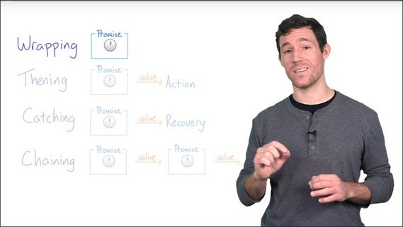](../assets/images/prom1-21.jpg)

Here, let me show you an example.

**Promise is a constructor**. You can either store a promise as a variable like I'm doing right here, or you can simply work on it as soon as you create it.

[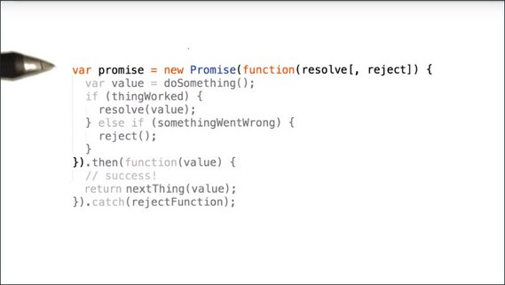](../assets/images/prom1-22.jpg)

Either way works just fine, but you'll often see me simply work on the promise without storing it as a variable.

#### ES5
Here's the code from above.

```js
var promise = new Promise(function(resolve, reject) {
  var value = doSomething();
  if(thingWorked) {
    resolve();
  } else if (somethingWentWrong) {
    reject();
  }
}).then(function(value) {
  // success!
  return nextThing(value);
}).catch(rejectFunction);
```

#### ES6
This is the same promise constructor written in ES6.
```js
const promise = new Promise((resolve, reject) => {
  const value = doSomething();
  if(thingWorked) {
    resolve();
  } else if (somethingWentWrong) {
    reject();
  }
}).then(value => {
  //success!
  return nextThing(value);
}).catch(rejectFunction);
```


You pass a function to the promise with two arguments: `resolve` and `reject`.

[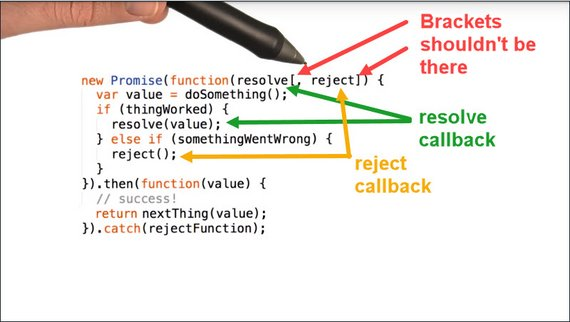](../assets/images/prom1-23.jpg)

`resolve` and `reject` are the two callbacks you use to specify when a promise has either **fulfilled**, because something worked, or **rejected** because something went wrong.

Let me show you what this actually looks like.

In this example, I'm wrapping an image tag loader in a promise because I want to do some work after the image loads on a page.

[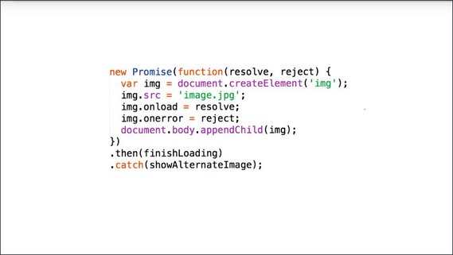](../assets/images/prom1-24.jpg)

I'm using the image tag's `onload` handler to specify success.

`onload` calls `resolve`, which queues up the function passed to `.then` to execute after the remainder of the code in this function block finishes executing.

> **Note:** the JavaScript engine does not immediately stop executing this function upon calling `resolve`.
>
> It will execute the remaining lines in the function before transferring control to `.then` which in turn executes `finishLoading`.
>
> An example of this concept in action can be found in the *Resources* section below.

Being able to call `resolve` and `reject` is important. This is what it gives you the flexibility to explicitly say what constitutes **fulfillment** and what constitutes **rejection** for the promise.

When either `resolve` or `reject` has been called, the promise has been **settled**, and then at that point, the next part of the chain, usually, a `.then`, or it could be a `.catch`, is executed.

Back to the original example, any value passed to `resolve` or `reject` will be received as an argument by this subsequent `.then` or `.catch`.

[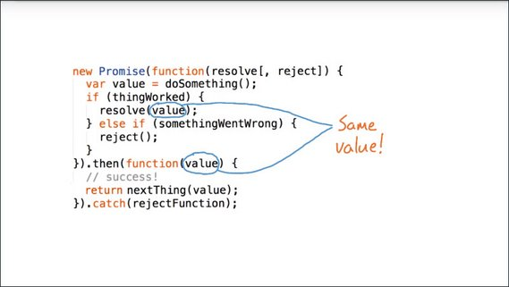](../assets/images/prom1-25.jpg)

In the event that nothing is passed to `resolve` or `reject` as is the case here with the `reject`, then it's totally fine. The next link in the chain simply receives `undefined`.

[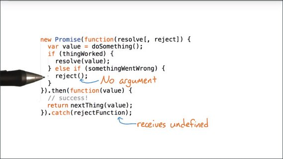](../assets/images/prom1-26.jpg)

> **Note:** Just to be clear, when passing values or `undefined` through `resolve()` and `reject()` to `.then` and `.catch`, the values themselves aren't being passed to `.then` or `.catch`, rather they're being passed to the functions called by `.then` or `.catch`.

There's a third case and that is if the value that's passed is a promise.

If so, then the promise will execute first and then whatever value it resolves to will be passed to the next link in the chain.

[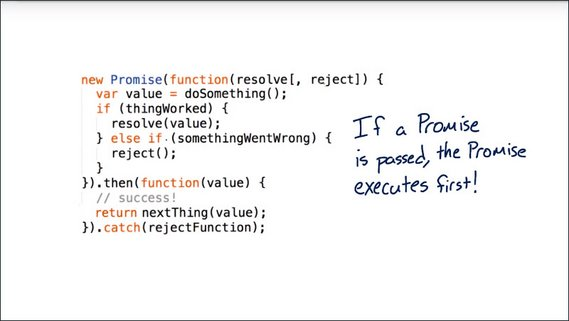](../assets/images/prom1-27.jpg)

Note that `resolve` and `reject` have the same syntax. `resolve` leads to the next `.then` in the chain, while `reject` leads to the next `.catch`.

Incidentally, if there is a JavaScript error somewhere in the body of the promise, `.catch` will also automatically get called.

And by the way, there's a bit more to error handling and you'll be learning about it in the next lesson. In the meantime, it is time for you to write your first promise.

#### Resources
Sample code that shows the remainder of the code in the function block gets executed even after `resolve()` gets called.

```js
new Promise(function(resolve) {
  console.log('first');
  resolve();
  console.log('second');
}).then(function() {
  console.log('third');
});
```

You'll notice that `'first'`, `'second'` and `'third'` all get logged. Most notably, `'second'` gets logged despite the fact that it comes after `resolve()`.

### 1.8 Quiz: Write a Promise
For this quiz you'll be wrapping `setTimeout()` with a Promise. There won't be any error handling yet because I want to keep this first quiz simple.

[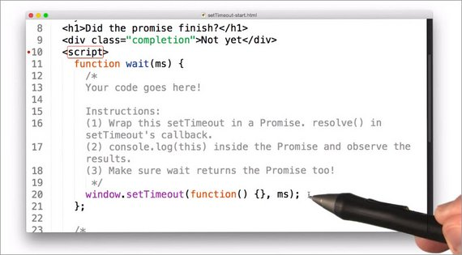](../assets/images/prom1-28.jpg)

I'm giving you a sample page to work with, and inside of it you'll find a function called `wait()`. This function should simply wait a set number of milliseconds before resolving.

That means that you'll need to call `resolve` when `setTimeout()` executes its callback.

While you're working on this function, I want you to `console.log(this)` inside the Promise. The reason is that I have a question for you about the scope of `this` inside Promises when you finish working on it.

I also want you to return the Promise from `wait`. The reason is that, after you finish your work, you will be able to uncomment these two lines to test your code.

[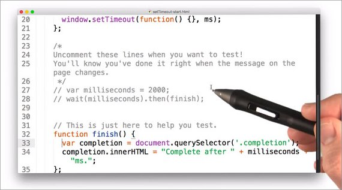](../assets/images/prom1-29.jpg)

If there are no errors, and the text changes, you'll know you've done it right.

And like I said, when you're done, I have a question for you:

- What is the scope of this inside the Promise?

#### Resources
##### Instructions

1. Download `setTimeout-start.zip` from the Supporting Materials Section.
2. Wrap `setTimeout` in a Promise inside the `wait()` function. `resolve()` in setTimeout's callback.
3. `console.log(this)` inside the Promise and observe the results.
4. Make sure `wait()` returns the Promise too!

##### Supporting Materials

- [setTimeout-start.zip](https://www.udacity.com/api/nodes/6078481442/supplemental_media/settimeout-startzip/download)
- [setTimeout-solution.zip](https://www.udacity.com/api/nodes/6078481443/supplemental_media/settimeout-solutionzip/download)

#### Solution
So here's the solution. To start off I'm creating a Promise by using `new Promise()`.

[](../assets/images/prom1-30.jpg)

I'm going to pass a function into the Promise with the parameter `resolve`. There is no `reject` in this case because I'm never going to need to reject so I just don't include it.

Inside the Promise I'm logging `this` so I can check out its scope later.

You'll see that in the callback function to the `setTimeout()`, I'm calling `resolve()` to resolve the Promise.

In this case the Promise will resolve after some number of milliseconds that's getting passed into `wait()`.

Also notice that I am returning the Promise and you'll see why in a second.

Then I've un-commented these two lines which say that after 2000 milliseconds the `finish` function should get called.

[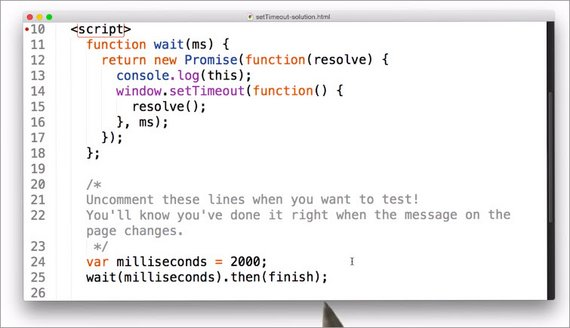](../assets/images/prom1-31.jpg)

All right, let's see how this looks. I will go ahead and refresh the page.

You see that two seconds later it is complete.

[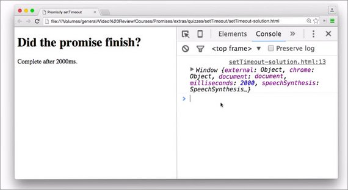](../assets/images/prom1-32.jpg)

It looks like `this` logged out the `window`, or the `global` object.

> **Note:** the scope of `this`, could change depending on the context.
>
> For instance, arrow functions with ES2015 take `this` from the enclosing execution context. Whereas in ES5, every new function defines its own `this` value.
>
> See [MDN article on Arrow functions](https://developer.mozilla.org/en-US/docs/Web/JavaScript/Reference/Functions/Arrow_functions) for a complete explanation.

So the correct answer is the 'global object'.

#### ES6 Solution
Here is the same code written using ES6 syntax.

```js
function wait(ms) {
  return new Promise(resolve => {
    console.log(this);
    window.setTimeout( () => {
      resolve();
    }, ms);
  });
};

var milliseconds = 2000;
wait(milliseconds).then(finish);

// function to test with
function finish() {
  var completion = document.querySelector('.completion');
  completion.innerHTML = "Complete after " + milliseconds + "ms.";
};
```

This can be further shortened to:

```js
function wait(ms) {
  return new Promise(resolve => {
    console.log(this);
    window.setTimeout( resolve, ms);
  });
};

var milliseconds = 2000;
wait(milliseconds).then(finish);

// function to test with
function finish() {
  var completion = document.querySelector('.completion');
  completion.innerHTML = "Complete after " + milliseconds + "ms.";
};
```

### 1.9 Quiz: Wrap & Chain
Okay, that first quiz was a little bit on the simple side. This one's going to be more useful.

You'll be replicating jQuery's `.ready()` feature by wrapping a check for `document.readyState` in a Promise.

> #### jQuery Sidenote
> While we won't be using jQuery for this exercise, I did want to note the new recommended syntax for calling [jQuery's `.ready()`](https://api.jquery.com/ready/) method.
>
> **Note:** The following syntaxes are all equivalent ways of attaching a function to run when the DOM is ready.
> - `$( handler )`
> - `$( document ).ready( handler )`
> - `$( 'document' ).ready( handler )`
> - `$( 'img' ).ready( handler )`
> - `$().ready( handler )`
>
> As of jQuery 3.0, only the first syntax is recommended.
>
> ##### Deprecated (as of jQuery 3.0)
>
> ```js
> $(document).ready(function() {
>   // Handler for the .ready called  
> });
> ```
>
> ##### Recommended (as of jQuery 3.0)
>
> ```js
> // es5
> $(function() {
>   // Handler for .ready() called
> });
> 
> // es6
> $(() => {
>   // Handler for .ready() called
> });
> ```

#### Thening
You are now in the thening stage of the course.

[](../assets/images/prom1-33.jpg)

I want you to use `.then` to perform an action after a promised result.

`document.readyState` has three possible states: loading, interactive, and complete.

[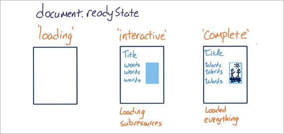](../assets/images/prom1-34.jpg)

1. **loading** - the document is still loading.
2. **interactive** - the document has loaded and been parsed but sub-resources like images and style sheets have yet to load. This is equivalent to the `DOMContentLoaded` event.
3. **complete** - all the sub-resources including images and style sheets have loaded.

Every time the document's `readyState` changes, a `readystatechange` event fires.

[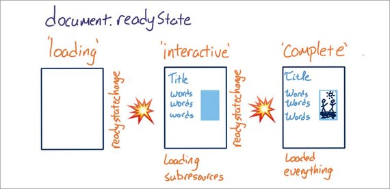](../assets/images/prom1-35.jpg)

Creating a promise to run on **interactive** is really useful if you want to run some code as soon as all of the initial DOM elements have been loaded.

For this quiz I'm giving you an event handler for `readystatechange`.

[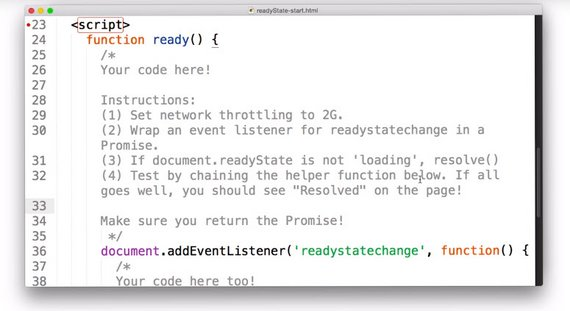](../assets/images/prom1-36.jpg)

I want you to wrap it in a promise so that it resolves when the DOM is '**interactive**'. Or, in other words, I want it to resolve when the `readyState` is no longer '**loading**'.

Like the last quiz, you don't need to worry about error handling because if the DOM is never ready then the page won't display anyway.

Make sure you test, too. Do so by using `.then` to chain the method `wrapperResolved` when the document is ready.

[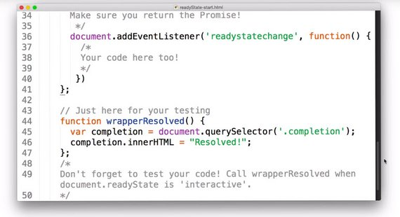](../assets/images/prom1-37.jpg)

Make sure you check out the Instructor Notes forhelp getting started, and good luck.

#### Resources

- [document.readyState](https://developer.mozilla.org/en-US/docs/Web/API/Document/readyState) on MDN

##### Instructions

1. Download `readyState-start.zip` in the downloadables section.
2. Set network throttling so that the page isn't ready instantly. (Also, it's generally a good practice to have some throttling when testing sites. It'll help you see your site's performance from your users' perspectives.)
3. Wrap an event listener for `readystatechange` in a Promise.
4. If `document.readyState` is not `'loading'`, `resolve()`.
5. Test by chaining wrapperResolved(). If all goes well, you should see "Resolved" on the page!

##### Supporting Materials
- [readyState-start.zip](https://www.udacity.com/api/nodes/6105298604/supplemental_media/readystate-startzip/download)
- [readyState-solution.zip](https://www.udacity.com/api/nodes/6027593911/supplemental_media/readystate-solutionzip/download)

#### Solution
To start off, I need to give credit to Jake Archibald, who came up with the idea for this quiz, and who also wrote this code.

[](../assets/images/prom1-38.jpg)

There are two parts to the `ready()` method.

1. It checks the `readyState` when the `readystatechange` event fires
2. And it also checks the `readyState` immediately.

By checking immediately, the `ready()` method will still work if `readyState` becomes '**interactive**' before this promise is created, so that's pretty useful.

And if the `readyState` is still loading when the promise is created, it'll call `checkState` every time the `readystatechange` event fires.

Once the `readyState` is no longer '**loading**', it resolves.

So here's how I test it. I simply call `ready()`, and then chain, `.then(wrapperResolved)` to the end.

Here's the completed code:

```js
function ready() {
  return new Promise(resolve => {
    function checkState() {
      if(document.readyState !== 'loading') {
        resolve();
      }
    }
    document.addEventListener('readystatechange', checkState);
    checkState();
  });
};

ready().then(wrapperResolved);

// function to test with
function wrapperResolved() {
  var completion = document.querySelector('.completion');
  completion.innerHTML = "Resolved!";
};
```

Time to see how it looks. To test with I'm using 3G so that the image takes a little bit to load.

Remember the text should say "Resolved!" before the image shows up.

[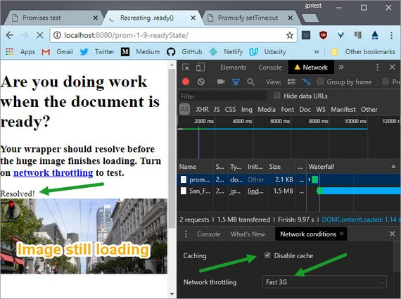](../assets/images/prom1-39.jpg)

Now, it already say resolved but let see what happens when the page get refreshed. You can see that its resolved immediately before the image even finishes loading, that's pretty cool.

Okay. Now it's time to try some error handling.

### 1.10 Install Exoplanet Explorer
#### What is this?
You'll be working with a stripped down version of the [Exoplanet Explorer](http://www.exoplanetexplorer.com/) to complete all of the programming quizzes for the rest of the course. So, you need to install it.

#### Installation
I built the Exoplanet Explorer from the [Polymer](https://www.polymer-project.org/1.0/) [Starter Kit](https://developers.google.com/web/tools/polymer-starter-kit/?hl=en). I'm copying most of the rest of these instructions from the README written by the Polymer team. If you ever need help, check out the README.

##### Clone the repo first (for everyone)

Here's the [link to the repo](https://github.com/udacity/exoplanet-explorer).

You should be on the `xhr-start` branch. If not, then `git checkout xhr-start` or `git checkout origin xhr-start`.

##### Quick-start (for experienced users)

With Node.js installed, run the following one liner from the root of your Exoplanet Explorer download:

```bash
npm install -g gulp bower && npm install && bower install
```

##### Prerequisites (for everyone)

The full starter kit requires the following major dependencies:

- Node.js, used to run JavaScript tools from the command line.
- npm, the node package manager, installed with Node.js and used to install Node.js packages.
- gulp, a Node.js-based build tool.
- bower, a Node.js-based package manager used to install front-end packages (like Polymer).

##### To install dependencies:

1. Check your Node.js version.

    ```bash
    node --version
    ```

    The version should be at or above 0.12.x.

2. If you don't have Node.js installed, or you have a lower version, go to [nodejs.org](https://nodejs.org/) and click on the big green Install button.

3. Install `gulp` and `bower` globally.

    ```bash
    npm install -g gulp bower
    ```

    This lets you run `gulp` and `bower` from the command line.

4. Install the starter kit's local `npm` and `bower` dependencies.

    ```bash
    cd exoplanet-explorer && npm install && bower install
    ```

    This installs the element sets (Paper, Iron, Platinum) and tools the starter kit requires to build and serve apps.

**NOTE! INSTALLATION MAY TAKE A LONG TIME!** There are many dependencies to download and install.

#### Post-Installation and Workflow
For every quiz, you'll be given a branch to checkout. You can always find it in the instructor notes. All of your work will be done in:

```bash
app/scripts/app.js
```

##### Serve / watch

```bash
gulp serve
```

This outputs an IP address you can use to locally test and another that can be used on devices connected to your network.

It's recommended to use Chrome, as non-vulcanized Polymer projects will load fastest on Chrome.

##### Build & Vulcanize

```bash
gulp
```

Build and optimize the current project, ready for deployment. This includes linting as well as vulcanization, image, script, stylesheet and HTML optimization and minification.

##### Troubleshooting

See [this bug](https://github.com/nodejs/node-gyp/issues/695) if you get the following error from Gyp:

```bash
"Error: self signed certificate in certificate chain"
```

### 1.11 Quiz: Wrap XHR
I hope you're starting to get the hang of Promises. I've got another challenge for you.

I want you to wrap an Ajax request in a Promise. You're now officially in the catching stage, and don't worry, it's pretty similar to the thening stage.

[](../assets/images/prom1-40.jpg)

In the instructions I'll be asking you to add `.catch` to your promise as a way to see if there are any errors, and then do something about it.

Right now you won't be recovering. You'll simply be console.logging them. To take this quiz, you'll be doing your work here, inside the Exoplanet Explorer app.js file.

[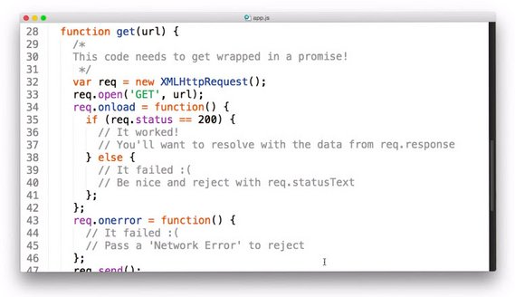](../assets/images/prom1-41.jpg)

I want you to wrap this XHR helper method with a Promise.

Unlike the last two quizzes, a lot can go wrong with a XHR so you need to include error handling: `reject()` if there's an error, or if the request status is anything but 200.

Remember, any value that you pass to `resolve()` or `reject()` will get passed to the next `.then` or `.catch`, and of course, don't forget to return the promise from `get()`.

Test your Promise wrapper with the `get()` method (shown as commented out).

[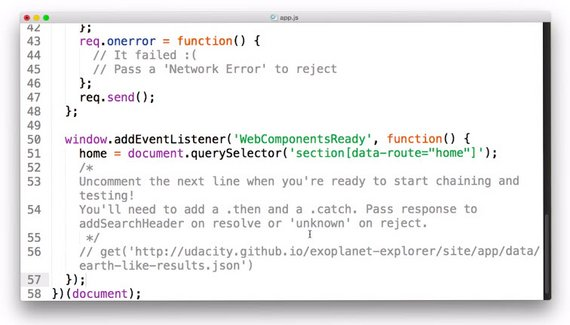](../assets/images/prom1-42.jpg)

The file that's requested contains a simulated search response for the exoplanet explorer app, and it contains the URLs for some JSON data of some Earth-like planets.

Pass the `response` to `addSearchHeader()` when it resolves, or if it fails to resolve, catch it by passing '`unknown`' to `addSearchHeader()` on reject.

You might try messing up this URL to make sure your `.catch` works correctly.

While you're working, I recommend using `gulp serve` to watch for changes and automatically reload the page.

This is definitely the fastest way to work.

#### Resources
##### Instructions

1. Checkout the `xhr-start` branch and navigate to `app/scripts/app.js`.

    ```bash
    git checkout xhr-start
    ```

2. Wrap the XHR in a Promise in the `get()` function. See [XHR documentation](https://developer.mozilla.org/en-US/docs/Web/API/XMLHttpRequest/Using_XMLHttpRequest) for more information.
3. Resolve on load and reject on error.
4. If the XHR resolves, use `addSearchHeader()` to add the search header to the page.
5. If the XHR fails, `console.log()` the error and pass '`unknown`' to `addSearchHeader()`.

The solution is on the `xhr-solution` branch.

```bash
git checkout xhr-solution
```

#### Solution
To start off I'm calling `gulp serve`, and letting that run in the background.

[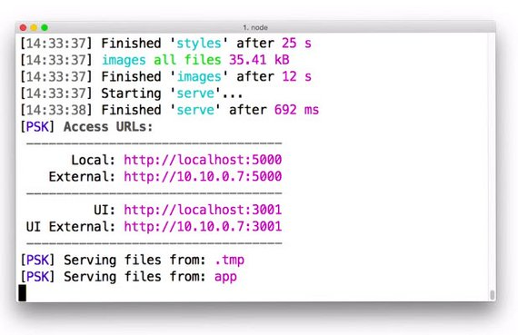](../assets/images/prom1-43.jpg)

So here's my promise wrapper inside `get()`.

[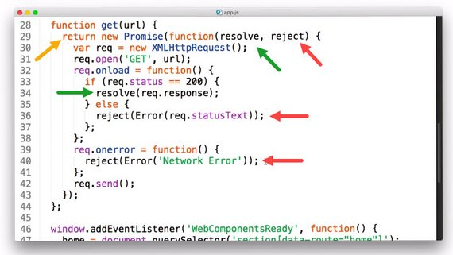](../assets/images/prom1-44.jpg)

Notice that I'm returning the promise, and I'm resolving when the request status is 200. I'm passing the response to resolve so that then gets the response as well.

I'm rejecting on any error whether that's not a status of 200 or something else, and the rest of it looks good. I didn't have to change anything else.

Down here in the web components ready listener, I am actually doing something to the page.

[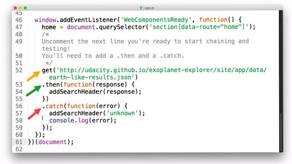](../assets/images/prom1-45.jpg)

Once I get the data, I add the search header, and if something goes wrong, I add a search header of '`unknown`' and then console that log error.

Okay, let's see what happens.

[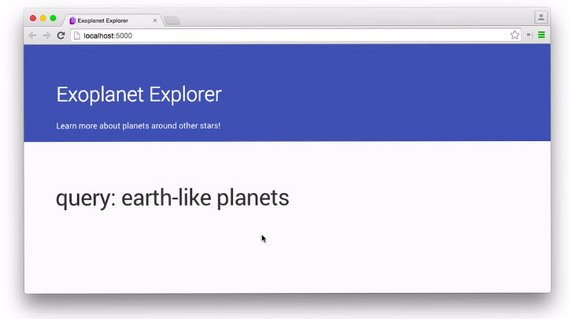](../assets/images/prom1-46.jpg)

So it looks like this query works because you can see 'earth-like planets' on the page.

But let me see what happens when I mess up that URL. I'll go ahead and just delete a character.

[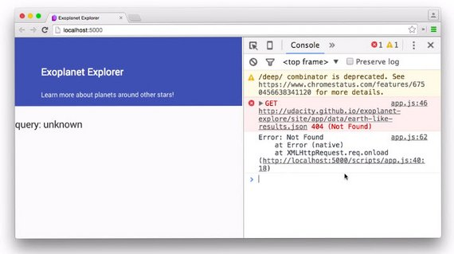](../assets/images/prom1-47.jpg)

Okay, that looks good. I see 'unknown' as the query and I see an error here in the console. I can open it up and see that something went wrong with the XHR.

Here's the completed code:

```js
function get(url) {
  return new Promise(function (resolve, reject) {
    var req = new XMLHttpRequest();
    req.open('GET', url);
    req.onload = function() {
      if (req.status === 200) { // It worked!
        resolve(req.response);
      } else { // It failed :(
        reject(Error(req.statusText));
      }
    };
    req.onerror = function(error) { // It failed :(
      reject(Error('Network Error'));
    };
    req.send();
  });
}

window.addEventListener('WebComponentsReady', function() {
  home = document.querySelector('section[data-route="home"]');
  get('../data/earth-like-results.json')
    .then(function (response) {
      addSearchHeader(response);
    }).catch(function (error) {
      addSearchHeader('unknown');
      console.log(error);
    });
});
```

Cool, I want to show you one more thing though. Inside the `addSearchHeader()` there is this call to `JSON.parse` of the response.

[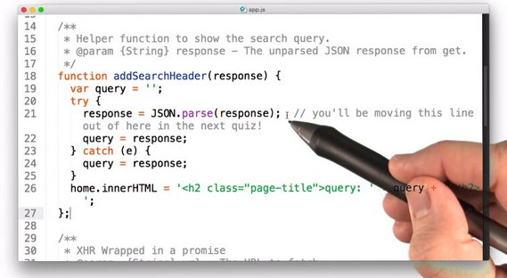](../assets/images/prom1-48.jpg)

If you think about it, parsing a JSON really has nothing to do with adding a search header, so in the next quiz you'll be removing this all together and putting it inside a different method where it does belong.

### 1.12 Web Technologies
The course that you're taking is about native JavaScript promises. They started showing up in browsers around the end of 2014, but polyfills for promises have been around for much longer actually.

jQuery, which is obviously a very popular library, implements its own version of promises, but prior to v3.0 they had some serious issues. So I definitely recommend reading up on them in the Resources section if you need to use them.

The first version of Angular uses Q style promises. These are mostly the same as native promises, but have some slight differences.

Angular 2, however, does actually take advantage of native JavaScript promises.

As of January of 2016, native promises are safe to use with every major browser, except for Internet Explorer and Opera Mini. You'll need to make sure that you include a polyfill or some other kind of fall-back on your production sites.

[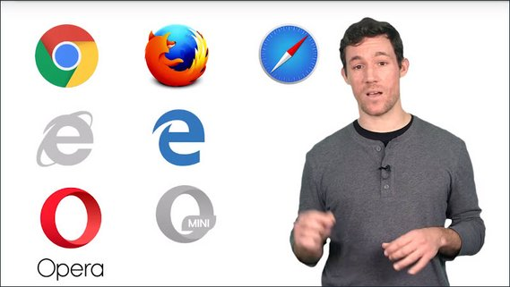](../assets/images/prom1-49.jpg)

There are some new APIs that are also taking advantage of promises. For instance, they're the recommended strategy for interacting with the Service Worker API.

Service workers are a total game changer. They allow you to add a powerful layer of control between your app and the network, and that means that you can actually create apps that work offline.

In the next quiz you'll be using another new API called the Fetch API. It uses native promises to simplify xml http requests.

#### Resources
##### jQuery Promises
- 10 June 2016 update! [With the 3.0 release, jQuery promises now satisfy Promises/A+ compliance!](https://blog.jquery.com/2016/06/09/jquery-3-0-final-released/)
- [You're Missing the Point of Promises](https://blog.domenic.me/youre-missing-the-point-of-promises/) - Domenic Denicola (Pre-jQuery 3.0)
- [jQuery Deferred Broken](https://thewayofcode.wordpress.com/tag/jquery-deferred-broken/) - Valerio Gheri (Pre-jQuery 3.0)

##### Q Style Promises
- They're an implementation of the [Promises/A+ spec](https://promisesaplus.com/).
- [$q service Documentation](https://goo.gl/J1K2iv).

##### Browser Implementation
- [Can I Use... - Promises](http://caniuse.com/#search=promises)
- [ES2015 Promises Polyfill](https://github.com/jakearchibald/es6-promise)
- [Q Library](https://github.com/kriskowal/q)
- [Bluebird Promises](https://github.com/petkaantonov/bluebird)

##### APIs that Use Promises
- [Service Worker API](https://developers.google.com/web/fundamentals/primers/service-workers/)
- [Fetch API](https://davidwalsh.name/fetch) by David Walsh

### 1.13 Quiz: Fetch API
As you probably realized a few videos ago, or maybe even longer, XHRs are really annoying.

Even the simplest use case is fairly verbose, and it only gets worse as you address edge cases and browser compatibility issues.

Fetching resources really just shouldn't be this hard. Luckily there's a new API that simplifies XHRs, the Fetch API.

[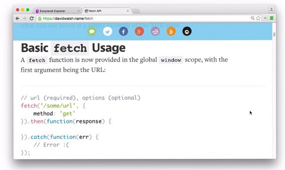](../assets/images/prom1-50.jpg)

Currently it's natively supported by all browsers except IE and Opera Mini. It's incredibly useful and also it's built on native promises.

This is going to be a two step quiz. On the first part you're going to re-factor `get()` with the Fetch API and in the second part, you're going to be creating a new wrapper called `getJSON()`.

[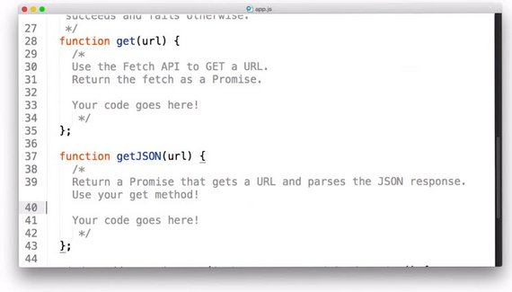](../assets/images/prom1-51.jpg)

`getJSON()` should return a Promise and it should return a promise that's two steps.

The first part should be getting the URL, you should use the `get()` method for that, and the second part should be parsing the JSON response.

I want you test `getJSON()` by adding a search header and console.log the parsed JSON.

[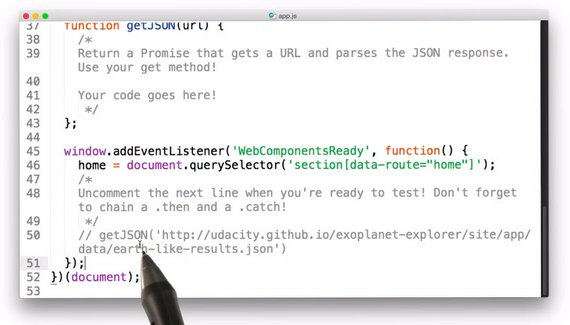](../assets/images/prom1-52.jpg)

When you do so, you should see an object with search data appear in the console.

If there is an error, catch it. Pass 'unknown' as the search header and then `console.log` the error.

[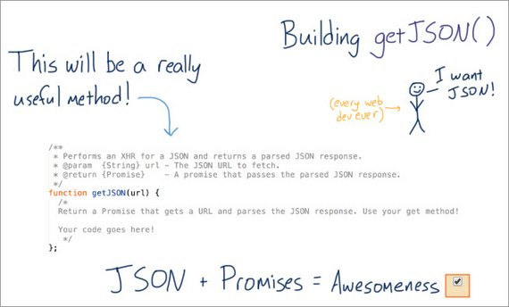](../assets/images/prom1-53.jpg)

#### Resources

- [Fetch API Walkthough](https://davidwalsh.name/fetch) by David Walsh

##### Instructions
1. Checkout the `fetch-start` branch and navigate to `app/scripts/app.js`.
    ```bash
    git checkout fetch-start
    ```
2. Rewrite `get()` with the Fetch API: [https://davidwalsh.name/fetch](https://davidwalsh.name/fetch)
3. Finish the `getJSON()` method, which should take a URL and return the parsed JSON response.
- `getJSON()` needs to return a Promise!

4. Test by logging the response and by passing the query string from `getJSON()` to `addSearchHeader()`.
5. Handle errors by passing '`unknown`' to `addSearchHeader()` and logging them.

The solution is on the `fetch-solution` branch.

```bash
git checkout fetch-solution
```

#### Solution
So this is how I did it. Inside get I am just using fetch, in fact, this whole object here with method get is totally optional.

[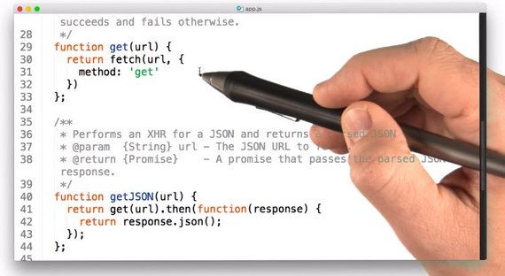](../assets/images/prom1-54.jpg)

If there are no options fetch assumes that you're doing a get, so you can just get rid of it.

```js
function get(url) {
  return fetch(url);
}
```

In `getJSON()`, I simply `.then` off the `get()` and then return `response.json`.

This `response.json` is specific to the fetch API, but it's basically the same as `JSON.parse`.

To test, I'm getting the json and then if it's there, I add the query to the search header and `console.log` the response.

If it's not there, I add '`unknown`' to the search header and `console.log` the error.

[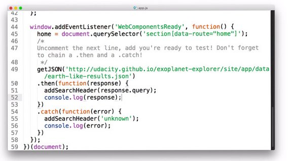](../assets/images/prom1-55.jpg)

Let's see if it works.

So far so good, I'm seeing earth-like planets and when I open up the console, I see the response logged out with the query and some more JSON files.

[](../assets/images/prom1-56.jpg)

That's pretty cool but I want to show you one more trick. I just added another `.then` to output the first json url.

```js
getJSON('../data/earth-like-results.json')
  .then(function (response) {
    addSearchHeader(response.query);
    console.log(response);
    return response.results[0];   // <-- here
  }).then(function(url) {         // <-- here
    console.log(url);             // <-- here
  }).catch(function (error) {
    addSearchHeader('unknown');
    console.log(error);
  });
```

So from the original `.then`, I am returning some results. In fact, this is the first URL in the search results.

Then, in the next `.then`, I am taking the URL and console.logging it. The cool thing here is that I've got `.then` and then another `.then` and then finally a `.catch`, which means I'm chaining promises together.

So now inside the console, after the whole search object, I'm seeing the URL of the first planet in the response.

[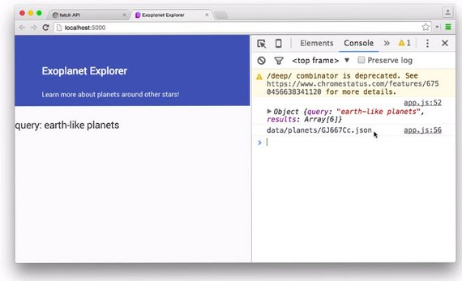](../assets/images/prom1-57.jpg)

This whole idea of chaining is incredibly important, and that's what you'll be doing next in the course.

Here's the complete code.

```js
function get(url) {
  // Use the Fetch API to GET a URL. Return the fetch.
  return fetch(url);
}

function getJSON(url) {
  // Return a Promise that gets a URL and parses the JSON response. Use get().
  return get(url).then(function(response) {
    // Handle network errors
    if (!response.ok) {
      throw Error(response.statusText ? response.statusText
        : 'Unknown network error')
    }

    return response.json();
  });
}

window.addEventListener('WebComponentsReady', function() {
  home = document.querySelector('section[data-route="home"]');
  // Don't forget to chain with a .then and a .catch!
  getJSON('../data/earth-like-results.json')
    .then(function(response) {
      addSearchHeader(response.query);
      console.log(response);
      return response.results[0];
    }).then(function(url) {
      console.log(url);
    })
    .catch(function(error) {
      addSearchHeader('unknown');
      console.log(error);
    });
});
```

### 1.14 What's Next
So far you've created promises and chained the some work off them.

[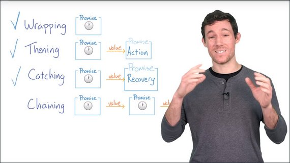](../assets/images/prom1-58.jpg)

You did so in the last quiz by creating a `get()` function and then using `.then` to do something with the data that you retrieved.

You also included catches to ensure that no error goes unhandled.

With the promise API, `.then`'s also return promises. 

So if you can `.then` off of an initial promise, you can `.then` off of `.then`s because they are also promises.

Developers commonly use the term 'thenable' to describe promises and `.then`s.

- Any method or object that returns a `.then` is 'thenable'
- Anything 'thenable' can become a part of a chain of asynchronous work
- Promises are 'thenable' as are `.then`s and `.catch`es.

In fact, other libraries include thenable objects. See below for more information.

When creating a chain of asynchronous work, each subsequent link in the chain receives either the fulfilled value of the previous promise or the return value of the previous `.then`'s function.

In this way, you can pass information collected from one asynchronous method to the next.

Being able to chain thenables is an incredibly powerful technique for simplifying complex sequences of asynchronous work.

You'll be practicing a few chaining strategies in the next lesson.

So this is the end of the first lesson. You have already added a powerful new tool to your toolbox, and you are just getting started.

At the beginning of the next lesson you'll be creating a chain of `.then`s to put thumbnails on the Exoplanet Explorer.

#### Resources
- ["Thenable" used in the context of promises](https://developer.mozilla.org/en-US/docs/Web/JavaScript/Reference/Global_Objects/Promise#Methods) on MDN. This includes:
  - Promise.all(iterable)
  - Promise.race(iterable)
  - Promise.reject(reason)
  - Promise.resolve(value)

## Lesson 2: Chaining Promises
### 2.1 Quiz: Fetch & Show First Planet
Welcome back. In this lesson you'll be experimenting with different techniques for creating chains of asynchronous work.

[](../assets/images/prom2-1.jpg)

Asynchronous work is rarely isolated, and as such you may have many asynchronous actions that depend on one another.

This is another strong suit of promises.

Rather than creating a pyramid of doom, promises make it straightforward to chain together lots of asynchronous actions. It even works when you're generating those actions programmatically.

To get started, you'll be manually creating a chain of work to load a planet thumbnail in the exoplanet explorer app.

[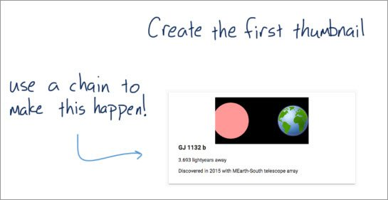](../assets/images/prom2-2.jpg)

#### Resources
##### Instructions
1. Checkout the `first-thumb-start` branch and navigate to `app/scripts/app.js`.
2. Get the planet data and add the search header.
3. Create the first thumbnail with `createPlanetThumb(data)`.
4. Handle errors!
- Pass '`unknown`' to the search header.
- Log the error.

The solution is on the `first-thumb-solution` branch

```bash
git checkout first-thumb-solution
```

#### Solution
So here's how I did it. This first part should look pretty familiar, but there's one new line right here.

[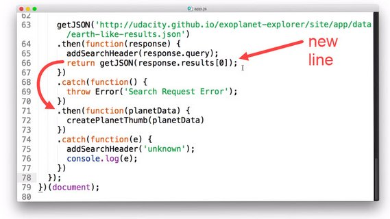](../assets/images/prom2-3.jpg)

I went ahead and returned the response from the second `getJSON()`. This getJSON is getting the URL of the first planet.

By returning it, it will get passed to the next `.then`. When it receives the `planetData`, it then creates a thumbnail with it.

Before we go on, I want to show you a slightly different syntax. Instead of an anonymous function, I can actually just pass the `createPlanetThumb` function.

[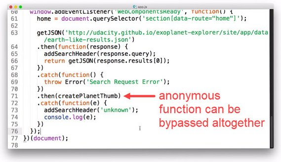](../assets/images/prom2-4.jpg)

This function will receive the same argument and as the argument that the anonymous function was receiving is the same one that createPlanetThumb was receiving, this works totally fine.

I've also got two `.catch`s.

I've got this first one in case there is an error with the search results and I've got the second in case anything else went wrong.

Your error handling strategy may have looked slightly different and that's totally fine.

So the real question is does this code work? It sure does.

[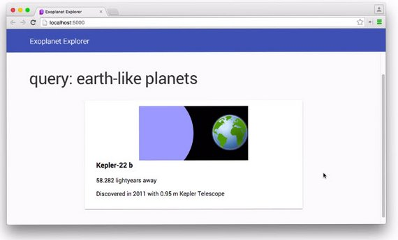](../assets/images/prom2-5.jpg)

Here's my completed code.

```js
getJSON('../data/earth-like-results.json')
  .then(function (response) {
    addSearchHeader(response.query);
    console.log(response);
    return getJSON(response.results[0]);  // return result for chaining
  }).catch(function () {                  // catch err in search request
    throw Error('Search Request Error');
  }).then(function (planetData) {         // receive result in planetData
    createPlanetThumb(planetData);
    console.log(planetData);
  }).catch(function (error) {             // catch any other error
    addSearchHeader('unknown');
    console.log(error);
  });
```

Okay, but that's about as far as we can go just by manually chaining `.then`s. It's time to make chains a little bit more interesting.

### 2.2 Error Handling Strategies
So far, error handling has come in the form of `.catch`es like this one.

```js
get('example.json')
.then(resolveFunc)
.catch(rejectFunc);
```

But there are actually other ways. These two chunks of code are actually equivalent.

```js
get('example.json')
.then(resolveFunc)
.catch(rejectFunc);
```

```js
get('example.json')
.then(resolveFunc)
.then(undefined, rejectFunc);
```

`.catch` is just shorthand for `.then(undefined, )`, and then a rejection function.

Notice how, this `.then` is actually is taking two arguments. The full function signature for `.then` is actually:

```js
get('example.json').then(resolveFunc, rejectFunc);
```

In this form, if any previous promise is rejected, the reject function gets called. If they resolve, then the resolve function gets called.

If there is no resolve function and the promise before this `.then` resolves, then this `.then` gets skipped over and the next `.then` is called.

[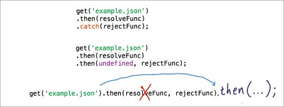](../assets/images/prom2-6.jpg)

**Note:** In all cases, as soon as a promise rejects, the JavaScript engine skips to the next `reject` function in the chain, whether that's in a `.catch` or a `.then`.

So that means an error in the first promise or error in the second promise, both get caught by the following `.catch`.

[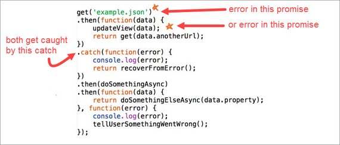](../assets/images/prom2-8.jpg)

Both methods `.catch`, and `.then` with two callbacks, work equally well.

[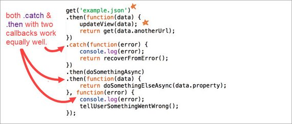](../assets/images/prom2-7.jpg)

However, it's actually recommended that you use `.catch` when you can, because `.catch` is just easier to read and write than a second `.then` callback which can be hard to spot.

In fact, you might not have even noticed it above right away.

That being said, there is a major difference in the execution order between `.catch` and a second callback.

Notice that you cannot call both the `resolve` function and the `reject` function if they're part of the same `.then`.

[](../assets/images/prom2-9.jpg)

Only one or the other, or neither will get called.

If something goes wrong with the `resolve` function, you'll need another `.catch` or another `.then`, farther down the line to catch it.

But if you have `.then` and then a `.catch`, each with their own `resolve` or `reject` function, both of them can possibly get called.

[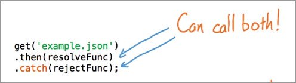](../assets/images/prom2-10.jpg)

And finally, I want to make one more subtle point. It's also worth noting that it isn't necessarily true, that passing a value to `resolve` means that the promise succeeded.

[](../assets/images/prom2-11.jpg)

If what we pass to `resolve` is `undefined` or  a promise that rejects, the rejection callback will be called.

This is a subtle point, so go see Jake Archibald's blog post for more information.

In the next quiz, you'll be thinking through the flow of a chain of promises using different formats.

#### Resources
- [Promises: Resolve Is Not the Opposite of Reject](https://jakearchibald.com/2014/resolve-not-opposite-of-reject/) - Jake Archibald

### 2.3 Quiz: Chained Thenables
There are some subtle differences to error handling strategies that can come back to bite you if you're not careful.

So for this quiz, I want you to think through a few different scenarios with this long chain.

[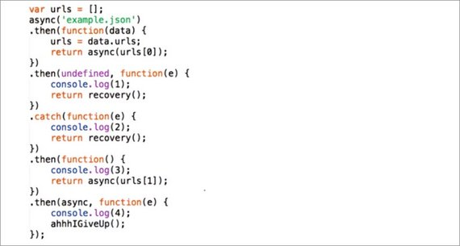](../assets/images/prom2-12.jpg)

Now, you normally wouldn't want to mix and match different syntaxes like I've done here, but I want you to think through some different situations.

In this example, `async` returns a promise, as does `recovery`. The idea is that the `recovery` method gets the chain back on track and continuing to resolve if something goes wrong.

My question for you is, for each of these four lines, what numbers will be logged if an error occurs there?

[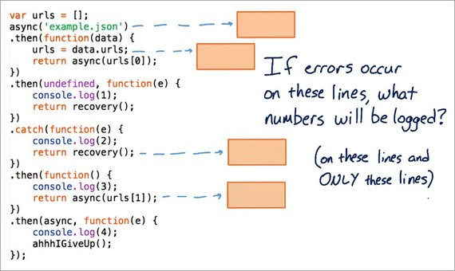](../assets/images/prom2-13.jpg)

Note that you can assume that no other errors occur.

I'll go ahead and give you the first one. If an error occurs with `async` then the first reject function will get called, which logs a 1.

If the recovery works, which you can assume it does, then the next result function will get called, which puts a 3 on the log.

[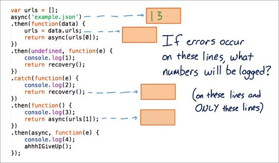](../assets/images/prom2-15.jpg)

Okay, now it is your turn to finish up the rest.

#### Solution
For the second problem, if an error occurs here, then the next reject function will get called, which once again, logs out a number is 1.

Then the recovery function happens, and things get back on track. So, the next number is 3. After that, there's no more log in here so that's it.

[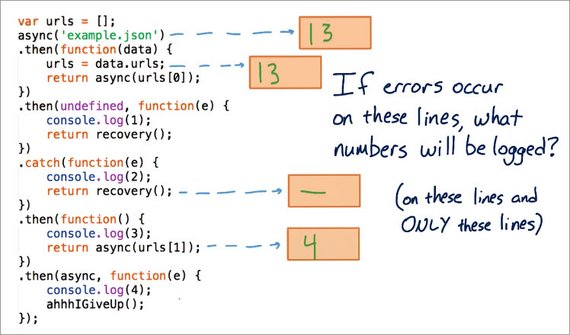](../assets/images/prom2-14.jpg)

Next problem. If there is an error with this recovery function, now this is an interesting one, because this is only going to get called if there is another error.

So in this case nothing will show up in the log.

For the last one, if something goes wrong with the `async` function, then the next reject function will get called. In that case, the number 4 should end up on the screen.

So, these can be kind of tricky, but just keep in mind that if something goes wrong, the next reject function will get called.

### 2.4 Quiz: Series vs Parallel Requests
When you need to perform asynchronous work, the work may not be isolated. You often need to perform multiple asynchronous actions which means you are in the chaining stage of the course.

This is where you will be chaining promises together.

[](../assets/images/prom2-16.jpg)

There are two main strategies for performing multiple asynchronous actions.

They are:

- actions in series
- actions in parallel

Action in series occur one after another, like these three cats all waiting their turn for the rocket.

[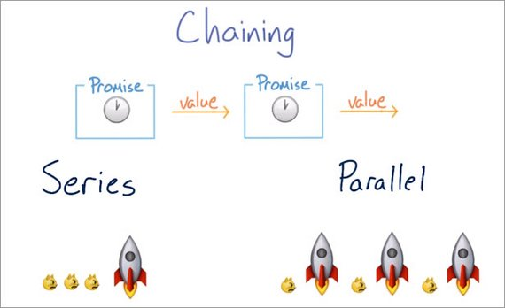](../assets/images/prom2-17.jpg)

While actions in parallel all occur simultaneously, like each of these cats getting its own rocket to ride.

You could say that synchronous code is always in series but asynchronous code can either be in series or it can also be in parallel.

Neither option, series or parallel, is inherently better than the other, each has its own purposes.

In the quiz where you fetched the list of planet JSONs and then performed a request for an individual planet JSON, you had to perform the two requests in series because one depended on the other.

[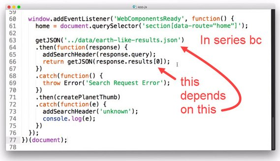](../assets/images/prom2-18.jpg)

But if you need to request a lot of planet JSONs, as you will soon be doing in a quiz, then you will need to programmatically send out the request.

You'll also want to make the request in parallel because that will reduce the amount of time it takes to load all of the data.

So with that in mind, here's a quiz for you.

There's a problem with this code. It appears to be looping over the URLs from the planet search query, but something unexpected will happen.

[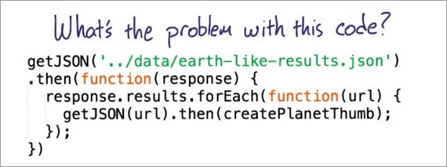](../assets/images/prom2-19.jpg)

What is it?
1. [ ] Is it that the requests are being sent in series but they will return in parallel, causing some kind of collision?
2. [ ] Is it that the requests are blocking so that this code will never finish?
3. [ ] Is there simply nothing wrong with this and I just gave you a trick question?
4. [ ] Is it that the thumbnails will be created in a random order?

I want you to pick one of these four answers.

#### Solution
I'll start from the first one.

1. [ ] No. The browser is really really good of keeping track of requests. You don't need to worry about a collision. In fact, I just made that up.
2. [ ] No. Making lots of parallel requests is totally fine for the same reason as I just stated.
3. [ ] No. I don't like trick questions.
4. [x] So that must mean that the thumbnails will be created in a random order

Remember, async requests can finish at any time so you cannot predict the order in which requests will return. So you don't know when any of these `getJSON` promises will resolve.

This means that they could resolve in a different order than they were created. In that case, the planet thumbnails will be created in a totally random order.

Now, this isn't necessarily a problem or a bug, but it does lead to the question: Just how do you make the thumbnails appear in the right order?

Keep watching.

### 2.5 Array Methods & Promises
In the next three quizzes, I'm going to be challenging you to take advantage of array methods, to programmatically create long chains of promises.

[](../assets/images/prom2-1.jpg)

Keep in mind that you want the thumbnails to appear on the page in the same order as they appear in the search results, but this does not mean that you need to perform the request in series.

There are different strategies for controlling the order that promises resolve, which you'll be trying out soon.

The keystone to all of these strategies is the idea of a sequence. You'll need to create a sequence of promises that are chained, one after another.

### 2.6 Quiz: .forEach Promises
Does this code look familiar?

[](../assets/images/prom2-19.jpg)

For this quiz you'll be refactoring it and making it actually work. To do so, you're going to need to create a chain or a sequence of promises.

I want you to loop through the array of URLs that comes in the search results, create a promise foreach one and then use that promise to create a thumbnail once it resolves.

There are probably a few different ways to solve this challenge. You'll know you've done it correctly when the thumbnails show up in the same order on the page as they did in the original URL from the search results.

Also, don't forget to handle errors. I'm going to let you decide what you want to do with them.

When you're done I have a question for you.

How are the requests executed? Are they executed in series or in parallel?

[](../assets/images/prom2-20.jpg)

Even if you think you know the answer, make sure you check the network panel because you may be surprised.

I'm going to give you some hints to help out. But if you want a challenge, go ahead and skip to the quiz.

I want you to think about a loop that looks like this.

[](../assets/images/prom2-21.jpg)

For every iteration through the loop, x increases by 1. Before the iteration, x is at 0. Then you add 1 to x and get 1. You add another 1 to x and get 2. Another one, you get 3.

At some point you've chained so many ones together that you've got 10.

[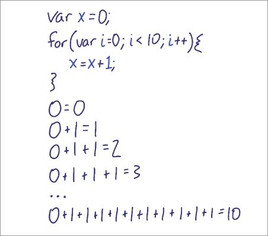](../assets/images/prom2-22.jpg)

I want you to treat the sequence similarly, but don't use addition here.

For every iteration through the loop, add another `.then` to the end of the sequence.

[](../assets/images/prom2-23.jpg)

Remember that for each planet you're going to need two actions.

1. You'll need to get the JSON
2. You'll need to create a planet thumbnail.

In this way the sequence will grow by one request and one thumbnail for every iteration.

#### Resources
##### Instructions

1. Checkout the `foreach-start` branch and navigate to `app/scripts/app.js`.
2. Refactor `.forEach` to create a sequence of Promises that always resolves in the same order it was created.
    - Fetch each planet's JSON from the array of URLs in the search results.
    - Call `createPlanetThumb(data)` on each planet's response data to add it to the page.
3. Use developer tools to determine if the planets are being fetched in series or in parallel.

The solution is on the `foreach-solution` branch.

#### Solution
Okay so there are different answers to this question depending on how you solve the problem.

[](../assets/images/prom2-20.jpg)

Let me show you my solution first, and then I'll talk through how you may have come to a different conclusion.

I'm iterating through the URLs and adding two `.thens` for each URL. The first gets the JSON data for the planet and then the second creates the planet thumbnail.

[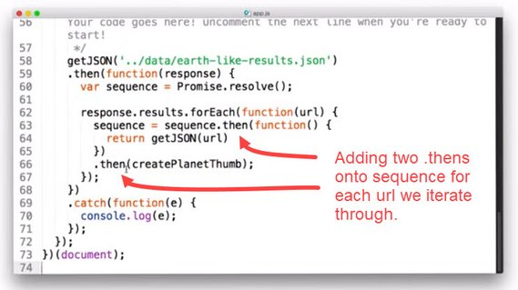](../assets/images/prom2-24.jpg)

As `forEach` iterates through the array of planet data urls, the sequence gets longer by two `.then`s each time.

Each `.then` will need to wait for the promise before it to resolve before it can execute.

There's some good news and some bad news.The good news is that the planet thumbnail show up in the right order. The bad news is that it's happening in series.

You can pretty clearly see that each request depends on the one before it finishing.

[](../assets/images/prom2-25.jpg)

In order to execute the requests in parallel, your code needs to look something like the following code.

[](../assets/images/prom2-26.jpg)

Notice that I'm not actually adding to the sequence, rather, I'm simply adding two `.then`s which quickly get overwritten by the next iteration through the loop.

Luckily, these two `.then`s stay attached to one another, and so they continue to execute.

If your code looked like this, then you probably saw the request come in like so.

[](../assets/images/prom2-27.jpg)

They're in parallel and the problem is that there's no guarantee about the order, and to be honest, for many applications this is completely fine. You can handle ordering in other ways with your front end.

But if the order that promises resolve is important to your app, this kind of code could easily become a subtle source of bugs later.

Browsers can request many resources simultaneously so it makes a lot of sense to run code like this in parallel. But if you want to do so, you probably should where it's really, really obvious that your requests are happening in parallel.

In fact, you'll be doing that in the next quiz.