<!-- markdownlint-disable MD022 MD032 -->
<!-- # Mobile Web Specialist Nanodegree -->
# Responsive Images

[<-- back to Mobile Web Specialist Nanodegree homepage](../index.html)

---

### Supporting Links
- [Google's overview of Chrome DevTools](https://developers.google.com/web/tools/chrome-devtools/)
- [Udacity Responsive Images code examples](http://udacity.github.io/responsive-images/)

## Lesson 6. Getting Up and Running
### 6.1 Course Introduction
Sam Dutton, a developer advocate at Google, and Cameron Pittman, a course developer at Udacity, teach this course on how to use images responsively so they work across a variety of devices, display sizes, and connectivity scenarios.

[](../assets/images/full-size/ri6-1.png)

The web started as a text only medium. It was limited, but the ability to embed images was the innovation that really made it take off. Now we have an incredible wealth of images on the web.

Given the huge and increasing variety of devices and contexts for consuming web content now, we need to think about how we use images.

Throughout this class you'll be building a webpage design for a blog site that uses several kinds of images. By the end you'll be able to incorporate these techniques in your work.

### 6.2 Why Responsive Images
On mobile, we need to be extra careful because images consume more than 60% of the bandwidth used to open a web page. That's bandwidth we can't always rely on or might not want to use.

Also, images don't always work so well on different screen sizes if we don't take steps to make the image responsive.

The web was actually invented with responsiveness in mind to enable us to publish content to a variety of devices.

> "Create a product, don't re-imagine one for small screens. Great mobile products are created, never ported."
>
> -- Brian Fling

Great designers don't optimize for mobile as an afterthought, they think responsively from the get go in order to build sites that work across a range of devices.

### 6.3 Intro to Project
As the course continues, you'll have a chance to practice by working on this blog.

[](../assets/images/full-size/ri6-2.png)

You'll start with the ugly version and turn it into something that looks much more reasonable.

There's some aspects of art that go into this. So, your finished version may look slightly different than ours.

Regardless, it's our goal that working on this blog will help you easily deliver the highest quality images with the fewest bytes possible.

### 6.4 Setting Up Your Environment
In this course, you'll be using Google Chrome and Chrome's developer tools, which we call DevTools for short.

[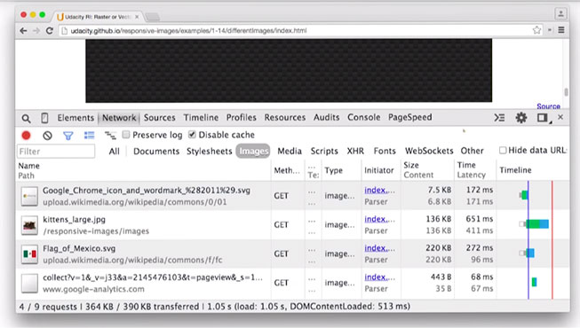](../assets/images/full-size/ri6-3.png)

You can use DevTools to quickly get an idea of how your site performs on a range of different devices. However, emulators and simulators can never really replace the experience of using a real phone or tablet.

[](../assets/images/full-size/ri6-4.png)

To test your work on a phone or tablet, you'll need to make sure you're set up to use remote debugging.

For the remainder of this lesson, you will be getting some instructions from Peter Lovers on how to get started with mobile DevTools and debugging on your mobile devices.

### 6.5 Setup for mobile
Here are two useful links

- [Download Chrome Canary](https://www.google.com/chrome/browser/canary.html)
- [Remote debugging Android devices with Chrome](https://developers.google.com/web/tools/chrome-devtools/debug/remote-debugging/remote-debugging?hl=en)

#### What is Chrome Canary and why should I use it
Chrome Canary is the developer version of Chrome. It looks and acts like the regular Chrome browser, but it includes new and experimental features that haven't been released yet. We recommend analyzing websites with Canary to take advantage of the latest tech. However, be warned that Canary isn't guaranteed to be stable, so expect crashes and occasional bugs.

#### Do I have to test on mobile
For the purposes of this course, no. But testing your websites on mobile is a best practice, and if you have the means to do so we highly recommend it.

### 6.6 Using DevTools on mobile
Open Chrome on your development machine and go to `chrome://inspect`.

Make sure the site you want to debug is open on your mobile device and then connect your laptop to your mobile device via USB. Then confirm that you want to allow USB debugging.

Back in our development machine, we can see a list of the attached devices and the Chrome tabs that are open on the devices. You can open other tabs, focus on specific tabs, reload a tab and even close a tab.

[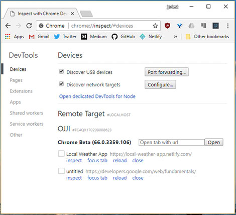](../assets/images/full-size/rwdf4.png)

You can inspect the pages that are running on your mobile device, from your development machine, and using screen-cast mode, you can drive the experience on your mobile device from your development machine.

Clicking on links will update simultaneously on the device and the desktop.

### 6.7 Mobile Tools for iOS
iOS WebKit Debug Proxy: [https://github.com/google/ios-webkit-debug-proxy](https://github.com/google/ios-webkit-debug-proxy)

Please note that on the forums, there is a discussion continuing about ios-webkit-debug-proxy. Depending on your version of canary, if you're using it, it might take a lot of time and some students suggest trying Safari Dev Tools and point to links like this:

[https://www.smashingmagazine.com/2014/09/testing-mobile-emulators-simulators-remote-debugging/](https://www.smashingmagazine.com/2014/09/testing-mobile-emulators-simulators-remote-debugging/)

Remember you can run in simulator mode in Chrome Dev Tools.

### 6.8 Lesson Wrap Up
Now that you've got your environment set up, you're ready to start developing with responsive images in mind.

In the next lesson, you'll start experimenting with image sizing, compression, and formats. By the end, you'll be ready to intelligently reduce the number of bytes required for your images.

## Lesson 7. Units, Formats, Environments
### 7.1 Quiz: Sizing Intro
By the end of this lesson, you will be prepared with a workflow that will make it easy for you to optimize your images so that they take up as little bandwidth as possible while still looking great.

You'll be thinking about image quality and size. With images on the web, it all comes down to size, but what does that actually mean?

Here's a question for you.Can you spot the differences between these three images?

[](../assets/images/full-size/ri7-1.png)

To be honest, I can't tell the difference with my eye. These three look the same to me.

For this quiz, check out [this site](http://udacity.github.io/responsive-images/examples/1-05/identicalImagesDifferentCompressionAndSize/index.html), then use DevTools to work out the difference between the three images.

Are the differences caused by compression level, display resolution, the natural resolution, or the file type? Check all that apply.

If the image data looks the same for all images, make sure to check the `Disable cache` checkbox in DevTools.

[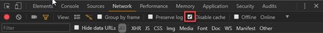](../assets/images/full-size/ri7-2.png)

#### Answer
I've opened up DevTools, and I've navigated to the Network tab. I'm ready to record so I will refresh the page. You can see the three requests for the three different images, horse1, horse2, and horse3. It looks like their sizes are really different.

[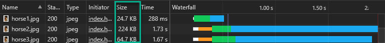](../assets/images/full-size/ri7-4.png)

Notice how horse2 is almost ten times bigger than horse1, and horse3 is also bigger than horse1. Given that the images look identical, it seems like there could be some wasted bytes here.

Inside the Elements pane, I can find out the actual dimensions of these three images. There are a couple of ways doing it. I'm going to show you a hard way and then an easy way.

DevTools has this awesome feature where you can manipulate an element in the DOM by clicking on it. So I've clicked on the first horse. Then inside the console, I can access it by typing `$0`.

[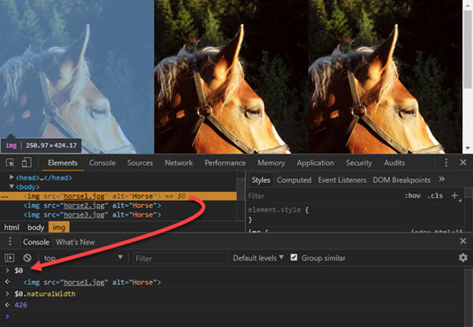](../assets/images/full-size/ri7-3.png)

When I press Enter, the horse `` element is returned. To find out the horse's actual width, I'll simply access the property `naturalWidth`. When I do that, the width returned is `426`.

I then select horse2 and run the same command to see that one is also 426 pixels wide. So I'll try the third one.And ah-ha that one is twice as large at 852 pixels. So it looks like these three images have different sizes.

Okay, now here's the easy way of figuring that out. Simply hover over the image, and you can see it right here. There is the natural width and height.Horse2 is the same just like we saw a second ago.And then horse3 is twice as large.

[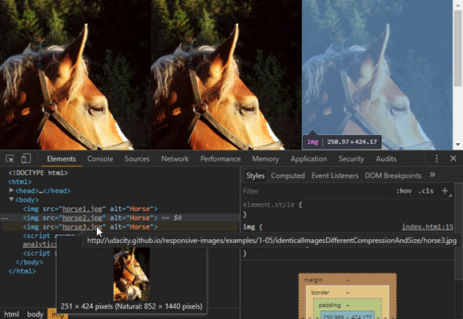](../assets/images/full-size/ri7-5.png)

So then what could be different about horse1 and horse2?

As it turns out, their compression levels are different. So at this point it's clear that horse3 is definitely a larger image but then what's different about horse1 and horse2?

If they have the same resolution but different sizes, then they have different compression levels. So, the answer to this quiz is that they have different compression levels and different resolutions.

- [x] Compression level
- [ ] Display resolution
- [x] Actual (natural) resolution
- [ ] File type

### 7.2 All about Bits and Pixels
With images like photos, the total file size depends on the number of pixels multiplied by the number of bits it takes to store each pixel.

[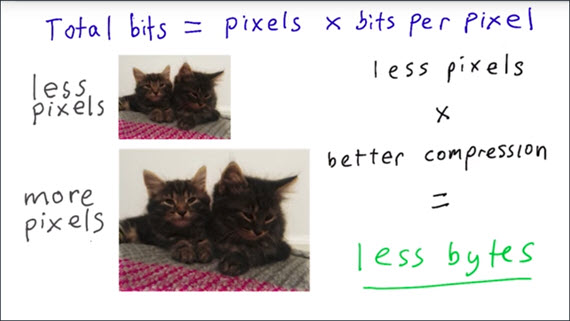](../assets/images/full-size/ri7-6.png)

So, to improve performance, you need to keep images as small as possible and compression as high as possible. It's a common mistake to save images with dimensions too large, and quality too high.

It might sound counter-intuitive, but the first rule for saving images to a range of devices is to save images with the lowest possible quality, and the smallest size as possible. But, how do you reduce file size while maintaining quality?

Throughout this course, you'll learn how to use responsive techniques to do just that.

### 7.3 Requests and Revenue
The average webpage makes a whopping 56 requests for images. Every one of those image requests has a cost in terms of page load and studies by Google, Amazon, and others have shown that even very small delays in loading pages can result in a significant loss of traffic and revenue.

[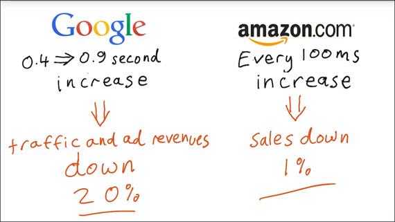](../assets/images/full-size/ri7-7.png)

Here we see from Google that a 0.4 to 0.9 second increase resulted in traffic and ad revenues down by 20% and for Amazon, every 100 millisecond increase in page load time means a loss of sales of 1%.

### 7.4 Relative Sizing
Let's have a deeper look at CSS sizing.  I've given this image a fixed size of 640 by 360 pixels, which is the natural size of the image.It looks great. But of course, when I resize the window,the image gets cropped.

[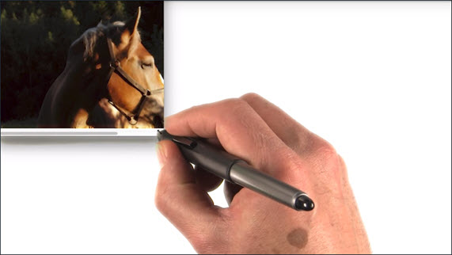](../assets/images/full-size/ri7-8.png)

On a phone, the image is larger than the view port.Which means that to see the whole image, you have to scroll horizontally.

Let's try relative sizing. I set the image width to 100%.

It looks good in the smaller browser window and looks good on the phone, but when I resize the image larger by resizing the browser window, it starts to get pixelated and blurry.

[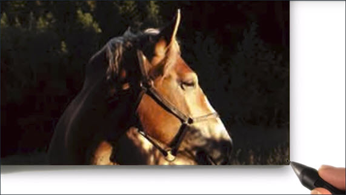](../assets/images/full-size/ri7-9.png)

Let's do something about that. If we set the max-width of the image to 100%, the image will expand nicely, but only ever as wide as its natural width.

[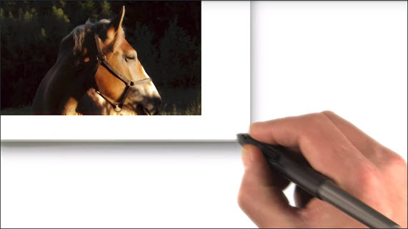](../assets/images/full-size/ri7-10.png)

Two simple things you can learn from this. For devices such as laptops and desktop monitors.

1. Don't assume the window size is the same as the screen size
2. Don't assume the window size will always stay the same.

- **Using `max-width` is a good way to respond gracefully to a change to a larger view port.**
- When you're thinking responsively, consider large displays as well as small.

So what if you want two images to fit side by side, no matter the size of the view port? Well, that's easy. Just use relative sizing, 50% width.

[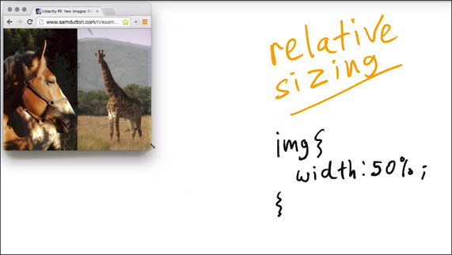](../assets/images/full-size/ri7-11.png)

But what if you want to add a ten pixel margin between the images? You can just add margin-right, 10 pixels, right?

You can get around this with our old friend `calc()`.

Calc allows you to do simple calculations in CSS values and that's a great way to combine absolute and relative values. For example, combining a percentage width with a fixed margin.

[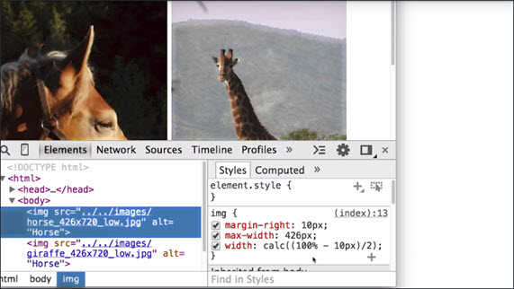](../assets/images/full-size/ri7-12.png)

Now the calculation here looks a little complex but all we're saying is to give each image half of the width available.

I've also used the `last-of-type` selector to ensure there's only a margin between the images and none to the right of the second image.

```css
img {
    margin-right: 10px;
    max-width: 426px;
    width: calc((100% - 10px)/2);
}
img:last-of-type {
    margin-right: 0;
}
```

#### Image Examples

- [Fixed size image](http://udacity.github.io/responsive-images/examples/1-07/singleImage640x360/)
- [width: 100%](http://udacity.github.io/responsive-images/examples/1-07/singleImageNotBigEnough100pc/)
- [max width: 100%](http://udacity.github.io/responsive-images/examples/1-07/singleImageMaxWidth100pc/)
- [Two images, 50% width](http://udacity.github.io/responsive-images/examples/1-07/twoImages50pc)
- [Two images, 50% width with margin](http://udacity.github.io/responsive-images/examples/1-07/twoImages50pcWithMargin)

You can find out more about `calc()` from [Mozilla Developer Network](https://developer.mozilla.org/en-US/docs/Web/CSS/calc).

The horse and giraffe are from [lorempixel.com](http://lorempixel.com/), which provides URLs for random placeholder images. For example, [check this out](http://lorempixel.com/400/200/animals/).

### 7.5 IMPORTANT! Udacity Front End Extension
We think it's incredibly important that you get feedback on your code as you write it. So, we created the Udacity Front End Feedback Chrome extension to give you feedback on quizzes as you work on your own computer.

[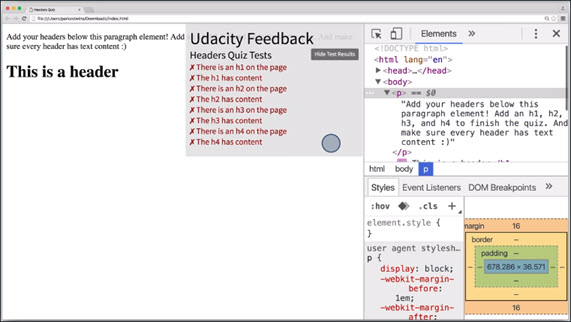](../assets/images/full-size/ri7-13.png)

This is done simply by opening up a quiz that uses the extension and clicking the extension icon in the toolbar.

#### How to Load the Extension
1. Install the Udacity Front End Feedback Extension from the Chrome Web Store or from Mozilla's Add-ons for Firefox (it's free).
2. If you're using Google Chrome, go to the Chrome extensions menu (chrome://extensions) and give the extension permission to run against file URLs.
    [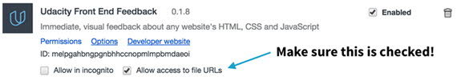](../assets/images/full-size/settings.png)
3. To use the extension, open the webpage you want to edit, click on the extension icon, and check "Allow feedback on this domain":
    [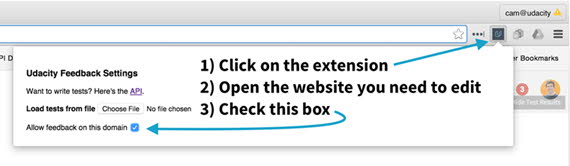](../assets/images/full-size/allow-feedback.png)
4. As edits are made, changes are reflected in the Udacity Front End Feedback dialogue box.😃

### 7.6 Quiz: calc()
For this quiz I want you to fix this website.

[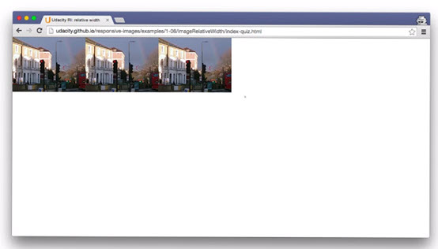](../assets/images/full-size/ri7-14.png)

You'll be trying out Calc with these images but this time, I want you to fit these three images all the way across the screen.

Each of the three images will need to be a third of the available width, and there should be a ten pixel margin between them.

Pop open DevTools and inside the head you'll find this style tag. Inside the style tag, you'll see some comments. These are the places where I want you to make some changes.

You can find a link to the website [here](http://udacity.github.io/responsive-images/examples/1-08/imageRelativeWidth/index-quiz.html).

When all three images are aligned correctly, with ten pixels between these images, a code will appear on the website. Type that code into this box to continue.

[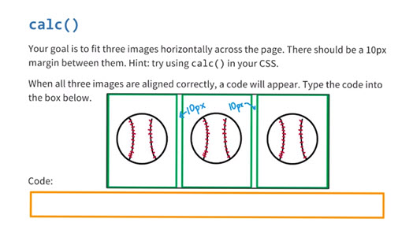](../assets/images/full-size/ri7-15.png)

#### Solution
The solution consisted of the following css:

```css
img {
    width: calc((100% - 20px)/3);
    max-width: 100%;
    margin-right: 10px;
}
img:last-of-type {
    margin-right: 0;
}
```

**Note:** There MUST be a space on each side of the `+` and `-` operators. (A space is not required around `*` and `/` as the problem is an ambiguity around negation.)

For example: `calc(100px - 10%)` **will work**. `calc(100px-10%)` **will not**.

[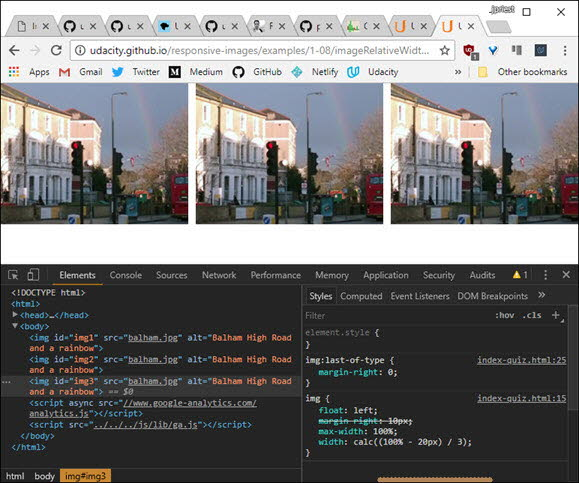](../assets/images/full-size/ri7-16.png)

### 7.7 Landscape and Portrait
Let's think some more about the size and the shape of the viewport. Think about the way you use devices. Phones and tablets are often used in portrait orientation whereas a full screen browser window on a laptop is landscape.

[](../assets/images/full-size/ri7-17.png)

Now, even though you can't change the window size on a phone or tablet, these devices have another rather tricky feature when it comes to responsive resizing. Orientation can change, and when it comes to landscape and portrait, you need to think about content as well as size.

[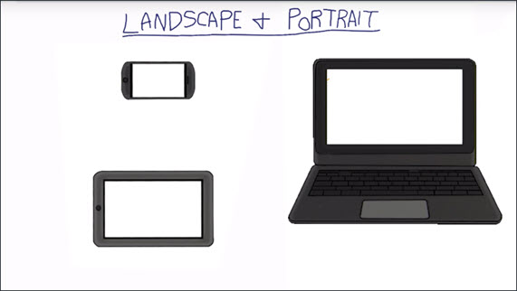](../assets/images/full-size/ri7-18.png)

Tall or square images can work well in portrait mode on a phone but wide images can be a real problem. Again, for responsive design the golden rule is don't assume the viewport size will always stay the same.

You'll learn the impact of image choice and art direction later in the course when you find out how to use the `<picture>` element. Later in this lesson, we'll look at ways to work with orientation using media queries.

### 7.8 vh vw vmin vmax
On the subject of sizing, there are some CSS units that you may not have heard of, but which are now really widely supported.

How about if you want an image to responsively cover the whole height of the viewport?

Now, you can always do that by setting the height of the image to 100%, but that only works if the height of the HTML and the body elements are also set to 100%.

A simple way is to use the `vh` unit, which stands for viewport height. One `vh` unit corresponds to 1% of the viewport height, and so `100vh` means 100% height.

[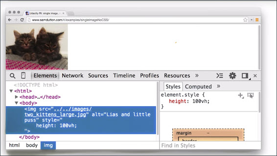](../assets/images/full-size/ri7-19.png)

You can do the same with `vw` for viewport width.

Here you can see we've set the width of the image to be `100vw`, 100% of the viewport width, and you can see that it resizes responsibly.

[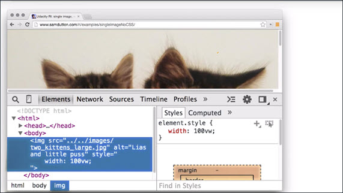](../assets/images/full-size/ri7-20.png)

Another common responsive use case is when you want an image to resize to fit the smaller of the height or the width of the viewport.

The `vmin` unit, viewport minimum, corresponds to 1% of the viewport width or height, whichever is smaller.

If you set both the width and the height to `100vmin`, you'll get the effect you're after.

[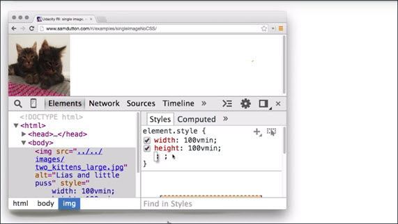](../assets/images/full-size/ri7-21.png)

How about if you want an image to cover the whole viewport but without stretching or squashing?

For this you can use the `vmax` unit, which corresponds to 1% of the viewport width or height, whichever is greater.

So, if you set both the height and the width to `100vmax`, the image responsively resizes to cover the viewport.

[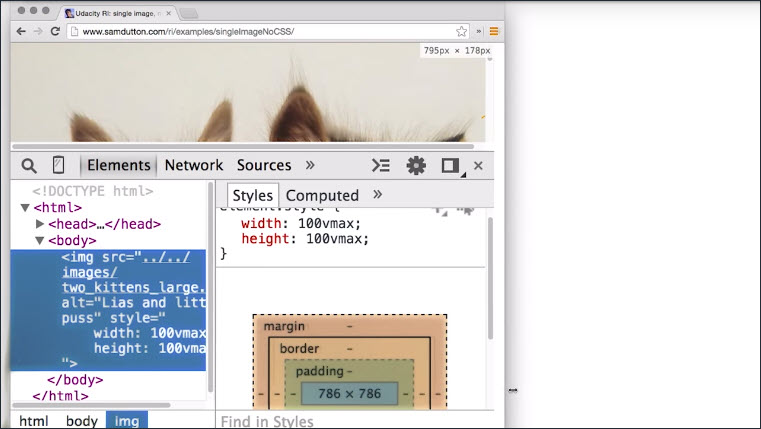](../assets/images/full-size/ri7-22.png)

**Note:** setting both the height and the width to `100vmax` or `100vmin` changes the image's aspect ratio. It'll compress your images to squares, so be careful if you want to maintain a different aspect ratio!

### 7.9 Raster and Vector
There are two fundamentally different ways to create and store images and this affects how you deploy images responsibly. Raster and vector.

**Raster images:** photographs and other images represented as a grid of individual dots of color.

Raster images might come from a camera or a scanner, or be created with the HTML `<canvas>` element.

**Vector images:** images such as logos and line art, which can be defined as a set of curves, lines, shapes, fill colors and gradients.

Vector images can be created with programs like Adobe Illustrator or Inkscape, or from using a vector format such as SVG.

SVG makes it possible to include responsive vector graphics in a webpage, and we'll talk more about this format later.

The advantage of vector file formats over raster file formats is that the browser can render a vector image at any size. After all, vector formats describe the geometry of the image; how it's constructed from lines, curves, and colors and so on, not individual dots of color.

Open the [SVG vs PNG example](http://udacity.github.io/responsive-images/examples/1-11/svgVersusPng/) in a large display - you'll see a massive difference in quality!

[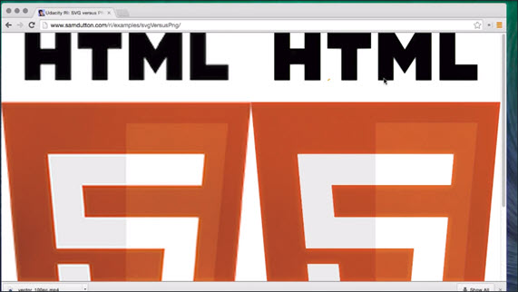](../assets/images/full-size/ri7-23.png)

Let's see what happens when we resize this page. Now, that's an SVG image on the right and a PNG on the left, and you can see as the size increases, the PNG is looking to start a little blurry, whereas the SVG is perfect at any size.

### 7.10 Quiz: Raster or Vector Banner
Imagine you're a graphic designer and you need ot design a 50m (~165ft) banner. Should you give you friend a vector or raster image? Why?

- [ ] **Vector**. File size is smaller.
- [x] **Vector**. It scales without quality loss.
- [ ] **Raster**. File size is smaller.
- [ ] **Raster**. It scales without quality loss.

Vector images can be scaled infinitely, which means that it'll be sharp and clear even on a 50m banner!

### 7.11 Quiz Raster & Vector identification
Take a look at the images in [this link](http://udacity.github.io/responsive-images/examples/1-14/differentImages/index.html). Are they **raster** or **vector** graphics?

| Image | Raster | Vector |
| --- | --- | --- |
Chrome Logo | | x |
Kitten Photo | x | |
Flag of Mexico | | x |
Repeat BG |  | x |
Gradient BG |  | x |

### 7.12 File Formats
This image combining line art and a photo was saved as a JPEG and it looks fine on a phone at small display sizes.

[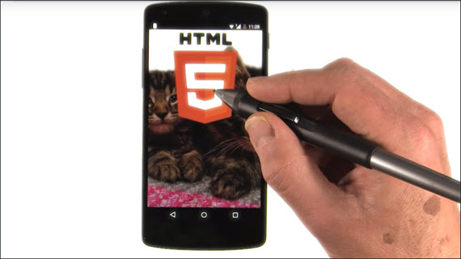](../assets/images/full-size/ri7-24.png)

But on a desktop monitor by resizing the browser window, the JPEG format begins to show its weaknesses.

It may be a bit hard to see but the edges of the text "HTML" are blurry and less sharp. Click the image to view a larger version.

[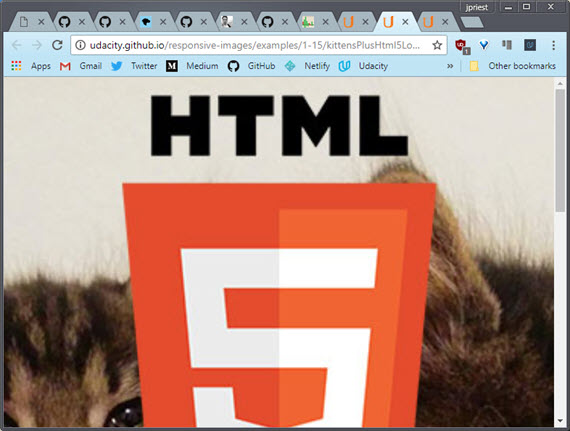](../assets/images/full-size/ri7-25.png)
**Live Sample:** [Photo with logo as JPEG](https://rawgit.com/james-priest/udacity-nanodegree-mws/master/exercises/ri-7-12/kittensPlusHtml5Logo.html)

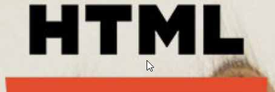

With JPEG, edges can lead to artifacts. For this example, SVG for the logo would have scaled better.

Here's the same with SVG for the logo over a JPEG of the photograph.

[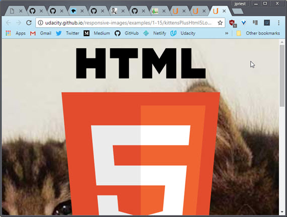](../assets/images/full-size/ri7-26.png)
**Live Sample:** [Photo as JPEG, logo overlaid as SVG](https://rawgit.com/james-priest/udacity-nanodegree-mws/master/exercises/ri-7-12/kittensPlusHtml5LogoSvg.htmlhttp://udacity.github.io/responsive-images/examples/1-15/kittensPlusHtml5LogoSvg)


The photo and the logo both look good small or large. You can see the crisp edges as well. Both look great.

File sizes are down too. Here's the version with the logo over the image as a, one single JPEG.


And here we have the version with the SVG over the JPEG.

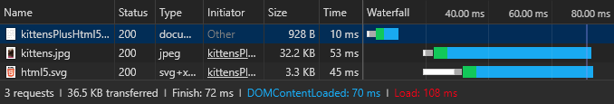

You can see that even though we need an extra file request, we're actually only using about half as many bytes.

Take a look at these three logos. They look identical, right? But if you check with the dev tools, you'll see that we've used three different file formats and there's a massive difference in file sizes.

[](../assets/images/full-size/ri7-31.png)
**Live Sample:** [Chrome log SVG v PNG v JPG](https://rawgit.com/james-priest/udacity-nanodegree-mws/master/exercises/ri-7-12/svgPngJpg.html)

The chrome SVG is about 50 times smaller than the PNG.

There are some good general rules for improving cross-platform image performance.

#### Use JPEG for photographic images
Browsers such as Chrome also support other formats, such as WebP, which can deliver better compression and features.

WebP supports alpha transparency, animation, along with lossy and lossless compression.

#### If you can, use SVG for vector images
We'll show you how to do that later. For vector art and solid color graphics, such as logo and line art, if you're unable to use SVG, use PNG.

And do use PNG rather than GIF; more colors, better compression, and no licensing issues.

[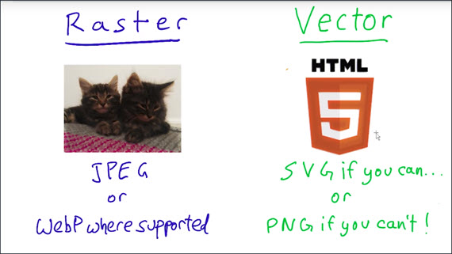](../assets/images/full-size/ri7-32.png)

For more information about image formats, take a look at theses links.

#### Links
- [Image Formats Overview](https://litmus.com/blog/png-gif-or-jpeg-which-ones-should-you-use-in-email)
- [Google Web Fundamentals - Image Optimization](https://developers.google.com/web/fundamentals/performance/optimizing-content-efficiency/image-optimization)
- [WebP Image Format Overview](https://developers.google.com/speed/webp/?csw=1)
- [CanIUse WebP](https://caniuse.com/#feat=webp)

#### Examples
- [Photo with logo as JPEG](https://rawgit.com/james-priest/udacity-nanodegree-mws/master/exercises/ri-7-12/kittensPlusHtml5Logo.html)
- [Photo as JPEG, logo overlaid as SVG](https://rawgit.com/james-priest/udacity-nanodegree-mws/master/exercises/ri-7-12/kittensPlusHtml5LogoSvg.htmlhttp://udacity.github.io/responsive-images/examples/1-15/kittensPlusHtml5LogoSvg)
- [Chrome log SVG v PNG v JPG](https://rawgit.com/james-priest/udacity-nanodegree-mws/master/exercises/ri-7-12/svgPngJpg.html)

### 7.13 Quiz: Spot the Differences
Use DevTools to inspect two images you see. What's different between them?

[Here's the site](http://udacity.github.io/responsive-images/examples/1-17/sameImage/index.html)

#### Solution
Looks like both are JPEGs but the file sizes are different.

[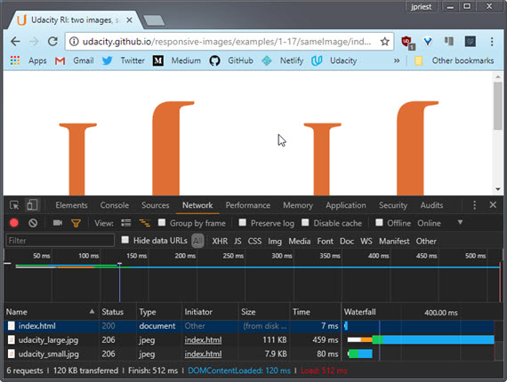](../assets/images/full-size/ri7-33.png)

Also, while the display size is the same, it looks like the natural size is different when I inspect the `` element.

[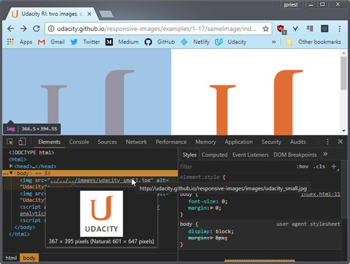](../assets/images/full-size/ri7-34.png)

- [ ] Compression Level
- [ ] Display Size
- [x] Actual (Natural) Size
- [ ] Type

### 7.14 Quiz: Spot More Differences
Use DevTools to inspect two images you see. What's different between them?

[Here's the site](http://udacity.github.io/responsive-images/examples/1-19/sameImage/index.html)

#### Solution
Looks like both are JPEGs but the file sizes are different.

[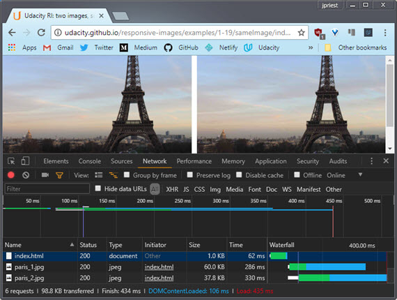](../assets/images/full-size/ri7-35.png)

When I check the dimensions, it looks like the natural size is the same for both images.

[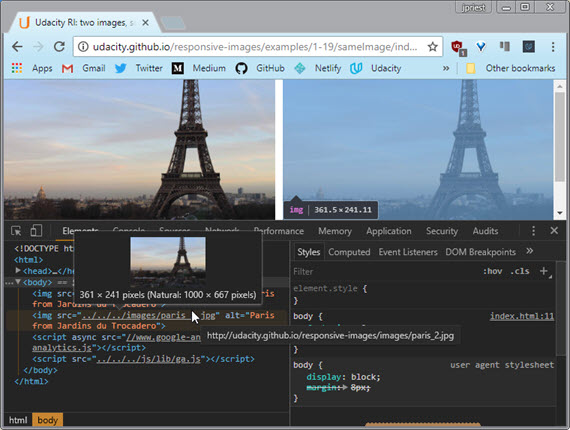](../assets/images/full-size/ri7-36.png)

This means that the compression must be different.

- [x] Compression Level
- [ ] Display Size
- [ ] Actual (Natural) Size
- [ ] Type

### 7.15 Image Compression
How can we check if all the images on a site have been optimized?

Remember that in order to serve the smallest possible image file on your site, you need to make sure you've run images through optimization tools.

Now, one great tool for checking this is [PageSpeed Insights](https://developers.google.com/speed/pagespeed/insights/?url=simpl.info%2Fcssfilters). Let's use that to check a page from our website.

[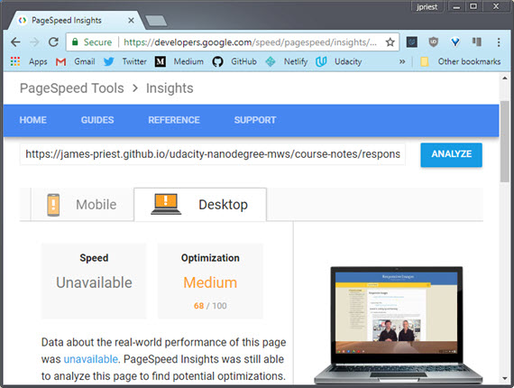](../assets/images/full-size/ri7-37.png)

PageSpeed Insights give us information on how best to optimize our page for speed. It will also provide links to optimization resources.

#### Links

- [PageSpeed Insights](https://developers.google.com/speed/pagespeed/insights/?url=simpl.info%2Fcssfilters)
- [PageSpeed Insights - Optimize Images instructions](https://developers.google.com/speed/docs/insights/OptimizeImages)
- [PageSpeed Insights Node module](https://github.com/addyosmani/psi/)
- [15 Practical cURL examples](http://www.thegeekstuff.com/2012/04/curl-examples/)

### 7.16 Project Part 1
It's time to get started on The **Responsive Blog Project**.  This is what the blog looks like right now and you should be asking yourself, ugh, what the heck is this ugly thing?

[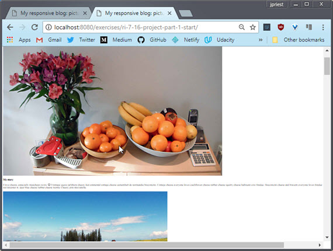](../assets/images/full-size/ri7-38.png)

The good news is that, by the end of the course, you'll be turning it into something that looks a lot nicer.

Now, responsive images can be as much of an art as it is a science. To start working on this project, which is really zoomed out here by the way, I'm going to give you a few changes.

Your goal is to make these images look reasonable. Right now, they're massive, both in their visual size on the page, and in terms of file size or number of bytes. The browser is zoomed out to 25% so you can get a sense of how really, really big they are.

#### Requirement 1
Back at 100%, it's pretty clear these images aren't fitting inside their containers. The images in the website need some kind of width applied to them so that they stay inside their container, which in this case is an `<article>`.

#### Requirement 2
Once you've done that, set a maximum width on the `<article>` element to give the blog a little bit better structure. I recommend starting with a width of something around 50em's. Remember an `em` refers to the font size. So a 50em element with font sizes of 16 pixels means that we are talking about a width of 800 pixels.

#### Requirement 3
By the way, notice how these images are coming from `images_src`, we'll come back to that in a second. Next up, check out the Volt image. Its natural width is almost 3300 pixels. That's just massive. What's the point of so many pixels when it's going to be displayed at about 800 pixels wide? Even on a 2x display, you only need 1600 pixels across.

These images need to be a lot smaller. I want you to use the tools and techniques that you've been learning to reduce the resolutions and compress the images. See how low you can get the resolution and how much compression you can use while still keeping the images really crisp.

To do so, you have **Grunt**, **Image Magick**, and **Image Optim** on your side. You don't have use these, but it will make you life a lot easier if you do, especially Grunt.

If you've got Grunt up and running, you should be able to use the *Gruntfile* in the project directory after you run the command in the instructor notes. The command will make sure the `grunt-responsive-images` package is installed. Notice that Grunt is going to run against images in the `images_src/` directory and put them in the `images/` directory.

Right now in the html all the images are referenced in the `images_src/` directory but once you've optimized them, make sure you change their directory to `images/`. There are links to lots of documentation in the instructor notes if you need help.

Also, the page is coming in around 3.25 megabytes, which will take forever to load on mobile. Seriously, try loading this site using the network throttling options set to low. You may want to grab a cup of coffee while you wait.

You can probably reasonably drop the total bytes from the images below to 1.5 megabytes or even further.

#### Requirement 4
In terms of optional changes, the images are looking pretty stark. They need some captions.

In this solution, you'll see me add some captions using the semantic `<figure>` tag, but you can use whatever technique you'd like. See [MDN documentation on figure](https://developer.mozilla.org/en-US/docs/Web/HTML/Element/figure).

### --- Summary of Requirements
1. Make the ``s fit within their containers
2. Make the containers a reasonable width (recommend 50em)
3. Resize & compress images such that they remain sharp but the size of the page drops below 1.5MB. Use automation tools
4. Optional: add captions
5. Don't forget to test on different devices and network settings

### --- Instructor Notes

- Download the project files [here](http://udacity.github.io/responsive-images/downloads/RI-Project-Part-1-Start.zip).
- Make sure to run the project through localhost
- Make sure to run [Udacity Feedback Chrome Extension](https://chrome.google.com/webstore/detail/udacity-front-end-feedbac/melpgahbngpgnbhhccnopmlmpbmdaeoi) to get feedback
- Open the console to see the total size of all the images
- [Learn more about the `<figure>` tag](https://developer.mozilla.org/en-US/docs/Web/HTML/Element/figure)

### --- Build Process
Before automating your build process with tools like **ImageMagick** or **ImageOptim**, you'll first need to [install Node.js](https://nodejs.org/en/download/).

[Node.js](https://nodejs.org/en) is a JavaScript runtime built on [Chrome's V8 JavaScript engine](https://developers.google.com/v8/).

It also comes with a package manager, [npm](https://www.npmjs.com/), that gives you access to thousands of code packages, like Grunt, that you can use in your projects.

**Make sure  to** [install Node.js and update npm](https://docs.npmjs.com/getting-started/installing-node). Then, use the links below to finish setting up your build process.

### --- ImageMagick

#### Resource Links
- [ImageMagick](http://www.imagemagick.org/)
- [Simple ImageMagick installer for Mac](http://cactuslab.com/imagemagick/)
- [GraphicsMagick](http://www.graphicsmagick.org/) (a fork of ImageMagick)

### --- Grunt

#### General Info
- [Getting started with Grunt](http://gruntjs.com/getting-started)
- [Grunt for People Who Think Things Like Grunt are Weird and Hard](http://24ways.org/2013/grunt-is-not-weird-and-hard/)
- [Generate multi-resolution images with Grunt](http://addyosmani.com/blog/generate-multi-resolution-images-for-srcset-with-grunt/)
- [Grunt plugin for generating multiple images](https://github.com/andismith/grunt-responsive-images)

#### Scripting Examples
- [convert.sh](http://udacity.github.io/responsive-images/convert.sh) (includes instructions)
- [Gruntfile.js](http://udacity.github.io/responsive-images/Gruntfile.js) (remove line 7, `engine: 'im'`, on Windows)
- [Imager.js](https://github.com/BBC-News/Imager.js/) - responsive image loading developed for BBC News

### --- GUI Image Tools

#### Resource Links for Image Processing tools
- [ImageOptim](http://imageoptim.com/) (Mac only)
- [Trimage](http://trimage.org/) - Similar to ImageOptim (Windows, Mac, Linux)
- [ImageAlpha](https://github.com/pornel/ImageAlpha)

### 7.16 Project Solution
First I want my images to fit so I set the `max-width` on the `` tag to 100%. Now the images are actually fitting inside the view port. You can see the whole thing instead of some massive, stretched out monster.

Then I set the width on the `<article>` tag to `50em`. This immediately changed the content to fit the viewport width.

The blog's starting to look a lot more reasonable but the browser is still downloading images that are way too large. I need some smaller images. I could use a tool like to individually resize and compress each image, but that really isn't scalable.

So, I used this grunt task to create new images that were scaled and compressed.

[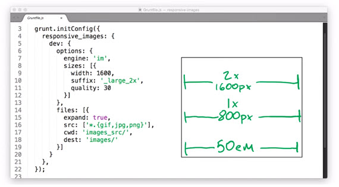](../assets/images/full-size/ri7-39.png)

I set a width of 1600 pixels for 2x displays. At a width of 50em on a 1x display an image is going to be 800 pixels across.  on a 2x display, it's going to be 1600 pixels so, I went with the large one.

I thought 30% still looked good while keeping the bites to a minimum. Additionally I'm appending 'large_2x' to the end of each file for reasons that will make sense later in the course.

With all that done all I have to do is change the image sources to 'images/whatever-600_large_2x' and bam. My page just got a lot smaller. After the changes, my page is down to 1.3 megabytes, which I'm feeling really good about.

[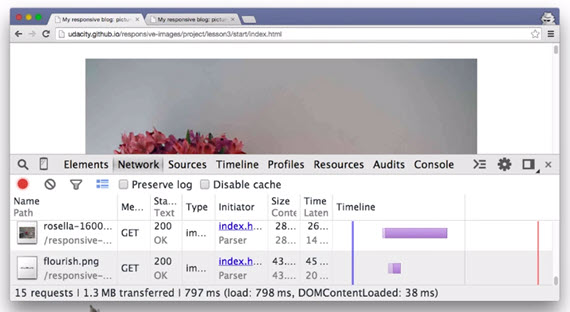](../assets/images/full-size/ri7-41.png)

Lastly, I used the `<figure>` tag, because it includes the awesome `<figcaption>` tag. Simply fill in the caption in figcaption, and it shows up on the page.

[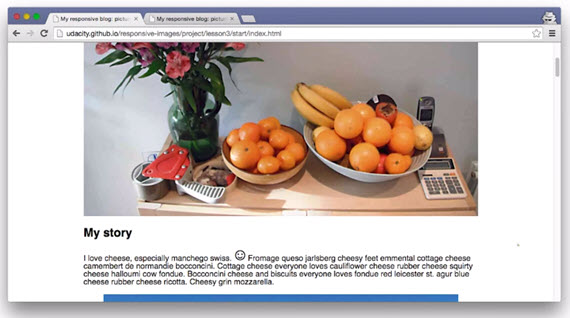](../assets/images/full-size/ri7-44.png)

So the blog is looking a lot better overall, but it's still not perfect. At the end of the next lesson, you'll have another chance to improve the blog.

### --- My Build Environment
#### Steps to create a build system on Windows 10
I'm running Windows 10 April 2018 Update (version 1803) with Windows Subsystem for Linux (WSL) enabled.

#### Enable WSL on Windows 10 & install Ubuntu 16.04
WSL is running an instance of Ubuntu 16.04 which I installed from the Microsoft Store. See [How to Install and Use the Linux Bash Shell on Windows 10](https://www.howtogeek.com/249966/how-to-install-and-use-the-linux-bash-shell-on-windows-10/)

#### Update & upgrade Ubuntu packages
I then updated my Ubuntu software resources and upgraded all outdated packages. This makes sure you're using the latest software resource lists and that all existing packages are up to date.

```bash
sudo apt update
apt list --upgradable
sudo apt upgrade
```

#### Configure Visual Studio Code to use Ubuntu Bash shell
I've also updated Visual Studio Code to use my Ubuntu Bash shell by adding this line in VS Code Settings:

```json
"terminal.integrated.shell.windows": "C:\\Windows\\System32\\bash.exe"
```

#### Install latest Node.js
Then I installed the latest version Node.js. If you simply run `apt install nodejs` you'll get an older version (4.2.1) of node & npm which won't work properly.

I went to the Node.js site and followed the  [Download & install Debian & Ubuntu based Linux distributions](https://nodejs.org/en/download/package-manager/#debian-and-ubuntu-based-linux-distributions) instructions which had me do the following.

```bash
curl -sL https://deb.nodesource.com/setup_8.x | sudo -E bash -
sudo apt-get install -y nodejs
```

#### Update to latest npm
I then updated npm following instructions on the npm site: [Update npm](https://docs.npmjs.com/getting-started/installing-node#3-update-npm). Those had me do the following to update npm globally to the latest version.

```bash
npm -v
sudo npm install npm@latest -g
```

#### Install Grunt task runner
Next I installed Grunt; which is to say, I installed the `grunt-cli` npm package globally so it can be accessed from any directory. Instructions here [Grunt - Getting started](https://gruntjs.com/getting-started).

```bash
sudo npm install -g grunt-cli
```

#### Install GraphicsMagick & ImageMagick
Next I installed [GraphicsMagick](http://www.graphicsmagick.org/) (which is a fork of [ImageMagick](http://www.imagemagick.org/script/index.php)) since it purports to be faster and more efficient than ImageMagick. I also installed ImageMagick for comparison.

GraphicsMagick (or ImageMagick) is responsible for processing images. Grunt (a task runner) automates the conversion so you can batch process entire directories of images.

Here are the installation commands.

```bash
apt list graphicsmagick
sudo apt install graphicsmagick

apt list imagemagick
sudo apt install imagemagick
```

#### Install project's npm packages
Next I installed the npm packages that were defined in the `package.json` file.

```json
{
  "name": "responsive-images",
  "version": "0.1.0",
  "repository": {
    "type": "git",
    "url": "https://github.com/udacity/responsive-images.git"
  },
  "devDependencies": {
    "grunt": "~0.4.5",
    "grunt-contrib-clean": "~0.6.0",
    "grunt-contrib-copy": "~0.8.0",
    "grunt-contrib-jshint": "~0.10.0",
    "grunt-contrib-nodeunit": "~0.4.1",
    "grunt-contrib-uglify": "~0.5.0",
    "grunt-mkdir": "~0.1.2",
  },
  "dependencies": {
    "grunt-responsive-images": "^0.1.6"
  }
}
```

This was done by running the following command at the project root.

```bash
npm install
```

This created a `node_modules` folder with all dependencies and dev_dependency packages.

#### Install additional npm package
The next step was to install an npm package that serves to complement the existing `grunt-responsive-images` package.

`grunt-responsive-images` is responsible for compressing and creating multi-sized versions of a set of images for use with the new html5 responsive image attributes. These are the `srcset` and `sizes` attributes of the `` element.

The `grunt-responsive-images-extender` package will analyze a set of images referenced in HTML and turn the existing HTML code from this

```html

```

into this.

```html

```

The image sizes and breakpoints are set in the Gruntfile and are written out to the html.

To install this package I issued the following command

```bash
npm install grunt-responsive-images-extender --save-dev
```

#### Gruntfile configuration
Next `Gruntfile.js` had to be configured. This is the file that Grunt uses to define tasks and set options related to those tasks.

Here is a sample Gruntfile that specifies two image sizes, along with width, defined as a percentage of the original, and compression quality.

```js
responsive_images: {
  dev: {
    options: {
      engine: 'gm',
      sizes: [{
        name: 'small',
        width: '30%',
        quality: 20
      }, {
        name: 'large',
        width: '50%',
        quality: 40
      }]
    },
    files: [{
      expand: true,
      cwd: 'src/',
      src: ['images/*.{gif,jpg,png}'],
      dest: 'build/'
    }]
  }
},
```

I updated the Gruntfile to specify four image sizes for the `grunt-responsive-images` package to create.

```js
responsive_images: {
  dev: {
    options: {
      engine: 'gm',
      sizes: [{
        width: 400,
        quality: 50
      }, {
        width: 600,
        quality: 60
      }, {
        width: 900,
        quality: 40,
        rename: false
      }, {
        width: 1600,
        quality: 30,
        suffix: '_2x'
      }]
    },
    files: [{
      expand: true,
      cwd: 'src/',
      src: ['images/*.{gif,jpg,png}'],
      dest: 'build/'
    }]
  }
},
```

This takes a source file like this

```bash
file1.jpg           (3264x2448)   486KB
```

and creates the following.

```bash
file1-400.jpg       (400x300)     23 KB
file1-600.jpg       (600x450)     53 KB
file1.jpg           (900x675)     79 KB
file1-1600_2x.jpg   (1600x1200)   165 KB
```

I then added the `responsive_images_extender` configuration which defines the selector to target for each `` element. It also defines a suggested media size that the browser should use based on a set of media queries.

```js
responsive_images_extender: {
  dev: {
    options: {
      ignore: ['.fixed'],
      sizes: [{
        selector: 'figure>img',
        sizeList: [{
          cond: 'max-width: 560px',
          size: '400px'
        }, {
          cond: 'max-width: 760px',
          size: '600px'
        }, {
          cond: 'min-width: 761px',
          size: '900px'
        }]
      }]
    },
    files: [{
      src: ['build/index.html'],
      dest: 'build/index.html'
    }]
  }
},
```

The original html started as this

```html

```

and produced the following HTML markup.

```html

```

#### Run Grunt
The next step was to execute Grunt with the following amazingly simple terminal command.

```js
grunt
```

This kicked off the build process which uses the Gruntfile to determine what tasks to run and how to run them. This shows the output below.

[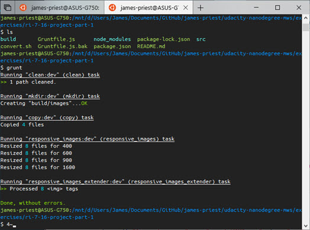](../assets/images/full-size/ri7-40.png)

Now when I look at my updated site, I can see that all four images sizes are referenced in the markup.

[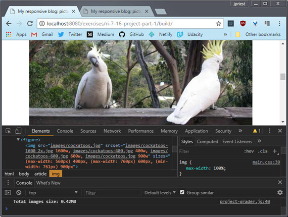](../assets/images/full-size/ri7-42.png)

I can also see which image was served by hovering over the image element. In this case it was 'cockatoos-600.jpg' which was chosen based on `` attribute settings and viewport size.

[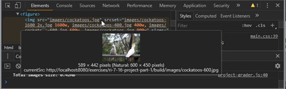](../assets/images/full-size/ri7-43.png)

Lastly, the total size of the images served has dropped from a bloated **3.25MB** in the non-optimized version to a snappy and responsive **0.42MB** in the optimized version.

### --- Resources & Links
In addition to course material, I used the following resources to fully grasp the new set of **responsive image technologies** built into HTML5.

These include **resolution switching** through use of the HTML5 `srcset` and `sizes` attributes and **art direction** through use of the `<picture>` element.

- **Resolution switching** - involves serving the same image but at a different size or resolution based on viewport and pixel density of the screen
- **Art direction** - involves serving different images according to space allocations

**Resolution switching** can vary the image size, image density, or both. In other words, a change to resolution and/or dimensions (width and height).

I also needed to understand proper **use of breakpoints** across groups of devices in order to properly set size and density ranges for each image.

I then learned to use **Grunt (a task runner)** to automate the task of making multiple copies of an image at different resolutions and sizes.

Lastly, I configured Grunt to **automate changes to HTML** to properly provide *resolution switching* and serve the appropriate image based on the viewport & pixel density of the target device.

These are the resources I used to accomplish this.

- Using Responsive Image Techniques (what they are and how they work)
  - [MDN Responsive Images - MDN](https://developer.mozilla.org/en-US/docs/Learn/HTML/Multimedia_and_embedding/Responsive_images)
  - [Native Responsive Images - Dev.Opera](https://dev.opera.com/articles/native-responsive-images/)
  - [The anatomy of responsive images - Jake Archibald](https://jakearchibald.com/2015/anatomy-of-responsive-images/)
- Responsive breakpoints (how to make an informed decision)
  - [The 100% correct way to do CSS breakpoints - freeCodeCamp Medium](https://medium.freecodecamp.org/the-100-correct-way-to-do-css-breakpoints-88d6a5ba1862)<br>
    I used the breakpoints defined in this article to determine target sizes for groups of responsive images rather than using those breakpoints for responsive layout. I base my responsive layout breakpoints on the content and how that content flows.<br>
    The target sizes I settled on were (400px, 600px, 900px, and 1600px)
- Grunt (what it is and how to set it up)
  - [Grunt Homepage](https://gruntjs.com/)
  - [Getting Started](https://gruntjs.com/getting-started)
  - [Configuring Tasks](https://gruntjs.com/configuring-tasks)
  - [Plugins](https://gruntjs.com/plugins)
- Image processing with Grunt (How-to articles)
  - [Tools for image optimization - Addy Osmani](https://addyosmani.com/blog/image-optimization-tools/)
  - [Generate Multi-resolution images for srcset with Grunt - Addy Osmani](https://addyosmani.com/blog/generate-multi-resolution-images-for-srcset-with-grunt/)
- Essential Grunt packages (what's required to set up this automation)
  - [grunt-responsive-images](https://www.npmjs.com/package/grunt-responsive-images) - npm
  - [grunt-responsive-images](https://github.com/andismith/grunt-responsive-images) - GitHub
  - [grunt-responsive-images-extender](https://www.npmjs.com/package/grunt-responsive-images-extender) - npm
  - [grunt-responsive-images-extender (test html)](https://github.com/stephanmax/grunt-responsive-images-extender/blob/master/test/fixtures/testing.html) - GitHub
  - [grunt-responsive-images-extender (Gruntfile.js)](https://github.com/stephanmax/grunt-responsive-images-extender/blob/master/Gruntfile.js) - GitHub

### 7.17 Lesson Summary
Congratulations, you're on your way to a workflow that allows you to easily create websites with high quality images with as few bites as possible.

In the next lesson, you'll actually approach responsive images using techniques that will allow you to avoid using images at all.

You might be surprised by the number of options available for situations where images no longer seem necessary. You'll explore some image alternatives using simple mark-up techniques.

## Lesson 8. Images with Markup
### 8.1 Performance
The reality of mobile networking means that the number of file requests can be just as significant as the size of requests.

In other words, aim to **reduce the number of image requests**, not just the size of image files.

We call this problem **latency**, which is the delay between request and response.

Every time your browser attempts to retrieve an image from a website there are potential delays at every step of the way between your device and the website's servers and every one of those delays can vary significantly and unpredictably.

Behind all that is the fundamental problem that data can't travel any faster than the speed of light. In fact, optical fiber can only achieve a bit better than half the speed of light. So, at best, London to California, return trip times for example, are around a hundred milliseconds.

Performance expert, Ilya Grigorik, calls latency the new bottleneck. Indeed, it turns out that for many modern web pages, bandwidth doesn't matter as much as latency does. If you find that surprising, check out the graph below.

Notice how reducing latency continues to improve page load times, whereas for bandwidth the graph flattens out:

[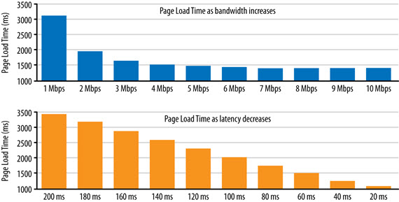](../assets/images/full-size/ri8-1.png)

The bottom line is that performance is a fundamental part of a truly responsive design. In practice, that means you need to reduce the file sizes and reduce the number of file requests.

One great way to reduce the number of image bytes is to compress them or reduce the number of images. In this lesson, we show you lots of ways to achieve graphical effects without image files.

#### Notes
To reduce the number of image downloads, you can also use [CSS image sprites](https://developer.mozilla.org/en-US/docs/Web/Guide/CSS/CSS_Image_Sprites) (or [responsive sprites](http://blog.brianjohnsondesign.com/responsive-background-image-sprites-css-tutorial/)). A sprite sheet image combines lots of images, which can be displayed individually by setting the sprite sheet as the background to an element, then adjusting background position with CSS. This technique can be particularly useful for icons and other repeated graphics.

Whatever techniques you use to avoid latency, be aware of the changes that are coming with HTTP/2.

In a nutshell, HTTP/2 will mean that requesting multiple files will be less costly: prepare to stop using spriting, concatenating and other HTTP/1 hacks!

To find out more, check out [HTTP2 for front-end web devs](https://mattwilcox.net/web-development/http2-for-front-end-web-developers).

### 8.2 Text Problems
In the old days, it was commonplace to save text as a graphic. As you can see here, that doesn't scale well visually and adds to the page weight and latency.

[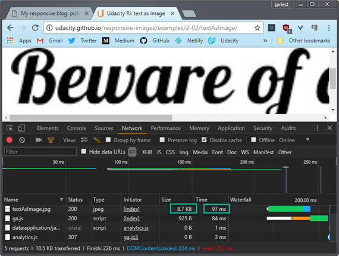](../assets/images/full-size/ri8-2.png)

Text as graphic can also cause conflicts with format choice. Now in theory you might want to save text in a PNG format because text has solid color and hard edges but in this example we've saved as a JPEG because we're using text over a photo.

[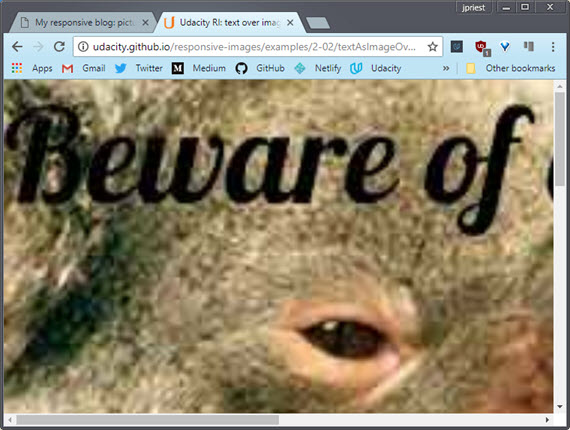](../assets/images/full-size/ri8-3.png)

Scale that up, and you start to see artifacts. Using text as a graphic also means the text can't be found by search engines, and isn't accessible by screen readers and other assistive technologies.

If the page is viewed in the text only browser Lynx, all you can see is the alt text on the image. And you can't copy text as graphic either.

If you do need to incorporate text in graphics, overlay real text over the top.

[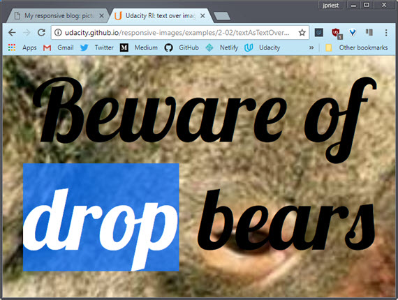](../assets/images/full-size/ri8-4.png)

Both the photo and the text display and scale much better. You can select the text and it's really easy to add effects with CSS. I'm using the Lovely Lobster font, which is one of the many free web fonts available.

File size is smaller too because we can save the photo as a nice small JPEG for the photo, rather than having to use PNG to cope with text.

On the subject of text and images, one way to ensure your site is really responsive is not to have any images at all. Maybe some of the pages on your website don't need images.

Many sites use beautiful topography, CSS effects, and great layout to achieve really striking graphical effects with responsive layouts and strikingly fast load times. Likewise, for sites which use images really sparingly.

When you're designing a responsive site, every time you add a placeholder for an image, think about whether you really need it. Sometimes the best image is no image at all.

In the past, typography on the web was extremely limited by the number and quality of fonts available. With web fonts and modern CSS implementations, that's all changed. Web fonts and CSS enable beautiful typography on the web without having to resort to using text as graphics.

#### Links

- [Text as image](http://udacity.github.io/responsive-images/examples/2-02/textAsImage)
- [Text as image over photo](http://udacity.github.io/responsive-images/examples/2-02/textAsImageOverPhoto)
- [Text using Web Font](http://udacity.github.io/responsive-images/examples/2-02/textAsText)
- [Text as text, over photo](http://udacity.github.io/responsive-images/examples/2-02/textAsTextOverPhoto)

### 8.3 CSS Techniques
As well as adjusting type attributes, CSS can also be used for other graphical effects, in particular using CSS foreshadows is supported by all modern browsers and much better than using image hacks.

Likewise for rounded corners, gradient, and animations. Do be aware, however, that there is a processing and rendering cost to using CSS shadows, rounded corners, and so on. This is especially significant on mobile.

[](../assets/images/full-size/ri8-5.png)

So, if you really want these effects, use CSS, but use them sparingly.

#### Links

- [CSS effects](http://udacity.github.io/responsive-images/examples/2-04/divWithCssEffects)
- [How CSS affects load time](http://smashingmagazine.com/2013/04/03/build-fast-loading-mobile-website)

### 8.4 CSS background images
CSS also supports background images and this feature can be used to achieve a number of responsive effects.

[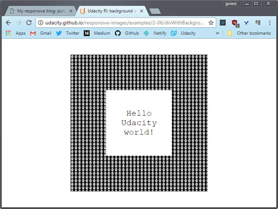](../assets/images/full-size/ri8-6.png)

You can use CSS to add a background pattern to an element or the page itself. And you can combine that with gradients and other CSS effects.

[](../assets/images/full-size/ri8-7.png)

It's possible to get some incredible effects with pure CSS. Check out the examples on the website links below.

[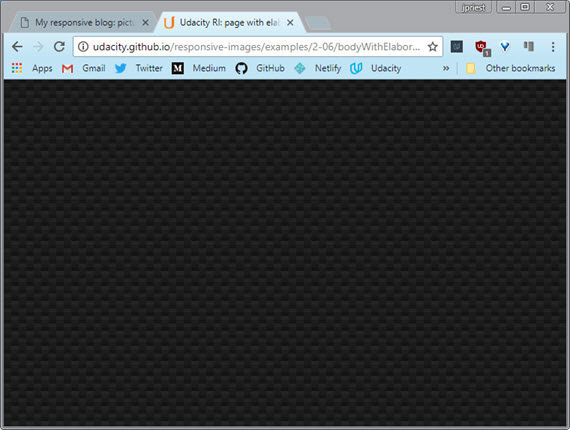](../assets/images/full-size/ri8-8.png)

With the `background-size: cover` property, CSS can also be used to add a background image that resizes without squashing or stretching. And again, this can be really handy for using images when you don't know the size of the viewport.

[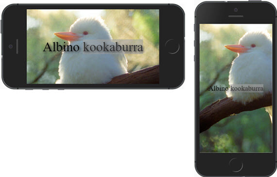](../assets/images/full-size/ri8-9.png)

The details in a photo can get lost when it's shrunk, so this example displays the whole image if the viewport is more than 500 pixels wide, or a smaller crop otherwise.

[](../assets/images/full-size/ri8-10.png)

I've added a CSS transition, so there's not too much of a jolt if you resize the window.

You'll see that in the DevTools, the smaller koala crop is displayed when the window is small. Then, if you resize the window larger, the larger crop is downloaded and displayed.

CSS background images can be used for conditional display of images depending on the viewport size, using CSS like this. In this case, the background image file is not downloaded if the viewport width is less than 500 pixels.

[](../assets/images/full-size/ri8-11.png)

Now, you'll find out more about media queries later and a much less hacky and more efficient way to accomplish alternative image loading when we look at the `srcset` attribute and the `<picture>` element in the next lesson.

With background images, you can also use the CSS `image-set()` function to choose a background image depending on screen resolution. This example displays a 2x color image on a high resolution display, like my phone, and a 1x monochrome image, otherwise.

[](../assets/images/full-size/ri8-12.png)

For the devices that don't support `image-set()`, the CSS falls back to the 1x version. If you check the DevTools, you'll see that only the appropriate image is downloaded.

[](../assets/images/full-size/ri8-13.png)

You'll learn a lot more about responding to screen resolution in the next lesson.

#### Links

- [Div with background image](http://udacity.github.io/responsive-images/examples/2-06/divWithBackgroundImage)
- [CSS background-size: cover](http://udacity.github.io/responsive-images/examples/2-06/backgroundSizeCover)
- [Body with background image](http://udacity.github.io/responsive-images/examples/2-06/bodyWithBackgroundImage)
- [Body with background image and gradient](http://udacity.github.io/responsive-images/examples/2-06/bodyWithBackgroundImageAndGradient)
- [Body with elaborate background using only CSS](http://udacity.github.io/responsive-images/examples/2-06/bodyWithElaboratePatternPureCSS)
- [Using CSS background images for conditional image display](http://udacity.github.io/responsive-images/examples/2-06/backgroundImageConditional)
- [Using CSS background images for alternative images](http://udacity.github.io/responsive-images/examples/2-06/backgroundImageAlternative)
- [image-set()](http://udacity.github.io/responsive-images/examples/2-06/imageSet)

### 8.5 Quiz: CSS background image techniques
#### Trying out background-size
There are two descriptions below. Which one describes `background-size: cover`? Which on describes `background-size: contain`?

"The image is sized so that it is as small as possible while still completely filling its container." (Meaning it is zoomed in as much as possible)

- [ ] contain
- [x] cover

"The image is sized so that it is as large as possible while still being completely visible inside its container." (Meaning zoomed out so that the whole image is visible)

- [x] contain
- [ ] cover

#### cover
[](../assets/images/full-size/ri8-14.png)

#### contain
[](../assets/images/full-size/ri8-15.png)

### 8.6 Symbol characters
Here's another way to avoid image files and to keep your site responsive.

If you need to use a graphical symbol like an arrow, a star or a heart, check whether it's available as a character in a font. You might be surprised what's available.

[](../assets/images/full-size/ri8-17.png)

When symbols and icons are achieved using fonts, they have all the responsive advantages of text. They're infinitely scalable, amenable to texts CSS effects, and don't incur extra download.

The graphics on this page are built without image files.

[](../assets/images/full-size/ri8-16.png)

The body has a CSS gradient and the star is just a text character with a CSS shadow applied. All responsively sized.

The Unicode standard defines the universal character set. Over 100,000 characters have been defined so far. Some fonts support many thousands of these. Get to know your glyphs.

#### Links

- Example: [Unicode instead of an image](http://udacity.github.io/responsive-images/examples/2-08/unicodeStar/)
- [Unicode character sets](http://unicode-table.com/en/sets/)
- [List of Unicode characters](http://en.wikipedia.org/wiki/List_of_Unicode_characters)

### 8.7 Quiz: unicode Treble Clef
Unicode characters are just plain awesome. As you just learned, there are more than 110,000 characters. That is insane. In a moment, I want you to explore some of them, because, well, they can certainly come in handy.

[](../assets/images/full-size/ri8-18.png)

Why would you ever force the browser to download an image when there's already a Unicode character that you can get for free? To explore them yourself, I recommend checking out the drop-down menu which gives you the chance to look through all of the different categories.

You can find things like emoticons. Holy cow, look at all those cute little emoticons that you get for free, which you can use on any website.

It's worth pointing out that in order to use Unicode characters, you need to make sure that you set your character set to utf-8 inside your meta tag.

See the instructor notes for more details on this.

For this quiz, I want you to pretend that you are making a music website. Check out the link to the [Unicode character set](http://unicode-table.com/).  Look through it and see if you can find the symbol for the treble clef. Once you've found it, try it out for yourself and see if it works. Once you're done, paste the HTML code here to continue

𝄞
𝄢

#### Links

- [More on meta tag charsets](https://developer.mozilla.org/en-US/docs/Web/HTML/Element/meta)
- [Site to determine what characters your browser can render](http://www.alanwood.net/unicode/#links)

#### Solution
To find the treble clef, I started by going to the musical symbols section. Looking through all the characters,it looks like there is a treble clef right there.

[](../assets/images/full-size/ri8-19.png)

There's its HTML-code for easy copy and pasting. I'm testing out the treble clef by pasting its HTML code here and then observing what happens on the site over here, and notice there's the treble clef. So, clearly this HTML code is working.

This looks good but I wonder what would happen if I just simply pasted the treble clef itself into the html? Remember it's just a normal character. So I will copy it and I will paste it right here. Now look, I've got the treble cleft over here in the the HTML and I've got the treble clef in the site.

This is nice because these two match. In fact, it's actually recommended to copy and paste the actual Unicode character into your HTML. It's easier to read and maintain. So, the correct answer is, ampersand pound sign and then the number that you see here. That's the HTML code for treble clef.

### 8.8 Icon Fonts
Do you remember Wingdings? That weird font that was oddly popular in the 90's? Have you ever wondered why a font like that would even exist?

Well, as it turns out, it's possible to build a font family made of images and icons rather than letters. Now, icon fonts provide a fantastic option for the little images and icons that often decorate websites.

There's an icon font I like called Zocial. Now, this font is free and open source, so I could download it and serve it from my site. However, the font is publicly available from the font site itself so, I'll use that instead.

[](../assets/images/full-size/ri8-20.png)

Let's see it in action.

Notice that I've added some shadow to the font icons. This file looks a bit complex so, bear with me.

[](../assets/images/full-size/ri8-21.png)

Here's what's going on. The icon font characters are added using the CSS before selector. I've added some formatting to that as well including CSS text shadow.

```html
<!DOCTYPE html>
<html>
<head>
  <meta name="viewport" content="width=device-width, initial-scale=1.0,
    minimum-scale=1.0">
  <title>Udacity RI: icon font</title>
  <style>
    @import url(http://weloveiconfonts.com/api/?family=zocial);

    [class*="zocial-"]:before {
      display: inline-block;
      font-family: 'zocial', sans-serif;
      text-shadow: 3px 3px 3px #aaa;
      width: 20vw;
    }

    body {
      font-family: 'Roboto Condensed';
      margin: 20vh 0;
    }

    li {
      font-size: 10vw;
      list-style: none;
      margin: 3vw 0;
      padding-left: 100px;
    }
  </style>
</head>

<body>
  <ul>
    <li class="zocial-twitter">Twitter</li>
    <li class="zocial-flickr">Flickr</li>
    <li class="zocial-lastfm">Last.fm</li>
    <li class="zocial-reddit">Reddit</li>
  </ul>
</body>
</html>

```

Now that rule is applied to every element whose class name begins with `zocial-`. You can see that each of the list items has a class with a name made up of 'zocial' and a brand name.

Now, at the top, you'll see an `@import url(...)`, that points to an external CSS file. Let's look at that now.

[](../assets/images/full-size/ri8-22.png)

The `@font-face` url, at the top of this gives the source of the actual font files and there's some variations available there. What you see below that are selectors based on class names like the ones we've used, `.zocial-flickr`, `.zocial-laughter` and so on.

For example, set the class `.zocial-flickr` on an element and the character 'F' will be displayed before it. Which in the zocial font is the flickr logo. Clever, huh?

```css
.zocial-android:before{content:"&"}
.zocial-flickr:before{content:"F"}
.zocial-twitter:before{content:"T"}
```

Icon fonts have a number of advantages, over plain old images. They're vector graphics that can be infinitely scaled and an entire set of images can be downloaded in one font.

This makes them a great potential solution for responsive designs where you require minimum downloads and maximum scalability. Now, if you look at the resources required for the WeLoveIconFonts.com site, you can see that the total wait for that hundred of images from all the fonts on the page is less than 300k.

[](../assets/images/full-size/ri8-23.png)

Icon fonts have a number of advantages over plain old images.

- They're vector graphics that can be infinitely scaled
- An entire set of images can be downloaded in one font.

This makes them a great potential solution for responsive designs where you require minimum downloads and maximum scalability.

[](../assets/images/full-size/ri8-24.png)

The example here shows lots of different options for icon fonts. Of course, the characters in icon fonts behave just like letters in other fonts.

So you can resize and color them and use other CSS effects, just like you would with text. There are lots of tools for creating icon fonts and lots of pre-built icon fonts. Check out the links below. There's also a link to information about improving accessibility by using Aria attributes.

#### Links

- [Zocial](http://zocial.smcllns.com/)
- [Font Awesome](http://fortawesome.github.io/Font-Awesome/)
- [We Love Icon Fonts!](http://weloveiconfonts.com/)
- [Icon fonts on CSS-Tricks](https://css-tricks.com/examples/IconFont/)
- [ARIA](https://developer.mozilla.org/en-US/docs/Web/Accessibility/ARIA)

### 8.9 Inlining SVG and data URIs
Talking about text, if you really want to reduce the number of file requests your page makes, you can inline images using code.

There are two ways to do that, **SVG** and **DataURIs**.

Now here's a vector graphic you may have seen before. Both versions look identical.

[](../assets/images/full-size/ri8-25.png)

Looking at the page source, you'll see that the logos are declared inline. There's an SVG and an image element with a data URI source. Inline SVG has great support on mobile and desktop browsers, and optimization tools can significantly reduce SVG size.

Can u spot any difference?

[](../assets/images/full-size/ri8-26.png)

These two inline SVG logos look identical, but one is around 3 kilobytes and the other only about 2k because its been optimized.

SVG is incredibly powerful. Check out this interactive version of Trajan's Column. It works on mobile too. The best thing, is you get all that responsive interactivity for less that 160 kilobytes.

[](../assets/images/full-size/ri8-27.png)

For more amazing SVG examples, check out the links below.

Data URIs provide a way to include a file such as an image inline as a base64 encoded string using the following format.

```html

```

The full image is around 5,000 characters!

Just like SVG, Data URIs are well supported on mobile and desktop browsers. That's nearly 97% of browsers.

So you can inline images in your HTML, but Data URIs and SVGs can also be inlined in CSS.

```css
div#data_uri {
  background: url(data:image/svg+xml, ...)
}
```

It works on desktop and on mobile. we have two identical looking images implemented as background images in CSS, one data URI and one SVG. Now the code looks a bit crazy so why would you want to do this? To reduce HTTP requests.

#### Links

Examples:
- [SVG Data URI in HTML](http://udacity.github.io/responsive-images/examples/2-11/svgDataUri)
- [SVG Data URI in CSS](http://udacity.github.io/responsive-images/examples/2-11/svgDataUriCss)
- [SVG text on a path](http://udacity.github.io/responsive-images/examples/2-11/svgTextOnAPath)
- [SVG optimized and unoptimized](http://udacity.github.io/responsive-images/examples/2-11/svgUnoptimisedAndOptimised)

Resources:
- [Browser support for inline SVG](http://caniuse.com/#feat=svg-html5)
- [Browser support for Data URIs](http://caniuse.com/datauri)
- [SVG Optimiser](http://petercollingridge.appspot.com/svg-optimiser)
- [Trajan's Column SVG example](http://upload.wikimedia.org/wikipedia/commons/6/6c/Trajans-Column-lower-animated.svg)
- [20 examples of SVG that will make your jaw drop](http://www.creativebloq.com/design/examples-svg-7112785)
- [SVG animation examples](http://codepen.io/chrisgannon/)

### 8.10 Quiz: Strategy Quiz 1
At these point you've learned about a few different techniques for handling images on the web.

The first set of choices involves deciding between **linking** and **inlining**. For instance you can

1. **link** to files external to the html:<br>
  ``
2. **inline** the images and put all the data you need for an image right on the page:<br>
  ``

The other choices come down to

1. **raster** (which are bitmap-based images) defined as jpg  gif, or png
2. **vector** (scalable, path-based images) defined with SVG

Then of course you can skip images altogether and use font icons like Font Awesome and then use CSS techniques for styling.

Font icons are really another type of vector image that's accessed by loading a font set and accessing a mapped character (usually through css).

The other way of displaying a symbol is by accessing the unicode characters directly and styling as required. This used to be done by specifying the HTML character code but is now done simply by directly pasting the character into the HTML.

In the end all these techniques lead to the same result on the page. The right strategy really depends on the image's place in your app as a whole.

[](../assets/images/full-size/ri8-28.png)

#### Image Options Scenario #1
A star icon (★) needs to *reused* and *scaled* on mobile devices.

Should you use a vector graphic or a raster graphic?
- [x] vector
- [ ] raster

Should you inline the star icon or should you set its src to an external file?
- [x] inline
- [x] external

#### Solution
In this case, the star is a pretty simple and regular shape. So, it's safe to say a vector graphic is the way to go, especially if you want to scale it with your app.

As far as inline or setting its source to an external file can actually argue for either.

For inline, it's safe to say a star is a pretty simple shape. You could pretty easily create it with an SVG file and just simply inline that without adding too many bytes.

If you're reusing an image, it does make sense to make it external, which means you'll be able to cache it and then not reload it every time a user visits a new page.

So in this case, it really depends, and if this were a real app, you'd just test it to find out which method is faster.

### 8.11 Quiz: Strategy Quiz 2
In this scenario, you're developing a self-publishing, mobile photo-journalism site which will have single use photos.

This site is designed for big events, and people will be creating unique sites where they'll post a single image alongside some description of it.

Should you convert them to vector graphics or just keep the photos as .jpgs? And should you inline the images or should you set their src's to external files? Pick the best answer for these two questions.

[](../assets/images/full-size/ri8-29.png)

#### Image Options Scenario #2
A self-publishing, mobile photo-journalism site needs single use photos.

Should you use a vector graphic or a raster graphic?
- [ ] vector
- [x] .jpg

Should you inline the star icon or should you set its src to an external file?
- [x] inline
- [x] external

#### Solution
First off, keep their graphics as jpegs. These are raster images so keep them saved in a raster format.

For the second question, considering your users are accessing your site on mobile,  it's actually a good idea to inline these images if you can.

Inlining reduces the number of requests the browser has to make and requests are one of the major contributors to laggy or unperformant websites on mobile.

Requests add round trips, and round trips are one of the biggest factors for slow websites on mobile.

With that being said, in the next lesson you'll see how inlining images can limit your responsive options. So, in the end an external file still might be the way to go.Either answer is correct.

### 8.12 Quiz: Strategy Quiz 3
In this scenario you're creating a corporate website for a data analytic startup called Sample Analytics, and the corporation wants its logo in the top left hand corner of every page.

There's also a good chance that they'll want a larger version of their logo to show off on an SEM landing page. It's fair to say that users will be coming from either mobile or desktop.

Should you use a vector graphic or a raster graphic for the logo, and should you inline the logo or set its src to an external file?

[](../assets/images/full-size/ri8-30.png)

#### Image Options Scenario #3
A corporate website wants to reuse its logo in small and large formats.

Should you use a vector graphic or a raster graphic?
- [x] vector
- [ ] raster

Should you inline the star icon or should you set its src to an external file?
- [ ] inline
- [x] external

#### Solution
You should use a vector graphic and there are two reasons.

One is that this logo's pretty simple. As it relies on text, it shouldn't be too hard to make as a vector graphic.

Two, because you want to it in small and large formats. Vector graphics scale nicely, so small and large versions of the logo can use the same source file.

For the second question it should be an external file.

The reason is because it could be used on multiple pages, and if it's going to be used on multiple pages, it probably makes sense through the browser to cache it.

### 8.13 Quiz: Strategy Quiz 4
In this last scenario, you're creating a mobile web app called Vicarious Concerts for people who like to compare concert videos shot by random people in the audience.

Each video takes a few seconds to load, so you decide to show a spinning record icon in place of each video while it's loading.

Should you use an animated .gif or an animated SVG for this record icon? And should you inline the spinner, or should you set its src's to an external file?

[](../assets/images/full-size/ri8-31.png)

#### Image Options Scenario #4
A video-heavy mobile web app wants a spinning record icon for loading videos.

Should you use an animated .gif or animated SVG?
- [ ] .gif
- [x] .svg

Should you inline the spinner or set its src to an external file?
- [ ] inline
- [x] external

#### Solution
For the first question, I said that you should us an svg. First off, vector graphics are nicer because they can be scaled infinitely unlike gifs, which are rasters.

Also, .svgs are actually smaller than .gifs because you're using the same image, and just animating its rotation instead of delivering multiple images for the record at each point throughout its rotation.

For the second question, it makes sense to keep it external, with multiple videos all using this same spinning record icon, it makes sense that the browser should be able to cache it and then use it on multiple pages.

### 8.14 Project Part 2
It's time to apply what you've learned about markup techniques to the blog.

At this point in the project, your images are looking pretty good, but there are a few opportunities to use some markup techniques.

First of, check out the random smiley face. It's a PNG. Just go ahead and replace it with Unicode. There's really no reason for this to be a PNG.

And of course, what's a blog without social media links? Use Zocial to add some social media links to the bottom of the page.

I'll be adding them to a footer tag, but feel free to add them however you'd like.

Also notice this weird flourish here? It separates the main content from the footer below it. It's a PNG, which is obviously pretty unnecessary, so replace it with something that does make sense.

In the solution, you'll see me just totally remove it and replace it with some more subtle CSS.

Here's an option for you. Add a responsive logo. Check the instructor notes if you want some inspiration.

#### Requirements
1. Replace this smiley face with a unicode smiley face
2. Replaced the flourish with something else using markup
3. Add some social media icons
4. Optional: Add a responsive logo

#### Solution

[](../assets/images/full-size/ri8-32.png)

### 8.15 Lesson Summary
In this lesson, you learned that images aren't always necessary. Which is actually kind of a funny thing to learn for a class called responsive images.

Mark up alternatives like CSS and icon fonts provide performant options for design techniques normally implemented with images.

So far, you've simply explored ways to deliver images more effectively but in the next lesson, you'll explore a concept called art direction, which pushes developers to match image content to different devices as well.

## 9. Full Responsiveness
### 9.1 Responding to Screen Capability & View
You know by now that serving one single file for every context is not a good idea. The image file you would want to serve for a large display size on a big high definition TV is totally inappropriate for a watch, for example. So how do you serve the right image for every combination of device capability and display size?

[](../assets/images/full-size/ri9-6.png)

In the last lesson, you learned some techniques that use CSS background images in media queries to display different images for different viewport sizes. That kind of works, but it was pretty messy and difficult to debug.

To do it properly, you potentially needed to write CSS to handle umpteen different use cases. And what about the future? What if all your fancy media queries don't support some future platform?

Using media queries like this is an attempt to guess at build time what image file will be best at run time. You're forcing image choice on the browser rather than giving the browser information to make the best choice possible

The other problem with media queries is that they only refer to the viewport dimensions, not the actual display size of the image. What if you give your image a percentage width, say 50% of the viewport width. Media queries won't help.

#### Suggestions
Before you start implementing responsive images, consider doing an image audit of your site:

- What is the production workflow for images?
- Do you use hero images, thumbnails, icons, decorations?
- What image formats are used on your site?
- Should some images be inlined or delivered as SVGs?

For more information, see Jason Grigsby's article [Responsive Image Audits](http://blog.cloudfour.com/responsive-images-audits).

**Pro tip:** to get the maximum bang-for-your-buck when optimizing your site, focus on very large images. Pick the ten largest!

In particular, resizing images in CSS or HTML can be a huge problem for big images. For example: you need a 1000x1000px image file to display in a 500x500px img element on a 2x screen. If you use a 1100x1100px image, that's 100 x 100 = 10,000 wasted pixels!

### 9.2 srcset
You may have images that work fine on a low-resolution desktop monitor but look terrible on a high DPI display.

[](../assets/images/full-size/ri9-1.png)

Not a problem, we'll just save an image with larger dimensions. That wallaby's a lot happier now.

[](../assets/images/full-size/ri9-2.png)

Trouble is, we're now serving a bigger image file to everyone, whether they need it or not and that's going to result in a terrible experience on a slow network, especially on a smaller screen with lower resolution.

The problem with the plain old image `src` attribute is that it only gives one URL for one image. What if you want to provide alternative files for the same image so the browser can choose the best option for the viewport size and device capabilities?

#### Pixel Density Descriptor
`srcset` to the rescue. Here we added a `srcset` attribute to our image element.

[](../assets/images/full-size/ri9-3.png)

The syntax here simply means that the browser should choose the high resolution of wallaby_2x.jpg for a higher DPI display, or the lower resolution of wallaby_1x.jpg otherwise.

```html

```

The 1x, 2x syntax is called a **Pixel Density Descriptor**. If we check from DevTools using emulation mode for a 1x device, you'll see that only the 1x image has been loaded. By the way, I've added a 1x descriptor after the 1x image source, but that's the default.

Different screens have different pixel densities, more or less dots of color per square inch (e.g. the physical pixels). The more dots per inch, the higher resolution the display and the greater the pixel density.

Standard laptop and desktop monitors are regarded as being 1x displays, whereas devices such has high spec laptops and phones can be 2x or more. Everyday, there are more and more new screens with different pixel densities.

You can check this from the dev tools console, by looking at the device pixel ratio for your display.

[](../assets/images/full-size/ri9-4.png)

Here, the device pixel ratio is 2.0 for an iPhone6 in device emulation mode. You can find out more about pixel density, by following the link below.

What if the browser doesn't support the `srcset` attribute? That's not a problem, the `srcset` attribute is ignored, and the image is loaded in the usual way using the `src`attribute.

##### Pixel Density Examples
- [large wallaby image](http://udacity.github.io/responsive-images/examples/3-03/singleWallaby/)
- [srcset with x values](http://udacity.github.io/responsive-images/examples/3-03/srcsetXValues/)

#### Width Units
`srcset` can also be used with width units. For a browser, there's a catch-22 when it comes to choosing which image to download.

The browser needs to know the dimensions of each image, but it can't know that without downloading each image to check. **Until the mighty 'w' unit!**

The 'w' unit tells the browser the width of each image. Thereby enabling the browser to choose the right image to retrieve **depending on the screen pixel density and the viewport size**.

```html

```

What this means is, if you have a browser window sized at 500 pixels wide on a 2x display, an image 1000 pixels wide (2 times 500), would be adequate for any display size in that window.

[](../assets/images/full-size/ri9-5.png)

What we're doing is enabling the browser to make the right choice of image since at runtime, the browser knows the screen size and pixel density, but not the image size. Here we're telling the browser what the image size is.

Later, you'll see how to work with image display sizes that are less then the full width of the viewport. 

Now, you might be wondering, why width and not height? Well, width covers most use cases but there has been some discussion of introducing an `h` unit.

For the responsive obsessives among you, check out the links below.

##### Width Unit Examples
- [srcset with w values](http://udacity.github.io/responsive-images/examples/3-03/srcsetWValues)
- [srcset with w values, 50vw](http://udacity.github.io/responsive-images/examples/3-03/srcsetWValues50vw)

#### Reference
- [A fun article on srcset](http://ericportis.com/posts/2014/srcset-sizes/) (Warning: A little bit of NSFW language)
- [Device pixel density list](http://pixensity.com/list/phone)
- [More information about working with pixel density](http://www.html5rocks.com/en/mobile/high-dpi/)
- [Working with h units](https://github.com/ResponsiveImagesCG/picture-element/issues/86)

### 9.3 Sizes Attribute
The 'w' unit tells the browser the dimensions of an image file so it can make a sensible choice about which image to retrieve. But what if the image isn't displayed at 100% width of the viewport?

Well, the browser parses the HTML and starts image pre-loading before the CSS is parsed. At that point, it knows nothing about image display sizes. Here's where the sizes attribute comes into play.

[](../assets/images/full-size/ri9-7.png)

The `sizes` attribute tells the browser the sizes at which an image will be displayed. So while parsing the HTML, the browser can work out which image file to request.

```html

```

In theory, the browser could get this data from CSS, but CSS parsing comes later. Adding the `sizes` values to HTML ensures the browser can fetch images as soon as possible: the right image for the right image display size and device capabilities.

Just to be clear, the `sizes` attribute **does not actually resize your image, you still need to do that in CSS**.

Okay, remember our `srcset` example for 'w' units? Well let's resize our wallaby. Now she's 50% of viewport width. Let's take a look at the network request for that.

[](../assets/images/full-size/ri9-8.png)

You'll see that even at the smaller window size, the browser is still getting the **medium** image, which is larger than you need.

So let's work it out. The window is 400 pixels wide, so the image will be displayed at half that width, 200 pixels wide. We're on a 2x display so we need an image at least 400 pixels wide to look okay.

[](../assets/images/full-size/ri9-9.png)

Now our small image, which is 500 pixels wide, should be fine, got that?

Okay, so at the time the browser fetches the image, it doesn't know anything about the display size of the image. **So, it defaults to assuming the image will be the full width of the viewport.**

Once we add the `sizes` attribute set to `50vw`, reload, and see what happens.

<!-- [](../assets/images/full-size/ri9-10.png) -->

[](../assets/images/full-size/ri9-11.png)

The **small** image is downloaded. The `sizes` attribute here is telling the browser, this wallaby will always be displayed at 50% viewport width, and, given the available files, please choose appropriately.

What if you want different image display sizes at different viewport sizes?

Well, the sizes attribute really comes into its own with media queries. That wallaby was getting a bit too big, so let's put a limit on the width.

```html

```

Now, in this example, we've set our wallaby to display at 100% viewport width, at viewport widths of 250 pixels and less and 50% viewport width above that.

[](../assets/images/full-size/ri9-12.png)

Notice how the `sizes` attribute corresponds to the CSS.

**Just to reiterate, the sizes attribute tells the browser at HTML parse time, what the image display width will be. It doesn't actually affect the display size of the image.**

By the way, I've added a CSS transition, so the size change isn't too jarring just because I felt like it.

You can get the actual source chosen for an image using the image's `currentSrc` property.

[](../assets/images/full-size/ri9-13.png)

Make the window bigger and ta-da,you can see that the image has a different source.

### 9.4 Quiz: srcset Quiz
#### srcset and sizes Quiz
I want to recap what you just learned about the image attributes `srcset` and `sizes`. This is a chance for you to take a closer look at the syntax of each attribute before trying them out on a real page in the next two quizzes.

In this quiz, you'll experiment with `srcset`, and in the next you'll add `sizes` to give the browser even more information.

#### Syntax
There are two flavors of `srcset`, one using `x` to differentiate between device pixel ratios (DPR), and the other using `w` to describe the image's width.

#### Reacting to Device Pixel Ratio

```html

```

Set `srcset` equal to a comma separated string of `filename multiplier` pairs, where each `multiplier` must be an integer followed by an `x`.

For example, `1x` represents 1x displays and `2x` represents displays with twice the pixel density, like Apple's Retina displays.

The browser will download the image that best corresponds to its DPR (Device Pixel Ratio).

Also, note that there's a `src` attribute as a fallback.

#### Reacting to Image Width

```html

```

Set `srcset` equal to a comma separated string of `filename widthDescriptor` pairs, where each `widthDescriptor` is measured in pixels and must be an integer followed by a 'w'.

Here, the `widthDescriptor` gives the natural width of each image file, which enables the browser to choose the most appropriate image to request, depending on viewport size and DPR. **(Without the `widthDescriptor`, the browser cannot know the width of an image without downloading it!)**

Also, note that there's a `src` attribute as a fallback.

##### Question #1 srcset using DPI
Den Haag's skyline looks like it's ready for a retina display. Help the browser determine the right image to download using srcset. It should download Den_Haag_2x.jpg if it is a 2x display and Den_Haag_1x.jpg if it is a 1x display.

[](../assets/images/full-size/ri9-14.png)

```html

```

##### Solution #1

```html

```

##### Question #2 srcset Using Image Width
Australia looks like it's ready for tablet and desktop, but it's probably too wide for mobile. Fix that with srcset. Tell the browser that Australia_1280w.jpg is 1280px wide and Australia_640w.jpg is 640px wide so that the browser can choose the best one to download.

[](../assets/images/full-size/ri9-15.png)

```html

```

##### Solution #2

```html

```

#### Exercises

- [Here's the site before the srcset additions](http://udacity.github.io/responsive-images/examples/srcsetAndSizes/index-quiz1.html)
- [Here's the site after the srcset additions](http://udacity.github.io/responsive-images/examples/srcsetAndSizes/index-quiz1-solution.html)

#### Resources

- [High DPI Images for Variable Pixel Densities](http://html5rocks.com/en/mobile/high-dpi) explains Device Pixel Ratio in detail: device-pixels-per-CSS-pixel is not quite the whole story!

### 9.5 Quiz: srcset and sizes
#### Image Width with sizes
What if the image won't be displayed at the full viewport width? Then you need something more than `srcset`, which by itself, assumes the image will be the full viewport width.

Add a `sizes` attribute to the image with a media query and a 'vw' value.

`srcset` and `sizes` together tell the browser the natural width of the image, and how wide the image will be displayed relative to viewport width.

Knowing the display width of the image and the widths of the image files available to it, the browser has the information it needs to download the image with the right resolution that is as small as possible. Also, it can make this choice early in the page load while the HTML is still being parsed.

#### srcset with sizes Syntax
Here's an example:

```html

```

`sizes` consists of comma separated `mediaQuery width` pairs. `sizes` tells the browser early in the load process that the image will be displayed at some `width` when the `mediaQuery` is hit.

In fact, if `sizes` is missing, the browser defaults `sizes` to `100vw`, meaning that it expects the image will display at the full viewport width.

`sizes` gives the browser one more piece of information to ensure that it downloads the right image file based on the eventual display width of the image. **Just to be clear, it does not actually resize the image - that's what CSS does.**

In this example, the browser knows that the image will be full viewport width if the browser's viewport is 400px wide or less, and half viewport width if greater than 400px. It knows that it has two image options - one with a natural width of 400px and the other 800px.

##### Question #1 sizes and srcset
That coffee looks delicious. You know what's even more delicious? Responsive images based on media queries :) Help the browser determine the right image to download using srcset to specify images with different natural resolutions and sizes to tell the browser how wide the image will be on the page using media queries.

[](../assets/images/full-size/ri9-16.png)

For this quiz, I want you to tell the browser that it has the option of using Coffee_1280w.jpg and Coffee_640w.jpg, which have widths of 1280px and 640px respectively. Tell the browser that the image will display at 50vw if the page is 960px wide or smaller, otherwise the image displays at 100vw.

```html

```

##### Solution #1

```html

```

#### Exercises

- [Here's the size before srcset and sizes additions](http://udacity.github.io/responsive-images/examples/srcsetAndSizes/index-quiz2.html)
- [Here's the site after the srcset and sizes addtions](http://udacity.github.io/responsive-images/examples/srcsetAndSizes/index-quiz2-solution.html)

#### Explanation of how 'w' units work

> The selection logic is not defined in the spec (on purpose) so that every browser can apply their own selection logic, and be able to optimize the selected resources over time, in order to achieve the best quality/byte-size tradeoff for their users.
>
> Blink, the rendering engine used by Chrome, uses selection logic based on a geometric mean of adjacent (sorted by density) resource candidates.
>
> If the DPR is a value between the densities of two adjacent candidates, the browser calculates the candidates' geometric mean. If DPR is higher than the geo mean, the candidate with the larger density value "wins". Otherwise, it's the smaller one.
>
> For your example, the geo mean of 500w and 1000w is 707, which explains why only above that value, the larger resource gets picked. Make sure you have installed the Udacity Feedback Chrome Extension!
>
> -- [Yoav Weiss](https://blog.yoav.ws/) Google Developer (responsive images implementation on Chrome)