<!-- markdownlint-disable MD022 MD032 -->
<!-- # Mobile Web Specialist Nanodegree -->
# Responsive Web Design Fundamentals

[<-- back to Mobile Web Specialist Nanodegree homepage](../index.html)
<!--
| Lesson 1 | Lesson 2 | Lesson 3 | Lesson 4 | Lesson 5 |
| --- | --- | --- | --- | --- | --- |
| Why Responsive? | Starting Small | Building Up | Common Responsive Patterns | Optimizations | -->

### Supporting Links

- [Udacity Course - Responsive Web Design Fundamentals](https://www.udacity.com/course/responsive-web-design-fundamentals--ud893)
- [Web Fundamentals - What Makes a Good Mobile Site?](https://developers.google.com/web/fundamentals/design-and-ux/principles/)
- [Web Fundamentals - Responsive Web Design Basics](https://developers.google.com/web/fundamentals/design-and-ux/responsive/)
- [Web Fundamentals - Responsive Design Patterns](https://developers.google.com/web/fundamentals/design-and-ux/responsive/patterns)
- [Chrome DevTools](https://developers.google.com/web/tools/chrome-devtools/)
- [MDN - meta Viewport tag](https://developer.mozilla.org/en-US/docs/Mozilla/Mobile/Viewport_meta_tag)
- [MDN - Using media queries](https://developer.mozilla.org/en-US/docs/Web/Guide/CSS/Media_queries)
- [Basic concepts of CSS Grid layout](https://developer.mozilla.org/en-US/docs/Web/CSS/CSS_Grid_Layout/Basic_Concepts_of_Grid_Layout)

## Lesson 1. Why Responsive
Pete LePage, a developer advocate at Google, and Cameron Pittman, a front end course developer at Udacity, discuss the advantage of Responsive Web Design.

[](../assets/images/full-size/rwdf1.png)

They are teaching this course to help us create websites that look and feel great across every device. We'll learn basic guidelines that make sites look great across a wide range of devices in use today.

### 1.1 Sites on Mobile
What does a site like Google News ([https://news.google.com/](https://news.google.com/)) do meet this challenge? They employ two different strategies; a fully responsive version for phones and tablets, and a second version for desktops that starts at a medium size.

This works well for them but adds an extra layer of complexity and work to keep things up to date.

A second example is a site like Skinny Ties ([https://skinnyties.com](https://skinnyties.com)) which is designed to be fully responsive across all devices, laptops, & desktops. This is Pete's preferred way of building sites because it'll remain adaptive for any device now or in the future.

### 1.2 What is a responsive site
A responsive site adapts its layout to fit the space available. This means that we only have to deal with a single codebase when building and maintaining our site. When we resize a window, the content reflows to fit the smaller viewport.

### 1.3 Intro to Project
The Brighton Times news site is currently **not** responsive. We'll be challenged to improve the site's responsiveness at the end of:

- Lesson 2
- Lesson 4
- Lesson 5

There is no one right solution.

> "Responsive Web Design is an art, not a science!"

To improve responsive design skill will require practice. During this course they'll talk through the code design decisions they made but they don't expect our answers to be the same.

This course is about *thinking* responsively; about approaching responsive design from the right mindset.

Cameron talks about redesigning his own site after having put this course together. He says it may not be the prettiest but is completely responsive and it took him only a couple hours over the weekend.

[](../assets/images/full-size/rwdf2.png)

What was key in that he approached responsiveness systematically from the start instead of just as an afterthought!

### 1.4 Pan, Zoom, Touch... Ick
Requiring your users to pinch, zoom, & pan provides a horrible user experience (UX).

The mobile market is growing faster than any other market and if you're a web developer and not building for mobile devices, you're just going to lose all of your users.

That's the core concept behind responsive design: make your content work across any device.

### 1.5 Emulators, Simulators, & Real Devices
Since we can't physically test our code on each and every device, we can use emulators and simulators to get the job done.

Chrome has a built-in emulator that should work just fine. There is also an iOS simulator and cloud-based services such as [BrowserStack](http://www.browserstack.com/).

### 1.6 Setting up Chrome's DevTools
Open up Chrome Developer Tools, using Cmd+Option+J, or Control+Alt+J. Next, hit the emulator button which is that phone looking icon in the toolbar.

The emulator is ready to go.

[](../assets/images/full-size/rwdf3.png)

I can start loading pages and see how they look, but before I do, I like to dock the tools to the right side of the browser window. Since most phones are viewed in portrait, docking to the right side gives me the most amount of vertical space.

### 1.7 Remote Debugging Intro
Remote debugging on an actual device is important to be able to do. The following will display some resources for this.

### 1.8 Setup for mobile
Here are two useful links

- [Download Chrome Canary](https://www.google.com/chrome/browser/canary.html)
- [Remote debugging Android devices with Chrome](https://developers.google.com/web/tools/chrome-devtools/debug/remote-debugging/remote-debugging?hl=en)

#### What is Chrome Canary and why should I use it
Chrome Canary is the developer version of Chrome. It looks and acts like the regular Chrome browser, but it includes new and experimental features that haven't been released yet. We recommend analyzing websites with Canary to take advantage of the latest tech. However, be warned that Canary isn't guaranteed to be stable, so expect crashes and occasional bugs.

#### Do I have to test on mobile
For the purposes of this course, no. But testing your websites on mobile is a best practice, and if you have the means to do so we highly recommend it.

### 1.9 Using DevTools on mobile
Open Chrome on your development machine and go to `chrome://inspect`.

Make sure the site you want to debug is open on your mobile device and then connect your laptop to your mobile device via USB. Then confirm that you want to allow USB debugging.

Back in our development machine, we can see a list of the attached devices and the Chrome tabs that are open on the devices. You can open other tabs, focus on specific tabs, reload a tab and even close a tab.

[](../assets/images/full-size/rwdf4.png)

You can inspect the pages that are running on your mobile device, from your development machine, and using screen-cast mode, you can drive the experience on your mobile device from your development machine.

Clicking on links will update simultaneously on the device and the desktop.

### 1.10 Mobile Tools for iOS
iOS WebKit Debug Proxy: [https://github.com/google/ios-webkit-debug-proxy](https://github.com/google/ios-webkit-debug-proxy)

Please note that on the forums, there is a discussion continuing about ios-webkit-debug-proxy. Depending on your version of canary, if you're using it, it might take a lot of time and some students suggest trying Safari Dev Tools and point to links like this:

[https://www.smashingmagazine.com/2014/09/testing-mobile-emulators-simulators-remote-debugging/](https://www.smashingmagazine.com/2014/09/testing-mobile-emulators-simulators-remote-debugging/)

Remember you can run in simulator mode in Chrome Dev Tools.

### 1.11 Lesson Summary
In this lesson, you have learned about responsive design, why it's so important, and you've got the tools to get started developing.

In the next lesson, you will break down the basic components of responsive design, like

- the viewport
- element sizes
- tap targets

At the end of the lesson, we'll have a chance to apply what you've learned as you work on the hometown site.

## Lesson 2. Starting Small
### 2.1 Defining the Viewport

In this lesson we learn how to optimize pages for different screen sizes, including the difference between **CSS** and **device-independent pixels (DIPS)** , and how to choose the right sizes for you elements.

At the end of the lesson we'll build a version of the Hometown site.

Now, when working on sites, you might notice that the content seems to flow off the page or that you have to pinch and zoom to see anything. Besides CSS, the biggest cause of this is that the **viewport** isn't set properly.

*The viewport defines the area of the screen that the browser can render content to.*

If I have an 800 pixel wide browser window and expand it to 1000 pixels wide, the viewport changes to a width of 1000 pixels.

One thing to keep in mind though is that not all displays have the same **pixel density**.

For instance, the Chromebook Pixel display reports a width of 2,560px by 1,700px, but when I make the browser window the full width and ask for the viewport width, it says its only 1280 pixels wide.

Not all pixels are created equally and sometimes a pixel isn't always a pixel.

### 2.2 Pixels, pixels, & moar pixels
Instead of reporting the width in the number of physical hardware pixels, the browser reports the width in the number of **DIPS**, or **device independent pixels**.

[](../assets/images/full-size/rwdf5.png)

As its name implies, a *device independent pixel* is a unit of measurement that actually relates pixels to a real distance.

The idea being that a device independent pixel will take up the same amount of space on a display regardless of the pixel density of the display.

So if there are twice as many hardware pixels across as there are pixels reported by the browser, the Chromebook pixel must have a **device pixel ratio** of **2**.

The browser has a viewport width of 1280 DIPs. The 1280 DIPs get scaled up to 2560 hardware pixels when the page is rendered on the display.

#### Unset viewport
What happens when the viewport isn't set?

Let's say you have a phone with a 1080px hardware pixel width and **device pixel ration: 3**. This means the *device independent pixel* width should be 360px. This is the width the page should display at.

Unless you tell the browser that your site was designed to work on a small screen it assumes that the pages weren't and renders the page as if it were on a screen that were 1080 DIPs wide rather than 360.

[](../assets/images/full-size/rwdf6.png)
(**Note:** '980px' in the image above should read '1080px')

Now, imagine that content being scaled to fit on a phone that's only 360 dips wide. It gets scaled to less than half. Yuck. It then tries to make the content look better by doing something called font boosting. The browser tries to pick the primary content on the page and scale it up.

It then tries to make the content look better by doing something called **font boosting**. The browser tries to pick the primary content on the page and scale it up. So now some of the fonts are large and easier to read while others remain small and hard to read.

### 2.3 Quiz: Pixelation
When a device is advertised as have a resolution of 1920x1080 pixels What kind of pixel does this refer to?

- [ ] Device Independent Pixels
- [x] Hardware pixels
- [ ] CSS pixels

### 2.4 Quiz: Calculating DPR

[](../assets/images/full-size/rwdf7.png)

There are two hardware pixels for every 1 DIP when the device pixel ratio is 2.

### 2.5 Quiz: What's the difference

[](../assets/images/full-size/rwdf8.png)

### 2.6 Quiz: Calculating CSS Pixels

[](../assets/images/full-size/rwdf9.png)

We divide the number of hardware pixels by the DPR to find the number of CSS pixels.

### 2.7 Quiz: How wide is the viewport

[](../assets/images/full-size/rwdf10.png)

Device manufacturers tend to fudge a bit on the numbers so for the "phablet" of 768px with a DPR of 2.5, anything around 300px is acceptable.

### 2.8 Setting the Viewport
By adding the `<meta name='viewport' ... >` tag to the `<head>` element of the page, we tell the browser that we know what we're doing.

[](../assets/images/full-size/rwdf11.png)

```html
<meta name="viewport" content="width=device-width, initial-scale=1">
```

We need to use the meta viewport value `width=device-width` which instructs the page to match the screen's width in device-independent pixels.

This allows the page to reflow content to match the screen sizes, whether rendered on a small mobile device or on the laptop.

Adding the attribute `initial-scale=1` instructs the browsers to establish a one to one relationship between device independent pixels and CSS pixels.

CSS pixels are what we're used to working with most of the time, and really the only one I need to worry about.

Without `initial-scale=1` some browsers will keep the page width constant when rotating to landscape mode. They also scale the content rather than allowing it to reflow.

### 2.9 Large Fixed Width Elements
**Relative widths** are better suited for responsive design.

This is because fixed width images demand the viewport be at least that same size or greater for your content to render well.

If not, it will leave the user having to scroll back and forth in order to view the entire image on any device that has a smaller viewport window.

Since CSS pixels vary so widely across different devices, you shouldn't count on a specific viewport width for your content to render well.

Large CSS widths or even absolute positions can result in elements that are either too big or don't fit on the screen at all. This is why you should use relative positions instead of absolute positions such as `width=100%`.

### 2.10 Max-width on elements
It's important to make sure that the content fits within the viewport to prevent horizontal scrolling. You should use relative units when specifying widths for elements to prevent them from accidentally overflowing the viewport.

[](../assets/images/full-size/rwdf12.png)

Keep in mind, CSS does allow content to overflow it's container. So if you don't specify a size and, say, for example the image is bigger than the container, it will overflow.

You can save yourself some headache, and prevent this from happening by setting a max width of 100%. In fact, I recommend adding a catch all in your main CSS for image, embed, object and video elements, that sets this, just to be safe

```css
img, embed, object, video {
    max-width: 100%;
}
```

### 2.11 Quiz: Relative Sizes

[](../assets/images/full-size/rwdf13.png)

1. [x] This is responsive because in CSS, `max-width` overrides `width`. So, the owl image will be contained within its container even if the viewport is less than `640px`.
2. [x] The logo is responsive because `125px` is actually smaller than any device width.
3. [ ] This can overflow on smaller devices which have a width of `320px`.
4. [x] Since width is set to 100%, it is relative and will always be responsive.

### 2.12 Tap Target Sizes
Tap targets or anything that a user might touch, tap, click, or try and do input on, need to be big enough and easy to hit and spaced so that you're not going to accidentally hit two at the same time.

With a mouse, users can be perfectly accurate. Our fingers, on the other hand, are about ten millimeters wide, or half an inch, which works out to be about 40 CSS pixels.

In order to allow enough space you should make buttons 48 pixels wide x 48 pixels tall. That makes sure that there's enough room between the elements, for those of us who have fat fingers and fat thumbs.

It's okay to make some tap targets a little bit smaller but make sure there's at least 40 pixels of room between any of your top targets, to make sure that users don't hit two buttons or two elements at the same time.

### 2.13 Quiz: Tap Targets

What CSS styles would you include to make sure your buttons are easy to hit?

```css
nav, a, button {

}
```

Using `width` & `height` is rather dangerous because it won't let the element resize if the content is larger than the container. Therefore, `min-width` and `min-height` is the way to go.

```css
nav, a, button {
    min-width: 48px;
    min-height: 48px;
}
```

This will ensure tap targets are bigger than the average fingers.

### 2.14 Start Small
Designing a responsive site uses the same concepts and processes as designing a non-responsive site. Except, instead of drawing a single wide design, we accommodate a few different screen sizes.

[](../assets/images/full-size/rwdf14.png)

I like to start my design with the smallest form factor, usually a phone. Once that one's complete, I move up to the next. As each design is completed, I ask myself, is there a need fora design for a wider screen? At some point, there's really no need for a bigger design.

By starting small I really have to prioritize what's important for my users. What's the most important thing that they want to do, or that they're going to see on screen?

When starting big and then designing down. It can be too easy to just cut or hide content that may be important. Instead, by prioritizing content and working up, the key content is always on the page and users get the full experience, no matter what device they're using.

The design for this hardware store prioritizes information about the nearest store, it's address, hours, and phone number and puts those right at the top so I can find them easily.

[](../assets/images/full-size/rwdf15.png)

Beyond designing from small to large, I also code from small to large. This way, I know that my core styles and layout will work for any device, even on legacy browsers that don't support media queries.

But my favorite reason to start from small and work up is performance.

By designing for the smallest viewport first, I'm forced to think about performance from the beginning. I have to make a conscious decision about prioritizing content, and how much data I'm sending to the user.

### 2.15 Quiz: Project Part 1
#### Building the Home Town App (part 1 of 3)

1. Add a `<meta>` viewport to the page with initial scale set.
2. Adjust CSS and markup so that everything displays in a single column. Use relative widths so that things stretch to fit across any viewport width.
3. Make sure your touch targets are easy to hit.
4. Test you site across different viewports. Try on different phones, tables, and desktops.

### 2.16 Project Solution Part 1
The solutions consisted of:

1. Adding the meta viewport tag
2. Setting all fixed pixel widths to `width: 100%;`
3. Adding `padding: 1.5em` to all `a` buttons & `padding: 1.5em 0;` to all `a` links.

### 2.17 Lesson Summary
Congratulations on building the mobile version of the site. You've started to apply the basic concepts of responsive design.

In the next lesson,you'll learn the key techniques that you'll need including media queries and break points, in order to build a site that responds to different screen sizes.

## Lesson 3. Building Up
### 3.1 Lesson Intro
So, so far, you've learned that thinking responsively, means thinking about the user experience for every device, from the small screen, all the way up to the largest, and inputs too; buttons need to be big.

[](../assets/images/full-size/rwdf16.png)

But responsive design, goes beyond optimizing single elements.

Now in lesson three and four, you'll be taking a step back to design page layout. Which means you'll need to think about, what information you're presenting to your user, and how you want elements to be arranged on the page.

Picking the right design pattern can be more of an art than a science, so you'll have a chance to try a few different design patterns, as this lesson progresses.

By the end of lesson four, you'll take what you've learned about responsive design patterns to layout the project in a way that looks great no matter how users find your site.

### 3.2 Basic Media Query Intro
A responsive website, changes based on the characteristics of the device. This means, that your responsive site, needs to apply different styles, for different devices.

There are few ways to selectively apply CSS. The easiest, is with media queries.

Media queries, provide easy logic for applying different styles depending on device characteristic like width, height, or device pixel ratio. You can change everything, from background images to restructuring the site's layout and even more.

Adding responsive styles is easy. Simply include an additional style sheet in your page, with a media query.

```html
<link rel="stylesheet" media="screen and (min-width: 300px)" href="patterns.css">
```

### 3.3 Adding a Basic Media Query

```html
<link rel="stylesheet" href="styles.css">
```

Let's add a new style sheet and a media query that applies only when the viewport is wider than 500 pixels.

```html
<link rel="stylesheet" media="screen and (min-width:500px)" href="over500.css">
```

I'll add a new linked CSS file with a media attribute, and I'll set the value to `screen` and `min-width: 500` pixels so that it's only applied when the screen is over 500 pixels.

You may see references to other media types, but ignore them. Media types like handheld, projected, or embossed never really gained any traction and don't do anything. Just stick with `screen` and `print` if you think your users are going to want to print your page.

I'll take a look at the stylesheet that gets applied and see that it changes the background color to blue.

```css
body {
    background-color: blue;
}
```

All right. I'll reload the page in the browser. Notice that the background remains white, but as I start to resize it, once it hits that 500 pixel break point, the screen turns blue because the media query's been matched.

### 3.4 Embed a Basic Media Query

```html
<link rel="stylesheet" media="screen and (min-width:500px)" href="over500.css">
```

In addition to using the media attribute on a linked style sheet, there are two other ways you can apply media queries.

You can embed them with an `@media` tag, or you can embed them with an `@import` tag.

```css
@media screen and (min-width: 500px) {
    body {background-color: green; }
}
```

For performance reasons, you definitely want to avoid `@import`.

```css
/* NOPE */
@import url("no.css") only screen and (min-width: 500px);
```

It's pretty expensive and perf matters. You'll need to weigh the costs between linked CSS and `@media`.

With linked CSS, you've got many small files, but many HTTP requests, where as with `@media`,you've got fewer requests, but the files tend to be a little bit bigger.

Any filter that meets the criteria of the resulting CSS block, will be applied using the standard CSS rules of precedence.

```css
@media screen and (min-width: 500px) {
    body { color: #f79420; }
}

@media screen and (min-width: 800px) {
    body { background-color: blue; }
}
```

That means when the viewport is less than 500 pixels, no styles are applied but above 500 pixels my body color becomes orange. Above 800 pixels, not only do I have the orange text, butI also have the blue background.

### 3.5 Next Step Media Queries
The media queries used most often for responsive web design are, `min-width`, and `max-width`.

Max-width rules are applied any time the viewport width is *less* than the value specified.

For example, `max-width: 500px` is matched when the viewport is 500 pixels or less.

It's also possible to create queries based on `min-device-width` or `max-device-width`, but this is **strongly discouraged**. The difference is subtle, but very important.

[](../assets/images/full-size/rwdf17.png)

`min-width`, is based on the size of the browser window, where as `min-device-width`, is based on the size of the screen.

In addition, using device width, can prevent content from adapting on desktops or other desktops that allow the windows to be resized because the query is based on the actual device size, not the browser window.

The other reason some browsers, such as Android browser, may report the wrong value.

### 3.6 Breakpoints
So far, you've used media queries to change simple things, like background color, but you can also you use media queries to change the entire layout of the page. In fact, this is how developers accomplish responsive design.

By using media queries like `min-width` and `max-width`, developers can change the entire layout of the page.

The point at which the page changes layout, is called a break point. Depending on how your site is laid out, you might have one or several break points.

Let's take a look at a few examples of pages using breakpoints.

### 3.7 Breakpoints Pt2
Here's a simple site, Skinny Ties. When you open up Dev Tools in another window and resize, you'll see the resolution show up in the upper right-hand corner. Like any responsible, responsive designer, I'm starting with a small mobile design.

[](../assets/images/full-size/rwdf18.png)

This one looks pretty clean. I'll start expanding and at 480 pixels, I hit the first break point. There are now two columns, there are bow ties and pocket squares next to each other.

[](../assets/images/full-size/rwdf19.png)

At larger than 690 pixels, there are three columns.

[](../assets/images/full-size/rwdf20.png)

Once the view port is larger than 915 pixels, all of the fonts get bigger, which is a pretty nice touch. I also noticed a few other small changes as the page was getting larger.

[](../assets/images/full-size/rwdf21.png)

After you watch this video, maybe you can check out Skinny Ties, and try to find them.

I also took a look at CNN.com's new layout. This one is a bit more complicated. Once again, I am starting small.

Notice the hamburger icon in the top right-hand corner.  on it makes the nav bar show up. That's pretty nice. Also notice that there are social media icons underneath this main story.

[](../assets/images/full-size/rwdf22.png)

I've expanded the page larger than 725 pixels across, and now these social media icons are gone, unless you hover over. This is something that would be called a minor breakpoint. Which isn't a huge page layout change, but there's still something slightly different.

[](../assets/images/full-size/rwdf23.png)

I've expanded the page past 800 pixels wide, and I see that the hamburger icon is gone. There's more room at the top of the page, so as a result, the navigation menu options are just showing up here.

[](../assets/images/full-size/rwdf24.png)

Larger than 935 pixels, the layout really changes. With the extra screen real estate, a few sentences about the main story show up over here, and all of this description is now on the right. Notice the social media icons, are once again showing by default.

[](../assets/images/full-size/rwdf25.png)

Larger than the classic 960 pixel width. The new screen real estate is being taken up by other top stories for today.

[](../assets/images/full-size/rwdf26.png)

I found one more small break point. Larger than 1024 pixels, an ad shows up.

[](../assets/images/full-size/rwdf27.png)

All in all, not a bad design. So now, it's time for you to think about break points.

### 3.8 Quiz: Number of Breakpoints
Remember, a breakpoint represents a size at which the content changes layout. If a page has two layouts, then it has one breakpoint.

### 3.9 Picking Breakpoints
The million dollar question is where do I put my breakpoints.

Defining breakpoints based on specific devices, products, or brand names will almost always result in a maintenance nightmare.

Instead, look at the content to find the right breakpoints.

We shouldn't choose break points at all. Instead, we should find them, using our content as a guide.

### 3.10 Picking Breakpoints 2
Here's how I built this responsive weather forecast page.

Typically, when I'm trying to pick my breakpoints, I'll start in my desktop browser with my viewport set as small as I can get it. I also like to have the Chrome DevTools open because it shows me the screen width in the upper right-hand corner as I resize the window.

[](../assets/images/full-size/rwdf28.png)

Next, I'll slowly start resizing the window, looking to see when the content tells me that it wants a breakpoint.

Probably somewhere here, at about the 550 pixel mark, looks like a good place. Anything wider and the spaces between these columns are going to become too big.

[](../assets/images/full-size/rwdf29.png)

In my code, I've already got my viewport set and a default set of styles that are applied for any viewport width.

```html
<meta name="viewport" content="width=device-width, initial-scale=1.0">
<link rel="stylesheet" href="weather.css">
```

I'll add weather-medium.css to the head with a media query that checks fora screen and if the viewport width is greater than 550 pixels.

```html
<meta name="viewport" content="width=device-width, initial-scale=1.0">
<link rel="stylesheet" href="weather.css">
<link rel="stylesheet" media="screen and (min-width: 550px)"
    href="weather-medium.css">
```

Great. I'll switch back to the browser, hit Refresh, and start to resize. Perfect. At 550 pixels, things look exactly like I expect.

[](../assets/images/full-size/rwdf30.png)

Because that breakpoint was only at 550 pixels, I think I probably want to add another one. Otherwise, we'll run into the same problem with too much space between columns.

I easily have a room for another one since most desktops and laptops are significantly wider than 550 pixels.

[](../assets/images/full-size/rwdf31.png)

I'll go through the same process, and I'll continue to expand the viewport until it looks like I need another breakpoint.

Again, I'm looking for a place where the content tells me that it wants a breakpoint. 700 pixels looks to be right about the right place. So, I'm going to go ahead and add one here.

[](../assets/images/full-size/rwdf32.png)

Again, I'll add a new style sheet, but this time, point it at weather-large.css. It'll check for screen and check to see if the viewport width is at least 700 pixels.

```html
<meta name="viewport" content="width=device-width, initial-scale=1.0">
<link rel="stylesheet" href="weather.css">
<link rel="stylesheet" media="screen and (min-width: 550px)"
<link rel="stylesheet" media="screen and (min-width: 700px)"
    href="weather-large.css">
```

A quick refresh in the browser and resize. And we've got it. Things are looking good.

[](../assets/images/full-size/rwdf33.png)

I could keep adding breakpoints, but in this case, I think having two breakpoints is enough Essentially,

- one at a small viewport
- one at a medium viewport
- one at a large viewport

Okay, that's enough of me talking. Now it's your turn to give it a try.

### 3.11 Quiz: Pick a Breakpoint
For this quiz, take look at the hometown hero image and the navigation links; NEWS, EVENTS, CULTURE, and BLOG.

Start with a small viewport and resize the page to make it larger. Pay attention to the size of the hero image, and the spacing between the nav links.

As you play with it ask yourself, where would you add a breakpoint?

Just to be clear, there's not just one right answer, this is as much of an art as it is a science.

Oh, and here's a hint, if you open up DEV Tools and resize the page, you'll notice that the resolution is displayed in the top right-hand corner. That'll help you find out where you want to put your breakpoint.

Here's a link to the [Home Town site](http://udacity.github.io/RWDF-samples/Lesson4/Project/Start/index.html).

I chose 850px.

### 3.12 Complex Media Queries
So far, I've used only simple media queries, testing only one characteristic, but in some cases, I need more complex tests.

```css
@media screen and (min-width: 500px) {
    .yes {
        opacity: 1;
    }
    .no {
        opacity: 0;
    }
}
```

This media query, only applies styles when the screen width, is greater than 500 pixels and the screen width, has to also be less than 600 pixels.

```css
@media screen and (min-width: 500px) and (max-width: 600px) {
    .yes {
        opacity: 1;
    }
    .no {
        opacity: 0;
    }
}
```

If we look at this altogether, our media query is only applied between 500 and 600 pixels.

### 3.13 Quiz: What Styles Are Applied
Are you ready to give it a try? What are the set of media queries, you need to apply in order to apply styles from these classes? Use this diagram as a guide.

[](../assets/images/full-size/rwdf34.png)

- Class AA applies from 0 to 400 pixels
- Class BB applies from 301 pixels to 600
- CC applies for any browser with a width greater than 601 pixels
- DD applies for any browser with a width greater than 961 pixels.

This requires four media queries. One for class AA, one for class BB, CC, and DD.

- AA: `@media screen and (max-width: 400px) { ... }`
- BB: `@media screen and (min-width: 301px) and (max-width: 600px) { ... }`
- CC: `@media screen and (min-width: 601px) { ... }`
- DD: `@media screen and (min-width: 961px) { ... }`

### 3.14 CSS Grid
What used to be standard are various **fluid grid systems**. These are things the Bootstrap framework or the 960 pixel grid layout system.

Now CSS Grid is the new standard. It is supported in all major browsers and should be used going forward.

[MDN - Basic concepts of CSS Grid layout](https://developer.mozilla.org/en-US/docs/Web/CSS/CSS_Grid_Layout/Basic_Concepts_of_Grid_Layout)

### 3.15 Flexbox Intro
Flexbox, is one of the most powerful tools that you can use for layout and it's supported by all major browsers.

Flexbox makes it super easy to position elements left or right, without floats. You can also change the order of elements, without changing HTML, and flexbox makes it really easy to accomplish a lot of other common layout techniques.

[](../assets/images/full-size/rwdf35.png)

### 3.16 Flexbox Container
I'll just start with a simple page, that has three divs, contained within a container div.

[](../assets/images/full-size/rwdf36.png)

In normal block layout, each div is positioned, one underneath the other one. But once I add `display: flex` to the container div, the divs are now shown in a row. That's because the default flex direction is row.

[](../assets/images/full-size/rwdf37.png)

By default, flex items fit on a single line. So no matter what I set the width of the elements to be, they won't wrap. Instead, the browser will size them to fit within the viewport.

I can change that, by adding `flex-wrap: wrap` to the container element. That tells the browser, that it's okay for the elements inside to wrap to the next line.

[](../assets/images/full-size/rwdf38.png)

Now, as I resize the viewport, instead of resizing elements,it wraps the first element.And then, only resizes when it really needs to.

So far, we've only looked at two properties of the flex container. There are several others worth looking at.

### 3.17 Flexbox Item
Another feature of Flexbox that's really useful is the ability to change the order of elements  using the CSS `order` attribute.

```html
<div class="container">
    <div class="box dark_blue"></div>
    <div class="box light_blue"></div>
    <div class="box green"></div>
    <div class="box orange"></div>
    <div class="box red"></div>
</div>
```

For example, when the screen width is 400 pixels or below, the elements are shown in the order of their markup. As the viewport changes size, the order of the elements changes.

To set the order, I just need to add an `order` attribute to each element. This means your content can be totally responsive.

```css
@media screen and (min-width: 700px) {
    .dark_blue { order: 4; }
    .light_blue { order: 5; }
    .green { order: 2; }
    .orange { order: 3; }
    .red { order: 1; }
}
```

In some layouts, content appears in one order, but in other layouts it appears in a whole different order.

### 3.18 Deconstructing a Flexbox Layout
I'm going to use Flexbox to create this layout, and then I'm going to give you a design mock that I want you to provide the styles for.

I've got my markup for the HTML here. The first thing I need to do is set up Flexbox on my container element. I need to add `display: flex` and `flex-wrap: wrap`.

[](../assets/images/full-size/rwdf39.png)

Looking at my layout I can see that some things are out of order. For example the dark blue box, is not in the same place and I want to make sure they are.

So in addition to setting the width of each element, I need to remember to set the order.

[](../assets/images/full-size/rwdf40.png)

To make things a bit easier for myself, I've added the styles in the order that the elements appear.

[](../assets/images/full-size/rwdf41.png)

1. The header element is the first element, and it spans the whole width. So I'll set the `width` to `100%` and `order` to `1`.
2. Red and orange are next. Each looks to be about 50% of the view point width. So I'll set `width` equals `50%` and `order` to `2` and `3` respectively.
3. In this design, the footer is next at `100%` `width`, and `order` equals `4`.
4. The next line is light blue, dark blue, and green.
5. Light blue and green, each looks like they are about `20%` wide. Dark blue looks like it's about `60%` wide. So, I'll set order to `5`, `6`, and `7` on each of those elements respectively.

Let's compare this to our sample. Looks about right to me.

[](../assets/images/full-size/rwdf42.png)

Let's see how you do.

### 3.19 Quiz: Deconstructing a Flexbox Layout
Fill in numbers corresponding to the width  and order of each element.

[](../assets/images/full-size/rwdf43.png)

### 3.20 Lesson Summary
So Flexbox and CSS Grid seem like great general purpose strategies, for responsive design but there are more complex patterns for designing responsive layouts.

In the next lesson, you'll experiment with four different techniques for creating responsive layouts.

## Lesson 4. Common Responsive Patterns

### 4.1 Intro to Patterns
Responsive patterns are quickly evolving, but there are a handful of established patterns that work well across pretty much any device.

Most patterns used by responsive web pages can be categorized into one of four patterns.

- Mostly fluid
- Column drop
- Layout shifter
- Off canvas

In some cases, a page may use a combination of patterns. For example, column drop and off canvas.

[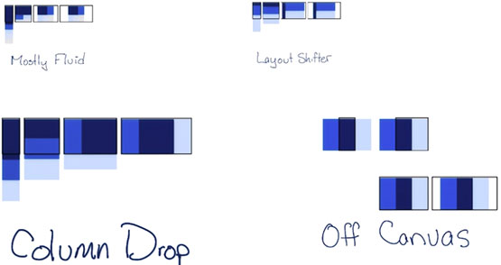](../assets/images/full-size/rwdf4-1.png)

In each of these examples, and the examples moving forward, the colored boxes represent areas of content.

Let's break them down one by one. I'm going to show you how these patterns work, and then using your Flexbox skills and media queries, you're going to practice implementing them.

### 4.2 Pattern - Column Drop
**Column Drop** is probably the easiest.

[](../assets/images/full-size/rwdf4-2.png)
Live Sample - [Column Drop Pattern](https://codepen.io/james-priest/pen/KRXeKo)

At its narrowest viewport, each element simply stacks vertically, one on top of the other.

As things get wider, the elements expand, until the first break point is hit. At the first break point, instead of having all the elements stacked, two elements are now side by side, and the third element is underneath.

The elements keep expanding as the viewport gets wider until the next breakpoint is hit. Then, things reflow to a three-column layout.

Generally, once the viewport hits a maximum width, the columns hit a maximum size, and instead of getting wider, margins are added to the left and right.

#### Viewport #1
So how do we code this? Let's start with the smallest viewport. We have our three divs, inside of a container div.

[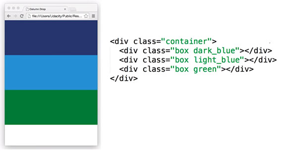](../assets/images/full-size/rwdf4-3.png)

The container is a flex container, with `flex-wrap: wrap`.

```css
.container {
    display: flex;
    flex-wrap: wrap;
}
```

[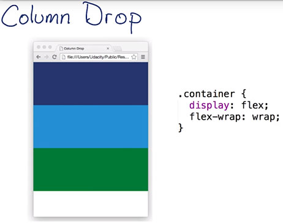](../assets/images/full-size/rwdf4-4.png)

Next, I've set the width of all of the divs to 100% to give me that stacked layout.

```css
.box {
    width: 100%;
    min-height: 150px;
}
```

#### Viewport #2
Because this is just a sample, I'll pick a totally random break point at 450 pixels.

I want that dark blue div to be 25% of the viewport width, and the light blue div to be 75%. And I want to keep the green at the full width.

[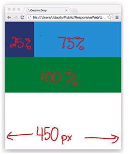](../assets/images/full-size/rwdf4-5.png)

I'm going to add a new media query that checks if min width is greater than or equal to 450 pixels, and then change the width of dark blue to 25% and light blue to 75%.

```css
@media screen and (min-width: 450px) {
    .dark_blue {
        width: 25%;
    }
    .light_blue {
        width: 75%;
    }
}
```

#### Viewport #3
I'll add a third break point at 550 pixels and make the dark blue div 25%, the light blue div 50%, and the green div to be 25%.

[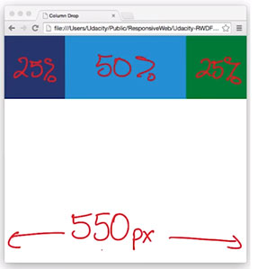](../assets/images/full-size/rwdf4-6.png)

To get that to happen, I'll add a new media query that tests for screen, and min-width 550 pixels. Inside that media query, I'll set the width for dark blue and green to 25% and light blue to 50%.

```css
@media screen and (min-width: 550px) {
    .dark_blue, .green {
        width: 25%;
    }
    .light_blue {
        width: 50%;
    }
}
```

Let's try it in the browser. We're all stacked at 400 pixels. At 450, our layout changes, and again at 550 pixels. Perfect.

### 4.3 Pattern - Mostly Fluid
The **Mostly Fluid** pattern, is very similar to *Column Drop*, but it tends to be a bit more grid like With more columns, and columns fitting in different ways, depending on the viewport width.

[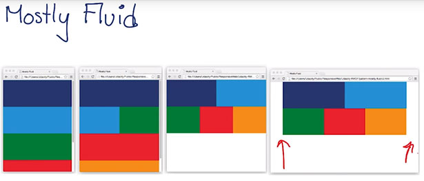](../assets/images/full-size/rwdf4-7.png)
Live Sample - [Mostly Fluid Pattern](https://codepen.io/james-priest/pen/XqeYjQ)

Just like column drop, at its narrowest viewport, the layout is stacked, but as the layout gets wider, the grid pattern starts to appear. 

Eventually, once the layout hits its widest viewport, margins are added on the left and right, instead of expanding things out.

#### Viewport #1
I've made this one a bit more complex, with a few additional divs.

[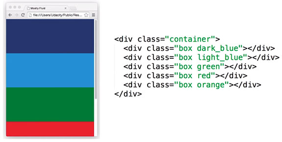](../assets/images/full-size/rwdf4-8.png)

Just like column drop, I'm using flexbox and setting the width of each element to 100% at their narrowest viewport.

```css
.container {
    display: flex;
    flex-wrap: wrap;
}

.box {
    width: 100%;
    min-height: 150px;
}
```

#### Viewport #2
At the first breakpoint, I'll make the light blue div and the green div, 50% width.

[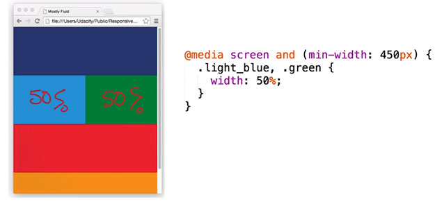](../assets/images/full-size/rwdf4-9.png)

Just like before, I'll add a min-width query, to check fora min-width of 450 pixels.If that's the case, I'll make the light blue and green 50% width.

```css
@media screen and (min-width: 450px) {
    .light_blue, .green {
        width: 50%;
    }
}
```

#### Viewport #3
I want another breakpoint at 550 pixels.

[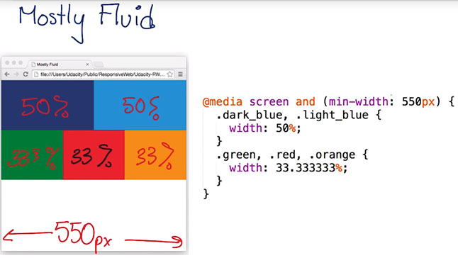](../assets/images/full-size/rwdf4-10.png)

I'll add the media query, and set the appropriate widths on the right elements.

```css
@media screen and (min-width: 550px) {
    .dark_blue, .light_blue {
        width: 50%;
    }
    .green, .red, .orange {
        width: 33.333333%;
    }
}
```

#### Viewport #4
And finally I'll add a breakpoint that adds margins to the side when the viewport is beyond 700 pixels.

[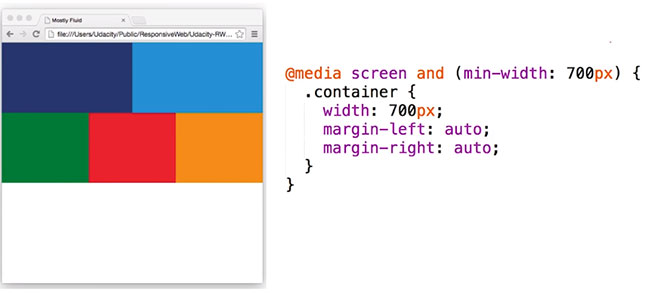](../assets/images/full-size/rwdf4-11.png)

```css
@media screen and (min-width: 700px) {
    .container {
        width: 700px;
        margin-left: auto;
        margin-right: auto;
    }
}
```

Let's take a look at it in the browser.

- Everything is stacked as I expect at below 450 pixels.
- And as I expand up, I get a switch and 450.
- I'll get a switch again at 550 pixels.
- And above 700 pixels, I'll start getting margins added to the side.

[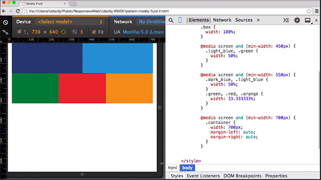](../assets/images/full-size/rwdf4-12.png)

That's exactly what I wanted.

### 4.4 Quiz: Mostly Fluid Part 1
Fill in numbers corresponding to the width and order of each element.

[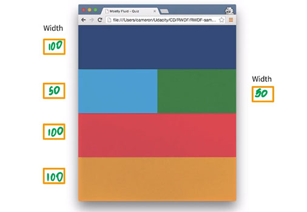](../assets/images/full-size/rwdf4-13.png)

### 4.5 Quiz: Mostly Fluid Part 2
Fill in numbers corresponding to the width and order of each element.

[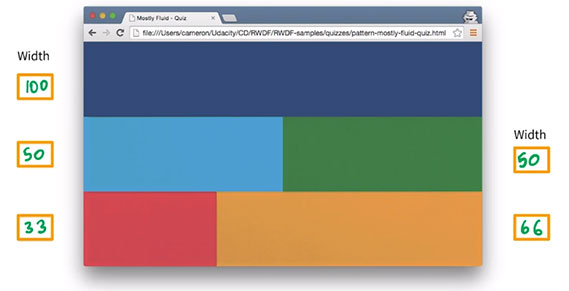](../assets/images/full-size/rwdf4-14.png)

### 4.6 Quiz: Combining Fluid Layouts
Complete the Mostly Fluid layout exercise.

[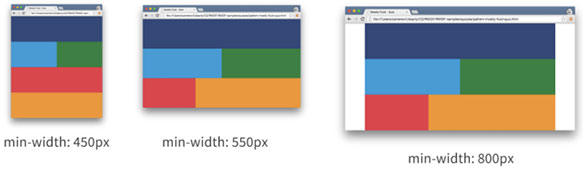](../assets/images/full-size/rwdf4-15.png)

#### Solution

```css
@media screen and (min-width: 450px) {
    .light_blue, .green {
        width: 50%;
    }
}
@media screen and (min-width: 550px) {
    .red {
        width: 33.333333%;
    }
    .orange {
        width: 66.666666%;
    }
}
@media screen and (min-width: 800px) {
    .container {
        width: 800px;
        margin-left: auto;
        margin-right: auto;
    }
}
```

### 4.7 Pattern - Layout Shifter
The layout shifter pattern is probably the most responsive pattern with multiple break points across several different screen widths. The key to this layout is the way that content moves about instead of reflowing and dropping below other columns.

[](../assets/images/full-size/rwdf4-16.png)
Live Sample - [Layout Shifter Pattern](https://codepen.io/james-priest/pen/KRygva)

Flexbox really shines here, because we can use the order CSS attribute. Because so much can change in each layout, it does require a bit more planning to maintain.

#### Viewport #1
I'll go for something a bit more complex this time. In order to get the layout I want, I've wrapped the light blue div, and the green div inside container two.

[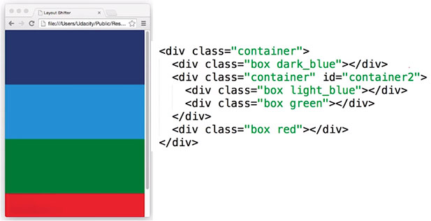](../assets/images/full-size/rwdf4-17.png)

I've made one small change to the container class from the last example and I've set it's width to 100%, so that the element inside takes up the full width.

```css
.container {
    width: 100%;    /* <-- new change */
    display: flex;
    flex-wrap: wrap;
}

.box {
    width: 100%;
    min-height: 150px;
}
```

When no break point has been hit, only the default styles are applied making each element 100% width, stacked on top of the other.

#### Viewport #2
When the first media query is hit at 500 pixels, the break point changes the dark blue and the container, each to be width of 50%.

[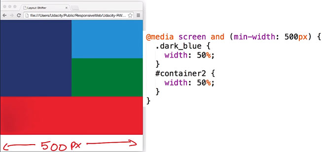](../assets/images/full-size/rwdf4-18.png)

The red div remains at 100%, because we haven't changed it.

```css
@media screen and (min-width: 500px) {
    .dark_blue {
        width: 50%;
    }
    #container2 {
        width: 50%;
    }
}
```

#### Viewport #3
At 600 pixels things start to get really fun. To get everything to fit, I need to change the width on container2 to 50% and the width on dark blue and red to 25% each.

Next, to change the order, I need to specify an order for each element.

[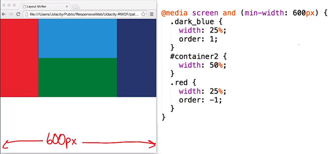](../assets/images/full-size/rwdf4-19.png)

Remember, the default order value for an element is zero. If I set order to negative 1 on the red div it'll appear first.

To get the dark blue element, to show up last, I need to set it's value to anything greater than zero, so one.

```css
@media screen and (min-width: 600px) {
    .dark_blue {
        width: 25%;
        order: 1;
    }
    #container2 {
        width: 50%;
    }
    .red {
        width: 25%;
        order: -1
    }
}
```

Let's take a look in the browser.

- It's all stacked to start.
- As it gets wider and hits the first break point, the dark blue goes to the left with light blue and green on the right
- Finally it switches up again

[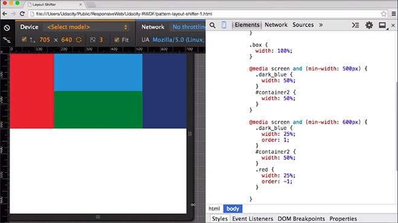](../assets/images/full-size/rwdf4-20.png)

### 4.8 Quiz: Which is Which
Fill out the answers with the CSS box name.

[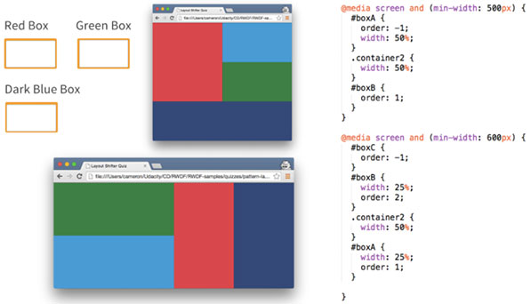](../assets/images/full-size/rwdf4-21.png)

I'll take a look at the smaller layout first.

1. Box A takes up 50% of the viewport, and has an order of negative 1, which looks like it's the lowest meaning box A comes first, which probably means the Red Box is box A.
2. Container 2 has a width of 50% and no order. So, I think it's probably a good guess that container 2 is talking about the light blue and the green divs.
3. I can see that boxB must come after boxA, and because this doesn't have an order, it's probably order 0, so that means that boxB is going to be the Dark Blue Box.That probably means the Green Box is boxC.

I want to take up the larger viewport to confirm my suspicions.
- I can see that boxC has an order of negative 1 in the larger viewport, which means that it looks like it's going to come first.

That's a pretty good argument that the Green Box is boxC, but let’s just goes ahead and make sure.

- Box B has a width of 25%, and an order of 2 which is the largest one I see here, so it's probably going to come last.

That seems to make sense, because I said that the Dark Blue Box is boxB, and here boxB seems to be the last one.

- BoxA is 25% and comes right before boxB which makes it the red one. So, I'm feeling pretty good about my answer that the Red Box is boxA.
- Lastly, there's still this container class with a width of 50%.And it looks like it's still being applied to the light blue, and the green boxes.

[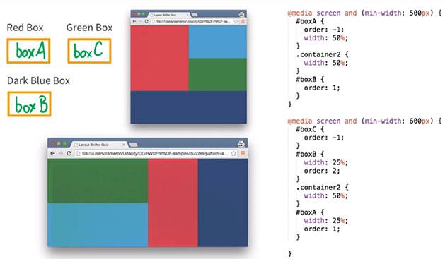](../assets/images/full-size/rwdf4-22.png)

So, in the end, boxA is Red, boxC is Green, and boxB is Dark Blue.

### 4.9 Pattern - Off Canvas
With off canvas, instead of stacking content vertically, the off canvas places less frequently used content, for example navigation or app menus, off screen, only showing them if the screen is large enough.

[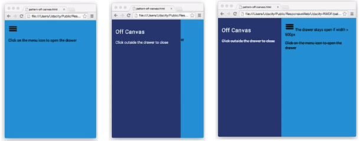](../assets/images/full-size/rwdf4-23.png)
Live Sample - [Off Canvas Pattern](https://codepen.io/james-priest/pen/xjPdwe)

On smaller screens, the off canvas content is typically shown when the user taps on the hamburger icon.

Let's take a look and see how it's done on the Web Fundamentals site.

[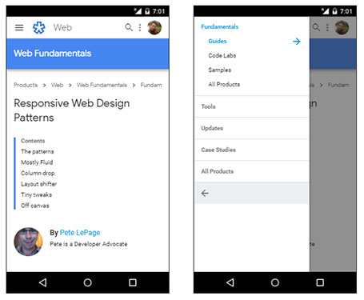](../assets/images/full-size/rwdf4-24.png)

In narrow viewport, the navigation menu is often hidden until you click the hamburger menu. This was the case in an earlier version of Web Fundamentals. Now, the off screen content actually animates in from off the screen (on the left).

In the sample page below, the content is coming in from the left. But in other cases, it could come in from the right.

[](../assets/images/full-size/rwdf4-23.png)

#### Viewport #1
Let's take a look at the code for this example. I have two elements, the dark blue nav and the main content in light blue.

[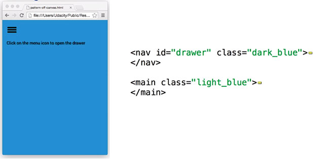](../assets/images/full-size/rwdf4-25.png)

In order to make sure the elements take up the full viewport width, I need to set the width on html, body, and main to 100%.

```css
html, body, main {
    width: 100%;
}
```

Next, I'll set the styles for the off-canvas nav element. I'll set a specific width of 300 pixels, being careful to keep it reasonably sized so that it doesn't overflow the viewport.

I'll use translate minus 300 pixels to move it off the screen and add a transition of 0.3 seconds, so that it animates in nicely.

```css
nav {
    width: 300px;
    height: 100%;
    position: absolute;
    transform: translate(-300px, 0);
    transition: transform 0.3s ease;
}
```

When I want it to appear, I'll add an open class that resets the transform.

```css
nav.open {
    transform: translate(0, 0);
}
```

#### Viewport #2
Now, I'll add a break point at 600 pixels that repositions everything back to its normal spot.

[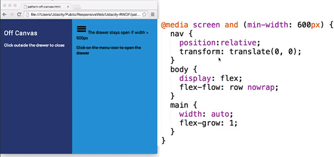](../assets/images/full-size/rwdf4-26.png)

The media query at 600 pixels resets the transform. Adding flex grow 1 to the main element allows the element to grow and take up the full remaining width of the viewport.

```css
@media screen and (min-width: 600px) {
    nav {
        position: relative;
        transform: translate(0, 0);
    }
    body {
        display: flex;
        flex-flow: row nowrap;
    }
    main {
        width: auto;
        flex-grow: 1;
    }
}
```

The last piece necessary is the javascript to toggle the `open` class.

```js
menu.addEventListener('click', function(e) {
    drawer.classList.toggle('open');
    e.stopPropagation();
});
```

Now we give it a shot in the browser. When the viewport is small, the navigation panel is hidden until I hit the hamburger menu. But, on wider view port, it's shown by default.

[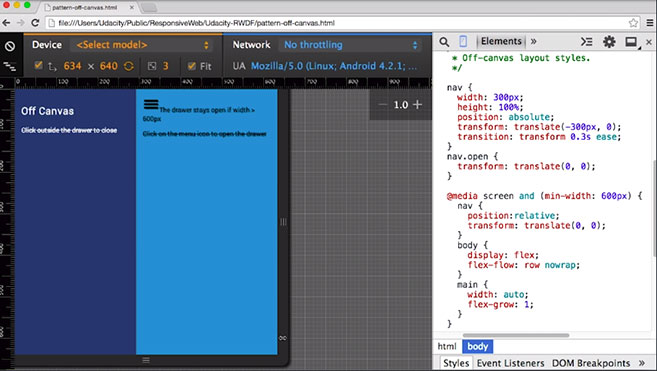](../assets/images/full-size/rwdf4-27.png)

### 4.10 Quiz: Off Canvas Visualization
Use the CSS below to identify the set of drawings that accurately shows the way the nav shows up on screen.  The open class is applied onclick.

[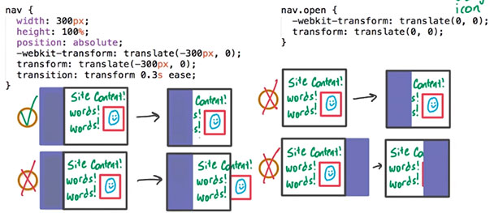](../assets/images/full-size/rwdf4-28.png)

Option 1 is correct because the nav is actually positioned off the page - outside the viewport.

### 4.11 Quiz: Project Update Part 2
#### Building the Home Town App (part 2 of 3)

For this part of the project you need to:

1. Pick a set of breakpoints and use one of the patterns that you learned to style the page so that it works across different devices.
2. Test on multiple phones, tables, and browser window sizes and adjust breakpoints until you're happy.

#### Solution

[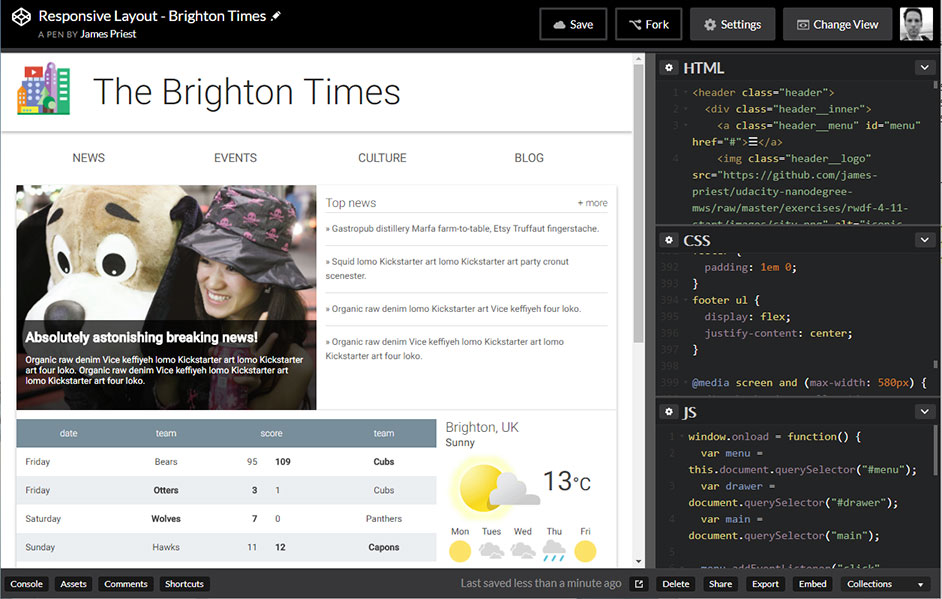](../assets/images/full-size/rwdf4-29.png)
Live Sample - [The Brighton Times](https://codepen.io/james-priest/pen/ZovQQp)

### 4.12 Lesson Summary
In these last two lessons, you learned how to use grid layouts for responsive design, and you also learned the four common responsive design patterns.

In the next lesson, you'll learn about some advanced optimization techniques that you can use to really make a site shine.

## Lesson 5. Optimizations
### 5.1 Lesson Intro
You've now got the most important skills that you need to build responsive websites.

1. You've got a good understanding of what responsive means
2. You know how to use flexbox to lay out your designs
3. You've now got several common design patterns at your disposal

In this lesson, you're going to learn about some of the other things that are important to responsive design, like images, tables, and typography.

### 5.2 Images
Images play an integral part of every website. The HTTP archive has it pegged at near 1.2 megabytes per page, which means images take up 65% of every website.

In order to do responsive web design, we need to consider images. If the rest of my page is changing based on device characteristics wouldn't it make sense that my images should be changing too?

Using the same image, but changing the resolution is probably one of the most common use cases. Think providing a standard image for a laptop, but a 2X image for a high DPI display, like a Chromebook Pixel, or a Retina iMac.

The best way to do this is using the `srcset` attribute on an `<image>` tag. With `srcset`, the browser will choose which file it wants, and then only download that one.

What about the case where I want a different crop of an image? It doesn't make sense to show a big, wide image on a narrow portrait phone.

That's what's called art direction, and where the new `<picture>` element come in. The `<picture>` element uses media queries to select which image to use which we'll cover in our next course.

### 5.3 Responsive Tables Intro
Tables can be tricky. If they're more than a few columns, there's a pretty good chance that it's going to overflow the viewport on smaller screens, forcing horizontal scrolling.

[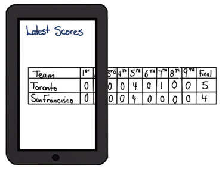](../assets/images/full-size/rwdf5-1.png)

To fix this, there's several options, and I'm going to show you three.

- Hidden columns
- No more tables
- Contained tables.

[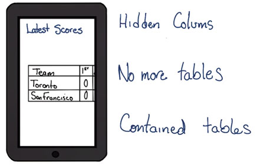](../assets/images/full-size/rwdf5-2.png)

Like breakpoints, you want to experiment to decide what works best for your content, and remember, different content might call for different answers.

### 5.4 RT: Hidden Columns
Hidden columns essentially hides columns based on their importance as the viewports size gets smaller.

Let's see how you might do this with a baseball scoreboard. 

[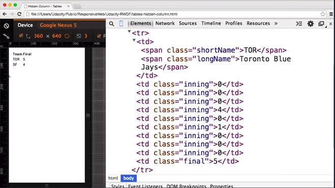](../assets/images/full-size/rwdf5-3.png)

As you can see all of the data is there. The short name, the long name and the runs scored during each of the innings plus the final score.

I'm going to start small and ask myself what's the most important information.

In this case, I'm going to go with the short team name and the final score. I'm going to use `display: none`, to hide everything else. 

Then, as the viewport size gets bigger, let's swap out the full team name and start showing each of the runs per inning.

[](../assets/images/full-size/rwdf5-4.png)

The biggest problem of hidden columns is that you're hiding content from the user.

What happens if I need to know how many runs were scored in the 7th inning? If I'm a device with a narrow viewport, it's just not there, I can't see it.

So use this technique with caution, and if possible, use abbreviated data instead of hiding it completely.

### 5.5 Quiz: Hide Some Columns
A simple table has the following HTML. Fill in the blanks in the CSS below so that the gametime class is hidden from viewports 499px wide or smaller.

[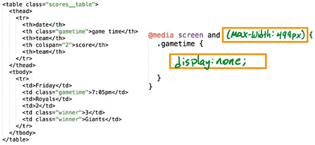](../assets/images/full-size/rwdf5-5.png)

### 5.6 RT: No More Tables
With the no more tables technique, below a certain viewport width, the table is collapsed and resembles a long list, as opposed to a table data.

The nice thing about this technique is all of the data is visible no matter what the size of the viewport is.

Let's take a look with the baseball score again.

[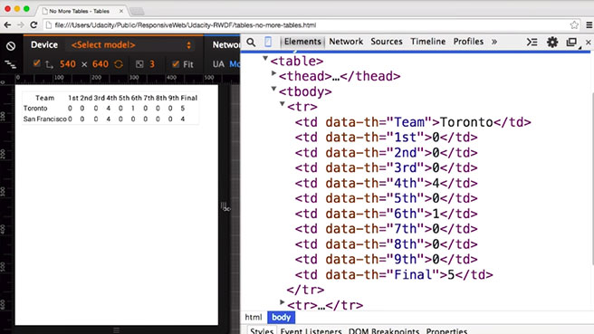](../assets/images/full-size/rwdf5-6.png)

In a wider viewport, everything looks good, but as the viewport shrinks, the table collapses.

[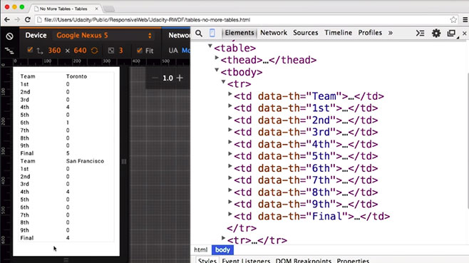](../assets/images/full-size/rwdf5-7.png)

Every column has essentially become its own row with the table header beside it.

Using a media query, I need to tell the table that below a certain width, in this case 500 pixels, I don't want it to act like a table anymore.

[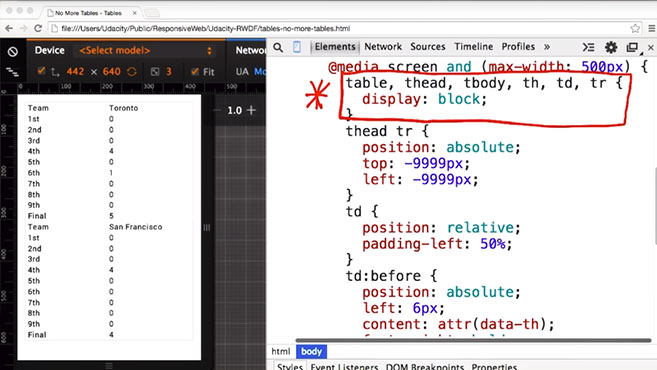](../assets/images/full-size/rwdf5-8.png)

Inside my media query, I'm going to force all `table`, `thead`, `tbody`, `th`, `tr` and `td` elements to render as `display: block`.

Next, I need to get rid of the table header. I could set `display: none`, but that would cause accessibility problems for people using screen readers because the browser won't tell them the column headers.

[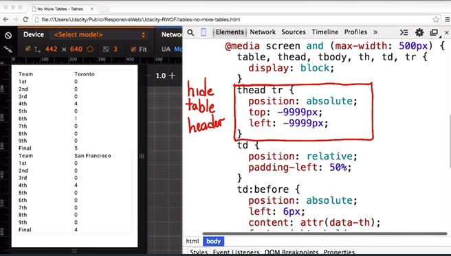](../assets/images/full-size/rwdf5-9.png)

Instead, I'm just going to position the content way off screen.

Since the table cells are now displayed as full width block elements, I need to add some left padding and also set the position on these elements to relative.

To add the row labels, I'm going to use the before pseudo selector and add `td:before`, and inside, I'll set the position to `left: 6` pixels so that I get it positioned in the right place.

[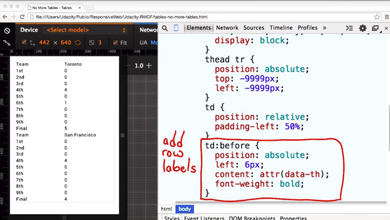](../assets/images/full-size/rwdf5-10.png)

Now I need to add the content. I could put the labels in my CSS, but that's icky and will mean that these styles will only work for this table.

Instead, I'll use `content: attr(data-th)`. That will then pull the values from the `data-th` of each of the td elements.

[](../assets/images/full-size/rwdf5-11.png)

Here, let me show you. And there you have it. That data-th is used as the label for each of the rows.

[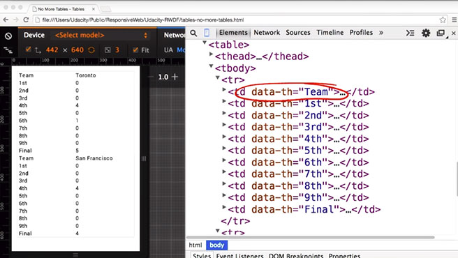](../assets/images/full-size/rwdf5-12.png)

### 5.7 RT: Contained Scrolling
One of the easiest things you can do, to contain the table in the viewport is to wrap it in a div and set the width to 100%.And overflow x to auto.

Then, instead of breaking out of the view port. The table will instead, take up the same width but will scroll within the view port.

[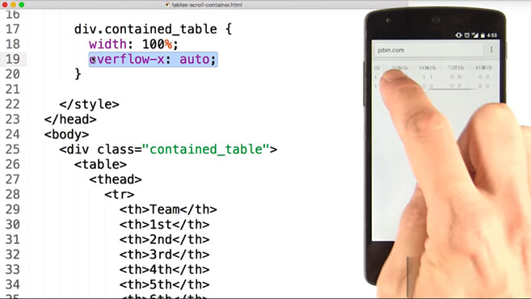](../assets/images/full-size/rwdf5-13.png)

### 5.8 Fonts
Let's try a little experiment. I want you to read the first paragraph of Alice's Adventure in Wonderland out loud.

[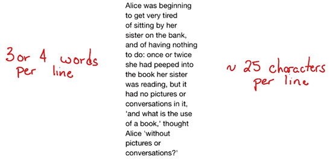](../assets/images/full-size/rwdf5-14.png)

It's a little weird right? With only a few words per line, it's kind of awkward to read. Words or phrases that might be read as groups, end up getting broken across multiple lines, making it hard to parse the sentences.

Why don't you try this one instead. It's got a few more words per line, so maybe we won't have the same problem.

[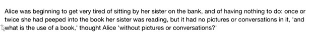](../assets/images/full-size/rwdf5-15.png)

It's the same content but with more words and it still doesn't work. If a line of text is too long, readers get lost when trying to find the next line and end up reading the same thing over and over again.

Or they get lazy and might read the first part of each line, but by the end, they're skimming. 

Over the last century, there's been lots of research done to determine the ideal measure. That's the technical term for the length of a line.

I've seen research ranging from 45 characters per line to as many as 90 characters per line, depending on the font used, if it's in print, if it's projected, or on a computer screen.

[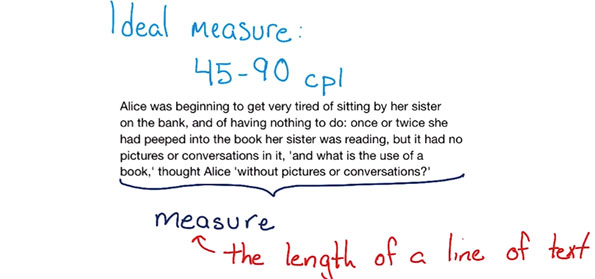](../assets/images/full-size/rwdf5-16.png)

But, there seems to be a pretty solid consensus around 65 characters per line for the web .It's not a hard and fast rule, but it's a good place to start.

[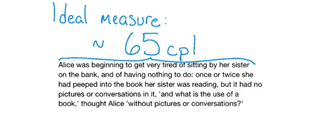](../assets/images/full-size/rwdf5-17.png)

We need to consider the way people read as we create our designs, since it can affect our layout. 

That's why line length is an important factor to consider as you're building sites, and something I always take into consideration as I choose my breakpoints.

[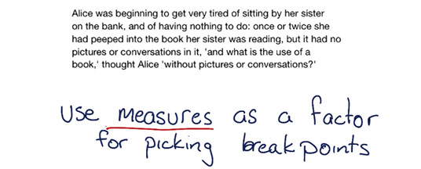](../assets/images/full-size/rwdf5-18.png)

#### Base Font Size
It's also important to make sure that fonts are big enough to read across any device. **I always set my base font to at least 16 pixels, and at least a 1.2em line height.**

[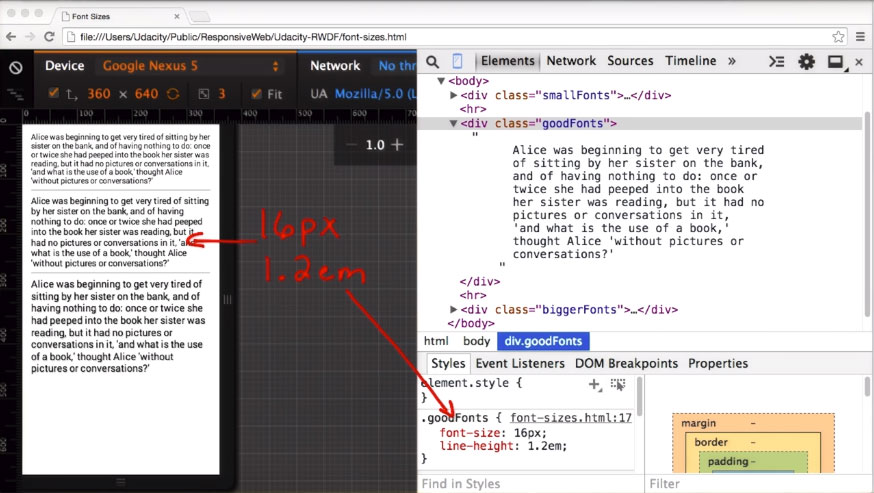](../assets/images/full-size/rwdf5-24.png)

Depending on the situation, I may even increase it for text heavy sites to something like 18px and 1.25em line-hight.

```css
body {
    font-size: 16px;
    line-height: 1.2em;
}
.bigger-fonts {
    font-size: 18px;
    line-height: 1.25em;
}
```

14 pixels is just too small. That may sound big, but makes for a much better reading experience. Even on a desktop, it works quite well.

### 5.9 Minor Breakpoints
In addition to choosing **major breakpoints**, where layout changes significantly, it's also helpful to add **minor breakpoints** to make some small changes.

For example, between major breakpoints, it may be helpful to adjust margins and paddings on an element. Or to increase the font size to make things, a little bit easier to read and feel more natural in the layout.

In this case let's boost the font, when the viewport width is between 400 and 550 pixels, where our break point kicks in.

[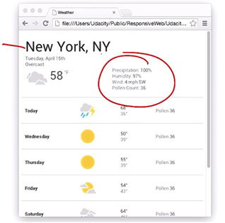](../assets/images/full-size/rwdf5-19.png)

I'll also separate the low and high temperature, so that they're not on the same line and make the weather icons bigger as well.

[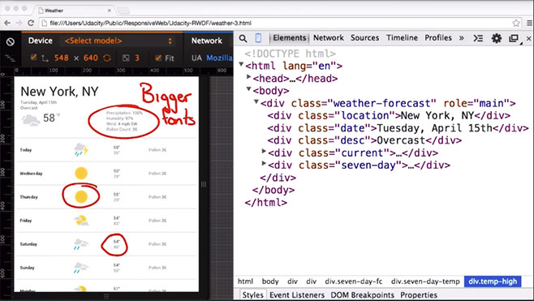](../assets/images/full-size/rwdf5-20.png)

Let's switch to the source and I'll add a media query that's applied when the viewport is between 450 and 550 pixels.

```css
@media screen and (min-width: 450px) and (max-width: 550px) {
    body { font-size: 1em; }

    .seven-day-fc .temp-low,
    .seven-day-fc .temp-hi {
        display: inline-block;
        width: 30%;
    }
    .seven-day-fc, .icon {
        width: 60px;
        height: 60px;
    }
}
```

It ups the base font, changes the low and high temperature to be inline block, and increases the icon size.

I'll save the file, and then take a look in the browser. Sure enough, my icons are now bigger, my fonts are now bigger, and everything looks like I expect it to.

In this before and after, you can see how things have really changed. The icons are much bigger, the font sizes have also changed, and the minimum and maximum temperatures are now shown in a slightly different way.

[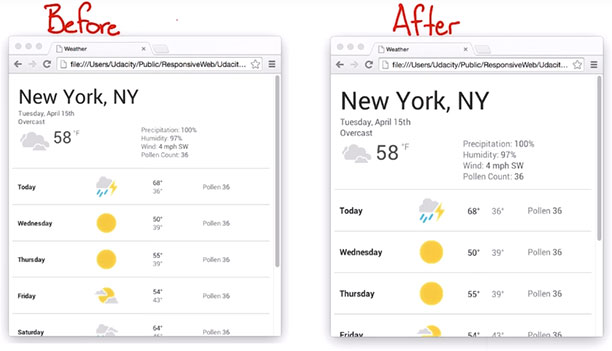](../assets/images/full-size/rwdf5-21.png)

For larger view ports I want to limit the maximum width of the forecast page panel, so that it doesn't consume the entire view port as it gets wider.

[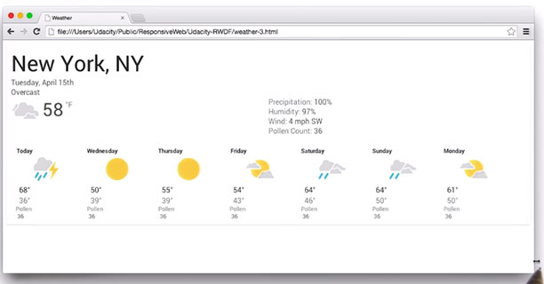](../assets/images/full-size/rwdf5-22.png)

I already have a link style sheet with min-width query of 700 pixels. 

```html
<!DOCTYPE html>
<html>
    ...
    <link rel="stylesheet" media="screen and (min-width: 700px)" href="700.css">
```

So in there, I just need to set some margins and padding.Let's take a look.I'll set the width to 700 pixels, and set margin left and margin right to auto.

```css
.weather-forecast {
    width: 700px;
    margin-left: auto;
    margin-right: auto;
    display: block;
}
```

I'll come back to Chrome, hit Refresh, and now we've got what I want. There you have it.

[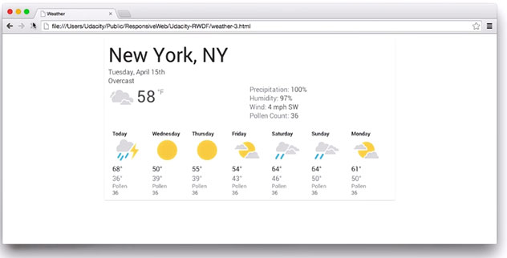](../assets/images/full-size/rwdf5-23.png)

You can use minor break points, to adjust the little things and really make things shine.

### 5.10 Quiz: Final Project Updates
#### Building the Home Town App (part 3 of 3)
For the final part of the project you need to:

1. Update the sports score table with your favorite sports team (make sure it's responsive!).
2. Double check your text. Is it too long? If so, make it fit more naturally.
3. Add a minor breakpoint if possible.
4. Try replacing a few of the images with responsive images. Check out the [Responsive Images section of Web Fundamentals](https://developers.google.com/web/fundamentals/media/images/).
5. Share you final project in the forums.

How did the ellipsis happen?

- [Truncating string with ellipsis](http://css-tricks.com/snippets/css/truncate-string-with-ellipsis/) - for adding an ellipsis to a single line
- [Multiline truncation with ellipsis](http://hackingui.com/front-end/a-pure-css-solution-for-multiline-text-truncation/) - adding an ellipsis when you have multiple lines.

These can be tricky. It took a bit of trial-and-error on my part before I was happy with the result.

#### Solution

[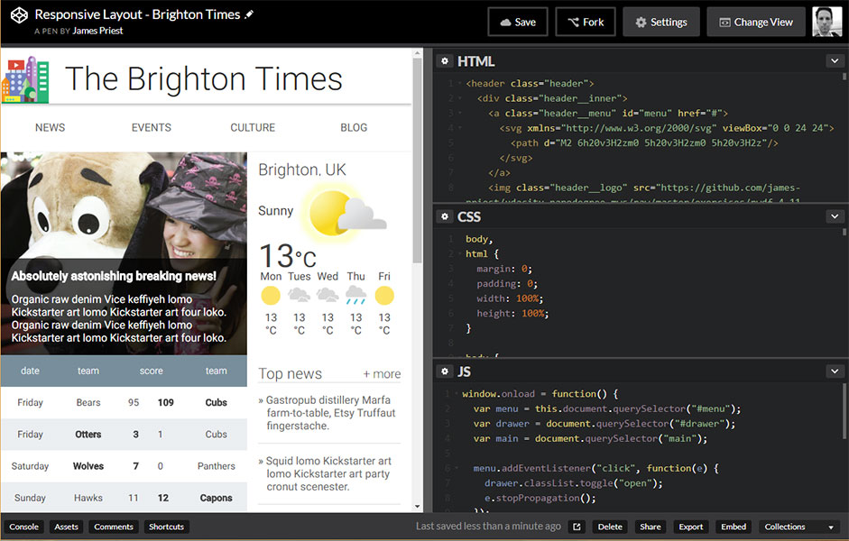](../assets/images/full-size/rwdf5-25.png)
Live Sample - [The Brighton Times](https://codepen.io/james-priest/pen/ZovQQp)

### 5.11 Wrap Up
We've learned the basics of well-sized elements for mobile using breakpoints and media queries to change the page layout for different devices.

We've also learned common responsive design patterns, and we've gone into some advanced techniques, like minor breakpoints.

At this point, you've got all the tools and concepts you need to build amazing responsive sites. It's fair to say that, all you need now, is an idea for a site, and some time to let your content inform your responsive design.

[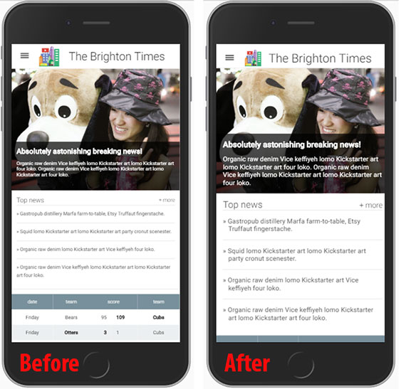](../assets/images/full-size/mobile1.jpg)

[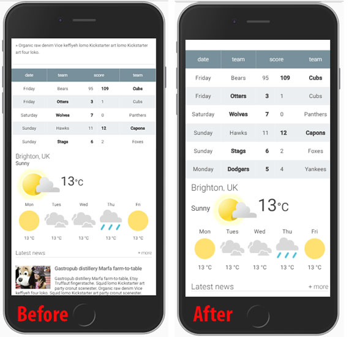](../assets/images/full-size/mobile2.jpg)

[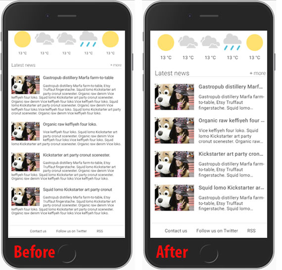](../assets/images/full-size/mobile3.jpg)