<!-- markdownlint-disable MD022 MD024 MD032 -->
<!-- # Mobile Web Specialist Nanodegree -->
# Web Accessibility

[<-- back to Mobile Web Specialist Nanodegree homepage](../index.html)

---

### Supporting Links
- [WebAIM Checklist for WCAG 2.0](http://webaim.org/standards/wcag/checklist)
- [Web Content Accessibility Guidelines 2.0 (WCAG)](https://www.w3.org/TR/WCAG20/)
- [ChromeVox Lite Screen Reader](http://udacity.github.io/ud891/lesson1-overview/06-experiencing-screen-reader/) - Sample in-page screen reader by Google
- [Web Accessibility GitHub repo](https://github.com/udacity/ud891) - Udacity's GitHub repo for this course
- ARIA 1.0 roles: [https://www.w3.org/TR/wai-aria-1.0/#roles](https://www.w3.org/TR/wai-aria-1.0/#roles)
- ARIA 1.1 roles: [https://www.w3.org/TR/wai-aria-1.1/#roles](https://www.w3.org/TR/wai-aria-1.1/#roles)
- ARIA 1.1 practices guide: [https://www.w3.org/TR/wai-aria-practices-1.1/](https://www.w3.org/TR/wai-aria-practices-1.1/)

## Lesson 10. Accessibility Overview
### 10.1 Intro to Accessibility
Alice Boxhall a software engineer on the Google Chrome accessibility team and Rob Dodson, a developer advocate for Chrome help you understand how you can make your websites accessible and usable for everyone.

[](../assets/images/full-size/wa10-1.png)

Accessibility is a pain to spell. So we often shorten it "a11y", but it doesn't have to be a pain to work on. We'll show you how you can get some easy wins to:

- help improve accessibility with minimal effort
- use what's built into HTML to create more accessible and robust interfaces
- use some advanced techniques for creating really polished accessible experiences.

You'll also see as we go that a great deal of this work will help you create interfaces which are more delightful and easy to use for everyone.

In fact, I think a lot of developers have only a pretty hazy understanding of what accessibility means, something to do with government contracts and checklists and screen readers.

There are plenty of misconceptions floating around, like a lot of developers feel that addressing accessibility is going to force them to choose between creating a delightful and attractive experience and ticking a box saying that their site is accessible.

So, what do we mean by accessibility and really like what are we here to learn about?

Well, broadly speaking when we say a site to be accessible, we're saying that the site's content should be available to everyone and functionality can be operated by anyone. Literally, that everyone should be able to access it.

When it comes to developing sites which are accessible by everyone, we need to be a bit more specific.

As developers, it's easy to fall into the trap of assuming that all users can see and use a pointer interface like a mouse ora touch screen and experience your application the same way that you do. This can lead to creating an experience which might work well for a narrow range of people, but creates issues for anyone outside of that range.

Accessibility in that case refers the experience of users who might be outside of that narrow range and who might access or experience things differently to the way the person we picture as a typical user would. Specifically, it concerns users who are experiencing some type of impairment or disability, and I say experiencing that, because it makes absolutely no difference whether that impairment is situational, temporary, or permanent.

So with that in mind, let's explore what happens when we actually do takean inaccessible site and make it more accessible.

#### Introductory Notes
Welcome to the Web Accessibility course!

Good accessibility or "a11y" is crucial to making sure all users can access the content in your sites and applications. Making sure you consider accessibility at the start of your process will ensure that your final product is more polished and works for more people.

Throughout this course we'll have you do a number of hands-on exercises to get familiar with accessibility topics and techniques. You can find all of the exercises in [the project's GitHub repo](https://github.com/udacity/ud891). Go ahead and clone it now so you can reference it when we get to the quiz nodes.

**Note:** We often shorten the word "accessibility" to "a11y" because there's 11 letters between the "A" and "Y" in the word "Accessibility". Sometimes you'll see this pattern used in other contexts like i18n for "internationalization" and l10n for "localization".

### 10.2 What is Accessibility
Even though we center our discussion of accessibility on users with impairments, we can all relate to the experience of using an interface, which is not accessible to us.

Have you ever tried to use a desktop optimized site on a mobile device, or seen, "This content is not available in your country." when you are trying to watch a video online?

[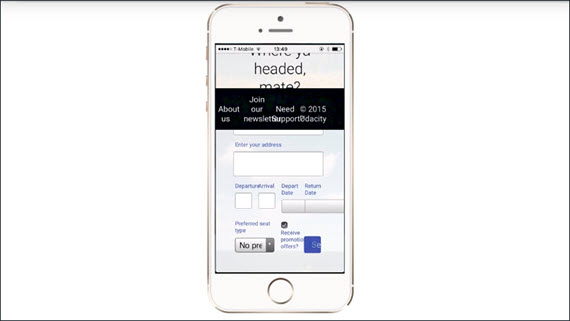](../assets/images/full-size/wa10-2.png)

So in a broad sense you've almost certainly experienced being unable to access something. As we mentioned, this cause is largely concerned with accessibility in the narrowest sense of ensuring users with disabilities can access content.

**However, addressing accessibility issues in the narrow sense very often improves the user experience for everyone.**

To see where that's true, let's look at an example with some accessibility issues.

[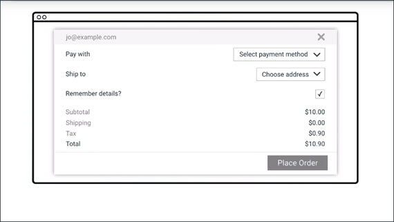](../assets/images/full-size/wa10-3.png)

This form has several issues.
1. The user name text and some of the text in the price details is low contrast. So that's hard for low vision users to read.
2. Having the form labels on the left and the form fields on the right, makes it hard for most people to associate them and almost impossible for someone who needs to zoom in to use the page.
3. The label isn't correctly associated with the check box. So I have to tap or click the tiny square, rather than being able to click the label. Plus, a screen reader user would have difficulty figuring out the association.
    [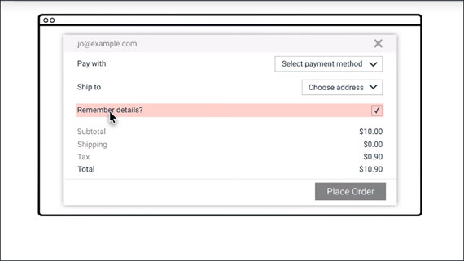](../assets/images/full-size/wa10-4.png)

So now let's wave our accessibility wand and see with those issues fixed.

[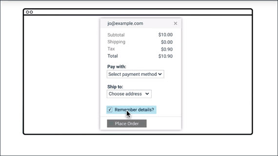](../assets/images/full-size/wa10-5.png)

Here are the changes.
1. We've made that low contrast text darker.
2. We've modified the design so the labels are right next to things they're labeling.
3. We fixed that label to be associated with the check box. So now I can check and uncheck it by clicking anywhere on the label.

I'm much more comfortable actually using the accessible version. Sure, I could probably get by with the old version but it would cause some extra stress and possibly cause me to make mistakes if I was in a hurry or distracted.

True story, I once accidentally had something shipped to me in San Francisco instead of my parents in Australia, because of a form that looked a lot like the previous one we just saw. So, while we want to address accessibility first and foremost to avoid excluding people from accessing things, it certainly isn't a zero sum game. We're more likely to make things better for everyone by addressing accessibility.

### 10.3 Diversity of Users
Hi, my name is Victor Tsaran and I work as a technology program manager at Google. At Google I work on making sure that the products we create are accessible to the audience of our diverse users, regardless of their ability or impairment.

[](../assets/images/full-size/wa10-6.png)

Modern web technologies make it very easy for a developer to create a website that's difficult for someone who is blind to use.

If a user has no vision, it's quite likely they would be using a screen reader, which is software that allows them to hear the information displayed on the screen via a text to speech synthesizer.

They may also be using Braille which allows them to feel the on-screen text with their fingers when using braille display.

[](../assets/images/full-size/wa10-7.png)

Many websites are visual in their nature and lack keyboard navigation which is essential for blind people to be able to navigate through the content.

In general, it is safe to assume that there are more people with visual impairments, that is people who have some sight, as opposed to people who are completely blind. There are also people with low visual acuity and they may be using large print text or magnification when using the computer.

[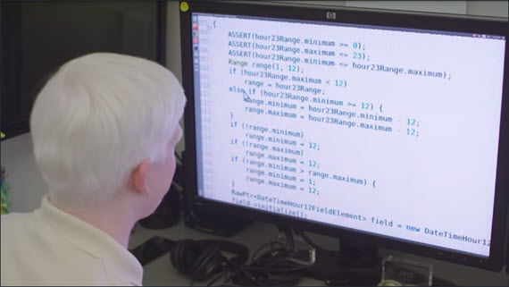](../assets/images/full-size/wa10-8.png)

For example, my friend Laura uses magnification with text to speech, as well as various color contrast options.

There are also people with poor color vision who may have difficulty distinguishing red and green or blue and yellow. This accounts for 9% of male and 1% of female.

We may also find ourselves with temporary challenges, such as when trying to use a computer in the sun or looking at a dodgy projector.

Whenever accessibility comes up in a conversation, people tend to picture someone who is blind like myself but there actually more impairments to think about and consider.

There is a huge number of people with motor or dexterity impairments. Such users may be using only the keyboard, head, or eye tracking software, switches, voice dictation etc. Someone may have a broken wrist, broken track pad, or simply riding the Shaker train.

[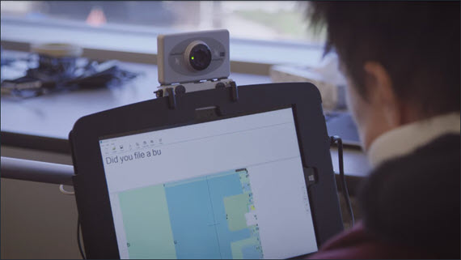](../assets/images/full-size/wa10-9.png)

By catering to users with permanent dexterity impairments, we ensure a great experience for everyone.

There are also users with hearing impairments. For example, some may be completely deaf, yet others have some hearing. The content that uses sound should provide some kind of visual alternative. For example, a messenger app could be using a flashing alert as well as sound notifications.

[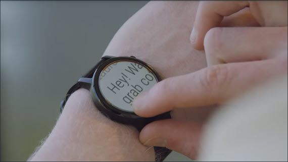](../assets/images/full-size/wa10-10.png)

There are also users with cognitive impairments, for example ADD, dyslexia or autism. These users may require diverse accommodations, such as zooming the screen to make it easier to read the content, or minimal design to minimize destruction and cognitive load.

We can all probably relate to feeling stressful or cognitive load. So improving the experience for users with cognitive impairments makes it so much better experience for everybody else.

In summary, accessibility is really about making sure that the content and the websites we create is usable to people with various impairments or abilities.

#### Statistics
Some statistics on disability for the US:

- Around 2% of the population has some kind of vision disability (i.e. are blind or have significant difficulty seeing even with glasses)
- Around 50% of the population has some kind of clinically significant refractive error (a visual impairment which may be corrected with glasses if mild enough)
- Around 8% of males and 0.5% of females have some form of color vision deficiency
- Around 2% of adults have a hearing disability
- Over 4% have a cognitive disability (difficulty remembering, concentrating, or making decisions)

#### Sources
- [Disability Compendium](http://disabilitycompendium.org/)
- ["The Perception of Color"](http://www.ncbi.nlm.nih.gov/books/NBK11538/)
- ["Prevalence of Refractive Error in the United States, 1999-2004"](http://archopht.jamanetwork.com/article.aspx?articleid=420707)

### 10.4 Quiz: Broken Arm
#### Question 1 of 2
Which categories does the impairment **broken arm** fit into? (check all that apply)
- [ ] Visual
- [x] Motor
- [ ] Hearing
- [ ] Cognitive

#### Question 2 of 2
Which temporalities does the impairment **broken arm** fit into? (check all that apply)
- [x] Temporary
- [ ] Permanent
- [ ] Situational

### 10.5 Quiz: Blindness
#### Question 1 of 2
Which categories does the impairment **blindness** fit into? (check all that apply)
- [ ] Visual
- [x] Motor
- [ ] Hearing
- [ ] Cognitive

#### Question 2 of 2
Which temporalities does the impairment **blindness** fit into? (check all that apply)
- [x] Temporary
- [ ] Permanent
- [ ] Situational

### 10.6 Quiz: Audio
#### Question 1 of 2
Which categories does the impairment **don't, or can't, listen to audio in an open office floor plan** fit into? (check all that apply)
- [ ] Visual
- [ ] Motor
- [x] Hearing
- [ ] Cognitive

#### Question 2 of 2
Which temporalities does the impairment **don't, or can't, listen to audio in an open office floor plan** fit into? (check all that apply)
- [ ] Temporary
- [ ] Permanent
- [x] Situational

### 10.7 Quiz: Baby
#### Question 1 of 2
Which categories does the impairment **holding a baby in one arm** fit into? (check all that apply)
- [ ] Visual
- [x] Motor
- [ ] Hearing
- [ ] Cognitive

#### Question 2 of 2
Which temporalities does the impairment **holding a baby in one arm** fit into? (check all that apply)
- [ ] Temporary
- [ ] Permanent
- [x] Situational

### 10.7 Quiz: Concussion
#### Question 1 of 2
Which categories does the impairment **concussion** fit into? (check all that apply)
- [x] Visual
- [x] Motor
- [ ] Hearing
- [x] Cognitive

#### Question 2 of 2
Which temporalities does the impairment **concussion** fit into? (check all that apply)
- [x] Temporary
- [ ] Permanent
- [ ] Situational

### 10.8 Quiz: Repetitive Strain Injury
#### Question 1 of 2
Which categories does the impairment **Repetitive Strain Injury (RSI)** fit into? (check all that apply)
- [ ] Visual
- [x] Motor
- [ ] Hearing
- [ ] Cognitive

#### Question 2 of 2
Which temporalities does the impairment **Repetitive Strain Injury (RSI)** fit into? (check all that apply)
- [x] Temporary
- [x] Permanent
- [ ] Situational

### 10.10 Using a Screen Reader
Hi, this is Victor again and this time I'd like to show you how I use a screen reader on everyday basis. In this particular case I will be using one of my daily things and that is looking at a public forum that talks about accessibility issues for the Android operating system.

[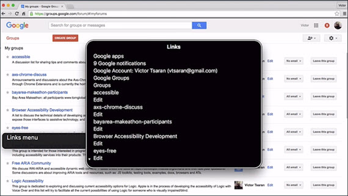](../assets/images/full-size/wa10-11.png)

You will notice that my screen reader speaks really fast. As a beginner user you tend to listen at much lower speeds but as you gain efficiency with the screen reader, you will find that making it speak faster improves efficiency when browsing content on websites.

So back to my public form.I'm going to go to groups website.

Since I use this website every day I know that it provides a lot of shortcut keys that allows me to browse this website much faster.

So first I'll go to my groups. And now I will be using a screen reader functionality there allows me to browse through the links on this webpage because I'd like to find a specific public forum I'm looking for.

Here you will see I have a few message threads and quite recently I heard about this new app called Swift. It's a braille Keyboard that allows people who are blind to type braille faster on Android.

So I'm going to go back to this thread and look at some of the messages that I may have missed. Looking at messages that I included in this thread. I used again, shortcut keys to quickly move through messages. If there is anything new since the last time I looked at this forum. Yeah, there's quite a bit to read.

Anyway I hope this gives you a quick glance into how I use this view to an everyday basis.

### 10.11 Quiz: Experiencing a Screen Reader
Alright, it's time to start working with a screen reader. Head over to [this sample page](http://udacity.github.io/ud891/lesson1-overview/06-experiencing-screen-reader/) and click the 'Enable ChromeVox Lite' button to get started. When you're finished, come back here and enter the secret word.

[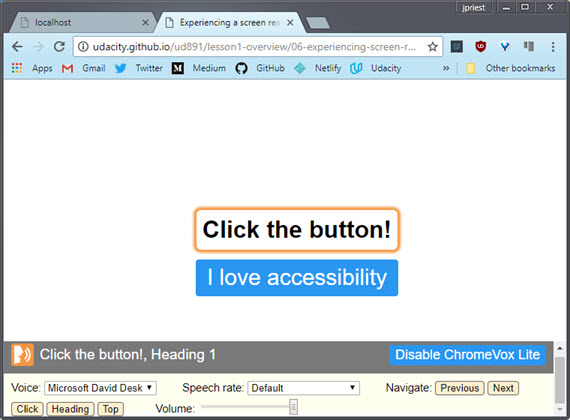](../assets/images/full-size/wa10-12.png)

**Important:** To navigate with [ChromeVox](http://www.chromevox.com/) Lite you will need to use the buttons at the bottom of the screen. If you try to just click on the button with your mouse the page will lose focus and you'll have to refresh and start over. So... no cheating! "ChromeVox Lite" is a modified version of ChromeVox which is injected into some of the pages used in this course. Using ChromeVox Lite is optional for all exercises - the examples should will work just as well with the ChromeVox extension, or any other screen reader you may already be familiar with. If you do choose to use ChromeVox Lite, it's very simple:

- Enable ChromeVox Lite via the "Enable ChromeVox Lite" button in the bottom right hand corner of the screen, or via the other "Enable ChromeVox Lite" button which appears if you press `TAB` once.
- The controls for ChromeVox Lite will appear once it is enabled:
  - The "Voice" drop-down allows you to choose alternate voices
  - The "Speech rate" drop-down allows you to make the speech faster or slower (if you find yourself getting bored waiting for ChromeVox to finish what it's saying, try speeding it up!)
  - The "Navigate" buttons allow you to move ChromeVox's focus to non-focusable items on the page, such as headers
  - Finally, the volume control allows you to fine-tune ChromeVox's volume.

### 10.12 Checklists
Because accessibility is so broad and the usership is so diverse, we're going to need a roadmap to guide us on our journey. Throughout this course we'll be referring to **WCAG**, or the **Web Content Accessibility Guidelines 2.0**.

[](../assets/images/full-size/wa10-13.png)

WCAG is a set of guidelines and best practices which have been put together by accessibility experts to try and answer the question of what accessibility means in a methodical way.

Several countries actually mandate the use of these guidelines in their web accessibility legal requirements.

WCAG is organized around four core principles.

[](../assets/images/full-size/wa10-14.png)

- **Perceivable** - The first is making sure users can perceive content. This helps us keep in mind that just because something is perceivable with one sense such as sight, that doesn't mean that all users can perceive it.
- **Operable** - Second, is it operable? Can users use UI components and navigate the content? For example something which requires a hover interaction cannot be operated by someone who can't use a mouse or is using a touchscreen.
- **Understandable** - Third, can users understand the content? Also, can all users understand the interface and is it consistent enough to avoid confusion?
- **Robust** - Is it robust enough for the content to be consumed by a wide variety of user agents and does it work with assistive technology?

Together this forms **POUR**.

While WCAG provides an extremely comprehensive set of guidelines to help us keep many facets of accessibility in mind, it can also be a bit overwhelming. To help mitigate this, the WebAIM group has distilled the WCAG guidelines down into an easy to follow checklist, targeted specifically for web content.

The webbing checklist can give you a short high level summary of what you need to implement while also linking to the underlying or tag specifications if you need an expanded definition.

Both WCAG and the checklist cover a lot of the accessibility space.The guidelines can only ever be a limited proxy for actual accessibility. What actually matters is the user experience, not just checking some box.

So while these guidelines give us a framework for thinking about accessibility, there may be places where they're incomplete or even give advice which is a little out of date. However, they're still an excellent resource for helping us integrate accessibility into our process.

With these tools in hand we can chart a direction for our accessibility work and be confident that, so long as our project is meeting the outlined criteria, our users should have a positive experience.

#### Resources

- [Web Content Accessibility Guidelines 2.0 (WCAG)](https://www.w3.org/TR/WCAG20/)
- [WebAIM Checklist for WCAG 2.0](http://webaim.org/standards/wcag/checklist)- [Web Content Accessibility Guidelines 2.0 (WCAG)](https://www.w3.org/TR/WCAG20/)
- [WebAIM Checklist for WCAG 2.0](http://webaim.org/standards/wcag/checklist)

### 10.13 Quiz: Using WebAIM Checklist
Using the [WebAIM Checklist for WCAG 2.0](http://webaim.org/standards/wcag/checklist), find the matching rule that dictates "the web page has a descriptive and informative page title."

- **Rule:** 2.4.2
- **Section:** Operable

### 10.14 Course Practicalities
1. We've heard a lot about what accessibility is and why it matters for everyone
2. We heard about some different types of impairments and what we might need to think about
3. We saw what it's like to use a screen reader
4. We took a quick look at WCAG and the WebAIM accessibility checklist

For the rest of the course we're going to dive into the practicalities of actually creating accessible websites. We're not going to just talk at you for the whole course, you're going to actually create some accessible code

We're going to organize this around three main topics

[](../assets/images/full-size/wa10-15.png)

- **Focus** and keyboard which looking at how to make sure that we build things which can be operated with a keyboard. This is important for users with motor impairments but also ensures that your UI is in a good shape for the next topic which is semantics.
- **Semantics** is where we make sure that we're expressing our interface in a robust way which works with a variety of assistive technology.And finally 
- **Styling** and visual design. We'll look at some techniques for making sure the visual UI is as flexible and usable as possible.

Now each of those topics could probably fill a whole course by themselves. So we're not going to be able to cover every single aspect of creating accessible websites. However, we're going to give you enough information to get started and point you at some good places to learn more about each topic.

I'm sure you're all eager to get started so let's begin with a look at how and why you need to think about focus in your web application.

## Lesson 11. Focus
### 11.1 Intro to Focus
In this lesson I'll be talking about focus and how you can manage it in your application.

[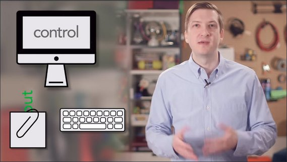](../assets/images/wa10-16.jpg)

Now in a nutshell, focus refers to the control on the computer screen that receives input from the keyboard and from the clipboard when you paste.

You're probably familiar with focus for text fields. In order to type in a text field you first have to go over with your mouse and click on it. Well that act of clicking on the text field, that's actually what focuses it. You may also know that if you then press the [tab] key it will then move focus to the next text field or available control.

Now some users drive the computer entirely with the keyboard or some other type of discrete input device. For those users, focus is absolutely critical. It's their primary means of reaching everything on the screen. And so for that reason the Web AIM checklist states in section 2.1.1, that all page functionality should be available using the keyboard, unless it's something you couldn't normally do with a keyboard like freehand drawing or something like that.

[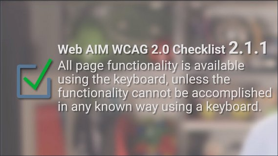](../assets/images/wa10-17.jpg)

So this is a great place to start learning about accessibility because obviously we all know how to use a keyboard. It's very easy to relate to and test, and it benefits virtually all of our users.

There's users out there with motor impairments which could be caused by anything from paralysis or even just a broken arm. Those folks may be relying on a keyboard or switch device to navigate your page, so a good focus strategy is going to be absolutely critical for them.

For the power users out there, those folks who know every keyboard shortcut on their machine and hate having to use the mouse, well, for them, being able to navigate, for instance, a form on your site, is just going to make them more productive.

So well-implemented focus strategy means everyone using your application will have a better experience. And as we'll see in the next few lessons, the work that we do today on focus is actually an important primer for supporting assistive technology users.

#### WebAIM checklist item

- 2.1.1: [http://webaim.org/standards/wcag/checklist#sc2.1.1](http://webaim.org/standards/wcag/checklist#sc2.1.1)

### 11.2 What is Focus
As you learned in the previous lesson, focus determines where keyboard events go in the page.

[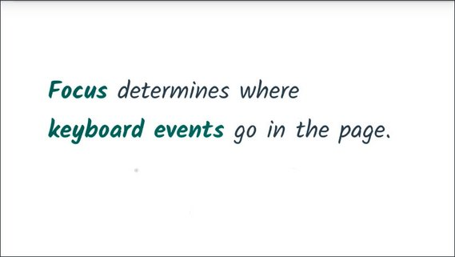](../assets/images/wa10-18.jpg)

To give you an example, if I go over and focus this text input field using my mouse and then begin typing, the input receives the keyboard events and displays the characters as I've typed them.

[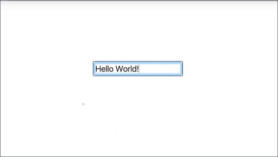](../assets/images/wa10-19.jpg)

The currently focused item is often indicated by a focus ring, where the actual styling of that ring depends on the browser and any additional styling that the page author may have applied.

As a user,you can control which element is currently focused using your keyboard. Pressing the Tab key will move focus forward through the document.

[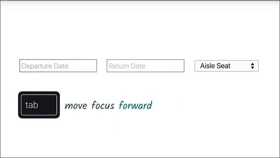](../assets/images/wa10-20.jpg)

Shift+Tab moves focus backwards.

[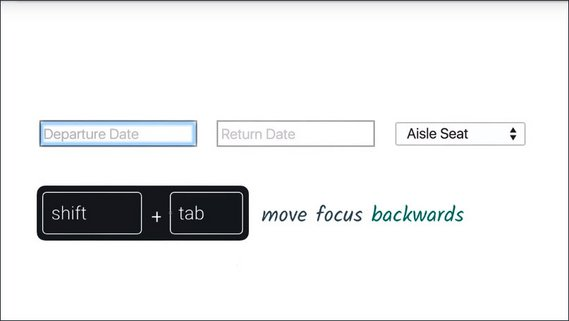](../assets/images/wa10-21.jpg)

And you can use the arrow keys to move focus around within a component.

[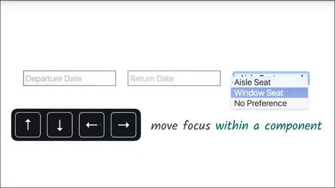](../assets/images/wa10-22.jpg)

On MacOS X, this works a little differently. While Chrome will always let you navigate with Tab, you'll need to press Option+Tab in order to change focus in other browsers like Safari.

If you like, you can change this by going to your System Preferences, going to the Keyboard section, clicking on the Shortcuts tab and then changing this radio group to say All controls.

To give you an example of focus in the real world, here I am on Wikipedia, and as I press the Tab key, the browser is going to navigate through all of the focusable elements on the page. 

[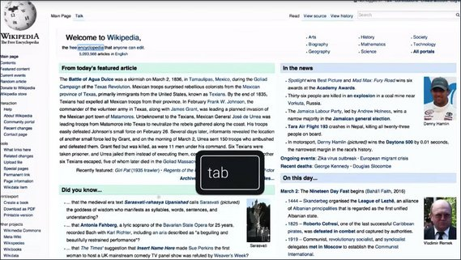](../assets/images/wa10-23.jpg)

Eventually I'll reach a stopping point and hit Shift+Tab and now I'm moving backwards through the page. This ordering is called, creatively enough, the tab order.

[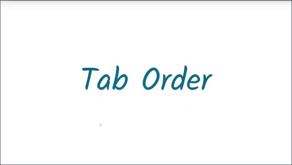](../assets/images/wa10-24.jpg)

Making sure your application has a logical tab order is an important step, which we're going to cover later on in this course.

Now built-in interactive HTML elements like input, button, and select are all implicitly focusable. Meaning that they're automatically inserted in the tab order and that they also have built-in keyboard event handling.

[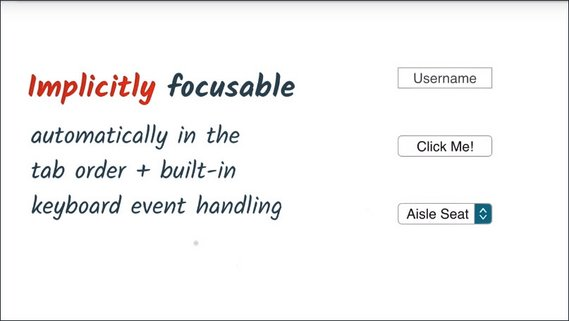](../assets/images/wa10-25.jpg)

But not all elements are focusable.

[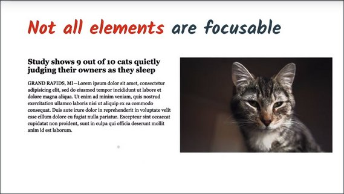](../assets/images/wa10-26.jpg)

This header, the paragraph below it, and this image are not focusable, and they're not implicitly inserted in the tab order. That's by design.There's generally no need to focus something ifa user can't interact with it or provide it some sort of input.

#### Notes
Move focus around the page using your keyboard:

- `TAB` will move focus forward
- `SHIFT - TAB` will move focus backwards
- `Arrow keys` can be used to navigate inside of a component

[https://www.w3.org/TR/html5/editing.html#focus-management](https://www.w3.org/TR/html5/editing.html#focus-management)

### 11.3 Quiz: Experience Focus
Let's try out some of the focus techniques discussed in the previous lesson. I'd like you to search for a ticket on Udacity's new Australian airline website using your keyboard.

[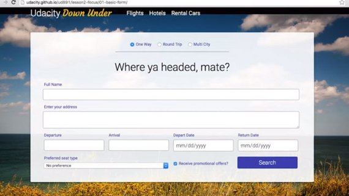](../assets/images/wa10-27.jpg)

We've disabled the mouse on this page, so you can't cheat. I'd like for you to search for a ticket that is a round trip to Melbourne leaving on 10/12/2017 returning on 10/23/2017, is a window seat, and you do not want to receive any promotional offers.

#### Quiz
Try out our [flight booking form](http://udacity.github.io/ud891/lesson2-focus/01-basic-form/) using only your keyboard. You'll need to search for a ticket that matches the following criteria:

The ticket should...

- Be a round trip
- to Melbourne
- leaving on 10/12/2017
- returning on 10/23/2017
- window seat
- and you DO NOT want to receive promotional offers 😀

If you've filled out the form correctly then pressing the Search button should give you a notification that you've passed.

#### Remember

- `TAB` will move focus forward to the next element
- `SHIFT - TAB` will move focus backwards to the previous element
- `Arrow Keys` can be used to move focus within an element

### 11.4 DOM Order Matters
So working with native elements is great for focus behavior, because they're automatically inserted into the tab order based on their position in the DOM.

To give you an example I've written a little bit of HTML here.

[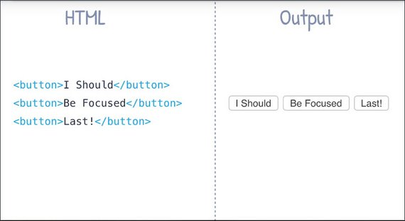](../assets/images/wa10-28.jpg)

I've got three button elements and then you can see the output over here on the right. So there's three button elements rendering inside of my browser.

Now because the tab order corresponds to the DOM order, when I go and press the tab key you'll see that the first button element gets the focus indicator around it.

[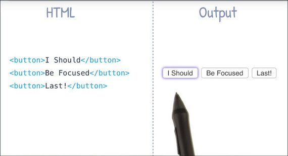](../assets/images/wa10-29.jpg)

And as I keep pressing tab, you'll see the next item in the DOM order gets focused and tab again, now the last item in the DOM order is focused.

[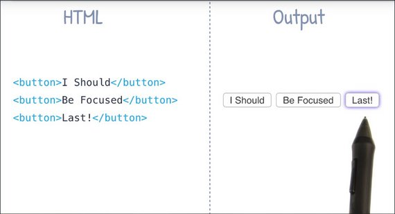](../assets/images/wa10-30.jpg)

Now it's important note that using something like CSS, it's possible to have things appear in one order on screen, but actually exist in a different order over in the DOM.

To give you an example of that, what I've done now is I've just added this inline style to my first button element and I'm telling it that I want to float to the right. 

Now what this is going to do is it's going to visually change the ordering of these buttons here such that our first DOM element is now appearing last on screen visually. So even though the visual order has changed, the DOM order remains the same.

[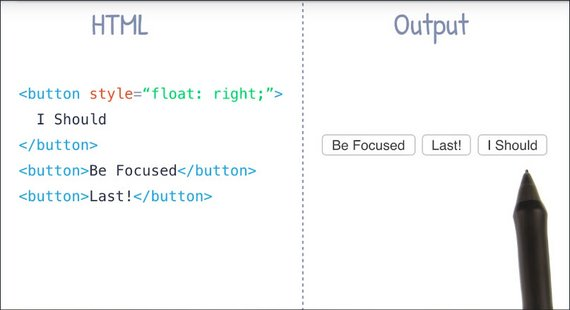](../assets/images/wa10-31.jpg)

Let's see how that effects tabbing. When I press the tab key, the first DOM element is still focused, but now visually it's the last element in this group which is kind of weird.

[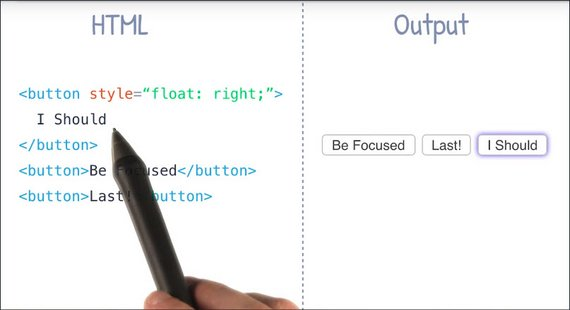](../assets/images/wa10-32.jpg)

If I press tab again, now we see that the second DOM element, which is the first visual element becomes focused.

[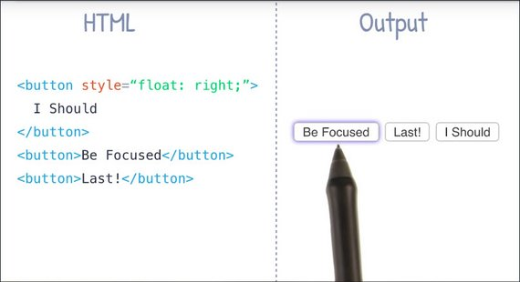](../assets/images/wa10-33.jpg)

And pressing tab again, I've got this middle element now being focused, even though that's the last DOM item.

[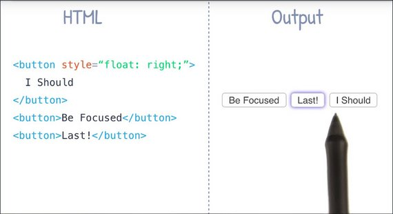](../assets/images/wa10-34.jpg)

So the moral of the story is, be careful when you're using something like CSS to visually change the position of your elements on screen. This can cause the tab order to jump around seemingly at random and for users relying on a keyboard this can be extremely confusing.

For this reason the WebAIM checklist specifically states in section 1.3.2 that the reading and navigation order as determined by code order should be logical and intuitive in your application.

[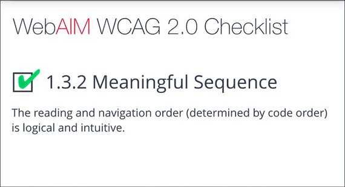](../assets/images/wa10-35.jpg)

I have just sort of a general rule of thumb. I like to tab through my page every so often just to make sure I haven't accidentally messed up the tab order. It's a good habit to adopt and it's one that doesn't really require a ton of effort on my part.

### 11.5 Quiz: Fixing DOM Order
Here's a page with a busted tab order.

[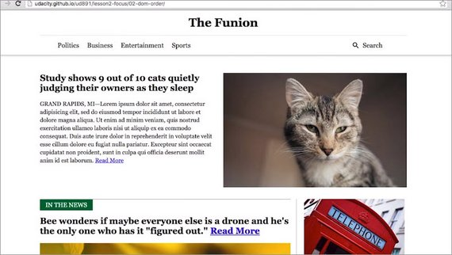](../assets/images/wa10-36.jpg)

Go ahead try to navigate this page using the keyboard only you'll find you skip around a lot. It would be much easier if we navigated in this order.

1. Navigation links
2. Search
3. Content links
4. Footer.

[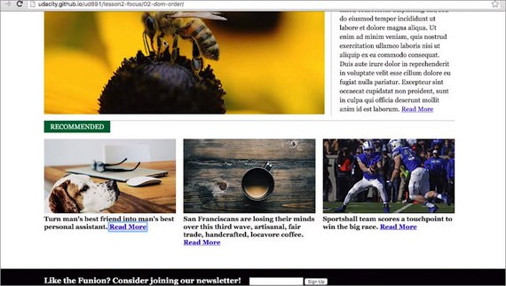](../assets/images/wa10-37.jpg)

Using a text editor, see if you can fix the order of the elements in the DOM, so that the tab order makes sense.

#### Quiz
This exercise can be found in the folder `lesson2-focus/02-dom-order` within this [course's GitHub Repository](https://github.com/udacity/ud891).

Tabbing around the page should reveal a mixed up tab order. Read through the `index.html` and see if there are any places where elements may be in the wrong order. If something looks out of place see if you can fix it so the tab order works as expected. If you get stuck you can refer to the `solution` directory.

- [View the page](https://rawgit.com/udacity/ud891/gh-pages/lesson2-focus/02-dom-order/index.html)

#### Solution
Looking at the markup for the page, I can see that the search link is actually higher in the DOM order than the other links. It's using a pull-right class to float over to one side.

The easiest thing to do is to just move the search button below the other elements. That will give the same visual presentation but now the tab order makes sense.

I also noticed that the newsletter is jumping ahead of the other elements on the page because it's absolutely positioned to appear at the bottom of the page. Just like the search link, I'll move the newsletter down to the bottom of the document just after the main element.

Now is also a good time to improve our semantics a little bit. Instead of just using a div for this element, I can replace it with a footer tag. Doing so can benefit screen readers who rely on these kind of landmarked elements to navigate the page. It's also a little more concise than div class equals footer.

I'll talk more about semantics and navigation in a future lesson.

### 11.6 Using Tabindex
Because native elements are automatically inserted in the tab order, they can be very convenient to use. But there are instances when you'll want to modify the tab order.

[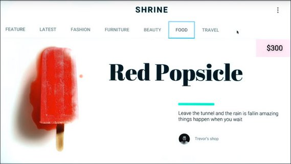](../assets/images/wa10-38.jpg)

Like if you're building a component without a native analog, like this dropdown up here,

[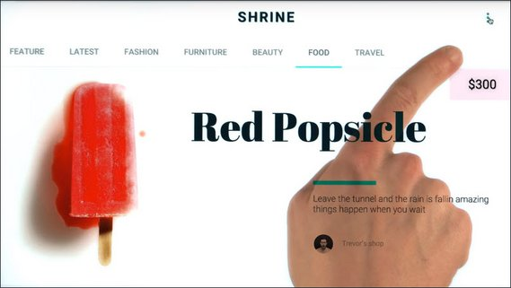](../assets/images/wa10-39.jpg)

or if you need to have something off screen that should only be focusable when it appears, like perhaps a modal window.

[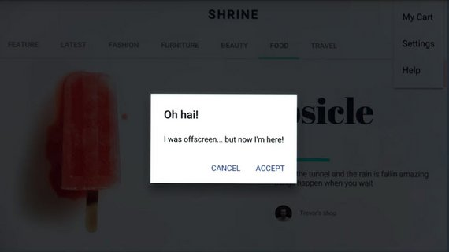](../assets/images/wa10-40.jpg)

For these cases, you can use the tabindex attribute. 

[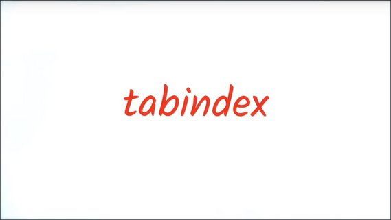](../assets/images/wa10-41.jpg)

Tabindex can be applied to any HTML element, and it takes a range of numeric values.

```html
<div tabindex="0">Focus Me!</div>
```

A tabindex of -1 means that the element will not be in the tab order, but it can be programmatically focused via JavaScript, by calling the element's `focus` method.

[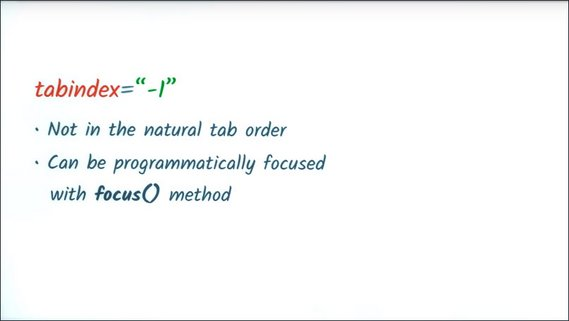](../assets/images/wa10-42.jpg)

This can be especially useful for off screen content which appears on screen in response to a user event. When the new content is displayed, you may wish to call its focus method which will then direct future keyboard events to it.

[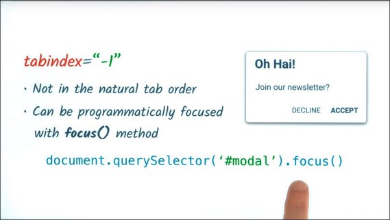](../assets/images/wa10-43.jpg)

A tabindex of 0 will add the element to the natural tab order, plus, that element will also be focusable by calling its focus method.

For example, here I've got a fancy button that I've created out of just a div.

[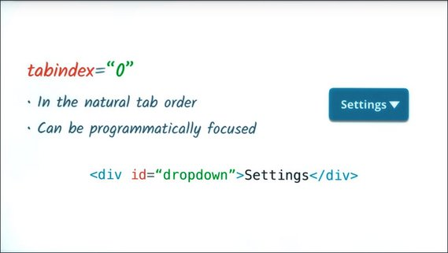](../assets/images/wa10-44.jpg)

Now, without a tabindex attribute, if I press the Tab key, this element will not receive focus.

By adding a tabindex of zero, now when I press the Tab key, this element gets focused, and future keyboard events get directed to it.

[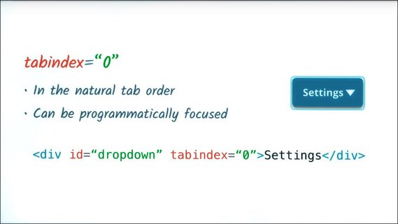](../assets/images/wa10-45.jpg)

A tabindex of greater than zero, for instance something like tab index of 5 will jump the element to the front of the tab order regardless of where it is in the DOM.

If there are multiple elements with a tabindex greater than zero, the order will start from the lowest value that is greater than zero and then work its way up.

[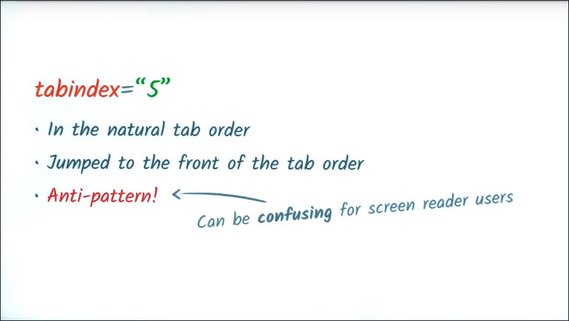](../assets/images/wa10-46.jpg)

In general, using a tabindex greater than zero is discouraged and considered a bit of an anti-pattern.

If you get in the habit of using it, you can quickly end up with a very jumbled tab order, and it can make things especially confusing for screen reader users who navigate the DOM in a linear fashion.

Ideally, if you need to put something earlier in the tab order, the best bet is to move it up in the DOM.

### 11.7 Deciding whats in focus
It's tempting, especially when you're starting to look at screen reader accessibility, to add tabindex to seemingly important elements like headers, for instance, in order to help out the user.

That's actually counterproductive. Normally, you only want to add focus behavior to interactive controls like buttons, tabs, drop downs, or anything that the user might provide input to.

If you're worried about visually impaired users missing out on your content, don't be. We're going to show in the next few lessons how screen reader users explore non interactive content.

So when you're adding a tabindex attribute, stop and ask yourself, is this something the user is going to interact with? If the answer is no, you almost certainly want to leave it alone with the exception of a few caveats which will cover in just a moment.

### 11.8 Quiz: Which Elements should have focus
Rob just told us that we should typically only add tabindex attributes to interactive elements and not our site content.

With that in mind, given the following page, check the box for any element which should be focusable. This could be an element that is natively focused or one that you might add a tab index to.

[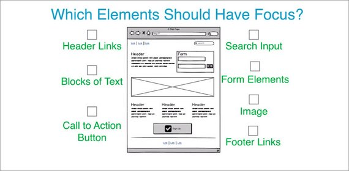](../assets/images/wa10-47.jpg)

#### Solution
The following elements should have focus.

- Header links,
- Search fields,
- Form input fields
- Submit button
- Large Call to Action button
- Footer links.

[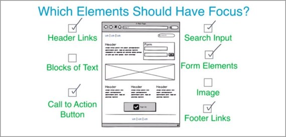](../assets/images/wa10-48.jpg)

I'm not going to add tabindex to any headings or the paragraphs of text. Even if that content seems super important, it's not something the user can interact with, so there's no reason to make it focusable.

Similarly, even if the big image is really awesome, there is no reason to make it focusable. Screen reader users will still be able to understand the content of the image, so long as we provide proper Alt tag support,which Alice will touch on in just a few lessons.

### 11.9 Managing Focus
I mentioned previously that you shouldn't add tab index to site content as a general rule, but there is one exception and that's when you're manipulating the page in response to a user action.

A scenario might be that a user goes and clicks on one of these menu items and the page then does an animated scroll, down to that particular section.

[](../assets/images/wa10-49.jpg)

Or, if you are building a single page web app, clicking on one of the navigation links changes the content of the page without doing a full page refresh.

In either of these situations, you'll want to

- pick an appropriate header
- give the tabindex a negative one so it doesn't appear in the natural tab order
- call its focus method after the user has taken their action.

This process is known as Managing Focus, and it's an extremely important technique that keeps the user's interactive context in sync with the visual representation of the site.

[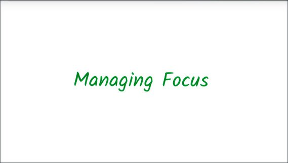](../assets/images/wa10-52.jpg)

Let's go through that single page app scenario I just discussed and I'll highlight what happens when we don't manage focus. And then demonstrate how the experience can be improved when we do manage focus.

#### Before
So here we are back at our site. I'm going to go click on the "What is Vegemite link?" link and when I do that I'm going to want to start clicking around some of the anchors in the main page content.

[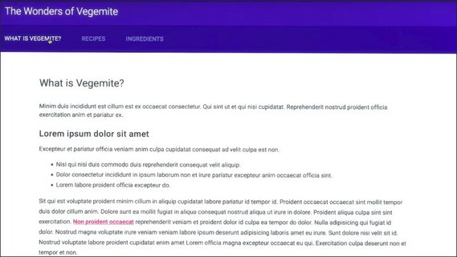](../assets/images/wa10-53.jpg)

So using my keyboard, I'll navigate over there. I'll press enter and now I'd like to click the link in the body content, but in order to get there I'm going to have to tab back through my navigation.

Now, there's only a few navigation items here so it's not the biggest deal in the whole world. But you can imagine on a complex site with a lot of navigation, that it could be a lot of work to get through all of that.

Furthermore, as a screen reader user, I might not even know that the page content has loaded in and changed yet. I may just be sort of sitting around waiting for something to happen after I've clicked that link.

Let's see if we can improve upon this a little bit.

#### After
So what I'm going to do is, take the heading and I'm going to give it a tabindex of -1.

If you recall, that means the element won't be in the tab order, but I can programmatically focus it using JavaScript.

[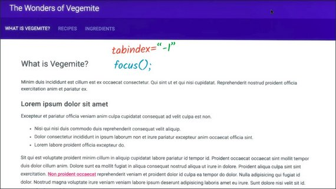](../assets/images/wa10-50.jpg)

Now, I can
- listen for my anchor clicks
- I can tell the page content to update
- I can call the focus method of that header.

Once I've done that, the user will then be moved down in here, inside of our main page content, and then can then quickly `Tab`, or `Shift+Tab` to whatever they want.

[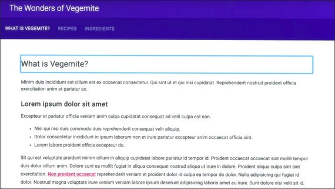](../assets/images/wa10-51.jpg)

Now you might notice that as we do this, the header itself gets a large focus ring placed around it. I'm going to talk more about styling focus in a future lesson.

### 11.10 Quiz: Manage Focus Yourself
Here's a classic single page web app where clicking a navigation item will change the page content.

[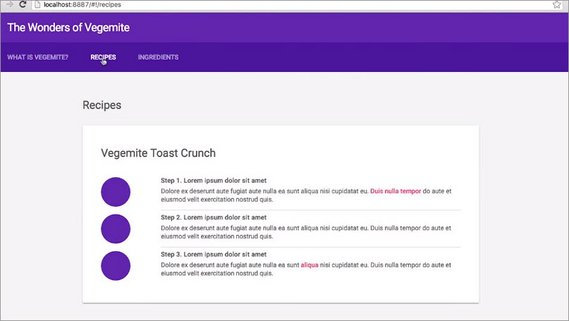](../assets/images/wa10-54.jpg)

Using your JavaScript skills make it so each heading is properly focused when the user clicks a navigation link.

#### Solution
Inside each section of the page, I'm going to find an appropriate header like these h2s, and give it a tab index of negative 1.

[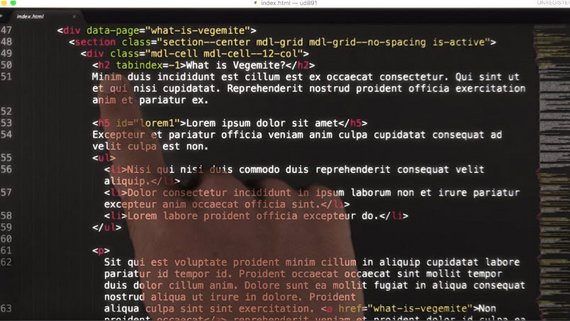](../assets/images/wa10-55.jpg)

Next, I'll open the router code in main.js. 

[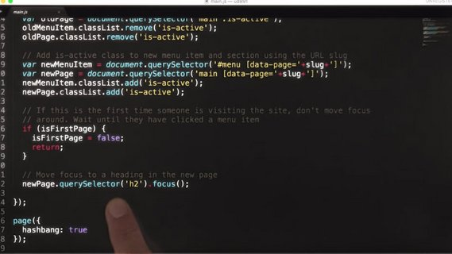](../assets/images/wa10-56.jpg)

When the page changes, I'll look for a new header by calling newPage.querySelector h2 and its focus method. To prevent this code from running the first time the user visits the site, I'll add a little guard variable called isFirstPage and set that to false after the first page runs.

```js
var isFirstPage = true;

page('/:slug', function(context) {
  // This will match any value after the first / in the url. For example, if
  // the url was /foo, the value of slug would be "foo".
  var slug = context.params.slug;

  // Remove is-active class from previous menu item and section
  var oldMenuItem = document.querySelector('#menu .is-active');
  var oldPage = document.querySelector('main .is-active');
  oldMenuItem.classList.remove('is-active');
  oldPage.classList.remove('is-active');

  // Add is-active class to new menu item and section using the URL slug
  var newMenuItem = document.querySelector('#menu [data-page='+slug+']');
  var newPage = document.querySelector('main [data-page='+slug+']');
  newMenuItem.classList.add('is-active');
  newPage.classList.add('is-active');

  // if first visit then don't set focus to h2 element
  if (isFirstPage) {
    isFirstPage = false;
    return;
  }
  // set focus to h2 in the new page
  newPage.querySelector('h2').focus();
});
```

From then on, anytime we switch to a new page, our header focus code will run.

### 11.11 Skip Links
Since we're on the subject of focus management, let me show you another really useful technique.

On most websites the main content is usually not the first thing in the DOM, instead we often begin with navigation, sublists, side bars, hamburger menus, and other bits of page scaffolding.

[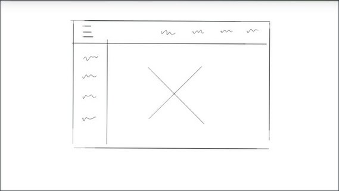](../assets/images/wa10-57.jpg)

This means that keyboard and screen reader users must first navigate through all of this content before they can get at the actual heart of the page. For users with motor impairments this is especially frustrating.

A user who's unable to move their arms might be navigating the page with a switch device, which they activate by tapping their head. This user is going to have to tap over and over again to get through all of these elements before they can get to our content, and that's not cool.

Thankfully, there's an easy to implement solution to this problem. Let's create a hidden link that allows keyboard and switch device users the ability to jump straight to our page content. These links are often referred to as skip links.

[](../assets/images/wa10-57.jpg)

Let me show you an example.

Here we are on the Funion news site. I have some navigation at the top which normally the keyboard user would have to tab through. Instead, when I press tab, the first thing I'm presented with is a little option up here in the top of the corner, which is asking if I'd like to skip down to the main content.

[](../assets/images/wa10-59.jpg)

Pressing Enter will then move focus down to the main content area, bypassing all of our navigation.

Implementing a skip link is actually really easy. I'll start by creating a named anchor. So the href of this anchor refers to the ID of another element that I'll have on the page. I'm also going to give this element a class of skip-link so I can refer to it in CSS later.

```html
<a href="#maincontent" class="skip-link">Skip to main content</a>

<nav>
  ...
</nav>

<main id="maincontent">
  ...
</main>
```

I want the skip link to appear early in the DOM, so I'm going to put it before my navigation. To connect my skip-link to my main content, I'll give my main element an ID of maincontent, which matches the href value so the anchor and the main section are now connected.

In newer versions of Chrome and Firefox just doing this right here will allow you to move focus down to the main element when the skip-link is pressed. But for older browsers which don't move focus when named anchors are clicked, I'm also going to want to add a tabindex -1.

```html
<main id="maincontent" tabindex="-1">
  ...
</main>
```

Over in my CSS, I'll make sure that the skip-link has an absolute position, so it can appear in the top left corner of the screen. But I'm going to make it initially positioned off screen by setting the top value to -40 pixels.

Then I can use the focus pseudo class to move the element back on screen. We'll talk more about the focus pseudo class in a later lesson, but the short explanation is that this pseudo class matches anytime the corresponding element gains focus.

```css
.skip-link {
  position: absolute;
  top: -40px;
  left: 0;
  background: #bf1722;
  color: white;
  padding: 8px;
  z-index: 100;
}
.skip-link:focus {
  top: 0;
}
```

With these simple techniques, we've removed the road blocks from the path of our keyboard users and greatly improve their experience.

You can [read more about skip links in this article](http://webaim.org/techniques/skipnav/) on the Web AIM site.

Google article on focus management: [https://developers.google.com/web/updates/2016/03/focus-start-point?hl=en](https://developers.google.com/web/updates/2016/03/focus-start-point?hl=en)

### 11.12 Focus in Complex Components
Managing focus when you navigate on the page is really important. But sometimes you'll need to manage focus at the component level as well, especially if you're building a complex custom widget.

To show you what I mean, take a look at this native select tag and notice how I can focus it and once there, I can use the arrow keys to expose additional functionality, like selecting different options.

[](../assets/images/wa10-60.jpg)

If you were building a custom select element yourself or something similar like a drop-down, you would need to expose these same kinds of behaviors so that your users who rely primarily on the keyboard could still interact with your control.

Now knowing which keyboard behaviors to implement can be a bit of a guessing game but, thankfully there's a really helpful guide which you can refer to.

The ARIA design pattern stock, lists various kinds of components as well as the sorts of keyboard interactions that they support.

[](../assets/images/wa10-61.jpg)

Now, Alice is going to cover ARIA in more detail in the following sections, but for now, let's use this guide to help us add keyboard support to a new component which we're going to build.

#### Resources
The ARIA Authoring Practices doc (or "ARIA Design Patterns doc") is a great resource for figuring out what kind of keyboard support your complex components should implement.

There are currently two versions:

- [WAI-ARIA Authoring Practices 1.0](https://www.w3.org/TR/wai-aria-practices/)
- [WAI-ARIA Authoring Practices 1.1](https://www.w3.org/TR/wai-aria-practices-1.1/) (Newer working draft)

I personally prefer the 1.1 version because the layout is a bit easier to navigate and it includes a few fixes currently missing from the 1.0 version.

### 11.13 Keyboard Design Patterns
Here's a custom component I've been working on which closely resembles a radio group.

[](../assets/images/wa10-62.jpg)

To determine what kind of keyboard support it needs, I'll check the Aria Design Patterns guide and I then jump down to Section 11 which lists all of the various components and their patterns.

[](../assets/images/wa10-63.jpg)

Once we're down here, I'll look for a component that sort of matches the one that I'm building. In this case I can see that there's a radio button. So I'll click on that and based on the recommendations there are a number of keyboard handlers that I know I now need to implement.

[](../assets/images/wa10-64.jpg)

Using this guide I'm going to implement the Down Arrow slash Right Arrow support in my element. Now when the user presses the down arrow we know that our radio group should move focus to the next radio button, it should select that button, and if focus is on the last item, then focus will wrap around to the first item.

To do this, we're going to use a technique called roving focus. Roving focus works by setting tab index to -1 for all of the children and then zero on the currently active item. 

[](../assets/images/wa10-65.jpg)

Our component then uses a keyboard event listener to determine which key the user has pressed. At which point we set tabindex on the next item to zero, we set tabindex of the previously focused item to negative one.

We call the focus method of this new soon to be focused item, this now moves our focus ring. And lastly I'm going to just move this checked attribute down to this element using setAttribute. In this case I'm using the CSS in my element based on that checked attribute to style the state of the radio button.

[](../assets/images/wa10-66.jpg)

Now when I reach the bottom of this list and this last radio is focused and the user presses the down arrow, then we're going to wrap back around.

[](../assets/images/wa10-67.jpg)

So we'll set tab index to zero on this top item. We'll move checked over there or call focus and we'll set tab index to negative one on the previously focused item.

[](../assets/images/wa10-65.jpg)

For building complex components running focus is a really invaluable technique. So in the next lesson, you're going to take a crack at implementing it yourself using the same example.

#### Resources
Take a look at the ARIA Authoring Best Practices guide to read more about the Radio pattern. I've linked to both versions so you can choose whichever one you prefer. Both patterns are nearly identical but do note that the 1.0 version is called "Radio Button" and the 1.1 version is called "Radio Group".

- [ARIA Authoring Best Practices 1.0 (Radio Button)](https://www.w3.org/TR/wai-aria-practices/#radiobutton)
- [ARIA Authoring Best Practices 1.1 (Radio Group)](https://www.w3.org/TR/wai-aria-practices-1.1/#radiobutton)

[https://www.w3.org/TR/wai-aria-practices/#aria_ex](https://www.w3.org/TR/wai-aria-practices/#aria_ex)

### 11.14 Quiz: Adding Keyboard Event Listeners
You can find the files for this example in the `lesson2-focus/05-radio-group` directory within this [course's GitHub Repository](https://github.com/udacity/ud891).

Using the ARIA Authoring Best Practices doc (either [version 1.0](https://www.w3.org/TR/wai-aria-practices/) or [version 1.1](https://www.w3.org/TR/wai-aria-practices-1.1/)) find the radio pattern and implement support for the `Down Arrow and Right Arrow` pattern using the "roving focus" technique. I should point out that you'll also sometimes see this referred to as "roving tabindex."

**Note:** The 1.0 version of the doc refers to this as a "Radio Button" whereas the 1.1 version of the doc refers to this as a "Radio Group".

You'll want to work in the `radiogroup.js` file to implement your keyboarding support.

#### Solution

##### HTML
```html
  <body>
    <div class="demo">

      <h3>Drink Options</h3>

      <ul id="group1" class="radiogroup">
        <li tabindex="0" class="radio" checked>Water</li>
        <li tabindex="-1" class="radio">Tea</li>
        <li tabindex="-1" class="radio">Coffee</li>
        <li tabindex="-1" class="radio">Cola</li>
        <li tabindex="-1" class="radio">Ginger Ale</li>
      </ul>

    </div>
  </body>
```

##### JS
```js
(function() {
  'use strict';

  // Define values for keycodes
  var VK_ENTER      = 13;
  var VK_SPACE      = 32;
  var VK_LEFT       = 37;
  var VK_UP         = 38;
  var VK_RIGHT      = 39;
  var VK_DOWN       = 40;

  // Helper function to convert NodeLists to Arrays
  function slice(nodes) {
    return Array.prototype.slice.call(nodes);
  }

  function RadioGroup(id) {
    this.el = document.querySelector(id);
    this.buttons = slice(this.el.querySelectorAll('.radio'));
    this.focusedIdx = 0;
    this.focusedButton = this.buttons[this.focusedIdx];

    this.el.addEventListener('keydown', this.handleKeyDown.bind(this));
  }

  RadioGroup.prototype.handleKeyDown = function(e) {
    switch (e.keyCode) {

      case VK_UP:
      case VK_LEFT: {

        e.preventDefault();

        // This seems like a good place to do some stuff :)
        if (this.focusedIdx === 0) {
          this.focusedIdx = this.buttons.length - 1;
        } else {
          this.focusedIdx--;
        }
        break;

      }

      case VK_DOWN:
      case VK_RIGHT: {

        e.preventDefault();

        // This seems like a good place to do some stuff :)
        if (this.focusedIdx === this.buttons.length -1) {
          this.focusedIdx = 0;
        } else {
          this.focusedIdx++;
        }

        break;
      }
    }

    this.changeFocus(this.focusedIdx); // <-- Hmm, interesting...
  };

  RadioGroup.prototype.changeFocus = function(idx) {
    // Set the old button to tabindex -1
    this.focusedButton.tabIndex = -1;
    this.focusedButton.removeAttribute('checked');

    // Set the new button to tabindex 0 and focus it
    this.focusedButton = this.buttons[idx];
    this.focusedButton.tabIndex = 0;
    this.focusedButton.focus();
    this.focusedButton.setAttribute('checked', 'checked');
  };

  var group1 = new RadioGroup('#group1');

}());
```

### 11.15 Offscreen Content
Remember our previous lesson about making sure elements appear in the DOM in a way that makes sense for the tab order? Well, what do you do when you have content which isn't on screen yet, but still needs to be in the DOM?

[](../assets/images/wa10-68.jpg)

A good example of this is a responsive drawer panel. Now this is a really common UI pattern and it can present an interesting challenge for accessibility.

[](../assets/images/wa10-69.jpg)

To illustrate this, here is the desktop version of that same site and I want you to notice what happens as I press the tab key. Focus will start off up here in the corner.

[](../assets/images/wa10-70.jpg)

It will then move to the search input, then to the button in the upper right corner, and then it's just going to disappear.

After pressing the tab key many more times, focus finally appears back on a link within the  body of the page.
So, what happened there? Why did it disappear?

That whole time that focus was off screen. It was actually hiding inside of this drawer panel going through and focusing all of these individual links.

[](../assets/images/wa10-71.jpg)

Well this isn't really a great situation to be in, and when you're building an application you might occasionally find that as you're tabbing around focus seems to suddenly just disappear.

To figure out what's going on, you may need to do a bit of detective work. If you're tabbing around and you notice focus suddenly disappears, you can go into your console and log the `document.activeElement`.

[](../assets/images/wa10-72.jpg)

Active element gives you a reference to the currently focused item,which in this case looks like some kind of fancy button. So you can go and look for our fancy button here in our source code and make sure that it's not focusable.

Another option to do our detective work is to use the chrome accessibility DevTools extension. The DevTools extension adds a number of useful features, including an inspector which will show you the accessibility properties of an element, as well as a set of accessibility audits.

You can find these by opening the DevTools and going to the Audits section.

[](../assets/images/wa10-73.jpg)

I've unchecked everything except for the Accessibility audit itself and I'm going to run it against the present state of my page. When I do this, you'll see that it produces a number of errors, including items that are focusable, but either invisible or obscured by another element.

[](../assets/images/wa10-74.jpg)

And looking at that list, we can see our fancy button and all of the other anchor tags inside of that off screen menu.

To fix the drawer menu, one option would be to set it to either `display: none` or `visibility: hidden` using CSS whenever it's off screen.

This will prevent focus from being able to move into that element and focusing any of the child links inside of it. And then when the element comes back on screen, or just before it's about to animate on screen, we can set it back to `display:block` or set the visibility back to visible.

Now in the next section, we'll have you do some sleuthing of your own using these tools to find some off screen content and then to fix it.

#### Resources
To find your missing focus you can type the following into your console:

`document.activeElement`

[Read more about Document.activeElement on MDN](https://developer.mozilla.org/en-US/docs/Web/API/Document/activeElement)

Another tool you can use is the [Chrome Accessibility Developer Tools Extension](https://chrome.google.com/webstore/detail/accessibility-developer-t/fpkknkljclfencbdbgkenhalefipecmb?hl=en). This extension will not only add an `Accessibility Properties` panel to your Elements inspector, but it also adds an `Accessibility` option to the audits panel. Using this option you can quickly find accessibility issues in your page which you might have otherwise missed.

### 11.16 Quiz: Implementing Offscreen Content
The files for this exercise can be found in the `lesson2-focus/04-offscreen-content` directory within this [course's GitHub Repository](https://github.com/udacity/ud891).

Using either the [Accessibility Developer Tools extension](https://chrome.google.com/webstore/detail/accessibility-developer-t/fpkknkljclfencbdbgkenhalefipecmb?hl=en) or `document.activeElement` see if you can track down the element that's stealing focus and fix the page.

#### Solution
I used `document.activeElement` to find the offending (offscreen) button element.  The button's container was then set to `display: none`.

### 11.17. Keyboard Traps & Modals
We can sometimes run into trouble when building a widget if the widget functionality creates a keyboard trap. Let me show you an example. 

Here I've got an autocomplete widget. I can press the Tab key to focus it. I can start typing, which will give me a list of city names. I can press the down key to focus one and then can press Tab again to complete the selection.

[](../assets/images/wa10-75.jpg)

Now, the next thing I want to do is move to this next field by pressing Tab. So I'll hit Tab once more and the focus does not change. What's happening is this autocomplete thinks I'm still trying to finish my complete action. So no matter how many times I press Tab I'm just sort of stuck here.

This is what's known as a keyboard trap. It can be very frustrating for users. In fact, Section 2.1.2 of the WebAIM checklist specifically calls this out. Stating, the keyboard focus should never be locked or trapped at any one particular page element.

[](../assets/images/wa10-76.jpg)

The user should be able to navigate to and from all page elements using just their keyboard. But strange as it may seem, there are times when this behavior is actually desirable.

Take for instance, the modal window.

[](../assets/images/wa10-77.jpg)

Now, normally when a modal window is displaying on screen, we don't want the user to be able to access any of the content behind it. Oftentimes developers will add an overlay to cover the page, but that doesn't stop keyboard focus from accidentally traveling outside of the model.

Here, I'll tab through this dialog. So I'll press the Tab key, which will focus the Decline button.

[](../assets/images/wa10-78.jpg)

I'll tab again, which focuses the Accept button. And I tab one more time. No, it looks like our focus has now moved behind the modal window.

[](../assets/images/wa10-79.jpg)

Now in instances like this what we want is a temporary keyboard trap to ensure that we track focus within the modal wall it's displaying. And then that we can restore it to the previously focused item once the model is closed.

This can be a tricky technique to implement, and while there are proposed ideas on how to make it easier for developers, for instance, like this dialogue element here, they don't currently have widespread browser support. Meaning, we're going to have to roll up our sleeves and implement this ourselves.

[](../assets/images/wa10-80.jpg)

So here's an example of what I'm going to try to build. I've got a little open modal button in the top corner and when I focus it and hit Enter, I get a modal dialog.

[](../assets/images/wa10-81.jpg)

I can tab through it, and the focus is trapped. I can hit the button and it closes the model dialog. I can hit Escape or click the background, and it'll close it and restore focus to that button.

- The app can be view here: [Modal Keyboard Trap](https://rawgit.com/udacity/ud891/gh-pages/lesson2-focus/07-modals-and-keyboard-traps/solution/index.html)
- The code can be viewed here: [GitHub source for Modal Keyboard Trap](https://github.com/udacity/ud891/tree/gh-pages/lesson2-focus/07-modals-and-keyboard-traps/solution)

Now I realize this is a ton of code. I sort of think of the accessible model window as one of the boss battles in accessibility. So, what I want you to do in the next lesson is use some of this code to implement a modal window yourself. And that way you'll have a deeper understanding of how all of this works.

#### Resources
WebAIM checklist items:

- 2.1.2: [http://webaim.org/standards/wcag/checklist#sc2.1.2](http://webaim.org/standards/wcag/checklist#sc2.1.2)

[`<dialog>` on MDN](https://developer.mozilla.org/en-US/docs/Web/HTML/Element/dialog)

### 11.18. Lesson Summary
Using the skills we've covered in this lesson you should now be well equipped to implement a solid focused strategy in your application.

The next step is to take all these various interactive controls that we've been working with and start to infuse them with some meaning.

For instance, when a screen reader lands on your custom radio buttons, how is it going to tell the user that these are in fact radio buttons and not just a bunch of divs. For that, we're going to need to learn about semantics and I'm going to turn it over to Alice to tell you all about it.

## Lesson 12. Semantics
### 12.1 Semantics Introduction
We just saw how we can make things accessible to anyone who can't use a mouse or pointing device. Whether that's because it's any type of physical impairment or a technology issue or simply personal preference.

[](../assets/images/wa12-1.jpg)

You would have seen that, while it definitely requires some care and thought, it's not a huge amount more work if you plan it from the beginning. Once that work is done, you're already a long way down the path to a fully accessible site.

Already, you've made your site usable by more people than if you hadn't addressed keyboard usability, and given your site a more polished completed feel.

In this lesson, we're going to build on that work and get you thinking about other accessibility factors like how do we build our websites to support users like Victor who can't see the screen at all.

We'll start with some background on assistive technology, the general term for things like screen readers. These are tools that are designed to help users whose impairments can prevent them from accessing information technology at all.

Next up, we'll take a look at the general user experience concepts. We'll build on this to take a deeper dive into the experience of users of assistive technology.

Then finally we'll move in to how we can use HTML effectively to create a good experience for these users and we'll see that actually does overlap quite a lot with the way we address focus.

First, let's talk a bit about assistive technology.

### 12.2 Assistive Technology
Assistive technology is an umbrella term for a broad range of devices, software, and tools that help any person with a disability complete a task.

[](../assets/images/wa12-2.jpg)

In the broader sense this include something as low tech as a crutch to help someone walk or magnifying glass to assist reading, or as high tech as a robotic prosthesis or image recognition software running on a smartphone.

It can include something as general as browser zoom or as specific as a custom-designed game controller. It can be a separate physical device like a braille display, or be implemented completely in software like voice control. It can be built into an operating system like some screen readers or it can be an add-on like a Chrome extension.

Assistive technology in particular is pretty blurry. After all, all technologies being built to assist people with some task or another, and things often move in and out of the assistive technology category.

For example, one of the earliest commercial speech synthesis products was a talking calculator for the blind, and now we see speech synthesis popping up all over the place, from driving directions to virtual assistance.

On the other hand, technology which is general purpose often finds an assistive use. For example, people may use their smartphone's camera zoom to get a better look at something small in the real world.

In the context of web development we're still talking about a diverse range of technologies that we want to support. People may interact with your website using a screen reader or braille display with a screen magnifier, via voice control, using a switch device, or some other form of assistive technology which adapts the page to create a more specific interface that they can use.

[](../assets/images/wa12-3.jpg)

For all of these technologies, ensuring that our website support assistive technology uses is going to come down to programmatically expressed semantics. But before we can explain exactly what programmatically expressed semantics refers to, we need to talk a little bit about affordances.

### 12.3 Affordances
When we use any manmade tool or device, we typically look to its form and design to give us an idea of what it does and how it works.

A classic example is a kettle.

[](../assets/images/wa12-4.jpg)

I can look at this kettle and recognize that the handle side is the one I'm meant to grab, even if I've never seen one before, because I've seen the same basic shape on things like coffee mugs, pots, pitchers, and various other things.

It serves a practical purpose. It's shaped so I can comfortably get my hand around it, and it's insulated. But also, the fact that I've seen many similar handles before gives me a visual clue here. After all, I could probably pick the kettle up by the spout if I really wanted, although I'd probably end up burning myself, and it'd be pretty tricky to pour water out of it.

When it comes to graphical user interfaces, affordances still represent the actions we can take, but now they're more metaphorical since there's no physical object to interact with.

Some classic examples of technology affordances are buttons, you will be hard pressed to find any software UI without at least one button on it, and sliders from scroll bars to playback controls to price limits.

Something I like to think about is how real world objects get translated into purely visual metaphors to create those affordance cues for graphical user interfaces. For example, you can clearly see a button on a keyboard reflected in a button element and a checkbox on a ballot paper in a checkbox element.

While some graphical UI influences may not be immediately obvious to new users, for example,someone new to computers might need to experiment to learn to use scroll bars. People generally learn the visual cues quickly with little or no training.

Well designed affordances enable people to do something with as little training as possible.

### 12.4 Quiz: Affordances
The next quiz is all about thinking about what we know about the graphical UI affordances provided by HTML. Let's take a look at some of the most common affordances we see on webpages.

All of the form elements we use on that flight-booking site have some familiar semantics which give us cues as to how we use them.

In this exercise all you need to do is match up a screenshot of the UI element with the semantic meaning on the right.

#### Solution

[](../assets/images/wa12-5.jpg)

This date field means I should enter the US date.A check box is a yes or no option.Here, I see I can enter one line of text.Radio buttons mean I can choose one option.And this button here let's me know it will perform an action.

### 12.5 Semantics & Assistive Technology
So that's a little background out of the way. Now you can probably see where I'm heading with all this. Someone who can't see the screen, can't access the visual information in the interface. And someone who is using voice control relies on the voice control software being able to interact with the web page.

So we need to make sure that information is expressed in a way which is flexible enough to be accessed programmatically by assistive technology, which can then create an alternative user interface to suit its users needs.

We refer to this as expressing the semantics of an element. The Web AIM checklist explicitly calls this outing guideline 4.1.2, saying "Name, Role, Value: markup is used in a way that facilitates accessibility."

[](../assets/images/wa12-6.jpg)

Okay, that's kind of terse. The Web Content Accessibility Guidelines go into a bit more detail. "For all user interface components, the name and role can be programmatically determined; states, properties, and values that can be set by the user can be programmatically set."

[](../assets/images/wa12-7.jpg)

So what are name role and value, and how can we make sure that they can be programmatically determined and set? To answer that, we're going to start off by trying things out from the point of view of someone using assistive technology.

Just before we jump into that I want to quickly mention that in this course we will be working mostly with screen readers, but a lot of the work we do to support screen readers also benefits users who use other assistive technologies. Things like voice control and switch control use the same programmatically expressed semantics.

In the introduction we had a first look at using a screen reader. Now were going to try using one without any access to the web pages visible interface.

### 12.6 Quiz: Screen reader 1
Now let's book a flight using a screen reader. We've modified the flight reservation page, so that you can't see what you're doing anymore. You'll have to use the screen reader.

[](../assets/images/wa12-8.jpg)

You might want to refer back to the earlier exercise if you get stuck. Use the provided form to book a one way ticket to Melbourne with a window seat.

Try out the [flight booking form](http://udacity.github.io/ud891/lesson3-semantics-built-in/02-chromevox-lite/, then come back here once you've successfully filled it out.

### 12.7 Role, Name, Value
A screen reader actually largely creates the user interface for the user based on the programmatically expressed semantics.

Instead of a visual UI, the screen reader provides an auditory interface.

You probably noticed in the previous exercise that the screen reader told you some information about each element.

[](../assets/images/wa12-9.jpg)

Roughly speaking, we can expect some subset of the following information to be expressed.

- What type of element it is? We call this an elements **role** (green). Sometimes a screen reader might simply state the element's role, other times it might play an easily recognizable sound to avoid constant repetition. Sometimes it might do both.
- The screen reader will announce an elements **name** (blue), if it has one.
- It will announce what its **value** (purple) is, if it has one.
- It will also announce any information it has about an element's **state** (gold).

So broadly speaking, if we've done things right, we can expect to hear information about an element's **role**, **name(label)**, **state**, and **value**.

[](../assets/images/wa12-10.jpg)

### 12.8 Quiz: Screen reader 2
This time we have a different form which we've hidden from view again. Let's use the screen reader to find the first form field, and then we want to find out its **role** and its **label**.

[](../assets/images/wa12-8.jpg)

Visit the [mystery form](http://udacity.github.io/ud891/lesson3-semantics-built-in/03-experience-screen-reader/) and use ChromeVox Lite or another screen reader to find the first form field. What role and name does it have?

#### Solution
Identify the role and label of the first form field:

If I press the Tab key, it takes me straight to the first form field. It announces:

>"Your email address, edit text."  

So its Role is, "edit text", and its Label is, "your email address".

- **Role:** Edit text
- **Label:** Your email address

### 12.9 The Accessibility Tree
Okay, this might sound a bit strange but imagine you're building a user interface for screen reading users only.

So you don't need to create any visual UI at all. Just provide enough information for the screen reader to use. How would you express the form interface we used in the previous exercise?

[](../assets/images/wa12-9.jpg)

Well, what you'd be creating is kind of an API describing the page structure. That sounds kind of like the DOM API, but we can get away with **less information and fewer nodes** because a lot of that information is useful only for visual presentation.

Something like this.

[](../assets/images/wa12-11.jpg)

This enables a screen reader user to jump in between high level sections and then get enough information about each form element's affordances to know how to fill them in.

Remember, for a screen reader user, the screen reader provides the affordances based on the role alone without caring about the visual style.

This is more or less what the browser actually does present to the screen reader. What happens is that the browser takes the DOM tree and modifies it to turn it into a form which is useful to assistive technology.

We refer to this modified tree as the accessibility tree.

In my mind, the accessibility tree conceptually looks a bit like an HTML page from the 90s. You may have seen web pages that look like this. You can picture the mark up, I'm sure. A few carefully chosen images, a lot of links, a text box and a button.

[](../assets/images/wa12-12.jpg)

Visually scanning down the page in this case gives you an experience pretty similar to what a screen reader user would get.

### 12.10 Quiz: DOM & A11y tree matching
Which of these accessibility structures matches the DOM structure on the left?

[](../assets/images/wa12-13.jpg)

### 12.11 Semantics in Native HTML
So you have the DOM tree and we know the browser transforms this into the accessibility tree.

It can do this because much of the DOM has **implicit semantic meaning**. That is, the DOM is using standard native HTML elements that are automatically recognized by browsers and work predictably on a variety of platforms.

Accessibility for native HTML elements such as the standard link or button, is handled automatically as well.

We can take advantage of that built in accessibility by writing HTML which expresses the semantics of our page directly.

### 12.12 Quiz: Writing Semantic HTML
In this example, we have a single element on the page that looks like a button, but if we take a look at the HTML source, we can see it's not actually a button. If we try to use it with the screen reader, we'd run into problems.

[](../assets/images/wa12-14.jpg)

Rewrite this code so it's more semantic in nature, and if you get it correct, you'll find a secret word up at the top.

This exercise can be found in the folder `lesson3-semantics-built-in/05-writing-semantic-html` within this [course's GitHub Repository](https://github.com/udacity/ud891), or you can access the [live version](http://udacity.github.io/ud891/lesson3-semantics-built-in/05-writing-semantic-html/).

#### Solution
When we don't use a button element the screen reader has no way of knowing what it's landed on. Plus we'd have to do all the extra work we talked about in the previous lesson to make it usable to keyboard only users.

Right now I can only use this button with a mouse.

We can easily fix this by using a regular button element, instead of a div. This also has the added benefit of taking care of keyboard interactions for us.

Once we've fixed the button we now have our secret word.

### 12.13 Writing Semantic HTML: Name Game
Earlier we saw that screen readers will announce an element's **role**, **name**, **state** and **value**, not necessarily in that order.

[](../assets/images/wa12-15.jpg)

By using the right semantic element, we've got **role**, **state** and **value** covered, but we also need to make sure that we're making element's **name** discoverable.

[](../assets/images/wa12-16.jpg)

This is actually the very first item on web aims checklist: "Provide text alternatives for any non-text content."

[](../assets/images/wa12-17.jpg)

At this point, I'm going to take a quick tangent on technology. We're in the unfortunate position of having all of these terms, each of which is overloaded in its own particular way in HTML, which are also used in various contexts to refer to the same central concept we're talking about in this lesson.

Since the way the term **label** is used in HTML is closest to what we mean here, for the rest of this course, I'm going to refer to label interchangeably to refer to this concept. But please keep in mind that in the context of **role**, **name**, **value**, and **state**, the name means the same thing.

[](../assets/images/wa12-18.jpg)

With that out of the way, let's talk a bit about labels. Broadly, there are two types of labels: visible labels, which are used by all users to associate meaning with an element, and text alternatives which are only used when there's no need for visual labels.

[](../assets/images/wa12-19.jpg)

So, here we've got an image that is self-explanatory to anyone who can see the image, and by its very nature, a text alternative is usually not visible on the page.

So in this case, we can see this image of bees swarming. An assistive technology user would simply have access to this bee swarming label.

The checklist provides a list of recommendations for how to create visible and non-visible labels.

[](../assets/images/wa12-20.jpg)

The easiest is the third item: "Form buttons have a descriptive value."

A button typically has some text content, and that acts as the button's text alternative. Since this text is visible to both sided users and technology, we're lucky, because we don't need to do any more work to create a good experience for our assistive technology users.

[](../assets/images/wa12-21.jpg)

So that's an easy one to check off.

Next we need to check that, "Form inputs have associated text labels" (item four).

When we create a form input like a check box and just put some text next to it, we get a visual label, but we didn't actually create a programmatically accessible label for the element we're trying to label.

[](../assets/images/wa12-22.jpg)

Also, we don't get the nice behavior where we can click on the label to toggle the check box.

We can fix this by using a label element. We can either wrap the input element like this...

[](../assets/images/wa12-23.jpg)

or we can use the `for` attribute on the label. If we do that we need to make sure to give the input element an ID and use the same ID as the value of the for attribute.

[](../assets/images/wa12-24.jpg)

That creates an association between the label element and the input element, whichever of these two methods we use, we will get an accessible label for the check box, and we'll be able to toggle the checkbox by clicking the label.

#### Resources
WebAIM Guideline 1.1: [http://webaim.org/standards/wcag/checklist#g1.1](http://webaim.org/standards/wcag/checklist#g1.1)

The [MDN page on `<label>`](https://developer.mozilla.org/en-US/docs/Web/HTML/Element/label) demonstrates the two options for associating a `<label>` with the thing it's labelling.

The W3C spec has a[ list of what types of elements work with a `<label>` tag](https://www.w3.org/TR/html5/forms.html#category-label).

### 12.14 Quiz: Labeling Input Elements
This form is mostly marked up well but we have one form element which doesn't have a label correctly associated with it.

By going through with the screen reader find the element and fix that issue.

[](../assets/images/wa12-25.jpg)

This exercise is `flight-booking.html` and can be found in the folder `lesson3-semantics-built-in/16-labelling-input-elements/` within this [course's GitHub Repository](https://github.com/udacity/ud891), or you can access the [live version](http://udacity.github.io/ud891/lesson3-semantics-built-in/16-labelling-input-elements/flight-booking.html).

#### Solution
First, we'll identify unlabled contents by using the screen reader.

> TAB
> "Checkbox checked."

The "promotional offers" checkbox isn't labeled.

There are two ways to associate a label with the form element. Either of these methods will cause the label text to become a click target for the checkbox, which is also super helpful for pointer based users.

We could wrap the input element in a label element, or we could use the `for` attribute of the label to associate it with the ID of the input.

> TAB
> "Receive promotional offers, checkbox checked."

Once the checkbox has been labeled correctly we can see that it has a **role** of "checkbox", its **state** is "checked" and it has a **label** of "receive promotional offers".

### 12.15 Text Alternatives
Let's have a look at text alternative for images. We can use the `alt` attribute to provide a text alternative for images, however, we need to think about what role an image plays in the page to work out what type of text alternative it should have.

Let's have another look at this newspaper page from the previous lesson. I've got VoiceOver running and I'm going to use the mouse pointer Moves VoiceOver Cursor option to let me quickly inspect things for VoiceOver.

Now, you probably don't want this on all of the time but it can be good for quickly testing things.

All right.So here, we have a picture of a cat illustrating that article on cats.

[](../assets/images/wa12-26.jpg)

VoiceOver announces this as.

> "HTML content. slash one six zero two zero...(/160204193356-01-cat-500.jpg)"

Okay, so that was pretty sub optimal.

I can pull up DevTools on the image and add an `alt` attribute which says, "a cat staring menacingly off into space."

All right, so now I can try VoiceOver again

> "HTML content, a cat staring menacingly off into space."

And now you have a nice succinct description of the image.

A couple comments on the `alt` attribute. Alt allows you to specify a simple string to be used whenever an image is not available, whether the image fails to load or you're a web crawling bot or a screen.

Alt differs from any other type of caption, including a title, in that it will only be used if the image isn’t available. Caption or title typically provides extra context for the image, rather than an alternative to the image.

Writing useful alt text is a bit of an art. In order for a string to be a usable text alternative it needs to convey the same thing as the image in the given context.

To give a more complex example, we have that logo image in the masthead link. That link is going to take us back to the homepage so it might be tempting to write home here.

[](../assets/images/wa12-27.jpg)

That's not a functional alternative to the image. It's actually going to create a more confusing experience, because then we might get the idea that it's an image of some kind of home.

Instead, we can describe this image pretty accurately simply as "The Funion".

You may or may not want to explicitly call out that it's a logo, but given it's an image, that's more or less implied anyway.

An easy way to check whether alt text is sensible, is to imagine all your images are broken.

Can you still understand the page content?

Now there's one image I left in here that I'd like to take a closer look at. You have this magnifying glass logo, inside the search link.

[](../assets/images/wa12-28.jpg)

If I checked it out with the VoiceOver, 

> "Magnifying glass"
 

I can hear that we've hopefully added an alt text of magnifying glass, but if I inspect the link as a whole.

> "Magnifying glass search link."

We can hear that it is actually redundant.

"Magnifying glass search" doesn't convey anything that search doesn't. But we know that if we leave the alt text out, we'll probably hear the image filename which we already saw as a potentially horrible experience.

So in this case, I'm going to to use an empty alt text (`alt=""`), and we'll see what that does.

The empty alt text actually removed the image from the accessibility tree altogether, so the image is now completely skipped by the screen reader. In this case it's actually what we want, because the image was redundant.

### 12.16 Quiz: Labeling images with alt text
On this shopping site we have several product images, logos, and icons. Provide some alternate text where necessary, and a blank alt attribute otherwise.

#### Solution
[](../assets/images/wa12-29.jpg)

All images should have an alt attribute.

Important images should have descriptive alt text that just describes what the image is. Decorative images should have blank alt text. The screen reader will skip that element completely.

You want to include blank text because if you don't the screen reader may try to read the filename and if the file name's weird, it'll sound weird. So let's go through each of these.

The site logo, just gets and all text of the site name. The fact that it's an image makes the fact that it's a logo obvious and even if it's a link to the homepage, that information is implicit for sighted users. So there's no need to spell it out for assistive technology users.

The shopping cart and the top right hand corner, is significant so it needs a useful alt text

But the shopping cart in the "Add to Cart" button is purely decoration. So that can have an alt text to avoid repetition.

The main image is significant so we can give that a descriptive alt text.

Finally the thumbnail images on the links to other dishes are also decorative since the link text provides the exact same information we would have put in the alt text.

### 12.17 Lesson Conclusion
We've had a bit of a look at semantics, how they're used by screen readers, and how we can structure HTML to express those semantics.

Later on, we'll explain what to do when HTML doesn't have the semantics we need.

But first, let's take a quick look at some less obvious semantics and the way assisted technology users can use them to find their way around web pages.

## Lesson 13. Navigation
### 13.1 Navigation Intro

[](../assets/images/wa13-1.jpg)

**Alice:** "Thanks so much for giving us that extra insight into how you use websites Victor. If you could have our students take away just two things from this lesson what would they be?"

**Victor:** "First of all make sure to use meaningful headings and link text as well as good pay structure."

**Victor:** "Secondly, as a general rule, you shouldn't try to control the experience a screen reader user will have. They will use the information available to them because the tool they're using to find that information on the web page. Things such as trying to control or fine tune exactly what a screen reader says, or make an elements focusable which shouldn't be, generally lead to more confusion and worse experience for users.

**Alice:** "That's really helpful advice thank you."

**Alice:** "Now in our next lesson, we're going to take a look at what we can do if HTML doesn't have the precise semantic we need or if, for some reason or other, the HTML element we'd usually use isn't a good fit for some other reason."

### 13.2 Screen reader nav
This lesson discusses using VoiceOver on OS X. It's a screen reader ap that's built into the OS. It assists in reading content off the screen. He discusses using it specifically in the context of the browser and the web.

[](../assets/images/wa13-2.jpg)

Once the service is turned on, Victor adjusts some default settings include speech rate and Web Page Summary. This setting is responsible for providing a summary of a web page when it loads.

[](../assets/images/wa13-3.jpg)

At this point he switches back to Chrome to begin his browsing session.

One thing to note is that all navigation is being done with the keyboard using the VoiceOver audio as the feedback mechanism rather than the visual cues on the screen that a sighted user would use.

Once Victor opens the page he says,

"You notice how VoiceOver spoke the page summary? It told me how many headings, links, form fields, and tables are on that page. That's the summary setting we just turned on."

[](../assets/images/wa13-4.jpg)

"Every time I start browsing a new web page or even the pages that I already know about I start looking for headings to make it easier for me to navigate through the page."

"VoiceOver has a tool called Web Rotor which allows me to see the number of headings, browse through them, and choose the ones that I actually would like to navigate to."

[](../assets/images/wa13-5.jpg)

"One thing to notice here is that the order in which I see headings with VoiceOver is different from the order you see them on the web page. In other words, my order is more logical and the order you see on the page is more visually arranged. This is the decision that Wikipedia authors have made. Another thing to notice here is that VoiceOver speaks the heading level number every time I arrow to a particular heading."

"From here on I can begin exploring the page right underneath the heading"

"This is a quick way to navigate through a web page. If I would like to move with built in shortcut keys directly through the content as opposed to going through the Web Rotor options, I can do that too."

"So this is how I navigate the web page using headings. There are other tricks I use, however I'll talk about them later."

"It's important to remember, that once you made the functionality of your web page accessible and usable for users of assistive technology, Headings is probably one of the most important features that you can build into your web pages, to make them more usable, for screen reader users specifically."

#### Resources
[WebAIM's article on Using VoiceOver to evaluate Web Accessibility](http://webaim.org/articles/voiceover/) has a full introduction to VoiceOver from the point of view of evaluating accessibility, including most keyboard commands available.

If you don't have a Mac device, [NonVisual Desktop Access (NVDA)](http://www.nvaccess.org/) is a free, open source screen reader available for Windows. [WebAIM's introduction to NVDA](http://webaim.org/articles/nvda/) covers the basics of using NVDA to check accessibility.

If you only use Linux, [Orca](https://help.gnome.org/users/orca/stable/) is available in the Gnome desktop manager, although this screen reader is much more rarely used and suffers from poor support by web browsers.

### 13.3 Quiz: Headings Nav
Many screen reader users rely on headings to navigate within a page and find content.

I'd like you to use ChromeVox Lite and find a level 3 heading in this [demo page](http://udacity.github.io/ud891/lesson4-semantics-navigating/03-navigating-by-headings/index.html).

[](../assets/images/wa13-6.jpg)

### 13.4 Using Headings
Let's look at how we can use HTML headings effectively to recreate the experience we saw in Victor's video.

[](../assets/images/wa13-5.jpg)

First I'd like to reiterate Rob's point that DOM order matters, which is also item 1.3.2 on the webbing checklist.

[](../assets/images/wa13-7.jpg)

Rob showed how it matters for focus order, but it also matters for the order read by the screen reader.

In Victor's demo, you might have noticed how the heading list followed the DOM order and not the visual order of the page. That is actually true for screen readers in general.

Since the screen reader, like any assistive technology, is interacting with the accessibility tree,which is based directly on the DOM tree, the order a screen reader is going to perceive will be directly based on the DOM order.

[](../assets/images/wa13-8.jpg)

Think of the page as perceived by desktop screen reader uses as almost losing its second dimension. It's all serialized into a single stream of content.

I can use a little snippet of JavaScript to list out the headings in the console.

```js
for (var i = 0, headings = $$('h1,h2,h3,h4,h5,h6');
     i < headings.length; i++) {
   console.log(headings[i].textContent.trim() + " " +  
               headings[i].tagName,
               headings[i]);
}
```

We have one H1 in this list, telling us the page's main topic. This is also echoed in the page's title in the header. So when switching tabs or windows, users know what page they're on.

[](../assets/images/wa13-9.jpg)

Then we have a series of H2s which include both page structure things like contents, as well as article sections.

Between some of those H2's, we also have H3's indicating subsections. Some of these are in the article contents, but some are also in the surrounding page contents. Within the navigation menu there are things like personal tools and languages.

This page only goes down to H3, but we do have built in heading tags going all the way down to H6 for very complex or long documents.

Using headings to lay out page structure like this is mentioned in several web aim checklist items.

2.4.10 states individual sections of content are designated using headings where appropriate.

[](../assets/images/wa13-10.jpg)

1.3.1 mentions semantic markup is used to designate headings age one.

[](../assets/images/wa13-11.jpg)

2.4.1 mentions heading structure as a sufficient technique for bypassing blocks of content.

[](../assets/images/wa13-12.jpg)

And 2.4.6 discusses some details for writing useful headings.

[](../assets/images/wa13-13.jpg)

If you are really watching closely, you might have noticed that not all of these headings are visible on the screen.

Wikipedia is using a technique where they place some headings off screen to make them visible only to screen reader uses and other assistive technology.

[](../assets/images/wa13-14.jpg)

For complex applications, this can be a good way to accommodate headings when the visual design doesn't require or even have room for a visible heading. However, it's important not to go overboard with this technique. Remember that assistive technology users may well be able to see the screen. So going too far down the path of creating screen reader only content, can actually create a worse user experience for some users. Besides which, it can create a maintenance headache when it comes to things like internationalization.

#### Resources
WebAIM checklist items:

- 1.3.2: [http://webaim.org/standards/wcag/checklist#sc1.3.2](http://webaim.org/standards/wcag/checklist#sc1.3.2)
- 2.4.10: [http://webaim.org/standards/wcag/checklist#sc2.4.10](http://webaim.org/standards/wcag/checklist#sc2.4.10)
- 1.3.1: [http://webaim.org/standards/wcag/checklist#sc1.3.1](http://webaim.org/standards/wcag/checklist#sc1.3.1)
- 2.4.1: [http://webaim.org/standards/wcag/checklist#sc2.4.1](http://webaim.org/standards/wcag/checklist#sc2.4.1)
- 2.4.6: [http://webaim.org/standards/wcag/checklist#sc2.4.6](http://webaim.org/standards/wcag/checklist#sc2.4.6)

### 13.5 Quiz: Headings
We just saw how Wikipedia uses headings to create a usable page structure. Now it's your turn. Go back and look at this site and match each of these headers with the heading number.

Use DevTools on the live page to check what the level of each heading is.

#### Solution
[](../assets/images/wa14-15.jpg)

Up at the top, we clearly have the top level heading, The Funion. That's an h1.

Next, we have In the News. This is quite small, but actually if you look at it in dev tools, you'll see that it's an h2.

It's important that you don't fall into the trap of using these heading tags just to achieve a particular look on the page. Sometimes we see people using heading tags where they want some large text for something like a pull quote, and it can create quite a confusing experience.

Or in a case like this, they might think that because it's smaller that it should be a lower heading level. But actually, since it's operating as a section title, it should definitely be a level two heading on this page.

Next we have the headline about cats. That's an h3 on this page, because it's inside the In the News section.

Last, we have an offscreen heading of H2 for the top story.

### 13.6 Other Nav Options
So we just heard a little bit about how to use headings to improve the experience for screen reader users.

Pages with good **headings** are so much easier to use but there are other things I use to navigate web pages. VoiceOver and other screen readers, for example, allow me to navigate by **links**, by **form controls**, and **landmarks**.

### 13.7 Other Nav Examples
#### Links
So I remember seeing on the web page a link called Cricket, so I am going to start and actually find this link. 

I open the Web Rotor. You notice I'm on Headings, so I'm going to left arrow to Links.

[](../assets/images/wa13-16.jpg)

I begin typing cricket. ("9 items, link, link, cricket"). Here it is, I'm going to press Enter, and the focus will go straight to the cricket link. ("Link, cricket, cricket"). Now I'm going to activate this link by pressing Ctrl+Opt+Space bar. This is a VoiceOver shortcut key. ("Press link, cricket, cricket, with cricket, Wikipedia, the free encyclopedia page has 1,079 links, 52 headings, 4 form controls, 12 tables, 14 landmarks").

Here VoiceOver just pronounced the page summary. It told me how many **headings**, **links**, **tables**, and **form fields** on the page there are, which is a lot, there's like 1,000 links or something like that but we're not interested in links anymore, what we're going to do next is look at the form fields.

#### Form Fields
So I'm going to open web Rotor again. ("Headings menu, Links menu") And arrow right until I reach Form Controls. ("Form Controls menu") From here, I want to search for a form field with a label of search because I'm going to be searching for something, ("13 items, 2, 1 item").

[](../assets/images/wa13-17.jpg)

Here it is. ("Search insertion at beginning of text, search, edit text."). I will press Enter key to jump to that field. ("Search insertion at beginning of text, search, edit text.Search access key available, F").

You've noticed Screen Reader told me the label of this field, but it also told me that there is an access key, or in other words, the shortcut key that I can press to quickly jump to this search field from anywhere on the web page.

If you're interested in how access keys work, please look into instructor's notes for more information.

So what I'll do here, I'll type the word Udacity. ("Udacity, Wikipedia, the free encyclopedia page has 346 links, 16 headings, 4 form controls, 2 tables, 13 landmarks")

[](../assets/images/wa13-18.jpg)

Notice how Screen Reader pronounced the word Udacity as Uda city. This is a pretty common occurrence because the speech synthesizer is trying to take its best guess at how to pronounce certain words, and of course, it makes mistakes.

However, Screen Reader users are pretty resilient to these kinds of situations because we often tend to look at different web pages, and words aren't always spelled the way we expect them to be.

To make a long story short, it suffices to know that Screen Readers do provide a lot of shortcut keys, and one of those shortcut keys is a way to spell a specific word or even a sentence, letter by letter.

So for example, if I did want to know how the word Udacity is spelled, I could simply jump to the place on the web page where the word occurs. ("Heading level, heading level 2, contents, heading level 2, 4 items, history, heading level 2, form control, 1 item, headings menu, 1 item, heading level 1, Udacity, heading level 1, Udacity") And then I can press Ctrl+Opt+W to have voice over spell this word out for me. ("Udacity, uniform, delta, Udacity, U-D-A-C-I-T-Y").

[](../assets/images/wa13-19.jpg)

So using the alternative spelling is just going to teach me to spell things wrong. So please refrain from using these methods in the name in order to force the screen reader to pronounce the word correctly. It will improve the experience of Screen Reader users.

### 13.8 Link Text
Victor showed us how he can pull up a list of links on a page using VoiceOver, and even search through them.

[](../assets/images/wa13-16.jpg)

This feature is obviously most useful if, firstly, the screen reader can find the links, and secondly, if the actual text of the links is meaningful.

There are three common patterns that we see which can cause the screen reader to miss links in the page.

One is using a span, with some link styling, or an anchor tag without an href attribute.

[](../assets/images/wa13-20.jpg)

This is popular for single page applications when you have something which is effectively an internal link. which does some javascript-based navigation within the app. Also when you want something which performs an action, but looks like a link.

For anything which behaves like a link, including within a single page application, you should absolutely use an anchor tag with an href attribute, no exceptions.

[](../assets/images/wa13-21.jpg)

You can read more about how to make those links work nicely with smooth single page app navigation in the instruction notes. For now let's focus on what it means for accessibility.

Not only will this make the link show up in the links list, but it will mean it automatically works with the keyboard, and that you can do things like copy or bookmark the link location.

[](../assets/images/wa13-22.jpg)

The second pattern is the opposite problem, something which is implemented using a link but is really more like a button.

[](../assets/images/wa13-23.jpg)

You can often recognize this by the href attribute being something nonsensical. For this case, we'll just replace that anchor tag with a button tag and style it appropriately.

[](../assets/images/wa13-24.jpg)

In the next class, we'll learn another technique for making elements appear to have a different role to assistive technology.

The third example is where we have an image used as link content. For example, sometimes you might have a piece of text which needs a very specific style like a logo and which is implemented as an image.

[](../assets/images/wa13-25.jpg)

To the average sighted user this works fine, because they can still understand what the link is for. However for an assistive technology this makes the link unusable.

We can fix that by using our usual alt text technique to make sure the link is expressed directly to the assistive technology layout. Just make sure the image has alt text.

[](../assets/images/wa13-26.jpg)

So, that takes care of making sure the screen reader can find the links. But we also need to make sure that once the link makes it into the links list, that it's also useful. We do that by making sure its text is descriptive.The checklist has a stronger and weaker a version of this point. The stronger one, item 2.4.9 states that the purpose of each link should be able to be determined from the link text alone.

[](../assets/images/wa13-27.jpg)

The Wikipedia example that Victor showed had a lot of really useful link text examples. Because of the way a Wiki format encourages creating links, which use the page's title as their text.

[](../assets/images/wa13-16.jpg)

In general, link text should give any user enough information to decide whether they want to click it.

One common example of uninformative link text we see a lot these days is, "Learn more".

[](../assets/images/wa13-28.jpg)

Usually this leads to a longer article about the subject of the preceding sentence or paragraph.

[](../assets/images/wa13-29.jpg)

So one way we can make it more useful for everyone is to rewrite the text to say it something like, "Learn more about responsive layouts" in this case, or even making "Responsive layouts" the paragraph heading, the link.

This also means that, if I'm visually skimming the page for links, I don't need to backtrack through the rest of the paragraph to see what the link might be about.

#### Resources

- WebAIM checklist item 2.4.9: [http://webaim.org/standards/wcag/checklist#sc2.4.9](http://webaim.org/standards/wcag/checklist#sc2.4.9)

### 13.9 Quiz: Link Text
Okay, now that we know a bit more about links, let's diagnose some issues with the links on this page.

[](../assets/images/wa13-30.jpg)

Have a look at the live page, then come back here and check all of the links which have issues that you need to fix.

#### Solution
Okay, let's have a look at these links.

[](../assets/images/wa13-31.jpg)

The first link is the logo in the header ("Bondi Brunch"). This is okay because it uses an `alt` attribute on the image element.

```html
<a class="logo" href="/">
  
</a>
```

The menu items are a problem though. Those aren't actual links. Rather, they're spans styled to look like links ad should be fixed.

```html
<div class="tabs">
  <span class="tab"><span class="tab-link" id="menus">Menus</span></span>
  <span class="tab">
    <span class="tab-link" id="opening">Opening hours</span></span>
  <span class="tab">
    <span class="tab-link" id="location">Location</span></span>
  <span class="tab"><span class="tab-link" id="photos">Photos</span></span>
</div>
```

The "click here" link is obviously a problem. It doesn't tell me anything about what's going to happen if I were to click it. It should be modified so that the link text is "order dinner".

All of the "Add to order" links look a bit suspicious. Add to order is an action but they're at least styled to look like links. If I were to pull up the dev tools, I'll see that they're actually implemented as buttons. So those are fine.

```html
<ul class="menu">
  <li>Bircher muesli... <button>Add to order</button></li>
  <li>Toasted banana... <button>Add to order</button></li>
  <li>Toasted sourdough... <button>Add to order</button></li>
</ul>
```

### 13.10 Landmarks
In Victor's screen cast, we also saw him navigating by landmark.

[](../assets/images/wa13-32.jpg)

HTML5 introduced some new elements which help us to find the semantics of a region of the page rather than of a single interactive element.

These are

- `<main>` - this represents the main content of a page. Typically there should only be one main element, since otherwise it raises the question of which one is really the main, main.
- `<header>` - this is either a page banner like it is here, or else a grouping element for any introductory content at the start of any type of section.
- `<footer>` - similarly a footer may be either a page footer as it is here and contain information about the page or site. Or maybe a footer to a particular section of a page with extra information about that section.
- `<nav>` - this represents a section of a page that links to other pages like the top navbar or to parts within the page like a table of contents.
- `<article>` - this is for self-contained sections of content like a blog entry, news article or forum post. A handy test for an article is whether its content would make sense in another context such as cross-posting a blog post to several different blogs.
- `<section>` - this is a completely generic section of a document or application. Since it doesn't really give much of a clue as to what its content might be, we typically include a heading inside as well.
- `<aside>` - an aside represents any content which is tangentially related to the content around it. In the context of article like this one this might be a little pullout or sidebar. Or in the context of a page it might be a page sidebar containing some extra navigation or information about the page. An aside will often be rendered as a side bar. But for example, in a responsive layout,you might fill in a side below the main content for small view port sizes.

[](../assets/images/wa13-33.jpg)

There's a very good chance that your start sheet already contains classes like header, navigation and so on.

For example, you've got a header a section which has a particular color theme and a bottom border to delineate it from the rest of your site. And you might want links in your navigation section to look different from links in the rest of the site.

Using semantic elements, provides a more terse way to express the same information while also potentially providing more information for screening ready users.

While these elements don't have any default styling beyond just having display block by default, you can use your stylesheet just as you would for a class name to select for these elements to make them fit your site's design.

### 13.11 Quiz: Landmarks
This blog uses some nice readable CSS class names which refer to page structure rather than the details of the style used.

[](../assets/images/wa13-34.jpg)

For example, right up to the top we see blog header and a little further down this banner area is called blog hero. For blog header, we could just as easily have used a header element and modify our style sheet to refer to the tag name instead of the class. And then we would get the added benefit of some extra semantic information for assistive technology users.

We've highlighted four other areas of this page which have some class names suggestive of the HTML sectioning elements of the page we just learned about.

Your job is to fill in the appropriate tag names just like we did with header.

#### Solution

[](../assets/images/wa13-35.jpg)

First up, this little list of links in the header. If I inspect one of those links, I could see it's in a div with the class of blog nav.So that could just as easily be a nav element.

Next, this big green section, it's under the hero section and I see something called row. But I think that's just a layout helper div so I'm going to drill a little deeper. The next element we see has a class of col-sm-8which seems like a grid system class, but also blog-main. So that's probably a good candidate for our main element.

This sidebar here, this one's a little tricky. But if we look through our list of semantic elements, we see there is one called aside. The spec says of aside that it can be used for groups of nav elements and for other content that is considered separate from the main content of the page.

So we could definitely use an aside here. Finally, right inside the main element we have something called blog-post. Now there's no post element, but there is certainly an article element and that would work really well here.

### 13.12 Lesson Summary

[](../assets/images/wa13-1.jpg)

**Alice:** "Thanks so much for giving us that extra insight into how you use websites Victor. If you could have our students take away just two things from this lesson what would they be?"

**Victor:** "First of all make sure to use meaningful headings and link text as well as good pay structure."

**Victor:** "Secondly, as a general rule, you shouldn't try to control the experience a screen reader user will have. They will use the information available to them because the tool they're using to find that information on the web page. Things such as trying to control or fine tune exactly what a screen reader says, or make an elements focusable which shouldn't be, generally lead to more confusion and worse experience for users.

**Alice:** "That's really helpful advice thank you."

**Alice:** "Now in our next lesson, we're going to take a look at what we can do if HTML doesn't have the precise semantic we need or if, for some reason or other, the HTML element we'd usually use isn't a good fit for some other reason."

## Lesson 14. ARIA
### 14.1 ARIA Intro
Accessibility of web content requires semantic information about user input widgets, structures, and behavior, to allow specific technologies to convey appropriate information to people with disabilities.

[](../assets/images/wa14-1.jpg)

So far we've looked at how to make a web app accessible using a sensible **DOM order**, which helps you create a logical **focus strategy**, which lays the groundwork for a **rich keyboard experience**, both through the use of built-in keyboard interactions and sophisticated custom keyboard event handling.

Using native elements for optimal keyboard usability also gives us the built-in **semantics** used by assistive technology to present a customized interface.

But we also need to think about **labeling** controls and images and being sure to add page structure using **headings** and other semantic HTML elements to provide **landmark** information for assistive technology and finally the importance of **links** in creating a rich interactive experience in a complex site.

HTML comes with support for all of those things built in and that gets us a really long way, but sometimes it just doesn't quite go far enough.

For example, so far there's no standardized HTML element fora drop down menu which is a pretty commonly used UI metaphor and there are some more subtle semantics like, "the user needs to know about this as soon as possible".

So in this lesson, we're going to learn how we can express semantics, which HTML can't express on its own.

### 14.2 Why ARIA
So far we've strongly encouraged using native elements because they give you **focus**, **keyboard support**, and built in **semantics** essentially for free. But there are instances when native HTML won't cut it.

[](../assets/images/wa14-2.jpg)

The Web Accessibility Initiatives Accessible Rich Internet Applications spec is good for bridging areas where there are accessibility issues that can't be managed with native HTML.

I don't have time to keep saying the Web Accessibility Initiatives Accessible Rich Internet Applications specification. So for the rest of the course, we'll be calling it by its much friendlier nickname, ARIA, but you'll often see it referred to as WAI-ARIA as well, which is helpful if you want to search for it.

**Aria works by allowing you to specify attributes on elements which modify the way that element is translated into the accessibility tree.**

Let's take a look at a really basic example to show how this works.

[](../assets/images/wa14-3.jpg)

If we create a plain check box, we saw in less than three that a screen reader will

1. Announce it as a check box (role)
2. Tell you its label if it has one (name)
3. Tell you whether it is checked or not (state)

And similarly users of other assistive technologies like voice control will be able to operate it.

However, what happens if for some reason we decide, we really need to re-implement a basic checkbox?

Well, for a start, we know from lesson two that we need to make it focusable and handle the same keyboard interactions as a native check box. But what happens if we then try to use it with a screen reader?

The screen reader gives us no indication that the element is meant to be a check box. Sighted users can see the visual cues which indicate the check box pattern, but nothing is announced to screen reader users.

[](../assets/images/wa14-4.jpg)

Using ARIA allows us to tell the screen reader that extra information.

To give you an idea how it works, let's look at this toy fake check box example. Just to clarify,there's very little reason you'd ever want to write code like this. You're usually much better off styling a regular check box, but this gives us a taste of what ARIA allows us to do.

[](../assets/images/wa14-5.jpg)

So I'll run ChromeVox Light on this page, to show what things are like before we do anything.

> "Tim-tams, mint slices"

We have a checked and unchecked custom check box up here. ChromeVox reads out the labels as "tim-tams and mint slices", but doesn't give us any indication that either one is a check box.

If we compare that with the native checkbox.

> "[SOUND] Tim-Tams check box checked"<br>
> "[SOUND] Mint slices, check box not checked"

ChromeVox reads out the label, the role, and the checked state of each, and plays a small ear-con, which is that small sound effect you might have heard at the start, to give a quick indication of the role and checked state as well.

So I'm going to pop open DevTools, and add an ARIA role of check box and an ARIA-checked state to each of those custom check boxes. So the first one gets an aria-checked state of true and the second one will get an aria-checked state of false.

[](../assets/images/wa14-6.jpg)

Note that I need to explicitly specify that aria-checked is true or false. Just adding the attribute with an empty string, like we often do with other HTML attributes, won't do the job. ARIA attributes always need to have explicit values.

So now we're going to close the dev tools and start up ChomeVox Lite again.

> "[SOUND] TIm-Tams checkbox checked"<br>
> "[SOUND] mint slices checkbox not checked"<br>
> "[SOUND] Tim-Tams check box checked"

So now we can hear that there's really no difference from ChromeVox's point of view, between the fake check boxes and the native check boxes. They all sound identical.

So adding that role attribute and that aria-checked attribute causes the node in the accessibility tree to have the desired role and state, without changing anything else about that node's appearance or behavior.

[](../assets/images/wa14-7.jpg)

In terms of the accessibility tree, what ARIA does is allow you to essentially do some tree surgery. 

We take the accessibility tree as generated from the plain HTML tree, add ARIA and get a different accessibility tree.

[](../assets/images/wa14-8.jpg)

It may be subtly different or radically different depending on what attributes we use and where. 

However, we need to keep in mind that this is the only thing ARIA changes. It doesn't change anything about the behavior of the element it's added to.

[](../assets/images/wa14-9.jpg)

For example, it's not going to make the element focusable or add keyboard event listeners. We still need to do the work by making sure we're keeping the promise we're making by telling assistive technology that it has that role.

We'll be looking closer at what that means throughout this lesson, but I'll point out right now that it's no coincidence that we're covering ARIA after the lesson on focus and keyboard.

### 14.3 Quiz: ARIA First Steps
Okay, we just had a look at making a screen reader accessible custom checkbox.The more astute of you may have noticed that while we did specify the checkbox state as checked, that wasn't going to stay in sync with the actual state of the checkbox.

In this exercise your job is to fully implement the ARIA for this custom checkbox. You'll need to give it a `role` of checkbox and an `aria-checked` to checked value which matches it's checked state at all times.

This exercise can be found in the folder `lesson5-aria/03-first-steps` within this [course's GitHub Repository](https://github.com/udacity/ud891).

You will probably want to start by looking at `checkboxes.js`.

#### Solution
In the JavaScript file, in the Checkbox's initialization, I'm going to add an initial role of checkbox.

[](../assets/images/wa14-10.jpg)

I'm also going to add an aria-checked value dependent upon what the initial checked value of the checkbox is.

This next function also looks promising.

[](../assets/images/wa14-11.jpg)

It changes the checked attribute on the element. So I can just add an extra line here to set the aria-checked value accordingly.

Now when I interact with the checkbox, you'll be able to see the aria-checked attribute change in the DOM. You would also be able to fire up VoiceOver and see that it works just the same as a regular checkbox too.

### 14.4 What can ARIA do
The checkbox example demonstrated how ARIA modifies the semantic information of an element on the page.

[](../assets/images/wa14-7.jpg)

ARIA attributes can be used in a number of ways to augment the existing ways we can express semantics in HTML.

Firstly, as we saw with the checkbox example, ARIA can add semantics to an element where no native semantics exist.Such as a div element which explicitly and deliberately has no native semantics.

[](../assets/images/wa14-12.jpg)

ARIA can also modify existing elements semantics within certain bounds. For example, I might use a button element to implementan on off switch type of control.

[](../assets/images/wa14-13.jpg)

I can add an ARIA role of switch to the button to more accurately express its semantics.

One quick note is that switch role is part of the forthcoming ARIA 1.1 spec. So as I'm recording this, it's not quite ready for prime time yet. Just like all web standards, ARIA is moving and evolving to keep up with new UI patterns.

ARIA can express the semantic UI patterns which don't exist in HTML. This is where ARIA really comes into its own.

The checkbox example is really reinventing the wheel. It's probably more work to create a fully accessible custom checkbox then to add custom styling to a native checkbox. But in many cases, ARIA allows us to create accessible widgets which would not be possible using plain HTML.

This example shows a tree widget which we could hypothetically create for navigating this course.

[](../assets/images/wa14-14.jpg)

We can take an unordered list and add ARIA roles of tree, treeitem, and group and add ARIA-expanded attributes to express the semantics at this widget.

ARIA can add extra label and description text, which is only exposed to assisted technology APIs.

[](../assets/images/wa14-15.jpg)

For example, if I have an image only button which doesn't use an actual image that I could put alt text on, I can use ARIA to provide an accessible label for that button.

ARIA can also expressed semantic relationships between elements which go beyond standard DOM parent, child, and sibling relationships.

[](../assets/images/wa14-16.jpg)

One example of a more complex relationship is something like "this controls that". In this case, we have a button which controls whether a particular part of the page is visible or hidden in the form of the disclosure widget.

And ARIA can make part of the page live, that is, inform assistive technology right away when they change.

[](../assets/images/wa14-17.jpg)

In this case, we have an alert which a screen reader might choose to immediately speak to the user interrupting whatever else they're doing.

#### Resources

- ARIA 1.0 spec: [https://www.w3.org/TR/wai-aria/](https://www.w3.org/TR/wai-aria/)
- ARIA 1.1 spec: [https://www.w3.org/TR/wai-aria-1.1/](https://www.w3.org/TR/wai-aria-1.1/)

### 14.5 Roleplaying
One of the core aspects of the ARIA system is its collection of roles.

[](../assets/images/wa14-18.jpg)

As we learned in lessons 12 and 13, a role, an accessibility term, amounts to a shorthand for a particular UI pattern.

[](../assets/images/wa14-19.jpg)

ARIA provides a vocabulary of patterns we can use via the role attribute on any HTML element.

[](../assets/images/wa14-20.jpg)

When we applied role=checkbox in the example earlier, we were telling assistive technology that the element should follow the checkbox pattern.

[](../assets/images/wa14-21.jpg)

We're promising that it will have a checked state, either checked or not checked, and that the state may be toggled using the mouse or via the space bar.

If we followed the advice in earlier lessons, we've already kept part of that promise by implementing keyboard behaviors.

In fact, since the keyboard interactions feature so prominently, it's very important to make sure that when creating a custom widget, the role attribute is always applied in the same place as the tabindex attribute so that keyboard events will go to the right place and so that when page focus lands on an element, its role is conveyed accurately.

[](../assets/images/wa14-22.jpg)

The ARIA spec describes a taxonomy of possible values for the role attribute and associated ARIA attributes which may legally be used in conjunction with those roles.

[](../assets/images/wa14-23.jpg)

This is the best source of truth when it comes to understanding how the ARIA roles and attributes all work together and may be used in a way that is supported by browsers and assistive technologies.

It's well worth browsing through the list of roles linked from the instructor notes, since there's a finite vocabulary of roles which can be used and each one has specific semantic implications.

Also, in this screenshot, we can see that certain roles are designated as abstract. These capture certain properties which may be common to several roles, but may not be used as values for the role attribute.

The ARIA spec also has a section on each role, explaining its semantic meaning as well as any associated attributes that may or may not be used with it.

[](../assets/images/wa14-24.jpg)

Let's walk through these sections.

The top section gives you the name of the role, a brief description of its semantic meaning, as well as a brief description of the related radio group role.

[](../assets/images/wa14-25.jpg)

Then, in the table, we start off with a super class role. The role's model includes a taxonomy of roles, including some abstract roles, which capture groups of roles with common properties but can't be used on their own.

[](../assets/images/wa14-26.jpg)

In this case, the superclass roles are option and checkbox. So radio button inherits properties from both of those.

We also have a related concept. This is just kind of a catch-all for things that are semantically related. In this case, a radio input is related because it's a common presentation of a radio button.

These inherited states and properties are all the properties which may or must be applied to this element based on its superclass roles.

[](../assets/images/wa14-27.jpg)

Most of these will be optional generic global attributes. But in this case, we see aria-checked, which is inherited from the checkbox role, is a required attribute.

So if we're going to create an ARIA radio button we have to make sure aria-checked is set correctly.

We have some information about labels referred to as name here. Name From indicates whether the name may be taken from the element's text content like a button element or needs to be provided by some other mechanism like a native HTML radio input.

[](../assets/images/wa14-28.jpg)

Having contents as one of the options here indicates that the element's text content if it has any will be used as its accessible label.

Author indicates that the author must explicitly provide a name, which we'll cover a bit later in this lesson.

Accessible Name Required obviously indicates you've got to specify some type of name for this role. This is usually but not always true. For example, the main role indicates the main region of a page,which requires no explanation in most cases.

And finally, the implicit value note here indicates that the default value for aria-checked is false. This means that if we omit the aria-checked attribute, the radio button will be represented as being unselected.

It's definitely worth learning to navigate the ARIA spec to find out about the specifics of ARIA roles, states, and properties. But if you can find a specific pattern you want in the ARIA practices guide,then that gives you all the information you need to implement the widget in one place.

[](../assets/images/wa14-29.jpg)

It also links back to the ARIA spec for information on all of the ARIA attributes I've mentioned.

Earlier we saw the 1.0 version of this document. This is the 1.1 version, which at the time I'm recording this, is a working draft. I'm working off this version in this lesson since it's more up to date and will eventually become the standard version.

This is the design pattern we already saw fora radio group, which gives us the keyboard interaction and also some more detailed advice on the ARIA attributes which should be used.

[](../assets/images/wa14-30.jpg)

The design pattern tells us that we need to put our radio buttons in a container element with a role of radiogroup, give each one a role of radio, and ensure that we set aria-checked correctly. So let's try that out.

#### Resources
- ARIA 1.0 roles: [https://www.w3.org/TR/wai-aria-1.0/#roles](https://www.w3.org/TR/wai-aria-1.0/#roles)
- ARIA 1.1 roles (draft): [https://www.w3.org/TR/wai-aria-1.1/#roles](https://www.w3.org/TR/wai-aria-1.1/#roles)
- ARIA 1.1 practices guide (draft): [https://www.w3.org/TR/wai-aria-practices-1.1/](https://www.w3.org/TR/wai-aria-practices-1.1/)

### 14.6 Quiz: Custom radio button group with ARIA
We've seen that we can apply ARIA roles and properties to an element to modify the way it is exposed in the accessibility tree.

[](../assets/images/wa14-31.jpg)

The ARIA practices doc helps us decide what area roles and properties to use.

We're going to start with the radio group example from lesson two. You might remember we use the [ARIA Authoring Practices 1.1 doc](https://www.w3.org/TR/wai-aria-practices-1.1/#radiobutton) to get some guidance as to what keyboard handling we needed to add.

In this exercise we're going to revisit the same example, but we're going to follow the design pattern guidance for the ARIA Roles, States, and Properties on each radio button in the group.

Remember to make sure the state is kept in sync with the visual state of the button.

One quick note, the ARIA design pattern mentions aria-labeledby and aria-describedby, we're going to skip those for this exercise but you'll be learning more about them shortly.

#### Resources
This exercise can be found in the folder `lesson5-semantics-aria/06-radio-group` within this course's GitHub Repository.

Refer to the [ARIA Practices 1.1 recommendations for the "radio group" pattern](https://www.w3.org/TR/wai-aria-practices-1.1/#radiobutton).

You will probably want to start by looking at `radiolist.js`.

#### Solution
The ARIA Practices document has this to say about the radio group pattern.

Use a container with a role radio group for the set of radio buttons. Then individual radio buttons have a role of radio. So we set both of those below

[](../assets/images/wa14-32.jpg)

Now if a radio button's selected, it's aria-checked attribute needs to be true and if it's not selected it needs to be false.

[](../assets/images/wa14-33.jpg)

We come here to this changeFocus function. We need to make sure that we keep the aria-checked attribute in sync with the checked value. 

We modify our JavaScript so that every time we change the checked attribute, we also change the aria-checked attribute.

### 14.7 ARIA Labels
[](../assets/images/wa14-34.jpg)

The ARIA design practices' advice for the radio group Pattern notes. 

- "It is recommended that both the radio group and the radio button have a label that is visible and referenced using the aria-labelledby property"
- "Use an aria-describedby property to add additional information to the radiobuttons or radio group."

Aria provides several mechanisms for adding labels and descriptions to elements. In fact, aria is the only way to add accessible help or description text.

[](../assets/images/wa14-35.jpg)

Let's take a look at the properties aria provides to enable us to create accessible labels.

Aria-label allows us to specify a string directly to be used as the accessible label.

[](../assets/images/wa14-36.jpg)

One situation in which you might use an aria-label attribute is where you have some kind of visual indication as to the purpose of an element but still need to clarify that for anyone who might not be able to access that visual indication, such as a button which uses a graphic to indicate its purpose.

This overrides any other native labeling mechanism such as a label element. Or for example, if a button has both text content and an aria-label, only the aria-label value will be used.

[](../assets/images/wa14-37.jpg)

Aria-labelledby allows us to specify an element ID to refer to another element in the DOM as this element's label.

[](../assets/images/wa14-38.jpg)

Aria-labelledby is much like we're using a label element with some key differences. Aria-labelledby may be used on any element, not just labellable elements.

[](../assets/images/wa14-39.jpg)

While a label element refers to the thing it labels, the relationship is reversed in the case of aria-laelledby. The thing which is labeled refers to the thing which labels it.

Since aria only affects the accessibility tree, aria-laelledby by does not give you the nice label clicking behavior you get from the label element.

Aria-labelledby can take a list of ID refs to compose a label out of multiple elements.

[](../assets/images/wa14-40.jpg)

The label will be concatenated in the order the ID refs are given and aria-labelledby can refer to elements which are otherwise hidden from assistive technology.

Aria-labelledby overrides all other name sources for an element.

[](../assets/images/wa14-41.jpg)

So for example, if something has both an aria-labelledby and an aria-label; or an aria-labelledby and a native HTML label, **the aria-labelledby label will always take precedence**.

### 14.8 Quiz: Name that element
We've covered several ways to label elements already and just learned about two more, aria-label and aria-labelledby.

[](../assets/images/wa14-42.jpg)

In this quiz, we're going to see some of those labeling techniques in action and put our skills to the test by figuring out the accessible name for each element.

**Hints:**

- In each case, provide the label for the first, or outermost, element.
- If the element would be hidden from the accessibility tree, choose "No label".
- HTML labelling techniques, and ARIA roles and attributes, must be used correctly in order to be effective.

#### Solution

[](../assets/images/wa14-43.jpg)

For the first button, we have two options. The content, which says, Eucalyptus, or the area that's labeled, which says, Gumnut.

We just learned that the **aria-label overrides any other native labeling**, including content. So in this case, the button will have a label of Gumnut.

For the native checkbox we have a label field next to it, however, **the label is not correctly associated with the input**. So the input won't have a label.

We could fix that by giving the checkbox an ID of roo, as well as a name.

For thi div we have a role of button and content, Wombat. Normally a div on it's own wouldn't get included in the accessibility tree. We would just get the text node inside of it **but since it has a role of button, it will be exposed as a button with a label**, Wombat.

And finally, the span needs a pretty close look. It has a role of checkbox. aria-checked state is false. aria-labeledby pointing to label. And aria-label of, Not checked.

So it will be exposed in accessibility tree because it has a role but the label will be one of, Not checked, and, Wallaby. We heard in the previous lesson that **aria-labelledby overrides all other types of labels**.

So the label for this will be, Wallaby.

### 14.9 Breather Recap
ARIA allows us to add extra semantics into our HTML via attributes. Essentially, it allows us to modify the accessibility tree without changing anything else about the page presentation or behavior.

By default, it won't affect styling nor will it affect interactive behavior. The only thing it changes is how the page appears to assistive technology users.

We've already taken a look at how we can use ARIA to change an element's role, state, and properties. And how we can use ARIA to fine tune the accessible name for an element.

Next,

1. We're going to learn a little more about how ARIA's semantics interact with native HTML semantics
2. We're also going to look at some special ARIA attributes which allow us to define some more nuanced relationships between elements than what we can express in the DOM
3. We're going to learn about how and why we can choose to hide or show information exclusively for assistive technology users.

### 14.10 Default Semantics & Landmarks
We just took an initial look at how we can use Aria rolls and properties to specify the semantics for a particular element.

[](../assets/images/wa14-7.jpg)

However, we should remember that native HTML elements have implicit semantics.

[](../assets/images/wa14-44.jpg)

For example, input type=checkbox implicitly has a role of checkbox.

This means two things:

1. There is usually no need to redefine default semantics. It does not need an extra role=checkbox attribute to be announced as a checkbox. (We'll come to an exception to this rule later on.)
  [](../assets/images/wa14-45.jpg)
2. Certain HTML elements have restrictions on what ARIA role and attribute values may be used effectively on them.
  [](../assets/images/wa14-46.jpg)
Most of the time unless you're doing something pretty weird, you won't run into any issues but the ARIA in HTML spec has a table explaining what ARIA may and may not be used with each type of HTML element in case you want to get creative. For example a text field input type="text" may not have a role attribute applied.

Speaking of implicit semantics, we mentioned earlier that HTML landmark elements may be used to help assistive technology users to find their way around the page.

[](../assets/images/wa13-33.jpg)

ARIA also offers a set of landmark and document structure roles. Many of these are redundant with HTML5 semantic elements but depending on what browser versions you need to support, it may be necessary in some cases to use both an HTML5 semantic element and a redundant ARIA role.

[](../assets/images/wa14-47.jpg)

For example, breaking the general rule of not redefining default semantics because the default semantics may not be fully supported in this case.

#### Resources
ARIA in HTML spec, including guidance on what ARIA roles may and may not be used with which HTML elements: [https://www.w3.org/TR/html-aria/](https://www.w3.org/TR/html-aria/)

### 14.11 ARIA Relationships
aria-labelledby is an example of what we refer to as a relationship attribute. A relationship attribute creates some kind of semantic relationship between elements on the page.

[](../assets/images/wa14-48.jpg)

In the case of aria-labelledby, that relationship is "this element is labeled by that element", or as the case may be, "this element is labeled by those elements".

The Aria 1.0 spec lists several relationship attributes, with a few more coming in at Aria 1.1. 

[](../assets/images/wa14-49.jpg)

Most Aria relationship attributes take a reference to one or more elements to create a new link between elements on the page. What differs in each case is what that link means and how it is presented to users.

One of the most widely used Aria relationships is aria-owns. This allows us to tell assistive technology that an element, which is separate in the DOM, should be treated as a child of the current element, or to rearrange existing child elements into a different order.

[](../assets/images/wa14-50.jpg)

For example, if a pop-up submenu is visually positioned near its parent menu, but cannot be a DOM child of it because that would affect the visual presentation, or because the element is used in several different contexts, we can use aria-owns to present the submenu as a child of the parent menu.

In terms of the accessibility tree, we start off with two menus which aren't semantically linked in any way.

[](../assets/images/wa14-51.jpg)

If the submenu is showing, an assistive technology user would not be able to explore into it in the context of the other menu. It would appear after the end of it.

By setting aria-owns on a placeholder in the top level menu, we can express the submenu relationship without affecting the appearance of the submenu.

[](../assets/images/wa14-52.jpg)

aria-owns can take a list of ID references, so it can also be used to explicitly specify the order of children.

[](../assets/images/wa14-53.jpg)

For example, to rearrange children, or interleave  native and non-native children. By default, aria-owned children will come after natively-owned children.

aria-activedescendant plays a related role. Just as the active element of a page is the one which has focus, setting the active descendant of an element allows us to tell assistive technology that when its parent has page focus, it should be presented to the user as the actual focused element.

[](../assets/images/wa14-54.jpg)

For example, if we have a list box widget, we may wish to keep focus on the list box container, so that it can receive keyboard events and keep its aria-activedescendant attribute updated to the currently selected list item.

This makes the currently selected item appear to assistive technologyas if it is the focused item.

aria-describedby allows you to provide an accessible description, in the exact same way that aria-labelledby allows you to provide a label. This is a useful technique whenever there is some extra explanatory text that a user might need, whether that applies to only users of assistive technology or all users.

[](../assets/images/wa14-55.jpg)

One common example is a password input field, which is accompanied by some descriptive text explaining the requirements for a valid password.

Unlike a label, the description may or may not ever be presented to the user. They may have a choice of whether to access it or it may come after all the other information and be preempted by something else.

For example, if they start entering information, their input would be echoed back and interact with the description of the element. So description is a great way to communicate information, which is supplementary, but not essential. It won't get in the way of other more essential information, like the role of the element.

Like aria-labelledby, aria-describedby may reference elements which are otherwise not visible, whether they're hidden from the DOM or hidden from assistive technology users.

The remaining two relationship attributes are a little different and work together. aria-posinset, short for position inset, and aria-setsize are about defining a relationship between sibling elements in a set, such as a list.

[](../assets/images/wa14-56.jpg)

In the case where the size of the full set cannot be determined by the elements present in the DOM, such as when lazy rendering is used to avoid having all of our large lists in the DOM at any given time, aria-setsize can be used to specify the actual size of the set. And aria-posinset can be used to specify the position of the element in the set.

For example, in a set which might potentially contain 1,000 elements, I can say that a particular element has an aria-posinset of 857, even though it appears first in the DOM. And then use dynamic HTML techniques to ensure the user can explore the full list on demand.

Note that aria-setsize is set on the items in the set and not on the set container.

#### Resources
ARIA 1.0 relationship attributes: [https://www.w3.org/TR/wai-aria/states_and_properties#attrs_relationships](https://www.w3.org/TR/wai-aria/states_and_properties#attrs_relationships)

ARIA 1.1 relationship attributes: [https://www.w3.org/TR/wai-aria-1.1/#attrs_relationships](https://www.w3.org/TR/wai-aria-1.1/#attrs_relationships)

### 14.12 Quiz: Combo Box
This combo box example gets most of the way there, but it's missing some aria relationships. Let's take a look at the current situation.

[](../assets/images/wa14-57.jpg)

I'll turn on ChromeVox Lite and then tab to the combo box. It gets announced as "Choose a drink:, Combo box". So far, so good.

[](../assets/images/wa14-58.jpg)

Since this is a combo box, I get this list of options. I can choose with the arrow keys or I can type.

If I were to arrow down into the list, I can see that the selected item was changing but I don't hear any feedback.

Now let's see a version with a few tweaks to make it work well. 

Just as before, I'll turn on ChromeVox Lite andI move to the combo box. Now, if I use the arrow keys to move through the list, it tells me coffee, one of seven, Tea two of seven and so on.

[](../assets/images/wa14-59.jpg)

And if I type in "c", "o" and arrow through the list again, it tells me that there are now only two options.

[](../assets/images/wa14-68.jpg)

So how do we code this? Well, the code sample has a few FIXME's in it. That's probably a good place to start.

#### Resources
This exercise can be found in the folder `lesson5-semantics-aria/13-combobox` within this [course's GitHub Repository](https://github.com/udacity/ud891).

Refer to the [ARIA Practices 1.1 recommendations for the "combo box" pattern](https://www.w3.org/TR/2016/WD-wai-aria-practices-1.1-20160317/#combobox).

You will probably want to start by searching for "FIXME" in `combobox.js`.

#### Solution
This is a pretty tricky exercise, so let's go through all the steps we need to take.

First we have this "need to call this method somewhere :)". All right thanks, we get the hint.

[](../assets/images/wa14-60.jpg)

Next, we see ChromeVox reports the wrong list size and position.

[](../assets/images/wa14-61.jpg)

Okay but we still don't have enough context to check that. So let's move on to the next FIXME.

[](../assets/images/wa14-62.jpg)

All right, this last one says, need to ensure focus stays on text box, but report active list option.

That sounds like a job for aria-activedescendent, which is designed to make focus appear to be somewhere other than the web page focus. In this case, we can't use a roving focus technique because if we moved focus off the text box, we wouldn't be able to type into it anymore.

[](../assets/images/wa14-63.jpg)

So now we go back to that subtle hint from earlier, the setActiveDescendant method on the combo box prototype. We can call that here with that newActive element.

[](../assets/images/wa14-64.jpg)

Now if we were to try this out and we selected Coffee, it would say one of seven. And if we selected Cola, ChromeVox would say five of seven.

[](../assets/images/wa14-65.jpg)

What? If we take a look at the DOM we can see that we've just hidden the filtered out list items. They're still there in the DOM.

[](../assets/images/wa14-66.jpg)

Now most screen readers would have no trouble with this, since they would be hidden from the accessibility tree, but ChromeVox works a little differently. So we're going to use another aria relationship technique to handle this.

This is where we get back to that ChromeVox reports the wrong list size and position.

[](../assets/images/wa14-61.jpg)

aria-posinset and aria-setsize are our friends here. Both of them need to go on the list items. So we iterate over the visible list items, and then we can set aria-posinset to the item index + 1 since aria-posinset is a 1 based index, and aria-setsize to the number of visibleItems.

[](../assets/images/wa14-67.jpg)

Yes, it seems a bit redundant to set that on every list item, but this is just how aria-posinset works. If we were to try this out, we type "c", "o" and press down, we would get Coffee one of two, and Cola two of two.

[](../assets/images/wa14-68.jpg)

So we're all set.

<!-- 
### 14.13 Hide In Plain Sight
Another important technique in fine tuning the experience for assistive technology users involves ensuring that only the relevant parts of the page are exposed to assistive technology.

[](../assets/images/wa14-69.jpg)

There are several ways to ensure that a section of the dom does not get exposed to accessibility APIs or is exposed only to accessibility APIs.

Firstly, anything which is explicitly hidden will also not be included in the accessibility tree.

[](../assets/images/wa14-70.jpg)

So anything which has a visibility hidden, or display none CSS style. Or uses the HTML5 hidden attribute, will also be hidden from assistive technology users.

However an element which is not visually rendered, but not explicitly hidden, is still included in the accessibility tree.

[](../assets/images/wa14-71.jpg)

One common technique is to include `.screenreader` only text in an element which absolutely positioned far off screen. Although, as we have seen, it's also possible to provide screen reader only text via an aria label attribute.

[](../assets/images/wa14-36.jpg)

Or an aria-labeled by or aria-describedby attribute referencing element which is otherwise hidden.

[](../assets/images/wa14-72.jpg)

The instructor notes have a link to some more information on providing screen reader only text.

Finally, aria provides a mechanism for excluding content from assistive technology which is not visually hidden in the form of an aria-hidden attribute.

[](../assets/images/wa14-73.jpg)

Applying this attribute to an element effectively removes it and all of its descendants from the accessibility tree, with the exception of any element which is referred to via an aria-labeledby or aria-describedby attribute.

For example, in an online slide deck you might need to have next and previous slides pre-rendered and ready to slide in but not make them visible to users who are viewing the deck via assistive technology, until they're all the way on the screen.

#### Resources
For more information on screen reader-only text, check out [WebAIM's article on "invisible content"](http://webaim.org/techniques/css/invisiblecontent/). -->
