<!-- markdownlint-disable MD022 MD032 -->
<!-- # Mobile Web Specialist Nanodegree -->
# Web Tooling and Automation

[<-- back to Mobile Web Specialist Nanodegree homepage](../index.html)

---

### Supporting Links
#### Grunt vs Gulp
- [Gulp vs Grunt - Beyond the Numbers](https://jaysoo.ca/2014/01/27/gruntjs-vs-gulpjs/) (1-2014)
- [Gulp vs Grunt - Comparing Both Automation Tools](https://www.keycdn.com/blog/gulp-vs-grunt/) (3-2017)
- [Grunt Vs Gulp: Battle Of The Build Tools](https://deliciousbrains.com/grunt-vs-gulp-battle-build-tools/) (10-2017)

#### Gulp
- [Gulp](https://gulpjs.com/)
- [The Basics of Node.js Streams](https://www.sitepoint.com/basics-node-js-streams/) (11-2014)
- [Define a task in Gulp 4.x (stackoverflow)](https://stackoverflow.com/questions/36897877/gulp-error-the-following-tasks-did-not-complete-did-you-forget-to-signal-async) (7-2016)

#### Sass. Autoprefixer, & BrowserSync
- [Sass](https://sass-lang.com/)
- [Autoprefixer](https://autoprefixer.github.io/)
- [Node Glob Primer](https://github.com/isaacs/node-glob)
- [gulp-sass](https://www.npmjs.com/package/gulp-sass) npm package
- [gulp-autoprefixer](https://www.npmjs.com/package/gulp-autoprefixer) npm package
- [BrowserSync](https://www.browsersync.io/docs/gulp)

#### Linting
- [Comparison of JavaScript linting tools](http://www.sitepoint.com/comparison-javascript-linting-tools/) by SitePoint
- [ESLint](http://eslint.org/)

#### Testing
- [PhantomJS Download](http://phantomjs.org/download.html)
- [Jasmine Test Framework](https://jasmine.github.io/index.html)
- [gulp-jasmine-phantom](https://www.npmjs.com/package/gulp-jasmine-phantom) npm package

## Lesson 9. Tools & Automation
### 9.1 Course Intro
This is Paul Bakaus, a Developer Advocate at Google, whose previous role as Studio CTO at Zinga was to keep his team tooled up to be as productive as possible.

With him is James Williams, a Course Developer at Udacity, where he makes Android and web courses.

[](../assets/images/tools1-1.jpg)

In the next few lessons, they're going to teach how to use tools to help you become a better and more efficient web developer whether you're just starting out, or have been around for a while.

Paul will translate all the tooling mumbo jumbo into English, and explain the ideas and concepts while James makes sure all the material stays in long term memory through course quizzes.

> **Quick disclaimer:** While I promise you'll come out of here supercharged and more productive than ever, it's going to involve
> - a lot of fiddling with the terminal
> - a lot of keyboard shortcuts
> - a general amount of "grunt work"

All right, let's talk about what you'll learn in this course.

1. We'll kick it off with setting up your developing environment, to achieve that perfect flow.
2. We'll get you a build process that you can delegate tasks to.
3. We'll dive into all the things your build process is good at.
- Expressive live coding
- preventing disasters
- saving a lot of time and effort with automatic optimizations.

Let's get going.

### 9.2 Quiz: Cost Effectiveness
While optimizing your work is generally good, you can definitely go overboard and over-optimize.

Before we teach you some good ways to optimize for the web, let's see if you can identify which optimizations are beneficial.

Which of the following optimizations are worth doing considering both the time and risk?

- [ ] A 10% speed up in launching your editor, that takes one hour.
- [ ] A post-process that tests your app on a mobile screen that takes a day to implement.
- [ ] An editor plugin that autocloses your HTML tags that takes 30 minutes to implement.
- [ ] A script that generates images for hi-res devices and takes four hours.

#### 9.2 Solution

- [ ] A 10% speed up in launching your editor, that takes one hour.

    No. Most editors launch in less than four or five seconds. So you'll be making the launch, at most, a half second faster. But chances are, you're only starting your editor once per day. So to get back that hour that you put in, you probably have to start and stop your editor for 20 years or so.
- [x] A post-process that tests your app on a mobile screen that takes a day to implement.

    Yes. Even though it takes a day to implement, testing your app manually on mobile devices is a much more time-intensive and cumbersome process that really doesn't scale well. So that day is well-invested.
- [x] An editor plugin that auto closes your HTML tags that takes 30 minutes to implement.

    Yes. As a front end developer, you'll be writing lots and lots of HTML and most HTML tags need to be closed. Even though it seems like a micro-optimization, this time that you save will accumulate really, really quickly.
- [x] A script that generates images for hi-res devices and takes four hours.

    Yes. Generating multi-resolution imagery is a perfect job for build tool.Even if it takes you have a day to set up a costumer script, it'll be worth it.

### 9.3 Common Sense
I know you're anxious to get to the juicy bits, but I need to give you some general advice, so you don't shoot yourself in the foot.

Not all tools are created equal, and like you learned in the quiz, not all optimizations are worth doing.

Let's go through a few common scenarios that set you up for failure. 

> #1 - "I can build a better tool from scratch!"

Chances are you probably can't. And even if you can, it won't be worth the time.

To give you a web dev example, hundreds of engineering years went into tiny js libraries like jQuery, including some of my time actually. And yet, countless developers have tried to replicate it with a 90% similar feature set, only to fail hard, again and again.

Even popular clones like Zepto, couldn't keep up when they realized that jQuery fixed a lot more cross-browser madness than people thought, even in modern browsers.

> #2 - "This new, 2 week old build tool built by this random dude is 20% faster than Gulp! Let's implement!"

Now we're talking idealistic versus pragmatic. Yes, that 20% speed increase will be ideal. But sticking to a tool that is well supported by the community is pragmatic.

Gulp might be a little slower than someone else's new tool but you'll find answers for your questions on stack overflow, plugins for virtually anything, and can rest assured, that the tool is going to be maintained by its creators. Don't just trust your instincts, but consider the long-term value for your project.

> #3 - "This tool is self-contained and does everything we want right now."

So, it's neatly contained. All in package, huh? Well, be careful with those. If a tool promises to do it all, and stays away from offering any sort of connection points such as an API or modules, the run.

Seriously, life is too short to buy into an ecosystem that you can't escape from, especially if the success of your site depends on it.

> #4 - "This optimization can shave a second off of dev time."

And finally, you should be careful with any micro optimizations that are just not worth it.

If you are doing an optimization of your work flow that takes, say four hours, and cuts a second away from a task you perform once during the day, you need to do it for 40 years to justify the investment.

## Lesson 10. Editor Config
### 10.1 Intro
In this lesson, you'll learn how to set up your development environment. Namely, your editor.

I thought you told me I could build a web pages with just Notepad and a browser.

Well, yeah, I mean in theory you can. In theory I could use chopsticks to eat a 16 ounce steak, but in practice there are tools that make the experience much less frustrating.

If done just the right way, you can achieve what most developers dream of: A state of mind called flow.

### 10.2 Code Editor vs IDE
Consider the possibilities of a multi-tool. If I have this baby with me, I could eat a steak on the go wherever I want to.

It might be a better experience if I use a simple knife though. Sure, it doesn't have all the bells and whistles, but it's really good at its main job, being a knife.

What we're comparing is here is an IDE versus a Code Editor.

[](../assets/images/tools1-2.jpg)

An IDE, short for Integrated Development Environment, is an attempt to create a development productivity Swiss army knife that can do it all: editing, debugging, building, compiling and even, optimizing.

The problem is that IDEs come at the expense of tools that do one thing really well.

That's not to say that IDEs never work. For app ecosystems, such as iOS or Android, the vendor offers official support, and controls both the programming language, and platform which is why so many native developers use Xcode, Android Studio, or Visual Studio.

But on the web, we already have to live with fragmentation. Different browsers, devices and standards. We could try to pretend that CSS, HTML and JavaScript come in a beautiful tightly controlled bundle and build an IDE around it, or we could do what most web developers decide to do: embrace the chaos and use individual tools best for each job while ensuring that they function well together.

### 10.3 Editor Choice
> **Note:** This course recommends using Sublime Text Editor 3.
>
> This used to be the industry standard but Stack Overflow's 2018 Developer Survey has Visual Studio Code ranked as the most popular developer environment tool with 34.9% respondents claiming to use it.
>
> VSCode is free and I recommed it as the better alternative. That said, here's the lesson text...

Choosing the right editor can be tricky due to the overwhelming options and religious developer battles. It's almost as bad as the ongoing battle of tabs versus spaces, or semicolon haters and lovers.

I'm making it super easy for you. In this course, we'll stick to Sublime text three. It's simple, extendable, fast, and very well supported by the community.

For free alternatives check out GitHub's Atom editor. It builds on a similar plugin architecture.

In the end, I won't be offended if you decide to use another editor. As long as you stay away from Notepad. Just make sure it's fast, can be extended with functionality, and is well supported and stable.

### 10.4 Learn Your Editor
Chances are the relationship between you and your editor will be a long one, and like with any good relationship, you need to work on it and invest early on. If you don't, you'll frustrate each other and things get complicated.

In the first couple of days of using it, try on lots of built-in shortcuts and features, even if they seem overkill.

Try them all out and observe yourself. Which shortcuts stick? Which do you have to force yourself to use?

You'll get a pretty good feel for what matters.

### 10.5 Shortcuts
> **Note:** The shortcut keys discussed below are for Sublime Text Editor although some key comibinations are the same for VS Code.
>
> While shortcut combinations differ from editor to editor (and those of my editor or choice, VS Code), the keyboard actions discussed here are still useful to know and can be applied to any editor regardless of specific key combinations.
>
> They will save you time regardless of which editor you use.

From now on, I will use a few shortcuts here and there to jump around the editor and get different things done. I'm doing this on a Mac, thus I'm going to use the CMD key a lot, but most shortcuts work just as well on Windows by substituting CMD with CTRL.

Searching and finding matters a lot to me. Hitting CMD+T will bring up the fuzzy file finder. The search box forgives many spelling mistakes or omissions so jumping from file to file gets lightning fast.

[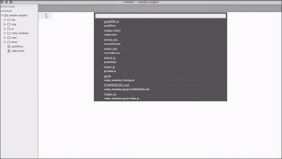](../assets/images/tools1-3.jpg)

Most developers prefer this method over manually searching for a previously opened tab as this involves zero mouse input and no thinking about the tab position.

It's a perfect example of an action that looks more complex than clicking on a tab, but is actually faster and simpler.

Typing an @ symbol into that box, or directly typing CMD+R, will bring up the symbol search menu. This allows you to quickly locate stuff in the current file, and it works extremely well for CSS or JavaScript functions.

[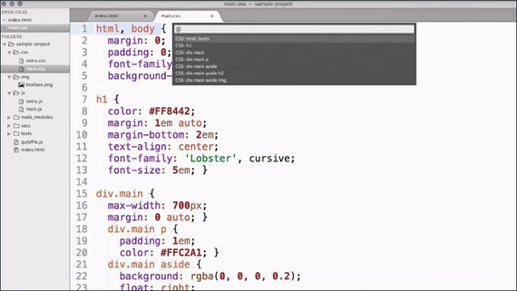](../assets/images/tools1-4.jpg)

Now I know I use this color somewhere else in this CSS file and I want to quickly locate it. So I have it already selected and on my keyboard I'm going to hit CMD+ALT+G and it finds the next instance of it. (VS Code: F3)

[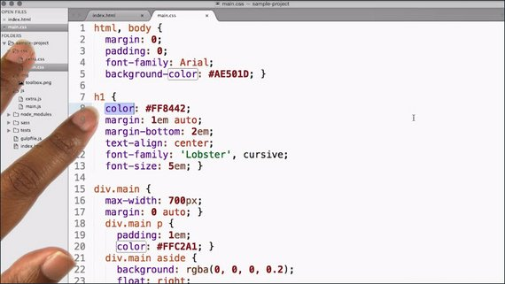](../assets/images/tools1-5.jpg)

Sublime Text has a very powerful tab completion feature. In a nutshell, tab completion allows you to type a whole lot less .And typing less usually results in your finishing faster.

So if I go into my HTML file and type in 'img' and hit Tab, it expands it out to the full image tag. It not only it created an image tag with the most important attributes for us, it also place the cursor in the right position for us to enter information in.

[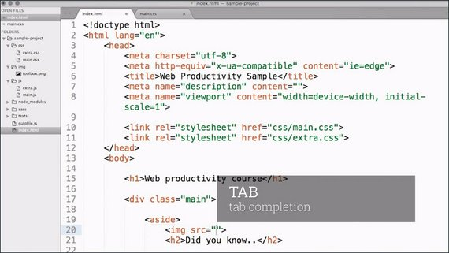](../assets/images/tools1-6.jpg)

Many editors support multiple selection these days. That's the ability to have multiple selections in the same document that aren't next to each other.

But most of the time, folks show that off with column selection, which can be done by holding the ALT key and dragging your cursor around. It sure looks cool but the use cases for it are so rare that I almost never use it.

So let's see how we can do this the Sublime way. So I have this word color right here selected and have pressed CMD+D. And it shows us the next instance of that word, without clearing the selection of the first.

[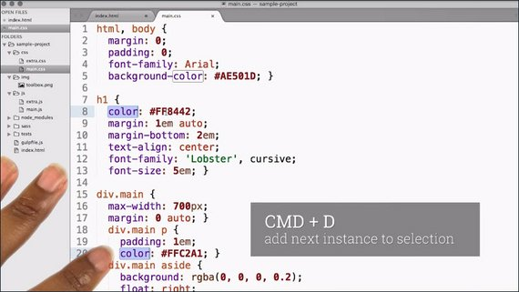](../assets/images/tools1-7.jpg)

It doesn't stop there. CMD+CTRL+G selects all instances of the word throughout the whole file. You can think of it as a global selection.

So, this makes it very easy for us to quickly refactor.

### 10.6 Extending Editor
Remember how I told you that your editor is like that steak knife that was built to fulfill only a specific purpose? Well, that wasn't the entire truth.

It's true that most editors have figured out how to do a great job with basic editing, but almost all modern editors can be extended with functionality.

In Sublime's case, all of it comes from a healthy community of developers, like you. They were missing something and built it.

And indeed, right now your Sublime is a genetic text editor. It doesn't care about you being a web developer. In the next step you customize it so it becomes a front-end development editor.

Sublime doesn't have a built in plug in repository, so the first thing we'll need to do is install package control. Its the only time we'll manually need to install a plugin.

[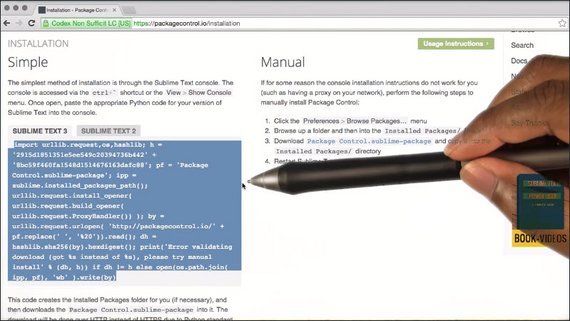](../assets/images/tools1-8.jpg)

We'll take this scary looking block of text [(https://packagecontrol.io/installation)](https://packagecontrol.io/installation) and paste it into Sublime's terminal. And with that it's fetching the plug in and installing all of the dependencies.

Let's test whether it worked. Type Command+Shift+P to bring up Sublime's command palette. This drop down menu is useful in many ways because it contains all the actions Sublime can do.

[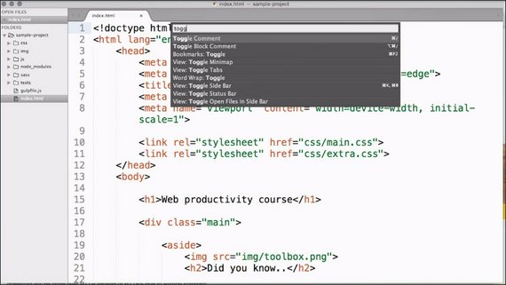](../assets/images/tools1-9.jpg)

I generally use it to discover stuff I didn't know about, like this toggle comment action andto execute actions that don't have shortcuts or have crazy long ones.

But right now, type in P-A-C, and you'll see many new commands associated with package control. The one we really care about is install package. (VSCode: ext)

This is the list of all of the packages in the repository. So now that we're prepared, let's install a few of our favorite plugins. (The links are below)

- Emmet
- Sidebar Enhancements
- Color Picker
- Color Highlighter

Through package control's install command, please install Emmet, Sidebar Enhancements, Color Picker and Color Highlighter. Some plugins require restarting the editor. So to make sure to do that after you have installed everything.

Emmet dramatically extends and improves Sublime's built in text snippets. Its craziest feature is the ability to use CSS selectors to create newHTML markup. I know that sounds a bit confusing, but let me tell you what I mean.

Let's say I need a list with four items in my index.html file. I can do that by typing

- `ul#nav>li*4`

Then pressing Tab expands the selector into the HTML we specify.

```html
<ul id="nav">
  <li></li>
  <li></li>
  <li></li>
  <li></li>
</ul>
```

Emmet comes with a lot more built in magic that you should definitely check out in the link in the instructor's notes.

The Sidebar Enhancements plugin has a pretty descriptive and spot on name. It mostly extends the right-click menu of Sublime's usually pretty bare-bones sidebar with all of the stuff you would expect. Deleting files, new folders and so on. But also, some nifty stuff such as copying content as a data URI.

Now, these last two, Color Picker and Color Highlighter work together to make editing and working with colors in CSS, much easier.

Pressing Cmd+Shift+C opens the system color picker and allows you to quickly choose a color. And when the cursor is placed in or around an existing color, picking a new one will update it.

[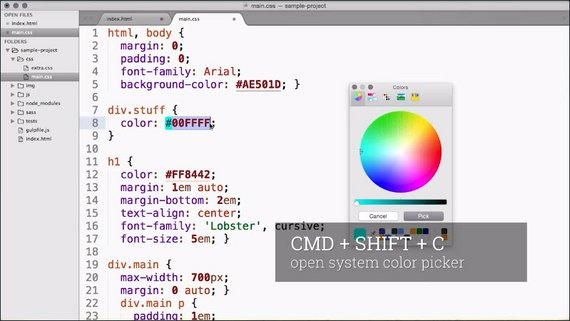](../assets/images/tools1-10.jpg)

The highlighter outlines or underlines colors it finds in your CSS with a preview so you always have an idea what you're looking at.

#### Sublime Resources

- [Package Control](https://packagecontrol.io/): The Sublime Text package manager
- [Emmet](http://emmet.io/) home page
- [Emmet on Package Control]()https://packagecontrol.io/packages/Emmet
- [SideBarEnhancements](https://packagecontrol.io/packages/SideBarEnhancements) on Package Control
- [ColorPicker](https://packagecontrol.io/packages/ColorPicker) on Package Control
- [ColorHighlighter](https://packagecontrol.io/packages/Color%20Highlighter) on Package Control

### 10.7 Quiz: Using the Palette
Which of these shortcuts converts text to lowercase? For a quick hint, check the command palette.

Check the command palette if you get stuck.

- [ ] CTRL + L
- [ ] CMD + SHIFT + L
- [ ] CMD + K, CMD + L
- [ ] CMD + SPACE, L

#### 10.7 Solution
The correct choice was CMD + K, CMD + L.

Remember to use the command pallet to look up any commands that you want to learn the shortcuts for.

You do this by opening the command palette, and start typing any part of the command. In this case, "L + O + W..." for lowercase. It will bring up the Transform to Lowercase command.

### 10.8 Wrap up
And with that, we're already at the end of the lesson.

I encourage you to not just experiment with different commands and plugins but try to get even more familiar with the editor.

Take your time and try out lots of plugins from the package control website or see how Sublime feels with code you have already written.

## Lesson 11. Build Automation
### 11.1 Intro
This hammer here is a fantastic tool to build stuff. But in order for it to work, it needs my immediate attention of energy. I can't just turn it on and let it do its thing.

In today's affordable tool shed, we've only recently got a few additions that are different. Modern tools like a 3D printer, can be given a task that it then performs autonomously until it's done.

In today's life of a web developer, we're seeing a similar trend, a large collection of tools that you feed tasks to and that then automate and improve many aspects of your workflow.

Let's dive into the world of build tools.

### 11.2 Build Tools
Build tools aren't a new thing, but web dev specific build tools only became popular a few years ago.

The simplest build tool is just a shell, or bash script. These scripts, with the `.sh` extension, are just a series of terminal commands or functions, and can be executed from the command line.

But working with the dependency graphs, or only updating files that have changed are tricky tasks with just a shell and this is where the original build system, `make`, comes in, adding file management sugar, and more.

After `make` came build tools such as Ant, Maven, and Gradle, all especially popular in the world of Java. All of them have declarative tasks, but you need to use XML to drive them, or in the case of Gradle, a programming language that you might not understand.

But web developers have a burning hate for everything XML, with the only exception of HTML as an accepted flavor. And so came a new set of modern, web development-focused, build tools; tools that would use a language that web developers are already familiar with: JavaScript.

Out of JavaScript are two Node.js-based build tools which have become very popular: Grunt and Gulp.

[](../assets/images/tools1-11.jpg)

But why are these the popular ones and what should you look for in a build tool? Here are the most important features to look for.

1. Fast
2. Community-driven
3. Modular & Extensible
4. Feature-rich

#### Fast
A build tool should be fast in execution as there's a need for speed when iterating on a website or app.

We're used to changing a line or reloading a page afterwards to see the changes instantly and disrupting that flow is a no go.

#### Community-driven
It should also be supported by a healthy community that exchanges plugins that add functionality and answers questions on sites such as Stack Overflow.

With popular build tools such as Grunt, chances are there's already an answer to your problem, and somebody else has had it before.

#### Module & Extensible
Next, it's very important that even if it comes with a lot of bells and whistles you can extend it with more and custom functionality as you see fit.

#### Feature-rich
And finally, the tool should already solve a few common problems out of the box for it to be useful.

Grunt, was the most popular tool and fulfills many of these requirements. It has a strong community and a healthy plugin ecosystem. 

Gulp, the new popular kid on the block, has two significant advantages over Grunt. It's built for speed and can execute tasks in parallel, plus converts open files into super fast streams internally.

Gulp's tasks, use code over configuration, which means that you can just use normal JavaScript, and extend or modify tasks that don't work for you.

You might have already guessed it, we're sticking with Gulp for the rest of this course but if your team or company chooses Grunt or a different system instead, fear not. The concepts are quite similar, and many times the plugin exists for both.

Here's a link to stackshare.io which gives stats and compares these three JS Build Tools / JS Task Runners: [Webpack vs. Gulp vs. Grunt](https://stackshare.io/stackups/grunt-vs-gulp-vs-webpack). (Technically, Webpack is a bundler while Gulp & Grunt are JavaScript task runners.)

### 11.3 Quiz: Build Tool Qualities
What are the core qualities of a good build tool?

- [x] Fast exectution / build time

    Yes. Things need to be fast when you're developing a website or app. If you change a line and reload the page, you want to see those changes instantly. Disrupting that flow is a no-go. So make sure your actual build time never goes beyond a few seconds.
- [x] Vibrant plugin community

    Yes. Build tools are pretty useless by themselves. You either need to write a lot of custom code or rely on plugins. So make sure to pick one that has the plugins you need.
- [x] Modular and sharable tasks

    Yes. Individually contained tasks allow you to easily enable and disable certain steps of your build process and their important prerequisite.
- [ ] Concise and short API

    No. There is no point in saving bytes when writing automation code. The important bit is that you understand what the configuration of your build system does, not how short the notation is.

### 11.4 Gulp vs Grunt
So what's so special about Gulp? Let's have a closer look.

The main difference between Grunt and Gulp is that Grunt focuses on configuration, while Gulp focuses on code. But what does that even mean in practice?

Have a look at this Grunt configuration file. It's not important that you understand everything it does right away.We'll get to that later.

[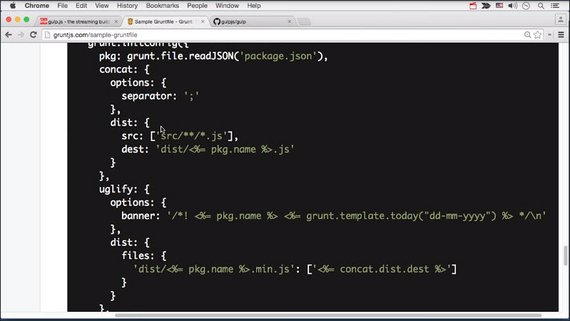](../assets/images/tools1-12.jpg)

It uses a JavaScript config object, to configure certain tasks, such as concat or uglify.

**To change or extend one of these tasks, you would have to modify the plugins themselves.**

Consider the same functionality in this Gulp config file instead. It looks more like standard JavaScript.

[](../assets/images/tools1-13.jpg)

At any given point, you can intervene, and type your files into another function before moving on.

The second big argument is all about speed.

Grunt executes tasks in sequence, one after another whereas Gulp, by default, executes tasks in parallel, and finishes when all have finished.

But that's not all that makes Gulp usually come up much faster. Gulp comes with the concept of streams, that cause much less IO, or file system access.

Head to the Gulp installation instructions below, and install Gulp on your system. If you haven't done so already, you also need to install Node.js and NPM.

#### 11.4 Resources

- [Gulp Installation Instructions](https://github.com/gulpjs/gulp/blob/master/docs/getting-started.md)

### 11.5 Installing Gulp
#### Installing Gulp and Course Code
Note: if you have not installed NodeJS or NPM you will need to install these first before installing Gulp. You can download and install NodeJS and NPM by going to the [Node official site](https://nodejs.org/) and downloading the latest version of NodeJS.

1. Take a few moments and [install Gulp](https://github.com/gulpjs/gulp/blob/master/docs/getting-started.md). The instructions are listed in the link.
2. Grab the [course code](https://github.com/udacity/ud892) from Github.

### 11.6 Define  Gulp Task
Every Gulp project starts with a Gulp file. This file sits in the root directory of your project and defines all the tasks that you should execute when running Gulp.

[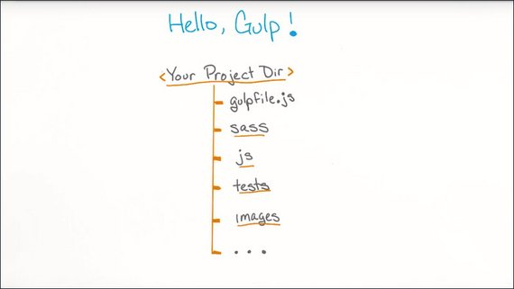](../assets/images/tools1-14.jpg)

There are a few ways to define a task in Gulp but first we need to `require` 'gulp' as a dependency since a gulp file is essentially a node.js script.

```js
var gulp = require('gulp');
```

Tasks in Gulp are asynchronous and Gulp uses [async-done](https://www.npmjs.com/package/async-done) to wait for the task's completion.

Tasks are called with a callback parameter which we call to signal completion. Alternatively, Task can return a stream, a promise, a child process or a RxJS observable to signal the end of the task.

> #### Task Examples on stackoverflow 
> The examples use Gulp 3.9.1 but here's a link that shows each of the five ways we can define a task in Gulp 4.0.
> - [Define a task in Gulp 4.x (stackoverflow)](https://stackoverflow.com/questions/36897877/gulp-error-the-following-tasks-did-not-complete-did-you-forget-to-signal-async).

#### Option #1: Call the callback function (easiest)
This is probably the easiest way.

Gulp automatically passes a callback function to your task as its first argument. Just call that function when you're done:

```js
var gulp = require('gulp');

gulp.task('default', function(done) {
  console.log('hello world');
  done();
});
```

#### Option #2: Return a Promise
An alternative task setup returns a `Promise`.

Note that most of the time you won't have to create the `Promise` object yourself, it will usually be provided by a package (e.g. the frequently used `del` package returns a `Promise`).

```js
var gulp = require('gulp');

gulp.task('default', function() {
  return new Promise(function(resolve, reject) {
    console.log('hello world');
    resolve();
  });
});
```

#### Run the task
 You can run it by executing gulp at the command line.

 ```bash
 gulp
 ```

### 11.7 Gulp Streams vs Grunt Tasks
Before we move on and create more complex tasks, let's talk a bit about the concept of streams in Gulp.

Build systems like Grunt have tasks that make changes to files and then save those changes to a temporary location before the next task takes over to make the next set of changes.

As a result, every task incurs a penalty for I/O in file system operations.

[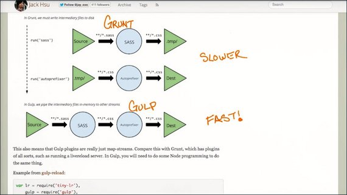](../assets/images/tools1-16.jpg)

Gulp on the other hand, converts your input files into an in memory stream. So the I/O is only done initially, and at the very end of all tasks.

This is what gives Gulp such a great speed increase in many situations.

#### 11.7 Resources
##### Comparison Articles
- [Gulp vs Grunt - Beyond the Numbers](https://jaysoo.ca/2014/01/27/gruntjs-vs-gulpjs/) (1-2014)
- [Gulp vs Grunt - Comparing Both Automation Tools](https://www.keycdn.com/blog/gulp-vs-grunt/) (3-2017)
- [Grunt Vs Gulp: Battle Of The Build Tools](https://deliciousbrains.com/grunt-vs-gulp-battle-build-tools/) (10-2017)

##### Supporting Articles
- [The Basics of Node.js Streams](https://www.sitepoint.com/basics-node-js-streams/) (11-2014)
- [Define a task in Gulp 4.x (stackoverflow)](https://stackoverflow.com/questions/36897877/gulp-error-the-following-tasks-did-not-complete-did-you-forget-to-signal-async) (7-2016)

### 11.8 Sass & Autoprefixer
We'll start with a common task for many web developers. That task is to make CSS work across the board on the most current subset of browsers in use.

[](../assets/images/tools1-17.jpg)

Prefixes, obscure syntax, and the inability to nest or use variables, all make working with CSS a pretty trying part of being a web developer.

That said, we can rewrite our style sheet in Sass, a super set of CSS that gets rid of many of CSS annoyances, and compile it to pure CSS. Then, instead of prefixing CSS properties manually, we automate that task with Autoprefixer.

If you've never used Sass before, check out [this Sass link](http://sass-lang.com/) to learn more about it.

#### 11.8 Resources

- [Sass](https://sass-lang.com/)
- [Autoprefixer](https://autoprefixer.github.io/)

### 11.9 Gulp Task: Sass
#### Install Sass NPM Dependencies
Both Sass and Autoprefixer have existing gulp plugins that we can use. So, let's start with installing `gulp-sass` as a project dependency.

```bash
$ npm install --save-dev gulp-sass

+ gulp-sass@4.0.1
added 140 packages from 121 contributors...
```


This will install the plugin so we can use it in our gulp file. Now we have to change the folder structure slightly to account for the generated CSS output files.

#### Folder Setup
Create a new folder in your project directory and call it 'sass'. Then move the files `main.css` and `extra.css` from the CSS folder into the sass folder and rename the extension to `.scss`.

By changing the extension, we just turned these into Sass files that soon get complied into CSS files with our new task.

The 'css' directory should now be empty.

#### Create 'styles' Task
Now before we can use the `gulp-sass` plugin, we need to make it available to gulp by using a `require` directive.

```js
var gulp = require('gulp');
var sass = require('gulp-sass');
```

Next we create a new task and name it 'styles', which is assigned to the first argument of the `task` method.

The second argument is a function that's executed when the task is invoked.

```js
gulp.task('styles', function () {

});
```

Now we need to tell gulp which files we want it to work with. For that, gulp has a special command called `src` on the `gulp` object.

The `src` method takes a [glob pattern](https://github.com/isaacs/node-glob) to determine which files it's going to operate on. In this case we use the the following line.

```js
gulp.task('styles', function() {
  gulp.src('sass/**/*.scss');
});
```

This looks for files with the `.scss` extension in a `sass` folder with any potential sub-directories in-between.

Now that we have the files, we pipe them to Sass.

The `pipe` function on the stream of files we just created, takes the destination that the plugin provides, so we call sass right here.

```js
gulp.task('styles', function() {
  gulp.src('sass/**/*.scss')
    .pipe(sass());
});
```

So now we've converted our files from Sass to proper CSS, but we still need to save then out.

We do this by using `pipe` again into which we pass `gulp.dest('./css')` to specify our final destination folder.

Here's the completed code.

```js
var gulp = require('gulp');
var sass = require('gulp-sass');

gulp.task('styles', function() {
  gulp.src('sass/**/*.scss')
    .pipe(sass())
    .pipe(gulp.dest('./css'));
});
```

But by default, the whole build will stop and error out when Sass discovers an error.

This can be tested by dropping in some bad characters in 'main.scss' such as an opening & no closing curly brace: `abc {`.

That's not always what you want. Very often, it's better to finish an action and output the error. Many plugins such like `gulp-sass` emit events for this scenario.

Listening to the `error` event on a Sass object and inserting the `sass.logError` function changes the default behavior. Instead of killing the whole build, it tells Gulp to simply log the error and go on as usual.

```js
var gulp = require('gulp');
var sass = require('gulp-sass');

gulp.task('styles', function() {
  gulp.src('sass/**/*.scss')
    .pipe(sass().on('error', sass.logError))
    .pipe(gulp.dest('./css'));
});
```

This looks much better. Now, we can run Gulp in the terminal.

```bash
gulp styles
```

This generates new CSS files from the original Sass files.

Now's a great time to get familiar with Sass if you haven't already done so.

#### 11.9 Resources

- [Node Glob Primer](https://github.com/isaacs/node-glob)
- [gulp-sass](https://www.npmjs.com/package/gulp-sass) npm package

### 11.10 Gulp Task: Autoprefixer
Now you now know the basics of finding, installing and enabling a plugin.

Here's a link to the [gulp-autoprefixer plugin](https://www.npmjs.com/package/gulp-autoprefixer).

Note that searching for 'autoprefixer' plus 'gulp' on Google will also return a link to the NPM plugin as well.

[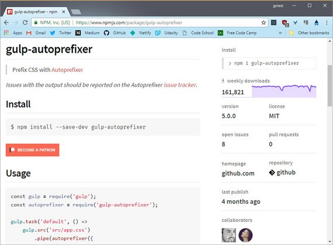](../assets/images/tools1-18.jpg)

The NPM page gives the installer command that should be run in the terminal.

```bash
$ npm install --save-dev gulp-autoprefixer

+ gulp-autoprefixer@5.0.0
added 10 packages from 190 contributors...
```

Now we go ahead and `require` the plugin at the top of our gulpfile.js

```js
var gulp = require('gulp');
var sass = require('gulp-sass');
var autoprefixer = require('gulp-autoprefixer');
```

The autoprefixer object is just another receiver of a pipe stream and since we already have a pipe coming from Sass, we simply add a new line right before we specify the file's destination.

```js
gulp.task('styles', function(done) {
  gulp.src('sass/**/*.scss')
    .pipe(sass().on('error', sass.logError))
    .pipe(autoprefixer(

    ))
    .pipe(gulp.dest('./css'));
  done();
});
```

Lastly, we insert a configuration object to specify the browser's option of Autoprefixer, which tells Autoprefixer for which browser versions to prefix.

In this case, we'll just instruct it to use the last two versions of every popular browser.

```js
gulp.task('styles', function(done) {
  gulp.src('sass/**/*.scss')
    .pipe(sass().on('error', sass.logError))
    .pipe(autoprefixer(
      browsers: ['last 2 versions']
    ))
    .pipe(gulp.dest('./css'));
  done();
});
```

Now when we rerun `gulp styles` in the terminal, we see that the original `main.scss` file here:

#### main.scss
```css
img {
  position: absolute;
  top: 0;
  left: 60px;
  width: 100px;
  transform: translate(0, -100%);
  filter: invert(1);
}
```

now becomes the updated `main.css` with all the right prefixes.

#### main.css
```css
div.main aside img {
  position: absolute;
  top: 0;
  left: 60px;
  width: 100px;
  -webkit-transform: translate(0, -100%);
          transform: translate(0, -100%);
  -webkit-filter: invert(1);
          filter: invert(1); }
```

#### 11.10 Resources

- [gulp-autoprefixer](https://www.npmjs.com/package/gulp-autoprefixer) npm package

### 11.11 Quiz: Gulp Autoprefixer
Replicate the functionality we just covered.

1. Install `gulp-autoprefixer`
2. Add an autoprefixer pipe to your styles task
3. Specify you want to prefix the last two versions of all browsers.
4. Remove -webkit- from the filter property in main.scss

### 11.12 Using Gulp
It's starting to look like we actually got some work done, right? I told you all the Gulp work would pay off. In fact, I have a final piece that would make a lot more sense now that we have our first task written down.

Gulp comes with a killer feature called watch. Think of it as an automatic trigger that waits for something to change.

Consider what you currently have to do. If you make any changes to your Sass file you need to switch to the terminal, re-enter `gulp styles`, execute it, switch to the browser, and reload.

A proper watcher relieves you of ever having to switch to terminal again.

### 11.13 Watch for SCSS Files
Write the code to set the `default` task to watch for changes in SCSS files.

```js
gulp.task('default', function() {
  gulp.watch('sass/**/*.scss', ['styles']);
});
```

### 11.14 Wrap-up
This lesson covered the importance of build tools and what they're used for. We discussed Gulp in particular and also detailed the process of writing tasks.

## Lesson 12. Browser Sync
### 12.1 Intro
Let me tell you about the wonderful benefits of live editing.

Say your job is to construct shelves. Imagine how difficult this would be with simply a screwdriver to do the job. It works if you're just constructing a shelf for yourself once a year, but a power drill would save you a tremendous amount of time and energy. It would give you great optimization.

The same goes for the world of web development.

You make a change to your code, save, rebuild (if you need to), switch to the browser, and reload the page.

[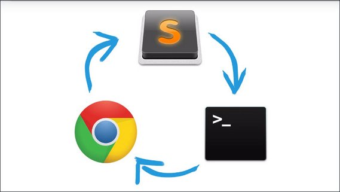](../assets/images/tools1-19.jpg)

These small and repetitive context switches might seem harmless, but you're doing this thousands of times each day.

Live Editing solves exactly that problem. It works by having a watcher in your editor or build process that's connected to a similar watcher in the browser.

When you save a file, these two communicate, and the website is reloaded or patched on the fly without you having to intervene.

That means fewer context switches since you can now have your editor right next to your browser window and see changes happen as you code.

In the next hands-on step, we'll show you how to set up Live Editing in three different ways.

1. On **every keystroke** in Sublime
2. On **every save** via Gulp
3. All **in the browser** (This skips the editor altogether)

In the end, we prefer option #2, the build tool version and in the next lesson we'll tell you why.

### 12.2 Quiz: Live Editing Advantage
Which of these are advantages of Live Editing?

- [x] Fewer context switches

  With the editor and browser side-by-side, you'll need to do a lot less context switching

- [x] Less clicks and keystrokes when changing code

  Usually you'll need to reload the page manually and trigger the build process again after you've made some changes to the source code. If your build system is doing this for you, you can save a lot of time.

- [x] Quicker previews of changes

  While the actual time of the rebuild or reload of your page doesn't change, the reload is done automatically. So, by the time you focus on the output,you've saved a couple of seconds of contact switching.

- [ ] Faster build times

  Even though it might feel faster due to the automatic reloads, the build process actually isn't sped up. It's your brain.

### 12.3 Live Editing Options
One way of setting up live editing is within your browser.

#### Brackets.io
Some editors, like Brackets, come with live editing built in. In Brackets, you press a button that will launch a new instance of your browser with your updates already live.

#### Takana Sublime Plugin
Sublime Text doesn't have it built in, but the Takana plugin gets pretty close. It supports CSS and SCSS live editing, but not HTML however.

#### Chrome Workspaces
Chrome DevTools has a relatively little known feature called Workspaces that allows you to ditch the editor altogether and work directly in the browser.

You can make changes to your CSS right in the Styles panel, and have them persist. The same goes for JavaScript. There's a link below listing the steps necessary to set up Workspaces on your computer.

The fundamental flaw with live editing in your editor is that it isn't aware of your build process. So be mindful of that.

#### Browser Sync
Browser Sync allows us to have live editing that is assisted by our build tool, improving upon the two methods we showed you before.

For this to work, we can reuse something we've already learned about, and that's the watch task that currently watches our Sass for changes and compiles them into CSS.

Browser Sync works by creating or proxying a local web server which serves and tracks your files for changes. Best of all, it's free, open source, and is compatible with most Node.JS-based build tools including Gulp.

So let's go ahead and set it up.

#### Resources

- [Takana](https://packagecontrol.io/packages/Takana) Sublime plugin on PackageControl
- [Chrome Dev Tools Workspaces](https://developers.google.com/web/tools/chrome-devtools/workspaces/)
- [Browser Sync](http://www.browsersync.io/)

### 12.4 Using Browser Sync

1. Install browser-sync.
2. Create a browser-sync object and initialize the server.

    ```js
    var browserSync = require('browser-sync').create();

    browserSync.init({
        server: "./"
    });
    browserSync.stream();
    ```

3. Run gulp in Terminal, see how browser opens with the page open.

Final Browser Sync code.

```js
var gulp = require('gulp');
var sass = require('gulp-sass');
var autoprefixer = require('gulp-autoprefixer');
var browserSync = require('browser-sync').create();

gulp.task('default', ['styles'], function(done) {
  gulp.watch('sass/**/*.scss', ['styles']);
  gulp.watch('index.html').on('change', browserSync.reload);

  browserSync.init({
    server: './'
  });
  done();
});

gulp.task('styles', function(done) {
  gulp.src('sass/**/*.scss')
    .pipe(sass().on('error', sass.logError))
    .pipe(autoprefixer({
      browsers: ['last 2 versions']
    }))
    .pipe(gulp.dest('./css'))
    .pipe(browserSync.stream());
  done();
});
```

This will only refresh the page for css updates.

### 12.5 Wrap-up
And there you have it. A seemingly complex chain of events, running nicely together to dramatically accelerate your work flow.

Keep going for awhile and modify the styles of your sample page to get a feel for how this impacts your productivity.

## Lesson 13. Lint & Test
### 13.1 Intro
Now that we've set up Gulp to do our CSS preprocessing & Live Editing, we can continue to use Gulp to automate linting and unit testing to make our lives easier.

In this lesson, you will learn how to prevent cross-browser issues in your CSS and catch JavaScript errors.

### 13.2 Why Rely on Build Tools
When I need to build something and am going to be working with materials I shouldn't be breathing in, I naturally put on a dust mask and safety goggles.

In the same way our build tools can protect us from disaster.

Now, of course, you can't accidentally amputate a finger from bad JavaScript, but you can make mistakes that can result in your site being unusable for a lot of users.

Here's the thing: tools aren't perfect either, but they are consistent. Meaning, they never get tired, never lack concentration, and don't have an ego.

By utilizing your build and editor tools, you can quite heavily improve the quality of your code.

### 13.3 Linting
Linting is a way to automatically check your JavaScript code for errors.

It can be done at various stages during development via your editor, your build process, or your pre-commit hook in version control.

[](../assets/images/tools1-20.jpg)

There's not always a right or wrong way in linting. A lot of it is heavily opinionated so you should choose the configuration that fits your coding style and project.

There's also the difference of code style linting versus syntax or structural linting.

[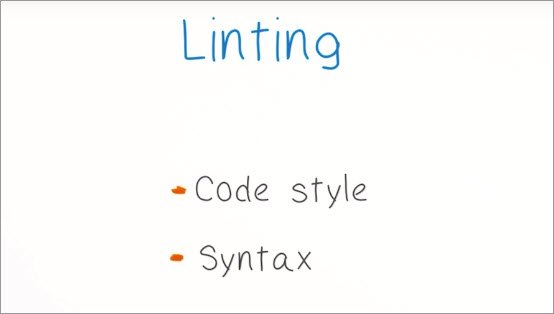](../assets/images/tools1-21.jpg)

Syntax or structural linting is what most people refer to when they say linting. These rules check for JavaScript anti-patterns, such as unreachable statements or forgetting to do a strict comparison against null.

On the other hand, code style linting can complain about things such as variables that aren't properly camel cased, or a particular way of placing braces for a function.

So if linting ensures your code looks sexy and checks for all these potential errors, does that mean your code will always run if the linter is happy?

Nope. The linter only checks for potential errors. It doesn't actually have any idea what you're trying to accomplish.

So now that you're familiar with the concept of linting, let's talk solutions.

There are three popular JavaScript linters out there that developers use: JSHint, JSCS, and ESLint.

[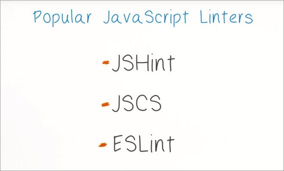](../assets/images/tools1-22.jpg)

You'll find a link in the notes that details the differences, but to cut it short, we'll stick with ESLint as it supports modern ES6 code,can be extended, and has output that's really easy to understand.

#### 13.3 Resources

- [Comparison of JavaScript linting tools](http://www.sitepoint.com/comparison-javascript-linting-tools/) by SitePoint
- [ESLint](http://eslint.org/)

### 13.4 Quiz: Linting Benefits
How does linting help your code?

- [x] Helps uncover code style problems

    The first one here is correct. Having a linting configuration for your project helps with code sharing and development with multiple team members.
- [x] Helps eliminate dead code or variables

    Linting certainly does help with all these and more. Some dead code is easily forgotten and can mess up your app in many obscure ways and linting will help find many of these patterns.

- [ ] Helps identify slow functions
    Linting does not help identify slow functions. Linting works purely by analyzing the actual source code. In order to find out how long a function takes to execute, it needs to run in the browser.

- [ ] Identifies incorrect return types
    A linter also doesn't help with this last one. Given the dynamic nature of JavaScript, often the type information is not known.

### 13.5 Setting up ESLint
To make the linter most effective, you want to have it run in your editor at every keystroke.

This effectively lints as you code. That way you're notified of potential problems as early as possible.

[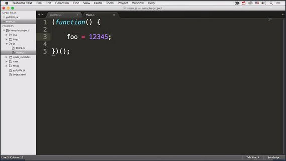](../assets/images/tools1-23.jpg)

#### Install ESLint
In order for this to work, you'll need to install ESlint first via npm. Make sure to use the '-g' option to install it globally.

```bash
npm install eslint -g
```

#### Install Editor Plugins
if you are running Sublime, you'll need to install two different Sublime plugins.

- `SublimeLinter` is a framework around linting, but doesn't come with specific language linters.
- `SublimeLinter-contrib-eslint` is the wrapper code that connects ESLint to `SublimeLinter`.

When you're done, restart your editor.

If you are running VSCode you can install the ESLint Extension from the Extensions side panel by clicking the Extensions icon from the Activity Bar.

Now look at the `main.js` file in the js folder. Notice that the linter doesn't do anything yet.

[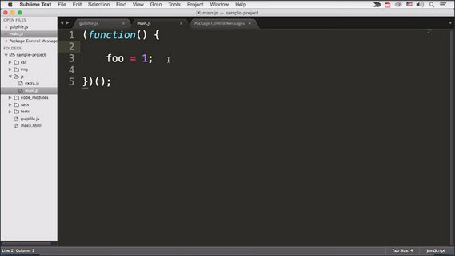](../assets/images/tools1-24.jpg)

It might seem that something didn't work during installation but all is fine.

It's just that ESLint, by default, doesn't do anything unless you configure it. Luckily it's simple to generate a basic configuration.

#### Configure ESLint
Switch back to your terminal, where you should still be in a sample directory, and run eslint init.

```bash
eslint --init
```

This will bring up this nifty prompt that asks you a few questions, then generates an eslintrc file for you.

[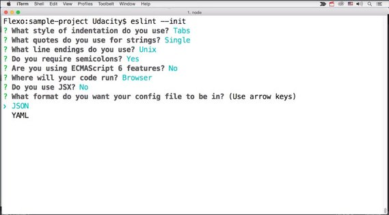](../assets/images/tools1-25.jpg)

If you now open that file in Sublime, you'll notice a few style rules from the prompts you just answered but the key is the `extends` block at the bottom.

[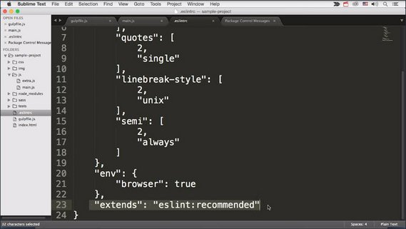](../assets/images/tools1-26.jpg)

This tells ESLint to run with its recommended set, and anything you add on top will overwrite or add to it.

That's super useful as a starting point. 

Here's ESLint in action. See the foo variable, the red dot next to the line numbers? 

Sublime highlights it with a red border. To know which error occurred, just click on `foo` and look at status bar at the bottom.

[](../assets/images/tools1-30.jpg)

In this simple example, it's obvious that we're missing a `var`.

When we fix it `foo` still shows as red. Why is that? We actually fixed a previous error and are now looking at a new one.

Foo is now defined but never used in your code. So it's fair that ESLint complains about it.

[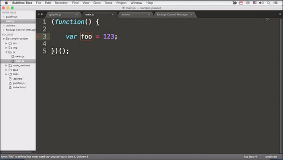](../assets/images/tools1-27.jpg)

Let's add a return statement to actually use `foo` in some way.

```js
(function () {

  var foo = 1;
  return foo;

})();
```

Just as I stop typing, the red vanished and thus, all errors went away.

If you open your gulpfile.js, though, you'll notice a lot of red around the `require` blocks

[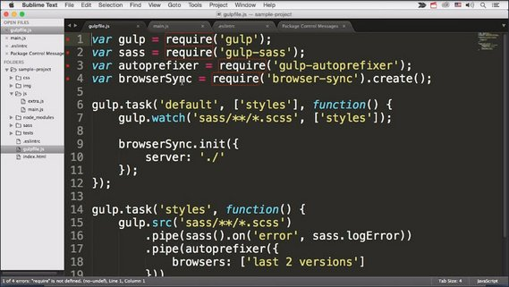](../assets/images/tools1-28.jpg)

That's because ESLint thinks that files run in the browser and the browser has no `require` function.

We want ESLint to turn off Node.js warnings but only in this file. Luckily, we can do that.

[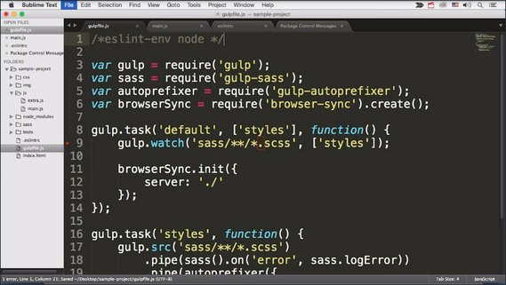](../assets/images/tools1-29.jpg)

This special type of comment works just like a configuration, but it's local to the current file.

```js
/*eslint-env node */

var gulp = require('gulp');
var sass = require('gulp-sass');
var autoprefixer = require('gulp-autoprefixer');
var browserSync = require('browser-sync').create();
```

Before we move on to learn how to integrate ESLint into your build, keep in mind that the amazing SublimeLinter plugin also supports dozens of other linters.

So if you'd like your CSS, HTML, or even PHP linted, there's certainly a plugin for that.  The same holds true for VSCode extensions.

#### 13.5 Resources

- [Sublime Linter](http://www.sublimelinter.com/en/latest/)
- [gulp-eslint](https://www.npmjs.com/package/gulp-eslint) on npm

### 13.6 ESLint in Gulp
If you're collaborating or working on another computer, the other party might not have the linter configured.

Since your colleague needs to run the build to work with the site anyway, why not have the build run the linter, and complain when something goes wrong?

Install the gulp-eslint package from the command line.

```bash
$ npm install gulp-eslint --save-dev

+ gulp-eslint@5.0.0
added 116 packages from 145 contributors...
```

Then require it in the head of your `gulpfile.js`.

```js
/*eslint-env node */

var gulp = require('gulp');
var sass = require('gulp-sass');
var autoprefixer = require('gulp-autoprefixer');
var browserSync = require('browser-sync').create();
var eslint = require('gulp-eslint');
```

We then can navigate to the [gulp-eslint](https://www.npmjs.com/package/gulp-eslint) npm package.

[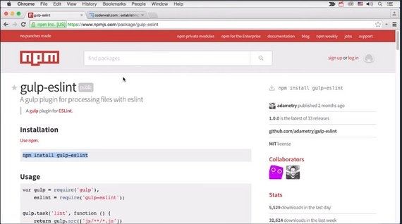](../assets/images/tools1-31.jpg)

Turns out the basic example on the `gulp-eslint` readme works well for us.

So, I'm just going to copy it and paste it into my gulp file.

[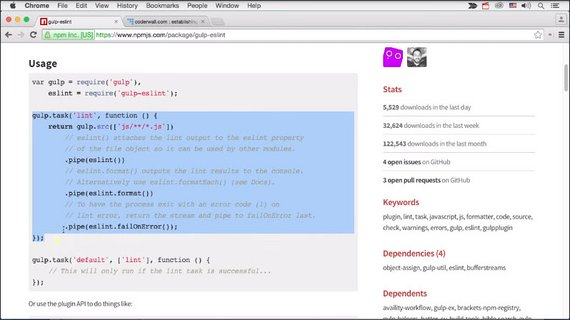](../assets/images/tools1-32.jpg)

As you'll notice, this task looks very familiar. It has the `gulp.src` call, but this time it matches js files, then uses pipes to do a few things with eslint.

```js
gulp.task('lint', function () {
  return gulp.src(['js/**/*.js'])
    // eslint() attaches the lint output to the eslint property
    // of the file object so it can be used by other modules.
    .pipe(eslint())
    // eslint.format() outputs the lint results to the console.
    // Alternatively use eslint.formatEach() (see Docs).
    .pipe(eslint.format())
    // To have the process exit with an error code (1) on
    // lint error, return the stream and pipe to failOnError last.
    .pipe(eslint.failOnError());
});
```

1. The first pipe executes eslint and all files matched.
2. The second line outputs the errors to the console, so we actually see what happened.
3. The third pipe ensures that gulp exits with an error code and fails.

Without the third line, gulp would show the errors but would proceed with everything else.

Now we could execute the task manually but let's integrate it into our default task.

```js
gulp.task('default', ['styles', 'lint'], function () {  // <-- here
  gulp.watch('sass/**/*.scss', ['styles']);
  gulp.watch('index.html').on('change', browserSync.reload);
  gulp.watch('js/**/*.js', ['lint']);   // <-- here

  browserSync.init({
    server: './'
  });
});
```

First, we add `lint` to the second argument array after `styles` so it runs right after running Gulp in the terminal.

Then we add a new line after the first `gulp.watch` to add a new `gulp.watch`. This time watching the `.js` files and calling `lint`, instead of `styles`.

The best thing is that we can later reuse this new watcher to do even more great things to our js.

Try running Gulp in the terminal and makes some changes through your `.js` to see linting appear on your terminal after every save.

To wrap things up, there's a third almost desperate way of forcing eslint on your project collaborators.

With a pre-commit hook, you can require that code successfully lints properly or the commit will not go through.

You can find out more about this in the Udacity [How to Use Git and GitHub](https://www.udacity.com/course/ud775) course.

### 13.7 Unit Testing in Gulp
You've just learned how to protect yourself from syntax and coding style issues but as you know, this doesn't ensure your code does what it's supposed to do.

In order to test the functionality of your code, you should create unit tests.

Unit tests are essentially JavaScript functions that pragmatically test an API or aspect of your project code.

If this topic is new to you, I encourage you to check out Udacity's [JavaScript Testing](https://www.udacity.com/course/javascript-testing--ud549) course.

For the purpose of this course, we'll assume you either already know the basics of javaScript unit testing or will learn them at a later point in time.

Thus we just provide a sample test suite to integrate as part of our build process.

Unit tests, like Linting, are here to prevent mistakes. Wouldn't it be cool if you could automate running them just like everything else was set up so far with our built?

Well there's one issue with that. The unit test for your front end only makes sense if they run in a browser.

Thus, running them from the terminal environment won't do any good, but this doesn't mean it's impossible, it's just slightly more tricky.

Here's how it works.

#### 13.7 Resources
- Udacity's [JavaScript Testing](https://www.udacity.com/course/javascript-testing--ud549) course

### 13.8 Jasmine & PhantomJS
Jasmine is a popular unit test framework for testing both your browser and Node.js JavaScript code. Here is the description from their homepage.

> #### What is Jasmine
> Jasmine is a behavior-driven development framework for testing JavaScript code.
> 
> It does not depend on any other JavaScript frameworks. It does not require a DOM. And it has a clean, obvious syntax so that you can easily write tests.

The key to make Jasmine work with our build, is to use a headless browser instance that we can execute from the command line because that's what gulp can deal with.

Luckily, such a browser exists. It's called PhantomJS, and it's basically a headless version of Webkit.

[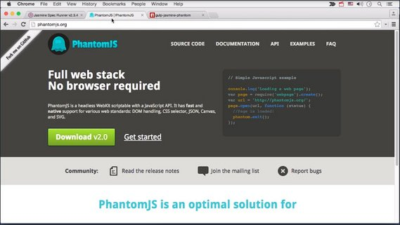](../assets/images/tools1-33.jpg)

You don't need to know much more about it right now, just that the `gulp-jasmine-phantom` plugin uses PhantomJS to actually run your tests in a headless browser environment (browser without a UI).

First install PhantomJS through Terminal using the following (Linux & WSL).

```bash
sudo apt update
sudo apt install phantomjs
```

For WSL need to add the following to end of `~/.bashrc`.

```bash
export QT_QPA_PLATFORM=offscreen
```

Then install `gulp-jasmine-phantom` via npm in your project directory.

```bash
$ npm install gulp-jasmine-phantom --save-dev

+ gulp-jasmine-phantom@3.0.0
added 116 packages from 145 contributors...
```

Then add a require to your gulp file, like so.

```js
/*eslint-env node */

var gulp = require('gulp');
var sass = require('gulp-sass');
var autoprefixer = require('gulp-autoprefixer');
var browserSync = require('browser-sync').create();
var eslint = require('gulp-eslint');
var jasmine = require('gulp-jasmine-phantom');  // <-- here
```

Now all we need to do is to create a new task called `tests`. Use `gulp.src` to find the correct test file we want to run, then use a `require` with Jasmine.

```js
gulp.task('tests', function () {
  gulp.src('tests/spec/extraSpec.js')
    .pipe(jasmine({
      integration: true,
      vendor: 'js/**/*.js'
    }));
});
```

The `integration` setting tells Jasmine to use PhantomJS. If it's set to `false`, it runs in a Node.js environment instead which you'd only want if you're testing Node.js code.

Finally the `vendor` setting needs to point to our JavaScript source files, as this plugin constructs its own `specrunner.html` with those.

Now head back to your terminal and run the following to see Phantom JS and Jasmine in action.

```bash
gulp tests
```

#### 13.8 Resources

- [PhantomJS Download](http://phantomjs.org/download.html)
- [Jasmine Test Framework](https://jasmine.github.io/index.html)
- [gulp-jasmine-phantom](https://www.npmjs.com/package/gulp-jasmine-phantom) npm package

### 13.9 Unit Test Limits
All right. I'm sure you were thinking we now add `tests` to the default task, and then to the JavaScript watcher.

Well, you're half right, that's what we would ideally do but running complex unit tests, especially in a headless browser, can get really.

So adding into our watch process would kill our Live Editing workflow.

In order to solve this problem, smart people invented Continuous Integration (CI) in the Cloud.

### 13.10 Continuous Integration
Continuous integration is the idea that you're always making sure your code integrates properly with the remote repository.

So across a team, you'll always have a stable build. Now we won't go into detail on CI, as much of it is already covered in the dev ops udacity course [Intro to DevOps](https://www.udacity.com/course/intro-to-devops--ud611).

A key lesson here is that CI in the cloud provides a great place for your time intensive tasks. In particular, your unit tests.

A cloud solution like Jenkins will watch the commits going into your repository and trigger any terminal commands you feed it.

So if you take the Gulp test task that we've just created and hook it up in the cloud, it means that the test suite will run after every commit.

If one of these tests now fails, you've got a email and can fix it in your next commit.

We'll leave our task as is for now, but do go and check out the dev ops Udacity course when you're finished with ours.

### 13.11 Wrap-up
With the right solutions in place, namely our linters and the unit test suite, you'll feel a lot safer and can iterate new changes without worrying too much.

Linting and Continuous Integration can help you find errors in your code when they're easily fixable, before they become a catastrophic.

## Lesson 14. Optimizations
### 14.1 Intro
We've optimized the development workflow but that's about it. Now think about all the things you should do after you finishing coding and planning a release.

These are things like unifying and concatenating your source files and optimizing your images.

In today's mobile world, you see hundreds of different device, browser, and screen combinations that use your app or site. In some cases, it's simply impossible to optimize by hand.

This is where your build process steps in.

We'll use it to optimize things that you can't fix by hand, or simply take too long. By doing this we'll make your build more powerful, so that it takes a raw source code and polishes it for production.

### 14.2 Dev vs Prod Modes
Before we go and optimize it's important to understand that these optimizations are only meant for production.

Sure you could execute them all the time, but it would dramatically slowdown your iterative build time, and thus make live editing a lot less powerful.

Instead I recommend you split your tasks into **development** and **production**.

Development tasks contain things you really need no matter what. Sass processing, for example, and tasks that only make sense through encoding, for instance, live editing.

However, keep in mind that while developing, this means you'll be using a different version of your app than your users. It's going to look and feel mostly the same, but sometimes performance issues or bugs only manifest with a specific optimization technique. So make sure to always test the production version from time to time.

In our next couple of instructions, we'll be creating more generated assets. Previously, the only generated files we were producing were the CSS files but now we need to create a structure to hold production and development files separately.

### 14.3 Dev & Prod Tasks
To get started, let's create a `dist` folder that holds all generated files separate from the source files.

```bash
mkdir dist
```

This wasn't a problem with sass as we generated the CSS into a separate high-level CSS folder but it would be with JavaScript because we don't want our source and distribution files to co-mingle.

[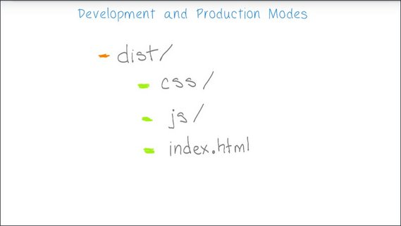](../assets/images/tools1-34.jpg)

The process is pretty simple.

1. We first copy our index.html into the `dist` folder
2. Then generate our css into `dist/css`,
3. We generate our combined JavaScript file into `dist/js`.

Since we've already got our CSS set up, let's change what's needed in our styles task.

Here's our styles task in the grunt file. And we can see our destination is set to just the CSS directory.

[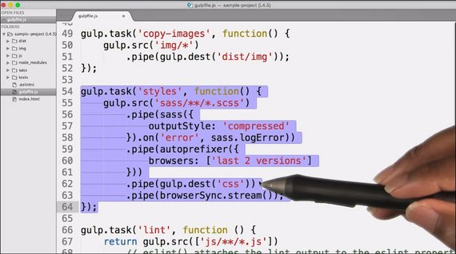](../assets/images/tools1-35.jpg)

To make it show up under this `dist` directory, we just change the destination to `dist/css`.

[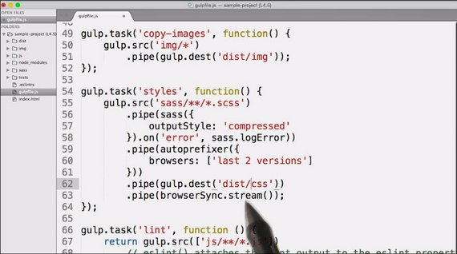](../assets/images/tools1-36.jpg)

And, when we run `gulp styles`, we can see that the files have been generated and dropped in the correct folder.

[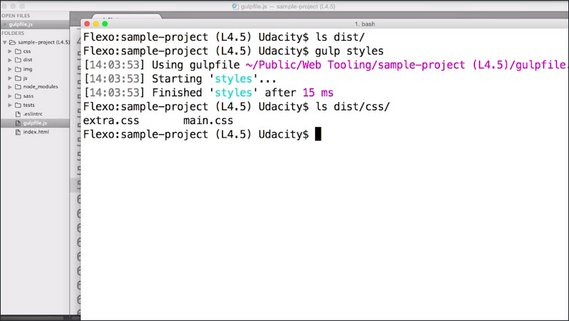](../assets/images/tools1-37.jpg)

Next, let's copy the `index.html` and `images` to the `dist` folder.

We simply set up two new tasks and call them something like `copy-html` and `copy-images`.

[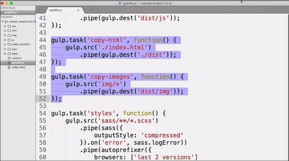](../assets/images/tools1-38.jpg)

In the `copy-html` task, we grab the `index.html` file with `gulp.src` and just pipe it to the destination in the `dist` folder.

For the `copy-images` task, we do the same thing, but instead of copying a file or grabbing a locator to a file, we're grabbing all the files in a specific directory and piping them to our new destination location.

You'll want to set up a new `gulp.watch` next to the others that will watch the original index file.

[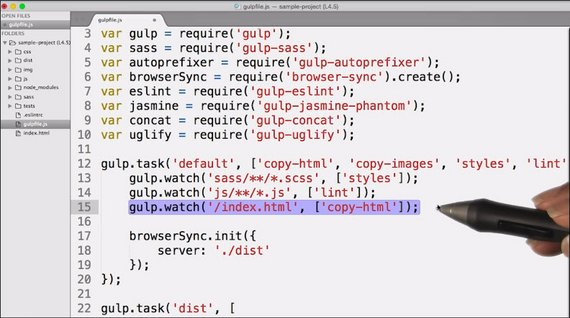](../assets/images/tools1-39.jpg)

You could do the same with the images, but they don't change that often.

And don't forget to add the two new tasks to the array that's passed as part of the `default` task,otherwise the files don't get copied over the first time we run gulp.

[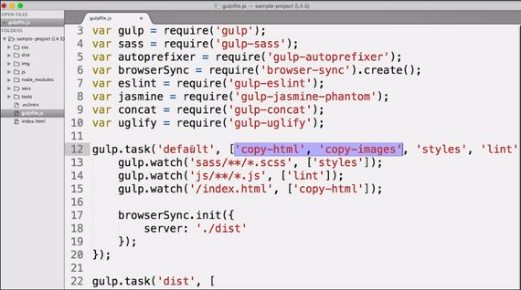](../assets/images/tools1-40.jpg)

Just a final fix before we can see our page run again minus the JavaScript which will come in a bit.

You'll need to modify the `browserSync.init` function call and make it point to the `dist` directory.

[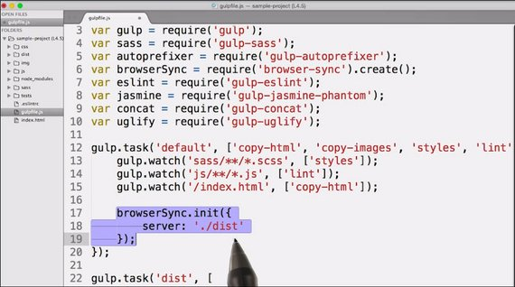](../assets/images/tools1-41.jpg)

### 14.4 Quiz: BrowserSync
Okay, now it's your turn. Set up the build folder in commands to assemble its contents.

Did you notice that browser-sync isn't listening for changes in the index.html file?

Do you have an idea how we could fix that? Go ahead and type your code here.

#### 14.4 Solution
If you search for a solution, it's very likely that you found more than one. But here's one that was easiest, shortest and worked the best for me.

I just setup another `gulp.watch`, but this time it isn't watching the original `index.html`, but the copied one.

Every time that the copy operation is done, we can now execute `browserSync.reload` to reload the whole page.

```js
gulp.watch('./build/index.html').on('change', browserSync.reload);
```

Make sure this works for you. Then we can move on with the JavaScript processing.

Here is our updated `default` task.

```js
gulp.task('default', ['copy-html', 'copy-images', 'styles', 'lint', 'scripts'],
  function() {
    gulp.watch('sass/**/*.scss', ['styles']);
    gulp.watch('js/**/*.js', ['lint']);
    gulp.watch('/index.html', ['copy-html']);
    gulp.watch('./dist/index.html').on('change', browserSync.reload);

    browserSync.init({
      server: './dist'
  });
});
```

### 14.5 CSS Concatenation
The first optimizations we do are easy to implement and make our code load faster.

We first glue our CSS and JavaScript files together through concatenation, then crunch them with a mini-file.

In previous lessons, we applied a couple tasks to our CSS but this time it's mostly about JavaScript.

I say mostly because these topics still apply to CSS but Sass does both concatenation and minification for you.

Manual concatenation isn't necessary, because you can simply include a single Sass file in your HTML then use the `@import` directive in your Sass to input other files into your base file.

When the Sass compiler processes the Sass into CSS, it will automatically inline those `@imports` and generate one big CSS file.

A minification just requires an additional optional.

Just modify the Sass pipe slightly and add `outputStyle: 'compressed'` which will produce a nicely compressed file.

```js
.pipe(sass({outputStyle: 'compressed'}))
```

Here is our updated `styles` task.

```js
gulp.task('styles', function() {
  gulp.src('sass/**/*.scss')
    .pipe(sass({
      outputStyle: 'compressed'
    }).on('error', sass.logError))
    .pipe(autoprefixer({
      browsers: ['last 2 versions']
    }))
    .pipe(gulp.dest('dist/css'))
    .pipe(browserSync.stream());
});
```

### 14.6 JS Concatenation
Onto the world of JavaScript concatenation. Concatenation here solves two problems at once.

First and foremost, it reduces the number of HTTP requests needed to load your page in production.

This is a big deal, especially if you're on a mobile connection with up to 300 milliseconds of latency per request.

Secondly, it's the most basic form of dependency management.

You put all your script into a folder and instead of having to add script blocks in the HTML to load them one by one, you simply add a single script block that points to the generated, concatenated output file.

I say most basic form because it obviously isn't smart enough to detect dependency chains and a required load order. Solving for this is a much more involved task. So let's keep it simple for now.

### 14.7 JS Concat Hands On
To get started, we should first create a `scripts` task.

However, since we want to do slightly different things in development and production mode, we add another task called `scripts-dist`, which will be used when we want to distribute our files for production.

[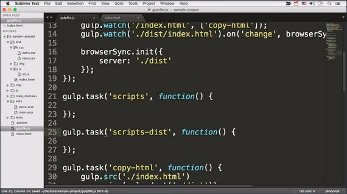](../assets/images/tools1-42.jpg)

In the first step, both of these tasks will look the same. We `gulp.src` the files we need, in this case, our JavaScript files.

Then pipe them to the correct destination, in our case, the `dist/js` folder.

[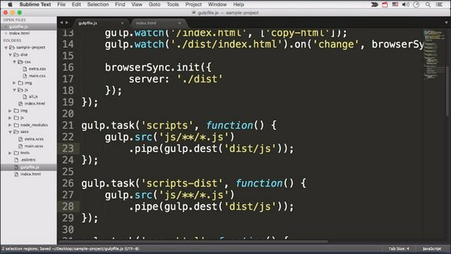](../assets/images/tools1-43.jpg)

Now install the `gulp-concat` plug-in via npm.

```bash
$ npm install gulp-concat --save-dev

+ gulp-uglify@3.0.0
added 5 packages from 40 contributors ...
```

Next require it in the gulpfile.js

```js
/*eslint-env node */

var gulp = require('gulp');
var sass = require('gulp-sass');
var autoprefixer = require('gulp-autoprefixer');
var browserSync = require('browser-sync').create();
var eslint = require('gulp-eslint');
var jasmine = require('gulp-jasmine-phantom');
var concat = require('gulp-concat');  // <- here
```

Then add a new pipe to both tasks with `concat('all.js')` before the destination pipe.

[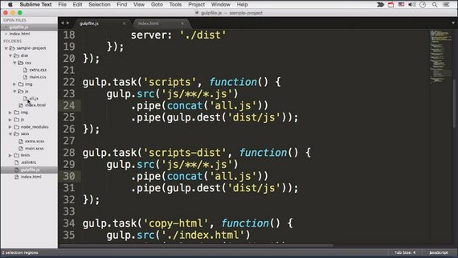](../assets/images/tools1-44.jpg)

This plugin takes the files in the stream, and combines them into a single file named whatever you provide as the argument.

Try running one of those task in your terminal, to make sure the concatenated `all.js` ends up in the correct folder.

Now we're missing only one last thing. We need to change the references to the individual js files in our index HTML to point to the single js file, at `js/all.js`.

[](../assets/images/tools1-45.jpg)

And now your page should run fine again.

Here are the updates to `gulpfile.js`.

```js
gulp.task('scripts', function() {
  gulp.src('js/**/*.js')
    .pipe(concat('all.js'))
    .pipe(gulp.dest('dist/js'));
});

gulp.task('scripts-dist', function() {
  gulp.src('js/**/*.js')
    .pipe(concat('all.js'))
    .pipe(gulp.dest('dist/js'));
});
```

### 14.8 Minification
After concatenation, it's now time for minification to shrink the file size of our JavaScript.

The most popular minifier today is `uglify.js` which does some heavy but safe optimizations to squeeze every last bit out of your raw source code.

As before, we install the gulp-uglify plug-in with npm.

```bash
$ npm install gulp-uglify --save-dev

+ gulp-uglify@3.0.0
added 5 packages from 40 contributors...
```

Then we include it at the top of our gulp file.

```js
/*eslint-env node */

var gulp = require('gulp');
var sass = require('gulp-sass');
var autoprefixer = require('gulp-autoprefixer');
var browserSync = require('browser-sync').create();
var eslint = require('gulp-eslint');
var jasmine = require('gulp-jasmine-phantom');
var concat = require('gulp-concat');
var uglify = require('gulp-uglify');
```

Now this is where our `scripts` and `scripts-dist` tasks are starting to become slightly different since JavaScript minification is a very time-intensive task.

Therefore, it makes no sense to do this while live-editing code.

So, we add the missing pipe to the `scripts-dist` task right after the `concat` pipe. In it we call `uglify()`.


```js
gulp.task('scripts', function() {
  gulp.src('js/**/*.js')
    .pipe(concat('all.js'))
    .pipe(gulp.dest('dist/js'));
});

gulp.task('scripts-dist', function() {
  gulp.src('js/**/*.js')
    .pipe(concat('all.js'))
    .pipe(uglify())   // <-- here
    .pipe(gulp.dest('dist/js'));
});
```

That's all you need and calling this task now will produce nicely concatenated and minified JavaScript.

```bash
$ gulp scripts-dist
Starting 'scripts-dist'...
Finished 'scripts-dist' after 12 ms
```

### 14.9 Production Task
To produce a production ready version of our site, we can skip the whole live editing and watching, and include the scripts distribution task instead.

We call the new task `dist` and include the following tasks in this order.

1. 'copy-html'
2. 'copy-images'
3. 'styles'
4. 'lint'
5. 'scripts-dist'

Here's the code.

```js
gulp.task('dist', [
  'copy-html',
  'copy-images',
  'styles',
  'lint',
  'scripts-dist'
]);
```

Try running the tasks by using:

```bash
gulp scripts-dist
```

If gulp takes slightly longer, and exits without opening the browser, then you're all set, and have a production ready distribution in your `dist` folder.

Before we continue, one word of advice regarding minification.

Minification on its own is great, but GZIP is even more affective. GZIP compresses the file before it gets in, and out to the browser,and the browser deflates it.

All of this happens transparently in the background and usually only requires a small server configuration change.

Read more about it in: [The difference Between Minification and GZipping](https://css-tricks.com/the-difference-between-minification-and-gzipping/).

### 14.10 Babel & ES6
There's another very worthwhile optimization we can do to our JavaScript, and it's quite similar to how we use Sass instead of CSS.

[](../assets/images/tools1-46.jpg)

Turns out there is a way of running the very latest spec of JavaScript, ECMAScript 2015 (or ES6), even though some features are not natively supported by all browsers.

What we need is a transpiler, which takes one programming language, and converts it into another.

Sometimes transpilers stay very close to ECMAScript syntax, adding in a few features here and there. In other cases, they are full implementations of languages you don't typically find in purely front end web development.

We'll stick to the former category. Our transpiler of choice is BabelJS. It's very popular, feature rich, and well supported by the community.

Now of course this step is purely optional. If you're happy with today's JavaScript and don't need all the fanciness, great. But if you're curious to try out arrow functions, generators and classes, now is the perfect time.

And sure enough, getting this into our code is as simple as everything else.

First install the npm package.

```bash
$ npm install gulp-babel babel-core babel-preset-env --save-dev

+ gulp-babel@7.0.1
added 2 packages from 2 contributors...
+ babel-core@6.26.3
added 25 packages from 10 contributors...
+ babel-preset-env@1.7.0
added 48 packages from 6 contributors...
```

Then update your `.eslintrc` file to allow ES6.

```json
"env": {
  "browser": true,
  "es6": true
}
```

Next add a `.babelrc` file to your project root that tells babel what you want to transpile.

```json
{
  "presets": [
    ["env", {
      "targets": {
        "browsers": ["last 2 versions", "safari >= 7"]
      }
    }]
  ]
}
```

Next grab the `gulp-babel` plugin and require it in your gulp file.

[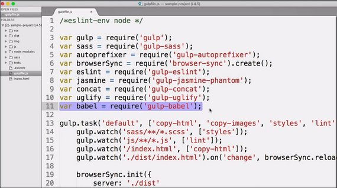](../assets/images/tools1-47.jpg)

And in both script task, pipe it after the `gulp.src`, but before the concatenation.

[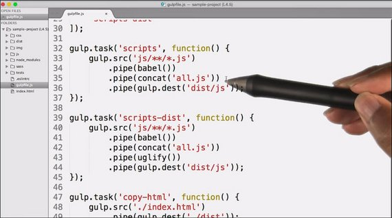](../assets/images/tools1-48.jpg)

You won't see any difference right away, as you're not actually using any ES6 magic in your current code. 

In order to test you can add some ES6 code to `main.js`.

```js
const test1 = () => 'my es6';
```

Babel will transpile this to

```js
"use strict"

var test1 = function test1() {
  return 'my es6';
};
```

You can check this in DevTools. 

So head over to Babel's ES6 learning page and get familiar with some of the concepts.

Here's part of the final code.

```js
/*eslint-env node */

var gulp = require('gulp');
var sass = require('gulp-sass');
var autoprefixer = require('gulp-autoprefixer');
var browserSync = require('browser-sync').create();
var eslint = require('gulp-eslint');
var jasmine = require('gulp-jasmine-phantom');
var concat = require('gulp-concat');
var uglify = require('gulp-uglify');
var babel = require('gulp-babel');

gulp.task('default', ['copy-html', 'copy-images', 'styles', 'lint', 'scripts'],
  function () {
    gulp.watch('sass/**/*.scss', ['styles']);
    gulp.watch('js/**/*.js', ['lint']);
    gulp.watch('./index.html', ['copy-html']);
    gulp.watch('./dist/index.html').on('change', browserSync.reload);

    browserSync.init({
      server: './dist'
});
});

gulp.task('dist', [
  'copy-html',
  'copy-images',
  'styles',
  'lint',
'scripts-dist'
]);

gulp.task('scripts', function() {
  gulp.src('js/**/*.js')
    .pipe(babel())
    .pipe(concat('all.js'))
    .pipe(gulp.dest('dist/js'))
    .pipe(browserSync.stream());
});

gulp.task('scripts-dist', function() {
  gulp.src('js/**/*.js')
    .pipe(babel())
    .pipe(concat('all.js'))
    .pipe(uglify())
    .pipe(gulp.dest('dist/js'));
});
// more code...
```

### 14.12 Source Maps
Imagine you’re running your page now and there’s a bug in your JavaScript. so you head over to the Sources panel to set a breakpoint, only to realize you’re looking at Spaghetti instead of source code.

After all the optimizations, none of your code is particularly readable anymore.

That's a major rationale for source maps.

Source maps are files that associate line numbers from the processed file to the original. This way the browser can lookup the current line number in the sourcemap and open the right source file at the correct line when debugging. In Chrome for instance, the DevTools support source maps both for CSS and JavaScript.

You can read a bit more about the source map specification here: [Source Map Revision 3 Proposal](https://docs.google.com/document/d/1U1RGAehQwRypUTovF1KRlpiOFze0b-_2gc6fAH0KY0k/edit).

#### 14.12 Setup
Source maps in gulp are easy to setup. It’s a use case where pipes really shine.

1. Install the `gulp-sourcemaps` [plugin](https://www.npmjs.com/package/gulp-sourcemaps).
2. Require the `gulp-sourcemaps` plugin and in your `scripts-dist` or `scripts` (or `styles`) task, add a pipe to `sourcemaps.init()` after you get the source but before you send the source files through any pipes that transform them materially.

    After all plugins and pipes have been applied but before you save to the destination, pipe through `sourcemaps.write()` with an optional location parameter if you don't want the source maps to be inlined.

    ```js
    var sourcemaps = require('gulp-sourcemaps');

    gulp.task('scripts-dist', function() {
      gulp.src('js/**/*.js')
        .pipe(sourcemaps.init())
        .pipe(concat('all.js'))
        .pipe(uglify())
        .pipe(sourcemaps.write())
        .pipe(gulp.dest('dist/js'));
    });
    ```

All of the pipes between init and write must have support. Check the list [here](https://github.com/floridoo/gulp-sourcemaps/wiki/Plugins-with-gulp-sourcemaps-support) to verify. In the developer console, the output of app should automatically link errors in the generated code to their line numbers in the original source.

Source map Support for other languages
In addition to things like concatenation and minification, source maps also support some languages/extensions that transpile to JavaScript like Typescript, CoffeeScript and ES6 / JSX.

You can read more some of the technical aspects of Source Maps on [HTML5Rocks](http://www.html5rocks.com/en/tutorials/developertools/sourcemaps/).

### 14.13 Image Optimization
What would the Internet be without images?

In all honesty, though, images don't just spice up the web, they also make websites huge. In fact, the HTTP archive found that 63% of an average website's bytes are comprised of images.

### 14.14 Optimization Courses
Here are some additional Udacity optimization courses.

- [Browser Rendering Optimization](https://www.udacity.com/course/browser-rendering-optimization--ud860)
- [Web Performance Optimization](https://www.udacity.com/course/website-performance-optimization--ud884)
- [Responsive Web Design](https://www.udacity.com/course/responsive-web-design-fundamentals--ud893)
- [Responsive Images](https://www.udacity.com/course/responsive-images--ud882)

### 14.15 Image Compression
Our build can help us optimize our images in many different ways, the most obvious of which is for file size. I’ve gone ahead and created a task that copies images to our distribution directory. We’re then piping that output into our optimization plugins. We can compress images with either lossless or lossy compression algorithms. Lossless compression reduces a file in such a way that the original can be recreated from the compressed version. You can think of it as reducing the file size but not throwing away any information.

#### Imagemin
[gulp-imagemin](https://www.npmjs.com/package/gulp-imagemin) can losslessly compress JPEGs, GIFS, PNGs and SVGs out of the box. Lossless means that even though the file size will end up being smaller, special care is taken to not cause any visual changes whatsoever, meaning that original visual information stays exactly the same.

After you’ve grabbed the plugin you can simply add a pipe between the new crunch-images task and call `imagemin()` in there. There are a few extra options such as generating progressive images, but even without any configuration this will take all of your images and do any safe optimizations.

#### Lossy Compression
Lossy compression, on the other hand, can only recreate an approximation of the original. Lossy compression can give you really small file sizes at the expense of image quality. But there are a few lossy optimizations that are truly smart, and PNG quantization is one of them. PNG quantization takes images with or without alpha transparency and converts them to 256 or less colored 8-bit pngs. Now if you do this manually and just convert a 16-bit image to a 8-bit image, you won’t like the results. It’ll end up...well..like a crappy gif, with unnatural, limited colors.

#### PNG Quantization
PNG quantization benefits from the fact that there are colors that our vision and brain perceives as very similar, even though they’re technically completely different. The quantization algorithm aims to understand which colors actually matter and remaps them to new, optimized colors.

A cool thing about pngquant, the plugin we’re going to use, is that it automatically exits and will not save if a certain quality threshold isn’t passed.

##### Let's Try It
1. Download and require the [imagemin-pngquant](https://www.npmjs.com/package/imagemin-pngquant) plugin in addition to `gulp-imagemin`.
2. Create a config object for imagemin. These are the directives that imagemin will use when you pipe images to it. The following snippet instructs imagemin to use progressive rendering for JPEG images and PNG quant for well, PNGs.

    ```js
    gulp.task('default', function() {
        return gulp.src('src/images/*')
            .pipe(imagemin({
                progressive: true,
                use: [pngquant()]
            }))
            .pipe(gulp.dest('dist/images'));
    });
    ```

Progressive rendering loads an image in layers where each layer makes the image more detailed. It can make a page feel faster than typical rendering line by line. If you like, you can now configure pngquant as well by adding quality or speed options. Read more about these on the plugin homepage.

Now you’ve got automatic image crunching in place and working for you but pro-tip, for anything important, take the time to see what will work, even if that means putting in a bit of elbow grease and checking things manually.

#### Even better compression options
Smaller images can tolerate more aggressive lossy compression. You might want to try other things like converting images to SVG where applicable. SVG stands for Scalable Vector Graphics and uses a XML-based format to describe an image and can in most cases be scaled infinitely without any increase in file size or loss of image quality. If you’d like to further explore techniques to work with your images, head to the notes for a few advanced topics. This includes stuff such as automatically resizing your images to become responsive and fit retina and non-retina screens, or inlining your images into your CSS or into a sprite to save a couple more HTTP requests.

### 14.16 Quiz: Compression
How should we compress each of the following?

| | Lossy | Lossless | SVG |
| --- | --- | --- | --- |
| Hamburger Menu | [ ] | [ ] | [ ] |
| Hero Image | [ ] | [ ] | [ ] |
| Image thumbnails | [ ] | [ ] | [ ] |

#### 14.16 Solution

| | Lossy | Lossless | SVG |
| --- | --- | --- | --- |
| Hamburger Menu | [x] | [ ] | [x] |
| Hero Image | [ ] | [x] | [ ] |
| Image thumbnails | [x] | [ ] | [ ] |

Here are the reasons behind each.

1. Hamburgers are generally small in dimension and have a limited palette. So you can get sufficient improvement by either using a lossy compression algorithm or converting it to SVG.
2. Your hero image needs to have crisp quality to show that it's large and in charge. You should use lossless compression on it.
3. Lastly, image thumbnails don't need to be pixel perfect and we want them to load fast. So applying a lossy compression algorithm works well for our needs.

## Lesson 15. Scaffolding
### 15.1 Intro
Now that you've learned all about editing, building, and optimizing your workflow, we have one final thing to cover

That is to forget everything you just learned, and just use a scaffolding tool.

I'm exaggerating. This was all important stuff to learn and understand but, if you set up plenty of projects going forward, you might want to automate the automation.

Okay, here's how it works.

### 15.2 Scaffolding Options
Scaffolding is a way of creating a starting point structure for your project based on a couple of assumptions that you control.

If say, all you do is create single page movie promotions during your work hours, your gulp file might look very similar every time.

In that case, writing it from scratch over and over is inefficient and it's very likely that you've already done the most basic form of scaffolding plenty of times, copy and paste.

To be fair, that's a perfectly valid way of doing things but it's not the most elegant in the world of web development.

Let's take a look at some pre-made scaffolding tools.

If you're just starting out, HTML5 Boilerplate is a nice scaffolding starting point. All it does is give you a decent basis for your CSS, HTML and JavaScript.

It makes sure your HTML is well formed, that fall backs are provided and that your CSS is normalized.

On top, it ships convenient stuff like JQuery. It has a simple build script to combine and minify files, but doesn't come with Gulp or any other advanced build tool.

For an intermediate solution, check out the Web Starter Kit. It's an opinionated starting point that we've built at Google that already includes a built configuration with live editing and so on, but it won't fit every project out there.

And finally, Yeoman for the advanced users, to which I'm counting you now that you've reached almost the end of our course.

Yeoman is the most flexible solution of the bunch. Use it together with so called generators that fit the job.

After calling Yeoman with the generator, in this case the web app one, Yeoman asks you a few questions about what you need, then creates an empty project template based on your preferences.

It's basically a much fancier version of copy and paste.

Okay, why talk about this now, at the end of the course?There's no point in letting a scaffolding tool generate a project and build template that you have no idea how to use and modify.

Now that you know all the basics, you'll be much more confident trying out various Yeoman tasks.